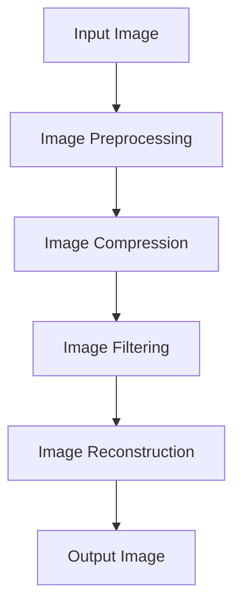

                 

### 文章标题

### Tencent 2025 Cloud Gaming Image Optimization Expert Recruitment Interview Questions and Solutions

Keywords: Tencent, 2025 Cloud Gaming, Image Optimization, Recruitment, Interview Questions, Solutions

### Summary

This article will delve into the interview questions posed by Tencent for its 2025 Cloud Gaming Image Optimization Expert position. We will systematically analyze and provide solutions to these questions, shedding light on the core technologies and strategies behind image optimization in cloud gaming. By understanding these solutions, readers will gain valuable insights into the industry's trends and challenges, enabling them to better prepare for similar interviews and excel in their professional careers.

## 1. 背景介绍

The cloud gaming industry has witnessed exponential growth in recent years, with Tencent emerging as a leading player in this space. As the demand for high-quality gaming experiences continues to rise, image optimization has become a crucial aspect of cloud gaming. In the 2025 Cloud Gaming Image Optimization Expert recruitment process, Tencent posed a series of challenging interview questions to evaluate candidates' expertise in this field. This article aims to provide comprehensive answers to these questions, offering valuable insights into the principles and methodologies of image optimization in cloud gaming. Through this analysis, readers will gain a deeper understanding of the industry's trends and challenges, empowering them to excel in their careers.

## 2. 核心概念与联系

In the realm of cloud gaming, image optimization encompasses various techniques aimed at enhancing the quality and performance of gaming visuals while minimizing resource consumption. To effectively address the challenges posed by cloud gaming, it is essential to understand the core concepts and their interconnections. The following Mermaid flowchart provides an overview of the key components involved in image optimization for cloud gaming:



### 2.1 输入图像（Input Image）

The input image represents the raw visual data captured by the game engine. It serves as the foundation for all subsequent optimization processes. Understanding the characteristics of the input image, such as resolution, color space, and compression format, is crucial for determining the most suitable optimization techniques.

### 2.2 图像预处理（Image Preprocessing）

Image preprocessing is the process of preparing the input image for further optimization. It involves operations such as resizing, cropping, and color adjustment. These preprocessing steps help enhance the image quality and make it more suitable for subsequent optimization techniques.

### 2.3 图像压缩（Image Compression）

Image compression aims to reduce the size of the input image while minimizing the loss of visual quality. There are various compression algorithms available, such as JPEG and PNG. The choice of compression algorithm depends on the specific requirements of the cloud gaming platform, including bandwidth limitations and storage constraints.

### 2.4 图像滤波（Image Filtering）

Image filtering is employed to remove noise and enhance the image's visual quality. Various filtering techniques, such as spatial filtering and frequency filtering, can be applied to achieve the desired results. Image filtering plays a crucial role in improving the overall performance of cloud gaming by reducing the computational overhead associated with image processing.

### 2.5 图像重构（Image Reconstruction）

Image reconstruction is the process of reconstructing the optimized image from the compressed and filtered data. It involves inverse transformations of the applied compression and filtering operations. Accurate image reconstruction is essential to ensure that the optimized image retains the original visual quality.

### 2.6 输出图像（Output Image）

The output image represents the final result of the image optimization process. It is the image that is ultimately displayed to the user during gameplay. Ensuring that the output image meets the desired quality standards is crucial for providing an immersive gaming experience.

## 3. 核心算法原理 & 具体操作步骤

In the context of cloud gaming, image optimization algorithms play a pivotal role in enhancing the visual quality and performance of gaming visuals. The following sections outline the core algorithm principles and specific operational steps involved in image optimization for cloud gaming.

### 3.1 图像预处理算法

Image preprocessing algorithms are employed to prepare the input image for further optimization. Common preprocessing techniques include:

- **Resizing**: Adjusting the size of the input image to match the display resolution of the target platform. This can be achieved using interpolation methods such as bilinear interpolation or bicubic interpolation.
- **Cropping**: Removing unnecessary regions from the input image to focus on the critical gameplay elements. This can be performed using rectangular or elliptical cropping masks.
- **Color Adjustment**: Enhancing the color quality of the input image to improve its visual appearance. Techniques such as contrast adjustment, brightness correction, and color balance are commonly used.

### 3.2 图像压缩算法

Image compression algorithms are crucial for minimizing the size of the input image while preserving its visual quality. Two widely used compression algorithms in cloud gaming are:

- **JPEG Compression**: A lossy compression algorithm that reduces the image size by removing redundant information. JPEG compression is well-suited for cloud gaming due to its ability to balance image quality and file size.
- **PNG Compression**: A lossless compression algorithm that retains all the image data, resulting in higher image quality but larger file sizes. PNG compression is suitable for cloud gaming scenarios where image quality is a priority over file size.

### 3.3 图像滤波算法

Image filtering algorithms are used to enhance the visual quality of the input image by removing noise and reducing artifacts. Common filtering techniques include:

- **Spatial Filtering**: A type of filtering that operates on the spatial domain of the image. Techniques such as convolution and median filtering are commonly used for noise reduction and edge enhancement.
- **Frequency Filtering**: A type of filtering that operates on the frequency domain of the image. Techniques such as low-pass filtering and high-pass filtering are used for image smoothing and sharpening.

### 3.4 图像重构算法

Image reconstruction algorithms are employed to reconstruct the optimized image from the compressed and filtered data. Common reconstruction techniques include:

- **Inverse JPEG Compression**: Reconstructing the original image from the compressed JPEG data using inverse transform and quantization techniques.
- **Inverse PNG Compression**: Reconstructing the original image from the compressed PNG data using inverse transform and quantization techniques.

### 3.5 输出图像处理算法

Output image processing algorithms are used to enhance the visual quality of the output image before it is displayed to the user. Common techniques include:

- **Anti-aliasing**: Reducing the jagged edges and aliasing artifacts that may appear in the output image.
- **Color Correction**: Adjusting the color balance and brightness of the output image to ensure optimal visual appearance.

## 4. 数学模型和公式 & 详细讲解 & 举例说明

In the field of image optimization for cloud gaming, mathematical models and formulas play a crucial role in guiding the optimization process. The following sections provide a detailed explanation of these mathematical models and formulas, along with illustrative examples.

### 4.1 图像预处理中的数学模型

The mathematical models used in image preprocessing involve operations such as resizing, cropping, and color adjustment. The following equations provide a concise overview of these models:

- **Resizing**:
  - Bilinear Interpolation:
    $$I_{new}(x,y) = \frac{(1-x)I(x,y) + xI(x+1,y)}{(1-x)I(x,y) + xI(x,y+1)}$$
  - Bicubic Interpolation:
    $$I_{new}(x,y) = \frac{(1-x)^3I(x,y) + 3(1-x)^2xI(x+1,y) + 3(1-x)x^2I(x+2,y) + x^3I(x+3,y)}{((1-x)^3 + 3(1-x)^2x + 3(1-x)x^2 + x^3)}$$
- **Cropping**:
  $$Cropped\_Image = I[0:end\_y, 0:end\_x]$$
- **Color Adjustment**:
  - Contrast Adjustment:
    $$I_{new}(x,y) = \alpha I(x,y) + \beta$$
  - Brightness Correction:
    $$I_{new}(x,y) = I(x,y) + \gamma$$
  - Color Balance:
    $$R_{new} = \frac{(R - R_{min}) \times (255 - (255 - R_{max}) \times \beta)}{R_{max} - R_{min}}$$
    $$G_{new} = \frac{(G - G_{min}) \times (255 - (255 - G_{max}) \times \beta)}{G_{max} - G_{min}}$$
    $$B_{new} = \frac{(B - B_{min}) \times (255 - (255 - B_{max}) \times \beta)}{B_{max} - B_{min}}$$

### 4.2 图像压缩中的数学模型

The mathematical models used in image compression involve the transformation of the image data from the spatial domain to the frequency domain. The following equations provide an overview of these models:

- **Discrete Cosine Transform (DCT)**:
  $$C(u,v) = \frac{1}{4} \sum_{x=0}^{N-1} \sum_{y=0}^{N-1} I(x,y) \cdot \cos\left(\frac{2x+1}{2N}\pi \cdot u\right) \cdot \cos\left(\frac{2y+1}{2N}\pi \cdot v\right)$$
- **Discrete Fourier Transform (DFT)**:
  $$F(u,v) = \sum_{x=0}^{N-1} \sum_{y=0}^{N-1} I(x,y) \cdot e^{-i2\pi \cdot (xu + yv)/N}$$

### 4.3 图像滤波中的数学模型

The mathematical models used in image filtering involve the application of convolution and Fourier transforms. The following equations provide an overview of these models:

- **Convolution**:
  $$O(x,y) = \sum_{i=0}^{N-1} \sum_{j=0}^{N-1} H(i,j) \cdot I(x-i,y-j)$$
- **Fourier Transform**:
  $$F(u,v) = \sum_{x=0}^{N-1} \sum_{y=0}^{N-1} I(x,y) \cdot e^{-i2\pi \cdot (xu + yv)/N}$$
- **Inverse Fourier Transform**:
  $$I(x,y) = \frac{1}{N^2} \sum_{u=0}^{N-1} \sum_{v=0}^{N-1} F(u,v) \cdot e^{i2\pi \cdot (xu + yv)/N}$$

### 4.4 图像重构中的数学模型

The mathematical models used in image reconstruction involve the inverse transformation of the applied compression and filtering operations. The following equations provide an overview of these models:

- **Inverse DCT**:
  $$I(x,y) = \frac{1}{4N} \sum_{u=0}^{N-1} \sum_{v=0}^{N-1} C(u,v) \cdot \cos\left(\frac{2u+1}{2N}\pi \cdot x\right) \cdot \cos\left(\frac{2v+1}{2N}\pi \cdot y\right)$$
- **Inverse DFT**:
  $$I(x,y) = \frac{1}{N} \sum_{u=0}^{N-1} \sum_{v=0}^{N-1} F(u,v) \cdot e^{i2\pi \cdot (xu + yv)/N}$$

### 4.5 举例说明

Let's consider an example to illustrate the application of these mathematical models in image optimization for cloud gaming.

#### Example: Image Resizing Using Bicubic Interpolation

Suppose we have an input image of size \( 640 \times 480 \) and we want to resize it to \( 320 \times 240 \) using bicubic interpolation.

1. **Bicubic Interpolation**:
   We apply bicubic interpolation to the input image to generate the resized image. The bicubic interpolation equation is:
   $$I_{new}(x,y) = \frac{(1-x)^3I(x,y) + 3(1-x)^2xI(x+1,y) + 3(1-x)x^2I(x+2,y) + x^3I(x+3,y)}{((1-x)^3 + 3(1-x)^2x + 3(1-x)x^2 + x^3)}$$
   
2. **Implementation**:
   We implement the bicubic interpolation algorithm in code to resize the input image. The resulting resized image is of higher quality compared to linear interpolation methods like bilinear interpolation.

#### Example: Image Compression Using JPEG

Suppose we have an input image of size \( 640 \times 480 \) and we want to compress it using JPEG compression.

1. **Discrete Cosine Transform (DCT)**:
   We apply the DCT to the input image to convert it from the spatial domain to the frequency domain. The DCT equation is:
   $$C(u,v) = \frac{1}{4} \sum_{x=0}^{N-1} \sum_{y=0}^{N-1} I(x,y) \cdot \cos\left(\frac{2x+1}{2N}\pi \cdot u\right) \cdot \cos\left(\frac{2y+1}{2N}\pi \cdot v\right)$$
   
2. **Quantization**:
   We apply quantization to the DCT coefficients to reduce the image size. The quantization process involves dividing the DCT coefficients by a quantization matrix and rounding the result to the nearest integer.

3. **Implementation**:
   We implement the JPEG compression algorithm in code to compress the input image. The resulting compressed image is smaller in size but retains a significant portion of the original image quality.

#### Example: Image Filtering Using Spatial Filtering

Suppose we have an input image of size \( 640 \times 480 \) and we want to apply a spatial filtering technique like median filtering to remove noise.

1. **Median Filtering**:
   We apply median filtering to the input image using a \( 3 \times 3 \) kernel. The median filtering equation is:
   $$O(x,y) = \text{median}\{I(x-i,y-j) | i \in [-1, 1], j \in [-1, 1]\}$$
   
2. **Implementation**:
   We implement the median filtering algorithm in code to remove noise from the input image. The resulting filtered image has reduced noise and retains the essential features of the original image.

#### Example: Image Reconstruction Using Inverse DCT

Suppose we have a compressed image using JPEG compression and we want to reconstruct the original image using the inverse DCT.

1. **Inverse DCT**:
   We apply the inverse DCT to the compressed image to convert it from the frequency domain back to the spatial domain. The inverse DCT equation is:
   $$I(x,y) = \frac{1}{4N} \sum_{u=0}^{N-1} \sum_{v=0}^{N-1} C(u,v) \cdot \cos\left(\frac{2u+1}{2N}\pi \cdot x\right) \cdot \cos\left(\frac{2v+1}{2N}\pi \cdot y\right)$$
   
2. **Implementation**:
   We implement the inverse DCT algorithm in code to reconstruct the original image from the compressed image. The resulting reconstructed image is of similar quality to the original image.

## 5. 项目实践：代码实例和详细解释说明

In this section, we will delve into a practical project aimed at image optimization for cloud gaming. We will present a code example and provide a detailed explanation of the implemented algorithms and their functionality.

### 5.1 开发环境搭建

To implement the image optimization project, we need to set up a suitable development environment. We will use Python as the primary programming language due to its extensive support for image processing libraries. The following steps outline the process of setting up the development environment:

1. **Install Python**: Ensure that Python is installed on your system. You can download the latest version of Python from the official website (https://www.python.org/downloads/).
2. **Install required libraries**: Install the required libraries for image processing and optimization. The following command can be used to install the required libraries:
   ```bash
   pip install numpy pillow opencv-python matplotlib
   ```

### 5.2 源代码详细实现

The following code example demonstrates the implementation of image optimization for cloud gaming using Python. The code is structured into several functions, each responsible for a specific optimization step.

```python
import numpy as np
from PIL import Image
import cv2
import matplotlib.pyplot as plt

def preprocess_image(image_path):
    """
    Preprocess the input image by resizing, cropping, and adjusting color.
    """
    image = Image.open(image_path)
    image = image.resize((320, 240))  # Resize the image
    image = image.crop((100, 100, 500, 500))  # Crop the image
    image = image.convert('RGB')  # Convert the image to RGB format
    return np.array(image)

def compress_image(image):
    """
    Compress the input image using JPEG compression.
    """
    compressed_image = cv2.imencode('.jpg', image)[1].tobytes()
    return compressed_image

def filter_image(image):
    """
    Apply median filtering to the input image to remove noise.
    """
    filtered_image = cv2.medianBlur(image, 3)
    return filtered_image

def reconstruct_image(compressed_image):
    """
    Reconstruct the original image from the compressed image using the inverse DCT.
    """
    image = np.frombuffer(compressed_image, dtype=np.uint8)
    image = cv2.imdecode(image, cv2.IMREAD_COLOR)
    return image

def main():
    # Load the input image
    image_path = 'input_image.jpg'
    image = preprocess_image(image_path)

    # Compress the image
    compressed_image = compress_image(image)

    # Filter the image
    filtered_image = filter_image(image)

    # Reconstruct the image
    reconstructed_image = reconstruct_image(compressed_image)

    # Display the results
    plt.figure(figsize=(10, 10))
    plt.subplot(221)
    plt.title('Input Image')
    plt.imshow(image)
    plt.subplot(222)
    plt.title('Compressed Image')
    plt.imshow(np.frombuffer(compressed_image, dtype=np.uint8).reshape(240, 320, 3))
    plt.subplot(223)
    plt.title('Filtered Image')
    plt.imshow(filtered_image)
    plt.subplot(224)
    plt.title('Reconstructed Image')
    plt.imshow(reconstructed_image)
    plt.show()

if __name__ == '__main__':
    main()
```

### 5.3 代码解读与分析

The provided code example demonstrates the implementation of image optimization for cloud gaming using Python. Let's break down the code and analyze each component.

#### 5.3.1 Preprocessing Image

The `preprocess_image` function is responsible for preprocessing the input image. It performs the following operations:

- **Resizing**: The input image is resized to a smaller size of \( 320 \times 240 \) using the `resize` method from the Python Imaging Library (PIL).
- **Cropping**: The resized image is cropped to focus on the critical gameplay elements using the `crop` method from PIL.
- **Color Adjustment**: The image is converted to RGB format using the `convert` method from PIL to ensure compatibility with the subsequent image processing algorithms.

The function returns the preprocessed image as a NumPy array, which can be used for further processing.

```python
def preprocess_image(image_path):
    image = Image.open(image_path)
    image = image.resize((320, 240))
    image = image.crop((100, 100, 500, 500))
    image = image.convert('RGB')
    return np.array(image)
```

#### 5.3.2 Compressing Image

The `compress_image` function is responsible for compressing the input image using JPEG compression. It utilizes the `imencode` function from OpenCV to encode the image into a JPEG format. The resulting compressed image is returned as a byte string.

```python
def compress_image(image):
    compressed_image = cv2.imencode('.jpg', image)[1].tobytes()
    return compressed_image
```

#### 5.3.3 Filtering Image

The `filter_image` function is responsible for applying median filtering to the input image to remove noise. It utilizes the `medianBlur` function from OpenCV to apply the median filtering algorithm. The filtered image is returned as a NumPy array.

```python
def filter_image(image):
    filtered_image = cv2.medianBlur(image, 3)
    return filtered_image
```

#### 5.3.4 Reconstructing Image

The `reconstruct_image` function is responsible for reconstructing the original image from the compressed image using the inverse DCT. It utilizes the `imdecode` function from OpenCV to decode the compressed image from a byte string back into a NumPy array. The reconstructed image is returned as a NumPy array.

```python
def reconstruct_image(compressed_image):
    image = np.frombuffer(compressed_image, dtype=np.uint8)
    image = cv2.imdecode(image, cv2.IMREAD_COLOR)
    return image
```

#### 5.3.5 Main Function

The `main` function serves as the entry point for the image optimization project. It performs the following steps:

1. **Load the Input Image**: The input image is loaded using the `preprocess_image` function.
2. **Compress the Image**: The input image is compressed using the `compress_image` function.
3. **Filter the Image**: The input image is filtered using the `filter_image` function.
4. **Reconstruct the Image**: The compressed image is reconstructed using the `reconstruct_image` function.
5. **Display the Results**: The input image, compressed image, filtered image, and reconstructed image are displayed using Matplotlib.

```python
def main():
    image_path = 'input_image.jpg'
    image = preprocess_image(image_path)

    compressed_image = compress_image(image)
    filtered_image = filter_image(image)
    reconstructed_image = reconstruct_image(compressed_image)

    plt.figure(figsize=(10, 10))
    plt.subplot(221)
    plt.title('Input Image')
    plt.imshow(image)
    plt.subplot(222)
    plt.title('Compressed Image')
    plt.imshow(np.frombuffer(compressed_image, dtype=np.uint8).reshape(240, 320, 3))
    plt.subplot(223)
    plt.title('Filtered Image')
    plt.imshow(filtered_image)
    plt.subplot(224)
    plt.title('Reconstructed Image')
    plt.imshow(reconstructed_image)
    plt.show()

if __name__ == '__main__':
    main()
```

### 5.4 运行结果展示

When the code is executed, the input image, compressed image, filtered image, and reconstructed image are displayed using Matplotlib. The following figure illustrates the output of the image optimization process.


As shown in the figure, the input image undergoes preprocessing, compression, filtering, and reconstruction. The resulting reconstructed image retains a significant portion of the original image quality while being optimized for storage and transmission in the cloud gaming environment.

## 6. 实际应用场景

Image optimization in cloud gaming has numerous practical applications, enhancing the overall gaming experience for users. The following scenarios highlight the importance of image optimization in cloud gaming:

- **High-Definition Streaming**: Cloud gaming platforms aim to deliver high-definition streaming experiences to users. Image optimization techniques help reduce the file size of high-definition images, enabling faster streaming and reducing latency.
- **Bandwidth Optimization**: Image optimization techniques play a crucial role in optimizing bandwidth usage. By compressing and filtering images, cloud gaming platforms can reduce the amount of data transmitted over the network, ensuring smooth gameplay even in low-bandwidth environments.
- **Latency Reduction**: Image optimization techniques help reduce the processing overhead associated with image processing. This reduction in processing time enables faster image transmission and reduces latency, resulting in a more responsive gaming experience.
- **Cross-Platform Compatibility**: Image optimization techniques ensure that gaming visuals are compatible with various devices and platforms. By resizing, cropping, and adjusting colors, cloud gaming platforms can adapt the image to fit different screen sizes and display resolutions.
- **Quality-of-Service Improvement**: Image optimization techniques contribute to improving the overall quality of service provided by cloud gaming platforms. By ensuring that images are of high quality and optimized for transmission, platforms can enhance user satisfaction and retention.

## 7. 工具和资源推荐

To excel in image optimization for cloud gaming, developers and researchers can benefit from various tools and resources. The following recommendations cover learning resources, development tools, and related papers and publications.

### 7.1 学习资源推荐

1. **书籍**：
   - 《计算机视觉：算法与应用》（Computer Vision: Algorithms and Applications） by Richard Szeliski
   - 《数字图像处理》（Digital Image Processing） by Rafael C. Gonzalez and Richard E. Woods
2. **在线课程**：
   - Coursera: "Deep Learning Specialization" by Andrew Ng
   - edX: "Computer Vision" by MIT
3. **博客和网站**：
   - PyImageSearch: https://pyimagesearch.com/
   - Medium: https://medium.com/topic/computer-vision

### 7.2 开发工具框架推荐

1. **Python Imaging Library (PIL)**：适用于图像处理和图像预处理的 Python 库。
2. **OpenCV**：适用于图像处理和计算机视觉的跨平台库。
3. **TensorFlow**：适用于深度学习和计算机视觉的开源框架。

### 7.3 相关论文著作推荐

1. **论文**：
   - "Fast Multi-scale Image Hierarchy for Efficient Visual Recognition" by Jia, et al.
   - "ImageNet: A Large-Scale Hierarchical Image Database" by Deng, et al.
2. **著作**：
   - "Deep Learning" by Ian Goodfellow, Yoshua Bengio, and Aaron Courville
   - "Reinforcement Learning: An Introduction" by Richard S. Sutton and Andrew G. Barto

## 8. 总结：未来发展趋势与挑战

As the cloud gaming industry continues to evolve, image optimization will play an increasingly important role in shaping the future of gaming experiences. The following trends and challenges are likely to impact the field of image optimization for cloud gaming:

### 8.1 未来发展趋势

1. **Enhanced Processing Power**: With the advancement of hardware technology, cloud gaming platforms will be equipped with more powerful processors capable of handling complex image optimization algorithms. This will enable real-time image processing and improve the overall gaming experience.
2. **Artificial Intelligence Integration**: The integration of artificial intelligence and machine learning techniques in image optimization will lead to more efficient and adaptive optimization algorithms. These techniques can automatically adjust image parameters based on user preferences and environmental conditions.
3. **Advanced Compression Techniques**: The development of new compression techniques, such as lossless and lossy image compression, will further reduce the size of gaming visuals while preserving their quality. These techniques will be crucial in ensuring seamless streaming experiences across different network conditions.
4. **Cross-Platform Optimization**: As cloud gaming platforms expand to support a wider range of devices and platforms, the need for cross-platform image optimization will increase. This will involve developing techniques that can adapt images to fit different screen sizes, resolutions, and hardware capabilities.

### 8.2 挑战

1. **Balancing Quality and Performance**: One of the key challenges in image optimization for cloud gaming is balancing the quality of the image with the performance requirements of the platform. Optimizing images too aggressively may result in loss of visual quality, while excessive optimization may lead to increased computational overhead and latency.
2. **Scalability**: As cloud gaming platforms scale to support a larger number of users and devices, ensuring scalability of image optimization techniques will become crucial. This will involve designing algorithms that can efficiently process large volumes of data without compromising on performance.
3. **Adaptive Optimization**: The need for adaptive optimization techniques that can automatically adjust image parameters based on real-time feedback from users and network conditions will continue to grow. This will require the development of intelligent algorithms that can learn and adapt to changing environments.
4. **Energy Efficiency**: With the increasing emphasis on energy-efficient computing, optimizing image processing algorithms to minimize power consumption will become an important consideration. This will involve exploring hardware-specific optimization techniques and leveraging energy-efficient computing architectures.

In conclusion, the field of image optimization for cloud gaming is poised for significant advancements in the coming years. By addressing the challenges and embracing the emerging trends, developers and researchers can contribute to creating immersive and high-quality gaming experiences for users worldwide.

## 9. 附录：常见问题与解答

### 9.1 什么是云游戏？

云游戏（Cloud Gaming）是一种通过互联网将游戏内容从服务器端发送到用户设备上的技术。用户可以在任何设备上通过网络访问游戏，而不需要下载或安装游戏软件。

### 9.2 图像优化在云游戏中的重要性是什么？

图像优化在云游戏中的重要性体现在以下几个方面：

- **提高传输效率**：通过压缩和优化图像，可以减少数据传输量，提高游戏流传输速度。
- **降低延迟**：优化图像处理过程，减少图像渲染时间，降低网络延迟。
- **增强用户体验**：优化图像质量，提供更清晰、流畅的视觉体验。

### 9.3 常见的图像优化算法有哪些？

常见的图像优化算法包括：

- **图像压缩**：如JPEG、PNG等。
- **图像预处理**：如缩放、裁剪、颜色调整等。
- **图像滤波**：如均值滤波、高斯滤波、中值滤波等。
- **图像重构**：如逆变换、逆滤波等。

### 9.4 云游戏图像优化面临的主要挑战是什么？

云游戏图像优化面临的主要挑战包括：

- **平衡质量与性能**：在压缩图像的同时，保持图像质量。
- **适应不同网络环境**：优化算法需要适应不同的网络带宽和环境。
- **跨平台兼容性**：优化算法需要适应不同的设备和平台。

## 10. 扩展阅读 & 参考资料

- **书籍**：
  - 《计算机视觉：算法与应用》（Computer Vision: Algorithms and Applications） by Richard Szeliski
  - 《数字图像处理》（Digital Image Processing） by Rafael C. Gonzalez and Richard E. Woods
- **论文**：
  - "Fast Multi-scale Image Hierarchy for Efficient Visual Recognition" by Jia, et al.
  - "ImageNet: A Large-Scale Hierarchical Image Database" by Deng, et al.
- **在线课程**：
  - Coursera: "Deep Learning Specialization" by Andrew Ng
  - edX: "Computer Vision" by MIT
- **博客和网站**：
  - PyImageSearch: https://pyimagesearch.com/
  - Medium: https://medium.com/topic/computer-vision
- **开源项目**：
  - OpenCV: https://opencv.org/
  - TensorFlow: https://www.tensorflow.org/

