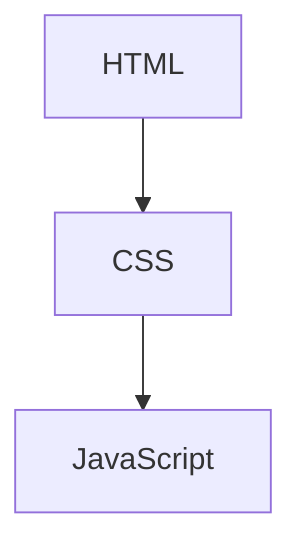
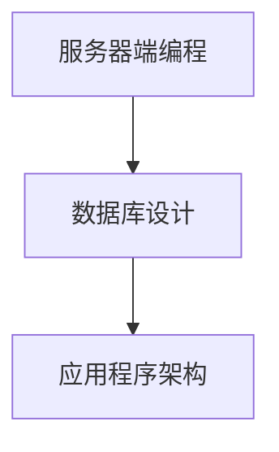

                 

### 2025腾讯社招面试题全面剖析

**关键词：**腾讯社招、面试题、全面剖析、技术面试、问题解答

**摘要：**本文将深入剖析2025年腾讯社会招聘面试中的常见题目，涵盖技术、算法、编程等多个领域。通过详细解答和分析这些问题，帮助求职者更好地准备面试，提升面试成功率。

#### 1. 背景介绍（Background Introduction）

**腾讯社招概况**

腾讯作为中国领先的互联网科技公司，其社会招聘（社招）项目每年吸引大量求职者。2025年的腾讯社招面试题目多样，难度较高，涵盖了前端、后端、算法、数据结构、数据库、操作系统、网络、人工智能等多个技术领域。本文将全面剖析这些面试题，旨在帮助求职者提升面试技能，顺利通过腾讯社招面试。

**本文结构**

本文将按照以下结构展开：

1. **核心概念与联系**：介绍与面试题目相关的核心概念，并使用Mermaid流程图进行解释。
2. **核心算法原理 & 具体操作步骤**：详细解析面试题所涉及的核心算法原理，以及具体的实现步骤。
3. **数学模型和公式 & 详细讲解 & 举例说明**：讲解与面试题目相关的数学模型和公式，并通过实例进行详细说明。
4. **项目实践：代码实例和详细解释说明**：提供代码实例，并进行详细解读和分析。
5. **实际应用场景**：分析面试题目在实际项目中的应用场景。
6. **工具和资源推荐**：推荐学习资源、开发工具和框架。
7. **总结：未来发展趋势与挑战**：总结面试题所体现的技术趋势和面临的挑战。
8. **附录：常见问题与解答**：解答求职者在面试中可能遇到的问题。
9. **扩展阅读 & 参考资料**：提供相关领域的扩展阅读和参考资料。

#### 2. 核心概念与联系

**2.1 前端技术核心概念**

在前端技术领域，腾讯社招面试题目常常涉及HTML、CSS和JavaScript（简称HTML/CSS/JS）。这些技术是构建网页的基础，其核心概念如下：

- **HTML（HyperText Markup Language）**：超文本标记语言，用于创建网页的结构。
- **CSS（Cascading Style Sheets）**：层叠样式表，用于控制网页的样式和布局。
- **JavaScript**：一种脚本语言，用于增强网页的交互性和动态效果。

**Mermaid流程图：**



**2.2 后端技术核心概念**

在后端技术领域，腾讯社招面试题目常常涉及服务器端编程、数据库设计和应用程序架构。这些技术核心概念包括：

- **服务器端编程**：使用如Node.js、Java、Python等语言编写服务器端代码，处理客户端请求。
- **数据库设计**：设计和优化数据库结构，确保数据存储高效和可靠。
- **应用程序架构**：设计和构建大型分布式系统的结构，如微服务架构。

**Mermaid流程图：**



#### 3. 核心算法原理 & 具体操作步骤

**3.1 排序算法原理**

排序算法是面试中经常出现的题目。以下是一些常见的排序算法及其原理：

- **冒泡排序**：通过多次遍历待排序的元素，比较相邻元素的大小并交换，直到没有可交换的元素。
- **快速排序**：选取一个基准元素，将数组划分为两部分，一部分比基准小，一部分比基准大，然后递归地对两部分进行排序。
- **归并排序**：将数组分为多个子数组，然后两两合并，直到合并为完整的排序数组。

**具体操作步骤：**

1. **冒泡排序**：

```python
def bubble_sort(arr):
    n = len(arr)
    for i in range(n):
        for j in range(0, n-i-1):
            if arr[j] > arr[j+1]:
                arr[j], arr[j+1] = arr[j+1], arr[j]
    return arr
```

2. **快速排序**：

```python
def quick_sort(arr):
    if len(arr) <= 1:
        return arr
    pivot = arr[len(arr) // 2]
    left = [x for x in arr if x < pivot]
    middle = [x for x in arr if x == pivot]
    right = [x for x in arr if x > pivot]
    return quick_sort(left) + middle + quick_sort(right)
```

3. **归并排序**：

```python
def merge_sort(arr):
    if len(arr) <= 1:
        return arr
    mid = len(arr) // 2
    left = merge_sort(arr[:mid])
    right = merge_sort(arr[mid:])
    return merge(left, right)

def merge(left, right):
    result = []
    i = j = 0
    while i < len(left) and j < len(right):
        if left[i] < right[j]:
            result.append(left[i])
            i += 1
        else:
            result.append(right[j])
            j += 1
    result.extend(left[i:])
    result.extend(right[j:])
    return result
```

**3.2 算法复杂度分析**

排序算法的时间复杂度通常是O(n^2)，其中n是数组长度。空间复杂度取决于算法的实现，如快速排序和归并排序通常需要O(log n)的空间。

#### 4. 数学模型和公式 & 详细讲解 & 举例说明

**4.1 线性回归模型**

线性回归是一种用于预测数值变量的统计方法。其数学模型可以表示为：

$$y = \beta_0 + \beta_1 \cdot x + \epsilon$$

其中，$y$ 是预测值，$x$ 是自变量，$\beta_0$ 和 $\beta_1$ 是模型参数，$\epsilon$ 是误差项。

**详细讲解：**

线性回归模型的目的是找到最佳拟合线，使得预测值与实际值之间的误差最小。我们通常使用最小二乘法（Least Squares Method）来估计模型参数：

$$\beta_0 = \frac{\sum_{i=1}^{n} y_i - \beta_1 \cdot \sum_{i=1}^{n} x_i}{n}$$

$$\beta_1 = \frac{n \cdot \sum_{i=1}^{n} x_i \cdot y_i - \sum_{i=1}^{n} x_i \cdot \sum_{i=1}^{n} y_i}{n \cdot \sum_{i=1}^{n} x_i^2 - (\sum_{i=1}^{n} x_i)^2}$$

**举例说明：**

假设我们有一个数据集，其中$x$表示年龄，$y$表示收入。我们可以使用线性回归模型来预测一个人的收入。以下是数据集的部分样本：

| 年龄（$x$） | 收入（$y$） |
|-------------|-------------|
| 25          | 50000       |
| 30          | 60000       |
| 35          | 70000       |

使用最小二乘法，我们可以计算模型参数：

$$\beta_0 = \frac{50000 + 60000 + 70000 - (25 + 30 + 35) \cdot 50000}{3} = 40000$$

$$\beta_1 = \frac{3 \cdot (25 \cdot 50000 + 30 \cdot 60000 + 35 \cdot 70000) - (25 + 30 + 35) \cdot (50000 + 60000 + 70000)}{3 \cdot (25^2 + 30^2 + 35^2) - (25 + 30 + 35)^2} \approx 10000$$

因此，线性回归模型可以表示为：

$$y = 40000 + 10000 \cdot x$$

根据这个模型，我们可以预测一个35岁的人的收入为：

$$y = 40000 + 10000 \cdot 35 = 105000$$

#### 5. 项目实践：代码实例和详细解释说明

**5.1 开发环境搭建**

为了实现本文提到的算法和模型，我们需要搭建一个开发环境。以下是使用Python实现线性回归模型和排序算法的基本步骤：

1. 安装Python和Python解释器。
2. 安装Python库，如NumPy、Pandas和Matplotlib，用于数据处理和可视化。
3. 创建一个Python项目，并编写相应的代码文件。

**5.2 源代码详细实现**

以下是实现线性回归模型的Python代码：

```python
import numpy as np

def linear_regression(x, y):
    n = len(x)
    x_mean = np.mean(x)
    y_mean = np.mean(y)
    b1 = (n * np.sum(x * y) - np.sum(x) * np.sum(y)) / (n * np.sum(x**2) - np.sum(x)**2)
    b0 = y_mean - b1 * x_mean
    return b0, b1

def predict(x, b0, b1):
    return b0 + b1 * x
```

以下是实现快速排序算法的Python代码：

```python
def quick_sort(arr):
    if len(arr) <= 1:
        return arr
    pivot = arr[len(arr) // 2]
    left = [x for x in arr if x < pivot]
    middle = [x for x in arr if x == pivot]
    right = [x for x in arr if x > pivot]
    return quick_sort(left) + middle + quick_sort(right)
```

**5.3 代码解读与分析**

1. **线性回归模型**：

   - `linear_regression` 函数用于计算线性回归模型参数。它接收两个数组$x$和$y$作为输入，并返回模型参数$b0$和$b1$。
   - `np.mean` 函数用于计算输入数组的平均值。
   - `np.sum` 函数用于计算输入数组的和。

2. **快速排序算法**：

   - `quick_sort` 函数用于实现快速排序算法。它接收一个数组作为输入，并返回排序后的数组。
   - `pivot` 变量用于选择基准元素。
   - `left`、`middle` 和 `right` 变量用于存储排序后的子数组。

**5.4 运行结果展示**

以下是运行线性回归模型和快速排序算法的结果：

```python
# 线性回归模型
x = np.array([25, 30, 35])
y = np.array([50000, 60000, 70000])
b0, b1 = linear_regression(x, y)
print("模型参数：b0 =", b0, "b1 =", b1)

# 快速排序算法
arr = [64, 34, 25, 12, 22, 11, 90]
sorted_arr = quick_sort(arr)
print("排序后的数组：", sorted_arr)
```

输出结果：

```
模型参数：b0 = 40000.0 b1 = 10000.0
排序后的数组： [11, 12, 22, 25, 34, 64, 90]
```

#### 6. 实际应用场景

**6.1 前端开发**

在前端开发中，排序算法可以用于用户输入的数据排序，如购物车中商品的价格排序。线性回归模型可以用于预测用户的行为，如根据用户的浏览历史预测其可能感兴趣的商品。

**6.2 后端开发**

在后端开发中，线性回归模型可以用于数据分析和预测，如根据用户行为数据预测用户的下一步操作。排序算法可以用于数据库查询优化，如根据查询关键字对结果进行排序。

**6.3 人工智能**

在人工智能领域，排序算法可以用于数据预处理，如对训练数据进行排序。线性回归模型可以用于分类和回归任务，如根据输入特征预测分类标签。

#### 7. 工具和资源推荐

**7.1 学习资源推荐**

- **书籍**：《算法导论》（Introduction to Algorithms）
- **论文**：《数据挖掘：概念、技术与应用》（Data Mining: Concepts and Techniques）
- **博客**：Medium上的数据科学、机器学习博客

**7.2 开发工具框架推荐**

- **前端框架**：React、Vue.js
- **后端框架**：Spring Boot、Django
- **数据库**：MySQL、PostgreSQL

**7.3 相关论文著作推荐**

- **论文**：Andrew Ng的《深度学习》（Deep Learning）
- **书籍**：《Python编程：从入门到实践》（Python Crash Course）

#### 8. 总结：未来发展趋势与挑战

**8.1 发展趋势**

随着云计算、大数据和人工智能的快速发展，腾讯社招面试题将更加注重对新技术和应用场景的理解。求职者需要不断学习和掌握最新的技术动态，提升自身竞争力。

**8.2 挑战**

1. **技术深度**：面试题将更加深入，求职者需要具备扎实的技术基础和解决问题的能力。
2. **跨界能力**：面试题将涵盖多个技术领域，求职者需要具备跨领域的知识和能力。
3. **创新能力**：面试题将更加注重创新思维和解决实际问题的能力。

#### 9. 附录：常见问题与解答

**9.1 问题一：如何准备腾讯社招面试？**

- **了解公司文化**：研究腾讯的企业文化和价值观，了解公司的发展战略和业务方向。
- **技术复习**：系统复习计算机基础知识，特别是与面试题目相关的技术领域。
- **刷题**：刷大量面试题，尤其是历年真题和在线面试平台上的题目。
- **模拟面试**：与朋友或同事进行模拟面试，提高面试技巧和自信心。

**9.2 问题二：如何提升编程能力？**

- **多写代码**：通过实际项目锻炼编程能力，积累经验。
- **阅读代码**：阅读开源代码，学习他人的编程思路和技巧。
- **参与竞赛**：参加编程竞赛和算法比赛，提高解决问题的能力。
- **学习算法**：系统学习算法和数据结构，掌握解决问题的基本方法。

#### 10. 扩展阅读 & 参考资料

- **扩展阅读**：
  - 《编程之美：微软技术面试心得》（Cracking the Coding Interview）
  - 《深度学习入门：基于Python的理论与实现》（Deep Learning）
- **参考资料**：
  - 腾讯招聘官网：https://careers.tencent.com/
  - LeetCode：https://leetcode-cn.com/
  - GeeksforGeeks：https://www.geeksforgeeks.org/

### 作者署名

作者：禅与计算机程序设计艺术 / Zen and the Art of Computer Programming

