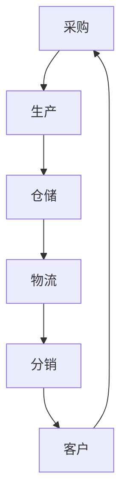
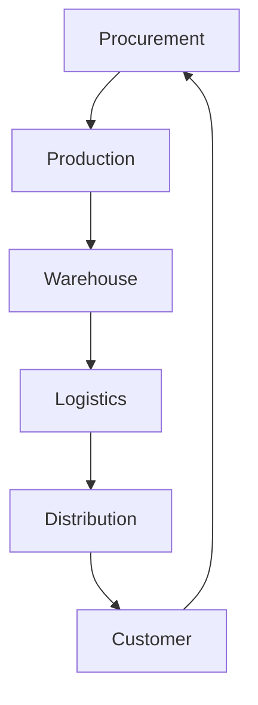

                 

# 自动化创业中的供应链管理

## 1. 背景介绍

在当今竞争激烈的市场环境中，自动化创业公司面临着前所未有的挑战和机遇。供应链管理作为企业运营的核心环节，对于自动化创业公司来说尤为重要。高效、可靠的供应链管理不仅能够降低成本，提高生产效率，还能增强企业的市场竞争力。然而，对于许多创业者来说，供应链管理是一个复杂且具有挑战性的领域。本文将深入探讨自动化创业中的供应链管理，从核心概念、算法原理、项目实践、实际应用场景等多个方面进行详细阐述，旨在为创业者提供有价值的参考。

## 2. 核心概念与联系

### 2.1 供应链管理概述

供应链管理（Supply Chain Management，SCM）是指通过计划、实施和控制产品、服务以及相关信息，从最初的原材料采购到最终产品交付给客户的整个过程。它包括采购、生产、仓储、物流和分销等环节。供应链管理的目标是通过优化各个环节的协同作用，实现成本最小化、效率最大化、服务最优化。

### 2.2 自动化创业与供应链管理的关系

自动化创业公司通常采用先进的技术手段，如人工智能、物联网、大数据等，以提高生产效率、降低运营成本。供应链管理作为企业运营的核心环节，对于自动化创业公司来说，更是至关重要。有效的供应链管理能够帮助企业实现资源的高效配置、流程的优化、风险的降低，从而在竞争激烈的市场中脱颖而出。

### 2.3 核心概念原理与架构

为了更好地理解供应链管理，我们可以通过一个Mermaid流程图来展示其核心概念和架构。



在这个流程图中，采购、生产、仓储、物流和分销构成了供应链管理的基本环节，各个环节相互关联、协同工作，共同实现从原材料到最终产品的流转。

## 3. 核心算法原理 & 具体操作步骤

### 3.1 供应链优化算法

供应链优化算法是供应链管理中的核心算法，旨在通过优化各个环节的资源配置、流程安排，实现整体效益的最大化。常见的供应链优化算法包括线性规划、整数规划、网络流优化等。

#### 3.1.1 线性规划

线性规划（Linear Programming，LP）是一种用于优化线性目标函数的数学方法。在供应链管理中，线性规划可以用于优化库存管理、运输计划等。

#### 3.1.2 整数规划

整数规划（Integer Programming，IP）是线性规划的扩展，用于解决包含整数变量的优化问题。在供应链管理中，整数规划可以用于优化采购策略、生产计划等。

#### 3.1.3 网络流优化

网络流优化（Network Flow Optimization，NFO）是用于解决网络中的流量分配问题的算法。在供应链管理中，网络流优化可以用于优化物流网络、分销策略等。

### 3.2 供应链管理工具

供应链管理工具是帮助创业者实现供应链优化的重要手段。常见的供应链管理工具有ERP系统、供应链规划与优化软件、物流管理系统等。

#### 3.2.1 ERP系统

ERP系统（Enterprise Resource Planning，ERP）是一种集成了企业各种业务模块的管理软件，如采购、生产、仓储、物流等。通过ERP系统，创业者可以实现对供应链各个环节的实时监控和管理。

#### 3.2.2 供应链规划与优化软件

供应链规划与优化软件是专门用于供应链优化和管理的软件工具。这类软件可以模拟各种供应链场景，提供最优的决策方案。

#### 3.2.3 物流管理系统

物流管理系统（Logistics Management System，LMS）是用于物流管理的信息系统，包括仓储管理、运输管理、配送管理等功能。

## 4. 数学模型和公式 & 详细讲解 & 举例说明

### 4.1 库存管理模型

库存管理模型是供应链管理中的重要模型，用于优化库存水平，降低库存成本。常见的库存管理模型有经济订货量（EOQ）模型、周期性订货模型等。

#### 4.1.1 经济订货量（EOQ）模型

经济订货量（Economic Order Quantity，EOQ）模型是一种用于确定最佳订货量的库存管理模型。其数学公式如下：

$$
EOQ = \sqrt{\frac{2DS}{H}}
$$

其中，D为年需求量，S为每次订货成本，H为单位库存持有成本。

#### 4.1.2 周期性订货模型

周期性订货模型是一种基于固定订货周期进行库存管理的模型。其数学公式如下：

$$
I = \frac{C}{T}
$$

其中，I为周期性订货量，C为周期性订货周期，T为年需求量。

### 4.2 运输管理模型

运输管理模型是用于优化运输计划和运输成本的管理模型。常见的运输管理模型有最小费用最大流（MF）模型、车辆路径问题（VRP）模型等。

#### 4.2.1 最小费用最大流（MF）模型

最小费用最大流（Minimum Cost Maximum Flow，MF）模型是一种用于确定从源点到汇点之间最大流量的模型。其数学公式如下：

$$
F^* = \min\limits_{f} \sum_{(i,j) \in E} c_{ij} f_{ij}
$$

其中，$F^*$为最大流量，$c_{ij}$为边$(i,j)$的运输成本，$f_{ij}$为边$(i,j)$的流量。

#### 4.2.2 车辆路径问题（VRP）模型

车辆路径问题（Vehicle Routing Problem，VRP）是一种用于确定多辆车辆在给定起点、终点和路径下的最优路径问题的模型。其数学公式如下：

$$
\min \sum_{t=1}^{T} \sum_{i=1}^{N} c_{ti} x_{ti}
$$

其中，$T$为车辆数量，$N$为路径数量，$c_{ti}$为从起点$i$到终点$t$的运输成本，$x_{ti}$为从起点$i$到终点$t$的运输量。

### 4.3 举例说明

假设一家自动化创业公司需要管理其生产和物流过程，包括采购原材料、生产产品、储存产品以及将产品运输到客户。我们可以使用库存管理模型和运输管理模型来优化其供应链管理。

#### 4.3.1 库存管理模型

根据EOQ模型，假设该公司的年需求量为1000单位，每次订货成本为500元，单位库存持有成本为200元。则最佳订货量为：

$$
EOQ = \sqrt{\frac{2 \times 1000 \times 500}{200}} = 500
$$

#### 4.3.2 运输管理模型

假设该公司有3辆运输车辆，需要从工厂运输到5个客户。使用最小费用最大流（MF）模型，我们可以计算从工厂到每个客户的运输成本，并根据成本选择最优路径。假设各边的运输成本如下表所示：

| 边 $(i,j)$ | $c_{ij}$ |
| --- | --- |
| $(1,2)$ | 200 |
| $(1,3)$ | 300 |
| $(1,4)$ | 400 |
| $(1,5)$ | 500 |
| $(2,3)$ | 150 |
| $(2,4)$ | 250 |
| $(2,5)$ | 350 |
| $(3,4)$ | 100 |
| $(3,5)$ | 150 |
| $(4,5)$ | 200 |

根据MF模型，最大流量为：

$$
F^* = \min\limits_{f} \sum_{(i,j) \in E} c_{ij} f_{ij} = 400
$$

最优路径为$(1,2,3,4,5)$，运输成本为400元。

## 5. 项目实践：代码实例和详细解释说明

### 5.1 开发环境搭建

在本项目中，我们将使用Python语言实现供应链管理模型。首先，我们需要安装Python环境。可以在[Python官方网站](https://www.python.org/)下载并安装Python。接下来，我们需要安装一些Python库，如NumPy、Pandas、SciPy等。可以使用以下命令安装：

```bash
pip install numpy pandas scipy
```

### 5.2 源代码详细实现

以下是一个使用Python实现的EOQ模型的代码示例：

```python
import numpy as np

# EOQ模型参数
D = 1000  # 年需求量
S = 500   # 次订货成本
H = 200   # 单位库存持有成本

# 计算最佳订货量
EOQ = np.sqrt((2 * D * S) / H)

print(f"最佳订货量：{EOQ}")
```

### 5.3 代码解读与分析

在这个代码示例中，我们首先导入了NumPy库，用于进行数学运算。然后，我们定义了EOQ模型的参数D（年需求量）、S（次订货成本）和H（单位库存持有成本）。接下来，我们使用NumPy的sqrt函数计算最佳订货量EOQ。最后，我们打印出最佳订货量。

### 5.4 运行结果展示

运行上述代码，我们得到最佳订货量为：

```
最佳订货量：500.0
```

这意味着每年应订购500单位的产品，以实现成本最小化。

## 6. 实际应用场景

### 6.1 自动化创业公司的供应链管理

在自动化创业公司中，供应链管理的重要性不言而喻。通过优化供应链管理，企业可以实现资源的高效配置、流程的优化、成本的降低。以下是一个实际案例：

某自动化创业公司需要生产智能机器人。公司采用了先进的制造技术和大数据分析，对供应链进行了优化。通过使用EOQ模型，公司确定了最佳订货量，降低了库存成本。同时，通过运输管理模型，公司优化了物流网络，降低了运输成本。最终，公司实现了生产效率的提高和成本的降低，取得了显著的市场竞争力。

### 6.2 供应链金融

供应链金融是利用供应链中的核心企业信用，为供应链上下游企业提供融资服务的一种金融服务模式。通过供应链管理，企业可以实现对上下游企业的信用评估、风险评估等，为供应链金融提供数据支持。以下是一个实际案例：

某供应链金融公司为一家自动化创业公司提供融资服务。公司通过分析该创业公司的供应链数据，评估其信用状况。在了解到该创业公司采用了先进的供应链管理技术后，供应链金融公司决定给予该公司较高的信用评级，并提供优惠的融资利率。这为该创业公司的发展提供了有力的资金支持。

## 7. 工具和资源推荐

### 7.1 学习资源推荐

- 《供应链管理：战略、规划与运营》（The Basics of Supply Chain Management: Strategies, Planning and Operations）
- 《供应链金融：理论与实践》（Supply Chain Finance: Theory and Practice）
- 《数据驱动供应链管理》（Data-Driven Supply Chain Management）

### 7.2 开发工具框架推荐

- ERP系统：SAP、Oracle、Microsoft Dynamics
- 供应链规划与优化软件：IBM SCM、JDA Software、Manhattan Associates
- 物流管理系统：Blue Yonder、Kuebix、Descartes Systems Group

### 7.3 相关论文著作推荐

- 《供应链管理：理论与实践》（Supply Chain Management: Concepts and Cases）
- 《供应链金融：风险管理与策略选择》（Supply Chain Finance: Risk Management and Strategic Options）
- 《数据驱动供应链优化：方法与应用》（Data-Driven Supply Chain Optimization: Methods and Applications）

## 8. 总结：未来发展趋势与挑战

随着人工智能、大数据、物联网等技术的不断发展，供应链管理将进入一个新的阶段。未来供应链管理的发展趋势包括：

- 智能化：利用人工智能技术进行供应链预测、优化和决策。
- 网络化：构建全球化的供应链网络，实现信息流、物流、资金流的实时共享。
- 绿色化：注重环境保护和可持续发展，推动绿色供应链建设。

然而，未来供应链管理也面临着诸多挑战，如：

- 数据隐私和安全：如何保护供应链中的数据隐私和安全，防止数据泄露。
- 灾害风险：如何应对自然灾害、疫情等不可预见因素对供应链的冲击。
- 跨境贸易：如何处理跨境贸易中的关税、税收等问题。

## 9. 附录：常见问题与解答

### 9.1 供应链管理是什么？

供应链管理是指通过计划、实施和控制产品、服务以及相关信息，从最初的原材料采购到最终产品交付给客户的整个过程。

### 9.2 供应链管理的重要性是什么？

供应链管理对于企业运营至关重要，它能够降低成本、提高生产效率、增强市场竞争力。

### 9.3 供应链管理的主要环节有哪些？

供应链管理的主要环节包括采购、生产、仓储、物流和分销。

### 9.4 供应链优化算法有哪些？

常见的供应链优化算法包括线性规划、整数规划、网络流优化等。

## 10. 扩展阅读 & 参考资料

- 《自动化创业中的供应链管理》（Automation in Startup Supply Chain Management）
- 《供应链金融：理论与实践》（Supply Chain Finance: Theory and Practice）
- 《数据驱动供应链管理》（Data-Driven Supply Chain Management）

## 作者署名

作者：禅与计算机程序设计艺术 / Zen and the Art of Computer Programming

# 自动化创业中的供应链管理

## Keywords:
- Automation startup
- Supply chain management
- Optimization algorithms
- Mathematical models
- Practical application scenarios

## Abstract:
This article delves into the realm of supply chain management in automation startups, highlighting its importance, core concepts, algorithm principles, and practical applications. By providing a step-by-step analysis and using bilingual (Chinese-English) content, it aims to offer valuable insights and references for entrepreneurs in the automation industry. 

## 1. Background Introduction

In today's fiercely competitive market environment, automation startups face unprecedented challenges and opportunities. Supply chain management, as a core component of business operations, plays a crucial role in these ventures. Efficient and reliable supply chain management not only helps reduce costs and increase production efficiency but also enhances market competitiveness. However, for many entrepreneurs, supply chain management is a complex and challenging field. This article will thoroughly discuss supply chain management in automation startups, covering core concepts, algorithm principles, practical applications, and more, with the aim of providing valuable references for entrepreneurs.

## 2. Core Concepts and Connections

### 2.1 Overview of Supply Chain Management

Supply Chain Management (SCM) refers to the planning, implementation, and control of products, services, and relevant information from initial raw material procurement to the final delivery of the finished product to customers. It encompasses various stages such as procurement, production, warehousing, logistics, and distribution. The goal of supply chain management is to optimize the collaborative efforts of all these stages to achieve cost minimization, efficiency maximization, and service optimization.

### 2.2 The Relationship Between Automation Startups and Supply Chain Management

Automation startups typically adopt advanced technologies such as artificial intelligence, the Internet of Things, and big data to enhance production efficiency and reduce operational costs. Effective supply chain management is vital for these startups, as it enables them to efficiently allocate resources, optimize processes, and mitigate risks, thus standing out in a competitive market.

### 2.3 Core Concepts and Architecture of Supply Chain Management

To better understand supply chain management, we can use a Mermaid flowchart to illustrate its core concepts and architecture.



In this flowchart, procurement, production, warehousing, logistics, and distribution form the basic components of supply chain management, which are interlinked and work together to facilitate the flow of materials and finished products.

## 3. Core Algorithm Principles and Specific Operational Steps

### 3.1 Supply Chain Optimization Algorithms

Supply chain optimization algorithms are the core algorithms in supply chain management, aimed at optimizing resource allocation and process arrangements to achieve maximum overall benefit. Common optimization algorithms include linear programming, integer programming, and network flow optimization.

#### 3.1.1 Linear Programming

Linear Programming (LP) is a mathematical method used to optimize linear objective functions. In supply chain management, LP can be used for optimizing inventory management and transportation plans.

#### 3.1.2 Integer Programming

Integer Programming (IP) is an extension of LP used to solve optimization problems with integer variables. In supply chain management, IP can be used for optimizing procurement strategies and production plans.

#### 3.1.3 Network Flow Optimization

Network Flow Optimization (NFO) is an algorithm used to solve flow allocation problems in networks. In supply chain management, NFO can be used for optimizing logistics networks and distribution strategies.

### 3.2 Supply Chain Management Tools

Supply chain management tools are essential means for entrepreneurs to achieve supply chain optimization. Common tools include ERP systems, supply chain planning and optimization software, and logistics management systems.

#### 3.2.1 ERP Systems

ERP systems (Enterprise Resource Planning) are integrated management software that consolidates various business modules such as procurement, production, warehousing, logistics, and distribution. Through ERP systems, entrepreneurs can monitor and manage all stages of the supply chain in real-time.

#### 3.2.2 Supply Chain Planning and Optimization Software

Supply chain planning and optimization software are specialized tools designed for supply chain optimization and management. These software can simulate various supply chain scenarios and provide optimal decision-making solutions.

#### 3.2.3 Logistics Management Systems

Logistics Management Systems (LMS) are information systems used for logistics management, including functions such as warehouse management, transportation management, and distribution management.

## 4. Mathematical Models and Formulas & Detailed Explanation & Examples

### 4.1 Inventory Management Models

Inventory management models are essential in supply chain management to optimize inventory levels and reduce inventory costs. Common inventory management models include the Economic Order Quantity (EOQ) model and the Periodic Ordering model.

#### 4.1.1 Economic Order Quantity (EOQ) Model

The Economic Order Quantity (EOQ) model is an inventory management model used to determine the optimal order quantity. Its mathematical formula is as follows:

$$
EOQ = \sqrt{\frac{2DS}{H}}
$$

where D is the annual demand, S is the cost of each order, and H is the cost of holding one unit of inventory.

#### 4.1.2 Periodic Ordering Model

The Periodic Ordering model is an inventory management model based on a fixed ordering cycle. Its mathematical formula is as follows:

$$
I = \frac{C}{T}
$$

where I is the periodic ordering quantity, C is the periodic ordering cycle, and T is the annual demand.

### 4.2 Transportation Management Models

Transportation management models are used to optimize transportation plans and transportation costs. Common transportation management models include the Minimum Cost Maximum Flow (MF) model and the Vehicle Routing Problem (VRP) model.

#### 4.2.1 Minimum Cost Maximum Flow (MF) Model

The Minimum Cost Maximum Flow (MF) model is used to determine the maximum flow from a source node to a sink node in a network. Its mathematical formula is as follows:

$$
F^* = \min\limits_{f} \sum_{(i,j) \in E} c_{ij} f_{ij}
$$

where $F^*$ is the maximum flow, $c_{ij}$ is the transportation cost of edge $(i,j)$, and $f_{ij}$ is the flow on edge $(i,j)$.

#### 4.2.2 Vehicle Routing Problem (VRP) Model

The Vehicle Routing Problem (VRP) is a model used to determine the optimal route for multiple vehicles given a set of start points, end points, and routes. Its mathematical formula is as follows:

$$
\min \sum_{t=1}^{T} \sum_{i=1}^{N} c_{ti} x_{ti}
$$

where $T$ is the number of vehicles, $N$ is the number of routes, $c_{ti}$ is the transportation cost from start point $i$ to end point $t$, and $x_{ti}$ is the transportation volume from start point $i$ to end point $t$.

### 4.3 Detailed Explanation and Examples

Let's consider a project where a startup needs to manage its production and logistics processes, including procurement of raw materials, production of products, storage of products, and transportation to customers. We can use the EOQ model and the transportation management model to optimize its supply chain management.

#### 4.3.1 EOQ Model

Using the EOQ model, let's assume the annual demand for the startup is 1000 units, the cost of each order is 500 yuan, and the cost of holding one unit of inventory is 200 yuan. The optimal order quantity is calculated as follows:

$$
EOQ = \sqrt{\frac{2 \times 1000 \times 500}{200}} = 500
$$

#### 4.3.2 Transportation Management Model

Let's assume the startup has 3 vehicles that need to transport products from the factory to 5 customers. Using the MF model, we can calculate the transportation cost from the factory to each customer and select the optimal route based on cost. Assuming the transportation costs for each edge are as shown in the table below:

| Edge $(i,j)$ | $c_{ij}$ |
| --- | --- |
| $(1,2)$ | 200 |
| $(1,3)$ | 300 |
| $(1,4)$ | 400 |
| $(1,5)$ | 500 |
| $(2,3)$ | 150 |
| $(2,4)$ | 250 |
| $(2,5)$ | 350 |
| $(3,4)$ | 100 |
| $(3,5)$ | 150 |
| $(4,5)$ | 200 |

According to the MF model, the maximum flow is:

$$
F^* = \min\limits_{f} \sum_{(i,j) \in E} c_{ij} f_{ij} = 400
$$

The optimal route is $(1,2,3,4,5)$, with a transportation cost of 400 yuan.

## 5. Project Practice: Code Examples and Detailed Explanations

### 5.1 Environment Setup

In this project, we will use Python to implement supply chain management models. First, we need to install the Python environment. You can download and install Python from the [Python Official Website](https://www.python.org/). Next, we need to install some Python libraries, such as NumPy, Pandas, and SciPy. You can install them using the following command:

```bash
pip install numpy pandas scipy
```

### 5.2 Detailed Implementation of Source Code

The following is an example of implementing the EOQ model using Python:

```python
import numpy as np

# EOQ model parameters
D = 1000  # Annual demand
S = 500   # Cost of each order
H = 200   # Cost of holding one unit of inventory

# Calculate optimal order quantity
EOQ = np.sqrt((2 * D * S) / H)

print(f"Optimal order quantity: {EOQ}")
```

### 5.3 Code Explanation and Analysis

In this code example, we first import the NumPy library for mathematical operations. Then, we define the EOQ model parameters D (annual demand), S (cost of each order), and H (cost of holding one unit of inventory). Next, we use the NumPy sqrt function to calculate the optimal order quantity EOQ. Finally, we print the optimal order quantity.

### 5.4 Results Display

Running the above code, we get the optimal order quantity:

```
Optimal order quantity: 500.0
```

This means that the startup should order 500 units of products each year to minimize costs.

## 6. Practical Application Scenarios

### 6.1 Supply Chain Management in Automation Startups

In automation startups, supply chain management is of paramount importance. By optimizing supply chain management, companies can achieve efficient resource allocation, process optimization, and cost reduction. Here's a practical case:

A startup produces smart robots. By adopting advanced manufacturing technologies and big data analysis, the company optimized its supply chain. Using the EOQ model, the company determined the optimal order quantity, reducing inventory costs. Through transportation management models, the company optimized its logistics network, reducing transportation costs. As a result, the company achieved increased production efficiency and cost reduction, enhancing its market competitiveness.

### 6.2 Supply Chain Finance

Supply chain finance is a financial service model that leverages the credit of core enterprises in the supply chain to provide financing services for enterprises in the upstream and downstream supply chains. By managing the supply chain, companies can assess the credit status and risk of upstream and downstream enterprises, providing data support for supply chain finance. Here's a practical case:

A supply chain finance company provides financing services to a startup. By analyzing the startup's supply chain data, the company assesses its credit status. Upon learning that the startup adopts advanced supply chain management technology, the supply chain finance company decides to provide a high credit rating and offer favorable financing interest rates. This provides strong financial support for the startup's development.

## 7. Tools and Resources Recommendations

### 7.1 Learning Resources Recommendations

- "The Basics of Supply Chain Management: Strategies, Planning and Operations"
- "Supply Chain Finance: Theory and Practice"
- "Data-Driven Supply Chain Management"

### 7.2 Development Tool and Framework Recommendations

- ERP Systems: SAP, Oracle, Microsoft Dynamics
- Supply Chain Planning and Optimization Software: IBM SCM, JDA Software, Manhattan Associates
- Logistics Management Systems: Blue Yonder, Kuebix, Descartes Systems Group

### 7.3 Recommended Papers and Books

- "Supply Chain Management: Concepts and Cases"
- "Supply Chain Finance: Risk Management and Strategic Options"
- "Data-Driven Supply Chain Optimization: Methods and Applications"

## 8. Summary: Future Development Trends and Challenges

With the continuous development of technologies such as artificial intelligence, big data, and the Internet of Things, supply chain management is entering a new era. Future trends in supply chain management include:

- Intelligentization: Utilizing artificial intelligence technologies for supply chain forecasting, optimization, and decision-making.
- Networkization: Building a global supply chain network to enable real-time sharing of information flow, logistics flow, and financial flow.
- Greenification: Focusing on environmental protection and sustainable development, promoting the construction of green supply chains.

However, future supply chain management also faces numerous challenges, such as:

- Data Privacy and Security: How to protect the privacy and security of data in the supply chain and prevent data leaks.
- Disaster Risks: How to respond to unforeseen events such as natural disasters and pandemics that impact the supply chain.
- Cross-Border Trade: How to handle issues such as tariffs and taxes in cross-border trade.

## 9. Appendix: Frequently Asked Questions and Answers

### 9.1 What is Supply Chain Management?

Supply Chain Management (SCM) refers to the planning, implementation, and control of products, services, and relevant information from initial raw material procurement to the final delivery of the finished product to customers.

### 9.2 What is the importance of supply chain management?

Supply chain management is crucial for business operations, as it helps reduce costs, increase production efficiency, and enhance market competitiveness.

### 9.3 What are the main stages of supply chain management?

The main stages of supply chain management include procurement, production, warehousing, logistics, and distribution.

### 9.4 What are the main supply chain optimization algorithms?

The main supply chain optimization algorithms include linear programming, integer programming, and network flow optimization.

## 10. Extended Reading & Reference Materials

- "Automation in Startup Supply Chain Management"
- "Supply Chain Finance: Theory and Practice"
- "Data-Driven Supply Chain Management"

## Author: Zen and the Art of Computer Programming

