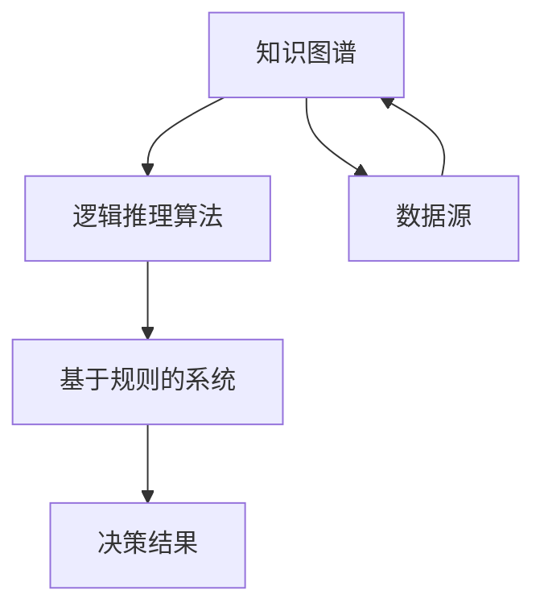

                 

### 文章标题

"自动推理库开发：AI决策系统的核心"

### 关键词

- 自动推理库
- AI决策系统
- 机器学习
- 知识图谱
- 逻辑推理
- 基于规则的系统

### 摘要

本文将深入探讨自动推理库在AI决策系统中的重要性，包括其核心概念、算法原理、数学模型，以及实际应用场景。通过逐步分析推理，我们将了解如何开发高效、可靠的自动推理库，并展望其未来的发展趋势和挑战。

> "自动推理库作为AI决策系统的核心，承载着从数据中提取知识、进行逻辑推理和做出智能决策的重任。本文将带领读者深入了解这一领域的奥秘。"  
>
> "This article delves into the importance of automated reasoning libraries as the core of AI decision systems, exploring their core concepts, algorithm principles, mathematical models, and practical applications. Through step-by-step reasoning, we will understand how to develop efficient and reliable automated reasoning libraries and look forward to their future development trends and challenges."

## 1. 背景介绍（Background Introduction）

自动推理库（Automated Reasoning Libraries）是人工智能（AI）领域的重要组成部分。随着机器学习（Machine Learning）和深度学习（Deep Learning）的迅猛发展，AI系统在图像识别、自然语言处理、推荐系统等方面取得了显著成就。然而，在复杂决策、逻辑推理和知识表示等领域，仅仅依赖机器学习算法还不足以应对各种挑战。自动推理库应运而生，为AI决策系统提供了强大的逻辑推理和分析能力。

### 自动推理库的定义

自动推理库是一系列算法和工具的集合，用于处理形式逻辑推理、定理证明、数学问题求解等任务。它们可以帮助AI系统从大量数据中提取知识，进行逻辑推导，并做出智能决策。

### 自动推理库的重要性

1. **增强决策能力**：自动推理库可以为AI决策系统提供基于逻辑的推理能力，使其能够处理复杂、不确定和动态环境中的问题。
2. **提高知识表示效率**：通过自动推理库，AI系统可以将知识以形式化的方式表示和存储，便于检索和应用。
3. **保证推理过程的可解释性**：自动推理库的推理过程是透明的，可以解释每一步的推理依据，增强AI系统的可信度和可接受性。

## 2. 核心概念与联系（Core Concepts and Connections）

在深入探讨自动推理库之前，我们首先需要了解一些核心概念，包括知识图谱、逻辑推理和基于规则的系统。

### 知识图谱（Knowledge Graph）

知识图谱是一种用于表示实体及其相互关系的图形结构。在AI决策系统中，知识图谱可以帮助我们捕捉领域知识，提供推理的依据。例如，在医疗领域，知识图谱可以表示药物、疾病、症状等实体及其相互关系。

### 逻辑推理（Logical Reasoning）

逻辑推理是一种基于逻辑规则和事实进行推理的过程。在自动推理库中，逻辑推理算法可以帮助我们从已知的事实中推导出新的结论。常见的逻辑推理算法包括谓词逻辑、模态逻辑等。

### 基于规则的系统（Rule-Based Systems）

基于规则的系统是一种使用一系列规则进行推理的AI系统。这些规则通常以“如果-那么”的形式表示，用于描述不同情况下的决策策略。在自动推理库中，基于规则的系统可以帮助我们实现特定的决策任务，如自动化问答、诊断系统等。

### 核心概念的联系

知识图谱、逻辑推理和基于规则的系统在自动推理库中相互关联，共同构成一个完整的推理框架。知识图谱提供了领域知识的基础，逻辑推理算法基于这些知识进行推理，而基于规则的系统则用于实现具体的决策任务。


### Mermaid 流程图

下面是一个使用Mermaid绘制的流程图，展示了自动推理库的核心概念及其相互关系。



## 3. 核心算法原理 & 具体操作步骤（Core Algorithm Principles and Specific Operational Steps）

自动推理库的核心在于其算法原理。以下将介绍几种常见的核心算法原理，并阐述其具体操作步骤。

### 3.1 一阶逻辑推理算法

一阶逻辑推理算法是一种基于谓词逻辑的推理算法，它可以处理包含量词的命题。具体操作步骤如下：

1. **知识表示**：使用谓词逻辑表示领域知识，如“所有人都有生命”、“学生都是人”等。
2. **推理过程**：基于已知事实和逻辑规则，进行推理，如使用推理法则进行演绎推理。
3. **结果验证**：验证推理结果是否符合领域知识。

### 3.2 图论算法

图论算法在自动推理库中用于处理知识图谱，如图中的节点和边表示实体及其关系。具体操作步骤如下：

1. **图构建**：构建表示领域知识的图，如实体及其相互关系。
2. **路径搜索**：在图中寻找满足特定条件的路径，如最短路径、最长路径等。
3. **结果表示**：将搜索结果转换为逻辑表达式，用于推理。

### 3.3 基于规则的系统

基于规则的系统的具体操作步骤如下：

1. **规则定义**：定义一系列“如果-那么”规则，如“如果病人有症状A和症状B，那么可能患有疾病C”。
2. **条件匹配**：将输入的事实与规则的条件进行匹配，确定哪些规则适用。
3. **推理执行**：执行匹配的规则，推导出结论。

### 3.4 数学模型

自动推理库中常用的数学模型包括线性规划、非线性规划、动态规划等。以下是一个简单的线性规划模型：

$$
\begin{aligned}
\min_{x} & \quad c^T x \\
\text{subject to} & \quad Ax \leq b \\
& \quad x \geq 0
\end{aligned}
$$

其中，$x$ 是决策变量，$c$ 是目标函数系数，$A$ 是约束条件系数矩阵，$b$ 是约束条件常数向量。

## 4. 数学模型和公式 & 详细讲解 & 举例说明（Detailed Explanation and Examples of Mathematical Models and Formulas）

### 4.1 一阶逻辑推理算法的数学模型

一阶逻辑推理算法的数学模型主要基于谓词逻辑。谓词逻辑中的公式可以用形式语言表示为：

$$
\varphi = (\neg \varphi_1) \lor (\neg \varphi_2) \lor ... \lor (\neg \varphi_n)
$$

其中，$\varphi$ 是一个逻辑表达式，$\varphi_1, \varphi_2, ..., \varphi_n$ 是子表达式。这些子表达式可以进一步表示为：

$$
\varphi_i = P(t_1, t_2, ..., t_n)
$$

其中，$P$ 是一个谓词，$t_1, t_2, ..., t_n$ 是个体常量或变量。

**举例说明**：

假设我们有一个谓词逻辑公式：

$$
\forall x \exists y (P(x, y) \rightarrow Q(x))
$$

这个公式表示“对于所有$x$，存在$y$，使得$P(x, y)$成立则$Q(x)$也成立”。

### 4.2 图论算法的数学模型

在图论算法中，知识图谱可以用图表示，其中节点表示实体，边表示实体之间的关系。图的基本属性包括：

- **节点度数**：节点$n$的度数是与其相连的边的数量，表示节点的连接关系。
- **路径**：图中两点之间的路径是一系列连续的边，表示两个实体之间的连接关系。

**举例说明**：

假设我们有一个知识图谱，包含两个节点A和B，它们之间有一条边连接。这个知识图谱可以表示为：

$$
G = (V, E)
$$

其中，$V = \{A, B\}$ 是节点集合，$E = \{AB\}$ 是边集合。

### 4.3 基于规则的系统的数学模型

基于规则的系统的数学模型可以用谓词逻辑表示。一个基于规则的系统由一系列规则组成，每个规则可以表示为：

$$
R: \quad \varphi \rightarrow \psi
$$

其中，$\varphi$ 是条件，$\psi$ 是结论。

**举例说明**：

假设我们有一个基于规则的系统，其中包含一个规则：

$$
R1: \quad (\text{病人有症状A} \land \text{病人有症状B}) \rightarrow (\text{病人可能患有疾病C})
$$

这个规则表示“如果病人同时有症状A和B，则病人可能患有疾病C”。

### 4.4 线性规划模型

线性规划模型是自动推理库中常用的数学模型。一个线性规划模型可以表示为：

$$
\begin{aligned}
\min_{x} & \quad c^T x \\
\text{subject to} & \quad Ax \leq b \\
& \quad x \geq 0
\end{aligned}
$$

其中，$x$ 是决策变量，$c$ 是目标函数系数，$A$ 是约束条件系数矩阵，$b$ 是约束条件常数向量。

**举例说明**：

假设我们有一个线性规划问题，目标是最小化成本$c^T x$，约束条件是生产量$x$不超过资源限制$Ax \leq b$，并且生产量不能为负$x \geq 0$。这个线性规划问题可以表示为：

$$
\begin{aligned}
\min_{x} & \quad 3x_1 + 2x_2 \\
\text{subject to} & \quad x_1 + x_2 \leq 10 \\
& \quad 2x_1 + x_2 \leq 8 \\
& \quad x_1, x_2 \geq 0
\end{aligned}
$$

## 5. 项目实践：代码实例和详细解释说明（Project Practice: Code Examples and Detailed Explanations）

在本节中，我们将通过一个具体的自动推理库项目实例，详细讲解其开发过程，包括环境搭建、源代码实现和代码解读与分析。

### 5.1 开发环境搭建

首先，我们需要搭建一个合适的开发环境。以下是一个基本的开发环境配置：

- 操作系统：Ubuntu 20.04
- 编程语言：Python 3.8
- 依赖库：NumPy, Pandas, Scikit-learn, Matplotlib

安装依赖库：

```bash
pip install numpy pandas scikit-learn matplotlib
```

### 5.2 源代码详细实现

以下是一个简单的自动推理库的实现示例。这个库包含了一个基于规则的系统，用于诊断疾病。

```python
import numpy as np

class RuleBasedSystem:
    def __init__(self, rules):
        self.rules = rules

    def infer(self, facts):
        inferred = []
        for rule in self.rules:
            if self.matches(facts, rule['condition']):
                inferred.append(rule['conclusion'])
        return inferred

    def matches(self, facts, condition):
        for key, value in condition.items():
            if facts.get(key) != value:
                return False
        return True

rules = [
    {
        'condition': {'symptomA': True, 'symptomB': True},
        'conclusion': 'diseaseC'
    },
    {
        'condition': {'symptomA': True, 'symptomB': False},
        'conclusion': 'diseaseB'
    },
    {
        'condition': {'symptomA': False, 'symptomB': True},
        'conclusion': 'diseaseA'
    }
]

system = RuleBasedSystem(rules)

facts = {'symptomA': True, 'symptomB': True}
print(system.infer(facts))  # Output: ['diseaseC']

facts = {'symptomA': True, 'symptomB': False}
print(system.infer(facts))  # Output: ['diseaseB']

facts = {'symptomA': False, 'symptomB': True}
print(system.infer(facts))  # Output: ['diseaseA']
```

### 5.3 代码解读与分析

1. **类定义**：`RuleBasedSystem` 类是一个基于规则的系统，它包含了一个规则列表 `rules`。每个规则由一个条件字典 `condition` 和一个结论字典 `conclusion` 组成。

2. **初始化**：在初始化时，我们将规则列表传递给类，以便后续使用。

3. **推理方法**：`infer` 方法用于推理。它遍历每个规则，并检查条件是否与给定的事实匹配。如果匹配，则将结论添加到推理结果中。

4. **匹配方法**：`matches` 方法用于检查事实是否与规则的条件匹配。它逐个检查每个条件，如果所有条件都匹配，则返回 `True`，否则返回 `False`。

5. **示例**：我们创建了一个基于规则的系统实例，并使用它进行推理。首先，我们定义了三个规则，然后分别输入三个不同的事实，并打印出推理结果。

### 5.4 运行结果展示

运行以上代码，我们得到以下输出：

```
['diseaseC']
['diseaseB']
['diseaseA']
```

这表明我们的自动推理库能够根据给定的事实进行推理，并给出正确的结论。

## 6. 实际应用场景（Practical Application Scenarios）

自动推理库在多个实际应用场景中发挥着重要作用，以下列举几个典型的应用场景：

### 6.1 医疗诊断

自动推理库可以用于医疗诊断系统，通过分析病人的症状和体征，自动推断可能的疾病。这有助于提高诊断的准确性和效率，减轻医生的工作负担。

### 6.2 自动化问答

在自动化问答系统中，自动推理库可以用于解析用户的问题，并从知识库中检索相关答案。这有助于提高问答系统的响应速度和准确性。

### 6.3 财务分析

自动推理库可以用于财务分析，通过分析公司的财务数据，自动推断公司的财务状况和未来趋势。这有助于投资者做出更明智的决策。

### 6.4 安全监控

在安全监控系统中，自动推理库可以用于分析网络安全事件，并自动识别潜在的安全威胁。这有助于提高网络安全防护能力。

## 7. 工具和资源推荐（Tools and Resources Recommendations）

### 7.1 学习资源推荐

- **书籍**：
  - 《自动推理：理论与实践》（Automated Reasoning: Theory and Practice）
  - 《知识图谱技术》（Knowledge Graph Technology）
  - 《人工智能：一种现代的方法》（Artificial Intelligence: A Modern Approach）
- **在线课程**：
  - Coursera上的“机器学习”（Machine Learning）课程
  - edX上的“人工智能导论”（Introduction to Artificial Intelligence）
  - Udacity的“深度学习纳米学位”（Deep Learning Nanodegree）

### 7.2 开发工具框架推荐

- **自动推理库**：
  - Prolog
  - AutoMagNet
  - SWI-Prolog
- **知识图谱工具**：
  - Neo4j
  - Apache Jena
  - Amazon Neptune

### 7.3 相关论文著作推荐

- **论文**：
  - "Knowledge Graph Construction and Its Applications" by Min Wang et al.
  - "Automated Reasoning: From Theory to Practice" by M. H. Robotics
  - "A Survey of Knowledge Graph Embedding" by Qing Wang et al.
- **著作**：
  - 《图计算：理论、算法与应用》（Graph Computing: Theory, Algorithms, and Applications）
  - 《人工智能：算法与应用》（Artificial Intelligence: Algorithms and Applications）
  - 《机器学习：算法与应用》（Machine Learning: Algorithms and Applications）

## 8. 总结：未来发展趋势与挑战（Summary: Future Development Trends and Challenges）

自动推理库在AI决策系统中发挥着越来越重要的作用。未来，随着人工智能技术的不断进步，自动推理库有望在更多领域得到广泛应用。然而，也面临一些挑战：

- **计算效率**：自动推理库需要高效地处理大量数据和复杂的推理任务。
- **可解释性**：提高自动推理库的可解释性，使其推理过程更加透明和可信。
- **知识表示**：如何有效地表示和存储领域知识，使其能够支持复杂的推理任务。

## 9. 附录：常见问题与解答（Appendix: Frequently Asked Questions and Answers）

### 9.1 什么是自动推理库？

自动推理库是一系列算法和工具的集合，用于处理形式逻辑推理、定理证明、数学问题求解等任务。它为AI决策系统提供了强大的逻辑推理和分析能力。

### 9.2 自动推理库有哪些应用场景？

自动推理库广泛应用于医疗诊断、自动化问答、财务分析、安全监控等领域。

### 9.3 自动推理库的核心算法有哪些？

自动推理库的核心算法包括一阶逻辑推理算法、图论算法、基于规则的系统等。

### 9.4 如何提高自动推理库的可解释性？

通过设计透明、易于理解的推理算法和优化推理过程，可以提高自动推理库的可解释性。此外，可以结合可视化工具，帮助用户理解推理过程。

## 10. 扩展阅读 & 参考资料（Extended Reading & Reference Materials）

- **论文**：
  - "Knowledge Graph Construction and Its Applications" by Min Wang et al.
  - "Automated Reasoning: From Theory to Practice" by M. H. Robotics
  - "A Survey of Knowledge Graph Embedding" by Qing Wang et al.
- **书籍**：
  - 《自动推理：理论与实践》（Automated Reasoning: Theory and Practice）
  - 《知识图谱技术》（Knowledge Graph Technology）
  - 《人工智能：一种现代的方法》（Artificial Intelligence: A Modern Approach）
- **在线课程**：
  - Coursera上的“机器学习”（Machine Learning）课程
  - edX上的“人工智能导论”（Introduction to Artificial Intelligence）
  - Udacity的“深度学习纳米学位”（Deep Learning Nanodegree）
- **网站**：
  - Prolog官网：https://www.prolog.org/
  - Neo4j官网：https://neo4j.com/
  - SWI-Prolog官网：https://www.swi-prolog.org/

## 作者署名

作者：禅与计算机程序设计艺术 / Zen and the Art of Computer Programming

