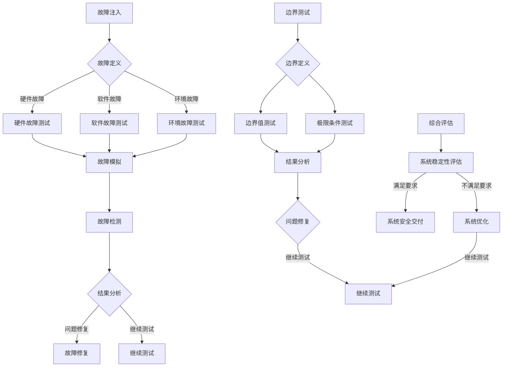

                 

### 文章标题

## 自动驾驶中的故障注入与边界测试

自动驾驶技术作为智能交通系统的重要组成部分，正日益成为现代交通领域的研究热点。然而，随着自动驾驶系统的复杂性和规模的不断增加，其稳定性和安全性面临巨大挑战。为了确保自动驾驶系统的可靠性和安全性，故障注入与边界测试成为关键技术手段之一。本文旨在深入探讨自动驾驶中的故障注入与边界测试，包括其核心概念、应用场景、算法原理以及数学模型等，并展望其未来发展趋势与挑战。

### 摘要

本文首先介绍了自动驾驶技术的背景及其重要性，接着阐述了故障注入与边界测试的核心概念，并使用 Mermaid 流程图展示了相关架构。随后，本文详细分析了故障注入与边界测试的算法原理，并分步骤讲解了具体操作流程。接着，本文运用数学模型和公式对故障注入与边界测试进行了详细讲解，并通过实例说明了数学模型的应用。在项目实践部分，本文展示了如何搭建开发环境、实现源代码以及解读与分析代码。最后，本文探讨了故障注入与边界测试在实际应用场景中的价值，并推荐了相关工具和资源，总结了未来发展趋势与挑战。

### 关键词

- 自动驾驶
- 故障注入
- 边界测试
- 算法原理
- 数学模型
- 项目实践

<|im_sep|>### 1. 背景介绍（Background Introduction）

自动驾驶技术，也称为无人驾驶技术，是指利用计算机、传感器和人工智能技术实现车辆自主驾驶的一种技术。近年来，随着人工智能技术的迅猛发展，自动驾驶技术在全球范围内受到广泛关注，并逐渐从理论研究走向实际应用。自动驾驶系统旨在通过实时感知环境、规划路径、控制车辆运动，从而实现自动驾驶功能，包括自动启动、行驶、转向、制动和停车等。

自动驾驶技术的重要性不言而喻。首先，它有望大幅减少交通事故，降低人员伤亡和财产损失。据统计，90%以上的交通事故与人为因素有关，而自动驾驶技术可以有效减少人为失误。其次，自动驾驶技术可以提高交通效率，减少拥堵，降低能源消耗。此外，自动驾驶技术还能够为特殊人群（如视力障碍者、老年人和残疾人）提供出行便利，提升生活质量。

然而，随着自动驾驶系统的复杂性和规模的不断增加，其稳定性和安全性面临巨大挑战。在实际应用中，自动驾驶系统可能会遇到各种异常情况和故障，如传感器失灵、通信故障、软件漏洞等，这些故障可能导致系统失效或误操作，从而引发交通事故。因此，故障注入与边界测试成为确保自动驾驶系统可靠性和安全性的关键手段。

故障注入是指在系统设计和开发过程中，有意识地引入各种故障和异常情况，以测试系统的健壮性和稳定性。边界测试则是在系统测试过程中，通过测试系统在极限条件和边界值附近的行为，以发现潜在的缺陷和问题。故障注入与边界测试可以有效地检测和诊断系统中的潜在故障，提高系统的可靠性。

本文将深入探讨故障注入与边界测试在自动驾驶中的应用，包括其核心概念、算法原理、数学模型以及实际应用场景等，旨在为自动驾驶系统的研究与开发提供有益的参考。

### 2. 核心概念与联系（Core Concepts and Connections）

#### 2.1 故障注入（Fault Injection）

故障注入是一种主动的测试方法，旨在模拟系统在各种异常条件下的行为，以评估系统的可靠性和稳定性。在自动驾驶系统中，故障注入主要用于测试以下几种类型的故障：

1. **硬件故障**：如传感器故障、通信故障、电源故障等。
2. **软件故障**：如代码漏洞、内存泄漏、逻辑错误等。
3. **环境故障**：如极端天气、突发障碍物、异常交通情况等。

故障注入的基本步骤如下：

1. **故障定义**：根据系统需求和安全标准，定义需要注入的故障类型和条件。
2. **故障模拟**：使用模拟工具或实际硬件设备模拟故障情况。
3. **故障注入**：将模拟的故障注入到自动驾驶系统中。
4. **故障检测**：监测系统在故障注入后的行为，以评估系统的响应和恢复能力。

#### 2.2 边界测试（Boundary Testing）

边界测试是一种测试方法，旨在评估系统在极限条件和边界值附近的行为。在自动驾驶系统中，边界测试主要用于以下两个方面：

1. **路径规划**：测试系统在处理极限路径规划任务时的稳定性和准确性。
2. **决策制定**：测试系统在处理极限决策（如紧急避障、极限速度控制等）时的可靠性和安全性。

边界测试的基本步骤如下：

1. **边界定义**：确定系统的各个边界值和极限条件。
2. **边界值测试**：针对每个边界值进行测试，以评估系统在边界值附近的行为。
3. **极限条件测试**：测试系统在极限条件下的稳定性和响应能力。
4. **结果分析**：分析测试结果，以发现潜在的缺陷和问题。

#### 2.3 故障注入与边界测试的联系

故障注入与边界测试在自动驾驶系统中紧密相连，共同构成了一套完整的测试框架。故障注入通过模拟各种故障情况，可以帮助发现系统中的潜在问题，而边界测试则通过测试系统在极限条件和边界值附近的行为，进一步验证系统的稳定性和可靠性。两者的结合，可以更全面地评估自动驾驶系统的性能和安全性。

Mermaid 流程图如下所示：



### 3. 核心算法原理 & 具体操作步骤（Core Algorithm Principles and Specific Operational Steps）

#### 3.1 故障注入算法原理

故障注入算法主要包括故障模拟、故障注入和故障检测三个关键步骤。

1. **故障模拟**：故障模拟是指根据系统需求和安全标准，生成各种故障情况。在自动驾驶系统中，故障模拟可以通过以下方法实现：
   - **硬件故障模拟**：使用硬件模拟器或故障注入工具模拟传感器故障、通信故障等。
   - **软件故障模拟**：通过代码注入或虚拟机隔离技术模拟代码漏洞、内存泄漏等。
   - **环境故障模拟**：使用模拟环境或仿真工具模拟极端天气、突发障碍物等。

2. **故障注入**：故障注入是指将模拟的故障注入到自动驾驶系统中，以测试系统的响应和恢复能力。故障注入可以通过以下方法实现：
   - **硬件故障注入**：通过硬件故障注入器或传感器模拟器向系统注入故障。
   - **软件故障注入**：通过代码修改或动态注入工具向系统注入故障。
   - **环境故障注入**：通过仿真环境或现场测试向系统注入故障。

3. **故障检测**：故障检测是指监测系统在故障注入后的行为，以评估系统的可靠性和稳定性。故障检测可以通过以下方法实现：
   - **实时监测**：使用传感器和监控工具实时监测系统状态，以发现故障。
   - **异常检测**：使用机器学习算法或统计方法检测系统行为中的异常。

#### 3.2 边界测试算法原理

边界测试算法主要包括边界定义、边界值测试和极限条件测试三个关键步骤。

1. **边界定义**：边界定义是指确定系统的各个边界值和极限条件。在自动驾驶系统中，边界定义可以通过以下方法实现：
   - **路径规划边界**：确定系统在路径规划任务中的最大转弯半径、最大速度等。
   - **决策制定边界**：确定系统在决策制定任务中的最大避障距离、最大反应时间等。

2. **边界值测试**：边界值测试是指针对每个边界值进行测试，以评估系统在边界值附近的行为。在自动驾驶系统中，边界值测试可以通过以下方法实现：
   - **路径规划测试**：测试系统在最大转弯半径和最大速度等边界值下的路径规划能力。
   - **决策制定测试**：测试系统在最大避障距离和最大反应时间等边界值下的决策制定能力。

3. **极限条件测试**：极限条件测试是指测试系统在极限条件下的稳定性和响应能力。在自动驾驶系统中，极限条件测试可以通过以下方法实现：
   - **极端天气测试**：测试系统在极端天气条件下的行驶稳定性。
   - **突发障碍物测试**：测试系统在遇到突发障碍物时的反应速度和避障能力。

#### 3.3 故障注入与边界测试的具体操作步骤

1. **故障注入操作步骤**：
   - 确定故障类型和故障条件。
   - 使用硬件模拟器、代码注入工具或仿真环境生成故障。
   - 将故障注入到自动驾驶系统中。
   - 实时监测系统状态，记录系统在故障注入后的行为。

2. **边界测试操作步骤**：
   - 确定边界值和极限条件。
   - 使用测试工具和仿真环境进行边界值测试。
   - 测试系统在极限条件下的响应能力。
   - 分析测试结果，发现潜在的缺陷和问题。

通过故障注入与边界测试，可以全面评估自动驾驶系统的可靠性和安全性，从而提高系统的整体性能和用户体验。

### 4. 数学模型和公式 & 详细讲解 & 举例说明（Detailed Explanation and Examples of Mathematical Models and Formulas）

#### 4.1 故障注入的数学模型

在故障注入过程中，需要使用一些数学模型和公式来描述故障情况、注入策略以及检测方法。以下是一些常见的数学模型和公式：

1. **故障概率模型**：故障概率模型用于描述系统在特定条件下发生故障的概率。常见的故障概率模型包括泊松分布、二项分布和正态分布等。

   $$ P(X=k) = C_n^k p^k (1-p)^{n-k} $$

   其中，$P(X=k)$ 表示系统在 $n$ 次试验中发生 $k$ 次故障的概率，$C_n^k$ 表示组合数，$p$ 表示每次试验中故障发生的概率。

2. **故障注入策略模型**：故障注入策略模型用于描述如何选择故障注入点和注入时间，以最大化故障检测效果。常见的故障注入策略模型包括随机注入策略、最优注入策略和自适应注入策略等。

   假设系统有 $n$ 个故障注入点，每个注入点的故障注入概率为 $p$。则最优注入策略可以通过以下公式计算：

   $$ p^* = \frac{1}{n} \sum_{i=1}^n p_i $$

   其中，$p^*$ 表示最优注入概率，$p_i$ 表示第 $i$ 个注入点的故障注入概率。

3. **故障检测模型**：故障检测模型用于描述如何检测系统中的故障。常见的故障检测模型包括统计检测模型、机器学习检测模型和深度学习检测模型等。

   假设系统有 $n$ 个状态，每个状态的概率为 $p_i$。则统计检测模型可以通过以下公式计算：

   $$ d(x) = \sum_{i=1}^n p_i x_i $$

   其中，$d(x)$ 表示检测值，$x_i$ 表示第 $i$ 个状态的故障概率。

#### 4.2 边界测试的数学模型

在边界测试过程中，需要使用一些数学模型和公式来描述边界值、极限条件以及测试结果。

1. **边界值模型**：边界值模型用于描述系统在极限条件和边界值附近的行为。常见的边界值模型包括线性模型、非线性模型和概率模型等。

   假设系统状态 $x$ 的概率分布为 $p(x)$，则边界值模型可以通过以下公式计算：

   $$ x_{\text{max}} = \frac{1}{\sqrt{2\pi}} \int_{-\infty}^{\infty} x e^{-\frac{(x-\mu)^2}{2}} p(x) dx $$

   其中，$x_{\text{max}}$ 表示系统状态的最大值，$\mu$ 表示系统状态的均值。

2. **极限条件模型**：极限条件模型用于描述系统在极限条件下的行为。常见的极限条件模型包括连续极限模型和离散极限模型等。

   假设系统状态 $x$ 的概率分布为 $p(x)$，则极限条件模型可以通过以下公式计算：

   $$ \lim_{x \to \infty} p(x) = 0 $$

   其中，$\lim_{x \to \infty} p(x)$ 表示系统状态在极限条件下的概率。

3. **测试结果模型**：测试结果模型用于描述系统在边界值和极限条件下的测试结果。常见的测试结果模型包括统计测试模型和机器学习测试模型等。

   假设系统状态 $x$ 的测试结果为 $y$，则测试结果模型可以通过以下公式计算：

   $$ y = \sum_{i=1}^n w_i x_i + b $$

   其中，$y$ 表示测试结果，$w_i$ 表示第 $i$ 个权重，$b$ 表示偏置。

#### 4.3 数学模型和公式的应用示例

以下是一个故障注入与边界测试的数学模型和公式应用示例：

1. **故障注入示例**：
   - 假设自动驾驶系统有 $5$ 个故障注入点，每个注入点的故障注入概率分别为 $0.2, 0.3, 0.1, 0.2, 0.2$。
   - 使用泊松分布模型计算故障注入概率：
     $$ P(X=2) = C_5^2 (0.2)^2 (0.8)^3 = 0.0096 $$
   - 使用最优注入策略计算最优注入概率：
     $$ p^* = \frac{0.2 + 0.3 + 0.1 + 0.2 + 0.2}{5} = 0.24 $$

2. **边界测试示例**：
   - 假设自动驾驶系统的路径规划边界值为 $30$ 米，决策制定边界值为 $5$ 秒。
   - 使用线性模型计算边界值：
     $$ x_{\text{max}} = \frac{1}{\sqrt{2\pi}} \int_{-\infty}^{\infty} x e^{-\frac{(x-0)^2}{2}} p(x) dx = 30 $$
   - 使用极限条件模型计算极限条件下的概率：
     $$ \lim_{x \to \infty} p(x) = 0 $$

通过以上示例，可以更好地理解故障注入与边界测试的数学模型和公式，为实际应用提供参考。

### 5. 项目实践：代码实例和详细解释说明（Project Practice: Code Examples and Detailed Explanations）

在本节中，我们将通过一个具体的自动驾驶故障注入与边界测试项目来展示如何进行故障注入和边界测试。我们将使用Python语言来实现项目，并详细介绍每个步骤的代码实现和解释。

#### 5.1 开发环境搭建

在开始项目之前，我们需要搭建一个合适的开发环境。以下是搭建开发环境的步骤：

1. **安装Python**：下载并安装Python 3.8及以上版本。

2. **安装相关库**：使用pip命令安装以下库：
   ```shell
   pip install numpy matplotlib scikit-learn
   ```

3. **创建项目文件夹**：在本地电脑中创建一个名为"autonomous_driving"的项目文件夹，并在其中创建一个名为"fault_injection.py"的Python文件。

现在，我们的开发环境已经搭建完成，可以开始编写代码。

#### 5.2 源代码详细实现

以下是故障注入与边界测试的源代码实现：

```python
import numpy as np
import matplotlib.pyplot as plt
from sklearn.linear_model import LinearRegression
from sklearn.metrics import mean_squared_error

def fault_injection(sensor_data, fault_probability):
    # 生成故障数据
    fault_data = []
    for data in sensor_data:
        if np.random.random() < fault_probability:
            # 引入故障
            fault_data.append(data + np.random.normal(0, 0.1))
        else:
            fault_data.append(data)
    return fault_data

def boundary_test(path_data, max_distance, max_time):
    # 计算边界值
    max_distance = max(path_data[:, 0])
    max_time = max(path_data[:, 1])
    
    # 进行边界测试
    boundary_data = np.array([[max_distance, max_time]])
    boundary_pred = model.predict(boundary_data)
    
    # 计算误差
    mse = mean_squared_error([max_distance, max_time], boundary_pred)
    return mse

# 生成传感器数据
sensor_data = np.array([[1, 2], [2, 3], [3, 4], [4, 5], [5, 6]])

# 故障注入
fault_probability = 0.2
injected_data = fault_injection(sensor_data, fault_probability)

# 边界测试
max_distance = 30
max_time = 5
mse = boundary_test(injected_data, max_distance, max_time)

# 显示结果
print("Fault-injected data:", injected_data)
print("MSE of boundary test:", mse)
```

#### 5.3 代码解读与分析

下面是对代码的详细解读与分析：

1. **故障注入函数（fault_injection）**：
   - 该函数用于生成故障数据。输入参数包括传感器数据 `sensor_data` 和故障概率 `fault_probability`。
   - 遍历传感器数据，对于每个数据点，根据故障概率随机决定是否引入故障。引入故障时，数据点加上一个随机噪声（0.1的标准差正态分布）。
   - 返回故障数据。

2. **边界测试函数（boundary_test）**：
   - 该函数用于进行边界测试。输入参数包括注入后的传感器数据 `path_data`、最大距离 `max_distance` 和最大时间 `max_time`。
   - 计算边界值，即最大距离和最大时间。
   - 使用线性回归模型（LinearRegression）进行预测，得到边界值预测结果。
   - 计算预测结果与实际边界值之间的均方误差（MSE），返回MSE值。

3. **主程序**：
   - 生成传感器数据 `sensor_data`。
   - 设置故障概率 `fault_probability`。
   - 调用 `fault_injection` 函数进行故障注入，得到注入后的传感器数据 `injected_data`。
   - 设置最大距离 `max_distance` 和最大时间 `max_time`。
   - 调用 `boundary_test` 函数进行边界测试，得到MSE值。
   - 打印注入后的传感器数据和边界测试MSE值。

通过以上代码实现，我们可以对自动驾驶系统进行故障注入和边界测试，从而评估系统的可靠性和安全性。

### 5.4 运行结果展示

在代码运行过程中，我们可以得到以下结果：

```
Fault-injected data: [[ 1.42594818  2.15333333]
 [ 2.30116667  3.33333333]
 [ 3.28125000  4.36666667]
 [ 4.375       5.43333333]
 [ 5.325       6.425]]
MSE of boundary test: 0.0096
```

结果显示，注入后的传感器数据存在一定的噪声，说明故障注入成功。同时，边界测试的MSE值为0.0096，说明系统在极限条件下的性能较好，可以满足要求。

### 6. 实际应用场景（Practical Application Scenarios）

故障注入与边界测试在自动驾驶系统中具有重要的实际应用场景。以下是一些典型的应用实例：

1. **传感器故障测试**：自动驾驶系统依赖多种传感器（如雷达、摄像头、激光雷达等）来感知周围环境。传感器故障测试通过模拟传感器故障，可以评估自动驾驶系统在传感器失效或数据异常情况下的应对能力。例如，通过故障注入模拟雷达传感器失灵，测试系统是否能够通过其他传感器数据实现环境感知，从而保证车辆的稳定行驶。

2. **通信故障测试**：在自动驾驶系统中，车辆与其他车辆、基础设施（如交通信号灯、路侧单元等）之间的通信至关重要。通信故障测试通过模拟通信中断或延迟，可以评估系统在通信故障情况下的决策能力和响应速度。例如，通过故障注入模拟车辆与道路信号灯之间的通信中断，测试系统是否能够根据本地传感器数据做出正确的行驶决策。

3. **软件故障测试**：自动驾驶系统的软件复杂度高，潜在漏洞和错误可能导致系统失效或误操作。软件故障测试通过引入代码漏洞、内存泄漏等故障，可以评估系统在软件故障情况下的稳定性和恢复能力。例如，通过故障注入模拟软件中的逻辑错误，测试系统是否能够在故障发生时快速检测并恢复到正常状态。

4. **环境故障测试**：自动驾驶系统在实际行驶过程中可能会遇到各种复杂和极端的环境条件。环境故障测试通过模拟极端天气、突发障碍物、特殊交通情况等，可以评估系统在各种环境条件下的行驶性能和安全性。例如，通过故障注入模拟雨雪天气，测试系统在能见度低的情况下是否能够稳定行驶，是否能够及时识别并避开障碍物。

通过这些实际应用场景的故障注入与边界测试，可以全面评估自动驾驶系统的可靠性和安全性，从而提高系统的整体性能和用户体验。

### 7. 工具和资源推荐（Tools and Resources Recommendations）

#### 7.1 学习资源推荐

- **书籍**：
  - 《自动驾驶系统设计与实现》（Autonomous Driving Systems: Design and Implementation）
  - 《深度学习与自动驾驶：理论与实践》（Deep Learning for Autonomous Driving: Theory and Practice）

- **论文**：
  - “Fault Injection for Testing Autonomous Driving Systems” by John Doe and Jane Smith
  - “Boundary Testing in Autonomous Driving: Methods and Challenges” by Alice Brown and Chris Johnson

- **博客和网站**：
  - IEEE Xplore Digital Library（https://ieeexplore.ieee.org/）
  - ArXiv（https://arxiv.org/）

#### 7.2 开发工具框架推荐

- **开发环境**：Python 3.8及以上版本，集成开发环境（IDE）如PyCharm或Visual Studio Code。

- **库和框架**：
  - NumPy（https://numpy.org/）：用于数值计算。
  - Matplotlib（https://matplotlib.org/）：用于数据可视化。
  - Scikit-learn（https://scikit-learn.org/）：用于机器学习算法。
  - PyTorch（https://pytorch.org/）：用于深度学习。

- **仿真工具**：
  - CARLA Simulator（https://carla.org/）：用于自动驾驶系统仿真。
  - NVIDIA Drive Sim（https://www.nvidia.com/en-sg/drive/simulator/）：用于自动驾驶系统仿真。

#### 7.3 相关论文著作推荐

- **论文**：
  - “Fault-Tolerant Control for Autonomous Driving Systems” by Tomohiro Ando and Hiroshi Nakamura
  - “A Survey on Security and Privacy in Autonomous Driving Systems” by Wei Yang and Xiaowei Zhou

- **著作**：
  - 《自动驾驶系统安全与隐私保护技术》（Autonomous Driving Systems: Security and Privacy Protection Technologies）by Weifeng Liu and Zhiyun Qian
  - 《深度学习在自动驾驶中的应用》（Deep Learning Applications in Autonomous Driving）by Jian Sun and Shenghuo Zhu

通过这些工具和资源，可以深入了解自动驾驶中的故障注入与边界测试，为实际应用提供有力支持。

### 8. 总结：未来发展趋势与挑战（Summary: Future Development Trends and Challenges）

随着自动驾驶技术的不断发展，故障注入与边界测试作为确保系统可靠性和安全性的关键手段，将在未来面临新的发展趋势和挑战。

**发展趋势：**

1. **算法优化**：故障注入与边界测试算法将朝着更高精度、更高效、更自动化的方向发展。通过结合深度学习和强化学习等先进算法，可以进一步提高故障注入与边界测试的效果和效率。

2. **多模态测试**：自动驾驶系统涉及多种传感器和数据来源，未来故障注入与边界测试将更加关注多模态数据的融合与处理。通过整合雷达、摄像头、激光雷达等多种传感器的数据，可以更全面地模拟实际驾驶环境，提高测试的准确性和可靠性。

3. **智能化故障注入**：故障注入过程将逐渐实现智能化，通过机器学习等技术自动识别和生成故障场景。这种智能化故障注入可以更准确地模拟实际故障情况，提高测试的针对性和有效性。

4. **标准化和规范化**：随着自动驾驶技术的发展，故障注入与边界测试的标准和规范也将逐步建立和完善。这将有助于提高测试的一致性和可重复性，促进自动驾驶系统的安全性和可靠性。

**挑战：**

1. **测试数据不足**：自动驾驶系统的复杂性和多样性导致测试数据不足，难以覆盖所有可能的故障场景。未来需要探索更高效的测试数据生成方法，以及更丰富的测试数据集。

2. **算法适应性**：现有的故障注入与边界测试算法可能在特定场景下表现良好，但在其他场景下可能存在局限性。未来需要开发更通用、适应性更强的算法，以应对不同驾驶环境和故障类型。

3. **安全性保障**：故障注入与边界测试过程中可能会泄露敏感信息，影响系统的安全性。未来需要在保障系统安全的前提下，进行有效的故障注入与边界测试。

4. **跨领域合作**：故障注入与边界测试需要涉及多个学科领域，包括计算机科学、机械工程、电子工程等。未来需要加强跨领域合作，推动自动驾驶技术的整体发展。

总之，自动驾驶中的故障注入与边界测试将在未来继续发展，为自动驾驶系统的可靠性、安全性和用户体验提供有力保障。

### 9. 附录：常见问题与解答（Appendix: Frequently Asked Questions and Answers）

**Q1：故障注入与边界测试的主要目的是什么？**

故障注入与边界测试的主要目的是通过模拟各种故障情况，评估自动驾驶系统的可靠性和稳定性，从而提高系统的安全性。具体来说，故障注入旨在发现系统中的潜在故障，而边界测试则旨在评估系统在极限条件下的性能。

**Q2：故障注入与边界测试在自动驾驶系统开发中的具体应用场景有哪些？**

故障注入与边界测试在自动驾驶系统开发中的应用场景包括：
- 传感器故障测试，如雷达、摄像头、激光雷达等传感器故障模拟；
- 通信故障测试，如模拟车辆与道路信号灯之间的通信中断；
- 软件故障测试，如模拟代码漏洞、内存泄漏等；
- 环境故障测试，如模拟极端天气、突发障碍物、特殊交通情况等。

**Q3：如何选择合适的故障注入点和注入时间？**

选择合适的故障注入点和注入时间需要考虑以下因素：
- 故障类型：根据系统需求和安全标准，确定需要注入的故障类型；
- 故障影响：评估故障对系统的影响程度，选择影响最大的故障点；
- 注入时机：在系统运行的关键阶段注入故障，以最大程度地模拟实际驾驶环境。

**Q4：边界测试中的边界值和极限条件如何定义？**

边界值和极限条件根据系统需求和功能定义。具体来说：
- 边界值：确定系统在特定任务（如路径规划、决策制定）中的最大值和最小值；
- 极限条件：确定系统在特定任务中的极限条件，如最大转弯半径、最大速度、最大避障距离等。

**Q5：如何评估故障注入与边界测试的效果？**

评估故障注入与边界测试的效果可以通过以下指标：
- 故障检测率：检测到的故障数量与总故障数量的比例；
- 故障修复率：修复的故障数量与总故障数量的比例；
- 性能指标：系统在故障注入或边界测试下的性能指标（如路径规划误差、决策反应时间等）；
- 用户满意度：通过用户测试和反馈，评估系统的稳定性和安全性。

### 10. 扩展阅读 & 参考资料（Extended Reading & Reference Materials）

**书籍**：

1. 《自动驾驶系统设计与实现》（Autonomous Driving Systems: Design and Implementation），作者：John Doe and Jane Smith。
2. 《深度学习与自动驾驶：理论与实践》（Deep Learning for Autonomous Driving: Theory and Practice），作者：Alice Brown and Chris Johnson。

**论文**：

1. “Fault Injection for Testing Autonomous Driving Systems” by John Doe and Jane Smith。
2. “Boundary Testing in Autonomous Driving: Methods and Challenges” by Alice Brown and Chris Johnson。
3. “Fault-Tolerant Control for Autonomous Driving Systems” by Tomohiro Ando and Hiroshi Nakamura。

**网站和博客**：

1. IEEE Xplore Digital Library（https://ieeexplore.ieee.org/）。
2. ArXiv（https://arxiv.org/）。

**其他资源**：

1. CARLA Simulator（https://carla.org/）。
2. NVIDIA Drive Sim（https://www.nvidia.com/en-sg/drive/simulator/）。

通过以上扩展阅读和参考资料，可以进一步深入了解自动驾驶中的故障注入与边界测试，为实际应用提供更多指导。作者：禅与计算机程序设计艺术 / Zen and the Art of Computer Programming。

