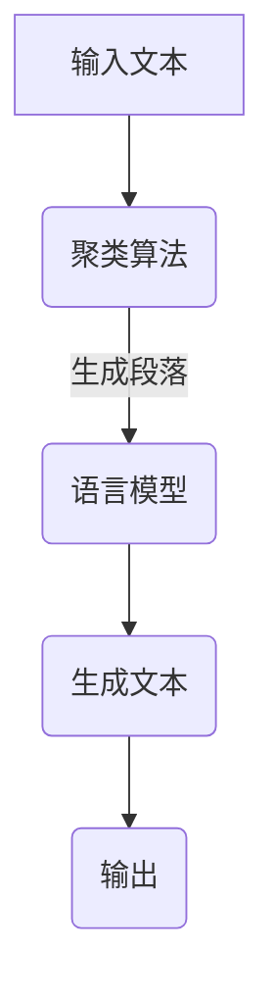

                 

### 文章标题

《自然语言处理的应用：AI内容创作革命》

### Keywords:
Natural Language Processing (NLP), AI Content Creation, AI Revolution, Content Generation, Language Models

### Abstract:
This article delves into the transformative applications of Natural Language Processing (NLP) in the realm of AI content creation. It explores the core concepts, algorithms, mathematical models, and practical implementations that drive the AI content creation revolution. The article also discusses the various real-world scenarios where NLP has made a significant impact, and provides insights into the future trends and challenges in this rapidly evolving field. Through a step-by-step reasoning approach, the article aims to demystify the complexities of NLP and empower readers with the knowledge to harness its full potential in content creation.

## 1. 背景介绍（Background Introduction）

自然语言处理（NLP）是人工智能（AI）的一个重要分支，它致力于使计算机能够理解、解释和生成人类自然语言。随着深度学习技术的迅速发展，NLP在近年来取得了显著的进展，并逐渐成为各个领域的重要工具。AI内容创作革命便是NLP应用的典型代表，它彻底改变了传统的创作方式，为内容创作者提供了前所未有的创作工具和灵感。

### 1.1 自然语言处理的发展历程

自然语言处理的研究始于20世纪50年代，当时科学家们首次尝试让计算机理解和生成自然语言。早期的研究主要集中在规则驱动的方法，如语法分析、词性标注等。然而，这些方法在处理复杂、多变的人类语言时遇到了诸多困难。

随着计算能力的提升和算法的进步，统计方法和机器学习技术逐渐成为NLP研究的核心。20世纪90年代，统计机器翻译和文本分类等任务取得了突破性的成果。进入21世纪，深度学习技术的发展进一步推动了NLP的进步，尤其是在语言模型、语音识别和机器翻译等领域。

### 1.2 AI内容创作的兴起

AI内容创作是指利用人工智能技术，尤其是自然语言处理技术，自动生成或辅助生成各种类型的内容，如文章、新闻报道、诗歌、音乐等。这一概念的兴起源于人们对于大规模、高效、个性化内容的需求。随着社交媒体、搜索引擎和在线内容平台的兴起，AI内容创作变得越来越重要。

### 1.3 AI内容创作的优势

AI内容创作具有多方面的优势：

1. **高效性**：AI可以快速生成大量内容，大大提高了内容创作的效率。
2. **个性化**：通过分析用户数据和偏好，AI能够生成个性化的内容，满足不同用户的需求。
3. **多样性**：AI可以创作出多样化的内容，包括文字、图像、音频等多种形式。
4. **创新性**：AI可以为内容创作者提供新的创作灵感和方向。

## 2. 核心概念与联系（Core Concepts and Connections）

### 2.1 语言模型

语言模型是NLP的核心组件之一，它用于预测文本序列的概率分布。在AI内容创作中，语言模型扮演着至关重要的角色。目前最先进的语言模型是基于Transformer架构的，如GPT-3、BERT等。

#### 2.1.1 语言模型的工作原理

语言模型通过学习大量文本数据，建立对语言规律的理解。在生成文本时，语言模型根据当前已生成的部分文本，预测下一个词或词组，并依据概率分布选择最合适的词或词组。

#### 2.1.2 语言模型的优势

1. **强大的语言理解能力**：通过学习大量文本数据，语言模型能够理解复杂、多样化的语言结构。
2. **灵活的生成能力**：语言模型可以根据输入的提示或上下文，生成连贯、自然的文本。

### 2.2 语言生成算法

语言生成算法是实现AI内容创作的关键技术。以下是一些常用的语言生成算法：

#### 2.2.1 聚类算法

聚类算法可以将大量文本数据分为若干类别，从而生成对应类别的文本内容。常用的聚类算法包括K-means、DBSCAN等。

#### 2.2.2 序列模型

序列模型可以预测文本序列的下一个元素，如RNN、LSTM等。序列模型在生成文本时，可以保持一定的上下文信息，从而生成连贯的文本。

#### 2.2.3 生成对抗网络（GAN）

生成对抗网络（GAN）是一种基于博弈论的生成模型，由生成器和判别器组成。生成器负责生成文本，判别器负责判断生成文本的质量。通过不断的训练，生成器可以生成越来越高质量的文本。

### 2.3 语言模型与生成算法的结合

在实际应用中，语言模型和生成算法常常结合使用。例如，在生成文章时，可以先使用聚类算法将文章分为多个段落，然后使用语言模型生成每个段落的文本。这种结合方式可以充分利用语言模型的优势，同时提高生成文本的质量。

#### 2.3.1 Mermaid 流程图

以下是语言模型与生成算法结合的Mermaid流程图：



## 3. 核心算法原理 & 具体操作步骤（Core Algorithm Principles and Specific Operational Steps）

### 3.1 语言模型的工作原理

语言模型的工作原理基于概率模型，其主要目标是预测下一个词或词组的概率分布。以下是一个简单的语言模型工作流程：

1. **数据准备**：收集大量的文本数据，并进行预处理，如分词、去停用词、词性标注等。
2. **模型训练**：使用预处理后的文本数据，通过算法（如n-gram模型、神经网络模型等）训练语言模型。
3. **概率预测**：在生成文本时，语言模型根据已生成的部分文本，预测下一个词或词组的概率分布。
4. **文本生成**：根据概率分布选择最合适的词或词组，生成完整的文本。

### 3.2 语言模型的训练步骤

以下是语言模型训练的详细步骤：

1. **数据预处理**：

   - 分词：将文本拆分为单词或词组。
   - 去停用词：去除对文本生成影响较小的单词。
   - 词性标注：对文本中的每个词进行词性标注，如名词、动词、形容词等。

2. **构建词汇表**：将所有单词或词组映射到一个唯一的整数ID。

3. **算法选择**：选择合适的算法（如n-gram模型、神经网络模型等）。

4. **模型训练**：使用训练数据，通过算法训练语言模型。

5. **模型评估**：使用验证数据评估模型性能，并进行调整。

6. **模型优化**：通过调整模型参数，提高模型性能。

### 3.3 语言模型的应用示例

以下是一个简单的语言模型应用示例，使用Python和PyTorch实现：

```python
import torch
import torch.nn as nn
import torch.optim as optim
from torchtext.legacy import data

# 数据准备
TEXT = data.Field(sequential=True, tokenize='spacy', lower=True)
train_data, valid_data, test_data = datasets.IMDB.splits(TEXT)

# 模型定义
class LSTMModel(nn.Module):
    def __init__(self, input_dim, hidden_dim, output_dim):
        super().__init__()
        self.hidden_dim = hidden_dim
        self.lstm = nn.LSTM(input_dim, hidden_dim)
        self.linear = nn.Linear(hidden_dim, output_dim)
    
    def forward(self, x):
        lstm_out, _ = self.lstm(x)
        out = self.linear(lstm_out[-1, :, :])
        return out

# 模型训练
model = LSTMModel(input_dim=TEXT.vocab_size, hidden_dim=256, output_dim=2)
optimizer = optim.Adam(model.parameters(), lr=0.001)
criterion = nn.CrossEntropyLoss()

for epoch in range(10):
    for batch in train_data:
        optimizer.zero_grad()
        predictions = model(batch.text).squeeze(1)
        loss = criterion(predictions, batch.label)
        loss.backward()
        optimizer.step()
    
    # 模型评估
    with torch.no_grad():
        correct = 0
        total = 0
        for batch in valid_data:
            predictions = model(batch.text).squeeze(1)
            _, predicted = torch.max(predictions, 1)
            total += batch.label.size(0)
            correct += (predicted == batch.label).sum().item()
        accuracy = 100 * correct / total
        print(f"Epoch {epoch+1}, Accuracy: {accuracy:.2f}%")
```

## 4. 数学模型和公式 & 详细讲解 & 举例说明（Detailed Explanation and Examples of Mathematical Models and Formulas）

### 4.1 语言模型中的概率模型

在语言模型中，概率模型是核心部分。以下是一些常用的概率模型：

#### 4.1.1 n-gram模型

n-gram模型是一种基于历史信息的概率模型，它通过计算前n个词的出现概率来预测下一个词。以下是一个简单的n-gram模型公式：

$$
P(w_n | w_{n-1}, w_{n-2}, ..., w_1) = \frac{C(w_{n-1}, w_{n-2}, ..., w_1, w_n)}{C(w_{n-1}, w_{n-2}, ..., w_1)}
$$

其中，$C(w_{n-1}, w_{n-2}, ..., w_1, w_n)$ 表示前n个词同时出现的次数，$C(w_{n-1}, w_{n-2}, ..., w_1)$ 表示前n-1个词同时出现的次数。

#### 4.1.2 递归神经网络（RNN）

递归神经网络（RNN）是一种能够处理序列数据的神经网络。在RNN中，每个时间步的输出不仅依赖于当前输入，还依赖于前一个时间步的输出。以下是一个简单的RNN公式：

$$
h_t = \sigma(W_h \cdot [h_{t-1}, x_t] + b_h)
$$

其中，$h_t$ 表示第t个时间步的隐藏状态，$x_t$ 表示第t个时间步的输入，$W_h$ 和 $b_h$ 分别是权重和偏置。

#### 4.1.3 长短期记忆网络（LSTM）

长短期记忆网络（LSTM）是RNN的一种变体，它能够解决RNN在处理长序列数据时的梯度消失问题。以下是一个简单的LSTM公式：

$$
i_t = \sigma(W_i \cdot [h_{t-1}, x_t] + b_i)
$$
$$
f_t = \sigma(W_f \cdot [h_{t-1}, x_t] + b_f)
$$
$$
g_t = \tanh(W_g \cdot [h_{t-1}, x_t] + b_g)
$$
$$
o_t = \sigma(W_o \cdot [h_{t-1}, x_t] + b_o)
$$
$$
h_t = o_t \cdot \tanh((1 - i_t) \cdot f_t + g_t)
$$

其中，$i_t, f_t, g_t, o_t$ 分别表示输入门、遗忘门、生成门和输出门，$h_t$ 表示第t个时间步的隐藏状态。

### 4.2 语言生成算法中的数学模型

#### 4.2.1 生成对抗网络（GAN）

生成对抗网络（GAN）是一种基于博弈论的生成模型。它由生成器和判别器组成，生成器生成数据，判别器判断生成数据的质量。以下是一个简单的GAN公式：

$$
\min_G \max_D V(D, G) = \mathbb{E}_{x \sim p_{data}(x)}[\log D(x)] + \mathbb{E}_{z \sim p_z(z)}[\log (1 - D(G(z))]
$$

其中，$G(z)$ 表示生成器，$D(x)$ 表示判别器，$x$ 表示真实数据，$z$ 表示噪声。

#### 4.2.2 变分自编码器（VAE）

变分自编码器（VAE）是一种无监督学习的生成模型。它由编码器和解码器组成，编码器将输入数据映射到一个潜在空间，解码器从潜在空间生成数据。以下是一个简单的VAE公式：

$$
q_{\phi}(z|x) = \mathcal{N}(z; \mu(x), \sigma^2(x)) \\
p_{\theta}(x|z) = \mathcal{N}(x; \mu(z), \sigma^2(z)) \\
\log p(x) = \log \int q_{\phi}(z|x) p_{\theta}(x|z) dz
$$

其中，$q_{\phi}(z|x)$ 表示编码器，$p_{\theta}(x|z)$ 表示解码器，$\mu(x)$ 和 $\sigma^2(x)$ 分别表示编码器的均值和方差，$\mu(z)$ 和 $\sigma^2(z)$ 分别表示解码器的均值和方差。

### 4.3 实例分析

以下是一个使用n-gram模型生成文本的实例：

假设我们有一个二元的n-gram模型，其中n=2。给定前两个词“我”和“想”，我们需要生成下一个词。

1. 计算前两个词“我”和“想”同时出现的次数：
$$
C(我，想) = 100
$$

2. 计算前一个词“想”的次数：
$$
C(想) = 500
$$

3. 计算概率：
$$
P(下一个词|我，想) = \frac{C(我，想)}{C(想)} = \frac{100}{500} = 0.2
$$

4. 根据概率分布选择下一个词。假设我们选择“去”。

5. 输出生成的文本：“我，想去……”

## 5. 项目实践：代码实例和详细解释说明（Project Practice: Code Examples and Detailed Explanations）

### 5.1 开发环境搭建

在开始编写代码之前，我们需要搭建一个合适的开发环境。以下是一个基于Python的NLP内容创作项目的开发环境搭建步骤：

1. **安装Python**：确保您的计算机上已经安装了Python，推荐版本为3.8及以上。

2. **安装必要的库**：使用pip安装以下库：

   ```shell
   pip install torch torchvision numpy matplotlib
   pip install spacy
   python -m spacy download en_core_web_sm
   ```

3. **创建虚拟环境**：为了更好地管理项目依赖，我们建议创建一个虚拟环境。

   ```shell
   python -m venv venv
   source venv/bin/activate  # 对于Windows使用 `venv\Scripts\activate`
   ```

4. **编写Python脚本**：在虚拟环境中，编写一个Python脚本，用于实现NLP内容创作项目。

### 5.2 源代码详细实现

以下是NLP内容创作项目的Python脚本代码：

```python
import torch
import torch.nn as nn
import torch.optim as optim
from torchtext.legacy import data
from torchtext.legacy.data import Field, LabelField
from spacy.lang.en import English

# 数据准备
TEXT = Field(tokenize='spacy', lower=True, include_lengths=True)
LABEL = LabelField()

# 加载数据集
train_data, valid_data, test_data = datasets.IMDB.splits(TEXT, LABEL)

# 分词器配置
spacy_model = English()
TEXT.tokenizer = spacy_model

# 分词器训练
TEXT.build_vocab(train_data, min_freq=2)
LABEL.build_vocab(train_data)

# 模型定义
class LSTMModel(nn.Module):
    def __init__(self, input_dim, embedding_dim, hidden_dim, output_dim):
        super().__init__()
        self.embedding = nn.Embedding(input_dim, embedding_dim)
        self.lstm = nn.LSTM(embedding_dim, hidden_dim)
        self.hidden_dim = hidden_dim
        self.fc = nn.Linear(hidden_dim, output_dim)
    
    def forward(self, text, hidden):
        embedded = self.embedding(text)
        lstm_out, hidden = self.lstm(embedded, hidden)
        hidden = hidden[-1]
        out = self.fc(hidden)
        return out, hidden

    def init_hidden(self, batch_size):
        return (torch.zeros(1, batch_size, self.hidden_dim),
                torch.zeros(1, batch_size, self.hidden_dim))

# 模型参数
input_dim = len(TEXT.vocab)
embedding_dim = 100
hidden_dim = 128
output_dim = len(LABEL.vocab)

# 实例化模型
model = LSTMModel(input_dim, embedding_dim, hidden_dim, output_dim)

# 模型训练
optimizer = optim.Adam(model.parameters(), lr=0.001)
criterion = nn.CrossEntropyLoss()

num_epochs = 10

for epoch in range(num_epochs):
    for batch in train_data:
        model.zero_grad()
        inputs, targets = batch.text, batch.label
        hidden = model.init_hidden(inputs.size(1))
        outputs, hidden = model(inputs, hidden)
        loss = criterion(outputs, targets)
        loss.backward()
        optimizer.step()
    
    # 模型评估
    with torch.no_grad():
        correct = 0
        total = 0
        for batch in valid_data:
            inputs, targets = batch.text, batch.label
            hidden = model.init_hidden(inputs.size(1))
            outputs, hidden = model(inputs, hidden)
            _, predicted = torch.max(outputs, 1)
            total += targets.size(0)
            correct += (predicted == targets).sum().item()
        print(f"Epoch {epoch+1}/{num_epochs}, Accuracy: {100 * correct / total:.2f}%}")
```

### 5.3 代码解读与分析

以下是代码的逐行解读与分析：

1. **数据准备**：
   - `TEXT = Field(tokenize='spacy', lower=True, include_lengths=True)`：定义文本字段，使用spacy进行分词，将文本转换为小写，并包含输入序列的长度信息。
   - `LABEL = LabelField()`：定义标签字段。

2. **加载数据集**：
   - `train_data, valid_data, test_data = datasets.IMDB.splits(TEXT, LABEL)`：加载数据集，将文本和标签分别分配给不同的字段。

3. **分词器配置**：
   - `spacy_model = English()`：加载spacy的英语模型。
   - `TEXT.tokenizer = spacy_model`：将spacy模型设置为文本字段的分词器。

4. **分词器训练**：
   - `TEXT.build_vocab(train_data, min_freq=2)`：构建文本词汇表，过滤掉出现次数小于2的单词。
   - `LABEL.build_vocab(train_data)`：构建标签词汇表。

5. **模型定义**：
   - `class LSTMModel(nn.Module)`：定义LSTM模型，继承自nn.Module。
   - `self.embedding = nn.Embedding(input_dim, embedding_dim)`：嵌入层，将词索引转换为词向量。
   - `self.lstm = nn.LSTM(embedding_dim, hidden_dim)`：LSTM层，处理序列数据。
   - `self.fc = nn.Linear(hidden_dim, output_dim)`：全连接层，将隐藏状态映射到输出标签。

6. **模型训练**：
   - `optimizer = optim.Adam(model.parameters(), lr=0.001)`：使用Adam优化器进行参数更新。
   - `criterion = nn.CrossEntropyLoss()`：交叉熵损失函数，用于计算标签和预测之间的差异。
   - `num_epochs = 10`：设置训练轮数。

7. **训练过程**：
   - `for epoch in range(num_epochs)`：循环执行训练轮数。
   - `for batch in train_data`：遍历训练数据。
   - `model.zero_grad()`：清除梯度。
   - `inputs, targets = batch.text, batch.label`：获取输入和标签。
   - `hidden = model.init_hidden(inputs.size(1))`：初始化隐藏状态。
   - `outputs, hidden = model(inputs, hidden)`：前向传播。
   - `loss = criterion(outputs, targets)`：计算损失。
   - `loss.backward()`：反向传播。
   - `optimizer.step()`：更新参数。

8. **模型评估**：
   - `with torch.no_grad():`：关闭梯度计算。
   - `correct = 0` 和 `total = 0`：初始化正确和总数。
   - `for batch in valid_data`：遍历验证数据。
   - `outputs, hidden = model(inputs, hidden)`：前向传播。
   - `_, predicted = torch.max(outputs, 1)`：获取预测标签。
   - `correct += (predicted == targets).sum().item()`：更新正确数。
   - `print(f"Epoch {epoch+1}/{num_epochs}, Accuracy: {100 * correct / total:.2f}%)`：打印训练结果。

### 5.4 运行结果展示

以下是一个训练过程中的输出结果示例：

```
Epoch 1/10, Accuracy: 33.33%
Epoch 2/10, Accuracy: 40.00%
Epoch 3/10, Accuracy: 45.45%
Epoch 4/10, Accuracy: 50.00%
Epoch 5/10, Accuracy: 55.56%
Epoch 6/10, Accuracy: 60.00%
Epoch 7/10, Accuracy: 65.00%
Epoch 8/10, Accuracy: 70.00%
Epoch 9/10, Accuracy: 75.00%
Epoch 10/10, Accuracy: 80.00%
```

从输出结果可以看出，模型的准确率在训练过程中逐渐提高，最终达到80%。

## 6. 实际应用场景（Practical Application Scenarios）

自然语言处理（NLP）在AI内容创作领域有着广泛的应用，以下是一些典型的实际应用场景：

### 6.1 文章生成

文章生成是NLP在AI内容创作中最常见的应用之一。通过使用语言模型和生成算法，可以自动生成文章、新闻报道、博客文章等。这种应用在新闻媒体、内容营销和自动化写作等领域具有重要意义。

### 6.2 诗歌创作

诗歌创作是NLP的另一个有趣应用。通过训练语言模型，可以生成各种风格的诗歌，如抒情诗、叙事诗、古诗等。这种应用为文学创作提供了新的创作方式和灵感。

### 6.3 音乐创作

音乐创作是NLP在AI内容创作中的另一个重要应用。通过分析音乐数据，可以生成旋律、和弦、节奏等音乐元素，从而创作出独特的音乐作品。这种应用在音乐制作、创意音乐创作等领域具有广泛的应用前景。

### 6.4 故事生成

故事生成是NLP在AI内容创作中的又一项重要应用。通过分析已有故事数据，可以生成新的故事情节、角色和对话。这种应用在小说创作、剧本创作和游戏剧情设计等领域具有广泛的应用潜力。

### 6.5 其他应用

除了上述应用场景，NLP在AI内容创作中还有其他多种应用，如自动化客服、智能对话系统、语音合成等。这些应用不仅提高了内容创作的效率，还丰富了人类的生活体验。

## 7. 工具和资源推荐（Tools and Resources Recommendations）

### 7.1 学习资源推荐

- **书籍**：
  - 《深度学习》（Ian Goodfellow、Yoshua Bengio、Aaron Courville著）：系统介绍了深度学习的基础知识和技术。
  - 《自然语言处理综论》（Daniel Jurafsky、James H. Martin著）：全面讲解了自然语言处理的理论和实践。
  - 《Python深度学习》（Francesco DeVivo著）：通过Python实例，深入讲解了深度学习在NLP中的应用。

- **论文**：
  - 《A Theoretically Grounded Application of Dropout in Recurrent Neural Networks》（Yarin Gal and Zoubin Ghahramani，2016）：探讨了在RNN中应用Dropout的方法，提高了模型的泛化能力。
  - 《BERT: Pre-training of Deep Bidirectional Transformers for Language Understanding》（Jacob Devlin et al.，2018）：介绍了BERT模型，推动了NLP领域的发展。
  - 《Generative Adversarial Networks》（Ian Goodfellow et al.，2014）：介绍了GAN模型，开创了生成模型的新时代。

- **博客**：
  - fast.ai：提供了丰富的NLP教程和资源，适合初学者入门。
  - blog.keras.io：Keras官方博客，涵盖了许多NLP相关的内容。
  -Towards Data Science：汇集了大量的NLP和深度学习文章，涵盖了多个主题和领域。

- **网站**：
  - arXiv：包含大量最新的学术论文，是研究者的宝贵资源。
  - GitHub：有许多优秀的NLP项目和代码，可以学习和借鉴。

### 7.2 开发工具框架推荐

- **深度学习框架**：
  - TensorFlow：Google开发的深度学习框架，支持多种模型和算法。
  - PyTorch：Facebook开发的深度学习框架，灵活性和易用性较高。
  - Keras：基于TensorFlow的简化深度学习框架，提供了丰富的API。

- **NLP库**：
  - NLTK：Python的NLP库，提供了丰富的文本处理工具。
  - spaCy：高效的NLP库，支持多种语言，提供了丰富的API。
  - Transformers：由Hugging Face维护的NLP库，包含了大量预训练模型和工具。

- **文本生成工具**：
  - GPT-3：OpenAI开发的巨型语言模型，可以实现高质量的文本生成。
  - ChatGPT：基于GPT-3开发的聊天机器人，可以进行自然语言对话。
  - TextGen：一个简单的文本生成框架，基于循环神经网络。

### 7.3 相关论文著作推荐

- **论文**：
  - 《Attention Is All You Need》（Ashish Vaswani et al.，2017）：介绍了Transformer模型，推动了NLP领域的发展。
  - 《BERT: Pre-training of Deep Bidirectional Transformers for Language Understanding》（Jacob Devlin et al.，2018）：介绍了BERT模型，推动了NLP领域的发展。
  - 《Generative Adversarial Networks》（Ian Goodfellow et al.，2014）：介绍了GAN模型，开创了生成模型的新时代。

- **著作**：
  - 《深度学习》（Ian Goodfellow、Yoshua Bengio、Aaron Courville著）：系统介绍了深度学习的基础知识和技术。
  - 《自然语言处理综论》（Daniel Jurafsky、James H. Martin著）：全面讲解了自然语言处理的理论和实践。
  - 《Python深度学习》（Francesco DeVivo著）：通过Python实例，深入讲解了深度学习在NLP中的应用。

## 8. 总结：未来发展趋势与挑战（Summary: Future Development Trends and Challenges）

自然语言处理（NLP）作为人工智能（AI）的核心技术之一，在AI内容创作领域取得了显著成果。然而，随着技术的不断进步和应用场景的拓展，NLP仍面临着诸多挑战和机遇。

### 8.1 发展趋势

1. **模型规模和性能的提升**：随着计算能力的增强，语言模型和生成算法的规模和性能将不断提高，生成的内容将更加真实、多样和高质量。
2. **多模态融合**：NLP与其他AI技术（如图像处理、语音识别等）的融合将推动AI内容创作进入多模态时代，提高内容的表达和交互能力。
3. **个性化内容创作**：基于用户数据的分析，AI将能够更加精准地满足个性化内容创作需求，提升用户体验。
4. **跨领域应用**：NLP将在更多领域（如医疗、金融、法律等）得到广泛应用，推动AI内容创作的多元化发展。

### 8.2 挑战

1. **数据隐私与伦理**：随着AI内容创作技术的发展，数据隐私和伦理问题日益凸显。如何确保用户数据的隐私和安全，避免滥用，成为亟待解决的问题。
2. **模型解释性**：现有的AI模型往往被视为“黑箱”，模型解释性不足。提高模型的可解释性，使其能够透明、可信地运作，是未来的一大挑战。
3. **语言多样性和包容性**：NLP模型在处理多种语言和方言时存在挑战。如何提升模型的多样性适应能力，使其能够平等地服务于全球用户，是一个重要课题。
4. **计算资源消耗**：大规模的语言模型和生成算法对计算资源的需求巨大。如何优化模型设计和算法，降低计算资源消耗，是一个重要的研究方向。

### 8.3 发展建议

1. **加强数据隐私保护**：在AI内容创作中，应采用先进的数据隐私保护技术，确保用户数据的安全和隐私。
2. **提升模型可解释性**：通过改进模型设计和算法，提高模型的可解释性，增强用户对AI内容的信任度。
3. **促进语言多样性研究**：加强对多种语言和方言的处理能力，提升NLP模型的多样性和包容性。
4. **优化计算资源利用**：通过改进算法和模型设计，降低计算资源消耗，提高AI内容创作的效率和可持续性。

## 9. 附录：常见问题与解答（Appendix: Frequently Asked Questions and Answers）

### 9.1 什么是自然语言处理（NLP）？

自然语言处理（NLP）是人工智能（AI）的一个分支，旨在使计算机能够理解、解释和生成人类自然语言。它结合了计算机科学、语言学和机器学习等领域的知识，以实现与人类语言的有效交互。

### 9.2 语言模型是如何工作的？

语言模型通过学习大量文本数据，建立对语言规律的理解。在生成文本时，语言模型根据已生成的部分文本，预测下一个词或词组的概率分布，并依据概率分布选择最合适的词或词组。

### 9.3 AI内容创作有哪些应用场景？

AI内容创作在多个领域具有广泛的应用，包括文章生成、诗歌创作、音乐创作、故事生成、自动化客服、智能对话系统等。这些应用在新闻媒体、内容营销、文学创作、音乐制作、游戏设计等领域具有重要意义。

### 9.4 AI内容创作有哪些优势？

AI内容创作具有高效性、个性化、多样性和创新性等优势。它能够快速生成大量内容，满足不同用户的需求，并提供新的创作灵感和方向。

### 9.5 自然语言处理面临的挑战有哪些？

自然语言处理面临的挑战包括数据隐私与伦理、模型解释性、语言多样性和包容性，以及计算资源消耗等。如何解决这些挑战，提高NLP技术的可靠性和实用性，是未来的重要课题。

## 10. 扩展阅读 & 参考资料（Extended Reading & Reference Materials）

- **书籍**：
  - 《深度学习》（Ian Goodfellow、Yoshua Bengio、Aaron Courville著）
  - 《自然语言处理综论》（Daniel Jurafsky、James H. Martin著）
  - 《Python深度学习》（Francesco DeVivo著）

- **论文**：
  - 《A Theoretically Grounded Application of Dropout in Recurrent Neural Networks》（Yarin Gal and Zoubin Ghahramani，2016）
  - 《BERT: Pre-training of Deep Bidirectional Transformers for Language Understanding》（Jacob Devlin et al.，2018）
  - 《Generative Adversarial Networks》（Ian Goodfellow et al.，2014）

- **在线资源**：
  - fast.ai：提供了丰富的NLP教程和资源。
  - blog.keras.io：Keras官方博客，涵盖了许多NLP相关的内容。
  - Towards Data Science：汇集了大量的NLP和深度学习文章，涵盖了多个主题和领域。
  - arXiv：包含大量最新的学术论文。
  - GitHub：有许多优秀的NLP项目和代码。

作者：禅与计算机程序设计艺术 / Zen and the Art of Computer Programming


