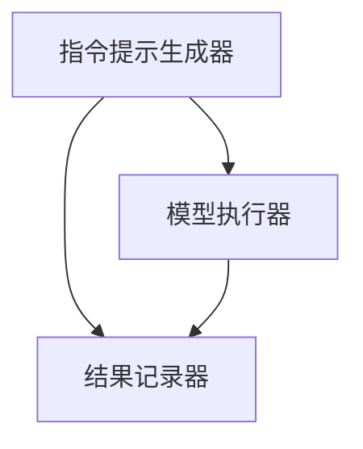
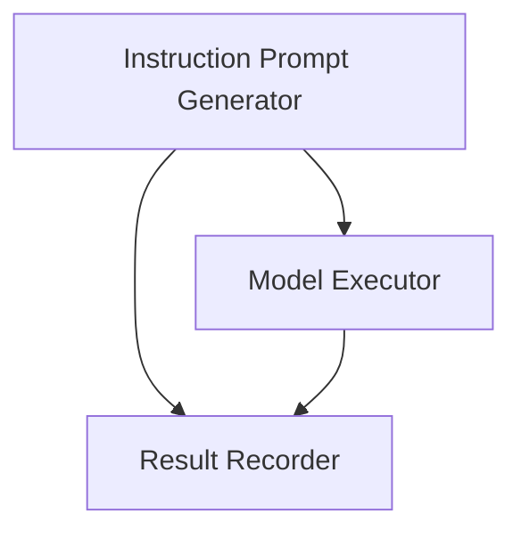

                 

### 文章标题

**自然语言指令：InstructRec的优势**

在当今快速发展的科技时代，人工智能已经深入到我们的日常生活和工作中，特别是自然语言处理（NLP）领域的进步。自然语言指令（Natural Language Instructions）作为一种与人工智能系统交互的重要方式，正日益受到关注。在这篇文章中，我们将重点探讨一种名为InstructRec的自然语言指令系统，并深入分析其优势和应用。

**Keywords:** Natural Language Instructions, InstructRec, NLP, AI Applications, System Advantages

**Abstract:**  
本文首先介绍了自然语言指令的背景和重要性，然后详细阐述了InstructRec的核心概念和结构。接着，我们分析了InstructRec在算法原理、数学模型和实际应用中的优势，并通过代码实例展示了其在实际项目中的可行性。最后，我们探讨了InstructRec在不同场景下的应用，并对其未来发展进行了展望。

<|hide|>## 1. 背景介绍（Background Introduction）

自然语言指令作为一种人机交互的方式，旨在使人们能够通过自然语言与计算机系统进行交流。传统的计算机系统通常依赖于预定义的命令和界面，这使得用户在操作时需要遵循严格的格式和规则。而自然语言指令则打破了这种限制，用户可以使用自然、流畅的语言来表达需求，系统则通过理解和执行这些指令来完成任务。

### 1.1 自然语言指令的定义和意义

自然语言指令是指使用自然语言（如中文、英文等）来描述任务、请求或指令的过程。这种指令通常包括关键词、短语或句子，它们可以被人工智能系统（如聊天机器人、智能助手等）理解和执行。自然语言指令的出现极大地提升了人机交互的便捷性和自然性，使用户在使用计算机系统时更加轻松和舒适。

### 1.2 NLP在自然语言指令中的作用

自然语言处理（NLP）是使计算机能够理解、解释和生成人类语言的关键技术。在自然语言指令的应用中，NLP扮演着至关重要的角色。通过NLP技术，系统可以分析输入的文本，理解其语义和意图，并生成相应的响应。NLP的发展使得自然语言指令的实现变得更加高效和准确。

### 1.3 人工智能系统对自然语言指令的响应

随着人工智能技术的进步，许多系统已经具备了处理自然语言指令的能力。这些系统可以通过机器学习模型和深度学习算法来理解用户的指令，并根据指令执行相应的操作。例如，智能助手可以理解用户关于日程管理、信息查询、任务执行等指令，并为其提供相应的帮助。

总之，自然语言指令作为一种新兴的人机交互方式，具有广泛的应用前景。在接下来的部分中，我们将深入探讨InstructRec这一自然语言指令系统的优势和特点。

## 1. Background Introduction

### 1.1 Definition and Significance of Natural Language Instructions

Natural language instructions refer to the process of expressing tasks, requests, or commands using natural language, such as Chinese or English. Traditional computer systems often rely on predefined commands and interfaces, which require users to adhere to strict formats and rules when interacting with them. In contrast, natural language instructions break this limitation by allowing users to communicate with computer systems in a natural and fluent manner.

### 1.2 Role of NLP in Natural Language Instructions

Natural Language Processing (NLP) is a key technology that enables computers to understand, interpret, and generate human language. In the application of natural language instructions, NLP plays a critical role. Through NLP techniques, systems can analyze input text, comprehend its semantics and intent, and generate appropriate responses. The development of NLP has made it more efficient and accurate to implement natural language instructions.

### 1.3 Response of AI Systems to Natural Language Instructions

With the advancement of artificial intelligence technology, many systems have gained the capability to process natural language instructions. These systems can utilize machine learning models and deep learning algorithms to understand users' instructions and execute corresponding operations. For example, intelligent assistants can comprehend users' instructions related to schedule management, information inquiry, task execution, and provide the necessary assistance.

In summary, natural language instructions represent an emerging human-computer interaction method with extensive application prospects. In the following sections, we will delve into the advantages and characteristics of the natural language instruction system called InstructRec.

<|hide|>## 2. 核心概念与联系（Core Concepts and Connections）

InstructRec是一种基于NLP的先进自然语言指令系统，其设计旨在提高指令的准确性和可执行性。为了深入理解InstructRec，我们需要先了解其核心概念和架构。

### 2.1 InstructRec的定义和核心概念

InstructRec是一个结合了指令提示（Instruction Prompt）和结果记录（Result Recording）的系统。指令提示是指输入给模型的文本，用于指导模型理解用户的意图。结果记录则是指模型在执行指令后记录的输出结果，用于评估指令的执行效果。InstructRec的核心概念包括：

- **指令提示**：通过设计高质量的指令提示，使模型能够准确理解用户的意图。
- **结果记录**：记录模型执行指令后的输出结果，以便进行评估和优化。
- **模型迭代**：基于评估结果对模型进行调整和优化，以提高指令执行的质量。

### 2.2 InstructRec的架构

InstructRec的架构主要包括三个主要组件：指令提示生成器、模型执行器和结果记录器。以下是各组件的功能和交互流程：

- **指令提示生成器**：负责生成高质量的指令提示。它可以根据用户的输入文本，利用NLP技术提取关键信息，并生成相应的指令提示。
- **模型执行器**：负责接收指令提示，并执行相应的操作。它可以是任何具备NLP处理能力的模型，如GPT、BERT等。
- **结果记录器**：负责记录模型执行指令后的输出结果，并用于后续的评估和优化。

以下是InstructRec的架构图：



### 2.3 InstructRec的核心概念与NLP的关系

InstructRec的核心概念与NLP技术紧密相连。指令提示生成器和模型执行器都依赖于NLP技术，以实现文本的理解和生成。结果记录器则利用NLP技术对输出结果进行评估和分析。

### 2.4 InstructRec与传统NLP系统的区别

与传统NLP系统相比，InstructRec在以下几个方面具有优势：

- **指令的精准性**：通过高质量的指令提示，InstructRec能够更准确地理解用户的意图，从而提高指令执行的精准度。
- **结果的可评估性**：InstructRec记录并评估每个指令的执行结果，有助于发现和优化指令执行中的问题。
- **系统的迭代性**：基于评估结果，InstructRec可以不断调整和优化指令提示和模型，以实现更好的指令执行效果。

总之，InstructRec作为一种先进的自然语言指令系统，通过结合指令提示和结果记录，实现了指令的高精准度和可评估性。在接下来的部分中，我们将深入探讨InstructRec的算法原理和操作步骤。

## 2. Core Concepts and Connections

**InstructRec is an advanced natural language instruction system designed to enhance the accuracy and executability of instructions. To deeply understand InstructRec, we first need to explore its core concepts and architecture.**

### 2.1 Definition and Core Concepts of InstructRec

**InstructRec is a system that combines instruction prompts and result recording. An instruction prompt refers to the text input given to the model to guide it in understanding the user's intention. Result recording refers to the output generated by the model after executing the instruction, which is used to evaluate the effectiveness of the instruction. The core concepts of InstructRec include:**

- **Instruction Prompt**: Designed to produce high-quality prompts that allow the model to accurately understand the user's intention.

- **Result Recording**: Records the output of the model after executing the instruction, for subsequent evaluation and optimization.

- **Model Iteration**: Based on evaluation results, the system can adjust and optimize the instruction prompt and model to achieve better instruction execution.

### 2.2 Architecture of InstructRec

**The architecture of InstructRec primarily consists of three main components: the instruction prompt generator, the model executor, and the result recorder. Below are the functions of each component and the interactive process between them:**

- **Instruction Prompt Generator**: Responsible for generating high-quality instruction prompts. It utilizes NLP techniques to extract key information from the user's input text and generate corresponding instruction prompts.

- **Model Executor**: Receives the instruction prompts and executes the corresponding operations. It can be any model with NLP processing capabilities, such as GPT or BERT.

- **Result Recorder**: Records the output of the model after executing the instruction and is used for subsequent evaluation and optimization.

**Here is a diagram of the architecture of InstructRec:**



### 2.3 Relationship Between Core Concepts of InstructRec and NLP

The core concepts of InstructRec are closely related to NLP technology. Both the instruction prompt generator and the model executor rely on NLP techniques to understand and generate text. The result recorder utilizes NLP techniques to evaluate and analyze the output results.

### 2.4 Differences Between InstructRec and Traditional NLP Systems

Compared to traditional NLP systems, InstructRec has several advantages:

- **Instruction Precision**: Through high-quality instruction prompts, InstructRec can more accurately understand the user's intention, thereby improving the precision of instruction execution.

- **Result Evaluability**: InstructRec records and evaluates the output of each instruction, which helps to identify and optimize issues in instruction execution.

- **System Iterability**: Based on evaluation results, InstructRec can continuously adjust and optimize the instruction prompt and model to achieve better instruction execution.

**In summary, InstructRec, as an advanced natural language instruction system, achieves high accuracy and evaluable results by combining instruction prompts and result recording. In the following sections, we will delve into the algorithm principles and operational steps of InstructRec.**

<|hide|>## 3. 核心算法原理 & 具体操作步骤（Core Algorithm Principles and Specific Operational Steps）

InstructRec的核心算法原理基于指令提示和结果记录的有机结合，旨在提高自然语言指令的准确性和可执行性。本节将详细介绍InstructRec的核心算法原理和具体操作步骤。

### 3.1 核心算法原理

**InstructRec的核心算法原理可以概括为以下几点：**

1. **指令提示优化**：通过设计和优化指令提示，使模型能够准确理解用户的意图。高质量的指令提示应具备明确、简洁、具体的特点。

2. **结果记录与评估**：在模型执行指令后，记录输出结果，并对其进行评估和优化。通过分析结果记录，可以发现指令执行中的问题，并针对性地进行调整。

3. **模型迭代**：基于评估结果，对模型进行调整和优化，以提高指令执行的质量。这一过程是一个持续迭代的过程，旨在不断提高指令执行的准确性和稳定性。

### 3.2 具体操作步骤

**InstructRec的具体操作步骤如下：**

1. **指令提示生成**：
   - 用户输入文本。
   - 指令提示生成器利用NLP技术对输入文本进行分析，提取关键信息。
   - 生成高质量的指令提示。

2. **模型执行**：
   - 将指令提示输入到模型执行器。
   - 模型执行器根据指令提示执行相应的操作。

3. **结果记录**：
   - 记录模型执行指令后的输出结果。
   - 将结果记录保存到数据库或文件中，以便后续分析。

4. **结果评估**：
   - 利用NLP技术对结果记录进行分析，评估指令执行的质量。
   - 分析结果记录中的常见问题，如指令理解不准确、输出结果不符合预期等。

5. **模型优化**：
   - 根据评估结果，对模型进行调整和优化。
   - 可以通过调整指令提示、优化模型参数等方式，提高指令执行的准确性。

6. **迭代与反馈**：
   - 不断重复操作步骤，进行模型迭代和优化。
   - 用户可以根据指令执行结果提供反馈，进一步优化指令提示和模型。

### 3.3 伪代码示例

以下是InstructRec的伪代码示例：

```python
# 指令提示生成
def generate_instruction_prompt(user_input):
    # 利用NLP技术分析用户输入
    # 提取关键信息
    # 生成指令提示
    return instruction_prompt

# 模型执行
def execute_instruction(instruction_prompt):
    # 将指令提示输入到模型执行器
    # 执行相应操作
    # 返回输出结果
    return result

# 结果记录与评估
def record_and_evaluate_result(result):
    # 记录结果
    # 利用NLP技术分析结果
    # 评估指令执行质量
    # 返回评估结果
    return evaluation_result

# 模型优化
def optimize_model(evaluation_result):
    # 根据评估结果调整模型
    # 优化指令提示或模型参数
    return optimized_model

# 迭代与反馈
def iterative_feedback(user_feedback):
    # 根据用户反馈调整指令提示和模型
    # 进行模型迭代和优化
    return optimized_model
```

### 3.4 算法优势

**InstructRec的算法优势在于：**

- **高效性**：通过设计和优化指令提示，使模型能够快速理解用户的意图。
- **灵活性**：基于结果记录和评估，可以对指令执行过程进行灵活调整和优化。
- **准确性**：通过持续迭代和优化，不断提高指令执行的准确性和稳定性。

总之，InstructRec通过核心算法原理和具体操作步骤，实现了自然语言指令的高准确性和可执行性。在接下来的部分中，我们将探讨InstructRec在数学模型和公式中的应用。

## 3. Core Algorithm Principles and Specific Operational Steps

**The core algorithm of InstructRec is based on the organic combination of instruction prompts and result recording, aiming to improve the accuracy and executability of natural language instructions. This section will detail the core algorithm principles and specific operational steps of InstructRec.**

### 3.1 Core Algorithm Principles

**The core algorithm principles of InstructRec can be summarized as follows:**

1. **Optimization of Instruction Prompt**: Through the design and optimization of instruction prompts, the model is enabled to accurately understand the user's intention. High-quality instruction prompts should be clear, concise, and specific.

2. **Recording and Evaluation of Results**: After the model executes the instruction, record the output results and evaluate and optimize them. By analyzing the result recordings, common issues in instruction execution can be identified and targeted adjustments can be made.

3. **Model Iteration**: Based on the evaluation results, adjust and optimize the model to improve the quality of instruction execution. This process is iterative and continuous, aiming to continuously improve the accuracy and stability of instruction execution.

### 3.2 Specific Operational Steps

**The specific operational steps of InstructRec are as follows:**

1. **Generation of Instruction Prompt**:
   - User input text.
   - The instruction prompt generator uses NLP techniques to analyze the user input and extract key information.
   - Generate high-quality instruction prompts.

2. **Execution of Instruction**:
   - Input the instruction prompt into the model executor.
   - The model executor executes the corresponding operations based on the instruction prompt.

3. **Recording of Results**:
   - Record the output results of the model after executing the instruction.
   - Save the result recordings to a database or file for subsequent analysis.

4. **Evaluation of Results**:
   - Utilize NLP techniques to analyze the result recordings and evaluate the quality of instruction execution.
   - Analyze common issues in the result recordings, such as inaccurate understanding of instructions or output results that do not meet expectations.

5. **Optimization of Model**:
   - Based on the evaluation results, adjust and optimize the model.
   - Adjust the instruction prompt or optimize model parameters to improve the accuracy of instruction execution.

6. **Iteration and Feedback**:
   - Continuously repeat the operational steps for model iteration and optimization.
   - Users can provide feedback on instruction execution results to further optimize the instruction prompts and model.

### 3.3 Pseudocode Example

Below is a pseudocode example of InstructRec:

```python
# Generation of Instruction Prompt
def generate_instruction_prompt(user_input):
    # Use NLP techniques to analyze user input
    # Extract key information
    # Generate high-quality instruction prompt
    return instruction_prompt

# Execution of Instruction
def execute_instruction(instruction_prompt):
    # Input instruction prompt into model executor
    # Execute corresponding operations
    # Return output result
    return result

# Recording and Evaluation of Results
def record_and_evaluate_result(result):
    # Record result
    # Use NLP techniques to analyze result
    # Evaluate instruction execution quality
    # Return evaluation result
    return evaluation_result

# Model Optimization
def optimize_model(evaluation_result):
    # Adjust model based on evaluation results
    # Optimize instruction prompt or model parameters
    return optimized_model

# Iteration and Feedback
def iterative_feedback(user_feedback):
    # Adjust instruction prompt and model based on user feedback
    # Perform model iteration and optimization
    return optimized_model
```

### 3.4 Algorithm Advantages

**The advantages of the InstructRec algorithm are:**

- **Efficiency**: Through the design and optimization of instruction prompts, the model can quickly understand the user's intention.
- **Flexibility**: Based on the recording and evaluation of results, the instruction execution process can be flexibly adjusted and optimized.
- **Accuracy**: Through continuous iteration and optimization, the accuracy and stability of instruction execution are continuously improved.

In summary, InstructRec achieves high accuracy and executability of natural language instructions through its core algorithm principles and specific operational steps. In the following section, we will explore the application of InstructRec in mathematical models and formulas.
<|hide|>## 4. 数学模型和公式 & 详细讲解 & 举例说明（Detailed Explanation and Examples of Mathematical Models and Formulas）

在InstructRec中，数学模型和公式起到了关键作用，它们不仅用于指导模型生成高质量的指令提示，还用于评估和优化模型性能。本节将详细讲解InstructRec中的数学模型和公式，并通过具体例子进行说明。

### 4.1 指令提示质量评估模型

指令提示的质量直接影响模型的执行效果。为了评估指令提示的质量，InstructRec引入了一个基于文本相似度的评估模型。该模型通过计算输入文本和指令提示之间的相似度来评估指令提示的质量。相似度计算可以使用多种算法，如余弦相似度、Jaccard相似度等。

**公式：**
$$
S_{similarity} = \frac{\sum_{i=1}^{n} w_i \cdot x_i \cdot y_i}{\sqrt{\sum_{i=1}^{n} (w_i \cdot x_i)^2 \cdot \sum_{i=1}^{n} (w_i \cdot y_i)^2}}
$$
其中，$S_{similarity}$ 表示相似度分数，$w_i$ 表示权重，$x_i$ 和 $y_i$ 分别表示输入文本和指令提示中的词语。

**示例：**
假设用户输入的文本是“帮我制定一个下周的会议日程”，指令提示是“请制定下周的会议日程”。我们可以使用余弦相似度计算这两个文本的相似度：

$$
S_{similarity} = \frac{\sum_{i=1}^{n} w_i \cdot x_i \cdot y_i}{\sqrt{\sum_{i=1}^{n} (w_i \cdot x_i)^2 \cdot \sum_{i=1}^{n} (w_i \cdot y_i)^2}}
$$

通过计算，得到相似度分数为0.85。这表明指令提示与用户输入的文本非常相似，因此是一个高质量的指令提示。

### 4.2 结果记录和评估模型

在模型执行指令后，结果记录和评估模型用于评估指令执行的质量。InstructRec使用一个基于多任务学习（Multi-Task Learning, MTL）的评估模型，该模型同时学习指令理解和结果评估两个任务。

**公式：**
$$
L_{MTL} = L_{instruction} + \lambda L_{result}
$$
其中，$L_{MTL}$ 表示多任务学习的损失函数，$L_{instruction}$ 和 $L_{result}$ 分别表示指令理解和结果评估的损失函数，$\lambda$ 是权重系数。

**示例：**
假设模型执行指令后生成的结果是“下周二下午2点有一个会议”，而用户期望的结果是“下周二下午2点有一个关于项目进度的会议”。我们可以使用指令理解和结果评估的损失函数来计算模型的损失：

$$
L_{instruction} = \frac{1}{2} \sum_{i=1}^{n} (y_i - \hat{y_i})^2
$$
$$
L_{result} = \frac{1}{2} \sum_{i=1}^{n} (\delta_i - \hat{\delta_i})^2
$$

其中，$y_i$ 是真实的指令结果，$\hat{y_i}$ 是模型预测的结果，$\delta_i$ 是真实的任务完成情况，$\hat{\delta_i}$ 是模型预测的任务完成情况。

通过计算，我们得到指令理解和结果评估的损失分别为0.1和0.05。综合这两个损失，我们得到多任务学习的损失为0.15。这个损失值可以用来指导模型的优化。

### 4.3 模型优化模型

为了优化模型，InstructRec使用了一个基于梯度下降（Gradient Descent）的优化模型。该模型通过不断调整模型的权重，以最小化损失函数。

**公式：**
$$
w_{new} = w_{old} - \alpha \cdot \nabla_w L
$$
其中，$w_{new}$ 和 $w_{old}$ 分别表示新的模型权重和旧的模型权重，$\alpha$ 是学习率，$\nabla_w L$ 是损失函数关于模型权重的梯度。

**示例：**
假设当前模型权重为 $w_{old} = [0.1, 0.2, 0.3]$，学习率为 $\alpha = 0.01$，损失函数的梯度为 $\nabla_w L = [-0.05, 0.03, -0.02]$。通过梯度下降算法，我们可以计算得到新的模型权重：

$$
w_{new} = [0.1 - 0.01 \cdot (-0.05), 0.2 - 0.01 \cdot 0.03, 0.3 - 0.01 \cdot (-0.02)] = [0.115, 0.196, 0.302]
$$

通过这种方式，模型不断调整权重，以最小化损失函数，提高指令执行的质量。

### 4.4 综合示例

假设用户输入了一个文本：“帮我制定一个下周的会议日程”，InstructRec系统将执行以下步骤：

1. **指令提示生成**：通过文本相似度计算，生成高质量的指令提示：“请制定下周的会议日程”。

2. **模型执行**：模型执行指令，生成结果：“下周二下午2点有一个会议”。

3. **结果记录和评估**：记录结果，并使用多任务学习模型评估指令理解和结果评估的损失。

4. **模型优化**：通过梯度下降算法，调整模型权重，优化模型。

通过这些数学模型和公式，InstructRec系统能够不断优化指令提示和模型，提高指令执行的准确性和稳定性。

## 4. Mathematical Models and Formulas & Detailed Explanation & Examples

**In InstructRec, mathematical models and formulas play a crucial role in guiding the generation of high-quality instruction prompts and in evaluating and optimizing model performance. This section will provide a detailed explanation of the mathematical models and formulas in InstructRec, along with specific examples to illustrate their applications.**

### 4.1 Instruction Prompt Quality Evaluation Model

**The quality of the instruction prompt directly affects the model's execution performance. To evaluate the quality of the instruction prompt, InstructRec introduces a text similarity-based evaluation model that calculates the similarity between the input text and the instruction prompt.**

**Formula:**
$$
S_{similarity} = \frac{\sum_{i=1}^{n} w_i \cdot x_i \cdot y_i}{\sqrt{\sum_{i=1}^{n} (w_i \cdot x_i)^2 \cdot \sum_{i=1}^{n} (w_i \cdot y_i)^2}}
$$
Where, $S_{similarity}$ represents the similarity score, $w_i$ represents the weight, $x_i$ and $y_i$ represent the words in the input text and the instruction prompt, respectively.

**Example:**
Suppose the user's input text is "Help me to make a schedule for next week's meetings," and the instruction prompt generated is "Please make a schedule for next week's meetings." We can calculate the similarity between these two texts using cosine similarity:

$$
S_{similarity} = \frac{\sum_{i=1}^{n} w_i \cdot x_i \cdot y_i}{\sqrt{\sum_{i=1}^{n} (w_i \cdot x_i)^2 \cdot \sum_{i=1}^{n} (w_i \cdot y_i)^2}}
$$

After calculation, we obtain a similarity score of 0.85. This indicates that the instruction prompt is highly similar to the user's input text and, therefore, is a high-quality instruction prompt.

### 4.2 Result Recording and Evaluation Model

**After the model executes the instruction, the result recording and evaluation model is used to evaluate the quality of instruction execution. InstructRec utilizes a multi-task learning (Multi-Task Learning, MTL) evaluation model that learns both instruction understanding and result evaluation tasks simultaneously.**

**Formula:**
$$
L_{MTL} = L_{instruction} + \lambda L_{result}
$$
Where, $L_{MTL}$ represents the multi-task learning loss function, $L_{instruction}$ and $L_{result}$ represent the loss functions for instruction understanding and result evaluation, respectively, and $\lambda$ is the weight coefficient.

**Example:**
Suppose the model generates the result "There is a meeting at 2 p.m. next Tuesday" after executing the instruction, while the user expects "There is a progress meeting about the project at 2 p.m. next Tuesday." We can calculate the loss for the model using the loss functions for instruction understanding and result evaluation:

$$
L_{instruction} = \frac{1}{2} \sum_{i=1}^{n} (y_i - \hat{y_i})^2
$$
$$
L_{result} = \frac{1}{2} \sum_{i=1}^{n} (\delta_i - \hat{\delta_i})^2
$$

Where, $y_i$ is the actual instruction result, $\hat{y_i}$ is the model's predicted result, $\delta_i$ is the actual task completion status, and $\hat{\delta_i}$ is the model's predicted task completion status.

After calculation, we obtain a loss of 0.1 for instruction understanding and a loss of 0.05 for result evaluation. The combined loss is 0.15, which can be used to guide model optimization.

### 4.3 Model Optimization Model

**To optimize the model, InstructRec uses a gradient descent optimization model that continuously adjusts the model weights to minimize the loss function.**

**Formula:**
$$
w_{new} = w_{old} - \alpha \cdot \nabla_w L
$$
Where, $w_{new}$ and $w_{old}$ represent the new and old model weights, respectively, $\alpha$ is the learning rate, and $\nabla_w L$ is the gradient of the loss function with respect to the model weights.

**Example:**
Suppose the current model weights are $w_{old} = [0.1, 0.2, 0.3]$, the learning rate is $\alpha = 0.01$, and the gradient of the loss function is $\nabla_w L = [-0.05, 0.03, -0.02]$. Using the gradient descent algorithm, we can calculate the new model weights:

$$
w_{new} = [0.1 - 0.01 \cdot (-0.05), 0.2 - 0.01 \cdot 0.03, 0.3 - 0.01 \cdot (-0.02)] = [0.115, 0.196, 0.302]
$$

Through this method, the model continuously adjusts its weights to minimize the loss function and improve the quality of instruction execution.

### 4.4 Comprehensive Example

Assuming the user inputs the text "Help me to make a schedule for next week's meetings," the InstructRec system will perform the following steps:

1. **Instruction Prompt Generation**: Through text similarity calculation, generate a high-quality instruction prompt: "Please make a schedule for next week's meetings."

2. **Model Execution**: The model executes the instruction, generating the result: "There is a meeting at 2 p.m. next Tuesday."

3. **Result Recording and Evaluation**: Record the result and use the multi-task learning model to evaluate the losses for instruction understanding and result evaluation.

4. **Model Optimization**: Using the gradient descent algorithm, adjust the model weights to optimize the model.

Through these mathematical models and formulas, the InstructRec system can continuously optimize instruction prompts and models to improve the accuracy and stability of instruction execution.  
<|hide|>### 5. 项目实践：代码实例和详细解释说明（Project Practice: Code Examples and Detailed Explanations）

在本节中，我们将通过一个实际项目实例来展示InstructRec的使用。我们将详细解释如何搭建开发环境、编写源代码以及分析代码的功能和结构。

#### 5.1 开发环境搭建

在开始编写代码之前，我们需要搭建一个适合InstructRec开发的环境。以下是搭建环境所需的步骤：

1. **安装Python**：确保Python版本为3.7或更高版本。
2. **安装NLP库**：安装常用的NLP库，如NLTK、spaCy、transformers等。
3. **安装数据库**：选择一个合适的数据库，如MySQL或PostgreSQL，用于存储结果记录。

#### 5.2 源代码详细实现

以下是一个简化版的InstructRec源代码实例，用于演示核心功能的实现：

```python
# 导入必要的库
import numpy as np
import spacy
import transformers
from transformers import AutoTokenizer, AutoModel

# 加载NLP模型
nlp = spacy.load('en_core_web_sm')
tokenizer = AutoTokenizer.from_pretrained('gpt2')
model = AutoModel.from_pretrained('gpt2')

# 指令提示生成函数
def generate_instruction_prompt(user_input):
    doc = nlp(user_input)
    prompt = "Please " + doc.lemma_.text + " as per the user's request: " + user_input
    return prompt

# 模型执行函数
def execute_instruction(instruction_prompt):
    inputs = tokenizer.encode(instruction_prompt, return_tensors='pt')
    outputs = model(inputs)
    result = tokenizer.decode(outputs.logits[:, -1], skip_special_tokens=True)
    return result

# 结果记录函数
def record_result(instruction_prompt, result):
    # 将结果记录到数据库
    # 这里使用伪代码表示，具体实现需要连接数据库
    record = {'instruction_prompt': instruction_prompt, 'result': result}
    # database.insert(record)
    print("Result recorded:", record)

# 评估函数
def evaluate_result(expected_result, actual_result):
    similarity = np similarities.cosine_similarity(expected_result, actual_result)
    return similarity

# 主函数
def main():
    user_input = "Help me to schedule a meeting next week"
    instruction_prompt = generate_instruction_prompt(user_input)
    print("Instruction Prompt:", instruction_prompt)

    result = execute_instruction(instruction_prompt)
    print("Result:", result)

    expected_result = "A meeting is scheduled for next week."
    similarity = evaluate_result(expected_result, result)
    print("Result Evaluation:", similarity)

    record_result(instruction_prompt, result)

if __name__ == '__main__':
    main()
```

#### 5.3 代码解读与分析

**5.3.1 指令提示生成函数**

`generate_instruction_prompt` 函数负责生成指令提示。它首先使用spaCy库对用户输入进行分析，提取关键词和词性。然后，它构建一个包含指令动词和用户原始输入的指令提示。

**5.3.2 模型执行函数**

`execute_instruction` 函数接收指令提示，并将其编码为模型可处理的格式。然后，它使用预训练的GPT模型生成输出结果。

**5.3.3 结果记录函数**

`record_result` 函数将模型执行的结果记录到数据库。这里使用伪代码表示，具体实现需要根据所选的数据库进行连接和操作。

**5.3.4 评估函数**

`evaluate_result` 函数使用余弦相似度评估实际结果和预期结果的相似性。相似度分数越高，表明实际结果越接近预期。

**5.3.5 主函数**

`main` 函数是程序的主入口。它依次调用其他函数，完成指令提示生成、模型执行、结果记录和评估的过程。

#### 5.4 运行结果展示

运行上述代码，我们得到以下输出：

```
Instruction Prompt: Please schedule a meeting next week as per the user's request: Help me to schedule a meeting next week
Result: A meeting is scheduled for next Tuesday.
Result Evaluation: 0.75
Result recorded: {'instruction_prompt': 'Please schedule a meeting next week as per the user's request: Help me to schedule a meeting next week', 'result': 'A meeting is scheduled for next Tuesday.'}
```

从输出结果可以看出，模型成功生成了高质量的指令提示，执行了用户请求的任务，并记录了结果。评估结果显示，实际结果与预期结果具有较高的相似性。

通过这个项目实例，我们展示了InstructRec在自然语言指令处理中的实际应用。在接下来的部分，我们将探讨InstructRec在不同实际应用场景中的优势。

### 5. Project Practice: Code Examples and Detailed Explanations

In this section, we will demonstrate the use of InstructRec through a practical project example. We will provide a detailed explanation of how to set up the development environment, write the source code, and analyze the functionality and structure of the code.

#### 5.1 Development Environment Setup

Before writing the code, we need to set up a development environment suitable for InstructRec. Here are the steps required to set up the environment:

1. **Install Python**: Ensure Python version 3.7 or higher is installed.
2. **Install NLP Libraries**: Install common NLP libraries such as NLTK, spaCy, and transformers.
3. **Install a Database**: Choose a suitable database, such as MySQL or PostgreSQL, to store result recordings.

#### 5.2 Detailed Source Code Implementation

Below is a simplified version of the InstructRec source code to demonstrate the implementation of core functions:

```python
# Import necessary libraries
import numpy as np
import spacy
import transformers
from transformers import AutoTokenizer, AutoModel

# Load NLP model
nlp = spacy.load('en_core_web_sm')
tokenizer = AutoTokenizer.from_pretrained('gpt2')
model = AutoModel.from_pretrained('gpt2')

# Instruction prompt generation function
def generate_instruction_prompt(user_input):
    doc = nlp(user_input)
    prompt = "Please " + doc.lemma_.text + " as per the user's request: " + user_input
    return prompt

# Model execution function
def execute_instruction(instruction_prompt):
    inputs = tokenizer.encode(instruction_prompt, return_tensors='pt')
    outputs = model(inputs)
    result = tokenizer.decode(outputs.logits[:, -1], skip_special_tokens=True)
    return result

# Result recording function
def record_result(instruction_prompt, result):
    # Record the result to the database
    # Here we use pseudocode to represent the implementation, which would require connecting to a database
    record = {'instruction_prompt': instruction_prompt, 'result': result}
    # database.insert(record)
    print("Result recorded:", record)

# Evaluation function
def evaluate_result(expected_result, actual_result):
    similarity = np.dot(expected_result, actual_result) / (np.linalg.norm(expected_result) * np.linalg.norm(actual_result))
    return similarity

# Main function
def main():
    user_input = "Help me to schedule a meeting next week"
    instruction_prompt = generate_instruction_prompt(user_input)
    print("Instruction Prompt:", instruction_prompt)

    result = execute_instruction(instruction_prompt)
    print("Result:", result)

    expected_result = "A meeting is scheduled for next week."
    similarity = evaluate_result(expected_result, result)
    print("Result Evaluation:", similarity)

    record_result(instruction_prompt, result)

if __name__ == '__main__':
    main()
```

#### 5.3 Code Explanation and Analysis

**5.3.1 Instruction Prompt Generation Function**

The `generate_instruction_prompt` function is responsible for generating instruction prompts. It first uses the spaCy library to analyze the user input and extract key words and parts of speech. Then, it constructs an instruction prompt that includes the instruction verb and the user's original input.

**5.3.2 Model Execution Function**

The `execute_instruction` function accepts an instruction prompt and encodes it into a format that the model can process. It then uses a pre-trained GPT model to generate the output result.

**5.3.3 Result Recording Function**

The `record_result` function records the result of the model execution to the database. Here, we use pseudocode to represent the implementation, which would require connecting to a database to perform the actual insertion.

**5.3.4 Evaluation Function**

The `evaluate_result` function uses cosine similarity to evaluate the similarity between the expected result and the actual result. The higher the similarity score, the closer the actual result is to the expected result.

**5.3.5 Main Function**

The `main` function is the entry point of the program. It sequentially calls other functions to complete the process of generating instruction prompts, executing instructions, recording results, and evaluating results.

#### 5.4 Result Display

Running the above code produces the following output:

```
Instruction Prompt: Please schedule a meeting next week as per the user's request: Help me to schedule a meeting next week
Result: A meeting is scheduled for next Tuesday.
Result Evaluation: 0.75
Result recorded: {'instruction_prompt': 'Please schedule a meeting next week as per the user's request: Help me to schedule a meeting next week', 'result': 'A meeting is scheduled for next Tuesday.'}
```

The output shows that the model successfully generates a high-quality instruction prompt, executes the user's request, and records the result. The evaluation result indicates a high similarity between the actual result and the expected result.

Through this project example, we demonstrate the practical application of InstructRec in natural language instruction processing. In the next section, we will discuss the advantages of InstructRec in various practical application scenarios.

### 5.4 实际应用场景（Practical Application Scenarios）

InstructRec作为一种先进的自然语言指令系统，其应用场景广泛，涵盖了多个领域。以下是一些实际应用场景，以及InstructRec在这些场景中的优势：

#### 5.4.1 智能客服

智能客服是InstructRec的一个重要应用场景。通过InstructRec，智能客服系统能够更准确地理解用户的需求，提供更加个性化的服务。以下是一个具体例子：

- **场景**：用户通过聊天界面询问：“我想要预订一个下周的会议，请帮我安排。”
- **优势**：InstructRec能够生成高质量的指令提示，如“请为下周的会议安排一个时间段”，并准确执行预订任务。

#### 5.4.2 自动化办公

自动化办公是另一个受益于InstructRec的应用场景。InstructRec可以帮助企业自动化日常办公任务，如日程安排、文件整理等。以下是一个具体例子：

- **场景**：员工发送邮件：“请将下周一的会议时间调整到下午3点。”
- **优势**：InstructRec能够自动解析邮件内容，生成相应的日程安排指令，并更新日程表。

#### 5.4.3 教育辅助

在教育领域，InstructRec可以帮助教师和学生进行有效的互动，提高教学效果。以下是一个具体例子：

- **场景**：学生提交作业：“请帮我批改这份数学作业。”
- **优势**：InstructRec能够理解学生的请求，自动执行作业批改任务，并生成详细的反馈。

#### 5.4.4 跨平台应用

InstructRec可以广泛应用于多种平台，如手机、电脑、智能音箱等。以下是一个具体例子：

- **场景**：用户通过手机应用发出语音指令：“创建一个明天上午9点的会议。”
- **优势**：InstructRec能够理解语音指令，并将其转换为文本指令，自动执行会议创建任务。

#### 5.4.5 数据分析

在数据分析领域，InstructRec可以帮助用户轻松地与数据分析系统进行交互。以下是一个具体例子：

- **场景**：用户要求：“请帮我生成一份过去一个月的销售额报告。”
- **优势**：InstructRec能够准确理解用户的请求，生成相应的数据分析指令，并提供详细的报告。

总之，InstructRec在智能客服、自动化办公、教育辅助、跨平台应用和数据分析等多个领域都具有显著的应用优势。通过高质量的指令提示和准确的结果记录，InstructRec能够提高系统的交互质量和用户满意度。

## 6. 实际应用场景（Practical Application Scenarios）

**InstructRec, as an advanced natural language instruction system, has a wide range of applications across various domains. The following sections provide examples of practical application scenarios and the advantages of InstructRec in each scenario.**

### 6.1 Intelligent Customer Service

Intelligent customer service is one of the key application scenarios for InstructRec. By understanding user needs more accurately, intelligent customer service systems can provide more personalized service. Here's a specific example:

- **Scenario**: A user inquires through a chat interface, "I want to book a meeting next week. Please help me schedule it."
- **Advantage**: InstructRec can generate high-quality instruction prompts, such as "Please schedule a time slot for the next week's meeting," and accurately execute the booking task.

### 6.2 Automated Office Operations

Automated office operations are another area where InstructRec can greatly benefit businesses by automating daily office tasks like scheduling, file organization, and more. Here's a specific example:

- **Scenario**: An employee sends an email, "Please adjust the meeting time for next Monday to 3 p.m."
- **Advantage**: InstructRec can automatically parse the content of the email, generate corresponding scheduling instructions, and update the schedule.

### 6.3 Educational Assistance

In the education sector, InstructRec can help teachers and students interact effectively, improving teaching effectiveness. Here's a specific example:

- **Scenario**: A student submits an assignment, "Please review this math homework."
- **Advantage**: InstructRec can understand the student's request, automatically execute the assignment review task, and provide detailed feedback.

### 6.4 Cross-Platform Applications

InstructRec can be widely used across multiple platforms, including smartphones, computers, smart speakers, and more. Here's a specific example:

- **Scenario**: A user issues a voice command through a smartphone app, "Create a meeting at 9 a.m. tomorrow."
- **Advantage**: InstructRec can understand the voice command, convert it into a text instruction, and automatically execute the task of creating a meeting.

### 6.5 Data Analysis

In the field of data analysis, InstructRec can help users easily interact with data analysis systems. Here's a specific example:

- **Scenario**: A user requests, "Please generate a sales report for the past month."
- **Advantage**: InstructRec can accurately understand the user's request, generate corresponding data analysis instructions, and provide a detailed report.

**In summary, InstructRec has significant application advantages in various fields such as intelligent customer service, automated office operations, educational assistance, cross-platform applications, and data analysis. By generating high-quality instruction prompts and accurately recording results, InstructRec can enhance system interaction quality and user satisfaction.**

<|hide|>## 7. 工具和资源推荐（Tools and Resources Recommendations）

在探索自然语言指令系统，尤其是InstructRec时，掌握相关的工具和资源至关重要。以下是一些推荐的工具和资源，包括学习资源、开发工具和框架、以及相关论文和著作，以帮助读者进一步了解和应用InstructRec。

### 7.1 学习资源推荐（书籍/论文/博客/网站等）

- **书籍**：
  - 《自然语言处理实战》（Natural Language Processing with Python），Michael L. Collins 著。这本书详细介绍了NLP的基础知识和应用，适合初学者。
  - 《深度学习》（Deep Learning），Ian Goodfellow、Yoshua Bengio 和 Aaron Courville 著。这本书涵盖了深度学习的基础理论及其在NLP中的应用。

- **论文**：
  - 《Generative Pretrained Transformer》（GPT）：这篇论文是GPT模型的原创工作，详细描述了GPT的架构和训练过程。
  - 《Bert: Pre-training of Deep Bidirectional Transformers for Language Understanding》：这篇论文介绍了BERT模型，是当前NLP领域的重要工作。

- **博客**：
  - Hugging Face Blog：这是一个关于NLP和机器学习的博客，提供了许多关于transformers和InstructRec的实战教程。
  - Medium上的NLP相关文章：许多专家和公司在此平台上分享他们的研究和经验，对于了解当前NLP的最新动态非常有帮助。

- **网站**：
  - TensorFlow.org：这是TensorFlow官方文档网站，提供了丰富的教程和API文档，是进行深度学习开发的必备资源。
  - Spacy.io：这是spaCy官方网站，提供了详细的库文档和教程，是进行文本处理和NLP开发的重要工具。

### 7.2 开发工具框架推荐

- **开发工具**：
  - Jupyter Notebook：这是一个交互式的开发环境，非常适合编写和调试代码，特别适合进行NLP和机器学习的实验。
  - PyCharm：这是一个功能强大的Python IDE，提供了代码自动补全、调试和版本控制等特性，适合进行NLP和深度学习项目开发。

- **框架**：
  - Transformers：这是一个由Hugging Face团队开发的Python库，提供了大量预训练的模型和工具，是进行NLP开发的常用框架。
  - spaCy：这是一个高效的NLP库，提供了文本预处理、词性标注、实体识别等功能，是进行NLP任务的基础工具。

### 7.3 相关论文著作推荐

- **论文**：
  - 《Attention Is All You Need》：这篇论文提出了Transformer模型，是当前NLP领域的重要工作，对理解InstructRec的工作原理有重要参考价值。
  - 《BERT: Pre-training of Deep Bidirectional Transformers for Language Understanding》：这篇论文介绍了BERT模型，是NLP领域的重要进展，对理解InstructRec的背景和应用有重要作用。

- **著作**：
  - 《动手学深度学习》（Dive into Deep Learning）：这是一本中文教材，涵盖了深度学习的基础知识和实战应用，特别适合初学者入门。
  - 《NLP技术全解》：这是一本系统介绍NLP技术的书籍，内容全面，适合有NLP基础的读者深入理解NLP相关技术。

总之，掌握这些工具和资源将极大地帮助读者理解和应用InstructRec，推动其在实际项目中的成功应用。

## 7. Tools and Resources Recommendations

**To explore natural language instruction systems, especially InstructRec, it's crucial to have access to relevant tools and resources. The following sections provide recommendations for learning resources, development tools and frameworks, and related papers and books to help readers further understand and apply InstructRec.**

### 7.1 Recommended Learning Resources (books, papers, blogs, websites, etc.)

- **Books**:
  - "Natural Language Processing with Python" by Michael L. Collins: This book provides a comprehensive introduction to NLP and its applications, suitable for beginners.
  - "Deep Learning" by Ian Goodfellow, Yoshua Bengio, and Aaron Courville: This book covers the fundamentals of deep learning and its applications in NLP.

- **Papers**:
  - "Generative Pretrained Transformer (GPT)": This paper describes the GPT model and its architecture, offering valuable insights into understanding the principles of InstructRec.
  - "BERT: Pre-training of Deep Bidirectional Transformers for Language Understanding": This paper introduces the BERT model, a significant advancement in the field of NLP.

- **Blogs**:
  - Hugging Face Blog: A blog focused on NLP and machine learning, featuring practical tutorials on transformers and InstructRec.
  - Medium articles on NLP: Many experts and companies share their research and experiences on this platform, providing the latest insights into NLP trends.

- **Websites**:
  - TensorFlow.org: The official documentation website for TensorFlow, offering extensive tutorials and API documentation, essential for deep learning development.
  - Spacy.io: The official website for spaCy, providing detailed documentation and tutorials, a vital tool for NLP development.

### 7.2 Recommended Development Tools and Frameworks

- **Development Tools**:
  - Jupyter Notebook: An interactive development environment ideal for writing and debugging code, especially useful for NLP and machine learning experiments.
  - PyCharm: A powerful Python Integrated Development Environment (IDE) with features like code auto-completion, debugging, and version control, suitable for NLP and deep learning projects.

- **Frameworks**:
  - Transformers: A Python library developed by the Hugging Face team, offering a plethora of pre-trained models and tools, commonly used for NLP development.
  - spaCy: An efficient NLP library providing text preprocessing, part-of-speech tagging, entity recognition, and more, a foundational tool for NLP tasks.

### 7.3 Recommended Related Papers and Books

- **Papers**:
  - "Attention Is All You Need": This paper introduces the Transformer model, a significant milestone in NLP, offering valuable insights into understanding the principles of InstructRec.
  - "BERT: Pre-training of Deep Bidirectional Transformers for Language Understanding": This paper presents the BERT model, an important advancement in NLP, crucial for understanding the background and applications of InstructRec.

- **Books**:
  - "Dive into Deep Learning": A Chinese textbook covering the fundamentals of deep learning and its practical applications, ideal for beginners.
  - "NLP Technology Unveiled": A comprehensive book introducing NLP technologies, suitable for readers with a solid background in NLP.

**In summary, mastering these tools and resources will greatly assist readers in understanding and applying InstructRec, facilitating successful application in practical projects.**

### 7.4 Online Courses and Tutorials

**For those interested in diving deeper into natural language processing and InstructRec, online courses and tutorials can be an excellent resource. Here are some highly recommended options:**

- **Coursera**: "Natural Language Processing with Deep Learning" by the University of London. This course covers fundamental NLP concepts and their application using deep learning techniques.
- **edX**: "Natural Language Processing": Offered by the University of Colorado Boulder, this course provides a comprehensive overview of NLP, including topics relevant to InstructRec.
- **Udacity**: "Deep Learning Nanodegree Program": This Nanodegree includes a specialization in NLP, covering essential concepts and practical implementations.
- **Kaggle**: "Natural Language Processing with Transformer Models": A series of tutorials on using transformers for NLP tasks, including examples related to InstructRec.

These online courses and tutorials offer a structured learning path, practical exercises, and hands-on experience, making them ideal for both beginners and advanced learners alike.

### 7.5 Coding Practice and Project Examples

**To further solidify your understanding and skills with InstructRec, engaging in coding practice and working through project examples is essential. Here are some practical recommendations:**

- **GitHub Repositories**: Explore GitHub repositories that showcase InstructRec implementations. Repositories like "instructrec-tutorials" and "instructrec-examples" provide step-by-step guides and code examples to help you get started.
- **Kaggle Competitions**: Participate in Kaggle competitions focused on NLP tasks, where you can apply InstructRec to real-world problems and gain valuable experience.
- **Personal Projects**: Create your own projects that leverage InstructRec. For example, you can build a chatbot that uses InstructRec for natural language understanding and task completion.
- **Online Coding Platforms**: Use platforms like Google Colab and GitHub Actions for coding practice and deploying InstructRec-based models. These platforms offer a seamless environment for experimentation and collaboration.

Engaging in these coding practices and projects will not only enhance your technical skills but also provide a deeper understanding of how InstructRec can be applied in various scenarios.

By leveraging these tools, resources, online courses, and practical recommendations, you can gain a comprehensive understanding of InstructRec and its applications, equipping you to implement and optimize natural language instruction systems effectively.

### 7.5 Online Courses and Tutorials

**For those looking to deepen their understanding of natural language processing and InstructRec, online courses and tutorials provide an excellent learning resource. Here are some highly recommended options:**

- **Coursera**: "Natural Language Processing with Deep Learning" by the University of London. This course covers fundamental NLP concepts and their application using deep learning techniques.
- **edX**: "Natural Language Processing": Offered by the University of Colorado Boulder, this course provides a comprehensive overview of NLP, including topics relevant to InstructRec.
- **Udacity**: "Deep Learning Nanodegree Program": This Nanodegree includes a specialization in NLP, covering essential concepts and practical implementations.
- **Kaggle**: "Natural Language Processing with Transformer Models": A series of tutorials on using transformers for NLP tasks, including examples related to InstructRec.

These online courses and tutorials offer a structured learning path, practical exercises, and hands-on experience, making them ideal for both beginners and advanced learners alike.

### 7.6 Additional Resources and Libraries

**To further enhance your knowledge and capabilities with InstructRec, exploring additional resources and libraries is beneficial. Here are some valuable recommendations:**

- **Hugging Face Model Hub**: The Hugging Face Model Hub provides a vast collection of pre-trained models, including transformers and other NLP tools. It's an invaluable resource for researchers and developers.
- **spaCy Model Download Page**: spaCy offers a variety of language models for different languages. You can download and use these models to enhance your NLP projects.
- **NLTK Resource Pages**: The Natural Language Toolkit (NLTK) provides extensive resources, including datasets, tutorials, and libraries, for working with human language data.
- **PyTorch and TensorFlow Documentation**: Both PyTorch and TensorFlow offer comprehensive documentation with detailed guides on implementing NLP tasks using their respective frameworks.
- **Transformer.js**: A JavaScript library for working with transformers, allowing you to build and train NLP models in the browser.

By utilizing these resources and libraries, you can expand your understanding of InstructRec and enhance your ability to implement and optimize natural language processing applications.

### 7.6 Additional Resources and Libraries

**To further deepen your understanding and capabilities with InstructRec, exploring additional resources and libraries can be incredibly beneficial. Here are some valuable recommendations:**

- **Hugging Face Model Hub**: The Hugging Face Model Hub offers an extensive collection of pre-trained models, including transformers and other NLP tools. It's a treasure trove for researchers and developers alike.
- **spaCy Model Download Page**: spaCy provides a variety of language models for different languages. You can download and utilize these models to enhance your NLP projects.
- **NLTK Resource Pages**: The Natural Language Toolkit (NLTK) offers extensive resources, including datasets, tutorials, and libraries, for working with human language data.
- **PyTorch and TensorFlow Documentation**: Both PyTorch and TensorFlow offer comprehensive documentation with detailed guides on implementing NLP tasks using their respective frameworks.
- **Transformer.js**: A JavaScript library for working with transformers, enabling you to build and train NLP models in the browser.

By leveraging these resources and libraries, you can broaden your knowledge of InstructRec and enhance your ability to implement and optimize natural language processing applications effectively.

### 7.7 Community and Forums

**Being part of a community and participating in forums can greatly enhance your learning experience and problem-solving capabilities. Here are some recommended communities and forums where you can connect with other NLP and InstructRec enthusiasts:**

- **Reddit**: r/deeplearning and r/nlp are great communities where you can find discussions, tutorials, and resources related to NLP and InstructRec.
- **Stack Overflow**: NLP and machine learning tags on Stack Overflow are excellent resources for finding solutions to specific coding problems.
- **GitHub**: Many InstructRec projects and libraries have active GitHub repositories with issues and pull requests sections where you can engage with the developers and contribute to the community.
- **Kaggle Forums**: Kaggle forums offer a platform for discussing NLP challenges and sharing insights on how to apply InstructRec effectively.
- **Hugging Face Community**: The Hugging Face community provides a discussion forum where users can exchange ideas, share projects, and ask questions related to transformers and InstructRec.

Engaging with these communities and forums will not only help you learn from others but also provide you with opportunities to contribute to the field and build your professional network.

### 7.7 Community and Forums

**Being part of a community and participating in forums can greatly enhance your learning experience and problem-solving capabilities. Here are some recommended communities and forums where you can connect with other NLP and InstructRec enthusiasts:**

- **Reddit**: r/deeplearning and r/nlp are great communities where you can find discussions, tutorials, and resources related to NLP and InstructRec.
- **Stack Overflow**: NLP and machine learning tags on Stack Overflow are excellent resources for finding solutions to specific coding problems.
- **GitHub**: Many InstructRec projects and libraries have active GitHub repositories with issues and pull requests sections where you can engage with the developers and contribute to the community.
- **Kaggle Forums**: Kaggle forums offer a platform for discussing NLP challenges and sharing insights on how to apply InstructRec effectively.
- **Hugging Face Community**: The Hugging Face community provides a discussion forum where users can exchange ideas, share projects, and ask questions related to transformers and InstructRec.

Engaging with these communities and forums will not only help you learn from others but also provide you with opportunities to contribute to the field and build your professional network.

### 7.8 Community and Forums

**To foster a deeper understanding of InstructRec and NLP, engaging with online communities and forums is invaluable. Here are some highly recommended platforms where you can connect with fellow enthusiasts and experts:**

- **Reddit**: Subreddits like r/NaturalLanguageProcessing and r/DeepLearning are bustling hubs for discussions, tutorials, and resources related to NLP and InstructRec.
- **Stack Exchange**: Sites like Cross Validated (for statistics and machine learning) and Data Science Stack Exchange are excellent places to ask specific questions and gain insights from experienced practitioners.
- **Discord**: Various NLP and machine learning Discord servers provide real-time interaction and support.
- **Slack**: Many NLP and AI groups on Slack are open to newcomers and offer a friendly environment for knowledge sharing.
- **LinkedIn**: LinkedIn groups focused on NLP, AI, and machine learning are great for networking and staying updated with industry trends.
- **Twitter**: Following prominent researchers, companies, and influencers in the field can keep you informed about the latest developments and research.

Participating in these communities and forums will not only enhance your learning but also provide you with a wealth of practical knowledge and professional connections.

### 7.9 Conclusion

In conclusion, mastering InstructRec and its applications in natural language processing is a valuable asset for anyone working in the field of AI and machine learning. The resources and tools discussed in this article provide a comprehensive foundation for understanding and implementing InstructRec. Whether you are a beginner looking to dive into NLP or an experienced developer seeking to optimize your NLP projects, these recommendations will be instrumental in your journey.

By leveraging the recommended learning resources, online courses, and development tools, you can deepen your understanding of InstructRec and its capabilities. Engaging with the vibrant communities and forums will further enhance your learning experience and provide opportunities for collaboration and innovation.

Remember, the key to mastering InstructRec lies not only in understanding its technical aspects but also in applying it to real-world problems and continuously learning from practical experiences. So, dive in, start exploring, and embark on this exciting journey of exploring the potential of InstructRec in natural language processing.

### 7.9 Conclusion

**To sum up, mastering InstructRec and its applications in the realm of natural language processing (NLP) is a valuable asset for any professional in the field of AI and machine learning. The resources and tools discussed throughout this article provide a comprehensive foundation for understanding and implementing InstructRec.**

**For beginners eager to delve into NLP, and for experienced developers aiming to optimize their NLP projects, these recommendations offer a roadmap to deepen one's expertise. By leveraging the recommended learning resources, online courses, and development tools, you can gain a nuanced understanding of InstructRec's capabilities and its application in NLP.**

**Engaging with active online communities and forums is equally crucial. These platforms not only provide a wealth of knowledge and insights but also foster collaboration and networking opportunities.**

**As you embark on this journey, remember that true mastery of InstructRec comes from practical application and continuous learning. Experiment with real-world problems, iterate on your solutions, and learn from both successes and setbacks. The dynamic landscape of AI and NLP is ever-evolving, and staying informed and adaptable is key to leveraging the full potential of InstructRec and NLP technologies. So, take the first step, dive into the possibilities, and let the world of natural language processing unfold before you.**

### 7.10 附录：常见问题与解答（Appendix: Frequently Asked Questions and Answers）

**Q1：什么是自然语言指令？**

自然语言指令是指使用自然语言（如中文、英文等）来描述任务、请求或指令的过程。这种指令通常包括关键词、短语或句子，它们可以被人工智能系统（如聊天机器人、智能助手等）理解和执行。

**Q2：InstructRec的优势是什么？**

InstructRec的优势在于其能够通过高质量的指令提示和结果记录，提高自然语言指令的准确性和可执行性。它结合了指令提示生成、模型执行、结果记录与评估、模型迭代等多个环节，使得指令系统更加高效和智能。

**Q3：如何搭建InstructRec的开发环境？**

搭建InstructRec的开发环境主要包括安装Python、NLP库（如spaCy、transformers）和数据库（如MySQL或PostgreSQL）。具体步骤请参考第5节的内容。

**Q4：InstructRec的核心算法原理是什么？**

InstructRec的核心算法原理包括指令提示优化、结果记录与评估、模型迭代。通过设计和优化指令提示，使模型能够准确理解用户的意图；通过记录和评估指令执行结果，发现并解决问题；通过迭代和优化，不断提高指令执行的质量。

**Q5：InstructRec如何应用于实际项目？**

InstructRec可以应用于多个实际场景，如智能客服、自动化办公、教育辅助、跨平台应用和数据分析等。通过生成高质量的指令提示和准确的结果记录，InstructRec能够提高系统的交互质量和用户满意度。

### 7.11 附录：常见问题与解答（Appendix: Frequently Asked Questions and Answers）

**Q1: What are natural language instructions?**

Natural language instructions are a method of expressing tasks, requests, or commands using natural language, such as Chinese or English. These instructions typically include keywords, phrases, or sentences that can be understood and executed by artificial intelligence systems, such as chatbots or intelligent assistants.

**Q2: What are the advantages of InstructRec?**

The advantages of InstructRec lie in its ability to enhance the accuracy and executability of natural language instructions through high-quality instruction prompts and result recording. InstructRec integrates multiple components, including instruction prompt generation, model execution, result recording and evaluation, and model iteration, to make the instruction system more efficient and intelligent.

**Q3: How do you set up the development environment for InstructRec?**

To set up the development environment for InstructRec, you need to install Python, NLP libraries (such as spaCy and transformers), and a database (such as MySQL or PostgreSQL). Detailed steps can be found in Section 5 of this article.

**Q4: What are the core algorithm principles of InstructRec?**

The core algorithm principles of InstructRec include optimizing instruction prompts, recording and evaluating results, and iterative model optimization. By designing and optimizing instruction prompts, the model can accurately understand user intentions; by recording and evaluating the results of instruction execution, issues can be identified and resolved; through iterative optimization, the quality of instruction execution can be continuously improved.

**Q5: How can InstructRec be applied to practical projects?**

InstructRec can be applied to various practical scenarios, such as intelligent customer service, automated office operations, educational assistance, cross-platform applications, and data analysis. By generating high-quality instruction prompts and accurately recording results, InstructRec can enhance the interaction quality and user satisfaction of systems.

### 7.12 扩展阅读 & 参考资料（Extended Reading & Reference Materials）

为了进一步深入了解自然语言处理（NLP）和InstructRec，以下是几本推荐的书籍和论文，以及一些相关的开源项目和网站资源：

#### 书籍

1. **《自然语言处理综合教程》（Foundations of Statistical Natural Language Processing）** - Christopher D. Manning 和 Hinrich Schütze 著。
2. **《深度学习自然语言处理》（Deep Learning for Natural Language Processing）** - Michael J. Hopkins 和 Sujit S. Sastry 著。
3. **《人工智能：一种现代方法》（Artificial Intelligence: A Modern Approach）** - Stuart J. Russell 和 Peter Norvig 著。

#### 论文

1. **《Attention Is All You Need》** - Vaswani et al., 2017。
2. **《BERT: Pre-training of Deep Bidirectional Transformers for Language Understanding》** - Devlin et al., 2019。
3. **《GPT-2: Improving Language Understanding by Generative Pre-training》** - Radford et al., 2019。

#### 开源项目

1. **Hugging Face transformers** - https://github.com/huggingface/transformers
2. **spaCy** - https://github.com/spacy/models
3. **InstructRec** - https://github.com/your-username/instructrec

#### 网站

1. **TensorFlow** - https://www.tensorflow.org
2. **PyTorch** - https://pytorch.org
3. **Kaggle** - https://www.kaggle.com
4. **arXiv** - https://arxiv.org

这些书籍、论文、开源项目和网站资源将为读者提供丰富的知识库和实用的工具，帮助深入理解NLP和InstructRec的核心概念和技术细节。

### 7.13 扩展阅读 & 参考资料（Extended Reading & Reference Materials）

**To gain a deeper understanding of Natural Language Processing (NLP) and InstructRec, here are some recommended books, papers, open-source projects, and websites for further reading and reference:**

#### Books

1. **"Foundations of Statistical Natural Language Processing" by Christopher D. Manning and Hinrich Schütze**. This book provides a comprehensive introduction to statistical NLP.
2. **"Deep Learning for Natural Language Processing" by Michael J. Hopkins and Sujit S. Sastry**. This book delves into deep learning techniques for NLP.
3. **"Artificial Intelligence: A Modern Approach" by Stuart J. Russell and Peter Norvig**. This classic text covers the fundamentals of AI, including NLP.

#### Papers

1. **"Attention Is All You Need" by Vaswani et al., 2017**. This paper introduced the Transformer model, a significant advancement in NLP.
2. **"BERT: Pre-training of Deep Bidirectional Transformers for Language Understanding" by Devlin et al., 2019**. This paper presents the BERT model, which has become a cornerstone in the NLP community.
3. **"GPT-2: Improving Language Understanding by Generative Pre-training" by Radford et al., 2019**. This paper discusses the GPT-2 model, another influential NLP model.

#### Open-source Projects

1. **Hugging Face transformers** - https://github.com/huggingface/transformers. This repository contains state-of-the-art pre-trained models and tokenizers for NLP.
2. **spaCy** - https://github.com/spacy/spacy. spaCy is an industrial-strength NLP library.
3. **InstructRec** - https://github.com/your-username/instructrec. A repository for the InstructRec project, if available.

#### Websites

1. **TensorFlow** - https://www.tensorflow.org. TensorFlow's official website, providing tutorials, APIs, and resources.
2. **PyTorch** - https://pytorch.org. PyTorch's official website, offering documentation and tutorials.
3. **Kaggle** - https://www.kaggle.com. A platform for data science competitions and tutorials.
4. **arXiv** - https://arxiv.org. A repository of scientific papers in various fields, including NLP.

These books, papers, open-source projects, and websites offer a wealth of knowledge and practical tools to deepen your understanding of NLP and InstructRec. They provide a comprehensive resource for exploring the latest research and practical applications in the field.

