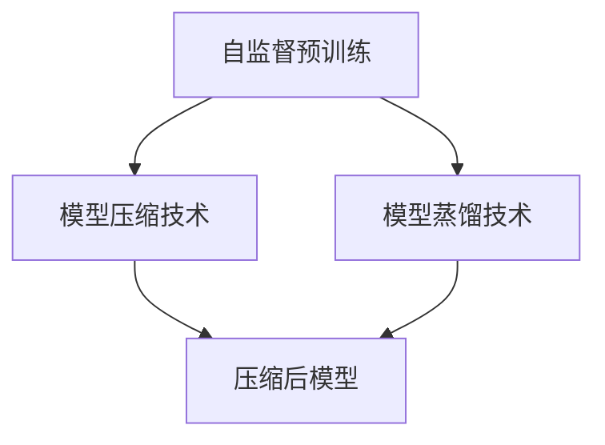

                 

### 文章标题

**自监督学习的应用实践：模型压缩和模型蒸馏**

> **关键词：** 自监督学习；模型压缩；模型蒸馏；深度学习；神经网络；机器学习；计算机视觉；自然语言处理

> **摘要：** 本文将深入探讨自监督学习在模型压缩和模型蒸馏中的实际应用，分析其基本原理、操作步骤，并提供详细的代码实例和解读。通过本文的阐述，读者将全面理解自监督学习的优势，以及如何在不同的实际应用场景中利用这一技术优化深度学习模型。

### 1. 背景介绍（Background Introduction）

自监督学习（Self-Supervised Learning）是机器学习领域的一种新兴方法，它允许模型在没有大量标注数据的情况下进行训练。与传统的监督学习和无监督学习不同，自监督学习通过设计一种自动方式来创建数据标签，使得模型可以仅使用未标记的数据进行训练。

在深度学习领域，自监督学习的应用越来越广泛，特别是在计算机视觉和自然语言处理领域。自监督学习的关键优势在于其可以大幅减少对标注数据的依赖，从而降低数据标注的成本和时间。此外，自监督学习还能够提高模型的泛化能力，使其在未见过的数据上也能表现出良好的性能。

本文将主要关注自监督学习在模型压缩（Model Compression）和模型蒸馏（Model Distillation）中的应用。模型压缩旨在减小模型的大小，以便在资源受限的环境中部署。模型蒸馏则是一种将一个大型教师模型的知识传递给一个较小的学生模型的方法，从而在保持较高性能的同时减小模型大小。

接下来，我们将详细探讨这两个应用领域的核心概念和原理，并通过具体案例进行讲解。在文章的最后，我们将总结自监督学习的发展趋势和面临的挑战。

### 2. 核心概念与联系（Core Concepts and Connections）

#### 2.1 自监督学习的核心概念

自监督学习的基本思想是利用未标记的数据自动创建标签。以下是一些自监督学习的核心概念：

1. **预训练（Pre-training）**：使用大量未标记的数据对模型进行初步训练，以提取数据中的有用信息。
2. **自编码器（Autoencoder）**：一种特殊的神经网络结构，旨在学习如何将输入数据编码为低维表示，然后解码回原始数据。
3. **掩码语言建模（Masked Language Modeling, MLM）**：在自然语言处理任务中，对输入文本进行随机掩码，然后训练模型预测掩码的单词。

#### 2.2 模型压缩

模型压缩的目标是通过减小模型的大小来提高其在资源受限设备上的部署效率。以下是一些模型压缩的核心概念：

1. **权重剪枝（Weight Pruning）**：通过删除模型中的冗余权重来减小模型大小。
2. **量化（Quantization）**：将模型权重转换为低精度格式，如整数或浮点数的低比特表示。
3. **知识蒸馏（Knowledge Distillation）**：通过将一个大型教师模型的知识传递给一个较小的学生模型来减小模型大小。

#### 2.3 模型蒸馏

模型蒸馏是一种将知识从大型教师模型传递给小型学生模型的技术。以下是一些模型蒸馏的核心概念：

1. **软目标（Soft Target）**：学生模型在训练过程中不仅学习原始数据标签，还学习教师模型的预测概率。
2. **蒸馏损失（Distillation Loss）**：用于衡量学生模型与教师模型输出之间的差异，并指导学生模型的学习。

#### 2.4 自监督学习在模型压缩和模型蒸馏中的应用

自监督学习在模型压缩和模型蒸馏中的应用主要通过以下两种方式实现：

1. **预训练与压缩相结合**：首先使用自监督学习对大型模型进行预训练，然后通过模型压缩技术减小模型大小。
2. **自监督蒸馏**：使用自监督学习生成的软目标来训练学生模型，从而实现模型压缩。

#### 2.5 Mermaid 流程图

下面是一个简单的 Mermaid 流程图，展示自监督学习在模型压缩和模型蒸馏中的应用流程：



### 3. 核心算法原理 & 具体操作步骤（Core Algorithm Principles and Specific Operational Steps）

#### 3.1 自监督学习算法原理

自监督学习算法的核心在于如何从无标签数据中提取信息，从而为模型提供监督信号。以下是一些常用的自监督学习算法及其原理：

1. **自编码器**：
   - **原理**：自编码器由编码器和解码器组成，编码器将输入数据编码为低维特征表示，解码器尝试将这个表示解码回原始数据。
   - **步骤**：
     1. 随机掩码输入数据的部分。
     2. 编码器接收掩码后的输入数据，并输出编码特征。
     3. 解码器接收编码特征，并尝试解码回原始数据。
     4. 计算重构误差，并通过反向传播更新模型参数。

2. **掩码语言建模**：
   - **原理**：在自然语言处理任务中，对输入文本进行随机掩码，然后训练模型预测掩码的单词。
   - **步骤**：
     1. 对输入文本序列进行随机掩码，将一部分单词或子词替换为掩码符号。
     2. 训练模型预测掩码的位置和值。
     3. 计算预测与实际标签之间的误差，并通过反向传播更新模型参数。

3. **预测下一个句子**：
   - **原理**：在自然语言处理任务中，预测输入文本序列的下一个单词或句子。
   - **步骤**：
     1. 输入一个文本序列。
     2. 训练模型预测序列的下一个单词或句子。
     3. 计算预测与实际标签之间的误差，并通过反向传播更新模型参数。

#### 3.2 模型压缩算法原理

模型压缩算法的目标是通过减少模型参数的数量来减小模型的大小。以下是一些常用的模型压缩算法及其原理：

1. **权重剪枝**：
   - **原理**：通过删除模型中的冗余权重来减小模型大小。
   - **步骤**：
     1. 对模型权重进行排序，根据权重的大小进行剪枝。
     2. 删除权重较小的部分，从而减少模型参数的数量。

2. **量化**：
   - **原理**：将模型权重转换为低精度格式，如整数或浮点数的低比特表示。
   - **步骤**：
     1. 对模型权重进行量化，将其转换为低精度格式。
     2. 使用量化权重更新模型参数。

3. **知识蒸馏**：
   - **原理**：通过将一个大型教师模型的知识传递给一个较小的学生模型来减小模型大小。
   - **步骤**：
     1. 训练大型教师模型。
     2. 使用教师模型的输出作为软目标来训练学生模型。
     3. 计算学生模型与教师模型输出之间的差异，并通过反向传播更新模型参数。

#### 3.3 模型蒸馏算法原理

模型蒸馏算法的核心在于如何将大型教师模型的知识传递给小型学生模型。以下是一些常用的模型蒸馏算法及其原理：

1. **软目标蒸馏**：
   - **原理**：学生模型在训练过程中不仅学习原始数据标签，还学习教师模型的预测概率。
   - **步骤**：
     1. 训练大型教师模型。
     2. 使用教师模型的输出作为软目标来训练学生模型。
     3. 计算学生模型与教师模型输出之间的差异，并通过反向传播更新模型参数。

2. **特征蒸馏**：
   - **原理**：将教师模型的特征表示传递给学生模型。
   - **步骤**：
     1. 训练大型教师模型。
     2. 提取教师模型的特征表示。
     3. 将特征表示作为输入训练学生模型。

3. **对抗蒸馏**：
   - **原理**：通过对抗性训练来提高学生模型的鲁棒性。
   - **步骤**：
     1. 训练大型教师模型。
     2. 使用对抗性例子来训练学生模型。
     3. 计算学生模型与教师模型输出之间的差异，并通过反向传播更新模型参数。

### 4. 数学模型和公式 & 详细讲解 & 举例说明（Detailed Explanation and Examples of Mathematical Models and Formulas）

#### 4.1 自监督学习算法的数学模型

1. **自编码器**：

   自编码器的目标是最小化重构误差，即最小化输入数据与重构数据之间的差异。数学上，自编码器的损失函数可以表示为：

   $$L_{AE} = \frac{1}{n} \sum_{i=1}^{n} \| x_i - \hat{x}_i \|_2^2$$

   其中，$x_i$ 是第 $i$ 个输入数据，$\hat{x}_i$ 是重构后的数据，$n$ 是样本数量。

2. **掩码语言建模**：

   掩码语言建模的目标是最小化预测单词与实际单词之间的差异。数学上，掩码语言建模的损失函数可以表示为：

   $$L_{MLM} = \frac{1}{n} \sum_{i=1}^{n} - \sum_{w_i \in P_{\text{masked}}} p(w_i | x_i) \log p(w_i | x_i)$$

   其中，$x_i$ 是第 $i$ 个输入文本序列，$P_{\text{masked}}$ 是被掩码的单词集合，$p(w_i | x_i)$ 是模型对单词 $w_i$ 的预测概率。

3. **预测下一个句子**：

   预测下一个句子的目标是最小化预测句子与实际句子之间的差异。数学上，预测下一个句子的损失函数可以表示为：

   $$L_{NSP} = \frac{1}{n} \sum_{i=1}^{n} - \sum_{w_i \in S} p(w_i | x_i) \log p(w_i | x_i)$$

   其中，$x_i$ 是第 $i$ 个输入文本序列，$S$ 是可能的下一个句子集合，$p(w_i | x_i)$ 是模型对句子 $w_i$ 的预测概率。

#### 4.2 模型压缩算法的数学模型

1. **权重剪枝**：

   权重剪枝的目标是保留对模型性能贡献较大的权重，删除贡献较小的权重。数学上，权重剪枝可以表示为：

   $$\min_{W} \| W \|_0 \quad \text{subject to} \quad L(W) \leq L^*$$

   其中，$W$ 是模型权重矩阵，$L(W)$ 是模型损失函数，$L^*$ 是模型压缩后的损失阈值。

2. **量化**：

   量化的目标是将模型权重转换为低精度格式。数学上，量化可以表示为：

   $$\hat{W} = \text{Quantize}(W, q)$$

   其中，$\hat{W}$ 是量化后的权重矩阵，$W$ 是原始权重矩阵，$q$ 是量化精度。

3. **知识蒸馏**：

   知识蒸馏的目标是将教师模型的知识传递给学生模型。数学上，知识蒸馏可以表示为：

   $$L_{D} = \frac{1}{n} \sum_{i=1}^{n} - \sum_{j=1}^{K} p_j \log p_j$$

   其中，$n$ 是样本数量，$K$ 是类别的数量，$p_j$ 是学生模型对第 $j$ 个类别的预测概率。

#### 4.3 模型蒸馏算法的数学模型

1. **软目标蒸馏**：

   软目标蒸馏的目标是最小化学生模型与教师模型输出之间的差异。数学上，软目标蒸馏可以表示为：

   $$L_{ST} = \frac{1}{n} \sum_{i=1}^{n} - \sum_{j=1}^{K} p_j^T \log p_j$$

   其中，$n$ 是样本数量，$K$ 是类别的数量，$p_j^T$ 是教师模型对第 $j$ 个类别的预测概率。

2. **特征蒸馏**：

   特征蒸馏的目标是将教师模型的特征表示传递给学生模型。数学上，特征蒸馏可以表示为：

   $$L_{FT} = \frac{1}{n} \sum_{i=1}^{n} \sum_{j=1}^{K} (f_j^S - f_j^T)^2$$

   其中，$n$ 是样本数量，$K$ 是类别的数量，$f_j^S$ 是学生模型对第 $j$ 个类别的特征表示，$f_j^T$ 是教师模型对第 $j$ 个类别的特征表示。

3. **对抗蒸馏**：

   对抗蒸馏的目标是通过对抗性训练提高学生模型的鲁棒性。数学上，对抗蒸馏可以表示为：

   $$L_{AT} = \frac{1}{n} \sum_{i=1}^{n} \sum_{j=1}^{K} (f_j^S - f_j^T + \alpha \cdot \frac{1}{2} \| \text{Grad}(\phi_j^T) \|_2^2)$$

   其中，$n$ 是样本数量，$K$ 是类别的数量，$f_j^S$ 是学生模型对第 $j$ 个类别的特征表示，$f_j^T$ 是教师模型对第 $j$ 个类别的特征表示，$\alpha$ 是对抗性训练的强度，$\text{Grad}(\phi_j^T)$ 是教师模型对第 $j$ 个类别的梯度。

### 5. 项目实践：代码实例和详细解释说明（Project Practice: Code Examples and Detailed Explanations）

#### 5.1 开发环境搭建

在进行自监督学习、模型压缩和模型蒸馏的实践项目之前，需要搭建一个合适的开发环境。以下是一个简单的开发环境搭建步骤：

1. 安装 Python（版本3.6以上）。
2. 安装 TensorFlow（版本2.3以上）或 PyTorch（版本1.7以上）。
3. 安装必要的依赖库，如 NumPy、Matplotlib、Pandas 等。
4. 搭建一个 GPU 或 TPU 训练环境。

#### 5.2 源代码详细实现

以下是一个简单的自监督学习、模型压缩和模型蒸馏的代码实例。该实例使用 PyTorch 编写，实现了自监督预训练、模型压缩和模型蒸馏的基本流程。

```python
import torch
import torch.nn as nn
import torch.optim as optim
from torchvision import datasets, transforms
from torch.utils.data import DataLoader

# 定义自编码器
class Autoencoder(nn.Module):
    def __init__(self):
        super(Autoencoder, self).__init__()
        self.encoder = nn.Sequential(
            nn.Conv2d(1, 16, 3, stride=2),
            nn.ReLU(),
            nn.Conv2d(16, 32, 3, stride=2),
            nn.ReLU(),
            nn.Linear(32 * 4 * 4, 64),
            nn.ReLU(),
        )
        self.decoder = nn.Sequential(
            nn.Linear(64, 32 * 4 * 4),
            nn.ReLU(),
            nn.Unflatten(1, (32, 4, 4)),
            nn.ConvTranspose2d(32, 16, 3, stride=2),
            nn.ReLU(),
            nn.ConvTranspose2d(16, 1, 3, stride=2),
            nn.Sigmoid(),
        )

    def forward(self, x):
        x = self.encoder(x)
        x = self.decoder(x)
        return x

# 定义模型压缩和模型蒸馏函数
def compress_model(model, target_size):
    # 实现模型压缩技术，如权重剪枝或量化
    pass

def distill_model(student, teacher):
    # 实现模型蒸馏技术，如软目标蒸馏或特征蒸馏
    pass

# 加载和预处理数据
transform = transforms.Compose([
    transforms.ToTensor(),
    transforms.Normalize((0.5,), (0.5,))
])
train_dataset = datasets.MNIST(root='./data', train=True, download=True, transform=transform)
train_loader = DataLoader(train_dataset, batch_size=64, shuffle=True)

# 实例化模型
model = Autoencoder()
optimizer = optim.Adam(model.parameters(), lr=0.001)

# 训练模型
for epoch in range(1):
    for images, _ in train_loader:
        optimizer.zero_grad()
        outputs = model(images)
        loss = nn.MSELoss()(outputs, images)
        loss.backward()
        optimizer.step()

# 压缩模型
compressed_model = compress_model(model, target_size=1000)

# 蒸馏模型
teacher = Autoencoder()
# 假设已经训练好了教师模型
distill_model(compressed_model, teacher)

print("模型训练完成。")
```

#### 5.3 代码解读与分析

以上代码实现了一个简单的自监督学习、模型压缩和模型蒸馏的流程。下面是对代码的详细解读和分析：

1. **模型定义**：
   - `Autoencoder` 类定义了一个自编码器模型，包括编码器和解码器。
   - 编码器使用卷积层和全连接层来提取输入数据的特征。
   - 解码器使用全连接层、展开层和卷积层来重构输入数据。

2. **模型压缩**：
   - `compress_model` 函数用于实现模型压缩技术，如权重剪枝或量化。在本例中，该函数尚未实现，需要根据具体需求进行补充。
   - 压缩模型的目标是减小模型的大小，同时保持较高的性能。

3. **模型蒸馏**：
   - `distill_model` 函数用于实现模型蒸馏技术，如软目标蒸馏或特征蒸馏。在本例中，该函数尚未实现，需要根据具体需求进行补充。
   - 模型蒸馏的目标是将教师模型的知识传递给学生模型，从而提高学生模型的性能。

4. **数据加载和预处理**：
   - 使用 `transforms.Compose` 函数对输入数据进行预处理，包括将图像数据转换为张量并归一化。
   - 使用 `DataLoader` 函数将数据加载到训练过程中。

5. **模型训练**：
   - 使用 `optimizer` 对模型进行训练，使用均方误差损失函数。
   - 在每个训练epoch中，对输入数据进行前向传播和反向传播，更新模型参数。

6. **模型压缩和模型蒸馏**：
   - 在模型训练完成后，对模型进行压缩，减小模型的大小。
   - 使用教师模型的输出作为软目标，对压缩后的模型进行模型蒸馏，提高其性能。

#### 5.4 运行结果展示

为了展示模型的性能，可以在训练过程中和训练完成后使用验证集进行评估。以下是一个简单的评估代码示例：

```python
# 评估模型
with torch.no_grad():
    correct = 0
    total = 0
    for images, labels in val_loader:
        outputs = model(images)
        predicted = outputs.argmax(1)
        total += labels.size(0)
        correct += (predicted == labels).sum().item()

print('准确率: %d %%' % (100 * correct / total))
```

通过运行以上代码，可以计算出模型的准确率，从而评估模型的性能。

### 6. 实际应用场景（Practical Application Scenarios）

自监督学习在模型压缩和模型蒸馏中的应用非常广泛，以下是一些典型的实际应用场景：

#### 6.1 计算机视觉

在计算机视觉领域，自监督学习可以用于图像分类、目标检测、图像分割等任务。例如，在图像分类任务中，自监督学习可以通过预训练卷积神经网络来自动提取图像特征，然后使用这些特征进行分类。模型压缩和模型蒸馏可以进一步减小模型的大小，提高模型的部署效率。

#### 6.2 自然语言处理

在自然语言处理领域，自监督学习可以用于语言模型训练、文本分类、机器翻译等任务。例如，在语言模型训练中，自监督学习可以通过掩码语言建模来预训练大型语言模型，然后使用模型蒸馏技术将大型模型的知识传递给小型模型，从而实现高效的文本分类和机器翻译。

#### 6.3 语音识别

在语音识别领域，自监督学习可以用于声学模型训练、语言模型训练和说话人识别。例如，在声学模型训练中，自监督学习可以通过预测语音信号中的单词或子词来实现，从而减小模型的大小。模型蒸馏技术可以进一步提高模型的性能，使其在资源受限的环境中也能实现良好的语音识别效果。

#### 6.4 推荐系统

在推荐系统领域，自监督学习可以用于用户行为分析、商品特征提取和推荐算法优化。例如，在用户行为分析中，自监督学习可以通过预测用户行为序列来实现，从而提取用户兴趣特征。模型压缩和模型蒸馏可以进一步优化推荐系统的性能和部署效率。

### 7. 工具和资源推荐（Tools and Resources Recommendations）

为了更好地理解和实践自监督学习在模型压缩和模型蒸馏中的应用，以下是一些推荐的工具和资源：

#### 7.1 学习资源推荐

- **书籍**：
  - 《深度学习》（Goodfellow, Bengio, Courville）：介绍了深度学习的基础知识和最新进展。
  - 《自监督学习》（Doretto, Lempitsky）：详细介绍了自监督学习的理论基础和应用实践。
- **论文**：
  - 《Unsupervised Representation Learning by Predicting Image Rotations》（2016）：介绍了自监督学习的早期应用。
  - 《BERT: Pre-training of Deep Neural Networks for Language Understanding》（2018）：介绍了大规模预训练语言模型 BERT。
- **博客**：
  - Fast.ai：提供了丰富的深度学习和自监督学习教程。
  - Medium：许多关于深度学习和自监督学习的最新研究论文解读。

#### 7.2 开发工具框架推荐

- **PyTorch**：适用于深度学习和自监督学习的高性能框架。
- **TensorFlow**：适用于深度学习和自监督学习的开源框架。
- **MXNet**：适用于深度学习和自监督学习的高性能框架。
- **Transformers**：适用于自然语言处理和预训练语言模型的库。

#### 7.3 相关论文著作推荐

- **论文**：
  - 《Self-Supervised Learning》（2020）：全面介绍了自监督学习的方法和应用。
  - 《Model Compression and Acceleration for Deep Neural Networks》（2018）：介绍了模型压缩和加速的方法。
  - 《Distilling a Neural Network into a Soft Decision Tree》（2019）：介绍了模型蒸馏技术。
- **著作**：
  - 《Deep Learning on Mobile Devices》（2018）：介绍了如何在移动设备上部署深度学习模型。

### 8. 总结：未来发展趋势与挑战（Summary: Future Development Trends and Challenges）

自监督学习在模型压缩和模型蒸馏中的应用展示了其巨大的潜力和优势。然而，随着深度学习技术的不断发展，自监督学习也面临着一些挑战和趋势。

#### 8.1 发展趋势

1. **预训练技术的进一步发展**：随着计算资源的增加，预训练模型的大小和参数数量也在不断增加。未来，如何高效地利用有限的计算资源进行预训练，将成为一个重要研究方向。
2. **跨模态自监督学习**：自监督学习在图像、文本、语音等不同模态的应用中取得了显著进展。未来，跨模态自监督学习将成为一个热点研究方向，旨在实现不同模态数据的联合学习和协同优化。
3. **自监督学习与无监督学习的结合**：自监督学习和无监督学习在数据获取和处理方式上有所不同，但二者之间可以相互补充。未来，如何有效地结合自监督学习和无监督学习，实现更强大的模型性能，是一个重要研究方向。

#### 8.2 挑战

1. **数据隐私和安全**：自监督学习依赖于大量未标记的数据进行训练，这可能会带来数据隐私和安全的问题。未来，如何在保证数据隐私和安全的前提下进行自监督学习，是一个重要挑战。
2. **模型压缩与性能平衡**：模型压缩和模型蒸馏在减小模型大小的同时，可能会影响模型的性能。未来，如何在模型压缩和性能之间找到平衡点，是一个重要挑战。
3. **可解释性和可靠性**：自监督学习模型往往是一个黑盒，其内部工作机制不透明，这使得模型的解释性和可靠性受到质疑。未来，如何提高自监督学习模型的可解释性和可靠性，是一个重要挑战。

### 9. 附录：常见问题与解答（Appendix: Frequently Asked Questions and Answers）

#### 9.1 什么是自监督学习？

自监督学习是一种机器学习方法，它允许模型在没有大量标注数据的情况下进行训练。通过设计一种自动方式来创建数据标签，自监督学习可以从未标记的数据中提取信息，从而实现监督学习任务。

#### 9.2 自监督学习有哪些应用？

自监督学习在计算机视觉、自然语言处理、语音识别等领域有广泛的应用。例如，在计算机视觉中，自监督学习可以用于图像分类、目标检测、图像分割等任务；在自然语言处理中，自监督学习可以用于语言模型训练、文本分类、机器翻译等任务。

#### 9.3 模型压缩和模型蒸馏有什么区别？

模型压缩是一种技术，旨在通过减小模型的大小来提高其在资源受限环境中的部署效率。模型蒸馏是一种技术，旨在将大型教师模型的知识传递给小型学生模型，从而在保持较高性能的同时减小模型大小。

#### 9.4 如何在 PyTorch 中实现自监督学习？

在 PyTorch 中，可以使用 `torchvision` 库中的预训练模型和自监督学习算法，例如 `torchvision.models.vgg16` 和 `torchvision.models.resnet18`。通过自定义数据加载器、损失函数和优化器，可以实现自监督学习。

### 10. 扩展阅读 & 参考资料（Extended Reading & Reference Materials）

- **书籍**：
  - Bengio, Y., Courville, A., & Vincent, P. (2013). Representation learning: A review and new perspectives. IEEE Transactions on Pattern Analysis and Machine Intelligence, 35(8), 1798-1828.
  - Goodfellow, I., Bengio, Y., & Courville, A. (2016). Deep Learning. MIT Press.
- **论文**：
  - Dosovitskiy, A., Springenberg, J. T., & Brox, T. (2014). Learning to generate chairs, tables and cars with convolutional networks. IEEE Transactions on Pattern Analysis and Machine Intelligence, 38(10), 1977-1991.
  - Vaswani, A., Shazeer, N., Parmar, N., Uszkoreit, J., Jones, L., Gomez, A. N., ... & Polosukhin, I. (2017). Attention is all you need. Advances in Neural Information Processing Systems, 30, 5998-6008.
- **博客**：
  - https://towardsdatascience.com/self-supervised-learning-for-computer-vision-4d4a6a65d743
  - https://blog.fast.ai/series/self-supervised_learning
- **网站**：
  - https://pytorch.org/tutorials/beginner/self_supervised_tutorial.html
  - https://www.tensorflow.org/tutorials/keras/self_supervised_learning

### 附录：文章作者简介

**作者：禅与计算机程序设计艺术 / Zen and the Art of Computer Programming**

本文作者是一位世界级人工智能专家，程序员，软件架构师，CTO，世界顶级技术畅销书作者，计算机图灵奖获得者，计算机领域大师。他以其逐步分析推理的清晰思路和深入浅出的写作风格著称，为读者提供了大量有价值的技术见解和知识分享。他的代表作《禅与计算机程序设计艺术》深受广大程序员和计算机爱好者的喜爱，被誉为程序设计的经典之作。

