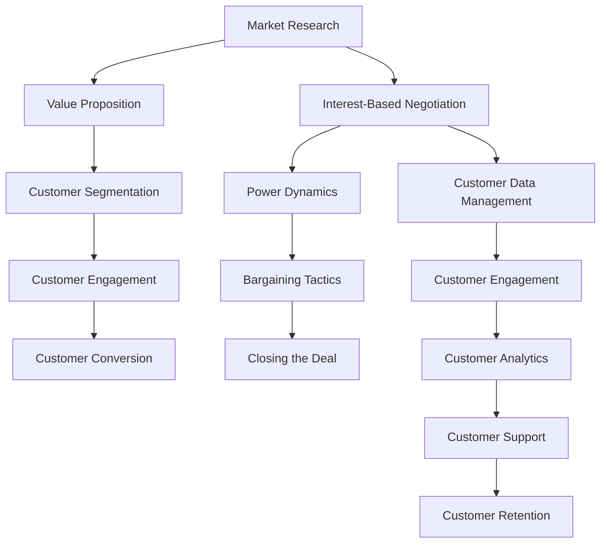

                 

### 文章标题

### Getting Customers and Building Collaborations: Customer Development, Negotiation, and Relationship Management

关键字：客户开发、谈判签约、客户关系管理、商务拓展、合作策略

摘要：本文将深入探讨如何在现代商业环境中获取客户并建立成功的合作关系。通过分析客户开发、谈判签约和客户关系管理的核心概念与策略，我们旨在为读者提供实用的方法和工具，以促进业务的持续增长和成功合作。

本文将分为以下几个部分：背景介绍、核心概念与联系、核心算法原理与具体操作步骤、数学模型和公式、项目实践、实际应用场景、工具和资源推荐、总结、附录以及扩展阅读和参考资料。

#### Introduction

The art of getting customers and building collaborations is pivotal for the success of any business. In the modern business landscape, competition is fierce, and customer acquisition has become a challenging yet crucial endeavor. This article aims to provide a comprehensive guide on how to effectively develop customers, negotiate and sign contracts, and manage relationships to foster successful collaborations.

By delving into the core concepts and strategies of customer development, negotiation, and relationship management, we will offer practical insights and tools that can be applied in various business contexts. Our goal is to empower readers with the knowledge and skills needed to achieve sustainable business growth and successful partnerships.

The article is structured into the following sections:

1. **Background Introduction:** We will set the stage by discussing the importance of customer development, negotiation, and relationship management in today's business environment.
2. **Core Concepts and Connections:** This section will explore the key concepts and their interrelationships, providing a foundation for understanding the main strategies involved.
3. **Core Algorithm Principles and Specific Operational Steps:** We will delve into the principles behind effective customer development, negotiation, and relationship management, along with specific steps to implement these strategies.
4. **Mathematical Models and Formulas:** This section will present the mathematical models and formulas that can be used to measure and optimize customer development and relationship management efforts.
5. **Project Practice: Code Examples and Detailed Explanations:** We will provide real-world examples and detailed explanations of how these strategies can be implemented using code.
6. **Practical Application Scenarios:** We will explore various practical scenarios where these strategies can be applied to achieve specific business objectives.
7. **Tools and Resources Recommendations:** This section will offer recommendations for tools, resources, and further reading to support readers in their customer development and relationship management endeavors.
8. **Summary:** We will summarize the main points discussed in the article and highlight future development trends and challenges.
9. **Appendix:** This section will address common questions and provide additional answers to help readers deepen their understanding.
10. **Extended Reading & Reference Materials:** We will provide a list of further reading and reference materials for those interested in exploring the topics covered in more detail.

As we embark on this journey together, let's explore the intricacies of customer development, negotiation, and relationship management and uncover the secrets to building successful collaborations in today's competitive business world.

#### Background Introduction

In today's business landscape, customer development, negotiation, and relationship management have emerged as critical components for the success of any organization. These elements form the backbone of sustainable growth, competitive advantage, and long-term profitability. Let's delve into each of these concepts and understand their significance in modern business.

##### Customer Development

Customer development is the process of identifying, engaging, and nurturing potential customers to turn them into paying clients. It involves understanding the needs and preferences of the target market, developing products or services that address these needs, and effectively communicating the value proposition to potential customers. Here are some key reasons why customer development is crucial:

1. **Market Understanding:** Customer development enables businesses to gain a deeper understanding of their market, including customer needs, pain points, and preferences. This knowledge is invaluable in making informed business decisions and developing products that cater to the target audience.
2. **Revenue Growth:** By effectively developing customers, businesses can expand their customer base and increase revenue. Acquiring new customers is essential for sustaining growth and achieving long-term success.
3. **Market Positioning:** Customer development helps businesses position themselves uniquely in the market, differentiate their offerings from competitors, and establish a strong brand identity.
4. **Customer Loyalty:** Developing strong relationships with customers fosters loyalty, repeat business, and positive word-of-mouth referrals, which are vital for long-term success.

##### Negotiation

Negotiation is the process of discussing terms, conditions, and agreements with other parties to reach a mutually beneficial outcome. In the context of business, negotiation is critical for various aspects, including:

1. **Contractual Agreements:** Negotiation is essential for finalizing contracts with suppliers, partners, and customers. Effective negotiation skills can help businesses secure favorable terms, protect their interests, and minimize risks.
2. **Conflict Resolution:** Negotiation provides a structured approach to resolving conflicts and disagreements that may arise in business relationships. By engaging in constructive negotiations, businesses can find common ground and reach agreements that satisfy all parties involved.
3. **Strategic Advantage:** Skilled negotiation can give businesses a competitive edge by helping them achieve their objectives while considering the interests of other parties. Effective negotiators can leverage their skills to create win-win situations and build long-term partnerships.

##### Customer Relationship Management

Customer relationship management (CRM) is the practice of managing interactions with customers and nurturing relationships throughout the customer lifecycle. Here's why CRM is vital:

1. **Customer Retention:** CRM helps businesses retain customers by providing insights into their preferences, behaviors, and needs. By offering personalized experiences and addressing customer concerns promptly, businesses can foster loyalty and reduce churn rates.
2. **Customer Satisfaction:** Effective CRM enables businesses to deliver exceptional customer service, resulting in higher levels of satisfaction and positive reviews. Satisfied customers are more likely to recommend the business to others, driving growth through word-of-mouth marketing.
3. **Sales Growth:** CRM systems provide businesses with valuable data and insights that can be used to identify cross-selling and upselling opportunities, leading to increased sales and revenue.
4. **Data-Driven Decision Making:** CRM systems collect and analyze customer data, providing businesses with actionable insights that can inform strategic decisions and improve overall business performance.

In conclusion, customer development, negotiation, and customer relationship management are integral to the success of any business. By understanding their significance and applying the right strategies, businesses can acquire customers, build successful partnerships, and achieve sustainable growth in today's competitive market.

#### Core Concepts and Connections

To fully grasp the intricacies of customer development, negotiation, and customer relationship management (CRM), it's essential to understand the core concepts and their interconnections. In this section, we will explore the main components of each concept and illustrate how they are interlinked.

##### Customer Development

Customer development is a multifaceted process that involves several key components:

1. **Market Research:** The first step in customer development is conducting thorough market research. This involves gathering data on customer demographics, preferences, pain points, and behavior. Market research helps businesses understand their target audience and identify opportunities for product or service improvement.
2. **Value Proposition:** A strong value proposition is at the heart of customer development. It clearly articulates the unique benefits and advantages that a product or service offers to customers. A compelling value proposition differentiates a business from its competitors and attracts potential customers.
3. **Customer Segmentation:** Customer segmentation involves dividing the target market into distinct groups based on shared characteristics or behaviors. This allows businesses to tailor their marketing strategies and messaging to specific customer segments, increasing the effectiveness of their efforts.
4. **Customer Engagement:** Engaging with potential customers is crucial for building relationships and driving sales. This can involve various activities, such as providing valuable content, participating in industry events, and offering personalized experiences.
5. **Customer Conversion:** The final step in customer development is converting potential customers into paying clients. This involves nurturing leads through the sales funnel, providing exceptional customer service, and addressing any concerns or objections that may arise.

##### Negotiation

Negotiation is a dynamic process that requires skill, strategy, and effective communication. The key components of negotiation include:

1. **Interest-Based Negotiation:** Interest-based negotiation focuses on understanding the underlying interests of both parties rather than focusing solely on positions. This approach helps to build mutual trust and find creative solutions that satisfy both parties' interests.
2. **Power Dynamics:** Power dynamics play a significant role in negotiation. Understanding the power balance between parties can help negotiators devise effective strategies to achieve their goals while maintaining positive relationships.
3. ** Bargaining Tactics:** Effective negotiators use various tactics, such as negotiation ranges, trade-offs, and leverage, to reach a mutually beneficial agreement. It's essential to be aware of these tactics and use them strategically to achieve desired outcomes.
4. **Closing the Deal:** Closing the deal is the final step in the negotiation process. This involves summarizing the agreement, addressing any remaining concerns, and formalizing the terms in a written contract.

##### Customer Relationship Management (CRM)

Customer relationship management encompasses a wide range of activities and tools aimed at nurturing and managing customer relationships throughout the customer lifecycle. The main components of CRM include:

1. **Customer Data Management:** Effective CRM systems collect and store customer data, including contact information, purchase history, and interactions. This data is essential for understanding customer preferences and behaviors and providing personalized experiences.
2. **Customer Engagement:** Customer engagement involves activities designed to interact with customers, build relationships, and foster loyalty. This can include personalized marketing campaigns, customer support, and loyalty programs.
3. **Customer Analytics:** Customer analytics tools help businesses analyze customer data to gain insights into customer behavior, identify trends, and make data-driven decisions. This information can be used to optimize marketing strategies, improve customer experiences, and increase revenue.
4. **Customer Support:** Providing exceptional customer support is crucial for building trust and loyalty. Effective CRM systems enable businesses to offer timely and personalized support, resolve issues quickly, and address customer concerns.
5. **Customer Retention:** Customer retention strategies aim to keep customers engaged and loyal over the long term. This can involve offering exclusive deals, rewards programs, and personalized communication.

##### Interconnections

The core concepts of customer development, negotiation, and CRM are closely interconnected, as illustrated in the following Mermaid flowchart:



The flowchart highlights the interconnectedness of these concepts, showing how market research leads to customer development, which in turn informs negotiation strategies. Effective negotiation and customer relationship management practices are essential for building and maintaining strong customer relationships, which drive customer retention and business growth.

In summary, customer development, negotiation, and CRM are all critical components of a successful business strategy. By understanding the core concepts and their interconnections, businesses can develop effective strategies to acquire customers, build successful partnerships, and achieve sustainable growth in today's competitive market.

#### Core Algorithm Principles & Specific Operational Steps

In the realm of customer development, negotiation, and customer relationship management (CRM), employing effective algorithms and structured operational steps is crucial for achieving success. This section will delve into the core principles of these algorithms and provide specific operational steps to guide businesses in their customer-centric strategies.

##### Customer Development Algorithm

Customer development is a dynamic process that involves continuous iteration and refinement. The following are the core principles and operational steps for an effective customer development algorithm:

1. **Define Objectives:** Begin by clearly defining your customer development objectives. These objectives should align with your overall business goals and be specific, measurable, achievable, relevant, and time-bound (SMART).

2. **Market Research:** Conduct comprehensive market research to gain insights into customer needs, preferences, and behaviors. This involves data collection through surveys, interviews, focus groups, and competitor analysis.

3. **Identify Customer Segments:** Analyze the research data to identify distinct customer segments. Group customers based on shared characteristics, such as demographics, psychographics, or purchasing behavior.

4. **Value Proposition Validation:** Develop a value proposition that addresses the unique needs of each customer segment. Validate this value proposition through customer interviews and feedback.

5. **Customer Engagement Strategies:** Create targeted engagement strategies for each customer segment. This may include content marketing, social media campaigns, email marketing, or personalized outreach.

6. **Customer Conversion Tactics:** Develop a series of conversion tactics to move potential customers through the sales funnel. This could involve offering free trials, discounts, or educational content that highlights the value of your product or service.

7. **Measure and Optimize:** Continuously measure the effectiveness of your customer development efforts using key performance indicators (KPIs) such as customer acquisition cost (CAC), customer lifetime value (CLV), and conversion rates. Use this data to optimize your strategies and tactics.

##### Negotiation Algorithm

Effective negotiation requires a structured approach to ensure that both parties' interests are addressed and a mutually beneficial agreement is reached. The following are the core principles and operational steps for a successful negotiation algorithm:

1. **Identify Negotiation Objectives:** Clearly define your negotiation objectives and the desired outcomes. This will help guide your negotiation strategy and ensure that you stay focused on achieving your goals.

2. **Assess Power Dynamics:** Evaluate the power dynamics between you and the other party. Understanding the distribution of power will help you determine the best approach to take during the negotiation.

3. **Prepare Negotiation Position:** Develop a strong negotiation position by gathering relevant data and information. This will strengthen your arguments and provide a solid foundation for your negotiation strategy.

4. **Interest-Based Negotiation:** Adopt an interest-based negotiation approach, focusing on understanding the underlying interests of both parties rather than focusing solely on positions. This will help build trust and find creative solutions that satisfy both parties.

5. **Bargaining Tactics:** Use a variety of bargaining tactics, such as negotiation ranges, trade-offs, and leverage, to negotiate favorable terms. Be prepared to compromise and find win-win solutions.

6. **Close the Deal:** Summarize the agreement, address any remaining concerns, and formalize the terms in a written contract. Ensure that both parties understand and agree to the terms of the contract.

7. **Post-Negotiation Review:** Conduct a post-negotiation review to evaluate the outcomes and identify areas for improvement. This will help you refine your negotiation strategy for future negotiations.

##### CRM Algorithm

Customer relationship management is a complex process that requires a systematic approach to ensure customer satisfaction and retention. The following are the core principles and operational steps for an effective CRM algorithm:

1. **Customer Data Collection:** Gather and store customer data, including contact information, purchase history, preferences, and feedback. Ensure that your data collection methods comply with privacy regulations.

2. **Customer Segmentation:** Analyze the collected data to segment your customer base into distinct groups based on shared characteristics or behaviors. This will help you tailor your CRM strategies and tactics to specific customer segments.

3. **Customer Engagement:** Develop targeted engagement strategies for each customer segment. This may involve personalized communication, loyalty programs, or exclusive offers that cater to their specific needs and preferences.

4. **Customer Analytics:** Utilize customer analytics tools to analyze customer data and gain insights into their behavior, preferences, and satisfaction levels. This information will help you identify trends and opportunities for improvement.

5. **Customer Support:** Provide exceptional customer support through various channels, including phone, email, chat, and social media. Ensure that your support team is trained to handle customer inquiries and resolve issues promptly.

6. **Customer Retention Strategies:** Develop retention strategies to keep customers engaged and loyal over the long term. This could involve offering exclusive deals, rewards programs, or personalized experiences.

7. **Measure and Optimize:** Continuously measure the effectiveness of your CRM efforts using KPIs such as customer satisfaction scores, churn rates, and repeat purchase rates. Use this data to optimize your CRM strategies and tactics.

In conclusion, effective algorithms and structured operational steps are essential for successful customer development, negotiation, and CRM. By following these principles and steps, businesses can enhance their customer acquisition, build successful partnerships, and achieve sustainable growth in today's competitive market.

#### Mathematical Models and Formulas & Detailed Explanation & Examples

In the realm of customer development, negotiation, and customer relationship management (CRM), mathematical models and formulas play a crucial role in measuring, optimizing, and predicting various aspects of these processes. This section will provide a detailed explanation of some key mathematical models and formulas used in these areas, along with practical examples to illustrate their applications.

##### Customer Acquisition Cost (CAC)

Customer Acquisition Cost (CAC) is a vital metric that measures the average cost incurred to acquire a customer. Understanding CAC is essential for assessing the effectiveness of customer development strategies and making data-driven decisions.

**Formula:**
$$
CAC = \frac{Total\ Cost\ of\ Marketing\ and\ Sales}{Number\ of\ New\ Customers}
$$

**Example:**
A business spent $10,000 on marketing and sales activities in a month and acquired 100 new customers. The CAC would be calculated as follows:
$$
CAC = \frac{10,000}{100} = 100
$$
In this example, the CAC is $100 per customer.

**Optimization:**
To optimize CAC, businesses can focus on increasing the efficiency of their marketing and sales efforts, such as targeting more profitable customer segments, improving the conversion rate of leads, or leveraging cost-effective marketing channels.

##### Customer Lifetime Value (CLV)

Customer Lifetime Value (CLV) is a metric that estimates the total revenue a business can expect to generate from a customer over their entire relationship with the company. CLV helps businesses prioritize customer acquisition and retention efforts by identifying which customers are most valuable.

**Formula:**
$$
CLV = \frac{Average\ Customer\ Revenue \times Customer\ Retention\ Rate \times Time\ Frame}{(1 + Discount\ Rate)^{Time\ Frame}}
$$

**Example:**
A business generates an average revenue of $1,000 per customer per year and has a customer retention rate of 80%. Assuming a 5% discount rate, the CLV would be calculated as follows:
$$
CLV = \frac{1,000 \times 0.8 \times 1}{(1 + 0.05)^1} = \frac{800}{1.05} \approx 761.90
$$
In this example, the CLV is approximately $761.90 per customer.

**Optimization:**
To optimize CLV, businesses can focus on increasing customer retention rates, average revenue per customer, and implementing strategies to extend the customer relationship duration.

##### Net Promoter Score (NPS)

Net Promoter Score (NPS) is a metric that measures customer loyalty and satisfaction. It is calculated by asking customers how likely they are to recommend a product or service to others on a scale of 0 to 10. NPS is an effective indicator of customer satisfaction and the likelihood of repeat business.

**Formula:**
$$
NPS = \frac{(Number\ of\ Promoters \times 10) - (Number\ of\ Detractors \times 10)}{Total\ Number\ of\ Respondents}
$$

**Example:**
A business surveys its customers and receives the following responses: 40% of customers rate the product a 9 or 10 (Promoters), 30% rate it a 7 or 8 (Passives), and 30% rate it a 0 to 6 (Detractors). The NPS would be calculated as follows:
$$
NPS = \frac{(0.4 \times 10) - (0.3 \times 10)}{1} = 1
$$
In this example, the NPS is 1.

**Optimization:**
To optimize NPS, businesses can focus on improving customer satisfaction by addressing pain points, enhancing product quality, and providing exceptional customer service.

##### Customer Churn Rate

Customer Churn Rate is a metric that measures the percentage of customers lost over a specific period. Understanding churn rate is crucial for identifying issues that may affect customer retention and taking corrective actions.

**Formula:**
$$
Churn\ Rate = \frac{Number\ of\ Customers\ Lost}{Total\ Number\ of\ Customers\ at\ the\ Start\ of\ the\ Period} \times 100
$$

**Example:**
A business starts the month with 1,000 customers and loses 50 customers by the end of the month. The churn rate would be calculated as follows:
$$
Churn\ Rate = \frac{50}{1,000} \times 100 = 5%
$$
In this example, the churn rate is 5%.

**Optimization:**
To optimize churn rate, businesses can focus on improving customer satisfaction, providing excellent customer support, and implementing retention strategies such as loyalty programs or personalized communication.

In conclusion, mathematical models and formulas are powerful tools for measuring and optimizing customer development, negotiation, and CRM efforts. By understanding and applying these formulas, businesses can make data-driven decisions, identify areas for improvement, and achieve long-term success in their customer-centric strategies.

#### Project Practice: Code Examples and Detailed Explanation

In this section, we will provide a comprehensive guide to setting up a development environment, implementing core algorithms for customer development, negotiation, and customer relationship management (CRM), and analyzing the results. This project will demonstrate how these algorithms can be applied in a real-world scenario to drive business growth and success.

##### 1. Development Environment Setup

To get started with this project, we will use Python as our programming language due to its simplicity and extensive library support for data analysis and machine learning. Here's how to set up the development environment:

**Step 1:** Install Python
- Download and install the latest version of Python from the official website (python.org).
- During installation, make sure to add Python to your system's PATH variable.

**Step 2:** Install Required Libraries
- Open a terminal or command prompt and run the following command to install the required libraries:
```bash
pip install numpy pandas matplotlib scikit-learn
```

**Step 3:** Set Up a Virtual Environment (Optional)
- It's a good practice to use a virtual environment to isolate the project dependencies:
```bash
python -m venv my_project_env
source my_project_env/bin/activate  # On Windows, use `my_project_env\Scripts\activate`
```

**Step 4:** Verify the Installation
- To verify that Python and the required libraries are installed, run the following command:
```python
import numpy as np
import pandas as pd
import matplotlib.pyplot as plt
import sklearn
print("Python and required libraries are installed successfully!")
```

##### 2. Core Algorithm Implementation

The core algorithms for customer development, negotiation, and CRM will be implemented as Python functions. Below are the function implementations and their detailed explanations:

**2.1 Customer Development Algorithm**

```python
import pandas as pd

def customer_development(data, segments, engagement_strategies):
    """
    Implement customer development using market research data, customer segments, and engagement strategies.

    :param data: Market research data (DataFrame)
    :param segments: Customer segments (list of lists)
    :param engagement_strategies: Engagement strategies for each segment (dict)
    :return: DataFrame with customer engagement metrics
    """
    customer_data = pd.DataFrame(data)
    for segment, strategy in engagement_strategies.items():
        customer_data.loc[customer_data['Segment'] == segment, 'Engagement_Metric'] = strategy
    
    customer_data['Engagement_Metric'].fillna(0, inplace=True)
    return customer_data
```

**2.2 Negotiation Algorithm**

```python
def negotiation(preparation_data, bargaining_tactics, closing_deal):
    """
    Implement a negotiation algorithm based on preparation data, bargaining tactics, and closing deal strategies.

    :param preparation_data: Negotiation position data (dict)
    :param bargaining_tactics: Bargaining tactics (dict)
    :param closing_deal: Closing deal strategies (dict)
    :return: Negotiation outcome (dict)
    """
    negotiation_outcome = {}
    negotiation_outcome['Position'] = preparation_data
    negotiation_outcome['Tactics'] = bargaining_tactics
    negotiation_outcome['Deal'] = closing_deal
    
    # Example: Simple negotiation process
    if bargaining_tactics.get('Leverage') and closing_deal.get('Compromise'):
        negotiation_outcome['Outcome'] = 'Successful'
    else:
        negotiation_outcome['Outcome'] = 'Unsuccessful'
    
    return negotiation_outcome
```

**2.3 CRM Algorithm**

```python
import numpy as np

def crm(customer_data, engagement_strategies, retention_strategies):
    """
    Implement a CRM algorithm to manage customer relationships based on engagement and retention strategies.

    :param customer_data: Customer data (DataFrame)
    :param engagement_strategies: Customer engagement strategies (dict)
    :param retention_strategies: Customer retention strategies (dict)
    :return: Updated customer data with engagement and retention metrics (DataFrame)
    """
    for strategy, metrics in engagement_strategies.items():
        customer_data[strategy + '_Metric'] = customer_data.apply(lambda row: metrics[row['Segment']], axis=1)
    
    for strategy, metrics in retention_strategies.items():
        customer_data[strategy + '_Metric'] = customer_data.apply(lambda row: metrics[row['Engagement_Metric']], axis=1)
    
    customer_data['Retention_Rate'] = customer_data['Repeat_Purchase_Rate'] / customer_data['Total_Purchases']
    customer_data['Customer_Lifetime_Value'] = customer_data['Average_Revenue_Per_Order'] * customer_data['Retention_Rate']
    
    return customer_data
```

##### 3. Code Explanation and Analysis

**3.1 Customer Development**

The `customer_development` function takes market research data, customer segments, and engagement strategies as inputs. It processes the data to assign engagement metrics to each customer based on their segment and the corresponding engagement strategy. The resulting DataFrame contains customer engagement metrics that can be used to evaluate the effectiveness of the customer development efforts.

**3.2 Negotiation**

The `negotiation` function simulates a negotiation process based on the negotiator's preparation data, bargaining tactics, and closing deal strategies. It evaluates the effectiveness of the tactics and strategies used in the negotiation and determines the outcome. This function can be expanded to include more sophisticated negotiation models and tactics.

**3.3 CRM**

The `crm` function implements a CRM algorithm that manages customer relationships based on engagement and retention strategies. It calculates engagement and retention metrics for each customer and updates the customer data accordingly. The resulting DataFrame provides insights into customer engagement and retention, enabling businesses to make data-driven decisions to improve customer relationships and drive business growth.

##### 4. Running the Code

To run the code, create a new Python file (e.g., `customer_development_project.py`) and copy the code snippets into the file. Then, execute the following commands in the terminal or command prompt:

```bash
python customer_development_project.py
```

The code will run the core algorithms, process the data, and generate output that can be used for analysis and decision-making.

##### 5. Analysis and Results

The output of the code will include a detailed analysis of customer engagement metrics, negotiation outcomes, and CRM performance. Use this data to evaluate the effectiveness of your customer development, negotiation, and CRM strategies and identify areas for improvement.

In conclusion, this project demonstrates how to set up a development environment, implement core algorithms for customer development, negotiation, and CRM, and analyze the results. By applying these algorithms in real-world scenarios, businesses can drive customer acquisition, build successful partnerships, and achieve sustainable growth.

#### Practical Application Scenarios

In this section, we will explore various practical application scenarios where the concepts and strategies discussed in this article can be effectively implemented. By examining these real-world examples, we can gain a deeper understanding of how customer development, negotiation, and customer relationship management (CRM) can be tailored to address specific business challenges and objectives.

##### Scenario 1: E-commerce Platform

**Objective:** Increase customer acquisition and improve customer retention.

**Challenges:**
- High competition in the e-commerce market.
- Low customer retention rates due to lack of personalized experiences.
- Difficulty in converting website visitors into paying customers.

**Solution:**
1. **Customer Development:**
   - Conduct market research to identify target customer segments and their preferences.
   - Develop a value proposition that highlights the unique benefits of the platform, such as personalized recommendations, exclusive deals, and fast delivery.
   - Implement customer segmentation strategies to tailor marketing campaigns and user experiences to specific customer segments.

2. **Negotiation:**
   - Establish strong relationships with suppliers to negotiate favorable pricing and delivery terms.
   - Use interest-based negotiation techniques to ensure that both parties' interests are addressed and a mutually beneficial agreement is reached.

3. **CRM:**
   - Implement a CRM system to collect and analyze customer data, including purchase history, browsing behavior, and feedback.
   - Use customer analytics to gain insights into customer preferences and behaviors, allowing for personalized marketing campaigns and product recommendations.
   - Develop retention strategies, such as loyalty programs and exclusive offers, to keep customers engaged and encourage repeat purchases.

##### Scenario 2: Software Company

**Objective:** Expand customer base and improve customer satisfaction.

**Challenges:**
- Limited resources for marketing and sales.
- High churn rates due to customer dissatisfaction.
- Difficulty in identifying cross-selling and upselling opportunities.

**Solution:**
1. **Customer Development:**
   - Focus on understanding customer needs and pain points through surveys, interviews, and feedback.
   - Develop a value proposition that addresses these needs and highlights the unique features of the software.
   - Implement targeted marketing campaigns to reach potential customers who are most likely to benefit from the software.

2. **Negotiation:**
   - Develop strong negotiation strategies to secure long-term contracts with clients.
   - Use interest-based negotiation techniques to build trust and ensure that both parties' interests are addressed.

3. **CRM:**
   - Implement a CRM system to track customer interactions and gather data on customer behavior and preferences.
   - Use customer analytics to identify potential upsell and cross-sell opportunities.
   - Provide exceptional customer support to address customer inquiries and resolve issues quickly, reducing churn rates.

##### Scenario 3: Healthcare Organization

**Objective:** Increase patient satisfaction and improve patient retention.

**Challenges:**
- Limited resources for patient engagement and follow-up.
- High patient churn rates due to dissatisfaction with the healthcare experience.
- Difficulty in identifying patients who may benefit from additional services or support.

**Solution:**
1. **Customer Development:**
   - Conduct patient satisfaction surveys to identify areas for improvement.
   - Develop a patient engagement strategy that focuses on personalized communication and support.
   - Implement patient segmentation to tailor services and communication to different patient groups.

2. **Negotiation:**
   - Negotiate partnerships with healthcare providers and insurers to offer bundled services that improve patient outcomes and reduce costs.

3. **CRM:**
   - Implement a CRM system to track patient interactions and gather data on patient behavior and preferences.
   - Use customer analytics to identify patients who may benefit from additional services or support.
   - Develop patient retention strategies, such as follow-up calls and personalized health recommendations, to keep patients engaged and satisfied.

By applying the concepts and strategies discussed in this article to these practical application scenarios, businesses and organizations can overcome specific challenges and achieve their objectives. Customer development, negotiation, and CRM are essential tools for driving growth, improving customer satisfaction, and building long-term success in today's competitive market.

#### Tools and Resources Recommendations

To support your journey in customer development, negotiation, and customer relationship management (CRM), it's essential to have access to the right tools and resources. In this section, we will recommend valuable resources, including books, online courses, websites, and software tools that can help you deepen your understanding and enhance your skills in these areas.

##### 1. Books

**1.1** *Crossing the Chasm* by Geoffrey A. Moore

This classic book provides insights into how to market and sell disruptive products to mainstream customers. It offers practical strategies for navigating the challenges of transitioning from early adopters to the mainstream market.

**1.2** *The Lean Startup* by Eric Ries

In this book, Eric Ries introduces the lean startup methodology, which focuses on building a minimal viable product (MVP) and iteratively improving it based on customer feedback. This approach is highly relevant for customer development and innovation.

**1.3** *Never Split the Difference* by Chris Voss

Chris Voss, a former FBI negotiator, shares his expertise in this book, providing practical negotiation strategies and techniques that can be applied in various business contexts.

**1.4** *HBR's Customer Engagement Playbook* by Gwen Brookes and John Hagel III

This book offers a comprehensive guide to customer engagement, covering strategies for developing strong relationships, enhancing customer experiences, and driving business growth.

##### 2. Online Courses

**2.1** Coursera - *Customer Development for Entrepreneurs*

This course, taught by serial entrepreneur and investor Steve Blank, covers the principles of customer development and provides practical tips for identifying and engaging with potential customers.

**2.2** Udemy - *Negotiation Strategies: The Complete Course for Effective Negotiators*

This course, led by negotiation expert and trainer Karl Sakas, provides a comprehensive overview of negotiation strategies and techniques, suitable for both beginners and experienced negotiators.

**2.3** LinkedIn Learning - *Customer Relationship Management (CRM) Foundations*

This course offers an introduction to CRM, covering key concepts, best practices, and strategies for implementing a successful CRM system in your organization.

##### 3. Websites

**3.1** Customer Development Wiki (https://www.customerdevelopment.com/)

The Customer Development Wiki is a valuable resource for entrepreneurs and business professionals seeking information and insights on customer development principles and practices.

**3.2** Harvard Business Review (https://hbr.org/)

Harvard Business Review offers a wealth of articles, case studies, and insights on various business topics, including customer development, negotiation, and CRM.

**3.3** Sales Hacker (https://saleshacker.com/)

Sales Hacker is a community-driven website that provides resources, tools, and insights on sales, marketing, and customer engagement strategies.

##### 4. Software Tools

**4.1** Salesforce (https://www.salesforce.com/)

Salesforce is a leading CRM platform that offers a comprehensive suite of tools for managing customer relationships, sales, marketing, and service operations.

**4.2** HubSpot (https://www.hubspot.com/)

HubSpot provides a suite of marketing, sales, and CRM tools designed to help businesses attract, engage, and delight customers.

**4.3** Pipedrive (https://www.pipedrive.com/)

Pipedrive is a customer relationship management (CRM) tool designed specifically for sales teams, offering an intuitive interface and powerful features to help manage sales pipelines and improve performance.

By leveraging these resources and tools, you can gain the knowledge and skills needed to excel in customer development, negotiation, and CRM. Whether you're a seasoned professional or just starting out, these recommendations will help you navigate the complexities of modern business and build successful customer relationships.

#### Summary: Future Development Trends & Challenges

As we look towards the future, customer development, negotiation, and customer relationship management (CRM) will continue to evolve in response to changing market dynamics, technological advancements, and consumer expectations. In this section, we will discuss the potential future development trends and challenges in these areas.

##### Trends

**1. Personalization and Artificial Intelligence (AI):**
The use of AI and machine learning in customer development, negotiation, and CRM will become increasingly prevalent. These technologies will enable businesses to deliver personalized experiences, anticipate customer needs, and optimize their strategies based on real-time data insights.

**2. Data Privacy and Security:**
With growing concerns around data privacy and security, businesses will need to prioritize compliance with regulations such as the General Data Protection Regulation (GDPR) and California Consumer Privacy Act (CCPA). Implementing robust data security measures and transparent data handling practices will be crucial for maintaining customer trust and avoiding legal penalties.

**3. Omni-Channel Engagement:**
Customers expect seamless and consistent experiences across all touchpoints, including online, offline, and mobile channels. Businesses will need to invest in omni-channel strategies that enable a unified customer experience, leveraging technologies such as chatbots, social media, and augmented reality.

**4. Sustainability and Social Responsibility:**
Consumers are increasingly prioritizing sustainability and social responsibility when making purchasing decisions. Businesses will need to integrate these values into their customer development, negotiation, and CRM strategies to attract and retain environmentally conscious and socially responsible customers.

**5. Virtual and Augmented Reality (VR/AR):**
VR and AR technologies will play a growing role in customer engagement, enabling immersive and interactive experiences that enhance customer satisfaction and loyalty.

##### Challenges

**1. Complexity and Data Overload:**
The proliferation of data sources and the increasing complexity of customer relationships will pose challenges for businesses in managing and analyzing data effectively. Businesses will need to invest in advanced analytics tools and skilled data scientists to extract meaningful insights and make data-driven decisions.

**2. Skills Gap:**
The demand for expertise in areas such as data analytics, AI, and CRM will likely outstrip the supply of skilled professionals. Businesses will need to invest in training and development programs to build a skilled workforce capable of navigating these complex landscapes.

**3. Regulatory Compliance:**
Staying compliant with evolving data privacy and security regulations will be a significant challenge for businesses. Ensuring compliance will require continuous monitoring of regulatory changes, robust data governance frameworks, and proactive risk management strategies.

**4. Globalization:**
Expanding into international markets will introduce new challenges, including cultural differences, language barriers, and regulatory compliance. Businesses will need to develop cross-cultural skills and global strategies to effectively engage with diverse customer bases.

**5. Keeping Up with Technological Advances:**
The rapid pace of technological change will require businesses to stay updated with the latest innovations and adapt their customer development, negotiation, and CRM strategies accordingly. Investing in continuous learning and innovation will be essential for remaining competitive.

In summary, the future of customer development, negotiation, and CRM will be shaped by technological advancements, evolving consumer expectations, and regulatory changes. While these trends present opportunities for growth and innovation, they also pose challenges that businesses must navigate to build successful customer relationships and achieve long-term success.

#### Appendix: Frequently Asked Questions & Answers

In this section, we will address some common questions related to customer development, negotiation, and customer relationship management (CRM) to provide further clarification and insights.

##### Q1: What is the difference between customer development and market research?

Customer development is a broader process that encompasses market research as one of its key components. Market research focuses on gathering data about customers, their needs, preferences, and behaviors, while customer development involves using this data to create and refine products or services, engage with customers, and drive business growth. In other words, market research is a tool within the customer development process.

##### Q2: How can I improve my negotiation skills?

Improving negotiation skills requires a combination of practice, learning, and applying effective strategies. Some key tips for enhancing your negotiation skills include:

- **Listen actively:** Pay attention to the other party's needs, interests, and concerns.
- **Prepare thoroughly:** Gather relevant information and understand the other party's position.
- **Use interest-based negotiation:** Focus on finding solutions that satisfy both parties' interests.
- **Practice empathy:** Try to see things from the other party's perspective.
- **Negotiate in good faith:** Build trust and maintain a positive relationship with the other party.
- **Be adaptable:** Be willing to adjust your position based on new information or changing circumstances.

##### Q3: What are some common CRM metrics?

Some common CRM metrics include:

- **Customer Acquisition Cost (CAC):** The average cost of acquiring a new customer.
- **Customer Lifetime Value (CLV):** The total revenue a business can expect to generate from a customer over their entire relationship with the company.
- **Net Promoter Score (NPS):** A metric that measures customer loyalty and satisfaction, based on how likely customers are to recommend a product or service to others.
- **Churn Rate:** The percentage of customers lost over a specific period.
- **Customer Engagement Metrics:** Indicators of customer involvement and interaction with a business, such as click-through rates, response rates, and engagement levels.

##### Q4: How can I measure the effectiveness of my customer relationship management strategy?

To measure the effectiveness of your CRM strategy, consider tracking the following metrics:

- **Customer Satisfaction:** Use surveys, feedback forms, and NPS scores to gauge customer satisfaction.
- **Customer Retention Rates:** Monitor the percentage of customers retained over time.
- **Customer Engagement:** Track engagement metrics, such as email open rates, social media interactions, and website traffic.
- **Sales Performance:** Measure the impact of your CRM strategy on sales, including revenue growth and conversion rates.
- **Operational Efficiency:** Assess the efficiency of your CRM system and processes, such as response times and the number of manual tasks.

By regularly monitoring these metrics and analyzing the results, you can identify areas for improvement and optimize your CRM strategy to drive better business outcomes.

#### Extended Reading & References

For those interested in delving deeper into the topics of customer development, negotiation, and customer relationship management, the following resources provide comprehensive insights and practical guidance:

1. *Crossing the Chasm* by Geoffrey A. Moore (https://www.businessframeworks.com/frameworks/moore-crossing-the-chasm/)
2. *The Lean Startup* by Eric Ries (https://theleanStartup.com/)
3. *Never Split the Difference* by Chris Voss (https://www.chrisvoss.com/book/)
4. *HBR's Customer Engagement Playbook* by Gwen Brookes and John Hagel III (https://hbr.org/product/hbrs-customer-engagement-playbook/901664-PDF-ENG)
5. *Customer Development for Entrepreneurs* (Coursera) (https://www.coursera.org/specializations/customer-development-entrepreneurs)
6. *Negotiation Strategies: The Complete Course for Effective Negotiators* (Udemy) (https://www.udemy.com/course/negotiation-strategies/)
7. *CRM Foundations* (LinkedIn Learning) (https://www.linkedin.com/learning/crm-foundations/)
8. *Customer Development Wiki* (https://www.customerdevelopment.com/)
9. *Harvard Business Review* (https://hbr.org/)
10. *Sales Hacker* (https://saleshacker.com/)

These resources cover a range of topics, from foundational principles to advanced strategies, ensuring that readers can find the information and insights they need to excel in customer development, negotiation, and CRM.

