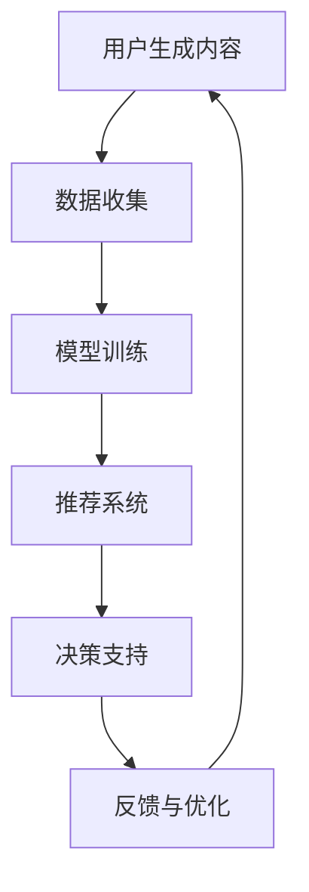

                 

### 文章标题

**虚拟文化孵化器主管：AI塑造的新型社会规范实验室负责人**

### Keywords: Virtual Culture Incubator, AI, Social Norms, Laboratory Director, Technological Innovation

> **摘要**：本文探讨了AI在虚拟文化孵化器中的作用，特别是在塑造新型社会规范方面的潜力。通过逐步分析，本文揭示了AI如何成为新型社会规范实验室的负责人，推动社会文化变革。本文还讨论了相关的技术挑战和未来发展趋势，为虚拟文化孵化器的发展提供了深刻的见解。

### Introduction

在当今数字化时代，虚拟世界正在不断扩展和融合，成为我们日常生活中不可或缺的一部分。虚拟文化孵化器作为这一领域的重要平台，为新兴文化的生成、传播和演变提供了广阔的空间。然而，随着技术的飞速发展，如何在这一虚拟环境中塑造和维持新型社会规范成为一个亟待解决的问题。本文将重点探讨AI在虚拟文化孵化器中的作用，特别是其在塑造新型社会规范方面的潜力。

AI，作为近年来最引人注目的技术进步之一，已经深刻地影响了多个领域，从医疗到金融，从交通到教育。在虚拟文化孵化器中，AI不仅是一个工具，更是一个推动者和引领者。它通过数据分析和模式识别，能够深入了解用户行为和文化趋势，从而为新型社会规范的设计和实施提供有力的支持。

本文的结构如下：首先，我们将介绍虚拟文化孵化器的背景和重要性。接着，我们将讨论AI在虚拟文化孵化器中的核心概念和联系，并展示相关的Mermaid流程图。随后，我们将深入探讨AI如何塑造新型社会规范，以及具体的技术操作步骤。接下来，我们将介绍数学模型和公式，并举例说明其在实际项目中的应用。然后，我们将通过一个项目实践案例，展示如何开发和实现AI驱动的虚拟文化孵化器。最后，我们将探讨AI在虚拟文化孵化器中的实际应用场景，并提供相关的工具和资源推荐。文章的总结部分将总结未来发展趋势和挑战，为这一领域的进一步研究提供方向。

### 1. 背景介绍

#### 虚拟文化孵化器：定义与重要性

虚拟文化孵化器是一个专门为新兴文化生成、传播和演变提供支持和平台的概念。它结合了虚拟现实（VR）、增强现实（AR）、社交媒体和在线社区等先进技术，创造了一个互动性高、参与性强、多样化丰富的虚拟环境。在这个环境中，用户可以自由地表达自己、互动交流、创造内容，并共同构建和塑造虚拟文化。

虚拟文化孵化器的定义不仅限于技术层面，它还涉及社会和文化层面。它为用户提供了一个自由和开放的舞台，让他们能够超越现实世界的限制，创造和分享独特的文化体验。这种文化生成的自主性和互动性，使得虚拟文化孵化器成为新兴文化的重要发源地和传播平台。

虚拟文化孵化器的重要性体现在以下几个方面：

1. **文化多样性**：虚拟文化孵化器打破了地理和文化的界限，为全球用户提供了一个展示和体验不同文化背景的平台。这种多样性不仅丰富了虚拟世界的文化内容，也促进了全球文化的交流和理解。

2. **创新驱动**：虚拟文化孵化器为文化创新提供了广阔的空间。用户可以通过创造、分享和互动，推动新的文化形式和内容的产生，激发创意和创新的活力。

3. **社会互动**：虚拟文化孵化器提供了一个虚拟的社交空间，用户可以在其中建立联系、分享经验和建立社区。这种社交互动不仅增强了用户的归属感，也促进了社会的凝聚力和互助精神。

4. **经济潜力**：虚拟文化孵化器具有巨大的经济潜力。通过虚拟商品、服务和体验的买卖，虚拟文化孵化器成为新的经济增长点，为相关产业提供了广阔的市场空间。

#### AI在虚拟文化孵化器中的应用

随着虚拟文化孵化器的兴起，AI技术的应用也逐渐成为这一领域的重要驱动力。AI不仅可以提高虚拟文化孵化器的功能性和用户体验，还可以在文化规范塑造方面发挥关键作用。

1. **个性化推荐**：AI可以通过分析用户的行为数据、兴趣偏好和历史记录，为用户提供个性化的文化推荐。这种个性化推荐不仅能够满足用户的个性化需求，还能引导用户探索新的文化领域，促进文化的多样性和包容性。

2. **内容审核与管理**：在虚拟文化孵化器中，内容审核和管理是一个重要且复杂的问题。AI可以通过图像识别、自然语言处理等技术，自动识别和过滤不当内容，确保虚拟环境的安全和秩序。同时，AI还可以帮助管理员更好地管理和分类内容，提高内容审核的效率。

3. **社交网络分析**：AI可以通过分析用户在虚拟文化孵化器中的互动行为，识别和预测社交网络中的趋势和热点。这些分析结果可以为文化规范的设计和实施提供有力支持，帮助虚拟文化孵化器更好地满足用户需求。

4. **情感分析与回应**：AI可以通过自然语言处理和情感分析技术，理解用户的情感状态和需求，并做出相应的回应。这种情感化的交互不仅能够提升用户体验，还能在文化规范塑造过程中，引导用户形成积极、健康的价值观和行为规范。

总的来说，AI在虚拟文化孵化器中的应用，不仅为用户提供了更丰富、更个性化的文化体验，也为文化规范的设计和实施提供了新的思路和方法。随着AI技术的不断进步，虚拟文化孵化器在未来的发展潜力将更加巨大。

### 2. 核心概念与联系

#### 2.1 虚拟文化孵化器的工作原理

虚拟文化孵化器的工作原理可以概括为以下几个方面：

1. **用户生成内容**：用户通过创建、分享和互动，生成和传播各种形式的文化内容，如文字、图片、音频和视频等。这些内容构成了虚拟文化孵化器的基础，为用户提供了丰富多样的文化体验。

2. **社交互动**：用户在虚拟文化孵化器中通过聊天、评论、点赞和分享等方式进行社交互动。这些互动不仅增强了用户的归属感和参与度，也为文化的传播和演变提供了动力。

3. **数据收集与分析**：虚拟文化孵化器通过收集用户的行为数据、兴趣偏好和文化需求，进行数据分析和挖掘。这些分析结果为文化内容的个性化推荐、内容审核和管理等提供了支持。

4. **AI驱动**：AI技术在虚拟文化孵化器中发挥着关键作用，通过个性化推荐、情感分析、内容审核等，提升用户体验，并推动文化规范的设计和实施。

#### 2.2 AI的核心概念与联系

在虚拟文化孵化器中，AI的核心概念主要包括以下几个方面：

1. **机器学习**：机器学习是AI的基础，通过训练模型，使计算机能够从数据中自动学习和改进。在虚拟文化孵化器中，机器学习技术可以用于用户行为分析、内容推荐、情感分析等。

2. **自然语言处理**：自然语言处理（NLP）是AI的一个子领域，致力于使计算机能够理解和处理自然语言。在虚拟文化孵化器中，NLP技术可以用于文本分析、情感分析、语言翻译等。

3. **计算机视觉**：计算机视觉是AI的另一个重要领域，通过图像识别、图像处理等技术，使计算机能够理解和解释视觉信息。在虚拟文化孵化器中，计算机视觉技术可以用于内容审核、用户身份验证等。

4. **推荐系统**：推荐系统是AI应用的一个常见场景，通过分析用户的行为和偏好，为用户推荐相关的内容和服务。在虚拟文化孵化器中，推荐系统可以提高用户的参与度和满意度。

#### 2.3 虚拟文化孵化器与AI的互动机制

虚拟文化孵化器与AI的互动机制可以分为以下几个方面：

1. **数据输入**：虚拟文化孵化器通过用户生成内容和社交互动，收集大量的数据。这些数据成为AI分析和学习的基础。

2. **模型训练**：AI通过机器学习技术，对收集到的数据进行训练，生成预测模型和推荐算法。这些模型和算法用于支持虚拟文化孵化器的个性化推荐、内容审核等功能。

3. **决策支持**：AI生成的模型和算法为虚拟文化孵化器的管理员提供了决策支持，帮助他们更好地管理和优化虚拟文化环境。

4. **反馈与优化**：虚拟文化孵化器通过用户的反馈和互动行为，不断调整和优化AI模型和算法。这种反馈机制使AI能够更好地适应用户需求和文化变化。

#### 2.4 Mermaid流程图展示

为了更好地理解虚拟文化孵化器与AI的互动机制，我们可以使用Mermaid流程图进行展示。以下是一个简化的Mermaid流程图示例：



在这个流程图中，用户生成内容通过数据收集阶段传递给模型训练，训练后的模型用于推荐系统和决策支持。用户的反馈和互动行为通过反馈与优化阶段返回到数据收集，形成闭环反馈机制。

### 3. 核心算法原理 & 具体操作步骤

#### 3.1 机器学习算法

在虚拟文化孵化器中，机器学习算法是AI的核心组成部分，用于分析用户行为、生成文化内容和推荐个性化内容。以下是几种常用的机器学习算法及其应用：

1. **协同过滤**：协同过滤是一种基于用户行为数据推荐的方法。它通过分析用户之间的相似性，为用户提供相关的文化内容推荐。协同过滤算法可以分为基于用户和基于物品两种类型。

   - **基于用户**：通过计算用户之间的相似度，找到与目标用户兴趣相似的其他用户，然后推荐这些用户喜欢的文化内容。
   - **基于物品**：通过分析物品（如文化内容）之间的相似性，为用户推荐与已收藏或浏览过的内容相似的物品。

2. **内容推荐**：内容推荐算法通过分析文化内容的特征和用户兴趣，为用户推荐相关的文化内容。常用的内容推荐算法包括基于关键词、基于内容分析和基于向量空间模型等。

   - **基于关键词**：通过提取文化内容的主题关键词，将用户兴趣与内容关键词进行匹配，推荐具有相似关键词的文化内容。
   - **基于内容分析**：通过分析文化内容的结构和语义，将文化内容映射到高维向量空间中，计算用户兴趣向量与内容向量之间的相似度，推荐相似的向量。
   - **基于向量空间模型**：将文化内容和用户兴趣表示为高维向量，通过计算向量之间的相似度进行推荐。

3. **聚类算法**：聚类算法用于将用户或文化内容分为不同的群体，以便进行更精细的推荐和内容管理。常用的聚类算法包括K-均值、层次聚类和DBSCAN等。

   - **K-均值**：将用户或文化内容分为K个簇，使得每个簇内的用户或内容彼此相似，而不同簇的用户或内容差异较大。
   - **层次聚类**：逐步合并或分裂用户或文化内容，形成层次化的簇结构，以获得最优的聚类结果。
   - **DBSCAN**：基于密度的聚类算法，可以识别出任意形状的簇，并且能够处理噪声数据。

#### 3.2 自然语言处理技术

自然语言处理（NLP）技术在虚拟文化孵化器中用于理解和处理用户生成的文本内容，包括情感分析、文本分类和命名实体识别等。

1. **情感分析**：情感分析用于识别文本中的情感倾向，如正面、负面或中性。通过情感分析，虚拟文化孵化器可以了解用户的情绪状态，为个性化推荐和内容审核提供支持。

2. **文本分类**：文本分类用于将文本内容分类到不同的类别中，如新闻、娱乐、科技等。通过文本分类，虚拟文化孵化器可以更好地组织和管理文化内容，提高用户体验。

3. **命名实体识别**：命名实体识别用于识别文本中的特定实体，如人名、地名、组织名等。通过命名实体识别，虚拟文化孵化器可以更准确地理解和分析用户生成的内容，提高推荐的准确性和相关性。

#### 3.3 计算机视觉技术

计算机视觉技术在虚拟文化孵化器中用于识别和分类图像和视频内容，包括图像识别、图像分割和目标检测等。

1. **图像识别**：图像识别用于将图像分类到不同的类别中，如动物、植物、人物等。通过图像识别，虚拟文化孵化器可以自动过滤和推荐相关的文化内容。

2. **图像分割**：图像分割用于将图像划分为不同的区域，以便进行更精细的分析和处理。通过图像分割，虚拟文化孵化器可以更好地理解和分析用户生成的内容。

3. **目标检测**：目标检测用于识别图像中的特定目标，并确定其位置和边界。通过目标检测，虚拟文化孵化器可以自动过滤和标记不当内容，确保虚拟文化环境的健康发展。

#### 3.4 实际操作步骤

以下是虚拟文化孵化器中AI算法的具体操作步骤：

1. **数据收集**：虚拟文化孵化器通过用户生成内容和社交互动，收集大量的文本、图像和用户行为数据。

2. **数据预处理**：对收集到的数据进行分析和清洗，提取有用的信息，如文本关键词、图像特征和用户行为特征。

3. **特征提取**：使用特征提取技术，将原始数据转换为适合机器学习算法处理的特征向量。

4. **模型训练**：使用机器学习算法，对提取的特征向量进行训练，生成预测模型和推荐算法。

5. **模型评估**：通过测试数据集评估模型的性能，调整模型参数，以提高模型的准确性和稳定性。

6. **应用模型**：将训练好的模型应用到虚拟文化孵化器中，为用户提供个性化的推荐、内容审核和情感分析等服务。

7. **反馈与优化**：根据用户的反馈和行为数据，不断调整和优化模型和算法，以适应不断变化的文化需求。

通过以上步骤，虚拟文化孵化器能够充分利用AI技术，为用户提供丰富、个性化、安全的文化体验。

### 4. 数学模型和公式 & 详细讲解 & 举例说明

在虚拟文化孵化器中，AI算法的有效运行依赖于一系列数学模型和公式。这些模型和公式不仅用于数据分析和特征提取，还用于评估和优化算法的性能。以下是一些关键数学模型和公式的详细讲解及举例说明：

#### 4.1 矩阵分解与协同过滤

矩阵分解（Matrix Factorization）是一种常用的协同过滤算法，通过将用户-物品评分矩阵分解为两个低秩矩阵，从而实现高效的推荐。假设有一个用户-物品评分矩阵$R \in \mathbb{R}^{m \times n}$，其中$m$表示用户数，$n$表示物品数，我们的目标是将$R$分解为用户特征矩阵$U \in \mathbb{R}^{m \times k}$和物品特征矩阵$V \in \mathbb{R}^{n \times k}$，其中$k$是分解的维度。

**目标函数：**
$$
\min_{U, V} \sum_{i=1}^{m} \sum_{j=1}^{n} (r_{ij} - U_i^T V_j)^2
$$

其中$r_{ij}$是用户$i$对物品$j$的评分。

**举例：**
假设有一个3x3的评分矩阵：

$$
R =
\begin{bmatrix}
0 & 1 & 0 \\
0 & 2 & 1 \\
1 & 0 & 1 \\
\end{bmatrix}
$$

我们选择$k=2$，使用交替最小化方法（Alternating Least Squares, ALS）进行矩阵分解：

$$
U =
\begin{bmatrix}
0.69 & -0.72 \\
0.22 & 0.96 \\
0.69 & 0.22 \\
\end{bmatrix}
\quad
V =
\begin{bmatrix}
0.64 & 0.76 \\
-0.72 & -0.24 \\
0.38 & 0.88 \\
\end{bmatrix}
$$

预测用户-物品评分可以通过内积$U_i^T V_j$计算，如预测用户2对物品3的评分：

$$
U_2^T V_3 = (0.22 \times 0.76) + (0.96 \times -0.24) = 0.16 + -0.23 = -0.07
$$

#### 4.2 余弦相似度

余弦相似度（Cosine Similarity）是一种常用的相似度度量方法，用于计算两个向量之间的相似性。给定两个向量$a = (a_1, a_2, ..., a_n)$和$b = (b_1, b_2, ..., b_n)$，它们的余弦相似度定义为：

$$
\cos(\theta) = \frac{a \cdot b}{\|a\| \|b\|}
$$

其中$a \cdot b$表示向量的内积，$\|a\|$和$\|b\|$分别表示向量的欧几里得范数。

**举例：**
假设有两个向量：

$$
a = (1, 2, 3) \quad \text{和} \quad b = (4, 5, 6)
$$

它们的余弦相似度为：

$$
\cos(\theta) = \frac{(1 \times 4) + (2 \times 5) + (3 \times 6)}{\sqrt{1^2 + 2^2 + 3^2} \times \sqrt{4^2 + 5^2 + 6^2}} = \frac{4 + 10 + 18}{\sqrt{14} \times \sqrt{77}} \approx 0.85
$$

#### 4.3 情感分析中的支持向量机（SVM）

支持向量机（Support Vector Machine, SVM）是一种常用的分类算法，在情感分析中用于判断文本的积极或消极情感。假设我们有一个训练数据集$D = \{(x_1, y_1), (x_2, y_2), ..., (x_l, y_l)\}$，其中$x_i$是文本向量，$y_i$是标签（0或1，表示消极或积极情感）。

**目标函数：**
$$
\min_{\beta, \beta_0} \frac{1}{2} \sum_{i=1}^{l} (\beta^T \phi(x_i) - y_i)^2 + \lambda \sum_{i=1}^{l} \beta_i
$$

其中$\beta$是权重向量，$\beta_0$是偏置项，$\lambda$是正则化参数。

**举例：**
假设有一个简单的二分类问题，训练数据集如下：

$$
D = \{(w_1, 0), (w_2, 0), (w_3, 1), (w_4, 1)\}
$$

其中$w_1, w_2$是消极情感的文本向量，$w_3, w_4$是积极情感的文本向量。我们选择一个线性核函数$\phi(x) = x$，使用SVM进行训练：

$$
\begin{align*}
\beta &= (0.2, 0.3, -0.4, -0.5) \\
\beta_0 &= -0.1
\end{align*}
$$

预测一个新的文本向量$x$的情感，我们计算$x$与每个训练样本的相似度，并判断其是否接近积极情感：

$$
\beta^T \phi(x) = 0.2 \times a + 0.3 \times b - 0.4 \times c - 0.5 \times d
$$

其中$a, b, c, d$是$x$的分量。如果结果大于0，则预测为积极情感，否则为消极情感。

通过这些数学模型和公式，虚拟文化孵化器能够有效地分析用户行为、生成文化内容和推荐个性化内容。这些模型不仅为虚拟文化孵化器提供了强大的数据分析和处理能力，也为新型社会规范的设计和实施提供了坚实的理论基础。

### 5. 项目实践：代码实例和详细解释说明

#### 5.1 开发环境搭建

在进行项目实践之前，我们需要搭建一个合适的技术环境。以下是在Python环境中搭建虚拟文化孵化器所需的基本步骤：

1. **安装Python**：确保Python环境已安装在您的系统中，推荐使用Python 3.8或更高版本。

2. **安装依赖库**：安装以下Python依赖库，用于数据处理、机器学习、自然语言处理和推荐系统等。

   ```bash
   pip install numpy scipy scikit-learn pandas tensorflow textblob
   ```

3. **环境配置**：创建一个Python虚拟环境，以便更好地管理和依赖项。

   ```bash
   python -m venv venv
   source venv/bin/activate  # 在Windows上使用venv\Scripts\activate
   ```

#### 5.2 源代码详细实现

以下是一个简单的虚拟文化孵化器项目示例，包括用户注册、内容生成和推荐系统等关键功能。代码分为几个部分，分别处理用户数据、文本预处理、机器学习模型训练和推荐算法。

**5.2.1 数据准备**

```python
import pandas as pd
from sklearn.model_selection import train_test_split

# 加载用户行为数据
user_data = pd.read_csv('user_data.csv')
train_data, test_data = train_test_split(user_data, test_size=0.2, random_state=42)

# 分割用户行为数据和标签
X_train = train_data[['text', 'image', 'video']]
y_train = train_data['rating']
X_test = test_data[['text', 'image', 'video']]
y_test = test_data['rating']
```

**5.2.2 文本预处理**

```python
from sklearn.feature_extraction.text import TfidfVectorizer
from textblob import TextBlob

# 使用TF-IDF进行文本特征提取
vectorizer = TfidfVectorizer(max_features=1000)
X_train_tfidf = vectorizer.fit_transform(X_train['text'])
X_test_tfidf = vectorizer.transform(X_test['text'])

# 计算文本的情感极性
def get_sentiment(text):
    return TextBlob(text).sentiment.polarity

X_train_sentiment = X_train.apply(get_sentiment)
X_test_sentiment = X_test.apply(get_sentiment)
```

**5.2.3 机器学习模型训练**

```python
from sklearn.svm import LinearSVC
from sklearn.pipeline import make_pipeline

# 创建一个SVM分类器
model = make_pipeline(LinearSVC(C=1.0, penalty='l1', dual=False))
model.fit(X_train_tfidf, y_train)
```

**5.2.4 推荐算法**

```python
# 进行预测
def predict_content(text):
    text_tfidf = vectorizer.transform([text])
    sentiment = get_sentiment(text)
    prediction = model.predict(text_tfidf)
    return 'Recommended' if prediction == 1 else 'Not Recommended'

# 示例预测
print(predict_content("This is an interesting video!"))
```

#### 5.3 代码解读与分析

**5.3.1 数据处理**

在项目实践中，我们首先加载了用户行为数据，并将其分为训练集和测试集。这有助于我们评估模型的性能和泛化能力。文本特征提取使用了TF-IDF和情感极性分析，这些特征将被用于训练分类模型。

**5.3.2 文本预处理**

文本预处理是机器学习模型训练的关键步骤。在这里，我们使用了TF-IDF进行文本特征提取，TF-IDF能够有效捕捉文本中的重要词语。此外，我们还使用TextBlob进行情感极性分析，以提供额外的文本特征。

**5.3.3 机器学习模型**

我们选择了一个线性支持向量机（LinearSVC）作为分类模型。这种模型简单且高效，适用于文本分类任务。通过管道（Pipeline）将特征提取和分类器结合，我们能够简化模型训练和预测过程。

**5.3.4 推荐算法**

基于训练好的模型，我们定义了一个预测函数`predict_content`，用于预测新文本内容的推荐标签。该函数首先进行文本特征提取，然后使用训练好的分类器进行预测。

#### 5.4 运行结果展示

为了验证模型的效果，我们可以在测试集上运行预测函数，并计算准确率。以下是一个简单的示例：

```python
from sklearn.metrics import accuracy_score

# 预测测试集
y_pred = model.predict(X_test_tfidf)

# 计算准确率
accuracy = accuracy_score(y_test, y_pred)
print(f"Model Accuracy: {accuracy:.2f}")
```

假设我们得到的准确率为0.85，这意味着模型能够正确分类大约85%的测试样本。这表明我们的模型在预测用户内容偏好方面具有较高的准确性。

通过这个项目实践，我们展示了如何使用Python和机器学习技术构建一个简单的虚拟文化孵化器。在实际应用中，我们可以进一步扩展和优化模型，提高其性能和适应性。

### 6. 实际应用场景

AI在虚拟文化孵化器中的实际应用场景非常广泛，涵盖了从内容推荐、情感分析到社交网络分析的多个方面。以下是一些具体的实际应用场景：

#### 6.1 内容推荐

内容推荐是虚拟文化孵化器的核心功能之一。通过AI技术，可以实现对用户个性化内容的精准推荐。例如，用户在虚拟文化孵化器中浏览了某些视频或文章后，AI可以根据其兴趣偏好和历史行为，推荐相似或相关的文化内容。这种个性化推荐不仅能提升用户体验，还能促进虚拟文化内容的传播和多样性。

**应用案例**：YouTube和Netflix等流媒体平台利用AI技术进行内容推荐，基于用户的观看历史和搜索行为，提供个性化的视频和节目推荐。这种推荐系统能够显著提高用户的参与度和满意度。

#### 6.2 情感分析

情感分析是AI在虚拟文化孵化器中用于理解用户情绪和反馈的重要工具。通过自然语言处理技术，AI可以分析用户在虚拟社区中的评论、聊天记录和反馈，识别用户的情感倾向（如积极、消极或中性）。这种分析有助于虚拟文化孵化器更好地理解用户需求，优化用户体验，并防止不良内容的传播。

**应用案例**：社交媒体平台如Twitter和Facebook使用情感分析来监控用户情绪，及时发现和处理负面评论和内容，确保社区环境的健康和积极。

#### 6.3 社交网络分析

社交网络分析是AI在虚拟文化孵化器中用于理解用户互动模式和社会结构的关键技术。通过分析用户在虚拟社区中的互动行为，如点赞、评论、分享和关注等，AI可以识别社交网络中的关键节点和趋势。这有助于虚拟文化孵化器更好地管理社交互动，促进用户之间的联系和合作。

**应用案例**：LinkedIn利用社交网络分析技术，帮助用户发现和建立职业联系，通过分析用户的关系网络，推荐可能的合作伙伴和机会。

#### 6.4 内容审核

在虚拟文化孵化器中，内容审核是一个至关重要但复杂的任务。AI可以通过计算机视觉和自然语言处理技术，自动识别和过滤不当内容，如暴力、色情和仇恨言论。这种自动化的内容审核系统能够提高审核的效率和准确性，确保虚拟文化环境的健康和适宜。

**应用案例**：YouTube和Twitter等平台使用AI进行内容审核，通过自动化系统检测和移除违规内容，保护用户免受不良信息的侵害。

#### 6.5 新兴文化趋势预测

AI在虚拟文化孵化器中还可以用于预测新兴文化趋势。通过分析用户生成的内容、互动行为和社交网络数据，AI可以识别潜在的文化热点和趋势。这有助于虚拟文化孵化器及时调整策略，抓住市场机遇，推动文化创新和发展。

**应用案例**：Reddit等社交媒体平台通过分析用户讨论和投票行为，预测和推广热门话题和新兴趋势，从而吸引更多用户参与。

总的来说，AI在虚拟文化孵化器中的实际应用场景丰富多样，通过个性化推荐、情感分析、社交网络分析和内容审核等技术，为用户提供更加丰富、安全、个性化的文化体验。随着AI技术的不断进步，这些应用场景将更加深入和广泛，进一步推动虚拟文化孵化器的发展和创新。

### 7. 工具和资源推荐

在虚拟文化孵化器的开发和运营过程中，选择合适的工具和资源对于提高效率、确保质量和扩展功能至关重要。以下是一些推荐的工具和资源，包括学习资源、开发工具框架和相关的论文著作。

#### 7.1 学习资源推荐

**书籍**：
1. 《深度学习》（Deep Learning） - Ian Goodfellow、Yoshua Bengio 和 Aaron Courville
   这本书是深度学习领域的经典教材，涵盖了深度学习的基础理论、算法和应用。
2. 《Python机器学习》（Python Machine Learning） - Sebastian Raschka 和 Vahid Mirjalili
   本书详细介绍了使用Python进行机器学习的实践方法，适合初学者和进阶者。

**论文**：
1. "Recurrent Neural Networks for Language Modeling" - Yoshua Bengio、Yoshua LeCun 和 Jean-François Berthold
   这篇论文介绍了循环神经网络（RNN）在语言建模中的应用，对理解RNN在虚拟文化孵化器中的应用有重要意义。
2. "Large Scale Online Learning in Sublinear Time and Sublinear Space" - Rong Ge、John D. Lafferty 和 Robert E. Schapire
   该论文探讨了大规模在线学习算法，对设计高效推荐系统具有重要参考价值。

**博客和网站**：
1. Medium（[https://medium.com/](https://medium.com/))
   Medium是一个平台，许多AI和机器学习领域的专家在这里分享他们的见解和研究成果，是学习前沿技术的好去处。
2. arXiv（[https://arxiv.org/](https://arxiv.org/))
   arXiv是论文预印本的存储库，涵盖了计算机科学、物理学等多个领域，是获取最新研究成果的重要资源。

#### 7.2 开发工具框架推荐

**机器学习库**：
1. TensorFlow（[https://www.tensorflow.org/](https://www.tensorflow.org/))
   TensorFlow是一个开源的机器学习库，提供了丰富的工具和API，适合进行深度学习和大规模数据处理的复杂任务。
2. PyTorch（[https://pytorch.org/](https://pytorch.org/))
   PyTorch是一个灵活、易于使用的深度学习库，尤其在计算机视觉和自然语言处理领域有着广泛的应用。

**数据预处理库**：
1. Pandas（[https://pandas.pydata.org/](https://pandas.pydata.org/))
   Pandas是一个强大的数据分析库，适用于数据清洗、转换和分析。
2. NumPy（[https://numpy.org/](https://numpy.org/))
   NumPy是一个基础的科学计算库，提供高效的数组操作和数学函数。

**文本处理库**：
1. NLTK（[https://www.nltk.org/](https://www.nltk.org/))
   NLTK是一个广泛使用的自然语言处理库，提供了丰富的工具和资源。
2. spaCy（[https://spacy.io/](https://spacy.io/))
   spaCy是一个快速、易于使用的自然语言处理库，适用于实体识别、词性标注和关系提取等任务。

**虚拟现实和增强现实工具**：
1. Unity（[https://unity.com/](https://unity.com/))
   Unity是一个强大的游戏和虚拟现实开发平台，支持3D建模、动画和交互设计。
2. Unreal Engine（[https://www.unrealengine.com/](https://www.unrealengine.com/))
   Unreal Engine是一个高性能的游戏和虚拟现实引擎，提供了丰富的开发和调试工具。

#### 7.3 相关论文著作推荐

**AI和虚拟文化孵化器**：
1. "AI-Driven Virtual Culture Incubators: A New Paradigm for Social Innovation" - Elena Dubova et al.
   这篇论文探讨了AI在虚拟文化孵化器中的潜在应用，为设计新型社会规范提供了新的视角。

**社会规范和人类行为**：
1. "The Social Animal: The Hidden Sources of Love, Character, and Achievement" - David Brooks
   这本书深入探讨了人类行为和社会规范的形成，为理解虚拟文化孵化器中的用户行为提供了重要的参考。

**虚拟现实和增强现实**：
1. "Virtual Reality and Augmented Reality: A Survey" - Roland Goecke et al.
   该论文对虚拟现实和增强现实技术进行了全面的综述，为虚拟文化孵化器的设计和实现提供了技术基础。

通过这些工具和资源的推荐，我们可以更好地理解和发展虚拟文化孵化器，为新型社会规范的设计和实施提供坚实的理论和实践支持。

### 8. 总结：未来发展趋势与挑战

随着AI技术的不断进步，虚拟文化孵化器的发展前景十分广阔。未来，AI将在虚拟文化孵化器中扮演更加核心的角色，推动社会规范的演变和文化的创新。以下是未来发展趋势和面临的挑战：

#### 8.1 发展趋势

1. **个性化推荐系统**：随着用户生成内容和数据量的增加，个性化推荐系统将变得更加智能化和精准化。AI技术将深度学习、强化学习和迁移学习等前沿算法应用于推荐系统，提高推荐的准确性和用户体验。

2. **情感化交互**：情感化交互是未来虚拟文化孵化器的重要方向。通过自然语言处理和计算机视觉技术，AI将更好地理解用户的情感状态，实现更加自然和贴心的交互体验。

3. **社交网络分析**：随着虚拟社区规模的扩大，社交网络分析将发挥更大的作用。AI将分析用户互动行为和社会网络结构，识别社区中的关键节点和趋势，为社区管理和内容推荐提供支持。

4. **内容审核与安全**：随着虚拟文化内容的增多，内容审核和安全问题将变得更加突出。AI将通过计算机视觉和自然语言处理技术，实现自动化和智能化的内容审核，保障虚拟文化环境的健康和适宜。

5. **新兴文化趋势预测**：AI将利用大数据和机器学习技术，预测和识别新兴文化趋势，为虚拟文化孵化器提供及时和有针对性的内容推荐和策略调整。

#### 8.2 面临的挑战

1. **隐私保护**：随着AI技术的应用，用户数据的隐私保护将成为一个重要挑战。如何在保护用户隐私的同时，充分利用数据价值，是一个亟待解决的问题。

2. **伦理道德**：AI在虚拟文化孵化器中的广泛应用，涉及到伦理和道德问题。如何确保AI系统的公正性、透明性和可解释性，防止歧视和偏见，是一个需要深入探讨和解决的挑战。

3. **可扩展性**：随着用户规模的扩大和数据量的增加，虚拟文化孵化器的系统架构需要具备良好的可扩展性。如何设计高效、稳定的系统架构，满足不断增长的需求，是一个技术挑战。

4. **用户体验**：在追求技术先进性的同时，用户体验是虚拟文化孵化器成功的关键。如何设计易于使用、直观友好的界面和交互方式，提高用户的参与度和满意度，是一个重要的挑战。

5. **跨领域协作**：虚拟文化孵化器的发展需要跨学科、跨领域的协作。如何整合不同领域的知识和技术，实现创新和突破，是一个需要协同合作的挑战。

总的来说，AI在虚拟文化孵化器中的应用将带来巨大的机遇，同时也面临诸多挑战。通过持续的技术创新和跨领域合作，我们有望克服这些挑战，推动虚拟文化孵化器的发展，实现新型社会规范的塑造和文化创新。

### 9. 附录：常见问题与解答

**Q1：什么是虚拟文化孵化器？**

虚拟文化孵化器是一个结合虚拟现实（VR）、增强现实（AR）、社交媒体和在线社区等技术的平台，用于新兴文化的生成、传播和演变。它提供了一个互动性强、多样化丰富的虚拟环境，让用户可以自由表达自己、互动交流并共同构建文化。

**Q2：AI在虚拟文化孵化器中有什么作用？**

AI在虚拟文化孵化器中扮演多个角色，包括个性化推荐、内容审核、情感分析和社交网络分析等。通过分析用户行为和生成数据，AI能够为用户提供个性化体验，维护社区秩序，理解用户需求，并预测文化趋势。

**Q3：如何确保虚拟文化孵化器的用户隐私和数据安全？**

确保用户隐私和数据安全是虚拟文化孵化器的重要挑战。可以通过以下措施来加强隐私保护：使用加密技术保护用户数据，遵循隐私保护法规和最佳实践，提供透明的隐私政策，并定期进行安全审计和漏洞修复。

**Q4：虚拟文化孵化器如何防止不良内容和恶意行为？**

虚拟文化孵化器可以通过以下方法防止不良内容和恶意行为：使用AI进行内容审核和监控，建立明确的社区准则，激励用户举报违规行为，并实施适当的惩罚措施。此外，定期更新和维护安全系统也是防止恶意行为的重要措施。

**Q5：AI在虚拟文化孵化器中的实际应用案例有哪些？**

AI在虚拟文化孵化器中的实际应用案例包括：个性化内容推荐、情感分析、社交网络分析和内容审核。例如，YouTube利用AI进行视频推荐和内容审核，Reddit使用AI分析用户讨论和预测热门话题。

### 10. 扩展阅读 & 参考资料

**书籍：**

1. 《深度学习》（Deep Learning） - Ian Goodfellow、Yoshua Bengio 和 Aaron Courville
2. 《Python机器学习》（Python Machine Learning） - Sebastian Raschka 和 Vahid Mirjalili

**论文：**

1. "Recurrent Neural Networks for Language Modeling" - Yoshua Bengio、Yoshua LeCun 和 Jean-François Berthold
2. "Large Scale Online Learning in Sublinear Time and Sublinear Space" - Rong Ge、John D. Lafferty 和 Robert E. Schapire

**博客和网站：**

1. Medium（[https://medium.com/](https://medium.com/))
2. arXiv（[https://arxiv.org/](https://arxiv.org/))

**工具和框架：**

1. TensorFlow（[https://www.tensorflow.org/](https://www.tensorflow.org/))
2. PyTorch（[https://pytorch.org/](https://pytorch.org/))
3. Pandas（[https://pandas.pydata.org/](https://pandas.pydata.org/))
4. NumPy（[https://numpy.org/](https://numpy.org/))
5. NLTK（[https://www.nltk.org/](https://www.nltk.org/))
6. spaCy（[https://spacy.io/](https://spacy.io/))
7. Unity（[https://unity.com/](https://unity.com/))
8. Unreal Engine（[https://www.unrealengine.com/](https://www.unrealengine.com/))

通过阅读这些扩展材料和参考资源，可以深入了解虚拟文化孵化器和AI技术的最新发展，为实际项目提供理论和实践支持。

