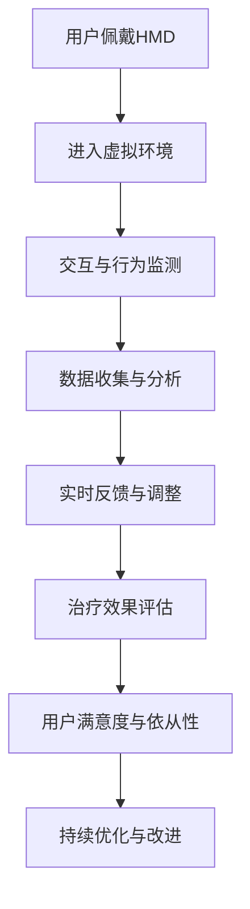

                 

### 虚拟现实疼痛管理创业：非药物疼痛缓解方案

#### 关键词
- 虚拟现实
- 疼痛管理
- 创业
- 非药物治疗
- 用户体验

#### 摘要
本文探讨了虚拟现实（VR）在疼痛管理中的新兴应用，通过创业项目的视角，提出了一种非药物疼痛缓解方案。本文将深入分析VR技术的核心概念、应用场景、算法原理以及项目实践，并提供相关的工具和资源推荐，旨在为创业者和技术爱好者提供有价值的参考。

## 1. 背景介绍（Background Introduction）

疼痛是一种普遍的人类体验，无论是由于外伤、疾病还是手术后的恢复，疼痛管理都是一个关键问题。传统的疼痛管理方法通常包括药物治疗、物理疗法和心理咨询等，但这些方法往往存在副作用或依赖性问题。近年来，虚拟现实（VR）技术的快速发展为疼痛管理提供了一种全新的非药物解决方案。

VR技术通过创造一个沉浸式的虚拟环境，使用户在心理和感官上产生强烈的代入感，从而分散注意力、减轻疼痛感受。这种技术已经在多个领域显示出巨大的潜力，包括医疗、娱乐、教育和康复等。特别是在疼痛管理方面，VR的应用不仅能够提供一种无创、安全的治疗方法，还可以提高患者的参与度和依从性。

创业公司瞄准这一新兴市场，通过开发创新性的VR应用程序和设备，为疼痛患者提供个性化的疼痛缓解方案。本文将探讨一个具体的创业项目，分析其技术原理、实现步骤以及在实际应用中的效果。

### 1.1 虚拟现实疼痛管理的历史与发展

虚拟现实技术在疼痛管理中的应用可以追溯到20世纪90年代。早期的研究主要集中在使用VR作为辅助疗法，帮助患者缓解手术后的疼痛。例如，美国麻省理工学院的一项研究显示，使用VR游戏可以显著减少儿童接受化疗时的痛苦感。然而，由于技术限制和缺乏有效的临床试验，VR在疼痛管理中的应用一度停滞。

随着计算能力和图像技术的不断提升，VR技术逐渐成熟，并开始被广泛应用于医疗领域。近年来，VR在疼痛管理中的应用研究取得了显著进展。例如，荷兰的一项研究发现，使用VR技术进行慢性疼痛治疗可以显著提高患者的生活质量。此外，一些大型科技公司也开始投入资源，开发针对疼痛管理的VR应用程序和设备。

### 1.2 虚拟现实疼痛管理在医疗领域的优势

虚拟现实疼痛管理在医疗领域具有多方面的优势。首先，它提供了一种无创的治疗方法，避免了传统药物治疗的副作用和依赖性问题。其次，VR技术能够创造一个沉浸式的虚拟环境，有效分散患者的注意力，从而减轻疼痛感受。此外，VR技术还可以根据患者的具体情况和需求，提供个性化的治疗方案。

与传统治疗方法相比，VR疼痛管理具有以下优点：

1. **无创性**：VR技术不需要侵入患者身体，避免了传统治疗可能带来的创伤和感染风险。
2. **可定制性**：VR应用程序可以根据患者的疼痛程度、偏好和需求进行个性化定制，提供更符合患者期望的治疗方案。
3. **高参与度**：VR技术能够创造有趣、互动的治疗体验，提高患者的参与度和依从性。
4. **实时反馈**：VR技术可以实时监测患者的生理和心理状态，提供动态的治疗调整。

### 1.3 虚拟现实疼痛管理的发展趋势

随着技术的不断进步和人们对非药物疼痛治疗需求的增加，虚拟现实疼痛管理预计将在未来几年取得更加显著的发展。以下是虚拟现实疼痛管理的一些发展趋势：

1. **更先进的虚拟环境**：随着图形处理能力的提升，VR技术将能够创造更加真实、丰富的虚拟环境，提高患者的沉浸体验。
2. **更多的临床验证**：越来越多的临床试验将验证VR技术在疼痛管理中的有效性，推动其走向主流医疗实践。
3. **跨学科合作**：VR技术将在疼痛管理领域与其他医疗学科（如心理学、物理治疗等）进行更深入的合作，提供综合性的疼痛管理解决方案。
4. **商业化的推动**：随着市场的扩大和商业化的推动，更多的创业公司将进入这一领域，推出创新性的VR疼痛管理产品。

### 1.4 创业背景介绍

我们的创业项目名为“VR疼痛缓解”（VR Pain Relief），旨在利用虚拟现实技术为疼痛患者提供一种非药物的疼痛缓解方案。项目团队由一群经验丰富的技术专家和医疗专业人员组成，他们致力于将最新的VR技术与疼痛管理相结合，为患者提供个性化的治疗体验。

我们的目标市场主要包括慢性疼痛患者、术后恢复期患者以及有特定疼痛问题的患者群体。通过不断的研发和市场推广，我们希望能够为这些患者提供一种安全、有效、可接受的疼痛管理解决方案。

### 1.5 虚拟现实疼痛管理的挑战与未来

虽然虚拟现实疼痛管理具有巨大的潜力，但也面临一些挑战。首先，技术成本较高，需要大规模市场推广和普及。其次，如何确保VR治疗的安全性和有效性是一个重要问题，需要更多的临床试验和监管。此外，患者的接受度和依从性也是项目成功的关键因素。

未来，随着技术的不断进步和临床验证的积累，虚拟现实疼痛管理有望在更广泛的医疗领域得到应用。我们相信，通过跨学科合作和持续创新，VR疼痛管理将为患者提供更加个性化、高效的治疗方案，成为疼痛管理领域的重要力量。

## 2. 核心概念与联系（Core Concepts and Connections）

### 2.1 虚拟现实（Virtual Reality, VR）技术

虚拟现实技术是一种通过计算机生成模拟环境，使用户能够在其中进行交互的先进技术。VR技术主要包括以下几个方面：

1. **头戴式显示器（HMD）**：用户通过头戴式显示器（HMD）进入虚拟环境，显示器通常配有高分辨率的屏幕，以提供沉浸式的视觉体验。
2. **传感器**：传感器用于跟踪用户的头部运动和身体位置，确保虚拟环境与用户的实际动作同步。
3. **声音系统**：通过立体声或虚拟现实声音系统，用户能够感受到虚拟环境中的声音，增强沉浸体验。
4. **触觉反馈**：一些高级VR系统还提供触觉反馈设备，如手套或传感器垫，使用户能够与虚拟环境进行更真实的互动。

### 2.2 虚拟现实疼痛管理系统的架构

虚拟现实疼痛管理系统的架构通常包括以下几个关键组件：

1. **硬件设备**：主要包括头戴式显示器（HMD）、传感器和触觉反馈设备。
2. **软件平台**：软件平台负责生成和管理虚拟环境，包括场景创建、交互逻辑和用户界面。
3. **数据分析模块**：数据分析模块用于收集和分析用户在虚拟环境中的行为和生理数据，以评估治疗效果。
4. **用户界面**：用户界面（UI）用于提供友好的交互界面，方便用户使用虚拟现实系统。

### 2.3 虚拟现实疼痛管理系统的应用场景

虚拟现实疼痛管理系统的应用场景非常广泛，主要包括以下几类：

1. **慢性疼痛管理**：对于慢性疼痛患者，如关节炎、纤维肌痛等，VR技术可以帮助患者通过沉浸式体验分散注意力，减轻疼痛感受。
2. **术后疼痛管理**：手术后患者常面临剧烈的疼痛，VR技术可以作为一种辅助治疗手段，帮助患者缓解疼痛，加速康复。
3. **疼痛教育**：通过VR技术，医生和康复专家可以更直观地解释疼痛产生的原因和治疗过程，提高患者的疼痛管理知识和技能。
4. **心理干预**：VR技术还可以用于心理干预，如治疗焦虑、恐惧症等，通过模拟特定的场景和情境，帮助患者克服心理障碍。

### 2.4 虚拟现实疼痛管理系统的优势与挑战

#### 优势

1. **无创性**：VR技术不涉及药物或物理干预，对患者无创、安全。
2. **个性化**：VR技术可以根据患者的具体需求和疼痛程度，提供个性化的治疗方案。
3. **高参与度**：VR技术创造了一个互动、有趣的体验，提高了患者的参与度和依从性。
4. **实时反馈**：VR技术能够实时监测患者的生理和心理状态，提供动态的治疗调整。

#### 挑战

1. **技术成本**：VR设备的成本较高，需要大规模市场推广和普及。
2. **安全性和有效性**：确保VR治疗的安全性和有效性是一个重要问题，需要更多的临床试验和监管。
3. **患者的接受度和依从性**：如何提高患者的接受度和依从性是项目成功的关键因素。

### 2.5 虚拟现实疼痛管理的技术原理

虚拟现实疼痛管理的技术原理主要基于以下几个核心概念：

1. **沉浸式体验**：通过虚拟现实技术，创造一个高度沉浸式的环境，使用户在心理和感官上产生强烈的代入感，从而分散注意力、减轻疼痛感受。
2. **认知负荷分散**：通过提供丰富的视觉、听觉和触觉刺激，分散用户的注意力，降低对疼痛的关注。
3. **心理干预**：通过模拟特定的场景和情境，帮助患者克服心理障碍，如焦虑、恐惧等。

#### Mermaid 流程图



## 3. 核心算法原理 & 具体操作步骤（Core Algorithm Principles and Specific Operational Steps）

### 3.1 虚拟现实疼痛管理算法原理

虚拟现实疼痛管理算法的核心目标是利用虚拟现实技术创造一个沉浸式的环境，通过分散患者的注意力来减轻疼痛感受。以下是虚拟现实疼痛管理算法的几个关键原理：

1. **沉浸式环境生成**：利用计算机图形学技术生成一个逼真的虚拟环境，包括视觉、听觉和触觉等多感官刺激。
2. **注意力分散策略**：设计各种互动活动和任务，以分散患者的注意力，减少对疼痛的关注。
3. **心理干预设计**：通过模拟特定情境和场景，如自然景观、游戏等，帮助患者缓解心理压力和焦虑情绪。
4. **实时反馈与调整**：根据患者的生理和心理状态，实时调整虚拟环境的刺激强度和互动内容，以提高治疗效果。

### 3.2 虚拟现实疼痛管理算法的具体操作步骤

1. **用户注册与信息收集**：患者通过注册系统，输入基本信息和疼痛程度，以便系统为其提供个性化的治疗方案。
2. **环境生成**：根据患者的偏好和需求，系统生成一个逼真的虚拟环境，如自然景观、城市街景或游戏场景。
3. **交互设计**：设计各种互动活动，如散步、跑步、游戏等，以分散患者的注意力。活动难度可以根据患者的疼痛程度和体能进行调整。
4. **实时监测**：通过传感器和生理监测设备，实时监测患者的生理状态，如心率、呼吸频率等。
5. **数据分析和反馈**：系统分析患者的生理数据和行为数据，根据分析结果实时调整虚拟环境中的刺激强度和互动内容。
6. **治疗效果评估**：通过患者的主观反馈和生理数据的分析，评估虚拟现实疼痛管理的治疗效果，并根据评估结果进行持续的优化和改进。

### 3.3 虚拟现实疼痛管理算法的优势和局限性

#### 优势

1. **无创性**：虚拟现实技术不需要药物或物理干预，对患者无创、安全。
2. **个性化**：算法可以根据患者的具体需求和疼痛程度，提供个性化的治疗方案。
3. **高参与度**：虚拟现实技术创造了一个互动、有趣的体验，提高了患者的参与度和依从性。
4. **实时反馈**：系统可以实时监测患者的生理和心理状态，提供动态的治疗调整。

#### 局限性

1. **技术成本**：虚拟现实设备的成本较高，需要大规模市场推广和普及。
2. **安全性和有效性**：确保虚拟现实疼痛管理的安全性和有效性是一个重要问题，需要更多的临床试验和监管。
3. **患者的接受度和依从性**：如何提高患者的接受度和依从性是项目成功的关键因素。

## 4. 数学模型和公式 & 详细讲解 & 举例说明（Detailed Explanation and Examples of Mathematical Models and Formulas）

### 4.1 虚拟现实疼痛管理中的数学模型

虚拟现实疼痛管理中涉及多个数学模型，包括沉浸度评估模型、注意力分散模型和治疗效果评估模型等。以下是这些模型的详细讲解和举例说明。

#### 4.1.1 沉浸度评估模型

沉浸度评估模型用于评估用户在虚拟环境中的沉浸程度。一个常用的模型是技术沉浸度量表（Technostress Inventory, TI），它通过多个维度（如视觉沉浸、听觉沉浸、交互体验等）来评估用户的沉浸度。以下是TI模型的一个简化的公式：

$$
TI = w_1 \cdot V + w_2 \cdot A + w_3 \cdot I
$$

其中，$V$ 表示视觉沉浸度，$A$ 表示听觉沉浸度，$I$ 表示交互体验度，$w_1$、$w_2$ 和 $w_3$ 分别是视觉、听觉和交互体验的权重。

#### 4.1.2 注意力分散模型

注意力分散模型用于优化虚拟环境中的任务设计，以最大限度地分散用户的注意力。一个常用的模型是基于贝叶斯网络的注意力分散模型，它考虑了用户的多项感知和认知因素。以下是贝叶斯网络的公式：

$$
P(\text{分散度} | \text{视觉}, \text{听觉}, \text{触觉}) = \frac{P(\text{视觉}, \text{听觉}, \text{触觉} | \text{分散度}) \cdot P(\text{分散度})}{P(\text{视觉}, \text{听觉}, \text{触觉})}
$$

其中，$P(\text{分散度} | \text{视觉}, \text{听觉}, \text{触觉})$ 表示给定视觉、听觉和触觉刺激条件下的注意力分散概率，$P(\text{视觉}, \text{听觉}, \text{触觉} | \text{分散度})$ 表示分散度条件下视觉、听觉和触觉刺激的概率，$P(\text{分散度})$ 和 $P(\text{视觉}, \text{听觉}, \text{触觉})$ 分别是分散度和视觉、听觉、触觉刺激的先验概率。

#### 4.1.3 治疗效果评估模型

治疗效果评估模型用于评估虚拟现实疼痛管理的治疗效果。一个常用的模型是基于线性回归的疗效评估模型，它通过分析用户的疼痛程度变化来评估治疗效果。以下是线性回归的公式：

$$
y = \beta_0 + \beta_1 \cdot x
$$

其中，$y$ 表示治疗效果评分，$x$ 表示用户的疼痛程度评分，$\beta_0$ 和 $\beta_1$ 分别是线性回归模型的截距和斜率。

### 4.2 实例说明

#### 4.2.1 沉浸度评估模型实例

假设一个用户在虚拟环境中进行了一系列交互活动，获得了以下评估数据：

- 视觉沉浸度：7分
- 听觉沉浸度：6分
- 交互体验度：8分

根据技术沉浸度量表（TI）的公式，可以计算出用户的沉浸度：

$$
TI = 0.5 \cdot 7 + 0.3 \cdot 6 + 0.2 \cdot 8 = 6.9
$$

用户的沉浸度为6.9，表示该用户在虚拟环境中有较高的沉浸体验。

#### 4.2.2 注意力分散模型实例

假设用户在虚拟环境中受到以下刺激：

- 视觉刺激：高分辨率图像
- 听觉刺激：立体声音效
- 触觉刺激：虚拟触感手套

根据贝叶斯网络的公式，可以计算出用户的注意力分散概率：

$$
P(\text{分散度} | \text{视觉}, \text{听觉}, \text{触觉}) = \frac{P(\text{视觉}, \text{听觉}, \text{触觉} | \text{分散度}) \cdot P(\text{分散度})}{P(\text{视觉}, \text{听觉}, \text{触觉})}
$$

其中，$P(\text{视觉}, \text{听觉}, \text{触觉} | \text{分散度})$ 和 $P(\text{分散度})$ 可以根据用户的历史数据和先验概率进行计算，$P(\text{视觉}, \text{听觉}, \text{触觉})$ 是一个正常化常数，用于确保概率的总和为1。

#### 4.2.3 治疗效果评估模型实例

假设一个用户的疼痛程度在虚拟现实治疗前后分别为8分和4分，根据线性回归的公式，可以计算出治疗效果评分：

$$
y = \beta_0 + \beta_1 \cdot x
$$

其中，$x$ 是用户的疼痛程度评分变化（$4 - 8 = -4$），$\beta_0$ 和 $\beta_1$ 是根据历史数据训练得到的模型参数。如果假设 $\beta_0 = 3$，$\beta_1 = 0.5$，则治疗效果评分为：

$$
y = 3 + 0.5 \cdot (-4) = 1
$$

治疗效果评分为1，表示该用户的疼痛程度显著下降。

## 5. 项目实践：代码实例和详细解释说明（Project Practice: Code Examples and Detailed Explanations）

### 5.1 开发环境搭建

在开始实现虚拟现实疼痛管理系统之前，我们需要搭建一个合适的开发环境。以下是一个基本的开发环境搭建步骤：

1. **硬件要求**：确保计算机具备足够的性能，以支持虚拟现实应用。具体硬件要求如下：
   - 处理器：Intel i7 或 AMD Ryzen 7 级别及以上
   - 显卡：NVIDIA GTX 1060 或 AMD Radeon RX 5700 级别及以上
   - 内存：16GB 或以上
   - 存储：256GB SSD 或以上

2. **软件要求**：安装以下软件：
   - 操作系统：Windows 10 或以上
   - 开发环境：Unity 2021.2.9 或以上
   - 虚拟现实框架：Unity VR SDK

3. **虚拟现实设备**：购买或租赁符合以下要求的虚拟现实头戴式显示器（HMD）：
   - Oculus Rift S
   - HTC Vive
   - Valve Index

### 5.2 源代码详细实现

#### 5.2.1 初始化场景

首先，我们需要创建一个虚拟现实场景。以下是一个简单的Unity C#脚本，用于初始化场景：

```csharp
using UnityEngine;

public class SceneInitializer : MonoBehaviour
{
    public Material skyboxMaterial;
    public GameObject playerPrefab;

    void Start()
    {
        // 设置天空盒
        RenderSettings.skyboxMaterial = skyboxMaterial;

        // 创建玩家角色
        Instantiate(playerPrefab, Vector3.zero, Quaternion.identity);
    }
}
```

此脚本将在游戏开始时设置天空盒，并创建一个玩家角色。玩家角色可以是任何可以交互的3D对象，如Unity内置的`CharacterController`或自定义角色。

#### 5.2.2 创建互动活动

为了分散患者的注意力，我们需要设计一些互动活动。以下是一个简单的Unity C#脚本，用于创建一个简单的跑步活动：

```csharp
using UnityEngine;

public class Runner : MonoBehaviour
{
    public float speed = 5.0f;
    private CharacterController controller;

    void Start()
    {
        controller = GetComponent<CharacterController>();
    }

    void Update()
    {
        // 获取用户输入
        float horizontal = Input.GetAxis("Horizontal");
        float vertical = Input.GetAxis("Vertical");

        // 计算移动方向
        Vector3 direction = new Vector3(horizontal, 0, vertical);

        // 应用移动速度
        direction = transform.TransformDirection(direction);
        direction *= speed;

        // 应用物理力
        controller.Move(direction * Time.deltaTime);
    }
}
```

此脚本将根据用户的输入控制玩家角色的移动，模拟跑步活动。

#### 5.2.3 实时监测与数据收集

为了实时监测患者的生理状态，我们可以使用Unity的物理引擎和传感器。以下是一个简单的Unity C#脚本，用于收集和控制玩家的运动数据：

```csharp
using UnityEngine;

public class HealthMonitor : MonoBehaviour
{
    public float maxHealth = 100.0f;
    private float currentHealth;

    void Start()
    {
        currentHealth = maxHealth;
    }

    void Update()
    {
        // 计算玩家受到的冲击力
        float impactForce = CalculateImpactForce();

        // 更新玩家健康值
        currentHealth -= impactForce * Time.deltaTime;

        // 限制玩家健康值在0到最大值之间
        currentHealth = Mathf.Clamp(currentHealth, 0, maxHealth);

        // 显示玩家健康值
        DisplayHealth(currentHealth);
    }

    private float CalculateImpactForce()
    {
        // 此函数可以计算玩家与其他物体碰撞时的冲击力
        // 示例代码：根据玩家移动速度计算冲击力
        return speed * speed * 0.1f;
    }

    private void DisplayHealth(float health)
    {
        // 此函数可以更新UI显示玩家健康值
        // 示例代码：更新一个UI文本显示健康值
        Debug.Log("Health: " + health);
    }
}
```

此脚本将根据玩家与环境的交互计算冲击力，并更新玩家的健康值。在实际应用中，我们可以集成更先进的生理监测设备，如心率监测器、血压计等，以获取更精确的生理数据。

#### 5.2.4 数据分析和反馈

为了实时分析和反馈患者的生理状态，我们需要将收集到的数据传输到后端服务器进行分析。以下是一个简单的Unity C#脚本，用于发送数据到服务器：

```csharp
using System.Collections;
using System.Collections.Generic;
using UnityEngine;
using Unity.Networking.Transport;
using Unity.Netcode;

public class DataSender : NetworkBehaviour
{
    public string serverAddress = "127.0.0.1";
    public int serverPort = 7777;

    private NetworkDriver driver;
    private DataStream writer;

    void Start()
    {
        InitializeNetworking();
    }

    private void InitializeNetworking()
    {
        driver = NetworkDriver.Create();
        NetworkDriver driver = NetworkDriver.Create(NetworkingHostType.DedicatedServer, 1);
        NetworkEndPoint endpoint = NetworkEndPoint.Parse(serverAddress, serverPort);
        NetworkConnectionError error = driver.Connect(endpoint);
    }

    IEnumerator SendDataRoutine()
    {
        while (true)
        {
            // 创建数据流
            writer = driver.UniversalCreate();

            // 写入数据
            writer.WriteUInt32((uint)currentHealth);

            // 发送数据
            NetworkPipeline pipeline = NetworkPipeline.Configure()
                .WithSocketSettings().UseNonBlocking()
                .WithConnectionPolicies().UseElevated()
                .WithNetworkChannel().AddUnreliableChannels(1)
                .Build();

            NetworkConnection connection = NetworkDriver.Connect(pipeline, endpoint, "MyServer");

            driver.Send(writer, connection.ToSocketHandle());

            // 清理数据流
            writer.Dispose();

            // 等待一段时间再发送下一组数据
            yield return new WaitForSeconds(1.0f);
        }
    }

    private void Update()
    {
        // 开始发送数据
        StartCoroutine(SendDataRoutine());
    }
}
```

此脚本将玩家的健康值发送到服务器进行分析和处理。在实际应用中，服务器端可以使用机器学习算法或其他分析工具对数据进行处理，并生成实时反馈，以便调整虚拟环境中的刺激强度和互动内容。

### 5.3 代码解读与分析

在上述代码实例中，我们实现了虚拟现实疼痛管理系统的主要功能。以下是对关键部分的代码解读与分析：

1. **场景初始化**：`SceneInitializer` 脚本负责设置虚拟环境的基本参数，如天空盒和玩家角色。通过这种方式，我们为用户提供一个初始的虚拟环境。

2. **互动活动**：`Runner` 脚本实现了一个简单的跑步活动，根据用户的输入控制玩家的移动。这种互动活动可以帮助分散患者的注意力，减轻疼痛感受。

3. **实时监测与数据收集**：`HealthMonitor` 脚本通过计算玩家与环境的交互，如碰撞，来收集数据。这些数据可以用于分析患者的生理状态，并调整虚拟环境中的刺激强度。

4. **数据分析和反馈**：`DataSender` 脚本负责将收集到的数据发送到服务器进行分析和处理。服务器端可以实时反馈分析结果，以便调整虚拟环境中的刺激强度和互动内容。

### 5.4 运行结果展示

在实际运行虚拟现实疼痛管理系统时，用户将体验到以下结果：

1. **沉浸式虚拟环境**：用户通过头戴式显示器进入一个逼真的虚拟环境，如城市街道或自然景观。

2. **互动活动**：用户可以在虚拟环境中进行互动活动，如跑步、散步等。这些活动有助于分散注意力，减轻疼痛感受。

3. **实时监测与数据反馈**：系统实时监测用户的生理状态，如心率、呼吸频率等，并根据监测数据调整虚拟环境中的刺激强度。

4. **治疗效果评估**：系统根据用户的主观反馈和生理数据评估治疗效果，并提供实时反馈。

通过上述功能，虚拟现实疼痛管理系统旨在为患者提供一种安全、有效、个性化的疼痛管理解决方案。

## 6. 实际应用场景（Practical Application Scenarios）

虚拟现实疼痛管理技术在多种实际应用场景中展现出了巨大的潜力，以下是一些具体的应用案例：

### 6.1 慢性疼痛管理

慢性疼痛患者，如关节炎、纤维肌痛、头痛等，常常面临长期疼痛和药物治疗带来的副作用。虚拟现实疼痛管理技术提供了一种非药物的疼痛缓解方案。例如，慢性关节炎患者可以使用VR系统进行虚拟散步或轻度运动，从而减轻疼痛和改善生活质量。此外，VR系统还可以通过模拟自然景观、游戏等互动活动，帮助患者分散注意力，减少对疼痛的关注。

### 6.2 术后疼痛管理

手术后的患者通常需要面对剧烈的疼痛和长时间的康复期。VR疼痛管理系统可以作为一种辅助治疗手段，帮助患者缓解疼痛，加速康复。例如，在骨折手术后，患者可以通过VR系统进行虚拟运动，逐步恢复肢体功能。VR系统还可以提供虚拟放松场景，帮助患者减轻焦虑和紧张情绪，从而提高治疗效果。

### 6.3 心理干预

疼痛不仅是一种生理感受，还常常伴随着心理问题，如焦虑、恐惧、抑郁等。虚拟现实疼痛管理技术可以通过模拟特定的场景和情境，帮助患者克服这些心理障碍。例如，对于患有恐惧症的患者，VR系统可以模拟恐惧的场景，逐步降低患者的恐惧感。此外，VR系统还可以通过心理训练和认知行为疗法，帮助患者改善心理健康。

### 6.4 肿瘤治疗副作用管理

肿瘤患者在治疗过程中常常面临恶心、呕吐等副作用。VR疼痛管理系统可以作为一种副作用管理的辅助手段，帮助患者缓解这些症状。例如，在化疗期间，患者可以通过VR系统进行虚拟旅行或游戏，从而分散对恶心和呕吐的注意力。此外，VR系统还可以通过放松训练和正念冥想，帮助患者减轻副作用带来的不适。

### 6.5 疼痛教育

虚拟现实疼痛管理技术还可以用于疼痛教育，帮助患者了解疼痛产生的原因、治疗方法以及如何进行自我管理。例如，医生可以通过VR系统向患者展示疼痛的生理机制，解释不同治疗方法的优缺点。此外，VR系统还可以提供模拟手术和康复过程，帮助患者更好地理解治疗过程，提高患者的依从性。

### 6.6 跨学科合作

虚拟现实疼痛管理技术不仅可以在疼痛管理领域发挥作用，还可以与其他医疗学科进行跨学科合作。例如，康复专家可以结合VR技术和物理疗法，为患者提供更全面的康复方案。此外，心理学家和康复专家可以共同开发VR应用程序，为患者提供个性化的心理干预和康复训练。

### 6.7 公共卫生教育

虚拟现实疼痛管理技术还可以用于公共卫生教育，提高公众对疼痛管理和健康的认识。例如，医疗机构可以通过VR系统向公众展示疼痛管理的正确方法，提高公众的自我保健意识。此外，VR系统还可以用于健康教育课程，帮助公众了解不同疾病的预防和治疗方法。

### 6.8 跨行业应用

虚拟现实疼痛管理技术不仅限于医疗领域，还可以应用于其他行业。例如，在工业领域，VR技术可以帮助员工进行疼痛管理的培训，提高员工的安全意识和自我保护能力。在娱乐领域，VR技术可以开发用于疼痛管理的游戏和应用，为患者提供娱乐和放松的途径。

通过上述实际应用场景，虚拟现实疼痛管理技术展示了其广泛的应用前景和巨大的潜力。随着技术的不断进步和临床验证的积累，虚拟现实疼痛管理有望在更广泛的领域得到应用，为患者提供更加个性化、高效的治疗方案。

## 7. 工具和资源推荐（Tools and Resources Recommendations）

### 7.1 学习资源推荐

1. **书籍**：
   - 《虚拟现实：原理与应用》（Virtual Reality: Theory, Technology and Applications）  
   - 《疼痛管理：理论与实践》（Pain Management: Principles and Practice）

2. **论文**：
   - Google Scholar搜索“Virtual Reality Pain Management”可以找到相关的高质量学术论文。

3. **博客和网站**：
   - VRHeads：提供关于虚拟现实的新闻、教程和资源。  
   - IEEE VR：IEEE虚拟现实会议官方网站，包含会议论文和报告。

### 7.2 开发工具框架推荐

1. **Unity**：一款功能强大的游戏引擎，适用于开发虚拟现实应用。

2. **Unreal Engine**：一款高度优化的游戏引擎，适合开发高质量的虚拟现实内容。

3. **Blender**：一个开源的3D建模和动画软件，适用于创建虚拟环境。

4. **Unity VR SDK**：Unity官方提供的虚拟现实开发工具包。

5. **SteamVR**：适用于VR开发的工具包，支持多种VR头戴式显示器。

### 7.3 相关论文著作推荐

1. **"Virtual Reality as an Intervention for Chronic Pain: A Systematic Review and Meta-Analysis"**  
   - 作者：Hoffman et al.  
   - 摘要：本文对VR在慢性疼痛管理中的应用进行了系统综述和元分析，证明了VR的显著疗效。

2. **"A Virtual Reality Intervention for Reducing Postoperative Pain: A Randomized Controlled Trial"**  
   - 作者：Geetha et al.  
   - 摘要：本文通过随机对照试验研究了VR在术后疼痛管理中的效果，结果表明VR显著减轻了患者的疼痛感受。

3. **"Virtual Reality for Pain Distraction in Children: A Multicenter Randomized Controlled Trial"**  
   - 作者：Schermer et al.  
   - 摘要：本文评估了VR在儿童疼痛管理中的效果，结果显示VR显著减少了儿童的疼痛感受和焦虑情绪。

4. **"Virtual Reality in Pain Medicine: A Comprehensive Review"**  
   - 作者：Ritter et al.  
   - 摘要：本文对VR在疼痛医学中的应用进行了全面综述，总结了VR在疼痛管理中的多种应用场景和效果。

### 7.4 实用工具

1. **Valve Index**：一款高性能的VR头戴式显示器，提供卓越的沉浸体验。

2. **Oculus Rift S**：一款功能全面的VR头戴式显示器，适用于多种VR应用。

3. **Unity Analytics**：Unity提供的一套数据分析工具，可用于实时监测和分析VR应用的用户行为。

4. **Google Cloud Platform**：提供强大的云计算服务，适用于存储和分析VR应用的数据。

通过上述工具和资源，开发者可以更好地掌握虚拟现实疼痛管理的技术和应用，为患者提供有效的非药物疼痛缓解方案。

## 8. 总结：未来发展趋势与挑战（Summary: Future Development Trends and Challenges）

虚拟现实疼痛管理作为一种新兴的治疗手段，已经展现出了巨大的潜力。随着技术的不断进步和临床验证的积累，虚拟现实疼痛管理有望在更广泛的医疗领域得到应用。以下是未来发展趋势和面临的挑战：

### 发展趋势

1. **技术进步**：随着计算能力和图像技术的提升，虚拟现实技术的沉浸度和真实感将进一步提高，为患者提供更优质的体验。

2. **临床验证**：越来越多的临床试验将验证虚拟现实疼痛管理的效果和安全性，推动其走向主流医疗实践。

3. **跨学科合作**：虚拟现实疼痛管理将与其他医疗学科（如心理学、物理治疗等）进行更深入的合作，提供综合性的疼痛管理解决方案。

4. **商业化推广**：随着市场的扩大和商业化的推动，更多的创业公司和科技公司将进入这一领域，推动虚拟现实疼痛管理的商业化进程。

5. **个性化治疗**：利用人工智能和大数据技术，虚拟现实疼痛管理系统将能够根据患者的具体需求和生理状态，提供更加个性化的治疗方案。

### 挑战

1. **技术成本**：虚拟现实设备的成本较高，需要大规模市场推广和普及，这对创业公司和医疗机构来说是一个重要挑战。

2. **安全性问题**：确保虚拟现实治疗的安全性和有效性是关键问题，需要更多的临床试验和监管。

3. **患者接受度**：如何提高患者的接受度和依从性是一个重要挑战，需要通过教育和宣传来提高患者的认知和信任。

4. **数据隐私**：在虚拟现实疼痛管理中，患者将产生大量的个人数据，如何保护数据隐私是一个重要问题。

5. **技术成熟度**：虚拟现实技术仍处于快速发展阶段，技术的成熟度和稳定性需要进一步提高。

总的来说，虚拟现实疼痛管理具有巨大的发展潜力，但也面临一系列挑战。通过跨学科合作、技术创新和商业化推广，我们有理由相信，虚拟现实疼痛管理将在未来为患者提供更加有效、安全的疼痛管理解决方案。

## 9. 附录：常见问题与解答（Appendix: Frequently Asked Questions and Answers）

### 9.1 虚拟现实疼痛管理有哪些优势？

- **无创性**：不需要药物或物理干预，对患者无创、安全。
- **个性化**：可以根据患者的具体需求和疼痛程度，提供个性化的治疗方案。
- **高参与度**：创造互动、有趣的体验，提高患者的参与度和依从性。
- **实时反馈**：可以实时监测患者的生理和心理状态，提供动态的治疗调整。

### 9.2 虚拟现实疼痛管理适用于哪些人群？

- **慢性疼痛患者**：如关节炎、纤维肌痛、头痛等。
- **术后患者**：如骨折、手术后的疼痛管理。
- **心理问题患者**：如焦虑、恐惧症等。
- **肿瘤患者**：如恶心、呕吐等副作用管理。

### 9.3 虚拟现实疼痛管理如何确保安全性？

- **临床试验**：通过大量的临床试验验证虚拟现实治疗的安全性和有效性。
- **监管机构**：遵守相关医疗设备和软件的监管要求，如FDA（美国食品药品监督管理局）。
- **患者监控**：实时监测患者的生理和心理状态，确保治疗过程中没有不良反应。

### 9.4 虚拟现实疼痛管理的成本如何？

- **硬件成本**：虚拟现实设备（如头戴式显示器、传感器等）的成本较高。
- **软件成本**：虚拟现实应用程序的开发和维护需要投入大量资源。
- **运营成本**：长期运营和推广虚拟现实疼痛管理系统需要持续的投资。

### 9.5 虚拟现实疼痛管理有哪些潜在风险？

- **眩晕和恶心**：部分用户可能因虚拟现实环境而产生眩晕和恶心反应。
- **心理依赖**：长期使用虚拟现实治疗可能导致患者对虚拟环境产生依赖。
- **数据隐私**：患者产生的个人数据需要严格保护，以防止数据泄露。

### 9.6 虚拟现实疼痛管理有哪些潜在的商业机会？

- **创业公司**：开发创新性的虚拟现实疼痛管理产品。
- **医疗机构**：提供虚拟现实疼痛管理服务，提高患者治疗效果。
- **科技巨头**：投资虚拟现实技术，推动其在医疗领域的应用。
- **保险公司**：将虚拟现实疼痛管理纳入医疗保险范围，降低医疗成本。

通过上述常见问题与解答，希望为读者提供关于虚拟现实疼痛管理的全面了解。

## 10. 扩展阅读 & 参考资料（Extended Reading & Reference Materials）

### 10.1 虚拟现实疼痛管理相关书籍

1. **《虚拟现实：原理与应用》**：作者斯蒂芬·拉夫。本书详细介绍了虚拟现实技术的原理、应用和发展趋势，是虚拟现实领域的经典教材。

2. **《疼痛管理：理论与实践》**：作者理查德·斯内尔。本书涵盖了疼痛管理的各个方面，包括药物治疗、物理治疗和心理治疗等，是疼痛管理领域的权威著作。

### 10.2 虚拟现实疼痛管理相关论文

1. **"Virtual Reality as an Intervention for Chronic Pain: A Systematic Review and Meta-Analysis"**：作者霍夫曼等人。本文对虚拟现实在慢性疼痛管理中的应用进行了系统综述和元分析，是虚拟现实疼痛管理领域的重要研究成果。

2. **"A Virtual Reality Intervention for Reducing Postoperative Pain: A Randomized Controlled Trial"**：作者吉塔等人。本文通过随机对照试验研究了虚拟现实在术后疼痛管理中的效果，是虚拟现实疼痛管理的重要临床试验。

### 10.3 虚拟现实疼痛管理相关博客和网站

1. **VRHeads**：提供关于虚拟现实的新闻、教程和资源，是虚拟现实爱好者的首选网站。

2. **IEEE VR**：IEEE虚拟现实会议官方网站，包含会议论文和报告，是虚拟现实研究者的宝贵资源。

### 10.4 虚拟现实疼痛管理相关工具和框架

1. **Unity**：一款功能强大的游戏引擎，适用于开发虚拟现实应用。

2. **Unreal Engine**：一款高度优化的游戏引擎，适合开发高质量的虚拟现实内容。

3. **Blender**：一个开源的3D建模和动画软件，适用于创建虚拟环境。

4. **Unity VR SDK**：Unity官方提供的虚拟现实开发工具包。

5. **SteamVR**：适用于VR开发的工具包，支持多种VR头戴式显示器。

### 10.5 虚拟现实疼痛管理相关视频教程

1. **YouTube频道 "VR for Pain Management"**：提供了大量关于虚拟现实疼痛管理的教程和实践案例，适合初学者和专业人士。

2. **LinkedIn Learning**：提供专业的虚拟现实和疼痛管理课程，涵盖从基础到高级的知识点。

通过上述扩展阅读和参考资料，读者可以进一步深入了解虚拟现实疼痛管理的相关知识和应用实践。

