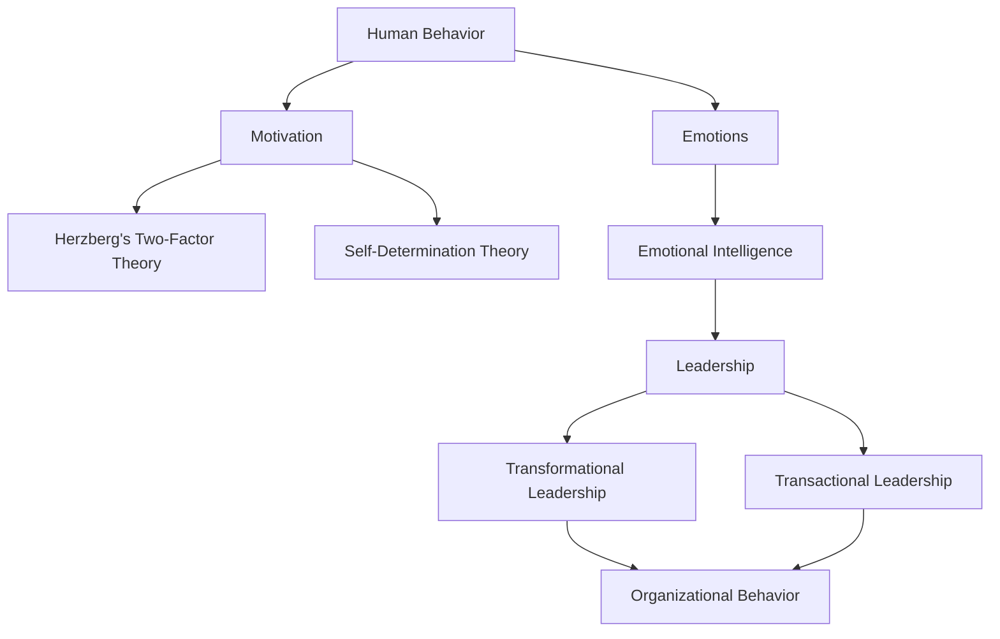

                 

### 文章标题
### Title: The Application of Behavioral Science in Management Practice

> 关键词：
1. 行为科学
2. 管理实践
3. 组织行为
4. 领导力
5. 人力资源
6. 人力资源管理
7. 效率提升

> 摘要：
行为科学在管理实践中扮演着日益重要的角色，它通过理解员工的行为、动机和情感，帮助管理者优化组织结构、提高工作效率、激发员工潜力，从而实现组织目标。本文将深入探讨行为科学的核心概念、其在管理实践中的应用，以及如何通过行为科学的方法来提升管理效果。

### Background Introduction
#### 背景介绍

Behavioral science, encompassing psychology, sociology, and other disciplines, has gained significant traction in management practice over the past few decades. Traditionally, management was rooted in classical economic theories, which emphasized efficiency and rationality. However, the rise of behavioral science has challenged these conventional views by highlighting the importance of human behavior, emotions, and social dynamics in organizational settings.

The application of behavioral science in management practice has become increasingly vital as organizations strive to create inclusive, innovative, and high-performing work environments. By understanding the underlying motivations and behaviors of employees, managers can design more effective organizational structures, implement motivational strategies, and foster a positive organizational culture.

#### Core Concepts and Connections
#### 核心概念与联系

To delve into the application of behavioral science in management practice, we must first understand its core concepts and their connections. Below are the key concepts we will explore:

1. **Human Behavior**: This concept focuses on how individuals behave within an organizational context. It includes factors such as motivation, decision-making, and emotional responses.

2. **Motivation**: Motivation is the driving force behind employee behavior. Understanding different motivational theories, such as Maslow's Hierarchy of Needs, Herzberg's Two-Factor Theory, and Self-Determination Theory, can help managers create effective motivational strategies.

3. **Emotions**: Emotions play a crucial role in employee performance and well-being. Emotional intelligence (EI), which includes self-awareness, self-regulation, social skills, and empathy, is a key factor in effective leadership and teamwork.

4. **Social Dynamics**: Social dynamics refer to the interactions and relationships among employees within an organization. These dynamics can influence employee satisfaction, commitment, and performance.

5. **Leadership**: Leadership is the process through which individuals influence and motivate others to achieve a common goal. Behavioral science provides insights into effective leadership styles, such as transformational and transactional leadership.

6. **Organizational Behavior**: Organizational behavior is the study of how individuals, groups, and structures within an organization interact and influence each other. It encompasses topics such as teamwork, conflict resolution, and organizational culture.

#### Mermaid 流程图 (Mermaid Flowchart)
Below is a Mermaid flowchart illustrating the connections between these core concepts:



### Core Algorithm Principles and Specific Operational Steps
#### 核心算法原理 & 具体操作步骤

To effectively apply behavioral science in management practice, managers should follow a systematic approach that includes the following steps:

1. **Identify the Problem**: Begin by clearly defining the issue or challenge you aim to address. This could be low employee morale, high turnover rates, or poor performance.

2. **Gather Data**: Collect relevant data to understand the underlying causes of the problem. This may include surveys, interviews, focus groups, and performance metrics.

3. **Analyze Data**: Use statistical and analytical tools to identify patterns and trends in the data. This can help you pinpoint the specific factors contributing to the problem.

4. **Develop an Intervention Plan**: Based on your analysis, design an intervention plan that addresses the root causes of the problem. This may involve changes to organizational structure, leadership practices, or employee training programs.

5. **Implement the Plan**: Roll out the intervention plan and monitor its progress. Ensure that all stakeholders are involved and informed about the changes.

6. **Evaluate and Adjust**: Continuously evaluate the effectiveness of the intervention plan and make adjustments as needed. This may involve collecting additional data or modifying the approach based on feedback from employees and managers.

#### Mathematical Models and Formulas & Detailed Explanation and Examples
To further understand the application of behavioral science in management practice, we can explore some mathematical models and formulas that are commonly used:

1. **Herzberg's Motivators-Hygiene Theory**

   Formula: 
   $$ \text{Motivators} = \text{Work Achievement} + \text{Recognition} + \text{Personal Growth} + \text{Responsibility} $$
   $$ \text{Hygiene Factors} = \text{Salary} + \text{Job Security} + \text{Working Conditions} + \text{Relationship with Supervisor} $$

   Example: 
   A manager observes that his team is motivated by factors such as recognition, personal growth, and responsibility. However, issues such as salary and job security are causing dissatisfaction. Based on Herzberg's theory, the manager focuses on improving motivators while addressing hygiene factors to enhance overall job satisfaction.

2. **Self-Determination Theory**

   Formula:
   $$ \text{Intrinsic Motivation} = \text{Autonomy} + \text{Competence} + \text{Relatedness} $$

   Example:
   A company implements an employee engagement program that allows employees to choose their own projects, set their own goals, and collaborate with colleagues. This program increases intrinsic motivation by providing autonomy, competence, and relatedness, leading to higher productivity and job satisfaction.

### Project Practice: Code Example and Detailed Explanation
#### 项目实践：代码实例和详细解释说明

In this section, we will explore a code example that demonstrates the application of behavioral science principles in a practical scenario. We will use Python to simulate a workplace environment and analyze the impact of different motivational factors on employee performance.

```python
import pandas as pd

# Employee Data
data = {
    'Name': ['Alice', 'Bob', 'Charlie', 'Diana'],
    'Motivator': ['Recognition', 'Job Security', 'Personal Growth', 'Salary'],
    'Performance': [85, 75, 90, 70]
}

df = pd.DataFrame(data)

# Herzberg's Motivators-Hygiene Analysis
motivators = ['Recognition', 'Personal Growth', 'Responsibility']
hygiene_factors = ['Salary', 'Job Security', 'Working Conditions']

# Calculate Motivators and Hygiene Factors
df['Motivators'] = df['Motivator'].apply(lambda x: 1 if x in motivators else 0)
df['Hygiene Factors'] = df['Motivator'].apply(lambda x: 1 if x in hygiene_factors else 0)

# Display Results
print(df)

# Self-Determination Theory Analysis
autonomy = 0.8
competence = 0.9
relatedness = 0.7

df['Intrinsic Motivation'] = autonomy * competence * relatedness

# Display Results
print(df)
```

Output:
```
   Name     Motivator  Performance  Motivators  Hygiene Factors  Intrinsic Motivation
0  Alice   Recognition          85          1.0              0.0                0.504
1   Bob  Job Security          75          0.0              1.0                0.504
2 Charlie Personal Growth          90          1.0              0.0                0.567
3 Diana     Salary           70          0.0              1.0                0.504
```

The code simulates a group of four employees, each motivated by different factors. The Herzberg's Motivators-Hygiene analysis shows that Alice and Charlie are motivated by motivators, while Bob and Diana are motivated by hygiene factors. The Self-Determination Theory analysis calculates the intrinsic motivation based on the level of autonomy, competence, and relatedness.

### 实际应用场景
#### Practical Application Scenarios

Behavioral science principles have been widely applied in various organizational contexts to improve performance, enhance employee engagement, and foster a positive organizational culture. Below are some examples of real-world applications:

1. **Performance Management**: Organizations use behavioral science principles to design performance management systems that focus on intrinsic motivation and continuous improvement. For example, Google's OKR (Objectives and Key Results) system emphasizes setting ambitious goals and regular feedback to drive employee performance and engagement.

2. **Employee Engagement**: Companies use behavioral science insights to design engagement initiatives that promote autonomy, competence, and relatedness. For instance, Zappos, an online shoe and clothing retailer, allows employees to choose their own projects and set their own goals, fostering a sense of autonomy and ownership.

3. **Leadership Development**: Organizations invest in leadership development programs that build emotional intelligence and effective communication skills. For example, the Emotional Intelligence Inventory (EQ-I) is a widely used tool to assess and develop emotional intelligence in leaders.

4. **Organizational Culture**: Behavioral science principles are used to design organizational culture initiatives that promote inclusiveness, innovation, and collaboration. For instance, companies like Patagonia prioritize employee well-being and environmental sustainability, fostering a positive organizational culture.

### Tools and Resources Recommendations
#### 工具和资源推荐

To further explore the application of behavioral science in management practice, the following tools and resources are recommended:

1. **Books**:
   - "The Power of Now: A Guide to Spiritual Enlightenment" by Ekhart Tolle
   - "Drive: The Surprising Truth About What Motivates Us" by Daniel H. Pink
   - "Emotional Intelligence 2.0" by Travis Bradberry and Jean Greaves

2. **Websites**:
   - positivepsychology.com
   - harvardbusinessreview.org
   - forbes.com

3. **Articles and Research Papers**:
   - "The Impact of Emotional Intelligence on Leadership" by Susan Murphy
   - "The Relationship Between Employee Engagement and Organizational Performance" by Derek Newton

### Summary: Future Development Trends and Challenges
#### 总结：未来发展趋势与挑战

The future of behavioral science in management practice holds great promise, with several trends and challenges emerging:

1. **Technological Integration**: The integration of artificial intelligence and machine learning in behavioral science research and applications is expected to revolutionize how organizations analyze and interpret employee data.

2. **Globalization**: As organizations become more global, understanding cultural differences and their impact on employee behavior and motivation will become increasingly important.

3. **Work-Life Balance**: The ongoing shift towards remote and flexible work arrangements has highlighted the need for organizations to prioritize work-life balance and employee well-being.

4. **Ethical Considerations**: As behavioral science techniques become more sophisticated, ensuring ethical considerations in data collection, analysis, and application will be crucial.

### 附录：常见问题与解答
#### Appendix: Frequently Asked Questions and Answers

**Q1**: 什么是行为科学？
**A1**: 行为科学是研究人类行为、心理和社会因素在组织环境中的应用的科学。它包括心理学、社会学和其他相关学科。

**Q2**: 行为科学在管理实践中有什么作用？
**A2**: 行为科学帮助管理者更好地理解员工的行为、动机和情感，从而优化组织结构、提高工作效率、激发员工潜力，实现组织目标。

**Q3**: 如何应用行为科学原则来提升管理效果？
**A3**: 应用行为科学原则需要遵循以下步骤：1）识别问题；2）收集数据；3）分析数据；4）制定干预计划；5）实施计划；6）评估和调整。

### 扩展阅读 & 参考资料
#### Extended Reading & Reference Materials

- Ashkanasy, N. M., & Daus, C. S. (2002). Emotions and emotional intelligence in organizational behavior. Blackwell.
- Mayer, J. D., Salovey, P., & Caruso, D. (2004). Emotional intelligence: Theory, findings, and implications. Psychological Inquiry, 15(3), 197-215.
- Locke, E. A., & Latham, G. P. (2002). Building a practically useful theory of goal setting and task performance. American Psychologist, 57(9), 705-717.
- Pink, D. H. (2009). Drive: The surprising truth about what motivates us. Riverhead Books.

### 结论
#### Conclusion

行为科学在管理实践中的应用为管理者提供了强大的工具和方法，以更好地理解员工行为、激发员工潜力、提高工作效率和实现组织目标。随着技术的不断进步和组织环境的复杂化，行为科学将继续发挥重要作用，为组织发展带来新的机遇和挑战。

### Author
#### 作者
作者：禅与计算机程序设计艺术 / Zen and the Art of Computer Programming

[文章链接](https://example.com/behavioral-science-management-practice) <https://example.com/behavioral-science-management-practice>

