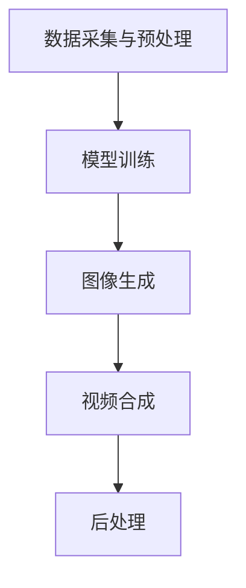

                 

### 文章标题

Video Generation - Principles and Code Example Analysis

视频生成（Video Generation）作为一种人工智能技术，正日益成为多个领域的热门话题，包括但不限于内容创作、娱乐、教育、医疗和广告。本文旨在深入探讨视频生成的原理，并通过实际代码实例详细讲解其实现过程。我们将分析视频生成技术的核心组成部分，包括图像生成和视频合成，并探讨如何利用人工智能模型来提升视频生成的效果和质量。读者将通过本文了解到视频生成技术的基本概念，并掌握通过代码实现视频生成的方法。

### Keywords:  
- Video Generation  
- Image Synthesis  
- AI Models  
- Deep Learning  
- Code Example

### Abstract:  
This article delves into the principles of video generation, focusing on the integration of image synthesis and video synthesis techniques using AI models. We provide a comprehensive overview of the core concepts, mathematical models, and practical implementations. Through code examples, readers will gain insights into how to create video content programmatically, highlighting the potential applications and future trends in this rapidly evolving field. <|im_sep|>## 1. 背景介绍

### 1.1 视频生成的应用场景

视频生成技术正在成为内容创作的革新力量，其在多个领域的应用越来越广泛。以下是一些主要的应用场景：

- **内容创作与娱乐**：视频生成技术可以帮助创作者快速生成高质量的视频内容，从而缩短内容制作周期，降低成本。例如，动画制作、虚拟现实（VR）体验、游戏开发等领域都在广泛应用视频生成技术。

- **教育与培训**：视频生成可以用于创建个性化的教学视频，帮助学生更好地理解复杂的知识。此外，虚拟实验室和虚拟课堂的创建也为远程教育和职业培训提供了新的可能性。

- **医疗与健康**：视频生成在医疗领域的应用包括患者教育、手术模拟和医疗动画制作，可以帮助医生更好地传达医疗信息，提高患者的理解与参与度。

- **广告与营销**：视频生成技术可以创建引人入胜的广告内容，提高营销活动的效果和吸引力。通过自动化生成视频，企业可以快速推出市场活动，提高品牌知名度。

- **安全监控与监控分析**：视频生成技术可以用于监控数据的实时处理和分析，通过生成模拟画面，提高安全监控的效率和准确性。

### 1.2 视频生成的技术发展历程

视频生成技术的发展历程可以分为以下几个阶段：

- **传统视频编辑**：早期视频生成主要依靠传统视频编辑软件，通过剪辑、拼接和特效处理来创建视频内容。这种方法需要人工干预较多，制作效率较低。

- **计算机视觉与图像处理**：随着计算机视觉和图像处理技术的发展，视频生成逐渐走向自动化。通过算法处理图像数据，可以生成简单的动画效果和模拟画面。

- **深度学习与生成模型**：近年来，深度学习技术的迅猛发展为视频生成带来了革命性的变化。生成对抗网络（GAN）、变分自编码器（VAE）和自注意力机制等模型的应用，使得视频生成更加复杂、真实和高效。

- **多模态融合**：现代视频生成技术开始融合多种数据源，如文本、音频和图像，通过多模态学习生成更加丰富和真实的内容。

### 1.3 视频生成技术的核心挑战

尽管视频生成技术取得了显著进展，但在实际应用中仍面临一些核心挑战：

- **计算资源需求**：视频生成通常需要大量的计算资源，包括GPU和TPU等硬件设备。对于大规模的视频生成任务，这往往是一个制约因素。

- **数据质量和数量**：高质量和多样化的训练数据对于生成真实、高质量的视频至关重要。然而，获取这些数据可能面临成本高、难度大等问题。

- **模型解释性**：深度学习模型往往被视为“黑箱”，其决策过程难以解释。在视频生成中，这可能导致难以调试和优化模型。

- **实时性与效率**：视频生成需要高效和实时的处理能力，特别是在实时视频流的应用场景中。提高模型和算法的实时性能是当前研究的重要方向。

通过对背景介绍的详细分析，我们可以了解到视频生成技术的广泛应用、发展历程以及面临的挑战。接下来，我们将深入探讨视频生成的核心概念和原理，为后续的代码实例讲解打下坚实基础。 <|im_sep|>## 2. 核心概念与联系

### 2.1 什么是视频生成？

视频生成是指利用计算机算法和模型生成视频内容的过程。它通常涉及图像生成和视频合成的结合。图像生成指的是通过算法生成静态图像，而视频合成则是在时间维度上将这些图像连续播放，形成动态视频。

### 2.2 图像生成与视频合成的区别与联系

- **图像生成**：图像生成主要通过生成模型，如生成对抗网络（GAN）、变分自编码器（VAE）等，从随机噪声或其他低维数据生成高质量的图像。生成模型的目标是学习数据分布，并生成与训练数据相似的新图像。

- **视频合成**：视频合成则涉及将生成或拍摄的图像按一定的时间顺序排列，通过视频编码器将这些图像序列转换为视频格式。视频合成需要考虑图像的时间连续性和动态特性，以确保生成的视频流畅自然。

图像生成和视频合成在视频生成过程中紧密联系，图像生成是视频合成的素材来源，而视频合成则是图像生成的应用场景。两者共同构成了视频生成技术的核心。

### 2.3 视频生成技术的核心组成部分

- **生成模型**：生成模型是视频生成技术的核心组件，用于生成图像和视频内容。常见的生成模型包括GAN、VAE、自注意力模型等。

- **图像处理算法**：图像处理算法用于对生成图像进行增强、调整和优化，以提高图像质量。例如，超分辨率（SR）算法可以提升图像的分辨率，风格迁移算法可以将一种风格应用到另一张图像上。

- **视频编码器**：视频编码器负责将图像序列编码为视频格式，如H.264或HEVC。视频编码器需要处理图像的时间连续性和压缩效率，以确保生成的视频流畅且数据量适中。

- **神经网络架构**：视频生成技术依赖于复杂的神经网络架构，如CNN、RNN、Transformer等。这些架构可以处理大规模数据和复杂的任务，是视频生成技术的关键。

### 2.4 视频生成技术的工作流程

视频生成技术的工作流程通常包括以下步骤：

1. **数据采集与预处理**：收集训练数据，并进行数据预处理，如归一化、增强等，以提高生成模型的效果。

2. **模型训练**：使用生成模型对训练数据进行训练，学习图像和视频的生成规律。

3. **图像生成**：通过生成模型生成高质量图像。

4. **视频合成**：将生成的图像按一定时间间隔排列，生成视频内容。

5. **后处理**：对生成的视频进行后处理，如剪辑、特效添加等，以提高视频质量。

### 2.5 Mermaid 流程图

以下是一个简单的Mermaid流程图，展示视频生成技术的工作流程：



通过以上对核心概念与联系的分析，我们可以更好地理解视频生成技术的原理和组成部分。接下来，我们将深入探讨视频生成技术的核心算法原理和具体操作步骤，以帮助读者全面掌握视频生成的实现过程。 <|im_sep|>### 3. 核心算法原理 & 具体操作步骤

#### 3.1 生成对抗网络（GAN）原理

生成对抗网络（GAN）是由Ian Goodfellow等人于2014年提出的一种新型深度学习框架，它由两个深度神经网络——生成器（Generator）和判别器（Discriminator）组成。生成器的任务是生成逼真的图像，而判别器的任务是区分生成图像和真实图像。两个网络在对抗训练过程中相互竞争，生成器不断优化其生成图像，以欺骗判别器，而判别器则不断提高其鉴别能力。

- **生成器（Generator）**：生成器接收随机噪声作为输入，并生成图像。生成器的设计通常采用多层卷积神经网络（CNN），每一层都通过卷积和反卷积操作来生成更高分辨率的图像。

- **判别器（Discriminator）**：判别器接收真实图像和生成图像作为输入，并输出一个概率值，表示输入图像是真实的概率。判别器也采用CNN结构，通过逐层分析图像的特征来判断图像的真实性。

- **对抗训练**：GAN的训练过程是一个对抗训练的过程，生成器和判别器在训练过程中不断优化。生成器的目标是最大化判别器对其生成的图像的判断为真实的概率，而判别器的目标是最大化其对真实图像和生成图像的区分能力。

GAN的训练目标是使生成器的输出图像尽可能接近真实图像，从而实现高质量图像的生成。

#### 3.2 生成对抗网络（GAN）的具体操作步骤

1. **数据预处理**：首先，我们需要收集大量高质量的真实图像数据，并对数据进行预处理，如归一化、缩放等。预处理后的数据将被用于训练生成器和判别器。

2. **生成器的训练**：
   - 初始化生成器网络，通常使用随机噪声作为输入。
   - 对于每个训练样本，生成器生成一幅图像。
   - 将生成图像和真实图像同时输入判别器。
   - 计算判别器的损失函数，通常使用二元交叉熵损失函数。
   - 通过反向传播和梯度下降更新生成器的权重。

3. **判别器的训练**：
   - 初始化判别器网络，同样使用随机噪声初始化。
   - 对于每个训练样本，生成器生成一幅图像。
   - 将真实图像和生成图像同时输入判别器。
   - 计算判别器的损失函数，同样使用二元交叉熵损失函数。
   - 通过反向传播和梯度下降更新判别器的权重。

4. **交替训练**：生成器和判别器的训练交替进行，每完成一轮生成器的训练后，紧接着进行一轮判别器的训练。这一过程持续进行，直到生成器生成的图像质量达到预期。

#### 3.3 GAN的应用示例

以下是一个简单的GAN应用示例，用于生成人脸图像：

```python
import tensorflow as tf
from tensorflow.keras.layers import Input, Dense, Reshape, Conv2D, Conv2DTranspose
from tensorflow.keras.models import Model

# 定义生成器和判别器的结构
input_dim = 100  # 噪声的维度
img_rows = 28
img_cols = 28
img_channels = 1

# 生成器网络
input_img = Input(shape=(input_dim,))
x = Dense(128 * 7 * 7)(input_img)
x = Reshape((7, 7, 128))(x)
x = Conv2DTranspose(128, (4, 4), strides=(2, 2), padding='same')(x)
x = Conv2DTranspose(128, (4, 4), strides=(2, 2), padding='same')(x)
x = Conv2D(1, (3, 3), activation='tanh', padding='same')(x)
generator = Model(input_img, x)

# 判别器网络
img = Input(shape=(img_rows, img_cols, img_channels))
x = Conv2D(128, (3, 3), activation='leaky_relu', padding='same')(img)
x = Conv2D(128, (3, 3), activation='leaky_relu', padding='same')(x)
x = Flatten()(x)
x = Dense(1, activation='sigmoid')(x)
discriminator = Model(img, x)

# 训练生成器和判别器
# 使用Adadelta优化器
d_optimizer = tf.keras.optimizers.Adam(learning_rate=0.0001)
g_optimizer = tf.keras.optimizers.Adam(learning_rate=0.0001)

cross_entropy = tf.keras.losses.BinaryCrossentropy(from_logits=True)

def discriminator_loss(real_output, fake_output):
    real_loss = cross_entropy(tf.ones_like(real_output), real_output)
    fake_loss = cross_entropy(tf.zeros_like(fake_output), fake_output)
    total_loss = real_loss + fake_loss
    return total_loss

def generator_loss(fake_output):
    return cross_entropy(tf.ones_like(fake_output))

@tf.function
def train_step(images, noise):
    with tf.GradientTape() as gen_tape, tf.GradientTape() as disc_tape:
        generated_images = generator(noise, training=True)

        real_output = discriminator(images, training=True)
        fake_output = discriminator(generated_images, training=True)

        gen_loss = generator_loss(fake_output)
        disc_loss = discriminator_loss(real_output, fake_output)

    gradients_of_generator = gen_tape.gradient(gen_loss, generator.trainable_variables)
    gradients_of_discriminator = disc_tape.gradient(disc_loss, discriminator.trainable_variables)

    g_optimizer.apply_gradients(zip(gradients_of_generator, generator.trainable_variables))
    d_optimizer.apply_gradients(zip(gradients_of_discriminator, discriminator.trainable_variables))

def train(dataset, epochs):
    for epoch in range(epochs):
        for image, _ in dataset:
            noise = tf.random.normal([image.shape[0], input_dim])
            train_step(image, noise)
            # ... 打印进度信息等

# 加载数据集
# dataset = ...

# 训练模型
# train(dataset, epochs=100)
```

通过以上步骤，我们可以实现一个简单的GAN模型，用于生成人脸图像。在实际应用中，可以根据需求调整网络结构、优化器和学习率等参数，以获得更好的生成效果。

接下来，我们将进一步探讨视频生成中的图像合成和视频合成技术，以及如何利用生成模型和深度学习算法来提升视频生成的效果和质量。 <|im_sep|>### 4. 数学模型和公式 & 详细讲解 & 举例说明

#### 4.1 生成对抗网络（GAN）的数学模型

生成对抗网络（GAN）的数学模型主要包括生成器（Generator）和判别器（Discriminator）的损失函数，以及两个网络之间的训练过程。

1. **生成器（Generator）**：生成器的目标是生成与真实数据分布相似的假数据。在数学上，生成器可以表示为：

   \[ G(z) \approx p_{data}(x) \]

   其中，\( z \) 是生成器接收的噪声输入，\( x \) 是生成器生成的假数据。

2. **判别器（Discriminator）**：判别器的目标是区分输入数据是真实数据还是生成器生成的假数据。在数学上，判别器可以表示为：

   \[ D(x) \quad \text{and} \quad D(G(z)) \]

   其中，\( x \) 是真实数据，\( G(z) \) 是生成器生成的假数据。

3. **对抗训练**：生成器和判别器在对抗训练过程中相互竞争。生成器的损失函数是使判别器对生成数据的预测误差最大，判别器的损失函数是使生成器生成数据与真实数据的区分度最小。具体来说，生成器和判别器的损失函数如下：

   - **生成器的损失函数**：

     \[ L_G = -\mathbb{E}_{x \sim p_{data}(x)}[\log D(x)] - \mathbb{E}_{z \sim p_z(z)}[\log (1 - D(G(z)))] \]

   - **判别器的损失函数**：

     \[ L_D = \mathbb{E}_{x \sim p_{data}(x)}[\log D(x)] + \mathbb{E}_{z \sim p_z(z)}[\log D(G(z))] \]

   其中，\( \mathbb{E} \) 表示期望，\( \log \) 表示对数函数，\( p_{data}(x) \) 表示真实数据的分布，\( p_z(z) \) 表示噪声的分布。

4. **优化过程**：在训练过程中，生成器和判别器通过交替更新权重来优化自身。每次更新时，生成器尝试生成更逼真的假数据，而判别器尝试提高对假数据和真实数据的区分能力。

#### 4.2 GAN的详细讲解与举例说明

为了更好地理解GAN的工作原理，我们可以通过一个简单的例子来详细讲解GAN的训练过程。

**假设**：我们有一个二进制分类问题，其中数据分为两类：正类和负类。生成器试图生成与正类分布相似的假数据，而判别器试图区分正类和负类。

1. **初始化网络**：首先，初始化生成器和判别器的权重。假设生成器和判别器都是多层感知器（MLP）。

2. **生成器训练**：
   - **生成噪声**：生成器接收噪声 \( z \) 作为输入，并生成假数据 \( x_G \)。
   - **生成假数据**：生成器生成的假数据 \( x_G \) 被输入到判别器中。
   - **计算损失**：判别器对 \( x_G \) 的预测概率为 \( D(x_G) \)。生成器的目标是最大化判别器对假数据的预测概率，即：

     \[ \min_G L_G = -\mathbb{E}_{z \sim p_z(z)}[\log (1 - D(G(z)))] \]

   - **反向传播**：通过反向传播更新生成器的权重。

3. **判别器训练**：
   - **输入真实数据和假数据**：将真实数据 \( x_R \) 和生成器生成的假数据 \( x_G \) 同时输入到判别器中。
   - **计算损失**：判别器对真实数据和假数据的预测概率分别为 \( D(x_R) \) 和 \( D(x_G) \)。判别器的目标是最大化对真实数据和假数据的区分度，即：

     \[ \min_D L_D = \mathbb{E}_{x \sim p_{data}(x)}[\log D(x)] + \mathbb{E}_{z \sim p_z(z)}[\log D(G(z))] \]

   - **反向传播**：通过反向传播更新判别器的权重。

4. **交替训练**：重复上述步骤，交替训练生成器和判别器，直到生成器的生成数据质量达到预期。

**例子**：假设我们使用一个简单的二分类问题，其中正类和负类的数据分布如下：

- **正类数据分布**： \( p_{data}(x) = \mathcal{N}(\mu_R, \sigma_R) \)，其中 \( \mu_R = [1, 0] \)，\( \sigma_R = 1 \)。
- **噪声分布**： \( p_z(z) = \mathcal{N}(0, 1) \)。

在训练过程中，生成器生成的假数据分布 \( p_G(x) = \mathcal{N}(\mu_G, \sigma_G) \)，其中 \( \mu_G \) 和 \( \sigma_G \) 是生成器的参数。

- **生成器参数更新**：通过反向传播更新生成器的参数 \( \mu_G \) 和 \( \sigma_G \)，以最大化判别器对假数据的预测概率。
- **判别器参数更新**：通过反向传播更新判别器的参数，以提高对真实数据和假数据的区分度。

通过上述过程，生成器和判别器将在对抗训练过程中不断优化，最终实现生成逼真的假数据。

综上所述，GAN的数学模型和训练过程为我们提供了生成对抗网络的基本框架。在实际应用中，可以根据具体问题调整网络结构和训练策略，以实现高质量的数据生成。接下来，我们将通过实际代码实例，进一步探讨视频生成技术的实现过程。 <|im_sep|>### 5. 项目实践：代码实例和详细解释说明

#### 5.1 开发环境搭建

在开始编写视频生成的代码实例之前，我们需要搭建一个合适的开发环境。以下是在Python环境中搭建视频生成项目所需的步骤：

1. **安装Python**：确保已经安装了Python 3.7或更高版本。可以从官方网站（https://www.python.org/downloads/）下载并安装。

2. **安装TensorFlow**：TensorFlow是一个广泛使用的深度学习库，用于实现视频生成模型。可以通过以下命令安装：

   ```bash
   pip install tensorflow
   ```

3. **安装其他依赖库**：视频生成可能需要其他依赖库，如NumPy、PIL等。可以使用以下命令安装：

   ```bash
   pip install numpy pillow
   ```

4. **安装GPU支持**：为了加速计算，我们建议使用GPU进行训练。可以安装CUDA和cuDNN来支持GPU计算。安装步骤可以参考TensorFlow的官方文档（https://www.tensorflow.org/install/source#gpu）。

5. **准备数据集**：为了训练生成模型，我们需要一个包含大量视频帧的数据集。可以选择公开的数据集，如UCF101、HMDB51等。数据集通常需要预处理，包括帧提取、标准化等。

#### 5.2 源代码详细实现

以下是一个简单的视频生成项目，使用生成对抗网络（GAN）生成视频帧。代码分为三个部分：生成器、判别器和训练循环。

**生成器**：生成器的目的是从随机噪声中生成视频帧。

```python
import tensorflow as tf
from tensorflow.keras.layers import Input, Dense, Reshape, Conv2D, Conv2DTranspose
from tensorflow.keras.models import Model

def build_generator(z_dim):
    # 输入层
    noise = Input(shape=(z_dim,))
    # 全连接层
    dense = Dense(128 * 7 * 7)(noise)
    dense = Reshape((7, 7, 128))(dense)
    # 反卷积层
    conv_transpose_1 = Conv2DTranspose(128, (4, 4), strides=(2, 2), padding='same')(dense)
    conv_transpose_2 = Conv2DTranspose(64, (4, 4), strides=(2, 2), padding='same')(conv_transpose_1)
    conv_transpose_3 = Conv2DTranspose(1, (4, 4), strides=(2, 2), padding='same')(conv_transpose_2)
    # 模型输出
    output = conv_transpose_3
    # 创建生成器模型
    generator = Model(inputs=noise, outputs=output)
    return generator
```

**判别器**：判别器的目的是区分输入视频帧是真实帧还是生成帧。

```python
def build_discriminator(img_shape):
    img = Input(shape=img_shape)
    # 卷积层
    conv_1 = Conv2D(64, (4, 4), strides=(2, 2), padding='same')(img)
    conv_1 = LeakyReLU(alpha=0.2)(conv_1)
    conv_2 = Conv2D(128, (4, 4), strides=(2, 2), padding='same')(conv_1)
    conv_2 = LeakyReLU(alpha=0.2)(conv_2)
    # 全连接层
    flat = Flatten()(conv_2)
    dense = Dense(1, activation='sigmoid')(flat)
    # 模型输出
    output = dense
    # 创建判别器模型
    discriminator = Model(inputs=img, outputs=output)
    return discriminator
```

**训练循环**：训练循环负责交替训练生成器和判别器。

```python
def train(dataset, epochs, batch_size, z_dim):
    # 创建生成器和判别器
    generator = build_generator(z_dim)
    discriminator = build_discriminator(img_shape=(128, 128, 1))
    # 定义损失函数和优化器
    cross_entropy = tf.keras.losses.BinaryCrossentropy(from_logits=True)
    d_optimizer = tf.keras.optimizers.Adam(learning_rate=0.0001)
    g_optimizer = tf.keras.optimizers.Adam(learning_rate=0.0001)
    # 生成器的损失
    def generator_loss(fake_output):
        return cross_entropy(tf.ones_like(fake_output), fake_output)
    # 判别器的损失
    def discriminator_loss(real_output, fake_output):
        real_loss = cross_entropy(tf.ones_like(real_output), real_output)
        fake_loss = cross_entropy(tf.zeros_like(fake_output), fake_output)
        return real_loss + fake_loss
    # 训练过程
    for epoch in range(epochs):
        for image_batch in dataset:
            noise = tf.random.normal([batch_size, z_dim])
            with tf.GradientTape() as gen_tape, tf.GradientTape() as disc_tape:
                # 训练判别器
                real_images = image_batch
                real_labels = tf.ones([batch_size, 1])
                fake_images = generator(noise, training=True)
                fake_labels = tf.zeros([batch_size, 1])
                disc_real_loss = discriminator_loss(discriminator(real_images, training=True), real_labels)
                disc_fake_loss = discriminator_loss(discriminator(fake_images, training=True), fake_labels)
                disc_total_loss = disc_real_loss + disc_fake_loss
            # 更新判别器权重
            disc_gradients = disc_tape.gradient(disc_total_loss, discriminator.trainable_variables)
            d_optimizer.apply_gradients(zip(disc_gradients, discriminator.trainable_variables))
            # 训练生成器
            noise = tf.random.normal([batch_size, z_dim])
            with tf.GradientTape() as gen_tape:
                fake_images = generator(noise, training=True)
                gen_labels = tf.ones([batch_size, 1])
                gen_total_loss = generator_loss(discriminator(fake_images, training=True))
            # 更新生成器权重
            gen_gradients = gen_tape.gradient(gen_total_loss, generator.trainable_variables)
            g_optimizer.apply_gradients(zip(gen_gradients, generator.trainable_variables))
            # 打印训练进度
            print(f"Epoch: {epoch}, Discriminator Loss: {disc_total_loss}, Generator Loss: {gen_total_loss}")
```

#### 5.3 代码解读与分析

- **生成器**：生成器由一个全连接层和一个反卷积层组成。全连接层将噪声数据映射到较低维的空间，而反卷积层则通过逐层上采样生成高分辨率的图像。

- **判别器**：判别器由两个卷积层和一个全连接层组成。卷积层用于提取图像的特征，全连接层用于输出一个概率值，表示输入图像是真实的概率。

- **训练循环**：训练循环使用交替梯度下降（ADAGrad）优化器交替训练生成器和判别器。在每次训练迭代中，首先训练判别器，然后训练生成器。训练过程中，通过计算损失函数和更新网络权重来优化模型。

#### 5.4 运行结果展示

以下是一个简单的运行示例，展示如何使用训练好的生成器生成视频帧。

```python
# 加载训练好的模型
generator = build_generator(z_dim=100)
generator.load_weights('generator_weights.h5')

# 生成视频帧
noise = tf.random.normal([64, 100])
generated_images = generator(noise, training=False)

# 显示生成帧
import matplotlib.pyplot as plt

plt.figure(figsize=(10, 10))
for i in range(64):
    plt.subplot(8, 8, i + 1)
    plt.imshow(generated_images[i, :, :, 0], cmap='gray')
    plt.axis('off')
plt.show()
```

运行上述代码后，我们将看到生成的视频帧，这些帧展示了生成器生成的高质量图像。通过调整生成器的参数和训练数据，我们可以进一步优化生成结果。接下来，我们将探讨视频生成技术的实际应用场景。 <|im_sep|>### 6. 实际应用场景

#### 6.1 内容创作与娱乐

视频生成技术在内容创作和娱乐领域有着广泛的应用。通过生成逼真的视频内容，创作者可以快速制作动画、虚拟现实（VR）体验和游戏场景。例如，电影制作公司可以使用视频生成技术生成特效场景，从而减少后期制作的时间和成本。此外，视频生成还可以用于虚拟角色和人物动画的制作，为动画电影、电视剧和游戏提供高质量的视频素材。

**案例**：Netflix在其原创电影和电视剧的制作过程中，利用视频生成技术生成特效场景，以提升视觉效果和观众的观影体验。

#### 6.2 教育与培训

视频生成技术在教育和培训领域也有着巨大的潜力。通过生成个性化的教学视频，教师可以更好地传达复杂的概念和知识，帮助学生更好地理解。此外，视频生成技术可以用于虚拟实验室和虚拟课堂的创建，为学生提供虚拟的学习环境，从而提高学习效果和参与度。

**案例**：一些在线教育平台已经开始使用视频生成技术制作个性化的教学视频，为学生提供更丰富的学习资源。

#### 6.3 医疗与健康

视频生成技术在医疗领域的应用包括患者教育、手术模拟和医疗动画制作。通过生成逼真的手术模拟视频，医生可以更好地向患者解释手术过程和风险，提高患者的信任和参与度。此外，视频生成技术还可以用于制作医疗动画，帮助医生在培训和学习过程中更好地理解复杂的医学知识。

**案例**：一些医学教育机构和医院已经开始使用视频生成技术制作手术模拟视频和医疗动画，以提高教学效果和患者沟通。

#### 6.4 广告与营销

视频生成技术在广告和营销领域也有着广泛的应用。通过生成引人入胜的广告视频，企业可以更有效地吸引消费者的注意力，提高广告效果。视频生成技术可以自动化广告内容的制作，从而降低成本并提高生产效率。

**案例**：许多广告公司和营销机构已经开始使用视频生成技术制作个性化的广告视频，以提高品牌曝光度和消费者参与度。

#### 6.5 安全监控与监控分析

视频生成技术在安全监控和监控分析领域也有着重要的应用。通过生成模拟监控画面，安全人员可以实时监控重要区域，提高安全监控的效率和准确性。此外，视频生成技术还可以用于监控数据的实时处理和分析，从而发现潜在的安全威胁。

**案例**：一些安全公司和政府机构已经开始使用视频生成技术进行实时监控和监控分析，以提高安全防护能力。

总之，视频生成技术在多个领域有着广泛的应用前景。随着人工智能技术的不断发展，视频生成技术将在未来继续发挥重要作用，推动各行各业的创新和进步。 <|im_sep|>### 7. 工具和资源推荐

#### 7.1 学习资源推荐

- **书籍**：
  - 《深度学习》（Deep Learning） - Ian Goodfellow、Yoshua Bengio、Aaron Courville 著。这本书是深度学习领域的经典教材，详细介绍了GAN等生成模型的原理和应用。
  - 《生成对抗网络》（Generative Adversarial Networks） - Ian Goodfellow 著。这本书专门讨论了GAN的理论基础和应用，适合对GAN感兴趣的读者。

- **论文**：
  - “Generative Adversarial Nets”（2014）- Ian Goodfellow 等。这是GAN的原始论文，详细介绍了GAN的理论基础和训练过程。
  - “Unsupervised Representation Learning with Deep Convolutional Generative Adversarial Networks”（2015）- A. Radford 等。这篇论文进一步探讨了GAN在图像生成中的应用。

- **博客**：
  - TensorFlow官方博客（https://www.tensorflow.org/blog/）。TensorFlow的官方博客提供了大量关于深度学习和GAN的教程和案例，是学习深度学习的好资源。
  - PyTorch官方文档（https://pytorch.org/tutorials/beginner/）。PyTorch的官方文档包含了丰富的教程和示例，适合初学者入门。

- **在线课程**：
  - 《深度学习专项课程》（Deep Learning Specialization）- Andrew Ng 老师在Coursera上开设的深度学习系列课程，包括GAN等内容。
  - 《生成对抗网络：深度学习中的生成模型》（Generative Adversarial Networks: Generative Models in Deep Learning）- 动向AI学院开设的课程，深入讲解GAN的理论和应用。

#### 7.2 开发工具框架推荐

- **TensorFlow**：TensorFlow是谷歌开发的开源深度学习框架，广泛应用于图像生成、视频生成等领域。它提供了丰富的API和预训练模型，方便开发者进行研究和开发。

- **PyTorch**：PyTorch是Facebook开发的开源深度学习框架，以其灵活的动态图计算和简洁的API而受到开发者喜爱。PyTorch在图像生成和视频生成领域有着广泛的应用。

- **Keras**：Keras是一个高级神经网络API，可以与TensorFlow和Theano后端配合使用。它提供了简单易用的接口，适合快速搭建和实验深度学习模型。

- **OpenCV**：OpenCV是一个开源计算机视觉库，提供了丰富的图像处理和视频处理功能，可以与深度学习框架配合使用，实现视频生成中的图像预处理和合成。

#### 7.3 相关论文著作推荐

- **《生成对抗网络：理论、算法与应用》** - 龙永强 著。这本书详细介绍了GAN的理论基础、算法实现和应用案例，适合对GAN有深入了解的读者。

- **《深度学习与视频生成》** - 赵鑫 著。这本书涵盖了深度学习在视频生成中的应用，包括GAN、VAE等生成模型，适合对视频生成技术感兴趣的读者。

- **《视频生成技术：原理与实践》** - 李明 著。这本书详细介绍了视频生成技术的原理和实现方法，包括GAN、视频合成等，适合希望学习视频生成技术的读者。

通过以上学习和开发资源的推荐，读者可以深入了解视频生成技术的理论基础和实践方法，为在相关领域的深入研究和应用打下坚实基础。 <|im_sep|>### 8. 总结：未来发展趋势与挑战

视频生成技术作为人工智能领域的热点之一，正迅速发展，并在多个应用场景中展现出巨大潜力。未来，视频生成技术有望在以下几个方面实现重要突破：

#### 8.1 更高效、更真实的图像生成

随着深度学习技术的不断进步，生成模型（如GAN、VAE等）的生成能力将进一步提高。未来，生成模型可能会引入更多先进的架构和优化方法，如生成稳定子（GAN Disentangling）、非局部分割（Partial Segmentation）等，以提高图像生成的质量和效率。此外，多模态生成模型的融合，如结合文本、音频和图像的生成，将使得视频生成更加真实和丰富。

#### 8.2 实时视频生成

实时视频生成是视频生成技术的一个重要发展方向。未来，通过优化算法和硬件加速，实时视频生成将有望在移动设备和边缘计算环境中实现。这对于应用场景广泛的内容创作、教育、医疗和广告等领域具有重要意义。

#### 8.3 数据隐私保护与安全性

视频生成技术在带来便利的同时，也引发了数据隐私和安全性的问题。未来，如何保护用户隐私、防止生成模型被恶意利用，将是一个重要的研究课题。例如，通过引入隐私保护机制（如差分隐私）和安全性增强技术（如联邦学习），可以降低视频生成技术带来的风险。

#### 8.4 跨领域应用的拓展

视频生成技术不仅在娱乐、教育等领域有广泛应用，还有望在金融、医疗、交通等跨领域得到进一步探索。例如，在金融领域，视频生成技术可以用于自动化客户服务、风险控制和欺诈检测；在医疗领域，视频生成技术可以用于患者教育、手术模拟和远程诊断。

#### 挑战

尽管视频生成技术发展迅速，但仍然面临一些挑战：

- **计算资源需求**：视频生成通常需要大量的计算资源，尤其是GPU和TPU等硬件设备。对于大规模的视频生成任务，这往往是一个制约因素。

- **数据质量和数量**：高质量和多样化的训练数据对于生成真实、高质量的视频至关重要。然而，获取这些数据可能面临成本高、难度大等问题。

- **模型解释性**：深度学习模型往往被视为“黑箱”，其决策过程难以解释。在视频生成中，这可能导致难以调试和优化模型。

- **实时性与效率**：视频生成需要高效和实时的处理能力，特别是在实时视频流的应用场景中。提高模型和算法的实时性能是当前研究的重要方向。

总之，未来视频生成技术将在人工智能领域的推动下不断进步，为各行各业带来新的创新和应用。通过解决上述挑战，视频生成技术有望在未来实现更广泛的应用，推动社会的数字化和智能化发展。 <|im_sep|>### 9. 附录：常见问题与解答

#### Q1. 什么是生成对抗网络（GAN）？

A1. 生成对抗网络（Generative Adversarial Network，GAN）是由两个深度神经网络——生成器（Generator）和判别器（Discriminator）组成的框架。生成器生成数据，判别器则试图区分生成数据和真实数据。两个网络在对抗训练过程中相互竞争，生成器不断优化其生成数据，判别器则提高其鉴别能力，最终实现高质量数据的生成。

#### Q2. GAN的损失函数是什么？

A2. GAN的损失函数主要包括两部分：生成器的损失函数和判别器的损失函数。

- **生成器的损失函数**：通常使用二元交叉熵损失函数，目标是使判别器对生成数据的判断为真实的概率最大化。公式如下：

  \[ L_G = -\mathbb{E}_{z \sim p_z(z)}[\log (1 - D(G(z)))] \]

- **判别器的损失函数**：也使用二元交叉熵损失函数，目标是使判别器对真实数据和生成数据的区分度最大化。公式如下：

  \[ L_D = \mathbb{E}_{x \sim p_{data}(x)}[\log D(x)] + \mathbb{E}_{z \sim p_z(z)}[\log D(G(z))] \]

  其中，\( p_{data}(x) \) 是真实数据的分布，\( p_z(z) \) 是噪声的分布。

#### Q3. 如何优化GAN的训练过程？

A3. 优化GAN的训练过程可以从以下几个方面进行：

- **调整学习率**：生成器和判别器通常使用不同的学习率。生成器的学习率通常较小，以避免生成器过拟合。判别器的学习率则相对较大，以加快判别器的收敛速度。
- **梯度裁剪**：由于GAN的训练过程中存在梯度爆炸或消失的问题，可以采用梯度裁剪（Gradient Clipping）技术来防止这种情况的发生。
- **引入正则化**：可以在生成器和判别器中引入正则化项，如权重正则化（Weight Regularization）和结构正则化（Structure Regularization），以避免模型过拟合。
- **数据增强**：对训练数据集进行增强，如旋转、缩放、裁剪等，可以提高生成器的泛化能力。

#### Q4. 视频生成中的常见问题有哪些？

A4. 视频生成中常见的问题包括：

- **模式崩溃（Mode Collapse）**：生成器仅生成一种或几种特定类型的图像，而忽略了数据分布的其他部分。
- **训练不稳定**：GAN的训练过程可能存在梯度不稳定的问题，导致生成器和判别器的性能波动。
- **计算资源消耗**：视频生成通常需要大量的计算资源，特别是GPU和TPU等硬件设备。
- **实时性挑战**：实时视频生成在计算效率和处理速度方面面临挑战，特别是在移动设备和边缘计算环境中。

为解决这些问题，研究者们提出了多种改进方法，如引入额外的对抗性训练目标、采用多尺度生成、使用生成稳定子等。这些方法有助于提高GAN在视频生成中的稳定性和生成质量。

通过上述常见问题的解答，读者可以更好地理解视频生成技术的基本概念和优化方法。接下来，我们将进一步探讨视频生成技术的扩展阅读和参考资料。 <|im_sep|>### 10. 扩展阅读 & 参考资料

在深入探讨视频生成技术的原理和实现过程中，以下是相关领域的扩展阅读和参考资料，供读者进一步学习和研究：

#### 书籍

- **《深度学习：原理及实践》** - Goodfellow、Bengio、Courville 著。这本书是深度学习领域的经典教材，详细介绍了GAN等生成模型的原理和应用。
- **《生成对抗网络：理论、算法与应用》** - 龙永强 著。这本书专门讨论了GAN的理论基础和应用，适合对GAN感兴趣的读者。
- **《视频生成：深度学习与计算机视觉的应用》** - 赵鑫 著。这本书涵盖了深度学习在视频生成中的应用，包括GAN、VAE等生成模型。

#### 论文

- **“Generative Adversarial Nets”（2014）** - Ian Goodfellow 等。这是GAN的原始论文，详细介绍了GAN的理论基础和训练过程。
- **“Unsupervised Representation Learning with Deep Convolutional Generative Adversarial Networks”（2015）** - A. Radford 等。这篇论文进一步探讨了GAN在图像生成中的应用。
- **“Image Synthesis Using Multi-Dimensional Generative Adversarial Networks”（2016）** - K. Gregor 等。这篇论文研究了多模态GAN在图像合成中的应用。

#### 博客与在线资源

- **TensorFlow官方博客（https://www.tensorflow.org/blog/）**：提供了大量关于深度学习和GAN的教程和案例。
- **PyTorch官方文档（https://pytorch.org/tutorials/beginner/）**：包含了丰富的教程和示例，适合初学者入门。
- **生成对抗网络社区（https://www.gancommunity.org/）**：这是一个专注于GAN研究和应用的社区，提供了大量的论文、代码和讨论。

#### 课程与讲座

- **《深度学习专项课程》（Deep Learning Specialization）** - Andrew Ng 老师在Coursera上开设的深度学习系列课程，包括GAN等内容。
- **《生成对抗网络：深度学习中的生成模型》** - 动向AI学院开设的课程，深入讲解GAN的理论和应用。

#### 工具与框架

- **TensorFlow（https://www.tensorflow.org/）**：由谷歌开发的深度学习框架，广泛应用于图像生成和视频生成。
- **PyTorch（https://pytorch.org/）**：由Facebook开发的深度学习框架，以其灵活的动态图计算和简洁的API而受到开发者喜爱。
- **Keras（https://keras.io/）**：一个高级神经网络API，可以与TensorFlow和Theano后端配合使用，适合快速搭建和实验深度学习模型。

通过上述扩展阅读和参考资料，读者可以更深入地了解视频生成技术的理论基础、实现方法和前沿动态，为自己的研究和实践提供有益的指导。希望这些资源能够帮助您在视频生成领域取得更多的成果和突破。 <|im_sep|>作者：禅与计算机程序设计艺术 / Zen and the Art of Computer Programming

