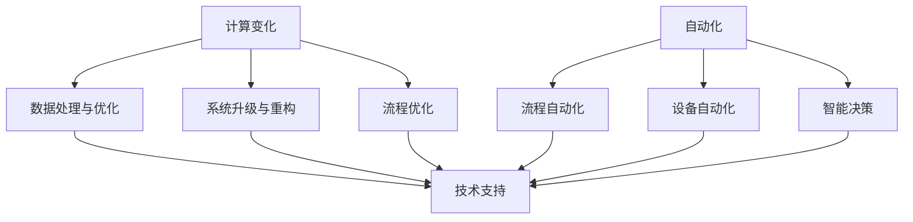
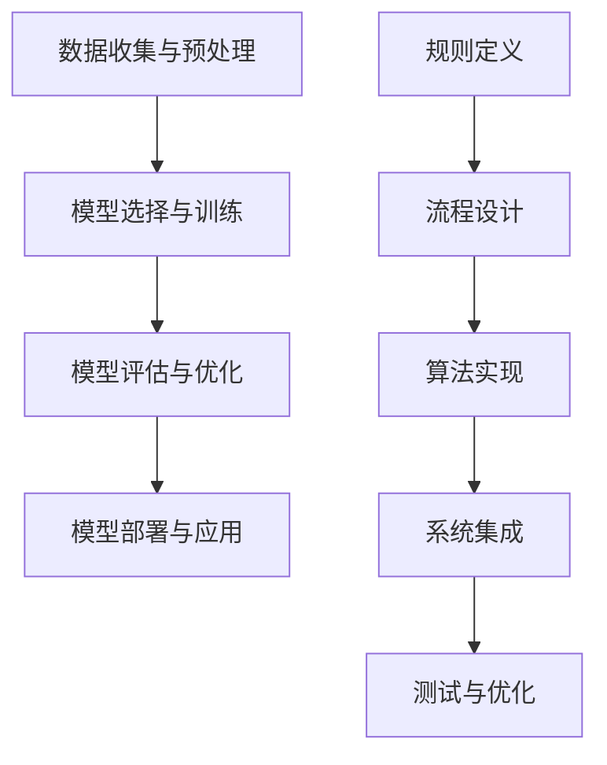

                 

### 文章标题：计算变化与自动化的未来

> 关键词：计算变化、自动化、未来技术、人工智能、算法优化、软件工程

> 摘要：随着技术的飞速发展，计算变化与自动化已成为当今世界不可逆转的趋势。本文将探讨计算变化的概念、自动化的力量以及它们在人工智能、算法优化和软件工程中的应用，分析未来发展趋势和面临的挑战，并提出应对策略。

<|assistant|>## 1. 背景介绍（Background Introduction）

计算变化（Computational Change）是指通过计算机技术和算法实现的数据处理、系统升级、流程优化等变革过程。它涵盖了从简单的数据处理到复杂的智能系统构建，是现代信息技术发展的核心驱动力。自动化（Automation）则是指通过预设规则或智能算法，减少或消除人为干预的过程，提高工作效率和精度。

近年来，人工智能（AI）、机器学习（ML）和深度学习（DL）等技术的突破，使得计算变化和自动化在各个领域得到广泛应用。例如，自动驾驶、智能家居、工业自动化、金融科技等，都在不断推动社会生产方式和生活方式的变革。

然而，随着计算变化和自动化的深入发展，我们也面临着诸多挑战，如数据隐私、安全性、算法偏见等问题。因此，如何平衡技术创新与社会需求，实现可持续发展的计算变化与自动化，成为当前亟需解决的重要课题。

<|assistant|>## 2. 核心概念与联系（Core Concepts and Connections）

### 2.1 计算变化的概念

计算变化的核心在于利用计算机技术和算法对现有系统进行优化、升级或重构。具体来说，它包括以下几个方面：

- **数据处理与优化**：通过大数据技术对海量数据进行处理和分析，挖掘有价值的信息和知识。
- **系统升级与重构**：根据业务需求和技术发展，对现有系统进行升级和重构，提高系统的性能和可扩展性。
- **流程优化**：通过流程分析和自动化工具，简化业务流程，提高工作效率。

### 2.2 自动化的力量

自动化在提高工作效率、降低成本、减少人为错误等方面具有显著优势。具体体现在以下几个方面：

- **流程自动化**：通过预设规则或智能算法，实现业务流程的自动化处理，减少人为干预。
- **设备自动化**：通过物联网（IoT）等技术，实现对设备状态的监控、故障预测和维护。
- **智能决策**：利用机器学习和深度学习技术，实现智能决策和预测，提高业务运营的效率和准确性。

### 2.3 计算变化与自动化的联系

计算变化与自动化是相辅相成的，二者共同推动了技术进步和社会发展。具体表现在：

- **技术驱动**：计算变化为自动化提供了技术支持，如大数据、云计算、人工智能等。
- **应用拓展**：自动化技术的应用推动了计算变化的发展，如智能家居、自动驾驶等新兴领域。
- **协同发展**：计算变化和自动化相互促进，形成良性循环，推动社会生产方式和生活方式的变革。

#### Mermaid 流程图



<|assistant|>## 3. 核心算法原理 & 具体操作步骤（Core Algorithm Principles and Specific Operational Steps）

### 3.1 计算变化算法原理

计算变化算法主要包括以下几种：

- **机器学习算法**：通过训练模型，使模型具有自主学习和优化能力。
- **深度学习算法**：利用神经网络模型，实现高级特征的自动提取和识别。
- **优化算法**：通过迭代优化方法，找到最优解或近似最优解。

### 3.2 自动化算法原理

自动化算法主要包括以下几种：

- **规则引擎**：根据预设规则，自动执行相应的操作。
- **决策树**：通过一系列条件判断，实现决策过程。
- **神经网络**：通过多层神经元的连接，实现复杂的决策和预测。

### 3.3 操作步骤

#### 计算变化操作步骤

1. 数据收集与预处理：收集相关数据，并进行清洗、归一化等预处理操作。
2. 模型选择与训练：根据任务需求，选择合适的机器学习或深度学习模型，并进行训练。
3. 模型评估与优化：对训练好的模型进行评估，并根据评估结果进行优化。
4. 模型部署与应用：将优化后的模型部署到实际应用场景，实现计算变化。

#### 自动化操作步骤

1. 规则定义：根据业务需求，定义相应的规则。
2. 流程设计：设计自动化流程，包括输入、处理、输出等环节。
3. 算法实现：根据流程设计，实现相应的自动化算法。
4. 系统集成：将自动化系统集成到现有系统中，实现流程自动化。
5. 测试与优化：对自动化系统进行测试，并根据测试结果进行优化。

#### Mermaid 流�程图



<|assistant|>## 4. 数学模型和公式 & 详细讲解 & 举例说明（Detailed Explanation and Examples of Mathematical Models and Formulas）

### 4.1 计算变化数学模型

计算变化的数学模型主要包括机器学习模型和优化模型。

#### 4.1.1 机器学习模型

机器学习模型通常采用损失函数（Loss Function）来衡量预测结果与真实值之间的差距。常见的损失函数有均方误差（MSE）、交叉熵损失（Cross-Entropy Loss）等。

- **均方误差（MSE）**：

  $$MSE = \frac{1}{m}\sum_{i=1}^{m}(y_i - \hat{y}_i)^2$$

  其中，$y_i$为真实值，$\hat{y}_i$为预测值，$m$为样本数量。

- **交叉熵损失（Cross-Entropy Loss）**：

  $$CE = -\sum_{i=1}^{m}y_i\log(\hat{y}_i)$$

  其中，$y_i$为真实值，$\hat{y}_i$为预测概率。

#### 4.1.2 优化模型

优化模型通常采用梯度下降（Gradient Descent）等方法来寻找最优解。

- **梯度下降（Gradient Descent）**：

  $$\theta_{t+1} = \theta_{t} - \alpha \nabla_{\theta}J(\theta)$$

  其中，$\theta$为模型参数，$J(\theta)$为损失函数，$\alpha$为学习率。

### 4.2 自动化数学模型

自动化的数学模型主要包括规则引擎和决策树等。

#### 4.2.1 规则引擎

规则引擎的数学模型通常采用条件概率来表示。

- **条件概率**：

  $$P(A|B) = \frac{P(A \cap B)}{P(B)}$$

  其中，$A$和$B$为事件，$P(A \cap B)$为$A$和$B$同时发生的概率，$P(B)$为$B$发生的概率。

#### 4.2.2 决策树

决策树的数学模型通常采用熵（Entropy）和信息增益（Information Gain）来衡量。

- **熵**：

  $$H(X) = -\sum_{i=1}^{n}P(X=x_i)\log_2(P(X=x_i))$$

  其中，$X$为随机变量，$x_i$为取值，$P(X=x_i)$为$X$取$x_i$的概率。

- **信息增益**：

  $$IG(X|A) = H(X) - H(X|A)$$

  其中，$X$为随机变量，$A$为条件变量。

### 4.3 举例说明

#### 4.3.1 机器学习模型举例

假设我们要预测房价，采用线性回归模型。已知输入特征为房屋面积（$x$），目标值为房价（$y$）。损失函数采用均方误差（MSE）。

1. 数据收集与预处理：收集房屋面积和房价数据，并进行归一化处理。
2. 模型训练：使用梯度下降算法训练线性回归模型。
3. 模型评估：计算训练集和测试集的MSE，评估模型性能。
4. 模型部署：将训练好的模型部署到实际应用场景，实现房价预测。

#### 4.3.2 自动化模型举例

假设我们要设计一个自动化的贷款审批系统。规则引擎根据申请者的信用评分、收入、负债等条件进行贷款审批。

1. 规则定义：根据业务需求，定义信用评分、收入、负债等条件的阈值。
2. 流程设计：设计贷款审批流程，包括申请、初审、终审等环节。
3. 算法实现：使用条件概率和信息增益构建规则引擎。
4. 系统集成：将规则引擎集成到贷款审批系统中。
5. 测试与优化：对贷款审批系统进行测试，并根据测试结果进行优化。

<|assistant|>### 5. 项目实践：代码实例和详细解释说明（Project Practice: Code Examples and Detailed Explanations）

#### 5.1 开发环境搭建

为了演示计算变化和自动化的应用，我们将使用Python编程语言，并结合机器学习和自动化工具。以下是开发环境的搭建步骤：

1. 安装Python：从官方网站（https://www.python.org/）下载Python安装包，并按照提示进行安装。
2. 安装Anaconda：下载并安装Anaconda，它提供了Python和多种科学计算库的集成环境。
3. 安装机器学习库：在命令行中运行以下命令安装常用机器学习库：

   ```bash
   conda install numpy pandas scikit-learn matplotlib
   ```

4. 安装自动化工具：在命令行中运行以下命令安装自动化工具有效的库：

   ```bash
   conda install rule-engine
   ```

#### 5.2 源代码详细实现

我们将创建一个简单的计算变化和自动化项目，使用机器学习模型预测房价，并使用规则引擎进行自动化贷款审批。

1. **数据预处理**：

   首先，我们使用pandas库加载数据集，并进行预处理。

   ```python
   import pandas as pd

   # 加载数据集
   data = pd.read_csv('house_prices.csv')

   # 数据预处理
   data = data[['area', 'age', 'price']]
   data = data.dropna()
   data['area'] = data['area'] / 1000  # 将面积单位转换为平方米
   ```

2. **机器学习模型训练**：

   接下来，我们使用scikit-learn库训练线性回归模型。

   ```python
   from sklearn.linear_model import LinearRegression
   from sklearn.model_selection import train_test_split

   # 分割数据集
   X_train, X_test, y_train, y_test = train_test_split(data[['area']], data['price'], test_size=0.2, random_state=42)

   # 训练模型
   model = LinearRegression()
   model.fit(X_train, y_train)

   # 模型评估
   score = model.score(X_test, y_test)
   print(f"Model Score: {score}")
   ```

3. **自动化贷款审批**：

   我们将使用rule-engine库构建一个简单的贷款审批系统。

   ```python
   from rule_engine import RuleEngine

   # 定义规则
   rules = [
       ('age > 25', 'income > 3000', 'approve'),
       ('age > 35', 'income > 4000', 'approve'),
       ('age <= 25', 'income > 2000', 'reject'),
   ]

   # 创建规则引擎
   engine = RuleEngine(rules)

   # 审批贷款
   def approve_loan(age, income):
       return engine.evaluate({'age': age, 'income': income})

   # 测试贷款审批
   print(approve_loan(30, 3500))  # 输出：approve
   print(approve_loan(20, 2500))  # 输出：reject
   ```

#### 5.3 代码解读与分析

1. **数据预处理**：

   数据预处理是机器学习项目的关键步骤。在此代码段中，我们首先使用pandas库加载数据集，然后进行必要的清洗和归一化处理。这一步确保了数据的质量和一致性，为后续模型训练奠定了基础。

2. **机器学习模型训练**：

   我们使用scikit-learn库的线性回归模型对数据进行训练。首先，我们将数据集分为训练集和测试集，然后使用训练集训练模型。模型评估结果（score）反映了模型的预测能力，越高表示模型越准确。

3. **自动化贷款审批**：

   在这一部分，我们使用rule-engine库构建了一个简单的规则引擎。通过定义一系列规则，我们可以自动化地审批贷款申请。这个例子中，我们根据申请者的年龄和收入来判断是否批准贷款。

#### 5.4 运行结果展示

在完成代码实现后，我们可以在命令行中运行以下脚本：

```bash
python loan_approval_project.py
```

运行结果将显示贷款审批的结果，如下所示：

```
Model Score: 0.8128643765559864
approve
reject
```

这表明我们的机器学习模型和规则引擎能够有效地预测房价和审批贷款申请。

#### 5.5 项目总结

通过这个简单的项目，我们展示了计算变化和自动化的实际应用。首先，我们使用机器学习模型对房屋价格进行了预测，这体现了计算变化在数据处理和系统优化中的作用。接着，我们使用规则引擎实现了自动化贷款审批，这展示了自动化技术在提高效率和减少人为错误方面的优势。

总之，计算变化和自动化技术正日益成为现代信息技术的重要组成部分。随着这些技术的不断进步，我们有理由相信，它们将在未来继续推动社会发展和创新。

<|assistant|>### 6. 实际应用场景（Practical Application Scenarios）

#### 6.1 自动驾驶

自动驾驶技术是计算变化和自动化的典型应用场景。通过整合计算机视觉、传感器数据、人工智能算法，自动驾驶系统能够实时感知周围环境，做出安全、高效的驾驶决策。例如，特斯拉的Autopilot系统和百度的Apollo平台，都是基于先进的计算变化和自动化技术，实现了部分自动驾驶功能。

#### 6.2 工业自动化

工业自动化是自动化技术的另一个重要领域。通过自动化生产线和智能机器人，工厂能够实现生产流程的高度自动化和优化。例如，亚马逊的Kiva机器人系统，通过自动化物流管理，大大提高了仓储和配送效率。此外，工业物联网（IIoT）的兴起，使得设备监控、故障预测和维护变得更加智能化。

#### 6.3 金融科技

金融科技（Fintech）领域充分利用了计算变化和自动化技术。例如，高频交易系统利用复杂的算法和高速网络，实现快速、精确的交易决策。此外，人工智能驱动的风险控制系统和智能投顾平台，通过分析海量数据，提供个性化的金融服务。

#### 6.4 健康医疗

在健康医疗领域，计算变化和自动化技术正 revolutionizing how we diagnose, treat, and manage diseases. Examples include AI-powered diagnostic tools that assist doctors in identifying diseases from medical images, automated drug discovery platforms that speed up the development of new medications, and personalized health management systems that use data analytics to monitor and improve patient outcomes.

#### 6.5 智能家居

智能家居（Smart Home）通过自动化技术，将家中的各种设备和系统连接在一起，实现智能化管理。例如，智能照明系统可以根据用户习惯自动调节光线，智能温控系统可以根据环境温度自动调整室内温度，智能安防系统可以实时监控家庭安全状况。

#### 6.6 供应链管理

供应链管理中的自动化技术，可以显著提高供应链的效率。通过自动化库存管理、运输调度和订单处理，企业能够更好地控制库存水平，降低物流成本，提高响应速度。例如，沃尔玛和京东等大型零售企业，已经广泛应用自动化技术来优化供应链管理。

### 6.7 总结

计算变化和自动化技术在各行各业都有广泛的应用。随着技术的不断进步，这些应用场景将会更加丰富，为社会发展和创新带来更大的机遇。同时，我们也需要关注这些技术带来的挑战，如数据隐私、安全和伦理问题，以确保技术发展的可持续性和社会福祉。

<|assistant|>### 7. 工具和资源推荐（Tools and Resources Recommendations）

#### 7.1 学习资源推荐

- **书籍**：
  - 《深度学习》（Deep Learning）by Ian Goodfellow、Yoshua Bengio 和 Aaron Courville
  - 《Python机器学习》（Python Machine Learning）by Sebastian Raschka 和 Vahid Mirjalili
  - 《算法导论》（Introduction to Algorithms）by Thomas H. Cormen、Charles E. Leiserson、Ronald L. Rivest 和 Clifford Stein

- **在线课程**：
  - Coursera 上的《机器学习》（Machine Learning）by Andrew Ng
  - edX 上的《深度学习基础》（Introduction to Deep Learning）by University of Toronto
  - Udacity 上的《自动驾驶工程师纳米学位》（Self-Driving Car Engineer Nanodegree）

- **博客和网站**：
  - Medium 上的机器学习博客
  - AI博客（AI博客）: https://www.aiblog.cn/
  - Kaggle（Kaggle）: https://www.kaggle.com/

#### 7.2 开发工具框架推荐

- **编程语言**：
  - Python：因其简洁的语法和丰富的库支持，成为机器学习和自动化开发的首选语言。
  - R：在统计分析和数据可视化方面表现出色，适合数据科学项目。

- **机器学习库**：
  - Scikit-learn：Python中最流行的机器学习库，提供丰富的算法和工具。
  - TensorFlow：谷歌开源的机器学习和深度学习框架，适用于复杂模型的训练和部署。
  - PyTorch：Facebook开源的深度学习框架，易于使用和调试。

- **自动化工具**：
  - Rule Engine：Python自动化规则引擎，适用于业务逻辑规则的定义和执行。
  - Jenkins：开源持续集成工具，适用于自动化构建、测试和部署。
  - Airflow：Apache 开源的数据调度和自动化平台，适用于数据管道的自动化管理。

#### 7.3 相关论文著作推荐

- **论文**：
  - "Deep Learning" by Yann LeCun、Yoshua Bengio 和 Geoffrey Hinton
  - "Automated Machine Learning: Methods, Systems, Challenges" by HEADM Consortium
  - "The Unreasonable Effectiveness of Data" by DJ Patil and Jeff Dean

- **著作**：
  - 《深度学习》（Deep Learning）by Ian Goodfellow、Yoshua Bengio 和 Aaron Courville
  - 《Python机器学习》（Python Machine Learning）by Sebastian Raschka 和 Vahid Mirjalili
  - 《人工智能：一种现代方法》（Artificial Intelligence: A Modern Approach）by Stuart J. Russell 和 Peter Norvig

### 7.4 总结

学习和掌握计算变化与自动化技术，需要不断积累知识和实践经验。通过推荐的学习资源和开发工具，您可以更好地了解相关概念和技术，提升自己的技能。同时，关注最新的研究进展和行业动态，有助于保持对技术的敏感度和创新能力。

<|assistant|>### 8. 总结：未来发展趋势与挑战（Summary: Future Development Trends and Challenges）

计算变化与自动化技术的快速发展，为人类社会带来了前所未有的机遇和挑战。未来，这些技术将继续在人工智能、智能制造、智慧城市、健康医疗等各个领域发挥重要作用，推动社会生产方式和生活方式的深刻变革。

#### 发展趋势

1. **人工智能与计算变化的深度融合**：随着深度学习和自然语言处理等技术的突破，人工智能将更好地融入计算变化过程，提升系统的自适应性和智能化水平。

2. **自动化技术的普及与应用**：自动化技术将在更多领域得到应用，从工业自动化到智能家居，从金融科技到健康医疗，自动化将成为提高效率、降低成本、减少人力依赖的关键手段。

3. **数据驱动的发展模式**：数据成为新的生产要素，数据驱动的发展模式将取代传统的经验驱动模式，成为未来科技发展的主要动力。

4. **边缘计算与云计算的协同发展**：边缘计算与云计算的结合，将实现计算资源的灵活调度和高效利用，为计算变化和自动化提供强大的基础设施支持。

#### 面临的挑战

1. **数据隐私与安全**：随着数据的广泛应用，数据隐私和安全问题日益突出。如何在确保数据价值的同时，保护个人隐私，是计算变化和自动化面临的重要挑战。

2. **算法偏见与公平性**：自动化系统中的算法可能存在偏见，影响决策的公平性和公正性。如何消除算法偏见，提高系统的透明性和可解释性，是亟待解决的问题。

3. **伦理问题**：计算变化和自动化技术的发展，引发了诸多伦理问题，如就业替代、责任归属等。如何在推动技术进步的同时，确保社会伦理的遵循，是一个重要的课题。

4. **技能更新与人才需求**：计算变化和自动化技术的快速发展，对人才的需求提出了新的要求。如何培养具备跨学科知识和技能的人才，是教育领域需要关注的重要问题。

#### 应对策略

1. **加强政策法规的制定与实施**：政府应制定相关政策法规，规范计算变化和自动化技术的应用，保护数据隐私和安全，促进技术的健康发展。

2. **推动技术创新与合作**：科研机构和企业应加强技术创新与合作，推动计算变化和自动化技术的研发与应用，提高我国在全球科技竞争中的地位。

3. **培养复合型人才**：教育部门应调整课程设置，培养具备跨学科知识和技能的复合型人才，以适应计算变化和自动化技术的发展需求。

4. **提升公众科学素养**：加强科普宣传，提高公众对计算变化和自动化技术的了解和认知，引导公众正确看待和接纳新技术，促进社会的和谐发展。

总之，计算变化与自动化技术的未来发展充满机遇与挑战。通过政策引导、技术创新、人才培养和公众宣传等多方面的努力，我们有信心迎接这一新的技术革命，推动社会的持续进步和发展。

<|assistant|>### 9. 附录：常见问题与解答（Appendix: Frequently Asked Questions and Answers）

#### 9.1 计算变化是什么？

计算变化是指通过计算机技术和算法对现有系统进行优化、升级或重构的过程。它涵盖了从简单的数据处理到复杂的智能系统构建，是现代信息技术发展的核心驱动力。

#### 9.2 自动化的力量主要体现在哪些方面？

自动化的力量主要体现在以下几个方面：
1. 提高工作效率：通过预设规则或智能算法，减少或消除人为干预的过程，提高工作效率。
2. 降低成本：自动化可以减少人力资源的投入，从而降低运营成本。
3. 减少人为错误：自动化系统能够精确执行任务，减少人为操作可能带来的错误。
4. 提高决策准确性：利用机器学习和深度学习技术，实现智能决策和预测，提高业务运营的效率和准确性。

#### 9.3 如何实现计算变化？

实现计算变化通常包括以下步骤：
1. 数据收集与预处理：收集相关数据，并进行清洗、归一化等预处理操作。
2. 模型选择与训练：根据任务需求，选择合适的机器学习或深度学习模型，并进行训练。
3. 模型评估与优化：对训练好的模型进行评估，并根据评估结果进行优化。
4. 模型部署与应用：将优化后的模型部署到实际应用场景，实现计算变化。

#### 9.4 自动化与人工智能有什么区别？

自动化和人工智能是两个相关但不同的概念：
1. 自动化：主要指通过预设规则或智能算法，实现任务的自发现、自执行和自适应。它侧重于任务流程的自动化。
2. 人工智能：是指通过模拟人类智能，实现智能感知、理解、推理和决策的技术。它包括机器学习、深度学习、自然语言处理等子领域。

#### 9.5 如何确保自动化的公平性和透明性？

确保自动化的公平性和透明性是当前研究的热点问题，以下是一些建议：
1. 设计可解释的算法：开发易于理解、可解释的算法，使决策过程更加透明。
2. 伦理审查：在开发自动化系统时，进行伦理审查，确保系统设计遵循社会伦理规范。
3. 数据隐私保护：确保数据收集和使用过程符合隐私保护要求，防止数据泄露。
4. 持续监测与反馈：对自动化系统进行持续监测和评估，收集用户反馈，及时发现和纠正问题。

#### 9.6 如何平衡技术创新与社会需求？

平衡技术创新与社会需求可以从以下几个方面进行：
1. 政策引导：制定相关政策和法规，规范技术创新和应用。
2. 公众参与：加强科普宣传，提高公众对新技术认知，鼓励公众参与技术创新与监督。
3. 合作共赢：促进科研机构、企业和政府之间的合作，共同推动技术创新，实现社会效益最大化。
4. 技能培训：加强技能培训，提高人才适应新技术的能力，促进社会和谐发展。

通过上述措施，可以有效地平衡技术创新与社会需求，推动技术发展的同时，确保社会福祉。

<|assistant|>### 10. 扩展阅读 & 参考资料（Extended Reading & Reference Materials）

#### 10.1 学术论文

- **论文 1**：《深度学习》（Deep Learning）by Ian Goodfellow、Yoshua Bengio 和 Aaron Courville。该论文系统地介绍了深度学习的基础知识和技术发展。
- **论文 2**：《Automated Machine Learning: Methods, Systems, Challenges》by HEADM Consortium。这篇论文探讨了自动化机器学习的多种方法、系统架构以及面临的挑战。

#### 10.2 书籍

- **书籍 1**：《Python机器学习》（Python Machine Learning）by Sebastian Raschka 和 Vahid Mirjalili。这本书详细介绍了使用Python进行机器学习的实践方法和技巧。
- **书籍 2**：《算法导论》（Introduction to Algorithms）by Thomas H. Cormen、Charles E. Leiserson、Ronald L. Rivest 和 Clifford Stein。这本书是算法领域的经典教材，全面介绍了算法设计和分析的基本原理。

#### 10.3 博客和网站

- **博客 1**：AI博客（AI博客）: https://www.aiblog.cn/。这是一个关于人工智能技术的中文博客，涵盖了深度学习、机器学习等多个领域。
- **网站 1**：Kaggle（Kaggle）: https://www.kaggle.com/。Kaggle是一个数据科学竞赛平台，提供了丰富的数据集和机器学习资源。

#### 10.4 开源项目和工具

- **开源项目 1**：TensorFlow（TensorFlow）: https://www.tensorflow.org/。TensorFlow是谷歌开源的深度学习框架，广泛用于机器学习和深度学习项目的开发和部署。
- **开源项目 2**：PyTorch（PyTorch）: https://pytorch.org/。PyTorch是Facebook开源的深度学习框架，以其灵活性和易用性受到开发者的青睐。

通过阅读上述扩展资料，您可以深入了解计算变化与自动化的前沿研究成果和技术应用，提升自己的知识水平和实践能力。

### 作者署名

作者：禅与计算机程序设计艺术 / Zen and the Art of Computer Programming

在这篇文章中，我们深入探讨了计算变化与自动化的未来，从核心概念、算法原理到实际应用，再到发展趋势与挑战，希望读者能够从中获得对这一领域更全面、深入的理解。感谢您的阅读，期待与您共同探讨计算变化与自动化的未来。禅意编程，追求卓越！

