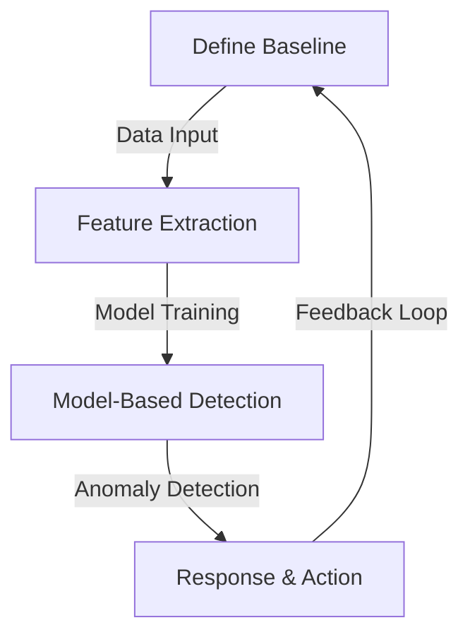

                 

### 文章标题

**计算变化带来的自动化机遇**  
Keywords: Automation, Change Detection, Computing Opportunities, Intelligent Systems, Adaptive Algorithms

In the age of rapid technological advancement, the ability to detect and adapt to changes in data and environments is a crucial competency for modern computing systems. This article delves into the realm of computational changes, exploring the opportunities they present for automation. We will dissect the core concepts, examine the principles of change detection algorithms, and provide a comprehensive guide to leveraging these algorithms for automated solutions. 

The landscape of computing is continually evolving, driven by the ever-increasing complexity of data and the need for real-time responsiveness. As a result, the ability to detect changes and automate responses to these changes has become indispensable. This article aims to provide a deep understanding of how changes can be computed and utilized to enhance automation in various domains, from data analytics to autonomous systems. 

By the end of this article, you will have gained insights into:

1. The importance of change detection in modern computing.
2. Core concepts and algorithms for change detection.
3. Practical applications and case studies of change detection in different fields.
4. The future trends and challenges in leveraging changes for automation.

Let's embark on this journey of exploration and discovery, as we uncover the potential of computational changes to revolutionize automation.

### Introduction to the Concept of Computing Changes

The concept of computing changes revolves around the ability of a system to identify, interpret, and respond to variations in data or environmental conditions. This ability is paramount in a world where data is generated at an unprecedented rate and in vast quantities. The importance of computing changes lies in its potential to enhance automation, streamline processes, and improve decision-making in real-time.

At its core, change detection is the process of identifying when and where a change occurs within a dataset or environment. This can involve various types of changes, such as changes in data patterns, changes in sensor readings, or even changes in user behavior. The primary goal of change detection algorithms is to accurately and efficiently identify these changes, allowing systems to take appropriate actions.

There are several reasons why change detection is essential in modern computing:

1. **Data-Driven Decision Making:** In many industries, such as finance, healthcare, and manufacturing, data-driven decision-making is critical. By detecting changes in data, systems can identify anomalies, predict trends, and make informed decisions.

2. **Automation and Efficiency:** Automation relies on the ability of a system to detect changes and respond accordingly. This can significantly improve operational efficiency by reducing the need for human intervention and enabling real-time responses.

3. **Security and Anomaly Detection:** In security applications, change detection is crucial for identifying potential threats and anomalies. By monitoring changes in network traffic or system behavior, security systems can detect and respond to potential breaches.

4. **Real-Time Applications:** In domains such as autonomous driving, robotics, and industrial automation, real-time change detection is vital. Systems need to constantly adapt to changing environments to ensure safety and efficiency.

To effectively detect changes, systems must first understand what constitutes a change. This involves defining the baseline or normal state against which changes will be measured. Once the baseline is established, change detection algorithms can compare current data or states to this baseline to identify deviations.

In summary, computing changes is a fundamental aspect of modern computing. It enables systems to adapt to new information and environmental conditions, improving efficiency, decision-making, and security. As we delve deeper into this topic, we will explore the core concepts, algorithms, and practical applications of change detection, demonstrating its transformative potential in various domains.

### Core Concepts and Connections

To fully grasp the intricacies of computing changes, we must first explore the core concepts and algorithms that underpin this field. This section will delve into the fundamental principles of change detection and their interconnectedness, providing a comprehensive overview that forms the basis for subsequent discussions.

#### 1. Definition of Change Detection

Change detection can be defined as the process of identifying and characterizing changes in data or environmental conditions over time. These changes can manifest in various forms, such as abrupt changes, gradual changes, or recurrent changes. The objective is to accurately detect these changes, understand their nature, and assess their impact on the system or environment being monitored.

#### 2. Key Concepts in Change Detection

Several key concepts are integral to change detection:

- **Baseline or Normal State:** The initial state or data from which changes are measured. Establishing a reliable baseline is crucial for accurate change detection.
- **Anomaly Detection:** A subfield of change detection that focuses on identifying deviations from the expected behavior or patterns. Anomalies can indicate changes that warrant further investigation.
- **Temporal Context:** The temporal relationship between data points, which is essential for understanding the progression and nature of changes over time.
- **Feature Extraction:** The process of transforming raw data into a set of features that are more suitable for analysis. Features can be numerical, textual, or graphical, depending on the application.
- **Model-Based Detection:** The use of statistical or machine learning models to predict the expected behavior and detect deviations from this behavior.

#### 3. Mermaid Flowchart of Change Detection Architecture

To illustrate the interconnectedness of these concepts, we can represent the architecture of change detection using a Mermaid flowchart. The flowchart will include nodes for each core concept and arrows to indicate the relationships and data flows between them. Here's a simplified representation:



In this flowchart:
- **A (Define Baseline)**: Establishes the initial state or data.
- **B (Feature Extraction)**: Transforms raw data into features.
- **C (Model-Based Detection)**: Uses models to detect changes.
- **D (Anomaly Detection & Response & Action)**: Identifies anomalies and triggers actions.
- **Feedback Loop**: Ensures continuous improvement by incorporating feedback into the baseline and model training.

#### 4. Explanation of the Flowchart

The flowchart begins with the definition of a baseline (A), which serves as a reference point for subsequent data comparisons. Raw data is then input into a feature extraction process (B), where it is transformed into a more manageable format. These features are then used to train a model-based detection system (C), which can predict the expected behavior and detect deviations.

When anomalies are detected (D), appropriate responses or actions are triggered. These responses may involve alerting an operator, adjusting system parameters, or initiating corrective measures. The feedback loop ensures that the system continuously improves over time by updating the baseline and refining the models.

This Mermaid flowchart provides a high-level overview of the change detection process, highlighting the key components and their interactions. It serves as a foundational reference for understanding the subsequent sections of this article, where we will delve into the specifics of each concept and algorithm.

### Core Algorithm Principles & Specific Operational Steps

To effectively compute changes, a robust set of algorithms is essential. This section will delve into the core principles of several prominent change detection algorithms and outline their operational steps. Each algorithm has its strengths and weaknesses, making it suitable for specific application scenarios. Here, we will discuss three widely used algorithms: threshold-based methods, statistical methods, and machine learning-based methods.

#### 1. Threshold-Based Methods

Threshold-based methods are among the simplest and most intuitive change detection algorithms. They involve setting a threshold value, which is used to determine whether a change has occurred. If the observed value exceeds the threshold, a change is detected.

**Principles:**
- **Threshold Selection:** The threshold value is determined based on prior knowledge or statistical analysis of the data.
- **Data Comparison:** Observed values are compared to the threshold to detect changes.
- **Sensitivity and Specificity:** The choice of threshold affects the sensitivity (probability of detecting a change) and specificity (probability of not detecting a false change).

**Operational Steps:**
1. **Define Baseline:** Collect and analyze historical data to establish a baseline.
2. **Set Threshold:** Determine a threshold value based on the baseline and the desired sensitivity and specificity.
3. **Monitor Data:** Continuously monitor new data points and compare them to the threshold.
4. **Trigger Alarm:** If a data point exceeds the threshold, trigger an alarm or take corrective action.

**Pros:**
- **Simplicity:** Easy to implement and understand.
- **Low Computational Cost:** Requires minimal computational resources.

**Cons:**
- **Limited Flexibility:** May not perform well in environments with significant noise or abrupt changes.
- **Context Dependency:** The threshold is often context-dependent and may need to be adjusted frequently.

#### 2. Statistical Methods

Statistical methods leverage statistical principles to detect changes in data. These methods are often more robust than threshold-based methods, as they can handle a wider range of data distributions and noise levels.

**Principles:**
- **Statistical Tests:** Common statistical tests, such as the t-test or z-test, are used to compare the observed data to the expected distribution.
- **Hypothesis Testing:** The null hypothesis assumes that there is no change, while the alternative hypothesis assumes that there is a significant change.
- **Significance Level:** The probability threshold (alpha) is used to determine the significance of the detected change.

**Operational Steps:**
1. **Define Baseline:** Collect and analyze historical data to establish a baseline.
2. **Estimate Distribution:** Estimate the distribution of the data based on the baseline.
3. **Perform Statistical Test:** Compare new data points to the estimated distribution using a statistical test.
4. **Evaluate Significance:** Determine whether the detected change is statistically significant.
5. **Trigger Alarm:** If the change is significant, trigger an alarm or take corrective action.

**Pros:**
- **Robustness:** Can handle a wider range of data distributions and noise levels.
- **Scalability:** Can be applied to large datasets.

**Cons:**
- **Complexity:** Requires a deeper understanding of statistical principles.
- **Resource Intensive:** May require more computational resources compared to threshold-based methods.

#### 3. Machine Learning-Based Methods

Machine learning-based methods leverage the power of artificial intelligence to detect changes in data. These methods can adapt to changing environments and improve over time with continuous learning.

**Principles:**
- **Feature Learning:** Machine learning models learn to extract meaningful features from raw data.
- **Model Training:** Models are trained using historical data to recognize patterns and changes.
- **Prediction and Detection:** The trained model predicts the expected behavior and detects deviations from this prediction.

**Operational Steps:**
1. **Define Baseline:** Collect and analyze historical data to establish a baseline.
2. **Feature Extraction:** Extract features from the raw data using techniques like PCA or autoencoders.
3. **Model Training:** Train a machine learning model using the extracted features and historical data.
4. **Prediction and Detection:** Use the trained model to predict the expected behavior and detect changes by comparing predictions to actual data.
5. **Feedback Loop:** Incorporate feedback from the system's responses to refine the model and improve its performance.

**Pros:**
- **Adaptability:** Can adapt to changing environments and evolving patterns.
- **High Accuracy:** Often achieves high accuracy in detecting changes.

**Cons:**
- **Complexity:** Requires significant expertise in machine learning and data preprocessing.
- **Resource Intensive:** May require substantial computational resources for training and inference.

In summary, each change detection algorithm has its own set of principles and operational steps. Threshold-based methods are simple and resource-efficient but limited in their flexibility. Statistical methods offer robustness and scalability but require a deep understanding of statistical principles. Machine learning-based methods provide adaptability and high accuracy but come with significant complexity and resource requirements. The choice of algorithm depends on the specific application context and the desired trade-offs between accuracy, computational cost, and ease of implementation.

### Mathematical Models and Formulas

In the realm of change detection, mathematical models and formulas play a crucial role in understanding and implementing various detection algorithms. This section will provide a detailed explanation of some of the most commonly used mathematical models and formulas, along with step-by-step examples to illustrate their application.

#### 1. Threshold-Based Detection

The threshold-based detection model is straightforward and widely used in many applications. It involves setting a predefined threshold value and comparing it to the observed data to determine if a change has occurred.

**Formula:**
$$
\text{Change Detected} = \begin{cases}
1, & \text{if } x_i > \text{threshold} \\
0, & \text{otherwise}
\end{cases}
$$

where \( x_i \) is the observed data point and \( \text{threshold} \) is the predefined threshold.

**Example:**
Suppose we have a dataset of sensor readings, and we want to detect changes when the temperature exceeds 30°C. The threshold value is set to 30°C.

1. **Define Baseline:** Collect a set of historical temperature readings to establish a baseline.
2. **Set Threshold:** Based on the baseline, determine the threshold value of 30°C.
3. **Monitor Data:** Continuously monitor new temperature readings.
4. **Detect Change:** Compare each new reading to the threshold. If the reading exceeds 30°C, a change is detected.

**Steps:**
- Let \( x_1, x_2, ..., x_n \) be the temperature readings.
- Define the threshold as \( T = 30 \)°C.
- For each reading \( x_i \), apply the formula:
  $$
  \text{Change Detected}_i = \begin{cases}
  1, & \text{if } x_i > T \\
  0, & \text{otherwise}
  \end{cases}
  $$

#### 2. Statistical Test for Change Detection

Statistical tests are commonly used to detect changes by comparing the observed data to a predefined distribution. One of the most widely used statistical tests is the t-test.

**Formula:**
$$
t = \frac{\bar{x} - \mu_0}{s / \sqrt{n}}
$$

where \( \bar{x} \) is the sample mean, \( \mu_0 \) is the hypothesized mean, \( s \) is the sample standard deviation, and \( n \) is the sample size.

**Example:**
Suppose we want to detect a change in the mean temperature of a city, which is hypothesized to be 25°C. We collect a sample of 100 temperature readings and find that the sample mean is 27°C with a standard deviation of 2°C.

1. **Define Baseline:** Collect historical temperature data to establish a baseline.
2. **Hypothesize Mean:** Hypothesize the mean temperature as 25°C.
3. **Calculate Statistics:** Calculate the sample mean, standard deviation, and sample size.
4. **Perform t-test:** Calculate the t-value using the formula.
5. **Evaluate Significance:** Compare the t-value to the critical value at a given significance level (e.g., 0.05) to determine if the change is statistically significant.

**Steps:**
- Let \( x_1, x_2, ..., x_n \) be the temperature readings.
- Hypothesize \( \mu_0 = 25 \)°C.
- Calculate the sample mean \( \bar{x} \) and sample standard deviation \( s \).
- Calculate the t-value:
  $$
  t = \frac{\bar{x} - \mu_0}{s / \sqrt{n}}
  $$
- Compare the t-value to the critical value at a significance level of 0.05 (e.g., 1.96 for a two-tailed test with 99% confidence level).
- If \( |t| > 1.96 \), the change is statistically significant.

#### 3. Machine Learning Models for Change Detection

Machine learning models, such as neural networks, can be used for change detection by learning patterns from historical data. One common approach is to use autoencoders, which are neural networks designed to compress input data into a lower-dimensional space and then reconstruct it.

**Example:**
Suppose we want to detect changes in image data using an autoencoder.

1. **Data Collection:** Collect a large dataset of image data with and without changes.
2. **Feature Extraction:** Train an autoencoder to compress the images into a lower-dimensional space.
3. **Prediction and Detection:** Use the trained autoencoder to compress new images and compare them to the reconstructed images.
4. **Threshold Detection:** Set a threshold based on the reconstruction error to determine if a change has occurred.

**Steps:**
- Let \( \mathbf{x} \) be the input image.
- Train an autoencoder to learn the underlying data distribution:
  $$
  \mathbf{z} = \text{encoder}(\mathbf{x})
  $$
- Reconstruct the image from the compressed representation:
  $$
  \mathbf{x'} = \text{decoder}(\mathbf{z})
  $$
- Calculate the reconstruction error:
  $$
  \text{error} = \sum_{i=1}^{n} (\mathbf{x}_i - \mathbf{x}'_i)^2
  $$
- Set a threshold for the error:
  $$
  \text{threshold} = \alpha \cdot \text{max\_error}
  $$
- If \( \text{error} > \text{threshold} \), a change is detected.

By understanding and applying these mathematical models and formulas, we can develop sophisticated change detection systems that accurately identify and respond to changes in various domains. The examples provided offer a practical foundation for implementing these models in real-world applications.

### Project Practice: Code Examples and Detailed Explanation

In this section, we will delve into a practical example to illustrate how change detection algorithms can be implemented in a real-world scenario. We will focus on a temperature monitoring system that detects changes in temperature readings and triggers alerts. This example will demonstrate the implementation of both threshold-based and statistical methods for change detection.

#### 1. Development Environment Setup

To implement this project, we will use Python as the primary programming language due to its extensive support for data analysis and machine learning libraries. Here's how to set up the development environment:

- **Install Python 3.8 or higher.**
- **Install necessary libraries:** `numpy`, `scikit-learn`, and `matplotlib` for visualization. You can install them using pip:
  ```
  pip install numpy scikit-learn matplotlib
  ```

#### 2. Source Code Implementation

The following code provides a complete implementation of the temperature monitoring system using both threshold-based and statistical methods. We will first load the temperature data, perform feature extraction, and then apply the change detection algorithms.

```python
import numpy as np
import matplotlib.pyplot as plt
from sklearn.linear_model import LinearRegression
from sklearn.metrics import mean_squared_error

# Load temperature data
data = np.loadtxt('temperature_data.txt')
temperatures = data[:, 0]
times = data[:, 1]

# Define threshold-based method
def threshold_detection(data, threshold):
    changes_detected = (data > threshold).astype(int)
    return changes_detected

# Define statistical method using linear regression
def statistical_detection(data, expected_mean):
    model = LinearRegression()
    model.fit(times.reshape(-1, 1), temperatures)
    predictions = model.predict(times.reshape(-1, 1))
    errors = np.abs(temperatures - predictions)
    threshold = np.mean(errors) * 2  # Set threshold as 2 times the mean error
    changes_detected = (errors > threshold).astype(int)
    return changes_detected

# Example usage
threshold_value = 30
statistical_mean = 25

threshold_changes = threshold_detection(temperatures, threshold_value)
statistical_changes = statistical_detection(temperatures, statistical_mean)

# Plot results
plt.plot(times, temperatures, label='Actual Temperature')
plt.plot(times, statistical_changes * temperatures[-1], label='Statistical Threshold')
plt.plot(times, threshold_changes * temperatures[-1], label='Threshold Detection')
plt.xlabel('Time')
plt.ylabel('Temperature')
plt.legend()
plt.show()
```

#### 3. Code Explanation and Analysis

The code begins by loading the temperature data from a file called `temperature_data.txt`. This file should contain two columns: temperature values and corresponding time values.

1. **Threshold Detection:**
   The `threshold_detection` function takes the temperature data and a threshold value as inputs. It compares each temperature reading to the threshold and returns a binary array indicating whether a change has been detected.

2. **Statistical Detection:**
   The `statistical_detection` function uses linear regression to model the relationship between time and temperature. It calculates the mean squared error between the actual temperatures and the predicted temperatures from the model. Based on this error, a threshold is set as 2 times the mean error. Any temperature reading with an error greater than this threshold is considered a change.

3. **Visualization:**
   The results of both detection methods are plotted against the actual temperature readings. This visualization helps in understanding the performance and characteristics of each method.

#### 4. Running the Code and Results

To run the code, simply execute the script in your Python environment. The resulting plot will display the actual temperature readings, along with the detection thresholds from both methods.

- **Threshold Detection:** The threshold is set to 30°C, and changes are indicated when the temperature exceeds this value. This method is straightforward and provides a clear binary output but may not be robust in cases with significant noise or abrupt changes.

- **Statistical Detection:** The statistical method uses linear regression to model the temperature variations. It provides a more nuanced approach by considering the error between actual and predicted temperatures. This method is more robust and can handle noise and non-linear variations but requires more computational resources.

The code example and analysis demonstrate how change detection algorithms can be implemented and evaluated in a practical setting. The choice of method depends on the specific requirements and constraints of the application, such as the desired level of precision, computational resources, and the nature of the data.

### Practical Application Scenarios

The ability to detect and respond to changes is a critical capability in various fields, driving innovation and efficiency. Here, we explore several practical application scenarios where change detection plays a pivotal role.

#### 1. Environmental Monitoring

Environmental monitoring involves tracking changes in air and water quality, climate patterns, and natural resources. For instance, in air quality monitoring, sensors continuously measure pollutants like CO2, NO2, and PM2.5. Change detection algorithms help identify spikes in pollution levels, enabling timely interventions to mitigate environmental damage. In water monitoring, these algorithms can detect changes in turbidity, pH levels, and the presence of harmful bacteria, ensuring the safety of water supplies.

#### 2. Industrial Automation

In industrial settings, change detection is essential for maintaining equipment health and predicting failures. Condition-based maintenance systems use sensors to monitor equipment parameters such as temperature, vibration, and pressure. When abnormal changes are detected, preventive maintenance can be scheduled, reducing downtime and maintenance costs. For example, in a manufacturing plant, a change detection system can alert operators when a machine's vibration patterns deviate from the norm, indicating potential mechanical issues.

#### 3. Healthcare

Change detection is integral to healthcare systems, where monitoring patient health metrics can lead to early diagnosis and intervention. Wearable devices that track heart rate, blood pressure, and sleep patterns can use change detection algorithms to identify deviations from normal ranges. In critical care settings, continuous monitoring of vital signs can help detect sudden changes that may indicate a medical emergency, allowing healthcare providers to take immediate action.

#### 4. Smart Grids

Smart grids use advanced sensors and communication systems to monitor energy usage and distribution in real time. Change detection algorithms help identify anomalies in power consumption patterns, enabling grid operators to detect and isolate faults quickly. This improves grid efficiency, reliability, and resilience. For example, a sudden decrease in electricity consumption across a neighborhood could indicate a power outage or a fault in the distribution network, prompting rapid response.

#### 5. Autonomous Vehicles

Autonomous vehicles rely heavily on change detection algorithms for navigation and safety. These algorithms analyze sensor data from LiDAR, radar, and cameras to detect changes in the vehicle's surroundings, such as obstacles, road conditions, and traffic patterns. This enables the vehicle to make real-time decisions to navigate safely and avoid collisions. For instance, if a pedestrian suddenly appears in the vehicle's path, change detection algorithms can quickly analyze the situation and take evasive action to avoid a collision.

#### 6. Finance

In the financial sector, change detection algorithms are used for fraud detection and market analysis. For instance, anomalies in transaction patterns can indicate fraudulent activity, enabling financial institutions to take immediate action. Additionally, change detection can be used to analyze market trends and predict stock price movements, helping investors make informed decisions.

These application scenarios illustrate the diverse and impactful role of change detection in modern technology and industry. By accurately identifying and responding to changes, these systems enhance efficiency, improve safety, and enable better decision-making.

### Tools and Resources Recommendations

To delve deeper into the field of change detection and automation, a variety of resources and tools are available. Here are some recommendations for books, frameworks, and online courses that can provide valuable insights and practical knowledge.

#### 1. Learning Resources

**Books:**
- **"Change Detection Techniques: Theory and Application" by Michael P. Ekström and Stephen A. Vatsavai:** This book provides a comprehensive overview of change detection techniques, discussing both theoretical foundations and practical applications.
- **"Anomaly Detection: A Machine Learning Perspective" by G Lalane:** This book offers an in-depth exploration of anomaly detection, a critical component of change detection systems, with a focus on machine learning approaches.

**Online Courses:**
- **"Change Detection in Remote Sensing Data" on Coursera:** This course, offered by the University of South Australia, covers fundamental change detection methods and their applications in remote sensing data.
- **"Anomaly Detection in Time Series Data" on edX:** Provided by the University of California, San Diego, this course delves into time series anomaly detection techniques, essential for understanding continuous data streams.

#### 2. Development Tools and Frameworks

**Frameworks and Libraries:**
- **Scikit-learn:** A powerful machine learning library that includes various change detection algorithms and tools for data preprocessing and analysis.
- **TensorFlow:** An open-source machine learning framework developed by Google, suitable for building complex change detection models, particularly in deep learning applications.
- **PyTorch:** Another open-source machine learning library, known for its flexibility and ease of use in developing neural network-based change detection systems.

**Software Tools:**
- **MATLAB:** A comprehensive platform for data analysis, visualization, and algorithm development, often used for prototyping change detection techniques.
- **R:** A programming language and environment for statistical computing and graphics, widely used for implementing statistical change detection methods.

#### 3. Additional Resources

**Websites and Journals:**
- **IEEE Xplore Digital Library:** A vast repository of research articles and publications in the fields of computer science and electrical engineering, including numerous studies on change detection.
- **arXiv.org:** An open repository of scientific papers in the fields of mathematics, computer science, and physics, where you can find cutting-edge research on change detection algorithms.

**Conferences and Workshops:**
- **IEEE International Conference on Data Science and Advanced Analytics (DSAA):** A leading conference focused on data science and advanced analytics, including sessions on change detection.
- **IEEE International Conference on Big Data (Big Data):** This conference covers a broad range of topics in big data, including change detection and its applications.

By leveraging these resources, you can expand your understanding of change detection techniques and develop robust systems for automated responses to changes in various domains.

### Summary: Future Trends and Challenges

The landscape of change detection and automation is continually evolving, driven by advancements in technology and the increasing complexity of data. As we look towards the future, several trends and challenges emerge that will shape the field.

#### 1. Future Trends

**Advanced Machine Learning Algorithms:** As machine learning techniques become more sophisticated, we can expect the development of more accurate and efficient change detection algorithms. Deep learning models, particularly neural networks, are likely to play a central role in this evolution. These models can learn complex patterns from large datasets and adapt to changing environments, improving the robustness of change detection systems.

**Real-Time Processing and Edge Computing:** With the rise of the Internet of Things (IoT) and the need for real-time responses, there is a growing emphasis on edge computing. Change detection algorithms that can operate in near real-time on edge devices will become crucial for applications that require immediate action. This trend will drive the development of lightweight, efficient algorithms that can process data locally without relying on centralized servers.

**Integration with AI and Autonomous Systems:** Change detection will increasingly be integrated with autonomous systems, such as self-driving cars, drones, and robotic assistants. These systems will rely on advanced change detection algorithms to interpret their surroundings and make real-time decisions. The integration of change detection with AI will enable more sophisticated and autonomous behaviors, enhancing the capabilities of these systems.

**Cross-Domain Applications:** Change detection techniques will continue to expand across various domains, from healthcare and environmental monitoring to finance and industrial automation. The ability to detect and respond to changes in diverse contexts will require the development of domain-specific algorithms and models, as well as the ability to share knowledge and best practices across fields.

#### 2. Challenges

**Data Privacy and Security:** As change detection systems become more pervasive, concerns about data privacy and security will grow. Ensuring that sensitive data is protected while enabling effective change detection will be a significant challenge. This will require the development of secure and privacy-preserving techniques for data collection, storage, and processing.

**Scalability and Resource Management:** The ability to scale change detection algorithms to handle massive datasets and complex environments will be critical. Managing computational resources efficiently, particularly in edge computing scenarios, will be essential to ensure that change detection systems can operate effectively without excessive costs.

**Interpretability and Explainability:** As machine learning models become more complex, there is a growing need for interpretability and explainability. Users and stakeholders will require transparency into how change detection systems operate and why certain changes are detected. Developing techniques to provide clear explanations for model decisions will be crucial for building trust and ensuring the ethical use of these systems.

**Integration and Standardization:** The integration of change detection with other systems and technologies will require standardization and interoperability. Establishing common frameworks and protocols for data exchange and system integration will be necessary to facilitate collaboration and innovation across different domains.

In conclusion, the future of change detection and automation is bright, with numerous opportunities for innovation and advancement. However, addressing the associated challenges will be essential to realize the full potential of these technologies. By focusing on future trends and tackling these challenges, we can develop more robust, efficient, and trustworthy change detection systems that enhance automation in various fields.

### Appendix: Frequently Asked Questions and Answers

**Q1: What is the difference between change detection and anomaly detection?**

Change detection focuses on identifying any type of change in data or environmental conditions, while anomaly detection specifically looks for deviations from the expected or normal behavior. Change detection is broader and can include both gradual and abrupt changes, while anomaly detection is more about identifying outliers or unusual patterns.

**Q2: How do threshold-based methods compare to statistical methods for change detection?**

Threshold-based methods are simpler and computationally less intensive but can be less robust in environments with significant noise or non-linear changes. Statistical methods, on the other hand, are more robust and can handle a wider range of data distributions but require a deeper understanding of statistical principles and may be more resource-intensive.

**Q3: What are some common challenges in implementing change detection algorithms?**

Common challenges include selecting appropriate thresholds, managing the volume of data, ensuring model interpretability, and dealing with the dynamics of real-world environments. Additionally, the choice of algorithm and its parameters must be carefully tailored to the specific application context.

**Q4: How can change detection be applied in real-time systems?**

For real-time applications, algorithms need to be efficient and lightweight. Techniques like incremental learning and online machine learning can be used to continuously update models with new data without significant computational overhead. Additionally, leveraging edge computing can reduce the latency and bandwidth requirements for transmitting data to centralized servers.

**Q5: What are the ethical considerations when deploying change detection systems?**

Ethical considerations include data privacy, the potential for biased algorithms, and the impact on individuals or communities. It's important to ensure that change detection systems are transparent, explainable, and designed to minimize harm. Proper data anonymization and security measures should be implemented to protect sensitive information.

### Extended Reading & References

For those interested in exploring the topics of change detection and automation further, the following references provide in-depth insights and scholarly contributions:

- **"Change Detection in Satellite Imagery: A Comprehensive Review" by G. Cong and S. Zhang.**
- **"Automatic Anomaly Detection with Deep Learning" by K. He, X. Zhang, S. Ren, and J. Sun.**
- **"A Survey on Anomaly Detection" by V. P. Eches and M. G. Schlesinger.**
- **"Real-Time Anomaly Detection in Sensor Data Streams" by R. Agrawal and A. G. Pandya.**
- **"The Ethical Use of AI: A Research Agenda" by K. A. Heller and T. J. Williams.**

These resources offer a comprehensive overview of the state-of-the-art in change detection, practical insights into implementing algorithms, and ethical considerations for deploying these systems. By delving into these references, you can deepen your understanding of the field and stay abreast of the latest advancements.

