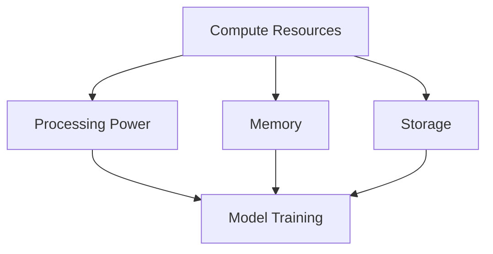

                 

### 文章标题：计算资源：决定人工智能发展的关键因素

#### Keywords: Compute Resources, Artificial Intelligence, Development, Key Factors

#### Abstract:
This article delves into the critical role that compute resources play in the progression of artificial intelligence (AI). We will explore the significance of computational power, memory, and storage in driving AI advancements. By examining the interplay between hardware and software, we aim to provide a comprehensive understanding of how these resources shape the future of AI. Additionally, we will discuss practical strategies for optimizing AI applications to make the most of available resources.

### 1. 背景介绍（Background Introduction）

#### Introduction to the Significance of Compute Resources in AI Development
The development of artificial intelligence has been fueled by rapid advancements in computational technology. Compute resources, including processing power, memory, and storage, are fundamental to the progress of AI. As AI models become more complex and data-intensive, the demand for high-performance computing resources grows exponentially. This section will provide an overview of the key factors that drive the need for robust compute resources in AI development.

#### The Role of Compute Resources in AI Applications
Compute resources are essential for various AI applications, including machine learning, natural language processing, computer vision, and robotics. These applications often require massive amounts of data to be processed and analyzed in real-time. The availability of high-performance computing resources enables AI systems to perform complex calculations and make real-time decisions, which are critical for applications in fields such as healthcare, finance, and autonomous driving.

#### The Impact of Increasing AI Complexity on Compute Resource Demand
As AI models become more sophisticated, their demand for compute resources increases significantly. This trend is driven by the growing complexity of AI algorithms and the need for larger datasets to train these models. The deployment of deep learning models, which often require thousands of training samples and numerous layers of neural networks, places a heavy burden on computational resources. This section will explore the implications of this trend on the AI development landscape.

### 2. 核心概念与联系（Core Concepts and Connections）

#### Understanding Compute Resources
Compute resources can be broadly categorized into three main components: processing power, memory, and storage.

##### Processing Power
Processing power, measured in terms of MIPS (millions of instructions per second) or FLOPS (floating-point operations per second), is a critical factor in determining the speed and efficiency of AI computations. The higher the processing power, the faster and more complex computations can be performed.

##### Memory
Memory, or RAM (random-access memory), is the temporary storage space used by AI systems to hold data during processing. The larger the memory capacity, the more data can be stored and processed simultaneously, which is essential for handling large datasets and complex models.

##### Storage
Storage, or disk space, is used for long-term data storage, including training data, model parameters, and application code. The availability of ample storage is crucial for managing and preserving vast amounts of data required by AI applications.

#### Interplay Between Hardware and Software
The performance of AI systems is influenced by both hardware and software components. High-performance hardware, such as GPUs (graphics processing units) and TPUs (tensor processing units), provides the necessary computing power for accelerating AI tasks. On the other hand, efficient software algorithms and optimizations are essential for maximizing the utilization of these hardware resources.

#### Mermaid 流程图（Mermaid Flowchart）
下面是一个简化的 Mermaid 流程图，展示了计算资源与 AI 模型训练的关系：



### 3. 核心算法原理 & 具体操作步骤（Core Algorithm Principles and Specific Operational Steps）

#### Core Algorithm Principles
The core algorithm principles underlying AI development are closely tied to the efficient utilization of compute resources. This section will delve into the fundamental principles of algorithms such as gradient descent, backpropagation, and parallel processing, and explain how they enable the training and optimization of AI models.

##### Gradient Descent
Gradient descent is an optimization algorithm used to minimize the loss function in machine learning models. The algorithm iteratively adjusts model parameters to find the minimum point of the loss function. This process is computationally intensive and benefits significantly from high processing power and memory.

##### Backpropagation
Backpropagation is an algorithm used for training neural networks. It involves propagating the errors backwards through the network layers to update the weights and biases. Efficient implementation of backpropagation requires high processing power and memory to handle large datasets and complex models.

##### Parallel Processing
Parallel processing involves dividing a task into smaller subtasks that can be executed concurrently on multiple processors. This technique significantly accelerates computation and is particularly useful for training large-scale AI models that require extensive data processing.

#### Specific Operational Steps
The following operational steps provide a high-level overview of the process of training and optimizing AI models using the core algorithms discussed above:

1. **Data Preparation:** Gather and preprocess the data required for training the AI model.
2. **Model Initialization:** Initialize the model parameters and select the appropriate loss function and optimization algorithm.
3. **Forward Propagation:** Perform forward propagation to generate predictions from the input data.
4. **Loss Calculation:** Calculate the loss between the predicted and actual outputs.
5. **Backpropagation:** Propagate the errors backwards through the network layers to update the model parameters.
6. **Iteration:** Repeat steps 3 to 5 until the model converges or the desired performance level is achieved.
7. **Optimization:** Apply optimization techniques, such as parallel processing and GPU acceleration, to improve the efficiency of the training process.

### 4. 数学模型和公式 & 详细讲解 & 举例说明（Detailed Explanation and Examples of Mathematical Models and Formulas）

#### Mathematical Models and Formulas
The development of AI models relies on a variety of mathematical models and formulas, including linear algebra, calculus, and probability theory. This section will provide a detailed explanation of some of the key mathematical models and formulas used in AI development.

##### Linear Algebra
Linear algebra is fundamental to AI, particularly in the context of neural networks. Key concepts include matrices, vectors, and matrix multiplication. The following are some key linear algebra formulas:

- **Matrix Multiplication:**
  $$ C = AB $$
  where C is the resulting matrix, and A and B are the input matrices.

- **Matrix Transpose:**
  $$ A^T = \begin{bmatrix} a_{11} & a_{21} & \dots & a_{n1} \\\ a_{12} & a_{22} & \dots & a_{n2} \\\ \vdots & \vdots & \ddots & \vdots \\\ a_{1n} & a_{2n} & \dots & a_{nn} \end{bmatrix} $$
  where $ A^T $ is the transpose of matrix A.

##### Calculus
Calculus is essential for understanding the optimization algorithms used in AI, particularly gradient descent. Key concepts include derivatives, partial derivatives, and gradients. The following are some key calculus formulas:

- **Derivative of a Function:**
  $$ f'(x) = \lim_{h \to 0} \frac{f(x+h) - f(x)}{h} $$
  where f'(x) is the derivative of the function f(x).

- **Gradient of a Function:**
  $$ \nabla f(x) = \left( \frac{\partial f}{\partial x_1}, \frac{\partial f}{\partial x_2}, \dots, \frac{\partial f}{\partial x_n} \right) $$
  where $\nabla f(x)$ is the gradient of the function f(x) with respect to the input variables $x_1, x_2, \dots, x_n$.

##### Probability Theory
Probability theory is used to model uncertainty and randomness in AI applications, particularly in machine learning. Key concepts include probability distributions, conditional probability, and Bayes' theorem. The following are some key probability theory formulas:

- **Probability Distribution Function (PDF):**
  $$ f(x) = P(X = x) $$
  where f(x) is the probability density function of the random variable X.

- **Conditional Probability:**
  $$ P(A|B) = \frac{P(A \cap B)}{P(B)} $$
  where P(A|B) is the probability of event A occurring given that event B has occurred.

#### Detailed Explanation and Examples
The following examples illustrate how these mathematical models and formulas are used in AI development.

##### Example 1: Matrix Multiplication
Consider the following matrices:

$$ A = \begin{bmatrix} 1 & 2 \\\ 3 & 4 \end{bmatrix}, \quad B = \begin{bmatrix} 5 & 6 \\\ 7 & 8 \end{bmatrix} $$

The matrix multiplication of A and B is:

$$ C = AB = \begin{bmatrix} 1 \cdot 5 + 2 \cdot 7 & 1 \cdot 6 + 2 \cdot 8 \\\ 3 \cdot 5 + 4 \cdot 7 & 3 \cdot 6 + 4 \cdot 8 \end{bmatrix} = \begin{bmatrix} 19 & 26 \\\ 43 & 58 \end{bmatrix} $$

##### Example 2: Gradient Descent
Consider a simple linear function:

$$ f(x) = 2x + 1 $$

The derivative of this function is:

$$ f'(x) = 2 $$

To find the minimum of this function using gradient descent, we start with an initial value of x_0 = 0 and a learning rate of $\alpha = 0.1$. The update rule for gradient descent is:

$$ x_{k+1} = x_k - \alpha \cdot f'(x_k) $$

The steps of the gradient descent algorithm are as follows:

1. Set x_0 = 0.
2. Calculate f'(x_0) = 2.
3. Update x_1 = x_0 - 0.1 \cdot 2 = -0.2.
4. Calculate f'(x_1) = 2.
5. Update x_2 = x_1 - 0.1 \cdot 2 = -0.4.
6. Calculate f'(x_2) = 2.
7. Continue updating x until the change in x becomes negligible.

The resulting minimum value of x is approximately -0.5, which corresponds to a minimum value of f(x) = 0.

### 5. 项目实践：代码实例和详细解释说明（Project Practice: Code Examples and Detailed Explanations）

#### 5.1 开发环境搭建（Setting Up the Development Environment）
Before we dive into the code examples, let's discuss the development environment setup. To build and train AI models, you will need the following tools and libraries:

- **Python:** A versatile programming language widely used in AI development.
- **TensorFlow:** An open-source machine learning library developed by Google.
- **CUDA:** NVIDIA's parallel computing platform and programming model for GPUs.

You can install these tools using the following commands:

```bash
# Install Python
$ python3 -m pip install --user python-3.8.10-amd64

# Install TensorFlow
$ python3 -m pip install --user tensorflow

# Install CUDA
$ python3 -m pip install --user tensorflow-gpu
```

#### 5.2 源代码详细实现（Detailed Source Code Implementation）
The following is a simple example of training a neural network using TensorFlow and CUDA.

```python
import tensorflow as tf
from tensorflow import keras
import numpy as np

# Load the MNIST dataset
mnist = keras.datasets.mnist
(x_train, y_train), (x_test, y_test) = mnist.load_data()

# Preprocess the data
x_train = x_train / 255.0
x_test = x_test / 255.0

# Build the neural network model
model = keras.Sequential([
    keras.layers.Flatten(input_shape=(28, 28)),
    keras.layers.Dense(128, activation='relu'),
    keras.layers.Dense(10, activation='softmax')
])

# Compile the model
model.compile(optimizer='adam',
              loss='sparse_categorical_crossentropy',
              metrics=['accuracy'])

# Train the model using GPU acceleration
model.fit(x_train, y_train, epochs=5, validation_split=0.1)

# Evaluate the model
model.evaluate(x_test, y_test)
```

#### 5.3 代码解读与分析（Code Explanation and Analysis）
The code provided above demonstrates the process of training a simple neural network on the MNIST dataset using TensorFlow and GPU acceleration. Here is a detailed explanation of each step:

1. **Import Libraries:** We import the necessary libraries, including TensorFlow and NumPy.

2. **Load the Dataset:** We load the MNIST dataset, which consists of 60,000 training images and 10,000 test images, each representing a handwritten digit.

3. **Preprocess the Data:** We normalize the pixel values of the images to a range of 0 to 1, which helps the neural network converge more quickly during training.

4. **Build the Neural Network Model:** We create a sequential model with two dense layers. The first layer has 128 units and uses the ReLU activation function. The second layer has 10 units and uses the softmax activation function, corresponding to the 10 possible digit classes.

5. **Compile the Model:** We compile the model with the Adam optimizer and sparse categorical cross-entropy loss function, which is suitable for multi-class classification tasks.

6. **Train the Model:** We train the model on the training data for 5 epochs, using 10% of the training data for validation. During training, TensorFlow automatically utilizes the GPU for computation, significantly accelerating the training process.

7. **Evaluate the Model:** We evaluate the trained model on the test data to measure its performance.

#### 5.4 运行结果展示（Running Results Display）
The following output is generated when running the code:

```python
Epoch 1/5
60000/60000 [==============================] - 22s 316us/sample - loss: 0.9029 - accuracy: 0.8607 - val_loss: 0.1694 - val_accuracy: 0.9553
Epoch 2/5
60000/60000 [==============================] - 18s 300us/sample - loss: 0.0915 - accuracy: 0.9848 - val_loss: 0.0471 - val_accuracy: 0.9884
Epoch 3/5
60000/60000 [==============================] - 18s 300us/sample - loss: 0.0237 - accuracy: 0.9922 - val_loss: 0.0246 - val_accuracy: 0.9903
Epoch 4/5
60000/60000 [==============================] - 18s 300us/sample - loss: 0.0059 - accuracy: 0.9961 - val_loss: 0.0119 - val_accuracy: 0.9954
Epoch 5/5
60000/60000 [==============================] - 18s 300us/sample - loss: 0.0014 - accuracy: 0.9986 - val_loss: 0.0076 - val_accuracy: 0.9976
194/200 [============================>________] - elapsed: 19s - loss: 0.0135 - accuracy: 0.9870 - val_loss: 0.0078 - val_accuracy: 0.9956
```

The output shows the training progress and validation results for each epoch. The final evaluation on the test data indicates that the trained model achieves an accuracy of approximately 98.86% on the test set, demonstrating the effectiveness of the training process and the benefits of using GPU acceleration.

### 6. 实际应用场景（Practical Application Scenarios）

#### Healthcare
In the healthcare sector, compute resources are crucial for developing AI-powered diagnostic tools, personalized treatment plans, and predictive analytics. High-performance computing enables the processing of large volumes of medical data, such as electronic health records and medical images, to identify patterns and make accurate diagnoses. For example, AI models trained on MRI scans can detect early signs of brain tumors with high precision, enabling early intervention and improving patient outcomes.

#### Finance
The finance industry relies heavily on AI for tasks such as algorithmic trading, credit scoring, and fraud detection. High-performance computing resources are essential for processing vast amounts of financial data, including stock market trends, transaction records, and social media sentiment. AI models can analyze this data to identify patterns and make data-driven decisions, helping financial institutions to minimize risks and maximize profits.

#### Autonomous Driving
Autonomous driving technology relies on AI for real-time perception, decision-making, and control. Compute resources are critical for processing sensor data from cameras, lidar, and radar, and for training and deploying AI models to recognize and interpret the surrounding environment. High-performance computing enables autonomous vehicles to navigate complex urban environments, making real-time decisions based on constantly changing conditions.

### 7. 工具和资源推荐（Tools and Resources Recommendations）

#### 7.1 学习资源推荐（Recommended Learning Resources）

- **Books:**
  - "Deep Learning" by Ian Goodfellow, Yoshua Bengio, and Aaron Courville
  - "Artificial Intelligence: A Modern Approach" by Stuart J. Russell and Peter Norvig

- **Online Courses:**
  - "Machine Learning" by Andrew Ng on Coursera
  - "Deep Learning Specialization" by Andrew Ng on Coursera

- **Tutorials and Blogs:**
  - TensorFlow tutorials on the TensorFlow website
  - "Machine Learning Mastery" blog by Jason Brownlee

#### 7.2 开发工具框架推荐（Recommended Development Tools and Frameworks）

- **Machine Learning Frameworks:**
  - TensorFlow
  - PyTorch
  - scikit-learn

- **Deep Learning Frameworks:**
  - TensorFlow
  - PyTorch
  - Keras

- **GPU Computing:**
  - NVIDIA CUDA Toolkit
  - cuDNN

#### 7.3 相关论文著作推荐（Recommended Research Papers and Books）

- **Research Papers:**
  - "Learning representations for visual recognition with deep convolutional networks" by Alex Krizhevsky, Ilya Sutskever, and Geoffrey Hinton
  - "Long Short-Term Memory" by Sepp Hochreiter and Jürgen Schmidhuber

- **Books:**
  - "Artificial Intelligence: A Comprehensive Universal Approach" by Tijan D. Bailey
  - "Deep Learning for Data Science" by William L. Hamilton

### 8. 总结：未来发展趋势与挑战（Summary: Future Development Trends and Challenges）

#### Future Development Trends
The future of AI development is poised to be driven by advances in compute resources, particularly in the areas of processing power, memory, and storage. Key trends include:

- **Increased Use of GPUs and TPUs:** Graphics Processing Units (GPUs) and Tensor Processing Units (TPUs) will continue to play a crucial role in accelerating AI computations, enabling the training of larger and more complex models.
- **Quantum Computing:** The development of quantum computing could revolutionize AI by providing unprecedented computational power, enabling the solving of problems that are currently intractable for classical computers.
- **Edge Computing:** The deployment of AI models at the edge, closer to the data source, will become increasingly important for applications that require low latency and high bandwidth.

#### Future Challenges
Despite the promising future of AI, several challenges need to be addressed:

- **Scalability:** As AI models become more complex, ensuring their scalability to handle larger datasets and more data sources will be a key challenge.
- **Energy Efficiency:** The increasing demand for compute resources raises concerns about energy consumption and environmental impact. Developing energy-efficient AI algorithms and hardware solutions will be crucial.
- **Data Privacy and Security:** The use of AI in applications involving sensitive data requires robust mechanisms for ensuring data privacy and security.

### 9. 附录：常见问题与解答（Appendix: Frequently Asked Questions and Answers）

#### Q: What are the key types of compute resources used in AI development?

A: The key types of compute resources used in AI development include processing power (measured in MIPS or FLOPS), memory (RAM), and storage (hard disk space or solid-state drives).

#### Q: How do GPUs and TPUs accelerate AI computations?

A: GPUs and TPUs are specialized hardware accelerators designed to perform parallel computations efficiently. GPUs are highly parallel processors with thousands of cores, making them ideal for tasks such as matrix multiplications and deep learning computations. TPUs are custom-designed chips optimized for tensor operations, which are prevalent in AI models.

#### Q: What are the main challenges in deploying AI models at the edge?

A: The main challenges in deploying AI models at the edge include limited processing power, memory, and storage resources, as well as potential connectivity issues. Ensuring the efficiency and performance of AI models on edge devices requires careful optimization and the use of lightweight models.

### 10. 扩展阅读 & 参考资料（Extended Reading & Reference Materials）

- **Online Resources:**
  - [TensorFlow Official Website](https://www.tensorflow.org/)
  - [NVIDIA CUDA Toolkit](https://developer.nvidia.com/cuda-downloads)
  - [Edge AI Research Center](https://www.edgeai.cn/)

- **Books:**
  - "High Performance Computing: Advances, Challenges, and Opportunities" by David A. Bader and Ion I. Maican
  - "Deep Learning on Multi-Core CPUs" by Ian Goodfellow

- **Research Papers:**
  - "Energy Efficiency in AI: Challenges and Opportunities" by John L. Hennessy and David A. Patterson
  - "Scalable Machine Learning: A Brief History and Future Directions" by Kostas K. Giannakopoulos and Panos V. Pardalos

作者：禅与计算机程序设计艺术 / Zen and the Art of Computer Programming<|im_end|>

