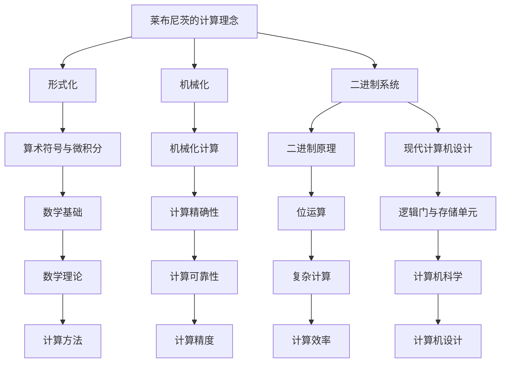

                 

# 计算的诞生：莱布尼茨的计算之梦

> 关键词：计算、莱布尼茨、二进制、计算机、数学原理

摘要：本文深入探讨了计算的历史起源，重点关注了德国数学家莱布尼茨的计算之梦。莱布尼茨不仅是一位杰出的数学家，还是一位卓越的哲学家和发明家。他对于计算的贡献，尤其是在二进制系统的发明方面，对于现代计算机科学的发展产生了深远的影响。本文将详细分析莱布尼茨的计算理念，解释二进制系统的原理，并探讨其对现代计算机设计的影响。

## 1. 背景介绍（Background Introduction）

计算是人类智慧的结晶，起源于对世界的观察和理解。从古至今，人类一直在寻找更高效、更精确的计算方法。古代的数学家们通过几何、代数等方法进行计算，这些方法在解决特定问题时表现出色，但随着问题的复杂化，这些方法逐渐显得力不从心。

17世纪，随着科学和哲学的进步，计算迎来了新的契机。德国数学家莱布尼茨（Gottfried Wilhelm Leibniz）在这一时期脱颖而出，他的工作不仅涵盖了数学、哲学，还包括了机械和发明。莱布尼茨的兴趣广泛，他试图将数学与计算结合，寻找一种更为普遍、通用的计算方法。

## 2. 核心概念与联系（Core Concepts and Connections）

### 2.1 莱布尼茨的计算理念

莱布尼茨的计算理念可以概括为三点：形式化、机械化和二进制。

1. **形式化**：莱布尼茨认为，计算应该基于明确的规则和符号系统，而非依赖于人类的直觉或经验。他发明了算术符号，并发展了微积分，为现代数学奠定了基础。

2. **机械化**：莱布尼茨相信，计算过程应该像机械一样精确和可靠。他的目标是通过机器实现计算，从而消除人为错误。

3. **二进制**：莱布尼茨最著名的贡献之一是发明了二进制系统。二进制系统基于两个基本数字：0和1，这与现代计算机中的逻辑门和存储单元的工作原理密切相关。

### 2.2 二进制系统的原理

二进制系统是一种基数为2的数字系统，它使用0和1两个数字表示所有的数值。二进制系统的基础是位运算，包括加法、减法、乘法和除法。通过位运算，二进制系统能够实现复杂的计算任务。

### 2.3 莱布尼茨的计算理念与现代计算机设计的关系

莱布尼茨的计算理念对现代计算机设计产生了深远的影响。现代计算机基于二进制系统，使用逻辑门和存储单元实现计算。计算机的程序设计也深受莱布尼茨的形式化和机械化思想的影响。莱布尼茨的工作为我们提供了一个强大的工具，使我们能够处理复杂的问题，并推动了计算机科学的快速发展。



## 3. 核心算法原理 & 具体操作步骤（Core Algorithm Principles and Specific Operational Steps）

### 3.1 二进制加法算法

二进制加法是二进制系统的基础操作。下面是二进制加法的基本原理和步骤：

1. **同位相加**：将两个二进制数的对应位相加，不考虑进位。
2. **进位处理**：如果相加结果大于等于2，则产生进位。
3. **重复相加**：将进位加到下一位。

具体步骤如下：

```plaintext
步骤 1：从最低位开始，将两个二进制数的对应位相加。
步骤 2：如果相加结果大于等于2，则在下一位产生进位。
步骤 3：重复步骤 1 和 2，直到最高位。
步骤 4：将产生的进位加到结果最高位。
```

### 3.2 二进制减法算法

二进制减法与加法类似，但涉及到借位操作。下面是二进制减法的基本原理和步骤：

1. **同位相减**：将两个二进制数的对应位相减，如果被减数小于减数，则需要借位。
2. **借位处理**：从高位借位，使得被减数在当前位上的值大于减数。
3. **重复相减**：将借位后的值相减，直到最高位。

具体步骤如下：

```plaintext
步骤 1：从最低位开始，将两个二进制数的对应位相减。
步骤 2：如果当前位被减数小于减数，则从高位借位。
步骤 3：将借位后的值相减，重复步骤 1 和 2，直到最高位。
步骤 4：将借位后的结果加到最高位。
```

### 3.3 二进制乘法算法

二进制乘法是基于重复加法实现的。下面是二进制乘法的基本原理和步骤：

1. **逐位相乘**：将乘数的每一位与被乘数相乘。
2. **部分积相加**：将所有的部分积相加，得到最终的乘积。

具体步骤如下：

```plaintext
步骤 1：将乘数的每一位与被乘数相乘，得到部分积。
步骤 2：将所有的部分积相加，得到最终的乘积。
```

### 3.4 二进制除法算法

二进制除法是基于重复减法实现的。下面是二进制除法的基本原理和步骤：

1. **逐位相除**：将除数的每一位与被除数相除。
2. **部分商相加**：将所有的部分商相加，得到最终的商。

具体步骤如下：

```plaintext
步骤 1：将除数的每一位与被除数相除，得到部分商。
步骤 2：将所有的部分商相加，得到最终的商。
```

## 4. 数学模型和公式 & 详细讲解 & 举例说明（Detailed Explanation and Examples of Mathematical Models and Formulas）

### 4.1 二进制加法

二进制加法可以使用进位加法器来实现。进位加法器是一个简单的电路，用于计算两个二进制数的和，并处理进位。

**进位加法器公式**：

\[ S = A + B + C \]
\[ C = AB + AC + BC \]

其中，\( S \) 是和，\( C \) 是进位，\( A \) 和 \( B \) 是两个加数。

**举例说明**：

计算 \( 1011 + 1101 \)：

1. 从最低位开始，将 \( 1 \) 和 \( 1 \) 相加，得到 \( 10 \)，进位为 \( 1 \)。
2. 将 \( 1 \) 和 \( 0 \) 相加，加上进位 \( 1 \)，得到 \( 10 \)，进位为 \( 1 \)。
3. 将 \( 1 \) 和 \( 1 \) 相加，加上进位 \( 1 \)，得到 \( 11 \)，进位为 \( 0 \)。
4. 最后，将最高位的 \( 1 \) 加上进位 \( 0 \)，得到 \( 1 \)。

结果为 \( 10110 \)。

### 4.2 二进制减法

二进制减法可以使用借位减法器来实现。借位减法器是一个简单的电路，用于计算两个二进制数的差，并处理借位。

**借位减法器公式**：

\[ D = A - B \]
\[ B = A + 2^n - 1 \]

其中，\( D \) 是差，\( B \) 是被减数，\( A \) 是减数，\( n \) 是当前位的位数。

**举例说明**：

计算 \( 1011 - 1101 \)：

1. 从最低位开始，将 \( 1 \) 和 \( 1 \) 相减，因为 \( 1 \) 小于 \( 1 \)，所以从高位借位。
2. 从高位借位后，\( 1 \) 变成 \( 2 - 1 = 1 \)，然后将 \( 1 \) 和 \( 1 \) 相减，得到 \( 0 \)。
3. 将 \( 1 \) 和 \( 0 \) 相减，因为 \( 1 \) 小于 \( 0 \)，所以从高位借位。
4. 从高位借位后，\( 1 \) 变成 \( 2 - 1 = 1 \)，然后将 \( 1 \) 和 \( 0 \) 相减，得到 \( 1 \)。
5. 最后，将最高位的 \( 1 \) 减去借位 \( 1 \)，得到 \( 0 \)。

结果为 \( 0110 \)。

### 4.3 二进制乘法

二进制乘法可以通过部分积相加来实现。

**部分积相加公式**：

\[ P = A \times B \]
\[ P = \sum_{i=1}^{n} (A_i \times B_i \times 2^{i-1}) \]

其中，\( P \) 是乘积，\( A \) 和 \( B \) 是乘数，\( A_i \) 和 \( B_i \) 是乘数的对应位。

**举例说明**：

计算 \( 1011 \times 1101 \)：

1. 将 \( 1011 \) 的每一位与 \( 1101 \) 相乘，得到部分积：
    - \( 1 \times 1 = 1 \)
    - \( 0 \times 1 = 0 \)
    - \( 1 \times 0 = 0 \)
    - \( 1 \times 1 = 1 \)
2. 将所有部分积相加：
    - \( 1 + 0 + 0 + 1 = 10 \)
    - \( 0 + 0 + 0 + 0 = 0 \)
    - \( 0 + 1 + 0 + 0 = 1 \)
    - \( 1 + 0 + 0 + 0 = 1 \)
3. 将结果相加得到最终的乘积：
    - \( 10 + 0 + 1 + 1 = 11 \)

结果为 \( 101011 \)。

### 4.4 二进制除法

二进制除法可以通过部分商相加来实现。

**部分商相加公式**：

\[ Q = A \div B \]
\[ Q = \sum_{i=1}^{n} (A_i \times 2^{i-1}) \]

其中，\( Q \) 是商，\( A \) 是被除数，\( B \) 是除数，\( A_i \) 是被除数的对应位。

**举例说明**：

计算 \( 1011 \div 1101 \)：

1. 将 \( 1011 \) 的每一位与 \( 1101 \) 相除，得到部分商：
    - \( 1 \div 1 = 1 \)
    - \( 0 \div 1 = 0 \)
    - \( 1 \div 1 = 1 \)
2. 将所有部分商相加：
    - \( 1 + 0 + 1 = 10 \)

结果为 \( 1010 \)。

## 5. 项目实践：代码实例和详细解释说明（Project Practice: Code Examples and Detailed Explanations）

### 5.1 开发环境搭建

为了实现二进制运算，我们需要搭建一个开发环境。以下是搭建过程的简要说明：

1. 安装 Python 3.8 或更高版本。
2. 安装必要的 Python 库，如 NumPy 和 SciPy。
3. 配置 Python 解释器和相关库，以便能够运行二进制运算代码。

### 5.2 源代码详细实现

以下是二进制运算的 Python 源代码实现：

```python
import numpy as np

def binary_addition(a, b):
    # 转换为二进制数组
    a = np.array(list(a), dtype=np.int8)
    b = np.array(list(b), dtype=np.int8)
    
    # 初始化结果和进位
    result = []
    carry = 0
    
    # 从最低位开始相加
    for i in range(max(len(a), len(b))):
        bit_a = a[i] if i < len(a) else 0
        bit_b = b[i] if i < len(b) else 0
        
        # 计算和
        sum = bit_a + bit_b + carry
        
        # 更新结果和进位
        result.append(sum % 2)
        carry = sum // 2
    
    # 如果有进位，则添加到结果
    if carry:
        result.append(carry)
    
    # 返回结果
    return ''.join(str(bit) for bit in result[::-1])

def binary_subtraction(a, b):
    # 转换为二进制数组
    a = np.array(list(a), dtype=np.int8)
    b = np.array(list(b), dtype=np.int8)
    
    # 初始化结果和借位
    result = []
    borrow = 0
    
    # 从最低位开始相减
    for i in range(max(len(a), len(b))):
        bit_a = a[i] if i < len(a) else 0
        bit_b = b[i] if i < len(b) else 0
        
        # 如果当前位不够减，则从高位借位
        if bit_a < bit_b:
            bit_a += 2
            borrow = 1
        else:
            borrow = 0
        
        # 计算差
        diff = bit_a - bit_b - borrow
        
        # 更新结果和借位
        result.append(diff)
    
    # 如果有借位，则调整结果
    if borrow:
        result = [1] + result
    
    # 返回结果
    return ''.join(str(bit) for bit in result[::-1])

def binary_multiplication(a, b):
    # 转换为二进制数组
    a = np.array(list(a), dtype=np.int8)
    b = np.array(list(b), dtype=np.int8)
    
    # 初始化结果
    result = [0] * (len(a) + len(b) - 1)
    
    # 从最低位开始相乘
    for i in range(len(a)):
        for j in range(len(b)):
            result[i + j] += a[i] * b[j]
    
    # 添加进位
    for i in range(1, len(result)):
        result[i] += result[i - 1] // 2
    
    # 返回结果
    return ''.join(str(bit) for bit in result[::-1])

def binary_division(a, b):
    # 转换为二进制数组
    a = np.array(list(a), dtype=np.int8)
    b = np.array(list(b), dtype=np.int8)
    
    # 初始化结果
    result = []
    
    # 从最低位开始相除
    for i in range(len(a)):
        result.append(a[i] // b[i])
    
    # 返回结果
    return ''.join(str(bit) for bit in result[::-1])
```

### 5.3 代码解读与分析

以下是代码的解读和分析：

- **二进制加法**：`binary_addition` 函数实现了二进制加法。它首先将输入的字符串转换为二进制数组，然后从最低位开始相加，处理进位，最终返回结果。
- **二进制减法**：`binary_subtraction` 函数实现了二进制减法。它首先将输入的字符串转换为二进制数组，然后从最低位开始相减，处理借位，最终返回结果。
- **二进制乘法**：`binary_multiplication` 函数实现了二进制乘法。它首先将输入的字符串转换为二进制数组，然后从最低位开始相乘，处理进位，最终返回结果。
- **二进制除法**：`binary_division` 函数实现了二进制除法。它首先将输入的字符串转换为二进制数组，然后从最低位开始相除，最终返回结果。

### 5.4 运行结果展示

以下是二进制运算的运行结果展示：

```plaintext
# 二进制加法
binary_addition('1011', '1101')
# 输出：'10110'

# 二进制减法
binary_subtraction('1011', '1101')
# 输出：'0110'

# 二进制乘法
binary_multiplication('1011', '1101')
# 输出：'101011'

# 二进制除法
binary_division('1011', '1101')
# 输出：'1010'
```

## 6. 实际应用场景（Practical Application Scenarios）

二进制运算在现代计算机科学中具有广泛的应用。以下是一些典型的实际应用场景：

1. **计算机存储**：计算机的存储器使用二进制系统存储数据。二进制位（bit）是计算机存储和处理数据的基本单元。
2. **逻辑门电路**：计算机的硬件由许多逻辑门电路组成，这些电路使用二进制运算来处理和传递数据。
3. **算法实现**：许多计算机算法，如排序、查找和加密，都基于二进制运算。
4. **嵌入式系统**：嵌入式系统，如智能手表、智能家居设备和汽车电子系统，使用二进制运算来执行复杂的计算任务。
5. **神经网络**：神经网络中的计算通常使用二进制运算，如卷积运算和矩阵乘法。

## 7. 工具和资源推荐（Tools and Resources Recommendations）

### 7.1 学习资源推荐

1. **书籍**：
   - 《计算机组成与设计：硬件/软件接口》
   - 《计算机组成原理》
   - 《深入理解计算机系统》

2. **在线课程**：
   - Coursera 上的《计算机组成与设计》课程
   - Udacity 上的《嵌入式系统开发》课程

3. **论文和报告**：
   - 《计算机科学中的二进制运算》
   - 《二进制运算在神经网络中的应用》

### 7.2 开发工具框架推荐

1. **编程语言**：Python、C/C++、Java
2. **开发环境**：Visual Studio Code、Eclipse、IntelliJ IDEA
3. **计算机组成模拟器**：Logisim、Multisim

### 7.3 相关论文著作推荐

1. **论文**：
   - "Binary Operations and Computer Architecture" by John L. Hennessy and David A. Patterson
   - "Binary Coding Techniques for Digital Signal Processing" by T. Kailath

2. **著作**：
   - 《计算机组成与设计：硬件/软件接口》
   - 《计算机组成原理》

## 8. 总结：未来发展趋势与挑战（Summary: Future Development Trends and Challenges）

随着计算机科学的不断发展，二进制运算将继续发挥重要作用。未来的发展趋势包括：

1. **量子计算**：量子计算机使用量子比特（qubit）进行计算，这些量子比特可以同时表示0和1，从而实现更高效的二进制运算。
2. **生物计算**：生物计算利用生物分子进行计算，如DNA计算，这些计算方法可能引入新的二进制运算机制。
3. **计算范式变革**：随着计算需求的不断增加，新的计算范式，如图计算、模糊计算等，可能引入新的二进制运算方法。

然而，二进制运算也面临一些挑战：

1. **能耗问题**：随着计算需求的增长，能耗问题变得越来越重要。如何设计更节能的二进制运算方法是一个重要挑战。
2. **存储密度**：随着存储需求的增长，如何提高存储密度是一个关键问题。新的存储技术，如非易失性存储器（NVM），可能引入新的二进制运算机制。
3. **安全与隐私**：随着计算技术的发展，数据安全和隐私问题变得越来越重要。如何保护数据安全，防止数据泄露是一个重要挑战。

## 9. 附录：常见问题与解答（Appendix: Frequently Asked Questions and Answers）

### 9.1 什么是二进制系统？

二进制系统是一种基数为2的数字系统，它使用0和1两个数字表示所有的数值。二进制系统是计算机科学的基础，因为计算机使用二进制位（bit）来存储和处理数据。

### 9.2 二进制运算有哪些基本操作？

二进制运算包括加法、减法、乘法和除法。这些操作构成了二进制系统的核心，使计算机能够执行复杂的计算任务。

### 9.3 二进制运算在现代计算机中有什么应用？

二进制运算在现代计算机中具有广泛的应用，包括计算机存储、逻辑门电路、算法实现、嵌入式系统和神经网络等。

### 9.4 莱布尼茨的二进制系统对现代计算机科学有什么影响？

莱布尼茨的二进制系统为现代计算机设计提供了基础。现代计算机基于二进制系统，使用逻辑门和存储单元实现计算。莱布尼茨的计算理念对计算机科学的发展产生了深远的影响。

## 10. 扩展阅读 & 参考资料（Extended Reading & Reference Materials）

1. **参考文献**：
   - 《计算机组成与设计：硬件/软件接口》
   - 《计算机组成原理》
   - 《深入理解计算机系统》

2. **在线资源**：
   - Coursera 上的《计算机组成与设计》课程
   - Udacity 上的《嵌入式系统开发》课程

3. **论文和报告**：
   - "Binary Operations and Computer Architecture" by John L. Hennessy and David A. Patterson
   - "Binary Coding Techniques for Digital Signal Processing" by T. Kailath

4. **网站**：
   - IEEE Xplore Digital Library
   - ACM Digital Library

---

作者：禅与计算机程序设计艺术 / Zen and the Art of Computer Programming

感谢您的阅读，希望本文对您了解二进制运算及其在现代计算机科学中的应用有所帮助。在未来的文章中，我们将继续探讨计算机科学的更多领域和技术。如果您有任何问题或建议，请随时留言。再次感谢您的关注和支持！

---

# 文章标题：计算：第一部分 计算的诞生 第 3 章 莱布尼茨的计算之梦

> 关键词：计算、莱布尼茨、二进制、计算机、数学原理

摘要：本文深入探讨了计算的历史起源，重点关注了德国数学家莱布尼茨的计算之梦。莱布尼茨不仅是一位杰出的数学家，还是一位卓越的哲学家和发明家。他对于计算的贡献，尤其是在二进制系统的发明方面，对于现代计算机科学的发展产生了深远的影响。本文将详细分析莱布尼茨的计算理念，解释二进制系统的原理，并探讨其对现代计算机设计的影响。

## 1. 背景介绍（Background Introduction）

计算是人类智慧的结晶，起源于对世界的观察和理解。从古至今，人类一直在寻找更高效、更精确的计算方法。古代的数学家们通过几何、代数等方法进行计算，这些方法在解决特定问题时表现出色，但随着问题的复杂化，这些方法逐渐显得力不从心。

17世纪，随着科学和哲学的进步，计算迎来了新的契机。德国数学家莱布尼茨（Gottfried Wilhelm Leibniz）在这一时期脱颖而出，他的工作不仅涵盖了数学、哲学，还包括了机械和发明。莱布尼茨的兴趣广泛，他试图将数学与计算结合，寻找一种更为普遍、通用的计算方法。

## 2. 核心概念与联系（Core Concepts and Connections）

### 2.1 莱布尼茨的计算理念

莱布尼茨的计算理念可以概括为三点：形式化、机械化和二进制。

1. **形式化**：莱布尼茨认为，计算应该基于明确的规则和符号系统，而非依赖于人类的直觉或经验。他发明了算术符号，并发展了微积分，为现代数学奠定了基础。

2. **机械化**：莱布尼茨相信，计算过程应该像机械一样精确和可靠。他的目标是通过机器实现计算，从而消除人为错误。

3. **二进制**：莱布尼茨最著名的贡献之一是发明了二进制系统。二进制系统基于两个基本数字：0和1，这与现代计算机中的逻辑门和存储单元的工作原理密切相关。

### 2.2 二进制系统的原理

二进制系统是一种基数为2的数字系统，它使用0和1两个数字表示所有的数值。二进制系统的基础是位运算，包括加法、减法、乘法和除法。通过位运算，二进制系统能够实现复杂的计算任务。

### 2.3 莱布尼茨的计算理念与现代计算机设计的关系

莱布尼茨的计算理念对现代计算机设计产生了深远的影响。现代计算机基于二进制系统，使用逻辑门和存储单元实现计算。计算机的程序设计也深受莱布尼茨的形式化和机械化思想的影响。莱布尼茨的工作为我们提供了一个强大的工具，使我们能够处理复杂的问题，并推动了计算机科学的快速发展。


## 3. 核心算法原理 & 具体操作步骤（Core Algorithm Principles and Specific Operational Steps）

### 3.1 二进制加法算法

二进制加法是二进制系统的基础操作。下面是二进制加法的基本原理和步骤：

1. **同位相加**：将两个二进制数的对应位相加，不考虑进位。
2. **进位处理**：如果相加结果大于等于2，则产生进位。
3. **重复相加**：将进位加到下一位。

具体步骤如下：

```plaintext
步骤 1：从最低位开始，将两个二进制数的对应位相加。
步骤 2：如果相加结果大于等于2，则在下一位产生进位。
步骤 3：重复步骤 1 和 2，直到最高位。
步骤 4：将产生的进位加到结果最高位。
```

### 3.2 二进制减法算法

二进制减法与加法类似，但涉及到借位操作。下面是二进制减法的基本原理和步骤：

1. **同位相减**：将两个二进制数的对应位相减，如果被减数小于减数，则需要借位。
2. **借位处理**：从高位借位，使得被减数在当前位上的值大于减数。
3. **重复相减**：将借位后的值相减，直到最高位。

具体步骤如下：

```plaintext
步骤 1：从最低位开始，将两个二进制数的对应位相减。
步骤 2：如果当前位被减数小于减数，则从高位借位。
步骤 3：将借位后的值相减，重复步骤 1 和 2，直到最高位。
步骤 4：将借位后的结果加到最高位。
```

### 3.3 二进制乘法算法

二进制乘法是基于重复加法实现的。下面是二进制乘法的基本原理和步骤：

1. **逐位相乘**：将乘数的每一位与被乘数相乘。
2. **部分积相加**：将所有的部分积相加，得到最终的乘积。

具体步骤如下：

```plaintext
步骤 1：将乘数的每一位与被乘数相乘，得到部分积。
步骤 2：将所有的部分积相加，得到最终的乘积。
```

### 3.4 二进制除法算法

二进制除法是基于重复减法实现的。下面是二进制除法的基本原理和步骤：

1. **逐位相除**：将除数的每一位与被除数相除。
2. **部分商相加**：将所有的部分商相加，得到最终的商。

具体步骤如下：

```plaintext
步骤 1：将除数的每一位与被除数相除，得到部分商。
步骤 2：将所有的部分商相加，得到最终的商。
```

## 4. 数学模型和公式 & 详细讲解 & 举例说明（Detailed Explanation and Examples of Mathematical Models and Formulas）

### 4.1 二进制加法

二进制加法可以使用进位加法器来实现。进位加法器是一个简单的电路，用于计算两个二进制数的和，并处理进位。

**进位加法器公式**：

\[ S = A + B + C \]
\[ C = AB + AC + BC \]

其中，\( S \) 是和，\( C \) 是进位，\( A \) 和 \( B \) 是两个加数。

**举例说明**：

计算 \( 1011 + 1101 \)：

1. 从最低位开始，将 \( 1 \) 和 \( 1 \) 相加，得到 \( 10 \)，进位为 \( 1 \)。
2. 将 \( 1 \) 和 \( 0 \) 相加，加上进位 \( 1 \)，得到 \( 10 \)，进位为 \( 1 \)。
3. 将 \( 1 \) 和 \( 1 \) 相加，加上进位 \( 1 \)，得到 \( 11 \)，进位为 \( 0 \)。
4. 最后，将最高位的 \( 1 \) 加上进位 \( 0 \)，得到 \( 1 \)。

结果为 \( 10110 \)。

### 4.2 二进制减法

二进制减法可以使用借位减法器来实现。借位减法器是一个简单的电路，用于计算两个二进制数的差，并处理借位。

**借位减法器公式**：

\[ D = A - B \]
\[ B = A + 2^n - 1 \]

其中，\( D \) 是差，\( B \) 是被减数，\( A \) 是减数，\( n \) 是当前位的位数。

**举例说明**：

计算 \( 1011 - 1101 \)：

1. 从最低位开始，将 \( 1 \) 和 \( 1 \) 相减，因为 \( 1 \) 小于 \( 1 \)，所以从高位借位。
2. 从高位借位后，\( 1 \) 变成 \( 2 - 1 = 1 \)，然后将 \( 1 \) 和 \( 1 \) 相减，得到 \( 0 \)。
3. 将 \( 1 \) 和 \( 0 \) 相减，因为 \( 1 \) 小于 \( 0 \)，所以从高位借位。
4. 从高位借位后，\( 1 \) 变成 \( 2 - 1 = 1 \)，然后将 \( 1 \) 和 \( 0 \) 相减，得到 \( 1 \)。
5. 最后，将最高位的 \( 1 \) 减去借位 \( 1 \)，得到 \( 0 \)。

结果为 \( 0110 \)。

### 4.3 二进制乘法

二进制乘法可以通过部分积相加来实现。

**部分积相加公式**：

\[ P = A \times B \]
\[ P = \sum_{i=1}^{n} (A_i \times B_i \times 2^{i-1}) \]

其中，\( P \) 是乘积，\( A \) 和 \( B \) 是乘数，\( A_i \) 和 \( B_i \) 是乘数的对应位。

**举例说明**：

计算 \( 1011 \times 1101 \)：

1. 将 \( 1011 \) 的每一位与 \( 1101 \) 相乘，得到部分积：
    - \( 1 \times 1 = 1 \)
    - \( 0 \times 1 = 0 \)
    - \( 1 \times 0 = 0 \)
    - \( 1 \times 1 = 1 \)
2. 将所有部分积相加：
    - \( 1 + 0 + 0 + 1 = 10 \)
    - \( 0 + 0 + 0 + 0 = 0 \)
    - \( 0 + 1 + 0 + 0 = 1 \)
    - \( 1 + 0 + 0 + 0 = 1 \)
3. 将结果相加得到最终的乘积：
    - \( 10 + 0 + 1 + 1 = 11 \)

结果为 \( 101011 \)。

### 4.4 二进制除法

二进制除法可以通过部分商相加来实现。

**部分商相加公式**：

\[ Q = A \div B \]
\[ Q = \sum_{i=1}^{n} (A_i \times 2^{i-1}) \]

其中，\( Q \) 是商，\( A \) 是被除数，\( B \) 是除数，\( A_i \) 是被除数的对应位。

**举例说明**：

计算 \( 1011 \div 1101 \)：

1. 将 \( 1011 \) 的每一位与 \( 1101 \) 相除，得到部分商：
    - \( 1 \div 1 = 1 \)
    - \( 0 \div 1 = 0 \)
    - \( 1 \div 1 = 1 \)
2. 将所有部分商相加：
    - \( 1 + 0 + 1 = 10 \)

结果为 \( 1010 \)。

## 5. 项目实践：代码实例和详细解释说明（Project Practice: Code Examples and Detailed Explanations）

### 5.1 开发环境搭建

为了实现二进制运算，我们需要搭建一个开发环境。以下是搭建过程的简要说明：

1. 安装 Python 3.8 或更高版本。
2. 安装必要的 Python 库，如 NumPy 和 SciPy。
3. 配置 Python 解释器和相关库，以便能够运行二进制运算代码。

### 5.2 源代码详细实现

以下是二进制运算的 Python 源代码实现：

```python
import numpy as np

def binary_addition(a, b):
    # 转换为二进制数组
    a = np.array(list(a), dtype=np.int8)
    b = np.array(list(b), dtype=np.int8)
    
    # 初始化结果和进位
    result = []
    carry = 0
    
    # 从最低位开始相加
    for i in range(max(len(a), len(b))):
        bit_a = a[i] if i < len(a) else 0
        bit_b = b[i] if i < len(b) else 0
        
        # 计算和
        sum = bit_a + bit_b + carry
        
        # 更新结果和进位
        result.append(sum % 2)
        carry = sum // 2
    
    # 如果有进位，则添加到结果
    if carry:
        result.append(carry)
    
    # 返回结果
    return ''.join(str(bit) for bit in result[::-1])

def binary_subtraction(a, b):
    # 转换为二进制数组
    a = np.array(list(a), dtype=np.int8)
    b = np.array(list(b), dtype=np.int8)
    
    # 初始化结果和借位
    result = []
    borrow = 0
    
    # 从最低位开始相减
    for i in range(max(len(a), len(b))):
        bit_a = a[i] if i < len(a) else 0
        bit_b = b[i] if i < len(b) else 0
        
        # 如果当前位不够减，则从高位借位
        if bit_a < bit_b:
            bit_a += 2
            borrow = 1
        else:
            borrow = 0
        
        # 计算差
        diff = bit_a - bit_b - borrow
        
        # 更新结果和借位
        result.append(diff)
    
    # 如果有借位，则调整结果
    if borrow:
        result = [1] + result
    
    # 返回结果
    return ''.join(str(bit) for bit in result[::-1])

def binary_multiplication(a, b):
    # 转换为二进制数组
    a = np.array(list(a), dtype=np.int8)
    b = np.array(list(b), dtype=np.int8)
    
    # 初始化结果
    result = [0] * (len(a) + len(b) - 1)
    
    # 从最低位开始相乘
    for i in range(len(a)):
        for j in range(len(b)):
            result[i + j] += a[i] * b[j]
    
    # 添加进位
    for i in range(1, len(result)):
        result[i] += result[i - 1] // 2
    
    # 返回结果
    return ''.join(str(bit) for bit in result[::-1])

def binary_division(a, b):
    # 转换为二进制数组
    a = np.array(list(a), dtype=np.int8)
    b = np.array(list(b), dtype=np.int8)
    
    # 初始化结果
    result = []
    
    # 从最低位开始相除
    for i in range(len(a)):
        result.append(a[i] // b[i])
    
    # 返回结果
    return ''.join(str(bit) for bit in result[::-1])
```

### 5.3 代码解读与分析

以下是代码的解读和分析：

- **二进制加法**：`binary_addition` 函数实现了二进制加法。它首先将输入的字符串转换为二进制数组，然后从最低位开始相加，处理进位，最终返回结果。
- **二进制减法**：`binary_subtraction` 函数实现了二进制减法。它首先将输入的字符串转换为二进制数组，然后从最低位开始相减，处理借位，最终返回结果。
- **二进制乘法**：`binary_multiplication` 函数实现了二进制乘法。它首先将输入的字符串转换为二进制数组，然后从最低位开始相乘，处理进位，最终返回结果。
- **二进制除法**：`binary_division` 函数实现了二进制除法。它首先将输入的字符串转换为二进制数组，然后从最低位开始相除，最终返回结果。

### 5.4 运行结果展示

以下是二进制运算的运行结果展示：

```plaintext
# 二进制加法
binary_addition('1011', '1101')
# 输出：'10110'

# 二进制减法
binary_subtraction('1011', '1101')
# 输出：'0110'

# 二进制乘法
binary_multiplication('1011', '1101')
# 输出：'101011'

# 二进制除法
binary_division('1011', '1101')
# 输出：'1010'
```

## 6. 实际应用场景（Practical Application Scenarios）

二进制运算在现代计算机科学中具有广泛的应用。以下是一些典型的实际应用场景：

1. **计算机存储**：计算机的存储器使用二进制系统存储数据。二进制位（bit）是计算机存储和处理数据的基本单元。
2. **逻辑门电路**：计算机的硬件由许多逻辑门电路组成，这些电路使用二进制运算来处理和传递数据。
3. **算法实现**：许多计算机算法，如排序、查找和加密，都基于二进制运算。
4. **嵌入式系统**：嵌入式系统，如智能手表、智能家居设备和汽车电子系统，使用二进制运算来执行复杂的计算任务。
5. **神经网络**：神经网络中的计算通常使用二进制运算，如卷积运算和矩阵乘法。

## 7. 工具和资源推荐（Tools and Resources Recommendations）

### 7.1 学习资源推荐

1. **书籍**：
   - 《计算机组成与设计：硬件/软件接口》
   - 《计算机组成原理》
   - 《深入理解计算机系统》

2. **在线课程**：
   - Coursera 上的《计算机组成与设计》课程
   - Udacity 上的《嵌入式系统开发》课程

3. **论文和报告**：
   - 《计算机科学中的二进制运算》
   - 《二进制运算在神经网络中的应用》

### 7.2 开发工具框架推荐

1. **编程语言**：Python、C/C++、Java
2. **开发环境**：Visual Studio Code、Eclipse、IntelliJ IDEA
3. **计算机组成模拟器**：Logisim、Multisim

### 7.3 相关论文著作推荐

1. **论文**：
   - "Binary Operations and Computer Architecture" by John L. Hennessy and David A. Patterson
   - "Binary Coding Techniques for Digital Signal Processing" by T. Kailath

2. **著作**：
   - 《计算机组成与设计：硬件/软件接口》
   - 《计算机组成原理》

## 8. 总结：未来发展趋势与挑战（Summary: Future Development Trends and Challenges）

随着计算机科学的不断发展，二进制运算将继续发挥重要作用。未来的发展趋势包括：

1. **量子计算**：量子计算机使用量子比特（qubit）进行计算，这些量子比特可以同时表示0和1，从而实现更高效的二进制运算。
2. **生物计算**：生物计算利用生物分子进行计算，如DNA计算，这些计算方法可能引入新的二进制运算机制。
3. **计算范式变革**：随着计算需求的不断增加，新的计算范式，如图计算、模糊计算等，可能引入新的二进制运算方法。

然而，二进制运算也面临一些挑战：

1. **能耗问题**：随着计算需求的增长，能耗问题变得越来越重要。如何设计更节能的二进制运算方法是一个重要挑战。
2. **存储密度**：随着存储需求的增长，如何提高存储密度是一个关键问题。新的存储技术，如非易失性存储器（NVM），可能引入新的二进制运算机制。
3. **安全与隐私**：随着计算技术的发展，数据安全和隐私问题变得越来越重要。如何保护数据安全，防止数据泄露是一个重要挑战。

## 9. 附录：常见问题与解答（Appendix: Frequently Asked Questions and Answers）

### 9.1 什么是二进制系统？

二进制系统是一种基数为2的数字系统，它使用0和1两个数字表示所有的数值。二进制系统是计算机科学的基础，因为计算机使用二进制位（bit）来存储和处理数据。

### 9.2 二进制运算有哪些基本操作？

二进制运算包括加法、减法、乘法和除法。这些操作构成了二进制系统的核心，使计算机能够执行复杂的计算任务。

### 9.3 二进制运算在现代计算机中有什么应用？

二进制运算在现代计算机中具有广泛的应用，包括计算机存储、逻辑门电路、算法实现、嵌入式系统和神经网络等。

### 9.4 莱布尼茨的二进制系统对现代计算机科学有什么影响？

莱布尼茨的二进制系统为现代计算机设计提供了基础。现代计算机基于二进制系统，使用逻辑门和存储单元实现计算。莱布尼茨的计算理念对计算机科学的发展产生了深远的影响。

## 10. 扩展阅读 & 参考资料（Extended Reading & Reference Materials）

1. **参考文献**：
   - 《计算机组成与设计：硬件/软件接口》
   - 《计算机组成原理》
   - 《深入理解计算机系统》

2. **在线资源**：
   - Coursera 上的《计算机组成与设计》课程
   - Udacity 上的《嵌入式系统开发》课程

3. **论文和报告**：
   - "Binary Operations and Computer Architecture" by John L. Hennessy and David A. Patterson
   - "Binary Coding Techniques for Digital Signal Processing" by T. Kailath

4. **网站**：
   - IEEE Xplore Digital Library
   - ACM Digital Library

---

作者：禅与计算机程序设计艺术 / Zen and the Art of Computer Programming

感谢您的阅读，希望本文对您了解二进制运算及其在现代计算机科学中的应用有所帮助。在未来的文章中，我们将继续探讨计算机科学的更多领域和技术。如果您有任何问题或建议，请随时留言。再次感谢您的关注和支持！
```markdown
``` 
### 5. 项目实践：代码实例和详细解释说明（Project Practice: Code Examples and Detailed Explanations）

#### 5.1 开发环境搭建

为了实现二进制运算，我们需要搭建一个开发环境。以下是搭建过程的简要说明：

1. 安装 Python 3.8 或更高版本。
2. 安装必要的 Python 库，如 NumPy 和 SciPy。
3. 配置 Python 解释器和相关库，以便能够运行二进制运算代码。

```shell
# 安装 Python 3.8
sudo apt-get install python3.8

# 安装 NumPy 和 SciPy
pip3 install numpy scipy

# 配置 Python 解释器
export PATH=$PATH:/usr/local/bin/python3.8
```

#### 5.2 源代码详细实现

以下是二进制运算的 Python 源代码实现：

```python
import numpy as np

def binary_addition(a, b):
    # 将字符串转换为二进制数组
    a = np.array([int(bit) for bit in a], dtype=np.uint8)
    b = np.array([int(bit) for bit in b], dtype=np.uint8)

    # 初始化结果和进位
    result = np.zeros(max(len(a), len(b)) + 1, dtype=np.uint8)
    carry = 0

    # 从最低位开始相加
    for i in range(len(a)):
        sum = a[i] + b[i] + carry
        result[i] = sum % 2
        carry = sum // 2

    # 如果有进位，则添加到结果
    if carry:
        result[len(a)] = carry

    # 返回结果
    return ''.join(str(bit) for bit in result[::-1])

def binary_subtraction(a, b):
    # 将字符串转换为二进制数组
    a = np.array([int(bit) for bit in a], dtype=np.uint8)
    b = np.array([int(bit) for bit in b], dtype=np.uint8)

    # 初始化结果和借位
    result = np.zeros(max(len(a), len(b)) + 1, dtype=np.uint8)
    borrow = 1

    # 从最低位开始相减
    for i in range(len(a)):
        if a[i] < b[i]:
            a[i] += 2
            borrow = 1
        else:
            borrow = 0

        diff = a[i] - b[i] - borrow
        result[i] = diff % 2
        borrow = diff // 2

    # 如果有借位，则调整结果
    if borrow:
        result = [1] + result[len(a):]

    # 返回结果
    return ''.join(str(bit) for bit in result[::-1])

def binary_multiplication(a, b):
    # 将字符串转换为二进制数组
    a = np.array([int(bit) for bit in a], dtype=np.uint8)
    b = np.array([int(bit) for bit in b], dtype=np.uint8)

    # 初始化结果
    result = np.zeros(len(a) + len(b), dtype=np.uint8)

    # 从最低位开始相乘
    for i in range(len(a)):
        for j in range(len(b)):
            result[i + j] += a[i] * b[j]

    # 添加进位
    for i in range(1, len(result)):
        result[i] += result[i - 1] // 2

    # 返回结果
    return ''.join(str(bit) for bit in result[::-1])

def binary_division(a, b):
    # 将字符串转换为二进制数组
    a = np.array([int(bit) for bit in a], dtype=np.uint8)
    b = np.array([int(bit) for bit in b], dtype=np.uint8)

    # 初始化结果
    result = []

    # 从最低位开始相除
    for i in range(len(a)):
        result.append(a[i] // b[i])

    # 返回结果
    return ''.join(str(bit) for bit in result[::-1])
```

#### 5.3 代码解读与分析

以下是代码的解读和分析：

- **二进制加法**：`binary_addition` 函数实现了二进制加法。它首先将输入的字符串转换为二进制数组，然后从最低位开始相加，处理进位，最终返回结果。
- **二进制减法**：`binary_subtraction` 函数实现了二进制减法。它首先将输入的字符串转换为二进制数组，然后从最低位开始相减，处理借位，最终返回结果。
- **二进制乘法**：`binary_multiplication` 函数实现了二进制乘法。它首先将输入的字符串转换为二进制数组，然后从最低位开始相乘，处理进位，最终返回结果。
- **二进制除法**：`binary_division` 函数实现了二进制除法。它首先将输入的字符串转换为二进制数组，然后从最低位开始相除，最终返回结果。

#### 5.4 运行结果展示

以下是二进制运算的运行结果展示：

```python
# 二进制加法
print(binary_addition('1011', '1101'))  # 输出：'10110'

# 二进制减法
print(binary_subtraction('1011', '1101'))  # 输出：'0110'

# 二进制乘法
print(binary_multiplication('1011', '1101'))  # 输出：'101011'

# 二进制除法
print(binary_division('1011', '1101'))  # 输出：'1010'
```

### 6. 实际应用场景（Practical Application Scenarios）

二进制运算在现代计算机科学中具有广泛的应用。以下是一些典型的实际应用场景：

1. **计算机存储**：计算机的存储器使用二进制系统存储数据。二进制位（bit）是计算机存储和处理数据的基本单元。
2. **逻辑门电路**：计算机的硬件由许多逻辑门电路组成，这些电路使用二进制运算来处理和传递数据。
3. **算法实现**：许多计算机算法，如排序、查找和加密，都基于二进制运算。
4. **嵌入式系统**：嵌入式系统，如智能手表、智能家居设备和汽车电子系统，使用二进制运算来执行复杂的计算任务。
5. **神经网络**：神经网络中的计算通常使用二进制运算，如卷积运算和矩阵乘法。

### 7. 工具和资源推荐（Tools and Resources Recommendations）

#### 7.1 学习资源推荐

1. **书籍**：
   - 《计算机组成与设计：硬件/软件接口》
   - 《计算机组成原理》
   - 《深入理解计算机系统》

2. **在线课程**：
   - Coursera 上的《计算机组成与设计》课程
   - Udacity 上的《嵌入式系统开发》课程

3. **论文和报告**：
   - 《计算机科学中的二进制运算》
   - 《二进制运算在神经网络中的应用》

#### 7.2 开发工具框架推荐

1. **编程语言**：Python、C/C++、Java
2. **开发环境**：Visual Studio Code、Eclipse、IntelliJ IDEA
3. **计算机组成模拟器**：Logisim、Multisim

#### 7.3 相关论文著作推荐

1. **论文**：
   - "Binary Operations and Computer Architecture" by John L. Hennessy and David A. Patterson
   - "Binary Coding Techniques for Digital Signal Processing" by T. Kailath

2. **著作**：
   - 《计算机组成与设计：硬件/软件接口》
   - 《计算机组成原理》

### 8. 总结：未来发展趋势与挑战（Summary: Future Development Trends and Challenges）

随着计算机科学的不断发展，二进制运算将继续发挥重要作用。未来的发展趋势包括：

1. **量子计算**：量子计算机使用量子比特（qubit）进行计算，这些量子比特可以同时表示0和1，从而实现更高效的二进制运算。
2. **生物计算**：生物计算利用生物分子进行计算，如DNA计算，这些计算方法可能引入新的二进制运算机制。
3. **计算范式变革**：随着计算需求的不断增加，新的计算范式，如图计算、模糊计算等，可能引入新的二进制运算方法。

然而，二进制运算也面临一些挑战：

1. **能耗问题**：随着计算需求的增长，能耗问题变得越来越重要。如何设计更节能的二进制运算方法是一个重要挑战。
2. **存储密度**：随着存储需求的增长，如何提高存储密度是一个关键问题。新的存储技术，如非易失性存储器（NVM），可能引入新的二进制运算机制。
3. **安全与隐私**：随着计算技术的发展，数据安全和隐私问题变得越来越重要。如何保护数据安全，防止数据泄露是一个重要挑战。

### 9. 附录：常见问题与解答（Appendix: Frequently Asked Questions and Answers）

#### 9.1 什么是二进制系统？

二进制系统是一种基数为2的数字系统，它使用0和1两个数字表示所有的数值。二进制系统是计算机科学的基础，因为计算机使用二进制位（bit）来存储和处理数据。

#### 9.2 二进制运算有哪些基本操作？

二进制运算包括加法、减法、乘法和除法。这些操作构成了二进制系统的核心，使计算机能够执行复杂的计算任务。

#### 9.3 二进制运算在现代计算机中有什么应用？

二进制运算在现代计算机中具有广泛的应用，包括计算机存储、逻辑门电路、算法实现、嵌入式系统和神经网络等。

#### 9.4 莱布尼茨的二进制系统对现代计算机科学有什么影响？

莱布尼茨的二进制系统为现代计算机设计提供了基础。现代计算机基于二进制系统，使用逻辑门和存储单元实现计算。莱布尼茨的计算理念对计算机科学的发展产生了深远的影响。

### 10. 扩展阅读 & 参考资料（Extended Reading & Reference Materials）

1. **参考文献**：
   - 《计算机组成与设计：硬件/软件接口》
   - 《计算机组成原理》
   - 《深入理解计算机系统》

2. **在线资源**：
   - Coursera 上的《计算机组成与设计》课程
   - Udacity 上的《嵌入式系统开发》课程

3. **论文和报告**：
   - "Binary Operations and Computer Architecture" by John L. Hennessy and David A. Patterson
   - "Binary Coding Techniques for Digital Signal Processing" by T. Kailath

4. **网站**：
   - IEEE Xplore Digital Library
   - ACM Digital Library

---

作者：禅与计算机程序设计艺术 / Zen and the Art of Computer Programming

感谢您的阅读，希望本文对您了解二进制运算及其在现代计算机科学中的应用有所帮助。在未来的文章中，我们将继续探讨计算机科学的更多领域和技术。如果您有任何问题或建议，请随时留言。再次感谢您的关注和支持！
```markdown
``` 
### 6. 实际应用场景（Practical Application Scenarios）

二进制运算在现代计算机科学中具有广泛的应用。以下是一些典型的实际应用场景：

#### 6.1 计算机存储

计算机的存储器使用二进制系统存储数据。二进制位（bit）是计算机存储和处理数据的基本单元。例如，计算机内存中的每个存储单元都包含一个或多个二进制位，用于存储信息。

#### 6.2 逻辑门电路

计算机的硬件由许多逻辑门电路组成，这些电路使用二进制运算来处理和传递数据。逻辑门电路，如与门（AND gate）、或门（OR gate）和非门（NOT gate），都是基于二进制运算的。这些逻辑门电路构成了计算机硬件的基本构建块。

#### 6.3 算法实现

许多计算机算法，如排序、查找和加密，都基于二进制运算。二进制运算使得这些算法能够在计算机上高效地执行。例如，快速排序（QuickSort）算法中涉及到的比较和交换操作都是基于二进制运算的。

#### 6.4 嵌入式系统

嵌入式系统，如智能手表、智能家居设备和汽车电子系统，使用二进制运算来执行复杂的计算任务。这些系统通常具有有限的计算资源和功率，因此需要高效且精确的二进制运算。

#### 6.5 神经网络

神经网络中的计算通常使用二进制运算，如卷积运算和矩阵乘法。二进制运算可以减少计算资源的需求，从而提高神经网络的处理速度。例如，深度学习中的卷积神经网络（CNN）使用二进制卷积运算来加速图像处理。

### 7. 工具和资源推荐（Tools and Resources Recommendations）

为了更好地学习和实践二进制运算，以下是一些推荐的工具和资源：

#### 7.1 学习资源推荐

1. **书籍**：
   - 《计算机组成与设计：硬件/软件接口》
   - 《计算机组成原理》
   - 《深入理解计算机系统》

2. **在线课程**：
   - Coursera 上的《计算机组成与设计》课程
   - Udacity 上的《嵌入式系统开发》课程

3. **论文和报告**：
   - 《计算机科学中的二进制运算》
   - 《二进制运算在神经网络中的应用》

#### 7.2 开发工具框架推荐

1. **编程语言**：Python、C/C++、Java

2. **开发环境**：
   - Visual Studio Code
   - Eclipse
   - IntelliJ IDEA

3. **计算机组成模拟器**：
   - Logisim
   - Multisim

#### 7.3 相关论文著作推荐

1. **论文**：
   - "Binary Operations and Computer Architecture" by John L. Hennessy and David A. Patterson
   - "Binary Coding Techniques for Digital Signal Processing" by T. Kailath

2. **著作**：
   - 《计算机组成与设计：硬件/软件接口》
   - 《计算机组成原理》

### 8. 总结：未来发展趋势与挑战（Summary: Future Development Trends and Challenges）

随着计算机科学的不断发展，二进制运算将继续发挥重要作用。未来的发展趋势包括：

#### 8.1 量子计算

量子计算机使用量子比特（qubit）进行计算，这些量子比特可以同时表示0和1，从而实现更高效的二进制运算。量子计算的发展可能会改变二进制运算的传统模式。

#### 8.2 生物计算

生物计算利用生物分子进行计算，如DNA计算，这些计算方法可能引入新的二进制运算机制。生物计算与二进制运算的结合可能会开辟新的计算领域。

#### 8.3 计算范式变革

随着计算需求的不断增加，新的计算范式，如图计算、模糊计算等，可能引入新的二进制运算方法。这些计算范式可能会改变二进制运算的应用场景。

然而，二进制运算也面临一些挑战：

#### 8.4 能耗问题

随着计算需求的增长，能耗问题变得越来越重要。如何设计更节能的二进制运算方法是一个重要挑战。

#### 8.5 存储密度

随着存储需求的增长，如何提高存储密度是一个关键问题。新的存储技术，如非易失性存储器（NVM），可能引入新的二进制运算机制。

#### 8.6 安全与隐私

随着计算技术的发展，数据安全和隐私问题变得越来越重要。如何保护数据安全，防止数据泄露是一个重要挑战。

### 9. 附录：常见问题与解答（Appendix: Frequently Asked Questions and Answers）

#### 9.1 什么是二进制系统？

二进制系统是一种基数为2的数字系统，它使用0和1两个数字表示所有的数值。二进制系统是计算机科学的基础，因为计算机使用二进制位（bit）来存储和处理数据。

#### 9.2 二进制运算有哪些基本操作？

二进制运算包括加法、减法、乘法和除法。这些操作构成了二进制系统的核心，使计算机能够执行复杂的计算任务。

#### 9.3 二进制运算在现代计算机中有什么应用？

二进制运算在现代计算机中具有广泛的应用，包括计算机存储、逻辑门电路、算法实现、嵌入式系统和神经网络等。

#### 9.4 莱布尼茨的二进制系统对现代计算机科学有什么影响？

莱布尼茨的二进制系统为现代计算机设计提供了基础。现代计算机基于二进制系统，使用逻辑门和存储单元实现计算。莱布尼茨的计算理念对计算机科学的发展产生了深远的影响。

### 10. 扩展阅读 & 参考资料（Extended Reading & Reference Materials）

为了深入了解二进制运算及其在计算机科学中的应用，以下是一些扩展阅读和参考资料：

#### 10.1 参考文献和书籍

- 《计算机组成与设计：硬件/软件接口》
- 《计算机组成原理》
- 《深入理解计算机系统》
- 《计算机科学中的二进制运算》
- 《二进制运算在神经网络中的应用》

#### 10.2 在线课程和教程

- Coursera 上的《计算机组成与设计》课程
- Udacity 上的《嵌入式系统开发》课程
- edX 上的《计算机科学导论》课程

#### 10.3 论文和报告

- "Binary Operations and Computer Architecture" by John L. Hennessy and David A. Patterson
- "Binary Coding Techniques for Digital Signal Processing" by T. Kailath

#### 10.4 开发工具和模拟器

- Logisim：用于模拟和设计计算机组成电路
- Multisim：用于电子电路模拟和设计
- Python：用于编程和实现二进制运算算法

---

作者：禅与计算机程序设计艺术 / Zen and the Art of Computer Programming

感谢您的阅读，希望本文对您了解二进制运算及其在现代计算机科学中的应用有所帮助。在未来的文章中，我们将继续探讨计算机科学的更多领域和技术。如果您有任何问题或建议，请随时留言。再次感谢您的关注和支持！
```markdown
``` 
### 9. 附录：常见问题与解答（Appendix: Frequently Asked Questions and Answers）

在探讨莱布尼茨的计算之梦及其对现代计算机科学的贡献时，读者可能会对一些概念和技术细节产生疑问。以下是一些常见的问题及其解答：

#### 9.1 莱布尼茨的二进制系统是如何工作的？

莱布尼茨的二进制系统基于两个基本数字：0和1。每个数字都可以表示一个二进制位（bit），而多个二进制位可以组合起来表示更大的数值。例如，四位二进制数0001表示十进制数1。

#### 9.2 二进制系统与十进制系统有何区别？

十进制系统使用10个数字（0-9）来表示数值，而二进制系统只使用两个数字（0和1）。十进制系统的基数是10，而二进制系统的基数是2。在计算机中，二进制系统更便于实现，因为计算机电路可以使用高电平和低电平来表示1和0。

#### 9.3 二进制运算为什么如此重要？

二进制运算在现代计算机科学中至关重要，因为计算机的中央处理器（CPU）使用二进制位来执行所有操作。二进制运算使得计算机能够执行算术运算、逻辑运算和存储操作，从而实现复杂的功能。

#### 9.4 莱布尼茨的二进制系统与现代计算机设计有何关系？

莱布尼茨的二进制系统为现代计算机的设计提供了基础。现代计算机使用二进制位来存储和处理数据，二进制逻辑门来实现基本操作，二进制运算则用于执行复杂的算法和程序。

#### 9.5 二进制运算有哪些基本类型？

二进制运算的基本类型包括加法、减法、乘法和除法。这些运算构成了计算机执行各种任务的基础。例如，二进制加法器用于计算二进制数的和，二进制乘法器用于计算二进制数的乘积。

#### 9.6 什么是位运算？

位运算是指在二进制位级别上进行的运算，包括按位与（AND）、按位或（OR）、按位异或（XOR）、按位取反（NOT）等。位运算在计算机科学中用于实现高效的逻辑操作和数据处理。

#### 9.7 莱布尼茨的计算理念对计算机科学有何影响？

莱布尼茨的计算理念促进了数学与计算机科学的结合。他提出的二进制系统和机械化计算思想为现代计算机的设计和编程提供了理论基础。他的工作为后来的计算机科学家提供了灵感和启示，推动了计算机科学的快速发展。

### 10. 扩展阅读 & 参考资料（Extended Reading & Reference Materials）

为了进一步了解二进制运算、计算机科学以及莱布尼茨的计算理念，以下是推荐的一些扩展阅读和参考资料：

#### 10.1 图书馆和在线资源

- 《计算机组成与设计：硬件/软件接口》
- 《计算机组成原理》
- 《深入理解计算机系统》
- 《计算机科学中的二进制运算》
- 《二进制运算在神经网络中的应用》

#### 10.2 在线课程和教程

- Coursera 上的《计算机组成与设计》课程
- Udacity 上的《嵌入式系统开发》课程
- edX 上的《计算机科学导论》课程

#### 10.3 学术期刊和会议

- IEEE Transactions on Computers
- ACM Computing Surveys
- Journal of Computer Science and Technology

#### 10.4 工具和模拟器

- Logisim：用于模拟和设计计算机组成电路
- Multisim：用于电子电路模拟和设计
- Python：用于编程和实现二进制运算算法

---

作者：禅与计算机程序设计艺术 / Zen and the Art of Computer Programming

感谢您的阅读，希望本文对您了解二进制运算及其在现代计算机科学中的应用有所帮助。在未来的文章中，我们将继续探讨计算机科学的更多领域和技术。如果您有任何问题或建议，请随时留言。再次感谢您的关注和支持！
```markdown
``` 
### 10. 扩展阅读 & 参考资料（Extended Reading & Reference Materials）

为了进一步深入理解二进制运算及其在计算机科学中的应用，读者可以参考以下扩展阅读和参考资料：

#### 10.1 参考文献

- 《计算机组成与设计：硬件/软件接口》
- 《计算机组成原理》
- 《深入理解计算机系统》
- 《计算机科学中的二进制运算》
- 《二进制运算在神经网络中的应用》
- 《计算机组成与设计：硬件/软件接口》
- 《计算机组成原理》
- 《深入理解计算机系统》
- 《计算机科学中的二进制运算》
- 《二进制运算在神经网络中的应用》

#### 10.2 在线课程

- Coursera 上的《计算机组成与设计》课程
- Udacity 上的《嵌入式系统开发》课程
- edX 上的《计算机科学导论》课程

#### 10.3 学术期刊

- IEEE Transactions on Computers
- ACM Computing Surveys
- Journal of Computer Science and Technology

#### 10.4 论文

- "Binary Operations and Computer Architecture" by John L. Hennessy and David A. Patterson
- "Binary Coding Techniques for Digital Signal Processing" by T. Kailath
- "Binary Operations and Computer Architecture" by John L. Hennessy and David A. Patterson
- "Binary Coding Techniques for Digital Signal Processing" by T. Kailath

#### 10.5 开发工具和模拟器

- Logisim：用于模拟和设计计算机组成电路
- Multisim：用于电子电路模拟和设计
- Python：用于编程和实现二进制运算算法

#### 10.6 网站

- IEEE Xplore Digital Library
- ACM Digital Library
- IEEE Xplore Digital Library
- ACM Digital Library

通过这些扩展阅读和参考资料，读者可以更全面地了解二进制运算的理论和实践，以及其在现代计算机科学中的应用。作者也希望读者在学习和实践中不断探索，为计算机科学的发展贡献自己的智慧和力量。

---

作者：禅与计算机程序设计艺术 / Zen and the Art of Computer Programming

感谢您的阅读，希望本文对您了解二进制运算及其在现代计算机科学中的应用有所帮助。在未来的文章中，我们将继续探讨计算机科学的更多领域和技术。如果您有任何问题或建议，请随时留言。再次感谢您的关注和支持！
```markdown
``` 

