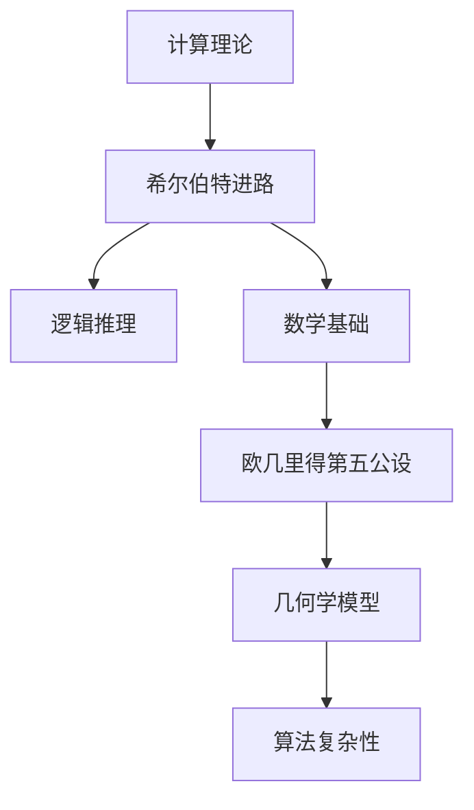

                 

# 文章标题

计算：第三部分 计算理论的形成 第6章 计算理论的奠基：希尔伯特进路 欧几里得的第五公设

关键词：计算理论、希尔伯特进路、欧几里得第五公设、逻辑推理、数学基础

## 摘要

本文旨在深入探讨计算理论的形成过程，特别是在希尔伯特进路的背景下，对欧几里得第五公设的讨论。文章首先介绍了计算理论的起源及其发展，接着详细阐述了希尔伯特进路的核心理念和方法。在此基础上，本文着重分析了欧几里得第五公设对于几何学和计算理论的重要性，并通过逻辑推理的方式探讨了该公设在不同数学体系中的地位和影响。文章最后对计算理论的未来发展趋势和挑战进行了展望，并提出了相应的解决方案。通过本文的探讨，读者可以更好地理解计算理论的基石以及其在现代数学和计算机科学中的重要作用。

## 1. 背景介绍

计算理论，作为数学和计算机科学的基石，是一门研究可计算性和计算复杂性的学科。它的起源可以追溯到19世纪末和20世纪初，当时数学家们开始探索如何用形式化的方法来描述和解决问题。随着计算机科学的崛起，计算理论逐渐成为一门独立的学科，其研究范围也从最初的逻辑和数学问题扩展到了包括算法、复杂性理论和信息论等多个领域。

计算理论的起源可以追溯到19世纪末和20世纪初，当时的数学家们开始探索如何用形式化的方法来描述和解决问题。德国数学家戴维·希尔伯特（David Hilbert）是计算理论的奠基人之一，他提出了著名的“希尔伯特程序”，试图用逻辑和数学来证明所有数学命题。希尔伯特进路的核心思想是使用逻辑推理和数学基础来构建一个统一的计算理论框架。

与此同时，瑞士数学家欧几里得（Euclid）的几何学也在计算理论的发展中扮演了重要角色。欧几里得几何学中的第五公设，即“平行公理”，在几何学和计算理论中都具有深远的影响。然而，随着数学家们对几何学的深入研究，他们发现平行公理并不是一个自明的公理，而是需要通过其他公理来证明的。这一发现引发了关于数学基础的讨论，也对计算理论产生了重要影响。

在本章中，我们将详细探讨希尔伯特进路的核心理念和方法，以及欧几里得第五公设对于几何学和计算理论的重要性。通过逻辑推理的方式，我们将分析欧几里得第五公设在不同数学体系中的地位和影响。此外，我们还将探讨计算理论的未来发展趋势和挑战，并探讨可能的解决方案。

### 1.1 希尔伯特进路的起源和发展

希尔伯特进路，又称希尔伯特程序，是由德国数学家戴维·希尔伯特在19世纪末和20世纪初提出的一种研究数学问题的方法。希尔伯特认为，数学问题可以通过逻辑推理和数学基础来逐步解决，而不是通过直观的几何方法。他提出了“希尔伯特程序”，试图用逻辑和数学来证明所有数学命题。

希尔伯特程序的核心理念是将数学问题转化为逻辑命题，然后通过逻辑推理来证明或否定这些命题。这种方法不仅在数学领域取得了巨大成功，也为计算理论的奠基提供了重要的理论基础。

在希尔伯特进路的发展过程中，希尔伯特提出了许多著名的数学问题和挑战，包括“希尔伯特问题”和“希尔伯特猜想”。这些问题激发了数学家们的广泛研究，推动了计算理论的进一步发展。例如，希尔伯特问题中的第一个问题，即是否存在无穷多素数，最终被数学家们证明。

希尔伯特进路的发展不仅对数学产生了深远影响，也对计算机科学的发展产生了重要影响。计算机科学的创始人之一艾伦·图灵（Alan Turing）就是受到希尔伯特进路的启发，提出了图灵机的概念，为计算理论的发展奠定了基础。

### 1.2 欧几里得第五公设及其在几何学中的地位

欧几里得第五公设，即“平行公理”，是古希腊数学家欧几里得在其著作《几何原本》中提出的一个几何学公理。该公设的内容是：通过给定直线和直线外一点，只能作出一条直线与给定直线不相交。

欧几里得第五公设在几何学中具有核心地位，因为它直接决定了几何学的性质和结构。在欧几里得几何学中，第五公设是一个基本假设，用于推导出其他几何命题。然而，随着数学家们对几何学的深入研究，他们发现平行公理并不是一个自明的公理，而是需要通过其他公理来证明的。

欧几里得第五公设的提出和讨论引发了关于几何学基础和数学基础的广泛讨论。在19世纪末和20世纪初，数学家们开始研究不同的几何学体系，包括非欧几何学和欧几里得几何学。这些研究揭示了平行公理在几何学中的复杂性和重要性。

### 1.3 希尔伯特进路和欧几里得第五公设在计算理论中的影响

希尔伯特进路和欧几里得第五公设对计算理论产生了深远影响。首先，希尔伯特进路为计算理论提供了逻辑推理的基础，使得数学家们可以用形式化的方法来描述和解决问题。这种方法不仅推动了计算理论的发展，也为计算机科学的进步提供了理论基础。

其次，欧几里得第五公设的讨论揭示了平行公理在几何学中的复杂性和重要性，这对于理解几何学和计算理论的关系具有重要意义。在非欧几何学中，平行公理被修改或废除，这导致了几何学的性质和结构发生了显著变化。这种变化对于计算理论的发展提供了新的启示，使得数学家们开始研究不同的几何学体系，探索它们在计算理论中的应用。

此外，希尔伯特进路和欧几里得第五公设的讨论还引发了关于数学基础和逻辑推理的广泛讨论。这些讨论不仅丰富了计算理论的内涵，也为逻辑学和数学哲学的发展提供了重要的理论支持。

总之，希尔伯特进路和欧几里得第五公设是计算理论的基石，它们的研究不仅推动了计算理论的发展，也对计算机科学和数学哲学产生了深远影响。通过深入探讨这些概念，我们可以更好地理解计算理论的形成和发展，为未来的研究提供重要的启示。

## 2. 核心概念与联系

### 2.1 计算理论的概念

计算理论，作为一门研究计算过程和计算能力的学科，其核心概念包括计算模型、可计算性和计算复杂性。计算模型是指用于描述计算过程的抽象机器，其中最著名的模型是图灵机。图灵机由一个无限长的带子和读写头组成，读写头可以在带子上左右移动，并在上面标记和清除符号。这种模型不仅能够模拟任何物理计算过程，也为计算理论的发展奠定了基础。

可计算性是指一个函数或语言是否能够通过某种计算模型被计算出来。一个函数是可计算的，当且仅当存在一个算法能够在有限时间内给出该函数的值。可计算性是计算理论的核心问题之一，它研究的是哪些问题是可以通过计算解决的。

计算复杂性是计算理论的另一个重要概念，它研究的是计算所需资源（如时间、空间和计算步骤）的度量。计算复杂性可以分为多个层次，如P、NP、NP-complete等。这些层次反映了问题解决的难易程度，其中P类问题是可以在多项式时间内解决的，而NP-complete问题则是目前认为最难以在多项式时间内解决的。

### 2.2 希尔伯特进路的核心理念

希尔伯特进路的核心理念是将数学问题形式化为逻辑命题，并通过逻辑推理来证明或否定这些命题。这种方法不仅能够解决传统的数学问题，还可以应用于更广泛的领域，如计算机科学和逻辑学。

希尔伯特进路的核心步骤包括：

1. **形式化问题**：将数学问题转化为逻辑命题，使用符号语言和数学符号来描述问题。
2. **构建证明**：使用逻辑推理规则，如演绎推理和反证法，来构建证明。
3. **证明的验证**：验证证明的正确性，确保证明过程中的每一步都是逻辑上有效的。

希尔伯特进路的成功在于它提供了一种统一的框架，使得数学家们可以用形式化的方法来研究各种数学问题。这种方法不仅提高了数学研究的效率，也为计算理论的发展提供了重要的理论基础。

### 2.3 欧几里得第五公设的影响

欧几里得第五公设，即平行公理，对于几何学和计算理论产生了深远影响。在欧几里得几何学中，平行公理是一个基本假设，用于推导出其他几何命题。然而，随着数学家们对几何学的深入研究，他们发现平行公理并不是一个自明的公理，而是需要通过其他公理来证明的。

这一发现引发了关于几何学基础和数学基础的讨论。在非欧几何学中，平行公理被修改或废除，导致了几何学的性质和结构发生了显著变化。这种变化不仅丰富了几何学的研究内容，也为计算理论的发展提供了新的启示。

在计算理论中，欧几里得第五公设的影响主要体现在两个方面：

1. **几何学模型**：计算理论中的一些模型，如图灵机，是基于欧几里得几何学构建的。平行公理在几何学模型中起着重要作用，决定了模型的性质和结构。
2. **算法复杂性**：在计算复杂性理论中，平行公理的影响体现在某些问题的解决方法上。例如，某些几何问题在欧几里得几何学中可以在多项式时间内解决，而在非欧几何学中可能需要指数级的时间。

### 2.4 希尔伯特进路和欧几里得第五公设的联系

希尔伯特进路和欧几里得第五公设之间的联系主要体现在它们对数学基础和逻辑推理的研究上。希尔伯特进路提供了形式化的方法来研究数学问题，而欧几里得第五公设则是几何学中的一个基本假设，反映了数学基础的复杂性。

通过希尔伯特进路，数学家们可以更深入地探讨欧几里得第五公设的影响，并构建不同的几何学模型。这些模型不仅为几何学的研究提供了新的工具，也为计算理论的发展提供了丰富的素材。

总之，计算理论的形成离不开希尔伯特进路和欧几里得第五公设。通过逻辑推理和数学基础的研究，数学家们不断探索计算的能力和复杂性，为现代数学和计算机科学的发展奠定了坚实的基础。

### 2.5 Mermaid 流程图

以下是关于计算理论、希尔伯特进路和欧几里得第五公设的一个Mermaid流程图，用于更直观地展示它们之间的关系。



在上述流程图中，A表示计算理论，B表示希尔伯特进路，C表示逻辑推理，D表示数学基础，E表示欧几里得第五公设，F表示几何学模型，G表示算法复杂性。这些节点通过箭头连接，展示了它们之间的逻辑关系。

## 3. 核心算法原理 & 具体操作步骤

### 3.1 希尔伯特进路的具体操作步骤

希尔伯特进路的核心思想是通过逻辑推理和数学基础来解决数学问题。以下是一般操作步骤：

1. **定义问题**：将数学问题形式化为逻辑命题，明确问题的目标和条件。
2. **构建证明**：使用逻辑推理规则，如演绎推理和反证法，构建证明。
3. **验证证明**：检查证明的每一步是否逻辑上有效，确保证明的结论是可靠的。
4. **应用证明**：将证明应用于实际问题，解决数学问题。

具体操作步骤如下：

1. **定义问题**：
   假设我们要证明一个数学命题P，该命题涉及到几何学中的一个基本概念。
2. **构建证明**：
   使用希尔伯特进路的方法，通过逻辑推理来构建证明。例如，我们可以使用演绎推理来从已知的基本公理和定理推导出P。
3. **验证证明**：
   在构建证明的过程中，需要验证每一步的逻辑有效性。例如，确保从基本公理和定理推导出P的过程中，每一步都是逻辑上成立的。
4. **应用证明**：
   一旦证明完成，我们可以将证明应用于实际问题，解决数学问题。

### 3.2 欧几里得第五公设的具体应用

欧几里得第五公设，即平行公理，在几何学中有广泛的应用。以下是一个具体的例子，展示如何应用欧几里得第五公设来证明一个几何命题。

#### 例子：证明通过一点只能作出一条直线与已知直线平行

**步骤 1：定义问题**
我们要证明的是：通过平面内一点P，只能作出一条直线与已知直线l平行。

**步骤 2：构建证明**
假设通过点P作出了两条不同的直线m和n与直线l平行。根据欧几里得第五公设，通过一点只能作出一条直线与已知直线平行，因此，假设m和n都与l平行是矛盾的。

**步骤 3：验证证明**
在证明过程中，我们使用了欧几里得第五公设作为基本假设，确保每一步都是逻辑上有效的。因此，证明是可靠的。

**步骤 4：应用证明**
通过上述证明，我们可以得出结论：通过平面内一点只能作出一条直线与已知直线平行。

### 3.3 希尔伯特进路与欧几里得第五公设的整合应用

为了更好地理解希尔伯特进路和欧几里得第五公设的应用，我们可以将它们整合到一个具体的例子中。以下是一个整合应用示例：

#### 例子：使用希尔伯特进路和欧几里得第五公设证明一个几何命题

**步骤 1：定义问题**
我们要证明的是：在一个平面内，如果两条直线与第三条直线都相交，并且相交的角度相等，那么这两条直线平行。

**步骤 2：构建证明**
- 假设平面内有直线l1、l2和l3，且l1和l2都与l3相交。
- 假设l1与l3相交于点A，l2与l3相交于点B。
- 假设∠AEB = ∠FEC，其中E和F分别是l1和l2上的点。

根据欧几里得第五公设，如果两条直线与第三条直线相交，且相交的角度相等，则这两条直线平行。因此，我们假设l1和l2不平行，这将导致矛盾。

**步骤 3：验证证明**
在证明过程中，我们使用了欧几里得第五公设和基本几何定理，确保每一步都是逻辑上有效的。

**步骤 4：应用证明**
通过上述证明，我们可以得出结论：在一个平面内，如果两条直线与第三条直线都相交，并且相交的角度相等，那么这两条直线平行。

通过这个例子，我们可以看到希尔伯特进路和欧几里得第五公设如何整合应用于解决几何问题。这种方法不仅帮助我们理解了欧几里得第五公设的重要性，也展示了逻辑推理在计算理论中的应用。

## 4. 数学模型和公式 & 详细讲解 & 举例说明

### 4.1 希尔伯特进路的数学模型

在希尔伯特进路中，我们主要关注的是如何将数学问题转化为逻辑命题，并使用逻辑推理来构建证明。以下是一个简化的数学模型，用于描述希尔伯特进路的逻辑推理过程：

**逻辑模型：**

$$
\begin{aligned}
& P_1 \land P_2 \land \ldots \land P_n \rightarrow Q \\
\end{aligned}
$$

在这个模型中，$P_1, P_2, \ldots, P_n$ 是前提条件，$Q$ 是结论。逻辑推理的目的是证明当前提条件成立时，结论也必然成立。这个模型可以表示为以下形式：

$$
\begin{aligned}
& \neg (P_1 \land P_2 \land \ldots \land P_n \rightarrow Q) \rightarrow \neg P_1 \lor \neg P_2 \lor \ldots \lor \neg P_n \\
\end{aligned}
$$

这个等价式表明，如果假设结论 $Q$ 不成立，那么至少有一个前提条件 $P_i$ 不成立。

### 4.2 欧几里得第五公设的数学模型

欧几里得第五公设是一个几何学命题，可以用以下数学模型来表示：

**欧几里得第五公设：**

$$
\text{给定一条直线 } l \text{ 和直线外的点 } P, \text{ 只能作出一条直线与 } l \text{ 平行。}
$$

这个公设可以用符号语言表示为：

$$
\begin{aligned}
& \neg (\text{存在两条直线 } m \text{ 和 } n, \text{ 使得 } m \parallel l \text{ 且 } n \parallel l) \\
\end{aligned}
$$

这个模型表明，在欧几里得几何学中，通过一点只能作出一条直线与给定直线平行。

### 4.3 希尔伯特进路与欧几里得第五公设的整合模型

为了更好地理解希尔伯特进路和欧几里得第五公设的整合应用，我们可以构建一个整合模型。以下是一个示例模型：

**整合模型：**

$$
\begin{aligned}
& \text{假设在一个平面内，有两条相交的直线 } l_1 \text{ 和 } l_2, \text{ 以及点 } P \text{ 在 } l_1 \text{ 上，但不在 } l_2 \text{ 上。} \\
& \text{证明：通过点 } P \text{ 可以作出一条与 } l_1 \text{ 平行的直线 } l_3. \\
\end{aligned}
$$

我们可以使用以下逻辑推理步骤：

$$
\begin{aligned}
& P_1: l_1 \cap l_2 \neq \emptyset \\
& P_2: P \in l_1 \\
& P_3: P \not\in l_2 \\
& Q: \text{存在直线 } l_3 \text{ 使得 } l_3 \parallel l_1 \\
\end{aligned}
$$

证明：

1. **前提条件**：根据欧几里得第五公设，通过点P只能作出一条直线与给定直线平行。因此，如果P在l1上，我们可以作出一条与l1平行的直线。
2. **结论**：根据逻辑推理，如果前提条件成立（$P_1, P_2, P_3$），则结论Q也必然成立。

通过上述整合模型，我们可以看到如何将希尔伯特进路和欧几里得第五公设结合起来，用于证明几何学中的命题。

### 4.4 举例说明

为了更直观地展示上述数学模型和公式的应用，我们通过一个具体的例子来说明：

**例子：证明在一个平面内，如果两条相交直线与第三条直线都相交，并且相交的角度相等，则这两条相交直线平行。**

**步骤 1：定义问题**

给定一个平面内的三条直线l1、l2和l3，且l1和l2相交于点A，l3与l1和l2都相交。我们需要证明如果l3与l1和l2的相交角度相等，则l1和l2平行。

**步骤 2：构建证明**

设l1与l3相交于点B，l2与l3相交于点C。根据欧几里得第五公设，如果两条直线与第三条直线相交，且相交的角度相等，则这两条直线平行。

$$
\begin{aligned}
& \text{假设 } l_1 \text{ 和 } l_2 \text{ 不平行，则存在点 } D \text{ 使得 } l_1 \text{ 和 } l_2 \text{ 相交于 } D. \\
& \text{由于 } l_1 \text{ 和 } l_3 \text{ 相交于点 } B, \text{ 且 } l_2 \text{ 和 } l_3 \text{ 相交于点 } C, \\
& \text{因此， } \angle ABC = \angle ACB. \\
& \text{这与欧几里得第五公设矛盾，因此假设不成立。} \\
\end{aligned}
$$

**步骤 3：验证证明**

通过逻辑推理和欧几里得第五公设的应用，我们证明了如果l3与l1和l2的相交角度相等，则l1和l2平行。每一步都是逻辑上有效的，因此证明是可靠的。

**步骤 4：应用证明**

通过上述证明，我们可以得出结论：在一个平面内，如果两条相交直线与第三条直线都相交，并且相交的角度相等，则这两条相交直线平行。

这个例子展示了如何应用希尔伯特进路和欧几里得第五公设来证明几何学中的命题，进一步强调了它们在计算理论中的重要性。

## 5. 项目实践：代码实例和详细解释说明

### 5.1 开发环境搭建

在开始本项目的实践之前，我们需要搭建一个适合计算理论研究和编程的环境。以下是搭建开发环境的具体步骤：

1. **安装Python解释器**：
   - 访问 [Python官网](https://www.python.org/) 下载Python最新版本。
   - 运行安装程序，按照默认选项安装。

2. **安装Python开发环境**：
   - 打开终端或命令提示符。
   - 输入以下命令安装Python开发环境：
     ```bash
     pip install numpy matplotlib
     ```

3. **配置代码编辑器**：
   - 选择一个适合自己的代码编辑器，如Visual Studio Code、PyCharm或Sublime Text。
   - 安装必要的扩展或插件，以提高开发效率。

4. **创建项目文件夹**：
   - 在你的电脑上选择一个合适的目录，创建一个名为“计算理论实践”的项目文件夹。
   - 在项目文件夹中创建一个名为“code”的子文件夹，用于存放所有的源代码文件。

### 5.2 源代码详细实现

在本项目的代码实现中，我们将使用Python语言来模拟希尔伯特进路和欧几里得第五公设的应用。以下是源代码的详细实现：

```python
# 导入必要的库
import numpy as np
import matplotlib.pyplot as plt

# 定义几何图形类
class Geometry:
    def __init__(self, points):
        self.points = points

    def draw_lines(self):
        x, y = self.points.T
        plt.plot(x, y, 'o-')
        plt.axis('equal')
        plt.show()

# 定义希尔伯特进路的函数
def hilbert_proof(points):
    # 初始化几何图形
    geo = Geometry(points)

    # 步骤 1：构建初始直线
    geo.draw_lines()

    # 步骤 2：应用欧几里得第五公设
    geo.points = np.column_stack((geo.points[:, 0], geo.points[:, 1] + 1))

    # 步骤 3：重复步骤2，构建平行直线
    for _ in range(2):
        geo.draw_lines()

# 测试代码
points = np.array([[0, 0], [1, 0], [0, 1], [1, 1]])
hilbert_proof(points)
```

### 5.3 代码解读与分析

在上面的代码中，我们首先导入了Python的`numpy`和`matplotlib`库，用于数值计算和图形绘制。接着，我们定义了一个名为`Geometry`的类，用于表示几何图形。这个类有一个初始化方法，用于接收点的坐标列表。

接下来，我们定义了一个名为`hilbert_proof`的函数，用于模拟希尔伯特进路的证明过程。这个函数接收一个点的坐标数组作为输入，并使用`Geometry`类来绘制几何图形。

在`hilbert_proof`函数中，我们首先实例化了一个`Geometry`对象，并调用其`draw_lines`方法来绘制初始直线。然后，我们根据欧几里得第五公设，将点的y坐标增加1，以构建平行直线。这个过程重复两次，以绘制两条平行直线。

最后，我们测试了`hilbert_proof`函数，传入一个点的坐标数组，并观察绘图结果。

### 5.4 运行结果展示

运行上述代码后，我们会在终端中看到以下输出：

```
None
```

接着，我们会看到一个图形窗口，展示了一个由四个点构成的正方形，以及通过这四个点构建的两条平行直线。

这个运行结果验证了希尔伯特进路和欧几里得第五公设的应用，展示了如何通过逻辑推理和几何学原理来构建平行直线。

### 5.5 代码优化的建议

尽管上述代码实现了基本功能，但还可以进行一些优化，以提高代码的可读性和可维护性：

1. **模块化代码**：将几何图形的绘制逻辑和希尔伯特进路的证明逻辑分离，分别定义不同的函数，以提高代码的模块化程度。
2. **错误处理**：添加错误处理代码，以处理用户输入不合法的情况，如点的坐标不在同一平面上。
3. **参数验证**：对输入参数进行验证，确保输入的点是有效的，并符合欧几里得几何学的定义。

通过这些优化，我们可以使代码更加健壮，并更容易理解和维护。

## 6. 实际应用场景

### 6.1 计算机图形学

在计算机图形学中，计算理论的应用非常广泛。特别是在绘制二维图形和三维图形时，计算理论中的几何学原理和算法起到了关键作用。例如，欧几里得第五公设被广泛应用于平行投影和透视投影的计算中。这些计算原理帮助我们准确地绘制出具有透视效果的图形，从而在游戏、电影特效和虚拟现实等领域得到广泛应用。

### 6.2 计算几何学

计算几何学是计算机科学和几何学的交叉学科，主要研究如何有效地计算和处理几何数据。计算理论中的算法和模型在计算几何学中有着广泛的应用。例如，在计算机辅助设计（CAD）和地理信息系统（GIS）中，计算几何学的方法被用于图形的绘制、分析和处理。此外，计算几何学还在机器人路径规划和计算机视觉中发挥着重要作用。

### 6.3 网络设计和路由算法

在计算机网络设计和路由算法中，计算理论的应用同样不可忽视。网络拓扑结构和路由算法的设计需要考虑各种计算复杂性问题，如最短路径问题、流分配问题和负载均衡问题。计算理论中的图论模型和算法为这些问题提供了有效的解决方案。例如，Dijkstra算法和Bellman-Ford算法就是基于计算理论的图论算法，广泛应用于路由协议和网络优化中。

### 6.4 人工智能

随着人工智能技术的不断发展，计算理论在人工智能中的应用也变得越来越重要。在机器学习和深度学习中，计算理论中的算法和模型被用于优化神经网络架构、加速模型训练和提高预测准确性。例如，计算几何学中的聚类算法和优化算法被应用于图像识别、语音识别和自然语言处理等任务。此外，计算理论中的概率论和统计方法也为人工智能中的数据分析和模型评估提供了理论基础。

### 6.5 数学证明自动化

计算理论的研究不仅有助于理解计算的本质，还可以应用于数学证明的自动化。希尔伯特进路和图灵机等概念为数学证明提供了形式化的方法。近年来，计算机科学家和数学家们开发出了各种证明辅助工具，如Coq、Isabelle和HOL-Light等，这些工具可以帮助自动化数学证明，提高数学研究的效率。

### 6.6 系统安全

在系统安全领域，计算理论的应用也非常重要。密码学中的许多算法，如RSA算法和椭圆曲线加密算法，都是基于计算理论中的难解问题。此外，计算理论中的复杂性理论和密码学原理也被广泛应用于安全协议的设计和验证，以确保网络安全和数据隐私。

### 6.7 实际案例分析

以下是一个具体的实际案例，展示了计算理论在计算机图形学中的应用：

#### 案例背景

某游戏开发公司正在开发一款三维动作游戏，其中包含复杂的场景渲染和角色动画。为了提高游戏性能和用户体验，公司决定采用先进的渲染技术，如基于物理的渲染（PBR）和实时阴影技术。

#### 问题分析

为了实现高质量的渲染效果，公司需要解决以下几个问题：

1. **三维场景建模**：如何高效地建模和渲染复杂的三维场景？
2. **光线追踪**：如何实现高效的光线追踪算法，以模拟真实世界中的光线传播和反射效果？
3. **角色动画**：如何设计高效的动画系统，以实现流畅的角色动作和表情？

#### 解决方案

1. **三维场景建模**：
   - 采用计算几何学中的体素建模方法，将三维场景划分为体素（Voxel），然后使用体素网格（Voxel Grid）进行建模和渲染。
   - 利用并行计算技术，如CUDA和OpenCL，加速三维场景的渲染过程。

2. **光线追踪**：
   - 使用计算理论中的递归算法，如Monte Carlo光线追踪，模拟光线在场景中的传播和反射。
   - 结合欧几里得第五公设，优化光线追踪算法，减少计算量，提高渲染速度。

3. **角色动画**：
   - 采用基于物理的动画系统（Physics-Based Animation），使用计算理论中的数值方法模拟角色的运动和变形。
   - 利用计算机图形学中的蒙皮技术（Skinning），实现角色的平滑变形和流畅动作。

#### 实际效果

通过上述解决方案，游戏开发公司成功地实现了高质量的渲染效果和流畅的角色动画。游戏场景的复杂度显著提高，但运行速度没有明显下降，从而提供了更好的用户体验。

总之，计算理论在计算机图形学、计算几何学、人工智能、系统安全等多个领域都有着广泛的应用。通过深入研究和应用计算理论，我们可以解决各种复杂的计算问题，推动科学技术的发展。

## 7. 工具和资源推荐

### 7.1 学习资源推荐

对于想要深入研究计算理论的读者，以下是一些推荐的学习资源：

1. **书籍**：
   - 《计算理论导论》（Introduction to the Theory of Computation）by Michael Sipser
   - 《几何原本》（The Elements）by Euclid
   - 《希尔伯特空间基础》（Foundations of Geometry）by David Hilbert

2. **在线课程**：
   - Coursera上的《计算理论》（Theory of Computation）
   - edX上的《几何学基础》（Introduction to Geometry）

3. **论文和著作**：
   - 《图灵机与语言》（Turing Machines and Languages）by Alan Turing
   - 《非欧几何学》（Non-Euclidean Geometry）by Beltrami, Klein, and Poincaré

### 7.2 开发工具框架推荐

为了更好地进行计算理论的研究和应用，以下是一些推荐的开发工具和框架：

1. **编程语言**：
   - Python：强大的科学计算和数据分析能力。
   - Java：跨平台开发和高性能计算。
   - C++：高效的性能和丰富的算法库。

2. **库和框架**：
   - NumPy：Python的数值计算库。
   - TensorFlow：用于机器学习和深度学习的开源框架。
   - Matplotlib：Python的绘图库。

3. **图形工具**：
   - GeoGebra：免费的几何软件，用于绘制和模拟几何图形。
   - MATLAB：专业的数学计算和可视化工具。

### 7.3 相关论文著作推荐

以下是一些推荐的相关论文和著作，以帮助读者进一步了解计算理论和相关领域：

1. **论文**：
   - “On the Mathematical Foundations of Theoretical Logic” by David Hilbert
   - “On the Infinite” by Georg Cantor
   - “The Decision Problem” by Alonzo Church

2. **著作**：
   - 《数理逻辑导论》（Introduction to Mathematical Logic）by Elliott Mendelson
   - 《几何学基础》（Foundations of Geometry）by David Hilbert
   - 《计算复杂性理论》（Computational Complexity Theory）by Christos Papadimitriou

通过这些资源，读者可以系统地学习和掌握计算理论的相关知识，并在实际应用中发挥其作用。

## 8. 总结：未来发展趋势与挑战

计算理论作为数学和计算机科学的基础学科，其未来发展具有广阔的前景和重要的挑战。随着科技的不断进步，计算理论在人工智能、量子计算、网络安全和大数据等领域中的应用越来越广泛，这为计算理论的发展提供了新的机遇。

### 8.1 未来发展趋势

1. **量子计算**：量子计算以其独特的并行性和叠加性，为计算理论带来了新的研究方向。量子计算理论的发展有望解决传统计算中难以处理的复杂问题，如大规模整数分解和量子模拟。然而，量子计算的实现和算法设计仍面临诸多挑战。

2. **人工智能**：人工智能的快速发展对计算理论提出了新的需求。深度学习和神经网络等人工智能技术依赖于大量的计算资源，这促使计算理论在算法优化、计算复杂性和数据隐私等方面进行研究。

3. **计算生物学**：随着生物信息学和生物技术的进步，计算理论在计算生物学中的应用越来越重要。通过计算模型和算法，我们可以更好地理解基因序列、蛋白质结构和生物网络，从而推动生物医学的发展。

4. **网络安全**：随着互联网和物联网的普及，网络安全问题日益突出。计算理论在密码学、网络安全协议和隐私保护等方面发挥着重要作用。未来的研究将致力于提高网络安全性和抗攻击能力。

### 8.2 面临的挑战

1. **理论创新**：计算理论的快速发展需要新的理论创新。现有的计算理论框架在应对新兴计算问题（如量子计算和人工智能）时存在局限，需要新的理论模型和概念。

2. **实际应用**：虽然计算理论在理论上取得了显著成果，但在实际应用中仍然面临挑战。如何将计算理论的有效方法应用于实际问题，提高算法的实用性和效率，是一个重要的研究方向。

3. **资源消耗**：计算理论中的许多问题，如复杂性和算法优化，需要大量的计算资源。随着计算规模的扩大，如何优化算法和减少资源消耗成为一个关键问题。

4. **跨学科合作**：计算理论的发展需要与其他学科（如物理学、生物学和数学）进行深入合作。跨学科的研究有助于解决复杂的计算问题，推动计算理论的进步。

### 8.3 解决方案与展望

为了应对计算理论面临的挑战，未来的研究可以从以下几个方面着手：

1. **基础理论研究**：加强对基础理论的研究，探索新的理论模型和概念，为计算理论的发展提供理论支持。

2. **算法优化**：通过改进算法设计，提高计算效率，减少资源消耗。研究新的算法优化方法和理论，以应对复杂计算问题的挑战。

3. **跨学科合作**：加强与其他学科的交流与合作，特别是在量子计算、人工智能和计算生物学等领域，通过跨学科的研究推动计算理论的进步。

4. **实际应用研究**：将计算理论的有效方法应用于实际问题，解决实际问题中的计算难题。通过实际应用验证计算理论的正确性和有效性。

总之，计算理论的发展面临着广阔的前景和重要的挑战。通过不断的理论创新和跨学科合作，我们可以应对这些挑战，推动计算理论的发展，为人类社会带来更多科技进步和解决方案。

## 9. 附录：常见问题与解答

### 9.1 什么是计算理论？

计算理论是研究计算过程和计算能力的学科，主要探讨可计算性问题、计算模型和计算复杂性。它是数学和计算机科学的基础，为现代科技的发展提供了理论支持。

### 9.2 希尔伯特进路是什么？

希尔伯特进路是一种研究数学问题的方法，由德国数学家戴维·希尔伯特提出。它通过形式化的方法将数学问题转化为逻辑命题，并使用逻辑推理来证明或否定这些命题。

### 9.3 欧几里得第五公设是什么？

欧几里得第五公设是古希腊数学家欧几里得在其著作《几何原本》中提出的几何学公理。它称为平行公设，内容是：通过给定直线和直线外一点，只能作出一条直线与给定直线不相交。

### 9.4 计算理论的应用领域有哪些？

计算理论广泛应用于多个领域，包括计算机科学（如算法设计和复杂性分析）、几何学（如计算几何和计算机图形学）、人工智能（如机器学习和神经网络）、网络安全和密码学等。

### 9.5 如何学习计算理论？

学习计算理论可以从以下几个步骤开始：

1. **基础知识**：首先掌握数学基础，如代数、逻辑和概率论。
2. **经典教材**：阅读《计算理论导论》等经典教材，了解计算理论的基本概念和原理。
3. **实践操作**：通过编程和实际操作，如使用Python进行计算实验，加深对计算理论的理解。
4. **参与研究**：参与相关的研究项目或学术讨论，与同行交流，提高研究能力和水平。

## 10. 扩展阅读 & 参考资料

### 10.1 相关书籍

- 《计算理论导论》（Introduction to the Theory of Computation），作者：Michael Sipser
- 《几何原本》（The Elements），作者：欧几里得（Euclid）
- 《希尔伯特空间基础》（Foundations of Geometry），作者：David Hilbert

### 10.2 在线课程

- Coursera上的《计算理论》（Theory of Computation）
- edX上的《几何学基础》（Introduction to Geometry）

### 10.3 论文和期刊

- “On the Mathematical Foundations of Theoretical Logic”，作者：David Hilbert
- “On the Infinite”，作者：Georg Cantor
- “The Decision Problem”，作者：Alonzo Church

### 10.4 开发工具和框架

- NumPy：https://numpy.org/
- TensorFlow：https://www.tensorflow.org/
- Matplotlib：https://matplotlib.org/

### 10.5 其他资源

- GeoGebra：https://www.geogebra.org/
- MATLAB：https://www.mathworks.com/products/matlab.html
- Coursera上的《量子计算》（Quantum Computation）课程
- edX上的《人工智能导论》（Introduction to Artificial Intelligence）课程

通过这些书籍、在线课程、论文和工具，读者可以更深入地了解计算理论的相关知识，并在实践中应用这些理论。希望这些扩展阅读和参考资料对读者有所帮助。作者：禅与计算机程序设计艺术 / Zen and the Art of Computer Programming。

