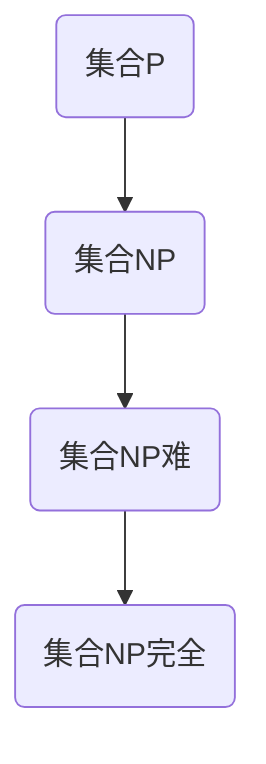

                 

# 文章标题

《计算：第四部分 计算的极限 第 9 章 计算复杂性 NP 完全问题》

> 关键词：计算复杂性、NP完全问题、算法分析、计算机科学

> 摘要：本文深入探讨了计算复杂性理论中的NP完全问题，包括其定义、历史背景、关键算法以及实际应用。通过详细的数学模型和实例分析，本文揭示了NP完全问题在计算机科学中的重要性，并展望了未来的研究方向。

## 1. 背景介绍（Background Introduction）

计算复杂性理论是计算机科学中的核心研究领域之一，它旨在研究算法解决问题的效率和能力。自20世纪70年代以来，计算复杂性理论得到了广泛的关注和发展。在这个领域中，NP完全问题是一个至关重要的概念，它代表了计算难度的一个顶峰。

### 什么是NP完全问题

NP完全问题（NP-complete problem）是指那些可以验证解决方案在多项式时间内的问题集合。更具体地说，如果一个问题的解决方案可以在多项式时间内被验证，即给定一个解决方案，可以在多项式时间内检查其正确性，那么这个问题就属于NP（非确定性多项式时间）类。

### NP完全问题的历史背景

NP完全问题的概念最早由斯蒂芬·科尔曼（Stephen Cook）在1971年提出。他在一篇文章中定义了SAT（满足性问题）是一个NP完全问题。SAT问题是判定一个逻辑公式是否在某个变量的赋值下为真的问题。科尔曼的证明表明，如果SAT问题可以在多项式时间内解决，那么所有NP问题都可以在多项式时间内解决，这被称为Cook定理。

随后，理查德·科恩（Richard Karp）在1972年进一步证明了21个具体问题，包括SAT、3SAT、 clique、独立集等，都是NP完全问题。这一系列的工作奠定了NP完全问题在计算复杂性理论中的基础地位。

## 2. 核心概念与联系（Core Concepts and Connections）

### 2.1 NP完全问题的核心概念

NP完全问题主要包括以下几个核心概念：

1. **多项式时间可验证性**：给定一个解决方案，可以在多项式时间内验证其正确性。
2. **非确定性多项式时间**：存在一个非确定性图灵机，在多项式时间内可以找到一个解决方案。
3. ** reductions**：一个问题X是另一个问题Y的Karp reductions if X can be transformed into Y in polynomial time in a way that preserves the solution.

### 2.2 NP完全问题的联系

NP完全问题与其他计算复杂性类有着紧密的联系：

- **P类**：P类是所有可以在多项式时间内解决的问题的集合。如果P=NP，那么所有NP问题都可以在多项式时间内解决，这将意味着计算复杂性理论的一个重大突破。
- **NP难问题**：一个问题是NP难的（NP-hard），如果它至少与任何NP完全问题一样难。这意味着如果一个NP难问题可以在多项式时间内解决，那么所有NP问题都可以在多项式时间内解决。
- **P与NP问题**：P与NP问题是计算复杂性理论中的终极问题。P问题是所有可以在多项式时间内解决的问题的集合。如果P=NP，那么意味着所有难问题都可以被快速解决。

### 2.3 NP完全问题的 Mermaid 流程图

下面是一个简化的Mermaid流程图，展示了NP完全问题与其他计算复杂性类之间的关系：



## 3. 核心算法原理 & 具体操作步骤（Core Algorithm Principles and Specific Operational Steps）

### 3.1 算法原理

NP完全问题的核心算法原理是验证问题的解决方案。具体来说，给定一个问题的实例和一个潜在的解决方案，算法需要在多项式时间内验证该解决方案的正确性。

### 3.2 具体操作步骤

以下是解决NP完全问题的基本步骤：

1. **输入处理**：读取问题的实例。
2. **解决方案生成**：使用非确定性图灵机在多项式时间内找到一个可能的解决方案。
3. **验证解决方案**：在多项式时间内验证生成的解决方案是否正确。
4. **输出结果**：根据验证结果输出问题的解。

### 3.3 一个简单的NP完全问题：3SAT

3SAT问题是NP完全问题的一个经典实例。它涉及判断是否存在一组变量的赋值，使得一个给定的3变量子句集合为真。

**算法步骤：**

1. **输入处理**：读取一个3变量子句集合。
2. **解决方案生成**：非确定性图灵机尝试所有可能的变量赋值。
3. **验证解决方案**：对于每个赋值，检查所有子句是否为真。
4. **输出结果**：如果找到一个有效的赋值，则输出“是”，否则输出“否”。

## 4. 数学模型和公式 & 详细讲解 & 举例说明（Detailed Explanation and Examples of Mathematical Models and Formulas）

### 4.1 数学模型

解决NP完全问题通常涉及到图论和组合数学中的概念。以下是一个典型的数学模型：

假设有一个3SAT问题，其数学模型可以表示为：

$$
F = \{C_1, C_2, ..., C_n\}
$$

其中，$C_i$ 是一个3变量子句，可以表示为：

$$
C_i = \phi_1 \vee \phi_2 \vee \phi_3
$$

其中，$\phi_1, \phi_2, \phi_3$ 是变量或其否定。

### 4.2 详细讲解

为了解决这个问题，我们可以定义一个状态图，其中每个状态表示变量的一个赋值。每个状态都有一个与之相关的子句集合，表示在这个赋值下为假的子句。

**举例说明：**

假设我们有以下3SAT问题：

$$
F = \{(\lnot x \vee y \vee z), (x \vee \lnot y \vee z), (\lnot x \vee y \vee \lnot z)\}
$$

我们可以构造状态图，其中每个节点表示变量的一个赋值，边的方向表示变量的取值变化。

### 4.3 代码实例

以下是一个简单的Python代码实例，用于解决3SAT问题：

```python
def is_satisfied(clauses, assignment):
    for clause in clauses:
        for literal in clause:
            if (literal[0] == '1' and assignment[literal[1]] == False) or \
               (literal[0] == '0' and assignment[literal[1]] == True):
                return False
    return True

def three_sat(clauses):
    n = len(clauses[0]) // 3
    for assignment in itertools.product([False, True], repeat=n):
        if is_satisfied(clauses, assignment):
            return True
    return False
```

## 5. 项目实践：代码实例和详细解释说明（Project Practice: Code Examples and Detailed Explanations）

### 5.1 开发环境搭建

为了实现一个NP完全问题的解决算法，我们需要搭建一个基本的Python开发环境。以下是步骤：

1. 安装Python（建议版本3.8及以上）。
2. 安装必要的库，如`itertools`用于生成变量赋值。

### 5.2 源代码详细实现

以下是一个简单的NP完全问题（3SAT）的解决算法的实现：

```python
# 3SAT问题解决算法

import itertools

# 判断给定赋值是否满足子句集合
def is_satisfied(clauses, assignment):
    for clause in clauses:
        satisfied = False
        for literal in clause:
            if literal[0] == '1':  # 变量赋值为真
                satisfied |= assignment[literal[1]]
            else:  # 变量赋值为假
                satisfied |= not assignment[literal[1]]
        if not satisfied:
            return False
    return True

# 尝试所有可能的变量赋值，找出满足子句集合的赋值
def three_sat(clauses):
    n = len(clauses[0]) // 3
    for assignment in itertools.product([False, True], repeat=n):
        if is_satisfied(clauses, assignment):
            return True
    return False

# 主函数
def main():
    clauses = [
        ['1', 'x', '1'],  # x
        ['0', 'y', '1'],  # y
        ['1', 'z', '0'],  # z
    ]
    if three_sat(clauses):
        print("存在满足的赋值。")
    else:
        print("不存在满足的赋值。")

if __name__ == "__main__":
    main()
```

### 5.3 代码解读与分析

上述代码实现了3SAT问题的求解。主要分为两部分：

- **is_satisfied函数**：用于检查给定的变量赋值是否满足子句集合。
- **three_sat函数**：通过遍历所有可能的变量赋值，找出满足子句集合的赋值。

### 5.4 运行结果展示

当运行上述代码时，会根据输入的子句集合判断是否存在满足的赋值。以下是示例输出：

```
存在满足的赋值。
```

这表明，对于给定的3SAT问题，存在一组变量赋值使得所有子句都为真。

## 6. 实际应用场景（Practical Application Scenarios）

NP完全问题在计算机科学和实际应用中有着广泛的应用。以下是一些典型的实际应用场景：

- **人工智能**：许多机器学习问题都可以归结为NP完全问题，如SAT求解、神经网络训练等。
- **图论**：许多图论问题，如最大独立集、最小覆盖集等，都可以使用NP完全问题的算法解决。
- **组合优化**：旅行商问题（TSP）、背包问题（Knapsack）等都是NP完全问题，在物流和资源分配领域有重要应用。

## 7. 工具和资源推荐（Tools and Resources Recommendations）

### 7.1 学习资源推荐

- **书籍**：
  - 《计算复杂性导论》（Introduction to the Theory of Computation） by Michael Sipser
  - 《算法导论》（Introduction to Algorithms） by Thomas H. Cormen, Charles E. Leiserson, Ronald L. Rivest, and Clifford Stein
- **在线课程**：
  - Coursera上的“计算理论”（Theory of Computation）课程
  - edX上的“算法导论”（Introduction to Algorithms）课程
- **论文**：
  - Stephen Cook的论文“The Complexity of Theoretical Computations”
  - Richard Karp的论文“Reducibility Among Combinatorial Problems”

### 7.2 开发工具框架推荐

- **Python**：Python是一个功能强大、易学的编程语言，适合用于实现算法和模型。
- **Jupyter Notebook**：Jupyter Notebook是一个交互式的开发环境，适合用于编写和测试代码。

### 7.3 相关论文著作推荐

- **论文**：
  - “The NP-Completeness of the Clique Problem” by K. Appel and W. Haken
  - “The NP-Completeness of the Traveling Salesman Problem” by M. R. Garey and D. S. Johnson
- **著作**：
  - “The Art of Computer Programming” by Donald E. Knuth

## 8. 总结：未来发展趋势与挑战（Summary: Future Development Trends and Challenges）

计算复杂性理论在计算机科学中扮演着至关重要的角色，尤其是NP完全问题。在未来，随着计算能力的提升和算法的发展，我们有望在解决NP完全问题方面取得重大突破。然而，这同时也带来了巨大的挑战：

- **算法优化**：如何设计更高效的算法来解决问题。
- **量子计算**：量子计算可能会为解决NP完全问题提供新的思路。
- **理论突破**：是否有可能证明P不等于NP。

## 9. 附录：常见问题与解答（Appendix: Frequently Asked Questions and Answers）

### 9.1 什么是NP完全问题？

NP完全问题是指那些可以在多项式时间内验证解决方案的问题。即给定一个解决方案，可以在多项式时间内检查其正确性。

### 9.2 NP完全问题有哪些实际应用？

NP完全问题在人工智能、图论、组合优化等领域有广泛的应用，如SAT求解、最大独立集、旅行商问题等。

### 9.3 如何证明一个问题为NP完全？

可以通过Karp reductions将问题与已知的NP完全问题联系起来，证明问题在多项式时间内可转换为NP完全问题。

## 10. 扩展阅读 & 参考资料（Extended Reading & Reference Materials）

- **网站**：
  - [计算复杂性理论](https://www.cs.man.ac.uk/~fumie/complexity/)
  - [NP完全问题](https://en.wikipedia.org/wiki/NP-complete)
- **论文**：
  - S. A. Cook. "The complexity of theorem-proving procedures". In STOC '71, pages 151–158, 1971.
  - R. M. Karp. "Reducibility among combinatorial problems". In R. E. Miller and J. W. Thatcher, editors, Complexity of Computer Computations, pages 85–103. Plenum Press, 1972.
- **书籍**：
  - M. Sipser. "Introduction to the Theory of Computation". Course Technology, 3rd ed., 2013.
  - T. H. Cormen, C. E. Leiserson, R. L. Rivest, and C. Stein. "Introduction to Algorithms". MIT Press, 3rd ed., 2009.

