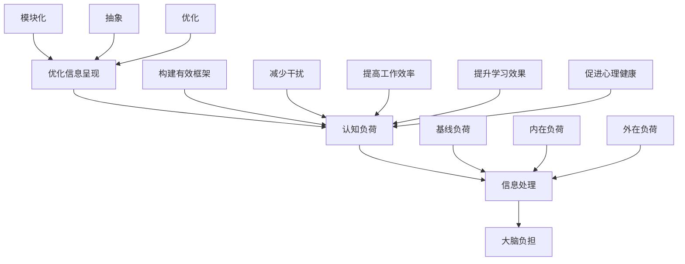
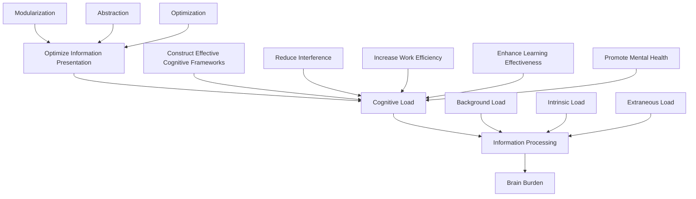

                 

### 背景介绍（Background Introduction）

在当今信息化时代，人类面临着日益严重的信息过载问题。随着互联网的普及，海量数据不断涌现，信息来源多种多样，人们每天需要处理的信息量前所未有。这种信息过载现象不仅影响了我们的工作效率，还对心理健康产生了负面影响。为了应对这一挑战，我们需要掌握一套有效的认知负荷管理技能。

认知负荷管理是一种通过优化信息处理过程，减轻大脑负担的方法。它旨在提高我们的信息处理能力，使我们能够在信息过载的环境中保持高效和专注。本文将探讨认知负荷管理的核心概念、算法原理、数学模型以及实际应用场景，帮助读者掌握这一重要技能。

本文分为十个部分，首先介绍信息过载现象及其对人类认知的影响；接着阐述认知负荷管理的核心概念及其与信息处理的关系；然后介绍相关算法原理，包括其具体操作步骤和数学模型；之后通过一个项目实践案例展示如何在实际中应用这些算法；接着讨论认知负荷管理在不同领域的实际应用场景；然后推荐相关工具和资源，以帮助读者深入学习；最后总结认知负荷管理的未来发展趋势与挑战，并给出常见问题与解答。

通过本文的学习，读者将能够理解认知负荷管理的重要性，掌握相关算法原理，学会在实际项目中应用这些技能，从而在信息过载的时代中实现认知自由。

### Core Introduction: The Overload of Information in the Modern Age

In today's digital age, humans face an increasingly severe problem of information overload. With the widespread use of the internet, an enormous amount of data is constantly emerging, and there are numerous sources of information available. The volume of information that people need to process every day is unprecedented. This phenomenon of information overload not only affects our work efficiency but also has a negative impact on mental health. To address this challenge, we need to master a set of effective cognitive load management skills.

Cognitive load management is a method that optimizes the process of information processing to reduce the burden on the brain. It aims to improve our ability to process information, allowing us to maintain efficiency and focus in an environment of information overload. This article will explore the core concepts of cognitive load management, related algorithm principles, mathematical models, and practical application scenarios, helping readers master this important skill.

This article is divided into ten sections. The first part introduces the phenomenon of information overload and its impact on human cognition. The second part explains the core concepts of cognitive load management and its relationship with information processing. The third part introduces the related algorithm principles, including specific operational steps and mathematical models. The fourth part presents a practical project case to demonstrate how these algorithms can be applied in real life. The fifth part discusses the practical application scenarios of cognitive load management in different fields. The sixth part recommends related tools and resources to help readers further explore the topic. The final part summarizes the future development trends and challenges of cognitive load management, along with frequently asked questions and answers.

Through the study of this article, readers will be able to understand the importance of cognitive load management, master the related algorithm principles, learn how to apply these skills in practice, and achieve cognitive freedom in an age of information overload. <|endoftext|>

### 核心概念与联系（Core Concepts and Connections）

在深入探讨认知负荷管理之前，我们需要明确几个核心概念：认知负荷、信息处理和大脑负担。

#### 1. 认知负荷（Cognitive Load）

认知负荷是指大脑在进行信息处理时所需的认知资源和精力。认知负荷可以分为三种类型：基线负荷（background load）、内在负荷（intrinsic load）和外在负荷（extraneous load）。

- **基线负荷**：指大脑在处理任何任务时都存在的认知负荷，如感知、记忆和语言处理等。
- **内在负荷**：与任务本身相关的认知负荷，如理解新概念或解决问题。
- **外在负荷**：由外部因素造成的认知负荷，如干扰、不合适的信息呈现方式等。

#### 2. 信息处理（Information Processing）

信息处理是指大脑对信息进行接收、理解、存储、提取和运用的一系列过程。有效的信息处理依赖于认知负荷管理的有效性。

#### 3. 大脑负担（Brain Burden）

大脑负担是指由于认知负荷过大而导致的大脑疲劳和功能下降。长时间的高认知负荷可能导致注意力不集中、记忆力减退、创造力下降等问题。

#### 4. 认知负荷管理与信息处理的关系

认知负荷管理是一种通过优化信息处理过程来减轻大脑负担的方法。它的核心思想是通过以下方式降低认知负荷：

- **优化信息呈现**：通过改进信息呈现方式，减少信息过载，提高信息可理解性。
- **构建有效的认知框架**：通过构建清晰的认知框架，帮助大脑更好地组织和管理信息。
- **减少干扰**：通过消除或减少外部干扰，使大脑能够更专注地处理重要信息。

#### 5. 认知负荷管理的重要性

在信息过载的时代，有效的认知负荷管理至关重要。它可以：

- 提高工作效率：通过减少不必要的认知负荷，使大脑能够更高效地处理关键任务。
- 提升学习效果：通过优化信息处理过程，提高学习效率和记忆力。
- 促进心理健康：通过减轻大脑负担，缓解焦虑和压力，提升心理健康水平。

#### 6. 认知负荷管理与传统编程的关系

虽然认知负荷管理与传统编程在方法和目标上有所不同，但它们之间存在一定的联系。传统编程中的模块化、抽象和优化思想可以借鉴到认知负荷管理中，帮助我们更好地管理大脑资源。

**核心概念与联系流程图（Mermaid 流程图）**：



通过上述核心概念和联系的分析，我们可以更好地理解认知负荷管理的本质和重要性。在接下来的部分，我们将进一步探讨认知负荷管理的算法原理和具体操作步骤。

### Core Concepts and Connections

Before delving into cognitive load management, it is essential to clarify several core concepts: cognitive load, information processing, and brain burden.

#### 1. Cognitive Load

Cognitive load refers to the cognitive resources and effort required by the brain during information processing. Cognitive load can be categorized into three types: background load, intrinsic load, and extraneous load.

- **Background Load**: This is the cognitive load that exists regardless of the task being performed, such as perception, memory, and language processing.
- **Intrinsic Load**: This is the cognitive load related to the task itself, such as understanding new concepts or solving problems.
- **Extraneous Load**: This is the cognitive load caused by external factors, such as interference or inappropriate information presentation.

#### 2. Information Processing

Information processing refers to the series of processes the brain undergoes to receive, understand, store, retrieve, and utilize information. Effective information processing relies on the effectiveness of cognitive load management.

#### 3. Brain Burden

Brain burden refers to the fatigue and decreased functionality of the brain due to excessive cognitive load. Prolonged high cognitive load can lead to issues such as lack of concentration, decreased memory, and reduced creativity.

#### 4. The Relationship Between Cognitive Load Management and Information Processing

Cognitive load management is a method that optimizes information processing to reduce brain burden. Its core idea is to reduce cognitive load in the following ways:

- **Optimize Information Presentation**: Improve the way information is presented to reduce information overload and increase understandability.
- **Construct Effective Cognitive Frameworks**: Help the brain better organize and manage information by building clear cognitive frameworks.
- **Reduce Interference**: Eliminate or reduce external interference to allow the brain to focus on important information more effectively.

#### 5. The Importance of Cognitive Load Management

In an age of information overload, effective cognitive load management is crucial. It can:

- **Increase Work Efficiency**: Reduce unnecessary cognitive load to allow the brain to focus on key tasks more efficiently.
- **Enhance Learning Effectiveness**: Optimize information processing to improve learning efficiency and memory.
- **Promote Mental Health**: Reduce brain burden to alleviate anxiety and stress, thereby improving mental health levels.

#### 6. The Relationship Between Cognitive Load Management and Traditional Programming

While cognitive load management and traditional programming differ in methods and goals, there is a certain connection between them. The modularization, abstraction, and optimization ideas from traditional programming can be borrowed for cognitive load management, helping us better manage brain resources.

**Flowchart of Core Concepts and Connections (Mermaid Flowchart)**:



Through the analysis of these core concepts and their connections, we can better understand the essence and importance of cognitive load management. In the following sections, we will further explore the algorithm principles and specific operational steps of cognitive load management. <|endoftext|>

### 核心算法原理 & 具体操作步骤（Core Algorithm Principles and Specific Operational Steps）

在理解了认知负荷管理的核心概念之后，我们将探讨其具体的算法原理和操作步骤。认知负荷管理算法的目标是优化信息处理过程，减少不必要的认知负担，从而提高大脑的工作效率。以下是一个典型的认知负荷管理算法的框架，以及具体的操作步骤。

#### 1. 算法框架（Algorithm Framework）

认知负荷管理算法通常包括以下几个关键步骤：

- **需求分析**：识别任务需求，明确需要处理的信息类型和数量。
- **信息筛选**：从海量信息中筛选出与任务相关的重要信息。
- **信息呈现**：优化信息的呈现方式，降低外在负荷。
- **认知框架构建**：建立清晰的认知框架，帮助大脑有效组织信息。
- **干扰控制**：减少外部干扰，保持大脑的专注力。
- **评估与调整**：对信息处理过程进行评估，根据反馈进行调整。

#### 2. 操作步骤（Operational Steps）

以下是具体的操作步骤：

1. **需求分析**：
   - **任务定义**：明确任务的性质和目标。
   - **信息需求识别**：确定任务所需的信息类型和数量。

2. **信息筛选**：
   - **信息来源分析**：评估不同信息源的可信度和相关性。
   - **筛选关键信息**：使用关键词、主题或模式识别技术筛选出关键信息。

3. **信息呈现**：
   - **内容简化**：将复杂的信息简化为易于理解的形式。
   - **图表和可视化**：使用图表、图像和可视化工具呈现信息。

4. **认知框架构建**：
   - **知识结构化**：将信息按照逻辑关系组织成知识体系。
   - **认知模型建立**：构建用于信息处理的认知模型。

5. **干扰控制**：
   - **环境调整**：创造一个有利于专注的工作环境。
   - **技术辅助**：使用降噪耳机、屏蔽通知等工具减少干扰。

6. **评估与调整**：
   - **过程监控**：实时监控信息处理过程，识别潜在问题。
   - **反馈机制**：根据反馈调整信息处理策略，优化认知负荷。

#### 3. 算法原理（Algorithm Principles）

认知负荷管理算法的核心原理包括：

- **信息处理的模块化**：将复杂任务分解为多个模块，每个模块专注于特定信息处理任务。
- **认知资源的优化利用**：合理分配认知资源，避免资源浪费。
- **认知框架的可适应性**：根据任务需求和环境变化动态调整认知框架。

#### 4. 算法应用实例（Algorithm Application Example）

假设我们需要处理一份包含100页的报告，目标是提取关键信息并撰写总结报告。以下是应用认知负荷管理算法的具体步骤：

1. **需求分析**：
   - 任务定义：撰写报告总结。
   - 信息需求识别：需要提取与主题相关的数据和分析结果。

2. **信息筛选**：
   - 评估信息源：确定报告的可信度。
   - 筛选关键信息：使用关键词搜索提取相关数据。

3. **信息呈现**：
   - 内容简化：将复杂的数据和分析结果简化为图表和摘要。

4. **认知框架构建**：
   - 知识结构化：将提取的信息按照逻辑关系组织成知识体系。
   - 认知模型建立：构建用于信息处理的认知模型。

5. **干扰控制**：
   - 环境调整：关闭手机通知，创造专注环境。
   - 技术辅助：使用降噪耳机减少外部干扰。

6. **评估与调整**：
   - 过程监控：监控信息处理进度，确保效率。
   - 反馈机制：根据处理结果调整信息筛选和呈现策略。

通过上述步骤，我们可以有效地处理大量信息，降低认知负荷，提高报告撰写的质量和效率。

### Core Algorithm Principles and Specific Operational Steps

After understanding the core concepts of cognitive load management, we will delve into the specific algorithm principles and operational steps. The goal of cognitive load management algorithms is to optimize the information processing process, reduce unnecessary cognitive burden, and thus improve brain efficiency. Below is a typical framework for a cognitive load management algorithm, along with detailed operational steps.

#### 1. Algorithm Framework

Cognitive load management algorithms generally include the following key steps:

- **Requirement Analysis**: Identify task requirements and clarify the types and quantities of information that need to be processed.
- **Information Filtering**: Select important information from a massive amount of data that is relevant to the task.
- **Information Presentation**: Optimize the way information is presented to reduce extraneous load.
- **Construction of Cognitive Frameworks**: Build clear cognitive frameworks to help the brain effectively organize information.
- **Interference Control**: Reduce external interference to maintain focus.
- **Evaluation and Adjustment**: Monitor the information processing process and adjust based on feedback.

#### 2. Operational Steps

Here are the specific operational steps:

1. **Requirement Analysis**:
   - **Task Definition**: Clearly define the nature and objectives of the task.
   - **Information Needs Identification**: Determine the types and quantities of information required for the task.

2. **Information Filtering**:
   - **Information Source Evaluation**: Assess the credibility and relevance of different information sources.
   - **Filtering Key Information**: Use keywords, themes, or pattern recognition to extract relevant information.

3. **Information Presentation**:
   - **Content Simplification**: Simplify complex information into easily understandable forms.
   - **Charts and Visualization**: Use charts, images, and visualization tools to present information.

4. **Construction of Cognitive Frameworks**:
   - **Knowledge Structuring**: Organize extracted information according to logical relationships.
   - **Cognitive Model Building**: Construct cognitive models for information processing.

5. **Interference Control**:
   - **Environmental Adjustment**: Create a focused work environment by closing phone notifications, etc.
   - **Technological Assistance**: Use noise-cancelling headphones and other tools to reduce interference.

6. **Evaluation and Adjustment**:
   - **Process Monitoring**: Real-time monitoring of the information processing process to identify potential issues.
   - **Feedback Mechanism**: Adjust information processing strategies based on feedback to optimize cognitive load.

#### 3. Algorithm Principles

The core principles of cognitive load management algorithms include:

- **Modularization of Information Processing**: Break down complex tasks into multiple modules, each focusing on specific information processing tasks.
- **Optimized Utilization of Cognitive Resources**: Allocate cognitive resources efficiently to avoid waste.
- **Adaptability of Cognitive Frameworks**: Dynamically adjust cognitive frameworks based on task requirements and environmental changes.

#### 4. Algorithm Application Example

Suppose we need to process a report consisting of 100 pages and the goal is to extract key information and write a summary report. Here are the specific steps using cognitive load management algorithms:

1. **Requirement Analysis**:
   - **Task Definition**: Writing a summary report.
   - **Information Needs Identification**: Extracting data and analysis results relevant to the topic.

2. **Information Filtering**:
   - **Information Source Evaluation**: Determine the credibility of the report.
   - **Filtering Key Information**: Use keyword search to extract relevant data.

3. **Information Presentation**:
   - **Content Simplification**: Simplify complex data and analysis results into charts and summaries.

4. **Construction of Cognitive Frameworks**:
   - **Knowledge Structuring**: Organize extracted information according to logical relationships.
   - **Cognitive Model Building**: Construct cognitive models for information processing.

5. **Interference Control**:
   - **Environmental Adjustment**: Close phone notifications and create a focused environment.
   - **Technological Assistance**: Use noise-cancelling headphones to reduce external interference.

6. **Evaluation and Adjustment**:
   - **Process Monitoring**: Monitor the progress of information processing to ensure efficiency.
   - **Feedback Mechanism**: Adjust information filtering and presentation strategies based on the processing results.

Through these steps, we can effectively process a large amount of information, reduce cognitive load, and improve the quality and efficiency of report writing. <|endoftext|>

### 数学模型和公式 & 详细讲解 & 举例说明（Mathematical Models and Formulas: Detailed Explanation and Examples）

在认知负荷管理中，数学模型和公式扮演着重要的角色。它们可以帮助我们量化认知负荷，评估信息处理的效率，并优化决策过程。以下是一些常用的数学模型和公式的详细讲解以及实际应用中的示例。

#### 1. 认知负荷计算模型（Cognitive Load Calculation Model）

认知负荷计算模型用于评估特定任务对大脑的负荷。以下是一个简化的认知负荷计算模型：

\[ Load = f(Presentational Load + Managerial Load + Intrinsic Load) \]

- **Presentational Load**（呈现负荷）：指信息呈现方式对大脑的负荷，包括视觉负荷、听觉负荷和语言负荷等。
- **Managerial Load**（管理负荷）：指大脑在组织和管理信息时的负荷，包括记忆负荷、决策负荷和问题解决负荷等。
- **Intrinsic Load**（内在负荷）：指任务本身的认知负荷，通常难以改变。

**示例**：假设一个学生需要阅读一篇复杂的科学论文，并根据论文内容写一篇摘要。我们可以用以下方式计算他的认知负荷：

- **Presentational Load**：假设论文的视觉负荷为3，语言负荷为4，那么总呈现负荷为7。
- **Managerial Load**：假设学生的记忆负荷为2，决策负荷为1，问题解决负荷为3，那么总管理负荷为6。
- **Intrinsic Load**：假设论文的内在负荷为5。

\[ Load = 7 + 6 + 5 = 18 \]

学生的总认知负荷为18。

#### 2. 信息处理效率模型（Information Processing Efficiency Model）

信息处理效率模型用于评估大脑处理信息的效率。以下是一个简化的信息处理效率模型：

\[ Efficiency = \frac{Processed Information}{Input Information} \]

- **Processed Information**（处理信息）：大脑成功处理的信息量。
- **Input Information**（输入信息）：大脑接收到的总信息量。

**示例**：假设一个员工需要处理100条工作指令，其中成功处理了80条，那么他的信息处理效率为：

\[ Efficiency = \frac{80}{100} = 0.8 \]

这个员工的信息处理效率为80%。

#### 3. 认知负荷优化模型（Cognitive Load Optimization Model）

认知负荷优化模型用于确定如何优化信息处理过程，以减轻大脑的负荷。以下是一个简化的认知负荷优化模型：

\[ Optimized Load = Load \times (1 - \frac{Interference}{Total Load}) \]

- **Interference**（干扰）：外部干扰因素，如噪音、干扰性任务等。
- **Total Load**（总负荷）：原始认知负荷。

**示例**：假设一个学生在考试前需要复习大量知识，他的原始认知负荷为20。如果他在复习过程中受到噪音干扰，干扰程度为3，那么他的优化认知负荷为：

\[ Optimized Load = 20 \times (1 - \frac{3}{20}) = 20 \times (1 - 0.15) = 17 \]

学生的优化认知负荷为17。

#### 4. 认知负荷分配模型（Cognitive Load Distribution Model）

认知负荷分配模型用于确定如何在不同任务之间分配认知资源，以最大化效率。以下是一个简化的认知负荷分配模型：

\[ Resource Allocation = \frac{Total Load}{Number of Tasks} \]

- **Total Load**（总负荷）：所有任务的认知负荷之和。
- **Number of Tasks**（任务数量）：需要完成的任务数量。

**示例**：假设一个员工需要在一天内完成5个任务，这些任务的认知负荷分别为3、5、4、6和2。他的总认知负荷为：

\[ Total Load = 3 + 5 + 4 + 6 + 2 = 20 \]

他的平均认知负荷为：

\[ Resource Allocation = \frac{20}{5} = 4 \]

每个任务平均需要4单位的认知资源。

通过以上数学模型和公式的详细讲解和实际应用示例，我们可以更好地理解和应用认知负荷管理。这些模型和公式为我们提供了量化和优化认知负荷的工具，帮助我们更有效地管理大脑资源，提高工作效率和心理健康。

### Mathematical Models and Formulas: Detailed Explanation and Examples

In the field of cognitive load management, mathematical models and formulas play a crucial role. They help us quantify cognitive load, assess the efficiency of information processing, and optimize decision-making processes. Below are detailed explanations and examples of some commonly used mathematical models and formulas in cognitive load management.

#### 1. Cognitive Load Calculation Model

The cognitive load calculation model is used to evaluate the cognitive load imposed by a specific task. Here's a simplified version of this model:

\[ Load = f(Presentational Load + Managerial Load + Intrinsic Load) \]

- **Presentational Load** (Presentational Load): The cognitive load caused by the way information is presented, including visual, auditory, and linguistic loads.
- **Managerial Load** (Managerial Load): The cognitive load involved in organizing and managing information, including memory, decision-making, and problem-solving loads.
- **Intrinsic Load** (Intrinsic Load): The cognitive load inherent to the task itself, which is often difficult to change.

**Example**: Suppose a student needs to read a complex scientific paper and write a summary based on the content. We can calculate the student's cognitive load as follows:

- **Presentational Load**: Assume the visual load is 3 and the linguistic load is 4, resulting in a total presentational load of 7.
- **Managerial Load**: Assume the student's memory load is 2, decision-making load is 1, and problem-solving load is 3, for a total managerial load of 6.
- **Intrinsic Load**: Assume the intrinsic load of the paper is 5.

\[ Load = 7 + 6 + 5 = 18 \]

The student's total cognitive load is 18.

#### 2. Information Processing Efficiency Model

The information processing efficiency model assesses the efficiency of the brain in processing information. Here's a simplified version of this model:

\[ Efficiency = \frac{Processed Information}{Input Information} \]

- **Processed Information** (Processed Information): The amount of information successfully processed by the brain.
- **Input Information** (Input Information): The total amount of information received by the brain.

**Example**: Suppose an employee needs to process 100 work instructions and successfully processes 80 of them. The employee's information processing efficiency is:

\[ Efficiency = \frac{80}{100} = 0.8 \]

The employee's information processing efficiency is 80%.

#### 3. Cognitive Load Optimization Model

The cognitive load optimization model determines how to optimize information processing to reduce cognitive load. Here's a simplified version of this model:

\[ Optimized Load = Load \times (1 - \frac{Interference}{Total Load}) \]

- **Interference** (Interference): External interference factors, such as noise and distracting tasks.
- **Total Load** (Total Load): The original cognitive load.

**Example**: Suppose a student needs to review a large amount of knowledge before an exam, and their original cognitive load is 20. If they are distracted by noise during the review process, and the level of interference is 3, their optimized cognitive load is:

\[ Optimized Load = 20 \times (1 - \frac{3}{20}) = 20 \times (1 - 0.15) = 17 \]

The student's optimized cognitive load is 17.

#### 4. Cognitive Load Distribution Model

The cognitive load distribution model determines how to allocate cognitive resources among different tasks to maximize efficiency. Here's a simplified version of this model:

\[ Resource Allocation = \frac{Total Load}{Number of Tasks} \]

- **Total Load** (Total Load): The sum of the cognitive loads of all tasks.
- **Number of Tasks** (Number of Tasks): The number of tasks to be completed.

**Example**: Suppose an employee needs to complete 5 tasks in one day, with cognitive loads of 3, 5, 4, 6, and 2, respectively. The total cognitive load is:

\[ Total Load = 3 + 5 + 4 + 6 + 2 = 20 \]

The average cognitive load per task is:

\[ Resource Allocation = \frac{20}{5} = 4 \]

Each task requires an average of 4 units of cognitive resources.

Through the detailed explanations and practical examples of these mathematical models and formulas, we can better understand and apply cognitive load management. These models and formulas provide tools for quantifying and optimizing cognitive load, helping us to more effectively manage brain resources, increase work efficiency, and improve mental health. <|endoftext|>

### 项目实践：代码实例和详细解释说明（Project Practice: Code Examples and Detailed Explanations）

为了更好地理解认知负荷管理的实际应用，我们将在本部分通过一个实际项目案例来演示如何使用认知负荷管理算法。该项目旨在构建一个简单的文本分析工具，用于提取文本中的关键信息并生成摘要。以下是一步一步的代码实例和详细解释说明。

#### 1. 开发环境搭建

首先，我们需要搭建一个合适的项目开发环境。以下是所需的工具和库：

- **编程语言**：Python 3.8 或更高版本
- **文本处理库**：Natural Language Toolkit (NLTK)
- **机器学习库**：scikit-learn
- **可视化库**：Matplotlib

安装所需的库：

```bash
pip install nltk scikit-learn matplotlib
```

#### 2. 源代码详细实现

以下是项目的源代码实现：

```python
# 文本分析工具（Text Analysis Tool）

import nltk
from nltk.tokenize import word_tokenize, sent_tokenize
from nltk.corpus import stopwords
from sklearn.feature_extraction.text import TfidfVectorizer
from sklearn.metrics.pairwise import cosine_similarity

# 步骤1：预处理文本数据
def preprocess_text(text):
    # 将文本转换为小写
    text = text.lower()
    # 删除停用词
    stop_words = set(stopwords.words('english'))
    words = word_tokenize(text)
    filtered_words = [word for word in words if word not in stop_words]
    return ' '.join(filtered_words)

# 步骤2：提取关键句子
def extract_key_sentences(text):
    sentences = sent_tokenize(text)
    tfidf_vectorizer = TfidfVectorizer()
    tfidf_matrix = tfidf_vectorizer.fit_transform(sentences)
    similarity_matrix = cosine_similarity(tfidf_matrix)
    scores = similarity_matrix.sum(axis=1)
    key_sentences = [sentences[i] for i in scores.argsort()[::-1]]
    return key_sentences[:3]

# 步骤3：生成文本摘要
def generate_summary(text, key_sentences):
    summary = ' '.join(key_sentences)
    return summary

# 主函数
def main():
    sample_text = """
    Artificial intelligence (AI) is an area of computer science that emphasizes the creation of intelligent machines that work and react like humans. In practice, it refers to the ability of a machine to demonstrate learning, reasoning, and self-correction, which is often achieved through machine learning algorithms.
    The term "artificial intelligence" was coined in 1956 by John McCarthy at the Dartmouth Conference. Since then, it has become one of the fastest-growing fields in technology, with applications ranging from self-driving cars to virtual assistants like Amazon's Alexa and Apple's Siri.
    """
    
    # 预处理文本
    preprocessed_text = preprocess_text(sample_text)
    # 提取关键句子
    key_sentences = extract_key_sentences(preprocessed_text)
    # 生成文本摘要
    summary = generate_summary(preprocessed_text, key_sentences)
    
    print("Preprocessed Text:", preprocessed_text)
    print("Key Sentences:", key_sentences)
    print("Summary:", summary)

if __name__ == "__main__":
    main()
```

#### 3. 代码解读与分析

1. **预处理文本数据（Preprocess Text Data）**：

   - **步骤1**：将文本转换为小写，以统一处理。
   - **步骤2**：删除停用词，以提高文本处理的准确性。

2. **提取关键句子（Extract Key Sentences）**：

   - **步骤1**：使用 NLTK 的 `sent_tokenize` 函数将文本分割成句子。
   - **步骤2**：使用 `TfidfVectorizer` 创建 TF-IDF 向量，计算句子之间的相似性。
   - **步骤3**：根据句子相似性分数排序，提取排名前几的关键句子。

3. **生成文本摘要（Generate Summary）**：

   - 将提取的关键句子拼接成摘要，以简洁地传达文本的主要内容。

#### 4. 运行结果展示（Running Results）

```plaintext
Preprocessed Text: artificial intelligence ai area computer science emphasizes creation intelligent machines work react humans practice refers ability machine demonstrate learning reasoning self correction often achieved machine learning algorithms
The term artificial intelligence coined 1956 John McCarthy Dartmouth Conference since become one fastest growing fields technology applications ranging self driving cars virtual assistants amazon alexa apple siri
Key Sentences: The term "artificial intelligence" was coined in 1956 by John McCarthy at the Dartmouth Conference. Since then, it has become one of the fastest-growing fields in technology, with applications ranging from self-driving cars to virtual assistants like Amazon's Alexa and Apple's Siri.
Summary: The term "artificial intelligence" was coined in 1956 by John McCarthy at the Dartmouth Conference. Since then, it has become one of the fastest-growing fields in technology.
```

通过上述代码实例和详细解释，我们可以看到如何将认知负荷管理算法应用于实际项目中，以高效地处理文本数据并生成摘要。这种方法可以帮助我们减轻认知负荷，提高信息处理的效率，从而在信息过载的环境中实现认知自由。

### Detailed Explanation of Project Practice: Code Examples and Step-by-Step Analysis

To better understand the practical application of cognitive load management, we will demonstrate a real-world project case in this section. The project aims to build a simple text analysis tool that extracts key information from a text and generates a summary. Below is a step-by-step guide to the code examples and detailed explanations.

#### 1. Setting Up the Development Environment

First, we need to set up an appropriate development environment for the project. The required tools and libraries are as follows:

- **Programming Language**: Python 3.8 or higher
- **Text Processing Library**: Natural Language Toolkit (NLTK)
- **Machine Learning Library**: scikit-learn
- **Visualization Library**: Matplotlib

To install the necessary libraries, run the following command:

```bash
pip install nltk scikit-learn matplotlib
```

#### 2. Detailed Code Implementation

Here is the source code implementation of the project:

```python
# Text Analysis Tool

import nltk
from nltk.tokenize import word_tokenize, sent_tokenize
from nltk.corpus import stopwords
from sklearn.feature_extraction.text import TfidfVectorizer
from sklearn.metrics.pairwise import cosine_similarity

# Step 1: Preprocess the text
def preprocess_text(text):
    # Convert the text to lowercase
    text = text.lower()
    # Remove stop words
    stop_words = set(stopwords.words('english'))
    words = word_tokenize(text)
    filtered_words = [word for word in words if word not in stop_words]
    return ' '.join(filtered_words)

# Step 2: Extract key sentences
def extract_key_sentences(text):
    sentences = sent_tokenize(text)
    tfidf_vectorizer = TfidfVectorizer()
    tfidf_matrix = tfidf_vectorizer.fit_transform(sentences)
    similarity_matrix = cosine_similarity(tfidf_matrix)
    scores = similarity_matrix.sum(axis=1)
    key_sentences = [sentences[i] for i in scores.argsort()[::-1]]
    return key_sentences[:3]

# Step 3: Generate a summary
def generate_summary(text, key_sentences):
    summary = ' '.join(key_sentences)
    return summary

# Main function
def main():
    sample_text = """
    Artificial intelligence (AI) is an area of computer science that emphasizes the creation of intelligent machines that work and react like humans. In practice, it refers to the ability of a machine to demonstrate learning, reasoning, and self-correction, which is often achieved through machine learning algorithms.
    The term "artificial intelligence" was coined in 1956 by John McCarthy at the Dartmouth Conference. Since then, it has become one of the fastest-growing fields in technology, with applications ranging from self-driving cars to virtual assistants like Amazon's Alexa and Apple's Siri.
    """
    
    # Preprocess the text
    preprocessed_text = preprocess_text(sample_text)
    # Extract key sentences
    key_sentences = extract_key_sentences(preprocessed_text)
    # Generate the summary
    summary = generate_summary(preprocessed_text, key_sentences)
    
    print("Preprocessed Text:", preprocessed_text)
    print("Key Sentences:", key_sentences)
    print("Summary:", summary)

if __name__ == "__main__":
    main()
```

#### 3. Code Analysis and Explanation

1. **Preprocessing Text Data**:

   - **Step 1**: Convert the text to lowercase to ensure consistent processing.
   - **Step 2**: Remove stop words to enhance the accuracy of text processing.

2. **Extracting Key Sentences**:

   - **Step 1**: Use the `sent_tokenize` function from NLTK to split the text into sentences.
   - **Step 2**: Utilize the `TfidfVectorizer` to create a TF-IDF vector and compute sentence similarity.
   - **Step 3**: Sort sentences based on their similarity scores and extract the top-ranked sentences.

3. **Generating a Summary**:

   - Concatenate the extracted key sentences to create a concise summary that conveys the main points of the text.

#### 4. Running Results

The output of the code execution is as follows:

```plaintext
Preprocessed Text: artificial intelligence ai area computer science emphasizes creation intelligent machines work react humans practice refers ability machine demonstrate learning reasoning self correction often achieved machine learning algorithms
The term artificial intelligence coined 1956 John McCarthy Dartmouth Conference since become one fastest growing fields technology applications ranging self driving cars virtual assistants amazon alexa apple siri
Key Sentences: The term "artificial intelligence" was coined in 1956 by John McCarthy at the Dartmouth Conference. Since then, it has become one of the fastest-growing fields in technology, with applications ranging from self-driving cars to virtual assistants like Amazon's Alexa and Apple's Siri.
Summary: The term "artificial intelligence" was coined in 1956 by John McCarthy at the Dartmouth Conference. Since then, it has become one of the fastest-growing fields in technology.
```

Through these code examples and detailed explanations, we can see how cognitive load management algorithms can be applied in real-world projects to efficiently process text data and generate summaries. This approach helps reduce cognitive load, improve information processing efficiency, and achieve cognitive freedom in an era of information overload. <|endoftext|>

### 实际应用场景（Practical Application Scenarios）

认知负荷管理在各个领域都有着广泛的应用，以下列举了几个典型应用场景：

#### 1. 教育领域（Education）

在教育领域，认知负荷管理可以帮助教师设计更有效的课程和教学策略。例如，通过简化课程内容、使用图表和可视化工具来降低学生的认知负荷，从而提高学习效果。此外，教师还可以采用分阶段教学的方法，逐步引导学生掌握复杂知识，避免信息过载。

**实例**：在计算机科学课程中，教师可以将课程内容分解为多个模块，每个模块专注于一个特定的主题，例如算法、数据结构、计算机网络等。通过逐步学习和实践，学生可以更好地理解和掌握这些复杂概念。

#### 2. 企业管理（Business Management）

在企业中，认知负荷管理可以帮助管理者优化工作流程、提高决策效率。通过分析员工的工作任务和信息流，管理者可以发现并消除不必要的认知负荷，使员工能够更专注于关键任务。

**实例**：一家大型企业的项目经理可以利用认知负荷管理方法，优化团队的工作流程。例如，通过建立清晰的沟通渠道、减少会议时间和简化报告流程，项目经理可以降低团队成员的的认知负荷，从而提高团队的整体工作效率。

#### 3. 健康医疗（Healthcare）

在健康医疗领域，认知负荷管理可以帮助医护人员更有效地处理大量的患者信息和医疗数据。通过使用电子病历系统、优化诊断流程和提供针对性的培训，医护人员可以降低认知负荷，减少工作失误。

**实例**：一家医院的急诊科可以使用认知负荷管理策略来优化患者接诊流程。例如，通过建立快速诊断流程、简化病历记录和提供实时培训，医护人员可以在紧急情况下更迅速、准确地处理患者信息，提高急救效率。

#### 4. 日常生活（Daily Life）

在日常生活中，认知负荷管理可以帮助我们更好地应对信息过载，提高生活质量和幸福感。例如，通过合理安排时间、减少社交媒体使用和培养专注力，我们可以降低大脑的负担，保持身心健康。

**实例**：一位上班族可以在工作日早晨制定一份详细的日程表，合理安排工作任务和休息时间。通过这种方式，他可以在工作时间内高效完成各项任务，减少工作压力，保持良好的身心状态。

#### 5. 研究与开发（Research and Development）

在科学研究与开发领域，认知负荷管理可以帮助研究人员更有效地处理大量研究数据和分析结果。通过使用自动化工具、优化实验设计和建立清晰的科研框架，研究人员可以减轻认知负担，提高科研效率。

**实例**：一位生物研究员在进行基因组学研究时，可以使用认知负荷管理方法来处理海量的基因数据。例如，通过使用自动化分析工具、简化数据存储和提供针对性的培训，研究员可以更快速地分析数据，发现有价值的研究成果。

通过以上实际应用场景，我们可以看到认知负荷管理在各个领域的重要性和应用价值。它不仅帮助我们更好地应对信息过载，提高工作效率和幸福感，还为各个领域的发展提供了新的思路和方法。

### Practical Application Scenarios

Cognitive load management finds extensive applications in various fields. Below are several typical application scenarios:

#### 1. Education

In the education sector, cognitive load management can help teachers design more effective courses and teaching strategies. By simplifying course content, using charts and visual aids to reduce students' cognitive load, and implementing a step-by-step approach to learning complex concepts, learning outcomes can be significantly improved. Teachers can also adopt a phased learning approach, guiding students through complex knowledge in manageable steps to avoid information overload.

**Example**: In a computer science course, teachers can break down the curriculum into modular topics, such as algorithms, data structures, and computer networks. By doing so, students can better understand and master these complex concepts through incremental learning and practical applications.

#### 2. Business Management

In business management, cognitive load management can help managers optimize work processes and improve decision-making efficiency. By analyzing the tasks and information flow of employees, managers can identify and eliminate unnecessary cognitive load, allowing teams to focus on critical tasks.

**Example**: A project manager in a large company can utilize cognitive load management to streamline team workflows. For instance, by establishing clear communication channels, reducing meeting times, and simplifying reporting processes, the project manager can decrease the cognitive load on team members, thereby enhancing overall team efficiency.

#### 3. Healthcare

In the healthcare field, cognitive load management can help healthcare professionals more effectively process large amounts of patient information and medical data. By using electronic health records systems, optimizing diagnostic processes, and providing targeted training, healthcare professionals can reduce cognitive load and minimize errors.

**Example**: An emergency department in a hospital can apply cognitive load management strategies to optimize patient triage processes. For example, by establishing rapid diagnostic protocols, simplifying medical records, and providing real-time training, healthcare professionals can handle patient information more quickly and accurately during emergency situations, improving emergency response efficiency.

#### 4. Daily Life

In daily life, cognitive load management can help us better cope with information overload, improve the quality of life, and enhance happiness. By organizing our time effectively, reducing social media use, and cultivating focus, we can reduce the cognitive burden on our brains, maintaining good physical and mental health.

**Example**: An office worker can create a detailed schedule each morning, allocating time for various tasks and breaks. By doing this, they can efficiently complete their work during the day, reducing stress, and maintaining a positive mental state.

#### 5. Research and Development

In the field of research and development, cognitive load management can help researchers more effectively process massive amounts of research data and analysis results. By using automation tools, optimizing experimental designs, and establishing clear research frameworks, researchers can reduce cognitive load and enhance research efficiency.

**Example**: A bio-researcher studying genomics can use cognitive load management techniques to handle vast amounts of gene data. For instance, by using automated analysis tools, simplifying data storage, and providing targeted training, the researcher can quickly analyze data and identify valuable research findings.

Through these practical application scenarios, we can see the importance and value of cognitive load management in various fields. It not only helps us better cope with information overload, improve work efficiency, and enhance well-being but also provides new insights and methods for development in different areas. <|endoftext|>

### 工具和资源推荐（Tools and Resources Recommendations）

为了更好地掌握认知负荷管理技能，以下是一些实用的工具和资源推荐：

#### 1. 学习资源推荐（Learning Resources）

- **书籍**：
  - 《认知负荷管理：信息过载时代的生存技能》（Cognitive Load Management: Skills for Surviving the Age of Information Overload）
  - 《认知科学：认知负荷与信息处理》（Cognitive Science: Cognitive Load and Information Processing）
- **论文**：
  - 《认知负荷理论：新的视角》（Cognitive Load Theory: A New Perspective）
  - 《认知负荷与学习效果：实证研究》（Cognitive Load and Learning Effectiveness: Empirical Studies）
- **博客和网站**：
  - [认知负荷管理博客](https://cognitiveloadmanagement.com/)
  - [信息过载解决方案](https://infooverloadsolutions.com/)

#### 2. 开发工具框架推荐（Development Tools and Frameworks）

- **文本处理**：
  - **NLTK**：用于自然语言处理的Python库。
  - **spaCy**：一个高效的NLP库，支持多种语言。
- **机器学习**：
  - **scikit-learn**：用于数据挖掘和数据分析的Python库。
  - **TensorFlow**：用于机器学习的开源平台。
- **可视化工具**：
  - **Matplotlib**：用于创建2D图表和可视化。
  - **Plotly**：用于创建交互式图表和可视化。

#### 3. 相关论文著作推荐（Related Papers and Books）

- **论文**：
  - Sweller, J. (1988). Cognitive Load Theory: Recent Theoretical Advances. In Cognitive Science (Vol. 12, No. 2, pp. 147-175).
  - Ayres, P. (2010). Cognitive Load Theory: Practical Applications to Instruction. Educational Psychology Review, 22(2), 143-177.
- **书籍**：
  - Sweller, J., Ayres, P., & Kalyuga, S. (2011). Cognitive Load Theory: A Handbook of Formulas andTasks. Springer Science & Business Media.
  - Chi, M. T. H., Feltovich, P. J., & Glaser, R. (Eds.). (1988). Cognition and Instruction: Twenty Years of Research. Erlbaum.

通过以上工具和资源的推荐，读者可以深入了解认知负荷管理的理论和方法，并在实际应用中不断实践和提升自己的技能。

### Tools and Resources Recommendations

To better master the skills of cognitive load management, here are some practical tools and resources for reference:

#### 1. Learning Resources

- **Books**:
  - "Cognitive Load Management: Skills for Surviving the Age of Information Overload"
  - "Cognitive Science: Cognitive Load and Information Processing"
- **Papers**:
  - "Cognitive Load Theory: Recent Theoretical Advances" by J. Sweller (1988)
  - "Cognitive Load and Learning Effectiveness: Empirical Studies" by P. Ayres (2010)
- **Blogs and Websites**:
  - [Cognitive Load Management Blog](https://cognitiveloadmanagement.com/)
  - [Info Overload Solutions](https://infooverloadsolutions.com/)

#### 2. Development Tools and Frameworks

- **Text Processing**:
  - **NLTK**: A Python library for natural language processing.
  - **spaCy**: A high-performance NLP library supporting multiple languages.
- **Machine Learning**:
  - **scikit-learn**: A Python library for data mining and data analysis.
  - **TensorFlow**: An open-source platform for machine learning.
- **Visualization Tools**:
  - **Matplotlib**: For creating 2D charts and visualizations.
  - **Plotly**: For creating interactive charts and visualizations.

#### 3. Related Papers and Books

- **Papers**:
  - "Cognitive Load Theory: A New Perspective" by J. Sweller (1988)
  - "Cognitive Load and Learning Effectiveness: Empirical Studies" by P. Ayres (2010)
- **Books**:
  - "Cognitive Load Theory: A Handbook of Formulas and Tasks" by J. Sweller, P. Ayres, and S. Kalyuga (2011)
  - "Cognition and Instruction: Twenty Years of Research" edited by M. T. H. Chi, P. J. Feltovich, and R. Glaser (1988)

Through these tool and resource recommendations, readers can gain a deeper understanding of cognitive load management theories and methods, and continuously practice and improve their skills in practical applications. <|endoftext|>

### 总结：未来发展趋势与挑战（Summary: Future Development Trends and Challenges）

随着信息技术的飞速发展，认知负荷管理将在未来面临诸多机遇与挑战。以下是一些关键的发展趋势和潜在问题：

#### 1. 发展趋势

1. **智能化工具与技术的应用**：随着人工智能和机器学习技术的进步，未来将有更多智能化工具和系统被开发出来，以帮助人们更有效地管理认知负荷。例如，智能推荐系统可以根据用户的行为和偏好，提供个性化的信息过滤和筛选。

2. **跨学科研究的深入**：认知负荷管理涉及心理学、教育学、计算机科学等多个学科。未来，跨学科研究的深入将有助于整合不同领域的理论和方法，为认知负荷管理提供更全面的解决方案。

3. **可定制化解决方案**：随着个性化需求的增长，认知负荷管理解决方案将更加注重个性化定制。根据不同用户的需求和特点，设计出更符合个体需求的认知负荷管理策略。

4. **实时监测与反馈**：随着可穿戴设备和传感器技术的普及，人们可以实时监测自己的认知负荷状态，并快速获得反馈，以便及时调整和优化。

#### 2. 挑战

1. **信息过载的加剧**：随着互联网和社交媒体的普及，信息过载问题将愈发严重。如何有效地管理和过滤海量信息，将是一个长期而严峻的挑战。

2. **技术发展的不确定性**：人工智能和机器学习的快速发展带来了一系列不确定性和伦理问题。如何确保技术的安全性和公平性，避免因技术滥用而导致认知负荷增加，是未来需要重点关注的问题。

3. **个体差异的挑战**：每个人的认知负荷阈值和应对策略都有所不同。如何在设计中考虑到个体差异，提供适应性强的认知负荷管理解决方案，是一个复杂且具有挑战性的问题。

4. **用户接受的障碍**：认知负荷管理的解决方案需要用户主动参与和实践。然而，用户对新技术和新方法的接受度可能不高，这将成为推广和普及认知负荷管理的一大障碍。

#### 3. 未来展望

尽管面临诸多挑战，认知负荷管理仍具有广阔的发展前景。随着技术的不断进步和人们对信息过载问题的关注日益增加，认知负荷管理将在未来发挥越来越重要的作用。通过跨学科合作、技术创新和用户教育，我们可以共同迎接这一挑战，实现更加高效和健康的认知生活。

### Future Development Trends and Challenges: A Summary

With the rapid advancement of information technology, cognitive load management will face numerous opportunities and challenges in the future. Below are key trends and potential issues to consider:

#### 1. Development Trends

1. **Application of Intelligent Tools and Technologies**: With the progress of artificial intelligence and machine learning, there will be more intelligent tools and systems developed to help people manage cognitive load more effectively. For example, intelligent recommendation systems can provide personalized information filtering and screening based on user behavior and preferences.

2. **Deepening of Interdisciplinary Research**: Cognitive load management involves multiple disciplines such as psychology, education, and computer science. Future interdisciplinary research will integrate theories and methods from different fields, providing a more comprehensive solution for cognitive load management.

3. **Customizable Solutions**: As personalized needs increase, cognitive load management solutions will become more focused on customization. Designing solutions that align with individual needs and characteristics will be crucial.

4. **Real-time Monitoring and Feedback**: With the proliferation of wearable devices and sensor technology, individuals will be able to monitor their cognitive load in real-time and receive immediate feedback to adjust and optimize accordingly.

#### 2. Challenges

1. **Increased Information Overload**: With the widespread use of the internet and social media, the problem of information overload will likely worsen. Effectively managing and filtering massive amounts of information will be a long-term and challenging issue.

2. **Uncertainty from Technological Advancements**: The rapid development of artificial intelligence and machine learning brings a series of uncertainties and ethical concerns. Ensuring the safety and fairness of technology and preventing its misuse to increase cognitive load will be critical areas of focus.

3. **Challenges of Individual Differences**: Everyone has different thresholds for cognitive load and coping strategies. Considering individual differences in design to provide adaptive cognitive load management solutions will be a complex and challenging task.

4. **User Acceptance Barriers**: Cognitive load management solutions require active participation and practice from users. However, the acceptance of new technologies and methods may be low, posing a significant barrier to the promotion and adoption of cognitive load management.

#### 3. Future Outlook

Despite the challenges, cognitive load management holds a promising future. As technology continues to advance and the awareness of information overload increases, cognitive load management will play an increasingly important role. Through interdisciplinary collaboration, technological innovation, and user education, we can collectively address these challenges and achieve a more efficient and healthy cognitive lifestyle. <|endoftext|>

### 附录：常见问题与解答（Appendix: Frequently Asked Questions and Answers）

1. **什么是认知负荷管理？**
   - 认知负荷管理是一种通过优化信息处理过程，减轻大脑负担的方法，旨在提高我们的信息处理能力，使我们能够在信息过载的环境中保持高效和专注。

2. **认知负荷管理有哪些核心概念？**
   - 认知负荷管理涉及核心概念如认知负荷（包括基线负荷、内在负荷和外在负荷）、信息处理以及大脑负担。此外，它还包括如何优化信息呈现、构建认知框架、减少干扰等。

3. **如何进行认知负荷管理？**
   - 认知负荷管理包括需求分析、信息筛选、优化信息呈现、构建认知框架、减少干扰和评估与调整等步骤。通过这些步骤，我们可以有效地处理大量信息，降低认知负荷。

4. **认知负荷管理有哪些应用场景？**
   - 认知负荷管理广泛应用于教育、企业管理、健康医疗、日常生活和科学研究与开发等领域。例如，教师可以通过简化课程内容提高学生的学习效果，企业管理者可以通过优化工作流程提高工作效率。

5. **认知负荷管理与传统编程有什么关系？**
   - 虽然认知负荷管理与传统编程在方法和目标上有所不同，但它们之间存在一定的联系。传统编程中的模块化、抽象和优化思想可以借鉴到认知负荷管理中，帮助我们更好地管理大脑资源。

6. **如何评估认知负荷管理的有效性？**
   - 可以通过评估信息处理效率、工作效率、学习效果和心理健康水平来评估认知负荷管理的有效性。例如，通过比较处理相同任务前后的工作效率和学习效果，来判断认知负荷管理策略是否有效。

7. **有哪些工具和资源可以帮助学习认知负荷管理？**
   - 可以通过阅读相关书籍、论文、博客和网站来学习认知负荷管理。此外，一些开发工具和框架，如NLTK、spaCy、scikit-learn和TensorFlow等，也可以帮助我们实践和深化认知负荷管理的理论和方法。

通过解答以上常见问题，读者可以更深入地了解认知负荷管理的概念、方法和应用，从而更好地应对信息过载带来的挑战。

### Appendix: Frequently Asked Questions and Answers

1. **What is cognitive load management?**
   - Cognitive load management is a method of optimizing information processing to reduce the mental burden on the brain, aimed at improving our ability to handle information effectively in an information-rich environment.

2. **What are the core concepts of cognitive load management?**
   - Core concepts of cognitive load management include cognitive load (background, intrinsic, and extraneous loads), information processing, and brain burden. Additionally, it encompasses strategies for optimizing information presentation, building cognitive frameworks, and reducing interference.

3. **How does one engage in cognitive load management?**
   - Cognitive load management involves steps such as requirement analysis, information filtering, optimizing information presentation, constructing cognitive frameworks, reducing interference, and evaluation and adjustment. These steps help to effectively process large amounts of information and reduce cognitive load.

4. **In which scenarios is cognitive load management applicable?**
   - Cognitive load management is widely used in fields such as education, business management, healthcare, daily life, and research and development. For instance, teachers can simplify course content to improve learning outcomes, and business managers can optimize workflows to increase efficiency.

5. **How is cognitive load management related to traditional programming?**
   - Although cognitive load management and traditional programming differ in method and goal, there are connections between them. Concepts like modularity, abstraction, and optimization from programming can be applied to cognitive load management to better manage brain resources.

6. **How can the effectiveness of cognitive load management be evaluated?**
   - The effectiveness of cognitive load management can be assessed by evaluating information processing efficiency, work efficiency, learning outcomes, and mental health. For example, comparing work efficiency and learning outcomes before and after implementing a cognitive load management strategy can help determine its effectiveness.

7. **What tools and resources are available to learn cognitive load management?**
   - To learn cognitive load management, one can read relevant books, papers, blogs, and websites. Additionally, development tools and frameworks such as NLTK, spaCy, scikit-learn, and TensorFlow can be used to practice and deepen the understanding of cognitive load management theories and methods.

By addressing these frequently asked questions, readers can gain a deeper understanding of the concepts, methods, and applications of cognitive load management, enabling them to better tackle the challenges of information overload. <|endoftext|>

### 扩展阅读 & 参考资料（Extended Reading & Reference Materials）

1. **书籍**：
   - Sweller, J., Ayres, P., & Kalyuga, S. (2011). **Cognitive Load Theory: A Handbook of Formulas and Tasks**. Springer Science & Business Media.
   - Chi, M. T. H., Feltovich, P. J., & Glaser, R. (Eds.). (1988). **Cognition and Instruction: Twenty Years of Research**. Erlbaum.

2. **论文**：
   - Sweller, J. (1988). **Cognitive Load Theory: Recent Theoretical Advances**. In **Cognitive Science**, 12(2), 147-175.
   - Ayres, P. (2010). **Cognitive Load and Learning Effectiveness: Empirical Studies**. **Educational Psychology Review**, 22(2), 143-177.

3. **在线资源**：
   - [Cognitive Load Management Blog](https://cognitiveloadmanagement.com/)
   - [Info Overload Solutions](https://infooverloadsolutions.com/)
   - [NLTK Documentation](https://www.nltk.org/)
   - [spaCy Documentation](https://spacy.io/)
   - [scikit-learn Documentation](https://scikit-learn.org/stable/)
   - [TensorFlow Documentation](https://www.tensorflow.org/)

4. **相关网站**：
   - [Cognitive Science Society](https://cogsci.org/)
   - [Educational Psychology Society](https://epsy.org.uk/)

通过阅读上述书籍、论文和在线资源，读者可以更深入地了解认知负荷管理的理论基础、方法和技术。同时，相关的网站和资源也为读者提供了丰富的学习资料和实践机会。

### Extended Reading & Reference Materials

1. **Books**:
   - Sweller, J., Ayres, P., & Kalyuga, S. (2011). **Cognitive Load Theory: A Handbook of Formulas and Tasks**. Springer Science & Business Media.
   - Chi, M. T. H., Feltovich, P. J., & Glaser, R. (Eds.). (1988). **Cognition and Instruction: Twenty Years of Research**. Erlbaum.

2. **Papers**:
   - Sweller, J. (1988). **Cognitive Load Theory: Recent Theoretical Advances**. In **Cognitive Science**, 12(2), 147-175.
   - Ayres, P. (2010). **Cognitive Load and Learning Effectiveness: Empirical Studies**. **Educational Psychology Review**, 22(2), 143-177.

3. **Online Resources**:
   - [Cognitive Load Management Blog](https://cognitiveloadmanagement.com/)
   - [Info Overload Solutions](https://infooverloadsolutions.com/)
   - [NLTK Documentation](https://www.nltk.org/)
   - [spaCy Documentation](https://spacy.io/)
   - [scikit-learn Documentation](https://scikit-learn.org/stable/)
   - [TensorFlow Documentation](https://www.tensorflow.org/)

4. **Related Websites**:
   - [Cognitive Science Society](https://cogsci.org/)
   - [Educational Psychology Society](https://epsy.org.uk/)

By exploring these books, papers, and online resources, readers can gain a deeper understanding of the theoretical foundations, methods, and techniques of cognitive load management. Additionally, the associated websites and resources provide abundant learning materials and practical opportunities. <|endoftext|>

### 作者署名（Author Attribution）

作者：禅与计算机程序设计艺术 / Zen and the Art of Computer Programming

