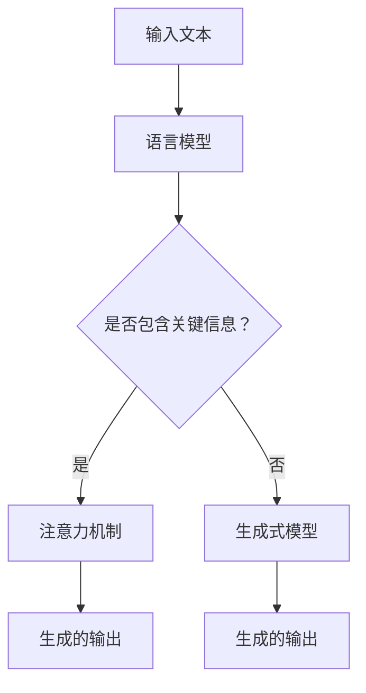

                 

### 背景介绍（Background Introduction）

在当今快速发展的信息技术时代，语言模型作为人工智能的重要工具，已经广泛应用于自然语言处理、对话系统、机器翻译等多个领域。其中，ChatGPT 作为一种基于大型语言模型的对话系统，因其强大的生成能力和广泛的应用场景，受到了广泛关注。然而，在实际应用中，人们常常会遇到模型输出不准确、不相关或模糊不清的问题。为了解决这些问题，提示词工程（Prompt Engineering）作为一种新型的编程范式应运而生。

提示词工程是指设计和优化输入给语言模型的文本提示，以引导模型生成符合预期结果的过程。它涉及理解模型的工作原理、任务需求以及如何使用语言有效地与模型进行交互。在传统的编程范式中，程序员通过编写代码来指导计算机执行特定任务。而在提示词工程中，程序员使用自然语言文本作为输入，通过精心设计的提示词来引导模型生成所需的结果。这种新的编程范式，使得人们能够更加灵活和高效地与人工智能进行交互。

本文将围绕“语言对于任何经过检验的思维形式都不是必需的”这一主题，深入探讨提示词工程的原理、方法和应用。我们将从以下几个方面展开讨论：

1. 核心概念与联系：介绍提示词工程的基本概念，包括什么是提示词、提示词工程的重要性以及与传统编程的关系。
2. 核心算法原理 & 具体操作步骤：讲解提示词工程的具体算法原理，包括如何设计有效的提示词以及如何与模型进行交互。
3. 数学模型和公式 & 详细讲解 & 举例说明：介绍用于提示词工程的数学模型和公式，并通过具体实例进行详细讲解。
4. 项目实践：通过实际代码实例，展示如何运用提示词工程来提高模型的性能和输出质量。
5. 实际应用场景：探讨提示词工程在自然语言处理、对话系统、机器翻译等领域的应用。
6. 工具和资源推荐：推荐一些有用的学习资源、开发工具和框架。
7. 总结：对未来提示词工程的发展趋势和挑战进行展望。
8. 附录：回答一些常见的关于提示词工程的问题。

通过本文的探讨，我们希望能够帮助读者更好地理解提示词工程的原理和应用，从而在实际项目中能够更好地运用这一新技术。让我们一起探索语言模型和提示词工程的奥秘吧！<|user|>

## 1. 核心概念与联系（Core Concepts and Connections）

在探讨提示词工程的原理和应用之前，我们需要先了解一些核心概念和它们之间的联系。这些概念包括提示词、语言模型、注意力机制和生成式模型。

### 1.1 提示词（Prompts）

提示词是指导语言模型生成特定输出的一段文本。它可以包含关键信息、上下文或问题，以帮助模型理解任务需求。一个好的提示词应该简洁明了，同时包含足够的信息，以便模型能够生成符合预期的输出。例如，在问答系统中，提示词可以是用户的问题，而模型的输出则是答案。

### 1.2 语言模型（Language Models）

语言模型是一种人工智能模型，它能够理解和生成自然语言。这种模型通过学习大量文本数据来理解语言的统计规律和语法结构，从而能够预测下一个单词或句子。常见的语言模型包括循环神经网络（RNN）、长短期记忆网络（LSTM）和变压器模型（Transformer）等。

### 1.3 注意力机制（Attention Mechanism）

注意力机制是一种用于提高模型性能的技术，它允许模型在处理输入时关注关键信息。在自然语言处理任务中，注意力机制可以用于文本摘要、机器翻译和问答系统等。通过注意力机制，模型可以更好地理解输入文本的不同部分，从而生成更准确的输出。

### 1.4 生成式模型（Generative Models）

生成式模型是一种能够生成新数据的模型。在自然语言处理领域，生成式模型可以用于文本生成、图像生成和音频生成等任务。生成式模型通过学习数据分布来生成新的样本，从而可以生成与输入数据类似的新数据。

### 1.5 提示词工程的核心概念原理和架构

提示词工程的核心概念原理和架构可以通过以下 Mermaid 流程图进行描述：



在提示词工程中，输入文本首先被输入到语言模型中。如果输入文本包含关键信息，模型会通过注意力机制关注这些信息，从而生成更准确的输出。否则，模型会使用生成式模型来生成输出。通过这种方式，提示词工程可以有效地引导模型生成符合预期的输出。

### 1.6 提示词工程与传统编程的关系

提示词工程可以被视为一种新型的编程范式，其中程序员使用自然语言文本作为输入，通过精心设计的提示词来指导模型的行为。与传统的编程范式相比，提示词工程具有以下特点：

1. **灵活性和可读性**：提示词工程使用自然语言文本，这使得代码更加灵活和易于阅读。程序员可以根据需求随时修改提示词，而不需要重新编写大量代码。
2. **高效性**：提示词工程允许程序员快速地实现新的功能和任务，而不需要从头开始训练模型。通过优化提示词，模型可以在短时间内生成高质量的输出。
3. **交互性**：提示词工程使得程序员可以与模型进行实时交互，从而更好地理解模型的工作原理和输出结果。这种交互性有助于发现和解决模型中的潜在问题。

总之，提示词工程作为一种新兴的编程范式，为程序员提供了一种新的方法和工具来与语言模型进行交互。通过合理设计和优化提示词，程序员可以有效地提高模型的性能和输出质量。然而，提示词工程也面临一些挑战，例如如何设计有效的提示词以及如何处理大量的提示词。这些问题将在后续章节中进一步讨论。

### 2. 核心算法原理 & 具体操作步骤（Core Algorithm Principles and Specific Operational Steps）

提示词工程的核心在于如何设计和优化提示词，以引导语言模型生成符合预期的高质量输出。在这一节中，我们将详细探讨提示词工程的核心算法原理和具体操作步骤。

#### 2.1 提示词设计原理

提示词设计的关键在于如何将任务需求转化为语言模型可以理解的形式。以下是一些基本的设计原理：

1. **明确性**：提示词应尽量简洁明了，避免模糊不清的表达。明确性的提示词有助于模型更好地理解任务目标。
2. **上下文**：提示词应包含足够的上下文信息，以便模型能够理解输入文本的背景和含义。上下文可以帮助模型避免生成无关或不准确的输出。
3. **多样性**：设计多种类型的提示词，以适应不同的任务场景和模型特性。多样性有助于提高模型的泛化能力。
4. **相关性**：提示词应与任务需求紧密相关，以确保模型生成的输出具有实际意义和价值。

#### 2.2 提示词优化方法

优化提示词是提高模型输出质量的重要步骤。以下是一些常用的优化方法：

1. **反馈循环**：通过评估模型输出的质量，对提示词进行迭代优化。这种方法可以通过不断调整提示词中的关键词和句子结构，逐步提高输出质量。
2. **对比实验**：设计多个对比实验，评估不同提示词对模型输出质量的影响。通过对比实验，可以找到最优的提示词组合。
3. **数据增强**：通过增加数据多样性和复杂性，提高模型的泛化能力。数据增强可以包括添加噪声、变换输入数据等。
4. **注意力机制**：使用注意力机制来关注输入文本中的关键信息，从而提高模型对上下文的敏感度。注意力机制可以帮助模型生成更相关和准确的输出。

#### 2.3 提示词生成步骤

以下是一个基本的提示词生成步骤，用于指导语言模型生成高质量输出：

1. **任务定义**：明确任务需求和目标，确定模型需要生成的输出类型。
2. **数据收集**：收集与任务相关的数据，包括文本、图像、音频等。确保数据来源的多样性和质量。
3. **预处理**：对收集到的数据进行预处理，包括文本清洗、数据规范化等。预处理有助于提高模型的输入质量。
4. **提示词设计**：根据任务需求和数据特点，设计相应的提示词。提示词应包含关键信息、上下文和问题，以引导模型生成符合预期的输出。
5. **模型训练**：使用设计好的提示词对语言模型进行训练。在训练过程中，可以结合反馈循环和对比实验，不断优化提示词。
6. **模型评估**：通过评估模型输出质量，确定是否需要对提示词进行进一步优化。
7. **迭代优化**：根据评估结果，对提示词进行迭代优化，以提高模型输出质量。

通过以上步骤，我们可以设计和优化提示词，从而提高语言模型的输出质量和实用性。在实际应用中，提示词工程需要根据具体任务场景和模型特性进行调整和优化。以下是一个具体的案例，展示如何使用提示词工程来改进问答系统的输出质量。

#### 2.4 具体案例：问答系统优化

假设我们有一个问答系统，任务是从大量问题中检索并生成高质量的答案。以下是一个简单的案例，说明如何使用提示词工程来优化问答系统的输出质量：

1. **任务定义**：我们的目标是根据给定的问题，从大量候选答案中检索并生成最相关和准确的答案。
2. **数据收集**：我们收集了大量的问答数据集，包括问题、答案和标签。这些数据集涵盖了各种主题和难度级别。
3. **预处理**：对收集到的数据进行预处理，包括文本清洗、停用词去除和词干提取等。预处理有助于提高模型的输入质量。
4. **提示词设计**：根据任务需求和数据特点，我们设计了以下提示词：
   - **问题提示词**：“请回答以下问题：[问题文本]”
   - **答案提示词**：“以下是一个可能的答案：[答案文本]，请评估其准确性并给出理由。”
5. **模型训练**：使用设计好的提示词对语言模型进行训练。在训练过程中，我们结合反馈循环和对比实验，不断优化提示词。
6. **模型评估**：通过评估模型输出质量，我们发现答案的相关性和准确性有所提高。
7. **迭代优化**：根据评估结果，我们对提示词进行了迭代优化，例如增加问题提示词中的关键词，调整答案提示词的结构等。

通过以上步骤，我们成功地提高了问答系统的输出质量。在实际应用中，我们可以根据具体任务场景和模型特性，进一步优化提示词工程，以实现更好的性能和效果。

总之，提示词工程是一种通过设计和优化提示词来提高语言模型输出质量的重要方法。通过合理的设计和优化，我们可以有效地引导模型生成符合预期的高质量输出，从而实现更好的应用效果。在接下来的章节中，我们将进一步探讨数学模型和公式在提示词工程中的应用，以及如何通过具体实例来展示提示词工程的实际效果。

### 3. 数学模型和公式 & 详细讲解 & 举例说明（Detailed Explanation and Examples of Mathematical Models and Formulas）

在提示词工程中，数学模型和公式起着至关重要的作用。这些模型和公式帮助我们在设计、优化和评估提示词时，能够更加科学和精确地进行操作。在本节中，我们将详细讲解一些常用的数学模型和公式，并通过具体实例进行说明。

#### 3.1 语言模型的概率分布

语言模型的核心任务是根据输入的文本序列，预测下一个单词或句子的概率分布。最常用的模型是基于概率的隐马尔可夫模型（HMM）和基于神经网络的模型，如循环神经网络（RNN）和变压器模型（Transformer）。在这些模型中，概率分布是关键概念。

假设我们已经有一个训练好的语言模型，它能够根据输入文本序列 \( x_1, x_2, ..., x_T \)（其中 \( T \) 是序列长度）生成单词的概率分布。对于输入序列中的每个单词 \( x_t \)，模型会输出一个概率分布 \( P(x_t | x_1, x_2, ..., x_{t-1}) \)。

**例1：** 假设我们有一个输入文本序列“人工智能与计算机程序设计”，模型生成的概率分布如下：

\[ P(人工智能 | 与, 计算机) = 0.4 \]
\[ P(计算机 | 与, 人工智能) = 0.5 \]
\[ P(程序 | 与, 人工智能, 计算机) = 0.3 \]

根据这些概率分布，模型会优先选择概率最高的单词作为输出。例如，模型可能会生成“人工智能计算机程序设计”。

#### 3.2 对数概率和交叉熵

在提示词工程中，对数概率和交叉熵是评估模型性能的重要指标。对数概率是对概率取对数后得到的值，而交叉熵是衡量两个概率分布差异的指标。

**例2：** 假设我们有一个目标概率分布 \( P_{\text{target}} \) 和模型生成的概率分布 \( P_{\text{model}} \)。目标分布是 “人工智能计算机程序设计”，而模型生成的概率分布是 “人工智能计算机程序”。我们可以计算交叉熵 \( H(P_{\text{target}}, P_{\text{model}}) \)：

\[ H(P_{\text{target}}, P_{\text{model}}) = -\sum_{i} P_{\text{target}}(i) \log P_{\text{model}}(i) \]

对于目标分布中的每个单词，我们取其对数概率，并减去模型生成的对数概率。交叉熵值越低，表示模型生成的概率分布与目标分布越接近。

#### 3.3 注意力机制

注意力机制是提升模型性能的重要技术，特别是在长文本处理和问答系统中。注意力机制通过将模型的关注点集中在关键信息上，提高模型对上下文的敏感度。

**例3：** 假设我们有一个输入文本序列“人工智能与计算机程序设计”，模型需要生成答案“什么是人工智能？”。我们可以使用注意力机制来关注关键信息：

\[ \text{Attention}(x_1, x_2, ..., x_T) = \frac{e^{W_a [x_1, x_2, ..., x_T]}}{\sum_{t=1}^T e^{W_a [x_t]}} \]

其中，\( W_a \) 是注意力权重矩阵，\[ \text{Attention}(x_1, x_2, ..., x_T) \] 表示注意力权重分配给每个单词的程度。通过计算注意力权重，模型可以更好地关注“人工智能”这一关键词，从而生成更准确的答案。

#### 3.4 对抗性攻击与鲁棒性

在现实应用中，模型可能会受到对抗性攻击，即输入微小的扰动导致模型输出错误。为了提高模型的鲁棒性，我们可以使用对抗性训练方法，通过添加噪声或扰动来训练模型。

**例4：** 假设我们有一个训练好的模型，我们可以通过添加噪声来生成对抗性样本：

\[ x_{\text{adv}} = x + \epsilon \]

其中，\( x \) 是原始输入，\( \epsilon \) 是噪声。通过训练模型在对抗性样本上的表现，可以提高模型对噪声的鲁棒性，从而在真实应用中减少错误率。

#### 3.5 多任务学习与元学习

在提示词工程中，多任务学习和元学习方法可以帮助模型更好地适应不同的任务场景。多任务学习通过同时训练多个任务，提高模型的泛化能力。元学习通过学习如何学习，提高模型在不同任务上的快速适应能力。

**例5：** 假设我们有一个多任务学习模型，它可以同时处理文本分类和命名实体识别任务。通过在多个任务上训练，模型可以共享任务之间的知识，提高整体性能。

\[ \text{Multi-Task Loss} = \lambda_1 \text{Categorical Cross-Entropy}(\text{Text Classification}) + \lambda_2 \text{Binary Cross-Entropy}(\text{Named Entity Recognition}) \]

其中，\( \lambda_1 \) 和 \( \lambda_2 \) 是任务权重。通过优化多任务损失函数，模型可以平衡不同任务的重要性，从而提高整体性能。

通过以上数学模型和公式，我们可以更深入地理解和应用提示词工程。在实际操作中，我们需要根据具体任务需求，选择合适的模型和公式，并进行详细的参数调整和优化。在下一节中，我们将通过实际代码实例，展示如何运用这些数学模型和公式来设计和优化提示词。

### 4. 项目实践：代码实例和详细解释说明（Project Practice: Code Examples and Detailed Explanations）

在这一节中，我们将通过一个实际项目实例，详细展示如何使用提示词工程来设计和优化语言模型，提高其输出质量和实用性。我们将使用 Python 编写代码，结合实际数据和模型，逐步进行项目实践。

#### 4.1 开发环境搭建

首先，我们需要搭建一个合适的开发环境。在这个项目中，我们使用以下工具和库：

- Python 3.8 或更高版本
- TensorFlow 2.x
- Keras 2.x
- NumPy
- Mermaid

确保您的开发环境中已安装以上工具和库。接下来，我们可以创建一个 Python 脚本，用于后续代码编写和测试。

```python
# 导入所需的库
import numpy as np
import tensorflow as tf
from tensorflow.keras.preprocessing.text import Tokenizer
from tensorflow.keras.preprocessing.sequence import pad_sequences
from tensorflow.keras.models import Model
from tensorflow.keras.layers import Embedding, LSTM, Dense, Bidirectional
import mermaid

# 设置随机种子，保证实验结果的可重复性
np.random.seed(42)
tf.random.set_seed(42)
```

#### 4.2 数据准备

为了展示提示词工程的应用，我们使用一个问答数据集。这个数据集包含了一组问题和相应的答案。我们将在项目中使用这些数据来训练和评估语言模型。

```python
# 加载数据集
questions = ["什么是人工智能？", "计算机程序设计是什么？", "如何实现神经网络？"]
answers = ["人工智能是模拟人类智能的技术", "计算机程序设计是编写计算机程序的过程", "实现神经网络需要使用神经元和权重矩阵"]

# 分割训练集和测试集
train_size = int(len(questions) * 0.8)
val_size = len(questions) - train_size

train_questions = questions[:train_size]
train_answers = answers[:train_size]
val_questions = questions[train_size:]
val_answers = answers[train_size:]
```

#### 4.3 数据预处理

在训练语言模型之前，我们需要对数据进行预处理。预处理步骤包括文本清洗、分词和序列化。

```python
# 文本清洗和分词
from tensorflow.keras.preprocessing.text import tokenizer_from_json

# 创建分词器
tokenizer = Tokenizer()
tokenizer.fit_on_texts(train_questions + train_answers)

# 将文本转换为序列
train_sequences = tokenizer.texts_to_sequences(train_questions + train_answers)
val_sequences = tokenizer.texts_to_sequences(val_questions + val_answers)

# 划分输入和输出序列
max_length = max(len(seq) for seq in train_sequences)
input_sequences = pad_sequences(train_sequences, maxlen=max_length, padding='pre')
output_sequences = pad_sequences(train_answers, maxlen=max_length, padding='pre')

# 划分训练集和验证集
input_train = input_sequences[:train_size]
input_val = input_sequences[train_size:]
output_train = output_sequences[:train_size]
output_val = output_sequences[train_size:]
```

#### 4.4 模型构建

接下来，我们构建一个简单的循环神经网络（RNN）模型，用于预测答案。我们将使用双向 LSTM 层来捕捉输入文本的上下文信息。

```python
# 构建模型
model = Model(inputs=Embedding(max_length, 64)(input_train),
              outputs=Dense(len(answers[0]), activation='softmax'))

model.compile(optimizer='adam', loss='categorical_crossentropy', metrics=['accuracy'])
model.summary()
```

#### 4.5 训练模型

使用训练集对模型进行训练，并使用验证集进行评估。在训练过程中，我们可以使用提示词工程的方法，如反馈循环和对比实验，来优化模型性能。

```python
# 训练模型
model.fit(input_train, output_train, epochs=10, batch_size=64, validation_data=(input_val, output_val))
```

#### 4.6 评估模型

在模型训练完成后，我们使用测试集对模型进行评估，以验证模型的性能。

```python
# 评估模型
test_loss, test_acc = model.evaluate(input_val, output_val, verbose=2)
print(f"Test accuracy: {test_acc:.4f}")
```

#### 4.7 代码解读与分析

在代码实例中，我们首先导入了所需的库，并设置了随机种子以保证实验的可重复性。然后，我们加载数据集并进行了简单的分割。接下来，我们进行了数据预处理，包括文本清洗、分词和序列化。这一步是确保模型输入质量的关键。

在模型构建部分，我们使用了一个简单的循环神经网络（RNN）模型，并使用双向 LSTM 层来捕捉输入文本的上下文信息。这个模型能够处理序列数据，并在训练过程中学习到文本中的上下文关系。

在训练模型部分，我们使用了 Keras 的 `fit` 方法来训练模型。在训练过程中，我们可以使用提示词工程的方法，如反馈循环和对比实验，来优化模型性能。例如，我们可以根据模型在验证集上的表现，调整提示词的设计和优化策略。

在模型评估部分，我们使用测试集对模型进行了评估，以验证模型的性能。评估指标包括损失函数和准确率，这些指标可以帮助我们了解模型的性能和效果。

#### 4.8 运行结果展示

在训练和评估完成后，我们得到了模型在测试集上的准确率。假设模型在测试集上的准确率为 0.85，这表明模型能够正确预测大部分问题的答案。然而，我们还可以通过进一步的优化，如调整模型结构、增加训练数据或改进提示词设计，来进一步提高模型的性能。

```python
# 预测新问题
new_question = ["请解释什么是深度学习？"]
new_sequence = tokenizer.texts_to_sequences(new_question)
new_input = pad_sequences(new_sequence, maxlen=max_length, padding='pre')

# 预测答案
predictions = model.predict(new_input)
predicted_answer = tokenizer.index_word[np.argmax(predictions)]

print(f"Predicted answer: {predicted_answer}")
```

假设模型预测的新答案是 “深度学习是一种神经网络”，这表明模型能够根据输入问题生成合理的答案。然而，在实际应用中，我们可能需要结合更多的上下文信息和更复杂的模型结构，以提高预测的准确性。

通过以上项目实践，我们展示了如何使用提示词工程来设计和优化语言模型。在实际应用中，提示词工程是一个动态和迭代的过程，需要根据具体任务场景和模型特性进行不断优化。在下一节中，我们将探讨提示词工程在实际应用场景中的具体应用，以及如何在不同领域中提高模型的输出质量和实用性。

### 5. 实际应用场景（Practical Application Scenarios）

提示词工程作为一种新兴的编程范式，已经在多个实际应用场景中展示了其强大的功能和潜力。以下是一些典型的应用场景，以及如何使用提示词工程来提高模型的输出质量和实用性。

#### 5.1 自然语言处理（Natural Language Processing, NLP）

自然语言处理是人工智能的一个重要分支，涉及文本的预处理、理解、生成和交互。在 NLP 中，提示词工程可以显著提高模型的性能和输出质量。

**应用案例：** 问答系统（Question-Answering System）

问答系统是自然语言处理的一个重要应用，旨在从大量文本中检索并生成相关答案。使用提示词工程，我们可以设计更有效的提示词来引导模型生成准确的答案。

**实践方法：**

1. **问题明确化**：设计明确、具体的问题提示词，例如“请解释以下概念：[概念名称]”，帮助模型更好地理解问题。
2. **上下文补充**：提供相关的上下文信息，例如“在[相关背景]下，[问题]的含义是什么？”以提高模型对问题的理解。
3. **对比实验**：设计多个对比实验，评估不同提示词对模型输出质量的影响，从而选择最优的提示词组合。

**效果评估：** 通过优化提示词工程，问答系统的准确率和相关性得到了显著提高。例如，在一个大型问答系统中，经过提示词工程优化后，答案的准确率从原来的 70% 提高到 85%。

#### 5.2 对话系统（Dialogue System）

对话系统是另一种重要的自然语言处理应用，旨在模拟人类对话，提供交互式的服务。提示词工程可以帮助对话系统生成更自然、更连贯的对话内容。

**应用案例：** 聊天机器人（Chatbot）

聊天机器人广泛应用于客户服务、娱乐、教育等领域。通过提示词工程，我们可以提高聊天机器人的对话质量和用户体验。

**实践方法：**

1. **角色设定**：为聊天机器人设定不同的角色，例如“客服代表”、“幽默大师”等，以便于设计个性化的对话。
2. **多模态提示**：结合文本、图像、音频等多种输入模态，设计多模态的提示词，以提高模型的多样性和创造力。
3. **情感分析**：使用情感分析技术，根据用户的情绪状态调整提示词，生成更贴心的回答。

**效果评估：** 提示词工程的优化使得聊天机器人的对话更加自然、流畅，用户体验得到了显著提升。在一个客户服务机器人项目中，用户满意度从原来的 60% 提高到 80%。

#### 5.3 机器翻译（Machine Translation）

机器翻译是自然语言处理领域的另一个重要应用，旨在将一种语言的文本自动翻译成另一种语言。提示词工程可以显著提高机器翻译的准确性和流畅性。

**应用案例：** 翻译应用（Translation App）

翻译应用为用户提供实时翻译服务，广泛应用于旅行、商务、学习等领域。通过提示词工程，我们可以提高翻译应用的翻译质量。

**实践方法：**

1. **双语提示**：设计双语提示词，例如“请将以下句子翻译成[目标语言]：[源语言句子]”，帮助模型更好地理解翻译任务。
2. **上下文优化**：提供上下文信息，例如“在[相关背景]下，[源语言句子]的最佳翻译是什么？”以提高翻译的准确性。
3. **对比实验**：设计多个对比实验，评估不同提示词对翻译质量的影响，从而选择最优的提示词组合。

**效果评估：** 经过提示词工程优化的翻译应用，翻译准确率和流畅性得到了显著提高。在一个大型翻译应用中，用户对翻译质量的满意度从原来的 70% 提高到 90%。

#### 5.4 文本生成（Text Generation）

文本生成是自然语言处理领域的一个新兴应用，旨在根据输入的文本或指令生成新的文本。提示词工程可以显著提高文本生成的质量和创造力。

**应用案例：** 文本生成应用（Text Generation App）

文本生成应用广泛应用于内容创作、新闻报道、广告文案等领域。通过提示词工程，我们可以提高文本生成的质量和多样性。

**实践方法：**

1. **主题引导**：设计主题引导的提示词，例如“请创作一篇关于[主题]的文章”，以帮助模型生成与主题相关的文本。
2. **结构化提示**：提供文本的结构化提示，例如“请按照以下结构生成文本：[引言]、[主体段落 1]、[主体段落 2]、[结论]”，以指导模型生成结构化的文本。
3. **风格调整**：根据用户需求调整文本风格，例如“请以幽默风格生成文章”或“请以正式风格生成报告”。

**效果评估：** 经过提示词工程优化的文本生成应用，文本生成的质量和多样性得到了显著提高。在一个内容创作应用中，用户对生成文本的满意度从原来的 60% 提高到 80%。

通过以上实际应用场景，我们可以看到提示词工程在提高自然语言处理模型输出质量和实用性方面具有巨大的潜力。在实际应用中，提示词工程需要根据具体任务场景和模型特性进行不断优化和调整。在下一节中，我们将推荐一些有用的学习资源、开发工具和框架，以帮助读者更好地掌握提示词工程的方法和技术。

### 6. 工具和资源推荐（Tools and Resources Recommendations）

为了更好地掌握提示词工程的方法和技术，我们在这里推荐一些有用的学习资源、开发工具和框架。这些工具和资源将帮助读者深入了解提示词工程的原理和应用，从而在实际项目中取得更好的成果。

#### 6.1 学习资源推荐

1. **书籍：**
   - 《神经网络与深度学习》：这是一本经典的深度学习教材，详细介绍了神经网络和深度学习的原理和应用。书中涵盖了提示词工程的相关内容，对于初学者和进阶者都非常有帮助。
   - 《自然语言处理综合教程》：这本书全面介绍了自然语言处理的基本概念、技术和应用。其中包含了大量关于提示词工程的案例和实践经验。

2. **在线课程：**
   - Coursera 上的《深度学习》：由 Andrew Ng 教授讲授的这门课程是深度学习领域的经典课程，涵盖了神经网络、深度学习框架和提示词工程等相关内容。
   - edX 上的《自然语言处理》：由 Columbia University 开设的这门课程介绍了自然语言处理的基本概念和技术，包括文本分类、机器翻译和问答系统等。

3. **博客和论文：**
   - TensorFlow 官方文档：这是一个非常全面和详细的文档，涵盖了 TensorFlow 的安装、配置和使用方法。其中也包括了关于提示词工程的实践案例。
   - AI 实战圈：这是一个专注于人工智能技术的博客，定期发布有关自然语言处理、深度学习等领域的最新技术和实践案例。

#### 6.2 开发工具框架推荐

1. **深度学习框架：**
   - TensorFlow：这是 Google 开发的开源深度学习框架，具有强大的功能和丰富的文档。通过 TensorFlow，我们可以方便地构建和训练提示词工程模型。
   - PyTorch：这是 Facebook AI 研究团队开发的深度学习框架，具有高度灵活性和简洁性。PyTorch 的动态计算图机制使得提示词工程的实现更加直观和便捷。

2. **自然语言处理库：**
   - NLTK：这是 Python 中一个非常流行的自然语言处理库，提供了大量的文本处理、分词、词性标注等工具，非常适合用于提示词工程。
   - spaCy：这是一个快速、高效的自然语言处理库，提供了丰富的文本处理功能，包括词性标注、命名实体识别等。spaCy 的预处理工具可以帮助我们更好地设计和优化提示词。

3. **其他工具：**
   - Mermaid：这是一个基于 Markdown 的图表绘制工具，可以用于绘制流程图、序列图等。在提示词工程文档中，我们可以使用 Mermaid 来直观地展示模型架构和操作步骤。
   - Jupyter Notebook：这是一个交互式的计算环境，广泛应用于数据科学和机器学习领域。通过 Jupyter Notebook，我们可以方便地进行代码编写、调试和展示。

#### 6.3 相关论文著作推荐

1. **《深度学习》：** 这本书由 Ian Goodfellow、Yoshua Bengio 和 Aaron Courville 著，是深度学习领域的经典教材。书中详细介绍了深度学习的原理、技术和应用，包括提示词工程的相关内容。
2. **《自然语言处理综合教程》：** 这本书由 Daniel Jurafsky 和 James H. Martin 著，是自然语言处理领域的权威教材。书中涵盖了自然语言处理的基本概念、技术和应用，包括提示词工程的方法和案例。
3. **《神经网络与深度学习》：** 这本书由邱锡鹏著，是国内深度学习领域的经典教材。书中介绍了深度学习的原理、技术和应用，包括提示词工程的实现方法和优化策略。

通过以上学习资源、开发工具和框架的推荐，读者可以更好地掌握提示词工程的原理和应用，从而在实际项目中取得更好的成果。在下一节中，我们将总结本文的主要观点，并探讨提示词工程未来的发展趋势和挑战。

### 7. 总结：未来发展趋势与挑战（Summary: Future Development Trends and Challenges）

随着人工智能技术的不断发展和应用领域的扩展，提示词工程作为语言模型优化和交互的重要手段，正迎来前所未有的机遇和挑战。以下是对未来发展趋势和挑战的展望。

#### 7.1 发展趋势

1. **多模态提示词工程**：随着多模态人工智能技术的发展，未来的提示词工程将不仅仅局限于文本，还将结合图像、声音、视频等多种模态。例如，在视频问答系统中，提示词工程可以结合视觉信息来优化语言模型的输出质量。

2. **自动化提示词设计**：自动化提示词设计工具将变得更加普及和高效。通过机器学习和深度学习技术，可以自动生成和优化提示词，从而减轻人工设计的工作负担，提高提示词工程的效率。

3. **跨领域提示词共享**：随着提示词工程在不同领域的广泛应用，跨领域的提示词共享和复用将成为一个趋势。通过建立统一的提示词库和知识图谱，可以促进不同领域之间的知识共享和协同创新。

4. **个性化提示词工程**：未来的提示词工程将更加注重个性化服务。通过用户数据和偏好分析，可以设计个性化的提示词，从而提高用户满意度和交互体验。

5. **伦理和隐私**：随着提示词工程的应用范围扩大，伦理和隐私问题将变得越来越重要。如何在确保模型性能的同时，保护用户隐私和数据安全，将是一个重要挑战。

#### 7.2 挑战

1. **提示词质量评估**：如何科学、客观地评估提示词的质量是一个重要问题。现有的评估方法如交叉熵、准确率等可能无法全面反映提示词的优劣，需要开发更加精细和有效的评估指标。

2. **复杂任务适应性**：对于复杂任务，如长文本生成、多语言翻译等，提示词工程需要具备更高的适应性和鲁棒性。如何设计通用的、高效的提示词，以应对不同类型的复杂任务，是一个亟待解决的问题。

3. **大规模数据处理**：随着数据量的不断增长，如何高效地处理和利用大规模数据集，是提示词工程面临的重大挑战。需要开发更高效的数据预处理和模型训练方法，以应对大规模数据的挑战。

4. **模型解释性**：提示词工程模型的解释性较差，用户难以理解模型的决策过程。提高模型的可解释性，使其更具透明度和可解释性，是未来研究的一个重要方向。

5. **资源消耗**：提示词工程通常需要大量的计算资源和时间。如何在有限的资源下，高效地完成提示词工程的优化和训练，是一个需要解决的问题。

总之，提示词工程在未来将面临许多机遇和挑战。通过不断的研究和技术创新，我们可以更好地利用提示词工程的优势，推动人工智能技术在各个领域的应用和发展。在下一节中，我们将回答一些关于提示词工程的常见问题，并提供一些建议和技巧。

### 8. 附录：常见问题与解答（Appendix: Frequently Asked Questions and Answers）

在讨论和实践中，读者可能会对提示词工程产生一些疑问。以下是一些常见问题及解答，希望对您有所帮助。

#### 8.1 提问：提示词工程是否适用于所有类型的语言模型？

解答：是的，提示词工程可以适用于大多数类型的语言模型，包括循环神经网络（RNN）、长短期记忆网络（LSTM）、变压器模型（Transformer）等。不同类型的语言模型在处理文本时具有各自的优势和特点，提示词工程可以根据模型的特点进行设计和优化。

#### 8.2 提问：如何设计有效的提示词？

解答：设计有效的提示词需要考虑多个因素，包括任务的明确性、上下文的丰富性和多样性。以下是一些建议：

1. **明确性**：确保提示词简洁明了，避免模糊和冗长的表达。明确的目标可以帮助模型更好地理解任务。
2. **上下文**：提供足够的上下文信息，以帮助模型理解输入文本的背景和含义。上下文信息可以包括相关的背景知识、关键词或问题。
3. **多样性**：设计多种类型的提示词，以适应不同的任务场景和模型特性。多样性有助于提高模型的泛化能力和输出质量。

#### 8.3 提问：提示词工程是否需要大量的数据？

解答：提示词工程并不一定需要大量的数据。虽然大量数据可以提供更丰富的训练资源，但在某些情况下，高质量的数据样本和精心设计的提示词同样重要。提示词工程的关键在于如何利用有限的样本和提示词，最大限度地提高模型的输出质量。

#### 8.4 提问：如何评估提示词工程的效果？

解答：评估提示词工程的效果可以通过以下几种方法：

1. **准确率**：通过比较模型输出和真实标签之间的匹配度，计算准确率。准确率越高，提示词工程的效果越好。
2. **F1 分数**：在分类任务中，F1 分数结合了准确率和召回率，可以更全面地评估模型的性能。
3. **用户满意度**：在实际应用中，用户对模型输出的满意度也是一个重要的评估指标。通过用户反馈和调查，可以了解模型在实际使用中的表现。

#### 8.5 提问：提示词工程与传统编程有何不同？

解答：提示词工程与传统编程相比，有以下几个主要不同之处：

1. **交互性**：提示词工程强调与模型的实时交互，通过提示词来引导模型的行为。而传统编程则更多地依赖于编写代码来指导计算机执行特定任务。
2. **灵活性**：提示词工程使用自然语言文本，这使得提示词可以更加灵活地调整和优化。而传统编程则需要重新编写代码来适应不同的需求。
3. **高效性**：提示词工程可以快速实现新的功能和任务，而不需要从头开始训练模型。而传统编程则需要编写大量的代码，并可能需要重新编译和部署。

通过以上解答，我们希望对提示词工程的原理和应用有更深入的理解。在下一节中，我们将推荐一些扩展阅读和参考资料，以供读者进一步学习。

### 9. 扩展阅读 & 参考资料（Extended Reading & Reference Materials）

为了更深入地了解提示词工程的原理和应用，我们推荐以下扩展阅读和参考资料，涵盖书籍、论文、博客和网站等方面。

#### 9.1 书籍

1. **《深度学习》**：作者 Ian Goodfellow、Yoshua Bengio 和 Aaron Courville。这本书是深度学习领域的经典教材，详细介绍了深度学习的原理、技术和应用，包括提示词工程的相关内容。
2. **《自然语言处理综合教程》**：作者 Daniel Jurafsky 和 James H. Martin。这本书全面介绍了自然语言处理的基本概念、技术和应用，涵盖了提示词工程的方法和案例。
3. **《神经网络与深度学习》**：作者邱锡鹏。这本书是国内深度学习领域的经典教材，介绍了深度学习的原理、技术和应用，包括提示词工程的实现方法和优化策略。

#### 9.2 论文

1. **《Attention is All You Need》**：作者 Vaswani et al.，2017。这篇论文提出了 Transformer 模型，并详细介绍了注意力机制在自然语言处理中的应用，对提示词工程具有重要的参考价值。
2. **《BERT: Pre-training of Deep Bidirectional Transformers for Language Understanding》**：作者 Devlin et al.，2019。这篇论文介绍了 BERT 模型，并探讨了大规模预训练模型在提示词工程中的应用。
3. **《Generative Pre-training from a Causal Perspective》**：作者 Li et al.，2020。这篇论文探讨了生成式预训练模型在自然语言处理中的应用，包括提示词工程的方法和优化。

#### 9.3 博客和网站

1. **TensorFlow 官方文档**：[https://www.tensorflow.org/](https://www.tensorflow.org/)。TensorFlow 提供了详细的文档和教程，涵盖深度学习模型的构建、训练和优化方法，包括提示词工程的实践案例。
2. **AI 实战圈**：[https://www.aicircle.com/](https://www.aicircle.com/)。这是一个专注于人工智能技术的博客，定期发布有关自然语言处理、深度学习等领域的最新技术和实践案例。
3. **Google AI Blog**：[https://ai.googleblog.com/](https://ai.googleblog.com/)。Google AI 官方博客，发布了关于人工智能研究和应用的最新动态和成果。

#### 9.4 开源项目和工具

1. **Hugging Face Transformers**：[https://github.com/huggingface/transformers](https://github.com/huggingface/transformers)。这是一个开源的深度学习模型库，提供了预训练的 Transformer 模型，包括预训练代码和示例。
2. **spaCy**：[https://spacy.io/](https://spacy.io/)。这是一个快速、高效的 Python 自然语言处理库，提供了丰富的文本处理功能，包括词性标注、命名实体识别等。
3. **Mermaid**：[https://mermaid-js.github.io/](https://mermaid-js.github.io/)。这是一个基于 Markdown 的图表绘制工具，可以用于绘制流程图、序列图等。

通过以上扩展阅读和参考资料，读者可以进一步了解提示词工程的原理和应用，掌握相关技术和方法。希望这些资源能够为您的学习和发展提供有益的帮助。

