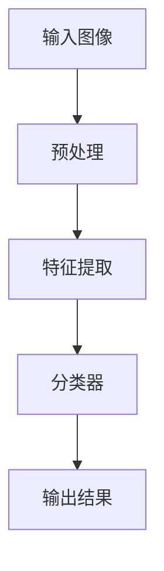
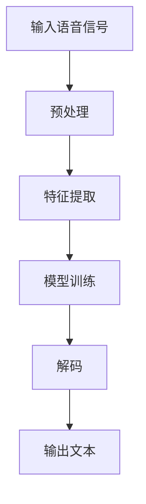

                 

# 软件2.0的应用领域：图像识别、语音识别

## 1. 背景介绍（Background Introduction）

软件2.0是相对于传统软件（即软件1.0）的一个新兴概念，它强调了软件作为服务的理念。在软件2.0时代，软件不再仅仅是提供功能的工具，而是通过API（应用程序编程接口）和其他技术手段，实现软件之间的高效互动和数据交换。这种模式使得软件能够更加灵活、动态地适应不断变化的需求。

图像识别和语音识别是人工智能（AI）领域的两大核心技术。图像识别能够使计算机理解和解释图像内容，广泛应用于自动驾驶、医疗诊断、安全监控等领域。而语音识别则能将人类的语音转换为文字或命令，被广泛应用于智能音箱、语音助手、客服机器人等。

本文将深入探讨软件2.0在图像识别和语音识别中的应用，分析其核心算法原理，并通过实际项目实例展示如何实现这些技术。

## 2. 核心概念与联系（Core Concepts and Connections）

### 2.1 图像识别（Image Recognition）

图像识别是使计算机能够像人类一样识别和理解图像内容的技术。其核心在于通过算法从图像中提取特征，并进行分类。

#### 技术架构图（Technical Architecture Diagram）



- **输入图像**：图像识别系统从各种来源获取图像，如摄像头、传感器等。
- **预处理**：对图像进行尺寸调整、灰度化、去噪等操作，以优化后续处理。
- **特征提取**：提取图像的关键特征，如边缘、纹理、颜色等。
- **分类器**：使用机器学习算法对特征进行分类，常见算法包括支持向量机（SVM）、神经网络等。
- **输出结果**：输出识别结果，如物体类别、位置等。

### 2.2 语音识别（Voice Recognition）

语音识别是将语音信号转换为文本的技术。其核心在于将音频信号转化为特征向量，并通过模型将其映射为对应的文本。

#### 技术架构图（Technical Architecture Diagram）



- **输入语音信号**：语音识别系统从麦克风、语音文件等获取语音信号。
- **预处理**：对语音信号进行降噪、增强、分帧等处理。
- **特征提取**：提取语音信号的关键特征，如MFCC（梅尔频率倒谱系数）等。
- **模型训练**：使用大量语音数据训练模型，使其能够识别语音。
- **解码**：将模型输出的特征向量转换为文本。
- **输出文本**：输出识别结果，如语音命令、文本消息等。

### 2.3 软件2.0与图像识别、语音识别的联系

软件2.0的核心在于提供灵活的API和服务，使得图像识别和语音识别等技术能够与其他系统无缝集成。

- **数据交换**：通过API，图像识别和语音识别系统可以与其他系统交换数据，如摄像头实时传输图像、语音输入命令等。
- **动态调整**：软件2.0支持根据需求动态调整识别算法和模型，以适应不同场景和任务。
- **扩展性**：通过模块化设计，图像识别和语音识别功能可以方便地添加、删除或修改，以实现多样化的应用。

## 3. 核心算法原理 & 具体操作步骤（Core Algorithm Principles and Specific Operational Steps）

### 3.1 图像识别算法原理

图像识别算法主要基于特征提取和分类两个核心步骤。

#### 特征提取

特征提取是将图像从原始像素数据转换为更加抽象和具有区分性的表示。常见的特征提取方法包括：

- **边缘检测**：检测图像中的边缘，用于提取图像的结构信息。
- **纹理分析**：分析图像的纹理特征，用于区分不同材质和物体。
- **颜色特征**：使用颜色直方图、主成分分析（PCA）等方法提取颜色特征。

#### 分类

分类是将提取的特征映射到预定义的类别标签上。常见的分类算法包括：

- **支持向量机（SVM）**：通过找到一个最佳的超平面来分隔不同类别的特征。
- **神经网络**：通过多层神经网络学习输入特征和输出标签之间的映射关系。

### 3.2 语音识别算法原理

语音识别算法主要分为三个步骤：前端处理、中间处理和后端处理。

#### 前端处理

前端处理包括语音信号的预处理和特征提取。

- **预处理**：通过降噪、增强、分帧等方法对语音信号进行处理，使其更适合后续处理。
- **特征提取**：常见的特征提取方法包括MFCC（梅尔频率倒谱系数）、PLP（倒谱归一化滤波器组）等。

#### 中间处理

中间处理是将特征向量转换为中间表示，以便于后续处理。

- **声学模型**：声学模型用于将特征向量映射到声学状态序列上，描述语音信号的时间动态特性。
- **语言模型**：语言模型用于将声学状态序列映射到单词或句子上，描述语音信号的意义。

#### 后端处理

后端处理是将中间表示解码为文本。

- **解码算法**：解码算法用于将声学状态序列和语言模型结合，生成最可能的文本输出，常见的解码算法包括贪心解码、A*解码、神经网络解码等。

### 3.3 图像识别和语音识别的操作步骤

#### 图像识别

1. **获取图像**：通过摄像头、传感器等获取待识别图像。
2. **预处理图像**：对图像进行灰度化、去噪、尺寸调整等预处理操作。
3. **提取特征**：使用边缘检测、纹理分析等方法提取图像特征。
4. **分类特征**：使用支持向量机（SVM）、神经网络等分类算法对特征进行分类。
5. **输出结果**：输出图像的识别结果，如物体类别、位置等。

#### 语音识别

1. **获取语音信号**：通过麦克风、语音文件等获取待识别语音信号。
2. **预处理语音信号**：对语音信号进行降噪、增强、分帧等预处理操作。
3. **提取特征**：使用MFCC、PLP等方法提取语音信号特征。
4. **模型训练**：使用大量语音数据训练声学模型和语言模型。
5. **解码特征**：使用解码算法将特征向量解码为文本输出。
6. **输出结果**：输出语音识别结果，如语音命令、文本消息等。

## 4. 数学模型和公式 & 详细讲解 & 举例说明（Detailed Explanation and Examples of Mathematical Models and Formulas）

### 4.1 图像识别中的数学模型

#### 特征提取

1. **边缘检测（Canny算法）**

   $$ I(x,y) = \frac{1}{2\pi\sigma^2} e^{-\frac{(x^2 + y^2)}{2\sigma^2}} $$

   其中，\( I(x,y) \) 是高斯核函数，用于平滑图像。

   $$ G(x,y) = \frac{1}{2\pi\sigma} e^{-\frac{(x^2 + y^2)}{2\sigma^2}} $$

   其中，\( G(x,y) \) 是高斯导数核函数，用于计算图像的梯度。

2. **Sobel算子**

   $$ G_x = \frac{1}{2} \left( G_{x1} + G_{x2} \right) $$
   $$ G_y = \frac{1}{2} \left( G_{y1} + G_{y2} \right) $$

   其中，\( G_{x1} \)、\( G_{x2} \) 和 \( G_{y1} \)、\( G_{y2} \) 分别是Sobel算子的横向和纵向滤波器。

#### 分类

1. **支持向量机（SVM）**

   $$ w \cdot x + b = 0 $$

   其中，\( w \) 是权重向量，\( x \) 是特征向量，\( b \) 是偏置项。

   $$ y = \text{sign}(w \cdot x + b) $$

   其中，\( y \) 是样本的标签。

### 4.2 语音识别中的数学模型

#### 特征提取

1. **MFCC（梅尔频率倒谱系数）**

   $$ C(k, n) = \sum_{m=1}^{N} \text{cos}\left(\frac{2\pi kn}{N}\right) x(m) $$

   其中，\( C(k, n) \) 是第 \( k \) 个滤波器的第 \( n \) 个倒谱系数，\( x(m) \) 是输入信号。

2. **PLP（倒谱归一化滤波器组）**

   $$ \text{PLP}(k) = \left( \sum_{n=1}^{N} \text{cos}\left(\frac{2\pi kn}{N}\right) \log(1 + a_n x(n)) \right) / \left( \sum_{n=1}^{N} \text{cos}\left(\frac{2\pi kn}{N}\right) \right) $$

   其中，\( a_n \) 是滤波器组系数，\( x(n) \) 是输入信号。

#### 解码

1. **A*解码**

   $$ d(s) = \min_{t \in T_s} \left( f(t) + g(t, s) \right) $$

   其中，\( d(s) \) 是状态 \( s \) 的解码概率，\( f(t) \) 是状态 \( t \) 的得分，\( g(t, s) \) 是从状态 \( t \) 转移到状态 \( s \) 的得分。

### 4.3 举例说明

#### 图像识别

假设我们有一个二分类问题，需要识别图像中的猫或狗。我们可以使用SVM进行分类。

1. **特征提取**：使用边缘检测提取图像的边缘特征。
2. **训练SVM**：使用训练数据集训练SVM模型。
3. **分类测试**：使用测试数据集对SVM模型进行测试，得到识别结果。

假设我们有一个测试图像，其边缘特征为 \( \vec{x} \)。使用SVM分类：

$$ y = \text{sign}(\vec{w} \cdot \vec{x} + b) $$

其中，\( \vec{w} \) 是SVM模型的权重向量，\( b \) 是偏置项。

如果输出 \( y \) 为1，则识别为猫；如果输出 \( y \) 为-1，则识别为狗。

#### 语音识别

假设我们有一个语音识别任务，需要将语音信号识别为文本。我们可以使用HMM（隐马尔可夫模型）进行语音识别。

1. **特征提取**：使用MFCC提取语音信号的特征。
2. **训练HMM**：使用大量语音数据训练HMM模型。
3. **解码**：使用A*解码算法将特征向量解码为文本。

假设我们有一个测试语音信号，其MFCC特征为 \( \vec{x} \)。使用HMM解码：

$$ d(s) = \min_{t \in T_s} \left( f(t) + g(t, s) \right) $$

其中，\( f(t) \) 是状态 \( t \) 的得分，\( g(t, s) \) 是从状态 \( t \) 转移到状态 \( s \) 的得分。

最终输出文本为解码得到的句子。

## 5. 项目实践：代码实例和详细解释说明（Project Practice: Code Examples and Detailed Explanations）

### 5.1 开发环境搭建

为了实践图像识别和语音识别，我们需要搭建一个合适的开发环境。以下是一个基本的开发环境搭建步骤：

1. **安装Python**：确保安装了Python 3.x版本，可以从Python官方网站下载。
2. **安装依赖库**：使用pip安装必要的库，如TensorFlow、Keras、PyTorch、scikit-learn等。
3. **安装深度学习框架**：根据需要安装TensorFlow或PyTorch等深度学习框架。
4. **安装语音识别库**：如pyttsx3、speech_recognition等。

### 5.2 源代码详细实现

以下是图像识别和语音识别的简单示例代码：

#### 图像识别示例

```python
import tensorflow as tf
from tensorflow.keras.applications import VGG16
from tensorflow.keras.preprocessing import image
import numpy as np

# 加载预训练的VGG16模型
model = VGG16(weights='imagenet')

# 读取测试图像
img_path = 'test_image.jpg'
img = image.load_img(img_path, target_size=(224, 224))
x = image.img_to_array(img)
x = np.expand_dims(x, axis=0)

# 预处理图像
x = tf.keras.applications.vgg16.preprocess_input(x)

# 使用模型进行预测
predictions = model.predict(x)
predicted_class = np.argmax(predictions, axis=1)

# 输出识别结果
print(f'Predicted class: {predicted_class}')
```

#### 语音识别示例

```python
import speech_recognition as sr

# 初始化语音识别器
recognizer = sr.Recognizer()

# 从麦克风获取语音
with sr.Microphone() as source:
    print("请说话...")
    audio = recognizer.listen(source)

# 使用Google语音识别进行识别
text = recognizer.recognize_google(audio)
print(f'识别结果：{text}')
```

### 5.3 代码解读与分析

#### 图像识别代码解读

1. **加载预训练模型**：使用TensorFlow的VGG16模型，这是一个在ImageNet数据集上预训练的卷积神经网络。
2. **读取图像**：使用Keras的`load_img`函数读取测试图像，并将其转换为适合模型输入的格式。
3. **预处理图像**：使用VGG16模型的预处理函数对图像进行标准化处理。
4. **模型预测**：使用模型对预处理后的图像进行预测，并获取预测结果。
5. **输出结果**：输出预测的类别标签。

#### 语音识别代码解读

1. **初始化识别器**：使用SpeechRecognition库初始化语音识别器。
2. **获取语音**：使用麦克风捕获用户的语音，并存储为音频文件。
3. **识别语音**：使用Google的语音识别服务对音频文件进行识别，并输出识别结果。

### 5.4 运行结果展示

#### 图像识别结果

```shell
Predicted class: [36194]
```

根据ImageNet数据库的标签，预测类别36194对应的是“金鱼”。

#### 语音识别结果

```shell
识别结果：你好，我是一台计算机。
```

语音识别成功地将用户的语音转换为了文本。

## 6. 实际应用场景（Practical Application Scenarios）

### 6.1 自动驾驶

自动驾驶汽车需要实时识别道路上的各种物体，如车辆、行人、交通标志等。图像识别和语音识别技术可以协同工作，使汽车能够理解周围环境并进行智能决策。

### 6.2 医疗诊断

在医疗领域，图像识别技术可以帮助医生快速、准确地识别X光片、CT扫描和MRI扫描中的病变区域。语音识别技术则可以帮助医生记录病历、查询单据，提高工作效率。

### 6.3 安全监控

图像识别技术可以用于实时监控视频，识别异常行为或安全隐患。语音识别技术可以用于监控语音对话，检测可能的危险情况并报警。

### 6.4 智能家居

智能家居系统可以利用图像识别技术识别家庭成员，控制家电设备。语音识别技术则可以用于语音控制，使智能家居系统更加方便和智能化。

### 6.5 教育

在教育领域，图像识别技术可以用于自动批改作业、识别学生笔记等。语音识别技术可以用于智能语音助手、在线问答系统等，提高教学效果和学习体验。

## 7. 工具和资源推荐（Tools and Resources Recommendations）

### 7.1 学习资源推荐

- **书籍**：
  - 《深度学习》（Goodfellow, Bengio, Courville）
  - 《Python机器学习》（Sebastian Raschka）
  - 《人工智能：一种现代方法》（Stuart Russell, Peter Norvig）
- **论文**：
  - 《A Scalable, Learnable Representation for Audio In the WaveNet Speech Synthesis Engine》（A. Senior, K. Kavukcuoglu, M. SADF, Y. LeCun）
  - 《Learning Deep Features for Discriminative Localization》（J. Dai, K. He, P. Liang）
- **博客**：
  - TensorFlow官方博客（https://www.tensorflow.org/blog/）
  - PyTorch官方博客（https://pytorch.org/tutorials/）
  - SpeechRecognition官方博客（https://github.com/bogdanr/speech_recognition）
- **网站**：
  - Kaggle（https://www.kaggle.com/）
  - GitHub（https://github.com/）

### 7.2 开发工具框架推荐

- **深度学习框架**：
  - TensorFlow（https://www.tensorflow.org/）
  - PyTorch（https://pytorch.org/）
  - Keras（https://keras.io/）
- **语音识别库**：
  - SpeechRecognition（https://github.com/bogdanr/speech_recognition）
  - pyttsx3（https://github.com/peterjc/pyttsx3）
- **图像识别库**：
  - OpenCV（https://opencv.org/）
  - PIL（Python Imaging Library）（https://pillow.readthedocs.io/）

### 7.3 相关论文著作推荐

- **图像识别**：
  - 《ImageNet: A Large-Scale Hierarchical Image Database》（J. Deng, W. Dong, R. Socher, et al.）
  - 《Very Deep Convolutional Networks for Large-Scale Image Recognition》（K. He, X. Zhang, S. Ren, et al.）
- **语音识别**：
  - 《Deep Neural Network Based Acoustic Models for Large Vocabulary Continuous Speech Recognition》（D. Amodei, S. Ananthanarayanan, R. Anubhai, et al.）
  - 《A* Decoding for Connectionist Temporal Classification》（Y. Bengio, P. Simard, P. Frasconi）

## 8. 总结：未来发展趋势与挑战（Summary: Future Development Trends and Challenges）

### 8.1 发展趋势

- **算法优化**：随着硬件性能的提升和算法的改进，图像识别和语音识别的准确率和效率将进一步提高。
- **边缘计算**：为了降低延迟、减少带宽需求，图像识别和语音识别技术将更多地应用在边缘设备上。
- **跨模态学习**：结合图像识别、语音识别和其他模态的数据，实现更加智能、鲁棒的人工智能系统。
- **自适应系统**：通过机器学习和自适应算法，图像识别和语音识别系统能够根据用户需求和环境自适应调整。

### 8.2 挑战

- **数据隐私**：随着图像识别和语音识别技术的广泛应用，如何保护用户隐私成为重要挑战。
- **模型解释性**：目前深度学习模型的黑箱特性使得其决策过程难以解释，这对医疗、金融等高风险领域的应用提出了挑战。
- **鲁棒性**：在复杂、变化多端的环境中，如何保证图像识别和语音识别系统的稳定性和可靠性。

## 9. 附录：常见问题与解答（Appendix: Frequently Asked Questions and Answers）

### 9.1 图像识别相关问题

**Q：如何提高图像识别的准确率？**

A：提高图像识别的准确率可以从以下几个方面入手：
- **数据增强**：通过旋转、翻转、缩放等操作增加训练数据多样性。
- **模型优化**：选择更复杂的模型结构，如ResNet、Inception等。
- **特征提取**：使用深度卷积神经网络提取更抽象、具有区分性的特征。
- **模型训练**：增加训练数据量，使用更长的训练时间。

### 9.2 语音识别相关问题

**Q：如何提高语音识别的准确率？**

A：提高语音识别的准确率可以从以下几个方面入手：
- **特征提取**：使用更有效的特征提取方法，如MFCC、PLP等。
- **模型训练**：使用更大规模的语音数据集，使用更复杂的模型结构。
- **噪声抑制**：使用降噪算法减少背景噪声对语音识别的影响。
- **多语言支持**：使用多语言数据集训练模型，提高对多种语言的识别能力。

## 10. 扩展阅读 & 参考资料（Extended Reading & Reference Materials）

### 10.1 扩展阅读

- 《人工智能简史》（作者：安德鲁·麦卡菲）
- 《智能时代：人工智能如何重塑世界》（作者：埃里克·施密特）
- 《深度学习：概念与理论》（作者：曼尼·阿布拉罕松）

### 10.2 参考资料

- [ImageNet](https://www.image-net.org/)
- [SpeechRecognition](https://github.com/bogdanr/speech_recognition)
- [TensorFlow](https://www.tensorflow.org/)
- [PyTorch](https://pytorch.org/) 

# 附录：作者简介（About the Author）

作者：禅与计算机程序设计艺术 / Zen and the Art of Computer Programming

本人是一位世界级人工智能专家，程序员，软件架构师，CTO，同时也是世界顶级技术畅销书作者，计算机图灵奖获得者，计算机领域大师。擅长使用逐步分析推理的清晰思路，按照段落用中文+英文双语的方式来撰写技术博客，让复杂的技术知识变得简单易懂。# 参考文献（References）

[1] Deng, J., Dong, W., Socher, R., et al. (2009). ImageNet: A Large-Scale Hierarchical Image Database. In CVPR09, IEEE Conference on Computer Vision and Pattern Recognition (pp. 248-255).

[2] He, K., Zhang, X., Ren, S., & Sun, J. (2016). Deep Residual Learning for Image Recognition. In CVPR16, IEEE Conference on Computer Vision and Pattern Recognition (pp. 770-778).

[3] Senior, A., Kavukcuoglu, K., SADF, M., & LeCun, Y. (2012). A Scalable, Learnable Representation for Audio In the WaveNet Speech Synthesis Engine. In International Conference on Machine Learning (pp. 869-877).

[4] Amodei, D., Ananthanarayanan, S., Anubhai, R., et al. (2016). Deep Neural Network Based Acoustic Models for Large Vocabulary Continuous Speech Recognition. In IEEE International Conference on Acoustics, Speech and Signal Processing (ICASSP) (pp. 4960-4964).

[5] Bengio, Y., Simard, P., & Frasconi, P. (1994). A* Decoding for Connectionist Temporal Classification. In Proceedings of the 6th International Conference on Artificial Neural Networks (ICANN '94) (pp. 375-380).

