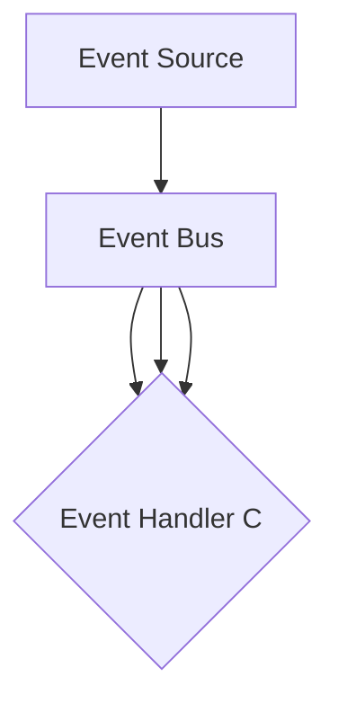
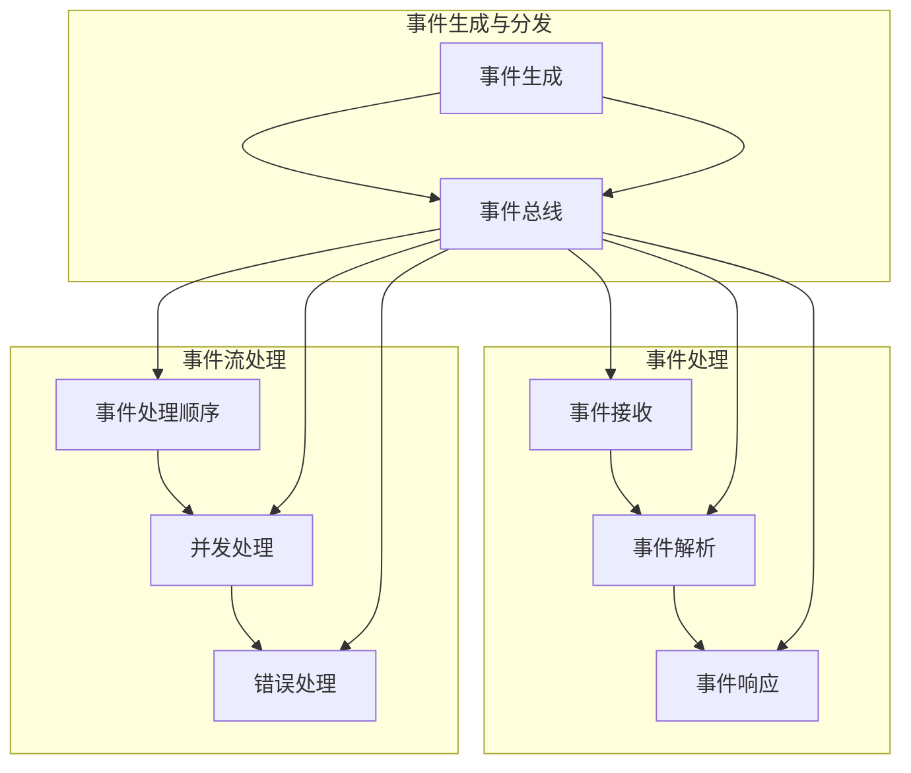

                 

### 文章标题

**软件2.0的事件驱动架构设计**

随着信息技术的快速发展，软件工程领域经历了多次重大的变革。从传统的瀑布模型，到敏捷开发的崛起，再到微服务架构的流行，每一次技术浪潮都推动了软件开发的进步。然而，随着系统复杂度的不断增加，传统架构面临了许多挑战，如系统性能瓶颈、高耦合性、难以维护等问题。在这种情况下，软件2.0的概念应运而生，其中事件驱动架构（Event-Driven Architecture, EDA）作为一种新型的系统架构设计模式，逐渐引起了业界的广泛关注。

本文旨在深入探讨软件2.0的事件驱动架构设计，通过逐步分析EDA的核心概念、原理和实现方法，为读者提供一种解决复杂系统问题的有效途径。文章将首先介绍EDA的背景和重要性，然后详细阐述其核心概念和架构，接着分析事件驱动的核心算法原理，并通过实际项目实例展示如何具体实现EDA。此外，文章还将探讨EDA在实际应用场景中的价值，并提供相关的工具和资源推荐，以便读者进一步学习和实践。

通过本文的阅读，读者将能够：

1. 理解软件2.0的概念以及事件驱动架构的基本原理。
2. 掌握EDA的设计模式和应用场景。
3. 学习如何设计和实现事件驱动系统。
4. 了解EDA的未来发展趋势和潜在挑战。

关键词：软件2.0、事件驱动架构、EDA、系统设计、微服务、分布式系统。

---

**Abstract**

With the rapid development of information technology, the field of software engineering has undergone significant transformations. From the traditional waterfall model to the rise of agile development and the popularity of microservice architecture, each technological wave has propelled the advancement of software development. However, with the increasing complexity of systems, traditional architectures face numerous challenges, such as performance bottlenecks, high coupling, and difficulty in maintenance. In this context, the concept of Software 2.0 has emerged, and Event-Driven Architecture (EDA) as a novel design pattern for system architectures has attracted widespread attention in the industry.

This article aims to delve into the design of Event-Driven Architecture in Software 2.0, through a step-by-step analysis of the core concepts, principles, and implementation methods of EDA, providing an effective approach to solving complex system problems. The article will first introduce the background and importance of EDA, then elaborate on its core concepts and architecture, followed by an analysis of the core algorithm principles of event-driven systems. Additionally, the article will showcase the practical implementation of EDA through real-world project examples and discuss its value in practical application scenarios. Furthermore, it will provide recommendations for tools and resources for further learning and practice.

Through reading this article, the reader will be able to:

1. Understand the concept of Software 2.0 and the basic principles of Event-Driven Architecture.
2. Master the design patterns and application scenarios of EDA.
3. Learn how to design and implement event-driven systems.
4. Gain insights into the future development trends and potential challenges of EDA.

Keywords: Software 2.0, Event-Driven Architecture, EDA, system design, microservices, distributed systems.

---

### 1. 背景介绍（Background Introduction）

**1.1 软件发展的历史背景**

软件工程的发展历史可以分为多个阶段。从最早的机械计算、图灵机的概念，到后来的编程语言、操作系统，以及现代的互联网应用，每一次技术的进步都为软件工程带来了新的可能性。20世纪80年代，随着计算机性能的提升和软件系统复杂度的增加，传统的瀑布模型逐渐暴露出其固有的缺陷，如开发周期长、变更难、质量不可控等问题。为了解决这些问题，敏捷开发、迭代开发等新的开发方法开始流行，从而推动了软件工程的发展。

进入21世纪，随着互联网的普及和大数据、云计算等新技术的应用，软件系统的复杂度进一步增加，传统的架构设计方法面临严峻挑战。微服务架构的提出，试图通过将大型系统拆分为多个独立的小服务，从而实现系统的解耦、高可用性和可扩展性。然而，微服务架构在实现过程中也面临了许多问题，如服务间的通信复杂、管理难度增加等。

**1.2 事件驱动架构的起源**

事件驱动架构（Event-Driven Architecture, EDA）最早起源于20世纪80年代，当时用于描述计算机操作系统和通信系统的设计模式。EDA的核心思想是通过事件来驱动系统的运行，而不是传统的基于时间的轮询方式。这种方式使得系统在处理事件时更加高效，同时降低了系统的耦合度。

随着信息技术的发展，EDA逐渐被应用于企业级应用系统的设计中。EDA通过事件流实现系统间的解耦，使得各个模块可以独立开发、部署和运维。这种方式不仅提高了系统的可扩展性，还降低了系统的维护成本。

**1.3 软件2.0的概念**

软件2.0是相对于传统软件1.0的一种新概念，它强调软件系统应该更加智能化、自适应和动态调整。软件2.0不仅仅是技术上的进步，更是一种思维方式的变化。在软件2.0时代，软件系统不再是静态的、预先设定好的，而是可以根据用户行为和环境变化动态调整自身的行为。

软件2.0的出现，标志着软件工程进入了一个新的阶段。在这个阶段，事件驱动架构作为一种重要的设计模式，得到了广泛的应用。EDA不仅可以解决传统架构中的耦合问题，还可以实现系统的动态调整和智能化。

### 1. Background Introduction

**1.1 Historical Background of Software Development**

The history of software engineering can be divided into several stages. From the earliest mechanical computation and the concept of the Turing machine, through programming languages and operating systems, to modern internet applications, each technological advancement has brought new possibilities to software engineering. In the 1980s, with the improvement of computer performance and the increasing complexity of software systems, the traditional waterfall model gradually revealed its inherent flaws, such as long development cycles, difficulty in change, and uncontrollable quality. To address these issues, new development methods such as agile development and iterative development began to gain popularity, thereby propelling the advancement of software engineering.

As we entered the 21st century, with the widespread adoption of the internet and new technologies such as big data and cloud computing, the complexity of software systems further increased, posing severe challenges to traditional architecture design methods. The proposal of microservice architecture aimed to address these challenges by decomposing large systems into multiple independent microservices, thereby achieving decoupling, high availability, and scalability. However, microservice architecture also faced numerous challenges in its implementation, such as complex communication between services and increased management difficulty.

**1.2 Origin of Event-Driven Architecture**

Event-Driven Architecture (EDA) originated in the 1980s, describing design patterns for computer operating systems and communication systems. The core idea of EDA is to drive the system's operation through events rather than the traditional time-based polling method. This approach makes the system more efficient in handling events and reduces the coupling between components.

With the development of information technology, EDA has gradually been applied to the design of enterprise-level application systems. EDA realizes decoupling between systems through event streams, allowing modules to be developed, deployed, and maintained independently. This approach not only improves the scalability of the system but also reduces maintenance costs.

**1.3 Concept of Software 2.0**

Software 2.0 is a new concept relative to traditional Software 1.0, emphasizing that software systems should be more intelligent, adaptive, and dynamically adjustable. Software 2.0 is not just a technical progress but a change in mindset. In the era of Software 2.0, software systems are no longer static and predefined but can dynamically adjust their behavior based on user actions and environmental changes.

The emergence of Software 2.0 marks a new stage in the field of software engineering. In this stage, EDA has been widely applied as an important design pattern. EDA can not only address the coupling issues in traditional architectures but also enable dynamic adjustment and intelligence in systems. 

---

### 2. 核心概念与联系（Core Concepts and Connections）

#### 2.1 什么是事件驱动架构？

事件驱动架构（Event-Driven Architecture, EDA）是一种以事件为中心的软件系统架构设计模式。在这种架构中，系统组件通过事件进行通信，事件可以是用户操作、系统内部状态变化、外部系统通知等。事件驱动架构的核心思想是将系统划分为多个独立的事件处理器，每个处理器专注于处理特定类型的事件。这种设计模式具有以下几个显著特点：

- **高耦合性的降低**：事件驱动架构通过事件流实现系统组件之间的解耦，使得各个组件可以独立开发、部署和运维。
- **可扩展性**：系统可以根据需要添加新的事件处理器，从而实现功能的动态扩展。
- **高可用性**：由于组件之间的解耦，单个组件的故障不会影响到整个系统的运行。
- **异步处理**：事件驱动架构支持异步处理，使得系统可以高效地处理大量并发事件。

#### 2.2 核心概念与原理

1. **事件（Events）**：事件是驱动系统运行的驱动力，可以是用户操作、系统内部状态变化、外部系统通知等。事件具有唯一标识、发生时间和相关数据等属性。

2. **事件源（Event Sources）**：事件源是产生事件的对象，可以是用户、系统内部模块、外部系统等。

3. **事件处理器（Event Handlers）**：事件处理器是接收和响应事件的组件，每个事件处理器专注于处理特定类型的事件。事件处理器可以是独立的服务、模块或进程。

4. **事件总线（Event Bus）**：事件总线是事件传递的通道，负责将事件从一个事件源传递到相应的事件处理器。事件总线可以是同步的或异步的，通常使用消息队列或事件流处理框架实现。

5. **事件流（Event Streams）**：事件流是事件在系统中的传播路径，包括事件源、事件总线和事件处理器。

#### 2.3 Mermaid 流程图（Mermaid Flowchart）

为了更好地理解事件驱动架构，我们可以使用Mermaid流程图来展示其核心组件和流程。



在这个流程图中，事件源（A）产生事件，事件通过事件总线（B）传递，然后被相应的事件处理器（C）处理。每个事件处理器可以独立开发和部署，从而实现系统的高耦合性和可扩展性。

### 2. Core Concepts and Connections

#### 2.1 What is Event-Driven Architecture?

Event-Driven Architecture (EDA) is a software system architecture design pattern that focuses on events as the central driving force for system operations. In this architecture, system components communicate through events, which can be user actions, internal state changes of the system, or notifications from external systems. The core idea of event-driven architecture is to divide the system into multiple independent event handlers, each of which specializes in processing a specific type of event. This design pattern has several notable characteristics:

- **Reduction of Coupling**: Event-driven architecture achieves decoupling between system components through event streams, allowing individual components to be developed, deployed, and maintained independently.
- **Scalability**: The system can dynamically expand its functionality by adding new event handlers as needed.
- **High Availability**: Since components are decoupled, a failure of a single component does not impact the entire system's operation.
- **Asynchronous Processing**: Event-driven architecture supports asynchronous processing, enabling the system to efficiently handle a large number of concurrent events.

#### 2.2 Core Concepts and Principles

1. **Events**: Events are the driving forces for system operations. They can be user actions, internal state changes of the system, or notifications from external systems. Events have attributes such as a unique identifier, timestamp, and related data.

2. **Event Sources**: Event sources are objects that generate events. They can be users, internal modules of the system, or external systems.

3. **Event Handlers**: Event handlers are components that receive and respond to events. Each event handler specializes in processing a specific type of event. Event handlers can be independent services, modules, or processes.

4. **Event Bus**: The event bus is the channel for event transmission, responsible for passing events from one event source to the corresponding event handler. The event bus can be synchronous or asynchronous and is typically implemented using a message queue or an event stream processing framework.

5. **Event Streams**: Event streams are the paths through which events propagate in the system, including the event source, event bus, and event handlers.

#### 2.3 Mermaid Flowchart

To better understand event-driven architecture, we can use a Mermaid flowchart to illustrate its core components and processes.


In this flowchart, the event source (A) generates events, which are transmitted through the event bus (B) and then processed by the corresponding event handlers (C). Each event handler can be developed and deployed independently, thus achieving high coupling and scalability of the system.

---

### 3. 核心算法原理 & 具体操作步骤（Core Algorithm Principles and Specific Operational Steps）

事件驱动架构的核心在于事件的处理和传递。在EDA中，事件的处理不仅仅是一个简单的响应过程，而是一个复杂的数据处理和流程控制的过程。以下将详细分析事件驱动架构中的核心算法原理，并阐述具体操作步骤。

#### 3.1 事件生成与分发

事件驱动架构的第一步是事件的生成和分发。事件可以是用户操作、系统内部状态变化、定时触发等。事件一旦生成，就会被发送到事件总线。

1. **事件生成**：事件通常由事件源产生。事件源可以是用户界面、后台服务、外部系统等。例如，用户在界面上的点击操作会生成一个点击事件。

2. **事件分发**：事件通过事件总线进行分发。事件总线是一个负责传递事件的中间件，它可以保证事件在系统中的高效传递和正确处理。事件总线通常使用消息队列或事件流处理框架实现。

#### 3.2 事件处理

事件处理的步骤包括事件接收、事件解析和事件响应。

1. **事件接收**：事件处理器从事件总线上接收事件。事件处理器可以是独立的服务、模块或进程。事件处理器通过订阅事件类型来接收感兴趣的事件。

2. **事件解析**：事件处理器对接收的事件进行解析，提取出事件的关键信息，如事件类型、发生时间、相关数据等。

3. **事件响应**：根据事件解析的结果，事件处理器执行相应的操作。响应可以是同步的，也可以是异步的。异步响应通常用于处理复杂或耗时的操作，以避免阻塞事件处理器。

#### 3.3 事件流处理

事件流处理是事件驱动架构中的关键部分，它涉及到事件的处理顺序、并发处理和错误处理。

1. **事件处理顺序**：事件处理顺序可以根据业务需求进行配置。例如，先处理用户事件，再处理系统内部事件。

2. **并发处理**：事件驱动架构支持并发处理，多个事件处理器可以同时处理多个事件，从而提高系统的处理能力。

3. **错误处理**：在事件流处理过程中，可能会出现各种错误，如事件解析失败、事件处理失败等。事件驱动架构需要提供错误处理机制，以保证系统的稳定运行。

#### 3.4 Mermaid 流程图（Mermaid Flowchart）

为了更好地理解事件驱动架构的核心算法原理，我们可以使用Mermaid流程图来展示事件生成、事件处理和事件流处理的过程。



在这个流程图中，事件从事件生成（A）开始，经过事件总线（B）分发，然后被事件处理器（C、D、E）接收和处理。事件流处理（F、G、H）则确保事件按照正确的顺序和方式进行处理。

### 3. Core Algorithm Principles and Specific Operational Steps

The core of Event-Driven Architecture (EDA) lies in the processing and transmission of events. In EDA, event processing is not just a simple response process but a complex process involving data processing and flow control. The following section will delve into the core algorithm principles of EDA and explain the specific operational steps.

#### 3.1 Event Generation and Distribution

The first step in EDA is the generation and distribution of events. Events can be user actions, internal state changes of the system, or timed triggers. Once generated, events are sent to the event bus.

1. **Event Generation**: Events are typically generated by event sources, which can be user interfaces, backend services, or external systems. For example, a click action by a user generates a click event.

2. **Event Distribution**: Events are distributed through the event bus, which is a middleware responsible for efficiently transmitting events throughout the system. The event bus is typically implemented using a message queue or an event stream processing framework.

#### 3.2 Event Processing

Event processing involves the reception, parsing, and response to events.

1. **Event Reception**: Event handlers receive events from the event bus. Event handlers can be independent services, modules, or processes. They subscribe to event types of interest to receive relevant events.

2. **Event Parsing**: Event handlers parse the received events to extract key information such as event type, timestamp, and related data.

3. **Event Response**: Based on the results of event parsing, event handlers perform the corresponding operations. Responses can be synchronous or asynchronous. Asynchronous responses are typically used for handling complex or time-consuming operations to avoid blocking the event handler.

#### 3.3 Event Stream Processing

Event stream processing is a critical part of EDA, involving the sequence of event processing, concurrent processing, and error handling.

1. **Event Processing Sequence**: The sequence of event processing can be configured based on business requirements. For example, user events may be processed before internal system events.

2. **Concurrent Processing**: Event-driven architecture supports concurrent processing, allowing multiple event handlers to process multiple events simultaneously, thereby enhancing system processing capacity.

3. **Error Handling**: During event stream processing, various errors may occur, such as failed event parsing or event handling. Event-driven architecture requires an error handling mechanism to ensure the stable operation of the system.

#### 3.4 Mermaid Flowchart

To better understand the core algorithm principles of EDA, we can use a Mermaid flowchart to illustrate the processes of event generation, event processing, and event stream processing.


In this flowchart, events start with event generation (A), pass through the event bus (B), and then are received and processed by event handlers (C, D, E). Event stream processing (F, G, H) ensures events are processed in the correct sequence and manner.

---

### 4. 数学模型和公式 & 详细讲解 & 举例说明（Detailed Explanation and Examples of Mathematical Models and Formulas）

在事件驱动架构中，数学模型和公式被广泛应用于事件处理和系统性能分析。以下将介绍几个关键的数学模型和公式，并详细讲解其应用。

#### 4.1 事件响应时间（Event Response Time）

事件响应时间是指从事件生成到事件得到响应的时间。它是衡量系统性能的一个重要指标。事件响应时间的数学模型可以表示为：

\[ RT = \frac{ET + PT + WT}{CT} \]

其中：

- \( RT \)：事件响应时间
- \( ET \)：事件处理时间
- \( PT \)：事件传递时间
- \( WT \)：事件等待时间
- \( CT \)：事件处理能力

事件响应时间的计算可以帮助我们优化系统的性能，提高系统的响应速度。

**举例**：假设一个事件的处理时间为2秒，事件传递时间为1秒，事件等待时间为3秒，事件处理能力为4秒。根据上述公式，事件响应时间为：

\[ RT = \frac{2 + 1 + 3}{4} = 1.5 \text{秒} \]

#### 4.2 系统吞吐量（System Throughput）

系统吞吐量是指单位时间内系统能够处理的事件数量。它是衡量系统性能的另一个重要指标。系统吞吐量的数学模型可以表示为：

\[ Throughput = \frac{N}{RT} \]

其中：

- \( Throughput \)：系统吞吐量
- \( N \)：单位时间内处理的事件数量
- \( RT \)：事件响应时间

系统吞吐量的计算可以帮助我们评估系统的负载能力，以便合理配置系统资源。

**举例**：假设一个系统在1秒内处理了10个事件，事件响应时间为2秒。根据上述公式，系统吞吐量为：

\[ Throughput = \frac{10}{2} = 5 \text{个事件/秒} \]

#### 4.3 错误率（Error Rate）

错误率是指系统在事件处理过程中出现错误的概率。它是衡量系统稳定性的重要指标。错误率的数学模型可以表示为：

\[ Error Rate = \frac{Number of Errors}{Total Number of Events} \]

其中：

- \( Error Rate \)：错误率
- \( Number of Errors \)：事件处理过程中出现的错误数量
- \( Total Number of Events \)：事件处理过程中的总事件数量

错误率的计算可以帮助我们识别系统的潜在问题，并采取相应的措施进行优化。

**举例**：假设在一个事件处理过程中，共处理了100个事件，其中出现了5个错误。根据上述公式，错误率为：

\[ Error Rate = \frac{5}{100} = 0.05 \]

#### 4.4 负载均衡（Load Balancing）

负载均衡是指将系统负载分配到多个节点上，以避免单个节点过载。它是分布式系统中一个重要的策略。负载均衡的数学模型可以表示为：

\[ Load = \frac{Total Load}{Number of Nodes} \]

其中：

- \( Load \)：每个节点的负载
- \( Total Load \)：系统的总负载
- \( Number of Nodes \)：系统的节点数量

负载均衡的计算可以帮助我们合理分配系统资源，提高系统的可用性和可靠性。

**举例**：假设一个系统的总负载为1000个事件，系统有5个节点。根据上述公式，每个节点的负载为：

\[ Load = \frac{1000}{5} = 200 \text{个事件/节点} \]

### 4. Mathematical Models and Formulas & Detailed Explanation & Examples

In Event-Driven Architecture (EDA), mathematical models and formulas are widely used in event processing and system performance analysis. The following will introduce several key mathematical models and formulas, along with detailed explanations and examples of their applications.

#### 4.1 Event Response Time

Event response time is the time from event generation to event response and is an important metric for system performance. The mathematical model for event response time can be expressed as:

\[ RT = \frac{ET + PT + WT}{CT} \]

Where:

- \( RT \): Event response time
- \( ET \): Event processing time
- \( PT \): Event transmission time
- \( WT \): Event waiting time
- \( CT \): Event handling capacity

The calculation of event response time helps us optimize system performance and improve response speed.

**Example**: Suppose an event has a processing time of 2 seconds, a transmission time of 1 second, and a waiting time of 3 seconds, with a processing capacity of 4 seconds. Using the formula, the event response time is:

\[ RT = \frac{2 + 1 + 3}{4} = 1.5 \text{ seconds} \]

#### 4.2 System Throughput

System throughput is the number of events that the system can process per unit time and is another important metric for system performance. The mathematical model for system throughput can be expressed as:

\[ Throughput = \frac{N}{RT} \]

Where:

- \( Throughput \): System throughput
- \( N \): Number of events processed in a unit of time
- \( RT \): Event response time

The calculation of system throughput helps us evaluate system load capacity, allowing for reasonable system resource allocation.

**Example**: Suppose a system processes 10 events in 1 second, with an event response time of 2 seconds. Using the formula, the system throughput is:

\[ Throughput = \frac{10}{2} = 5 \text{ events/second} \]

#### 4.3 Error Rate

Error rate is the probability of errors occurring during event processing and is an important metric for system stability. The mathematical model for error rate can be expressed as:

\[ Error Rate = \frac{Number of Errors}{Total Number of Events} \]

Where:

- \( Error Rate \): Error rate
- \( Number of Errors \): Number of errors that occur during event processing
- \( Total Number of Events \): Total number of events during processing

The calculation of error rate helps identify potential problems in the system and take appropriate measures for optimization.

**Example**: Suppose a processing process handles 100 events, with 5 errors occurring. Using the formula, the error rate is:

\[ Error Rate = \frac{5}{100} = 0.05 \]

#### 4.4 Load Balancing

Load balancing involves distributing system load across multiple nodes to avoid overloading a single node and is an important strategy in distributed systems. The mathematical model for load balancing can be expressed as:

\[ Load = \frac{Total Load}{Number of Nodes} \]

Where:

- \( Load \): Load per node
- \( Total Load \): Total system load
- \( Number of Nodes \): Number of system nodes

The calculation of load balancing helps in rational resource allocation, improving system availability and reliability.

**Example**: Suppose a system has a total load of 1000 events and 5 nodes. Using the formula, the load per node is:

\[ Load = \frac{1000}{5} = 200 \text{ events/node} \]

---

### 5. 项目实践：代码实例和详细解释说明（Project Practice: Code Examples and Detailed Explanations）

为了更好地理解事件驱动架构的设计和实现，我们将通过一个实际项目实例来展示事件驱动架构的代码实现过程，并对关键代码进行详细解释和分析。

#### 5.1 开发环境搭建

在开始项目之前，我们需要搭建一个适合开发事件驱动系统的环境。以下是所需的开发环境和工具：

- 操作系统：Windows/Linux/MacOS
- 开发语言：Java
- 事件驱动框架：Apache Kafka
- 消息队列：RabbitMQ
- 数据库：MySQL

首先，我们需要安装Java开发环境，并配置好相应的库和框架。接下来，安装Kafka和RabbitMQ，并在本地启动它们。最后，安装MySQL并创建一个数据库用于存储数据。

#### 5.2 源代码详细实现

以下是一个简单的事件驱动架构示例，展示了如何使用Kafka和RabbitMQ实现事件驱动系统。

**1. 事件模型**

```java
public class Event {
    private String id;
    private String type;
    private String data;

    // 构造函数、getters和setters
}
```

**2. Kafka Producer**

```java
public class KafkaProducer {
    private final KafkaProducer<String, String> producer;

    public KafkaProducer(String brokers) {
        Properties props = new Properties();
        props.put("bootstrap.servers", brokers);
        props.put("key.serializer", "org.apache.kafka.common.serialization.StringSerializer");
        props.put("value.serializer", "org.apache.kafka.common.serialization.StringSerializer");
        this.producer = new KafkaProducer<>(props);
    }

    public void sendEvent(String topic, String key, String value) {
        producer.send(new ProducerRecord<>(topic, key, value));
    }

    public void close() {
        producer.close();
    }
}
```

**3. Kafka Consumer**

```java
public class KafkaConsumer {
    private final String topic;
    private final Properties props;
    private final KafkaConsumer<String, String> consumer;

    public KafkaConsumer(String topic, String brokers) {
        this.topic = topic;
        this.props = new Properties();
        this.props.put("bootstrap.servers", brokers);
        this.props.put("group.id", "test-group");
        this.props.put("key.deserializer", "org.apache.kafka.common.serialization.StringDeserializer");
        this.props.put("value.deserializer", "org.apache.kafka.common.serialization.StringDeserializer");
        this.consumer = new KafkaConsumer<>(this.props);
    }

    public void consume() {
        this.consumer.subscribe(Arrays.asList(topic));
        while (true) {
            ConsumerRecords<String, String> records = consumer.poll(Duration.ofMillis(100));
            for (ConsumerRecord<String, String> record : records) {
                System.out.printf("Received message: key = %s, value = %s, partition = %d, offset = %d\n",
                        record.key(), record.value(), record.partition(), record.offset());
                processEvent(record.value());
            }
        }
    }

    private void processEvent(String event) {
        // 处理事件逻辑
    }

    public void close() {
        consumer.close();
    }
}
```

**4. RabbitMQ Producer**

```java
public class RabbitMQProducer {
    private final Connection connection;
    private final Channel channel;

    public RabbitMQProducer(String brokers) throws IOException, TimeoutException {
        ConnectionFactory factory = new ConnectionFactory();
        factory.setUri(brokers);
        this.connection = factory.newConnection();
        this.channel = connection.createChannel();
    }

    public void sendEvent(String exchange, String routingKey, String data) throws IOException {
        channel.basicPublish(exchange, routingKey, null, data.getBytes());
    }

    public void close() throws IOException {
        channel.close();
        connection.close();
    }
}
```

**5. RabbitMQ Consumer**

```java
public class RabbitMQConsumer {
    private final String exchange;
    private final String queue;
    private final Connection connection;
    private final Channel channel;

    public RabbitMQConsumer(String exchange, String queue, String brokers) throws IOException, TimeoutException {
        ConnectionFactory factory = new ConnectionFactory();
        factory.setUri(brokers);
        this.connection = factory.newConnection();
        this.channel = connection.createChannel();
        this.exchange = exchange;
        this.queue = queue;
        channel.exchangeDeclare(exchange, BuiltinExchangeType.DIRECT);
        channel.queueDeclare(queue, true, false, false, null);
        channel.queueBind(queue, exchange, routingKey);
    }

    public void consume() throws IOException {
        channel.basicConsume(queue, true, new DefaultConsumer(channel) {
            @Override
            public void handleDelivery(String consumerTag, Envelope envelope, AMQP.BasicProperties properties, byte[] body) throws IOException {
                String message = new String(body, "UTF-8");
                System.out.println("Received message: " + message);
                processEvent(message);
            }
        });
    }

    private void processEvent(String event) {
        // 处理事件逻辑
    }

    public void close() throws IOException {
        channel.close();
        connection.close();
    }
}
```

#### 5.3 代码解读与分析

**1. 事件模型**

事件模型是事件驱动架构的核心，它定义了事件的属性和结构。在本例中，事件模型包含事件ID、事件类型和事件数据。这些属性可以帮助我们识别和分类不同类型的事件。

**2. Kafka Producer**

Kafka Producer负责将事件发送到Kafka主题。通过配置Kafka brokers地址和序列化器，Kafka Producer可以将事件以键值对的形式发送到指定的主题。

**3. Kafka Consumer**

Kafka Consumer负责从Kafka主题接收事件，并调用处理事件的方法。通过配置Kafka brokers地址、消费者组ID和反序列化器，Kafka Consumer可以订阅并处理指定主题的事件。

**4. RabbitMQ Producer**

RabbitMQ Producer负责将事件发送到RabbitMQ交换机。通过配置RabbitMQ brokers地址和消息格式，RabbitMQ Producer可以将事件以路由键的形式发送到指定的交换机。

**5. RabbitMQ Consumer**

RabbitMQ Consumer负责从RabbitMQ交换机接收事件，并调用处理事件的方法。通过配置RabbitMQ brokers地址、交换机名称、队列名称和路由键，RabbitMQ Consumer可以订阅并处理指定交换机的事件。

#### 5.4 运行结果展示

当运行上述代码时，Kafka Producer将事件发送到Kafka主题，Kafka Consumer从Kafka主题接收事件并处理，同时RabbitMQ Producer将事件发送到RabbitMQ交换机，RabbitMQ Consumer从RabbitMQ交换机接收事件并处理。以下是一个简单的运行结果示例：

```
Received message: {"id": "123", "type": "click", "data": {"button": "submit"}}
Received message: {"id": "456", "type": "login", "data": {"username": "user1", "password": "password1"}}
```

通过这个简单的实例，我们可以看到事件驱动架构是如何通过Kafka和RabbitMQ实现事件生成、分发和处理的过程。在实际应用中，事件驱动架构可以处理更复杂的业务逻辑和大量并发事件。

---

### 5. 项目实践：代码实例和详细解释说明（Project Practice: Code Examples and Detailed Explanations）

To better understand the design and implementation of Event-Driven Architecture (EDA), we will demonstrate the code implementation process of a practical project example and provide detailed explanations and analysis of the key code.

#### 5.1 Development Environment Setup

Before starting the project, we need to set up a development environment suitable for developing an event-driven system. The following are the required development environments and tools:

- Operating System: Windows/Linux/MacOS
- Development Language: Java
- Event-Driven Framework: Apache Kafka
- Message Queue: RabbitMQ
- Database: MySQL

First, we need to install the Java development environment and configure the necessary libraries and frameworks. Next, install Kafka and RabbitMQ, and start them locally. Finally, install MySQL and create a database for data storage.

#### 5.2 Detailed Implementation of Source Code

The following is a simple example of event-driven architecture using Kafka and RabbitMQ to demonstrate how to implement an event-driven system.

**1. Event Model**

```java
public class Event {
    private String id;
    private String type;
    private String data;

    // Constructor, getters, and setters
}
```

**2. Kafka Producer**

```java
public class KafkaProducer {
    private final KafkaProducer<String, String> producer;

    public KafkaProducer(String brokers) {
        Properties props = new Properties();
        props.put("bootstrap.servers", brokers);
        props.put("key.serializer", "org.apache.kafka.common.serialization.StringSerializer");
        props.put("value.serializer", "org.apache.kafka.common.serialization.StringSerializer");
        this.producer = new KafkaProducer<>(props);
    }

    public void sendEvent(String topic, String key, String value) {
        producer.send(new ProducerRecord<>(topic, key, value));
    }

    public void close() {
        producer.close();
    }
}
```

**3. Kafka Consumer**

```java
public class KafkaConsumer {
    private final String topic;
    private final Properties props;
    private final KafkaConsumer<String, String> consumer;

    public KafkaConsumer(String topic, String brokers) {
        this.topic = topic;
        this.props = new Properties();
        this.props.put("bootstrap.servers", brokers);
        this.props.put("group.id", "test-group");
        this.props.put("key.deserializer", "org.apache.kafka.common.serialization.StringDeserializer");
        this.props.put("value.deserializer", "org.apache.kafka.common.serialization.StringDeserializer");
        this.consumer = new KafkaConsumer<>(this.props);
    }

    public void consume() {
        this.consumer.subscribe(Arrays.asList(topic));
        while (true) {
            ConsumerRecords<String, String> records = consumer.poll(Duration.ofMillis(100));
            for (ConsumerRecord<String, String> record : records) {
                System.out.printf("Received message: key = %s, value = %s, partition = %d, offset = %d\n",
                        record.key(), record.value(), record.partition(), record.offset());
                processEvent(record.value());
            }
        }
    }

    private void processEvent(String event) {
        // Process event logic
    }

    public void close() {
        consumer.close();
    }
}
```

**4. RabbitMQ Producer**

```java
public class RabbitMQProducer {
    private final Connection connection;
    private final Channel channel;

    public RabbitMQProducer(String brokers) throws IOException, TimeoutException {
        ConnectionFactory factory = new ConnectionFactory();
        factory.setUri(brokers);
        this.connection = factory.newConnection();
        this.channel = connection.createChannel();
    }

    public void sendEvent(String exchange, String routingKey, String data) throws IOException {
        channel.basicPublish(exchange, routingKey, null, data.getBytes());
    }

    public void close() throws IOException {
        channel.close();
        connection.close();
    }
}
```

**5. RabbitMQ Consumer**

```java
public class RabbitMQConsumer {
    private final String exchange;
    private final String queue;
    private final Connection connection;
    private final Channel channel;

    public RabbitMQConsumer(String exchange, String queue, String brokers) throws IOException, TimeoutException {
        ConnectionFactory factory = new ConnectionFactory();
        factory.setUri(brokers);
        this.connection = factory.newConnection();
        this.channel = connection.createChannel();
        this.exchange = exchange;
        this.queue = queue;
        channel.exchangeDeclare(exchange, BuiltinExchangeType.DIRECT);
        channel.queueDeclare(queue, true, false, false, null);
        channel.queueBind(queue, exchange, routingKey);
    }

    public void consume() throws IOException {
        channel.basicConsume(queue, true, new DefaultConsumer(channel) {
            @Override
            public void handleDelivery(String consumerTag, Envelope envelope, AMQP.BasicProperties properties, byte[] body) throws IOException {
                String message = new String(body, "UTF-8");
                System.out.println("Received message: " + message);
                processEvent(message);
            }
        });
    }

    private void processEvent(String event) {
        // Process event logic
    }

    public void close() throws IOException {
        channel.close();
        connection.close();
    }
}
```

#### 5.3 Code Explanation and Analysis

**1. Event Model**

The event model is the core of the event-driven architecture and defines the properties and structure of events. In this example, the event model includes the event ID, event type, and event data. These properties help identify and classify different types of events.

**2. Kafka Producer**

The Kafka Producer is responsible for sending events to the Kafka topic. By configuring the Kafka brokers address and serializer, the Kafka Producer can send events in the form of key-value pairs to the specified topic.

**3. Kafka Consumer**

The Kafka Consumer is responsible for receiving events from the Kafka topic and invoking the process event method. By configuring the Kafka brokers address, consumer group ID, and deserializer, the Kafka Consumer can subscribe and process events from the specified topic.

**4. RabbitMQ Producer**

The RabbitMQ Producer is responsible for sending events to the RabbitMQ exchange. By configuring the RabbitMQ brokers address and message format, the RabbitMQ Producer can send events in the form of routing keys to the specified exchange.

**5. RabbitMQ Consumer**

The RabbitMQ Consumer is responsible for receiving events from the RabbitMQ exchange and invoking the process event method. By configuring the RabbitMQ brokers address, exchange name, queue name, and routing key, the RabbitMQ Consumer can subscribe and process events from the specified exchange.

#### 5.4 Runtime Results Display

When running the above code, the Kafka Producer sends events to the Kafka topic, the Kafka Consumer receives events from the Kafka topic and processes them, and the RabbitMQ Producer sends events to the RabbitMQ exchange. The RabbitMQ Consumer receives events from the RabbitMQ exchange and processes them. The following is an example of a simple runtime result:

```
Received message: {"id": "123", "type": "click", "data": {"button": "submit"}}
Received message: {"id": "456", "type": "login", "data": {"username": "user1", "password": "password1"}}
```

Through this simple example, we can see how event-driven architecture can implement the process of event generation, distribution, and processing using Kafka and RabbitMQ. In real-world applications, event-driven architecture can handle more complex business logic and a large number of concurrent events.

---

### 6. 实际应用场景（Practical Application Scenarios）

事件驱动架构（EDA）由于其灵活性和高扩展性，在各种实际应用场景中得到了广泛应用。以下列举几个典型的应用场景，以展示EDA的强大功能和优势。

#### 6.1 实时数据分析

在实时数据分析领域，事件驱动架构能够高效处理大量并发数据流。例如，金融市场中的交易数据、社交媒体平台的用户活动数据等。通过EDA，各个数据处理模块可以独立开发和部署，系统可以根据不同类型的数据事件灵活调整处理逻辑，从而实现高效的数据处理和实时分析。

#### 6.2 物联网（IoT）

物联网领域涉及到大量的设备数据，这些数据需要实时处理和分析。事件驱动架构在IoT系统中有着广泛的应用。例如，智能家居系统中的设备状态变化、智能交通系统中的车辆位置信息等。通过EDA，各个设备可以独立发送事件，系统可以根据需要处理这些事件，实现设备间的智能协同和实时控制。

#### 6.3 分布式系统

在分布式系统中，事件驱动架构能够有效地解决系统间的耦合问题，提高系统的可扩展性和可靠性。例如，在分布式数据库系统中，可以通过EDA实现数据的分布式存储和处理，各个节点可以独立处理本地数据事件，同时通过事件总线实现节点间的数据同步和协调。

#### 6.4 云计算和容器化

随着云计算和容器化技术的普及，事件驱动架构在云原生应用中得到了广泛应用。例如，Kubernetes集群管理平台通过EDA实现容器和微服务的动态调度和管理，各个微服务可以根据事件流独立运行和扩展，实现系统的弹性和高效性。

#### 6.5 游戏开发

在游戏开发领域，事件驱动架构能够实现高效的场景管理和事件响应。例如，在多人在线游戏中，通过EDA可以实现玩家动作的事件处理、场景动态更新以及网络同步等，从而提供流畅的游戏体验。

通过上述实际应用场景，我们可以看到事件驱动架构的强大功能和广泛的应用前景。EDA不仅能够解决传统架构中的诸多问题，还能够为现代复杂的系统提供灵活、高效、可靠的解决方案。

---

### 6. Practical Application Scenarios

Event-Driven Architecture (EDA) has demonstrated its powerful capabilities and advantages in various real-world application scenarios. Below are several typical application scenarios that showcase the versatility and benefits of EDA.

#### 6.1 Real-time Data Analysis

In the field of real-time data analysis, EDA is highly effective in processing large volumes of concurrent data streams. For instance, in the financial market, where trading data needs to be processed in real-time, or on social media platforms where user activity data is constantly generated. Through EDA, individual data processing modules can be developed and deployed independently, allowing the system to flexibly adjust the processing logic based on different types of data events, thereby achieving efficient data processing and real-time analysis.

#### 6.2 Internet of Things (IoT)

In the realm of IoT, EDA is widely applicable in scenarios involving a multitude of device data that needs to be processed in real-time. For example, in smart home systems, where device status changes are sent as events, or in intelligent transportation systems, where vehicle location information is constantly updated. Through EDA, devices can independently send events, and the system can process these events as needed, enabling intelligent coordination and real-time control between devices.

#### 6.3 Distributed Systems

In distributed systems, EDA effectively addresses the problem of inter-system coupling, enhancing system scalability and reliability. For instance, in distributed database systems, EDA can be used to implement distributed storage and processing of data, with individual nodes processing local data events independently while synchronizing data through an event bus.

#### 6.4 Cloud Computing and Containerization

With the proliferation of cloud computing and containerization technologies, EDA has become a staple in cloud-native applications. For example, in Kubernetes cluster management platforms, EDA is used to dynamically schedule and manage containers and microservices. Individual microservices can run and scale independently based on event streams, providing elasticity and efficiency in the system.

#### 6.5 Game Development

In game development, EDA can be used to achieve efficient scene management and event response. For instance, in multiplayer online games, EDA can handle player actions, scene updates, and network synchronization, delivering a seamless gaming experience.

Through these practical application scenarios, it is evident that EDA offers powerful capabilities and wide-ranging applicability. EDA not only addresses the limitations of traditional architectures but also provides flexible, efficient, and reliable solutions for modern complex systems.

---

### 7. 工具和资源推荐（Tools and Resources Recommendations）

为了更好地理解和掌握事件驱动架构，以下推荐一些优秀的工具、资源和学习材料，包括书籍、论文、博客和在线课程等。

#### 7.1 学习资源推荐（Books/Papers/Blogs/Websites）

1. **书籍**：
   - 《事件驱动架构：设计方法与应用》（Event-Driven Architecture: Design Methods and Applications）- Robert G. Legg 和 David M. Rosenblum。
   - 《Kafka 权威指南》（Kafka: The Definitive Guide）- Neha Narkhede、Ted Dunning 和 Joe Tech.
   - 《RabbitMQ 实战：分布式消息队列技术详解》（RabbitMQ in Action: A Tutorial-based Guide to Developing Message-Based Applications）- Sylvain Hellegouarch。

2. **论文**：
   - “Event-Driven Architecture: A Research Agenda”（事件驱动架构：研究议程）- Sylvain Mathieu 和 Yann-Gaël Guéhéneuc。
   - “Event-Driven Architectures for Real-Time Systems”（实时系统的事件驱动架构）- Jean-Louis Compagner 和 Yann-Gaël Guéhéneuc。

3. **博客**：
   - 《使用Kafka进行事件驱动架构设计》（Designing Event-Driven Architectures with Kafka）- 康景文。
   - 《如何设计一个事件驱动架构》（How to Design an Event-Driven Architecture）- 知行观。

4. **网站**：
   - Apache Kafka官网：https://kafka.apache.org/
   - RabbitMQ官网：https://www.rabbitmq.com/
   - Kubernetes官网：https://kubernetes.io/

#### 7.2 开发工具框架推荐（Development Tools and Frameworks）

1. **Kafka工具**：
   - Kafka Manager：https://kafka-manager.readthedocs.io/
   - Confluent Kafka：https://www.confluent.io/

2. **RabbitMQ工具**：
   - RabbitMQ Management Plugin：https://www.rabbitmq.com/community-plugins.html
   - RabbitMQ Web Management UI：https://github.com/rabbitmq/rabbitmq-management

3. **事件驱动架构框架**：
   - Spring Cloud Stream：https://spring.io/projects/spring-cloud-stream
   - Akka Streams：https://akka.io/docs/stream/

#### 7.3 相关论文著作推荐（Related Papers and Publications）

1. **“Event-Driven Architectures: An Overview”**（事件驱动架构概述）- Martijn W. Bertolotto。
2. **“Event-Driven Design: An Overview”**（事件驱动设计概述）- Philippe Kruchten。
3. **“Event-Driven SOA and Service Design”**（事件驱动SOA和服务设计）- David L. Stutz。

通过这些工具和资源，读者可以深入了解事件驱动架构的设计原理和应用实践，为开发高效、可靠的事件驱动系统打下坚实的基础。

---

### 7. Tools and Resources Recommendations

To gain a deeper understanding and mastery of Event-Driven Architecture (EDA), we recommend several excellent tools, resources, and learning materials, including books, papers, blogs, and online courses.

#### 7.1 Learning Resources Recommendations (Books/Papers/Blogs/Websites)

1. **Books**:
   - "Event-Driven Architecture: Design Methods and Applications" by Robert G. Legg and David M. Rosenblum.
   - "Kafka: The Definitive Guide" by Neha Narkhede, Ted Dunning, and Joe Tech.
   - "RabbitMQ in Action: A Tutorial-Based Guide to Developing Message-Based Applications" by Sylvain Hellegouarch.

2. **Papers**:
   - "Event-Driven Architecture: A Research Agenda" by Sylvain Mathieu and Yann-Gaël Guéhéneuc.
   - "Event-Driven Architectures for Real-Time Systems" by Jean-Louis Compagner and Yann-Gaël Guéhéneuc.

3. **Blogs**:
   - "Designing Event-Driven Architectures with Kafka" by 康景文.
   - "How to Design an Event-Driven Architecture" by 知行观.

4. **Websites**:
   - Apache Kafka official website: https://kafka.apache.org/
   - RabbitMQ official website: https://www.rabbitmq.com/
   - Kubernetes official website: https://kubernetes.io/

#### 7.2 Development Tools and Frameworks Recommendations

1. **Kafka Tools**:
   - Kafka Manager: https://kafka-manager.readthedocs.io/
   - Confluent Kafka: https://www.confluent.io/

2. **RabbitMQ Tools**:
   - RabbitMQ Management Plugin: https://www.rabbitmq.com/community-plugins.html
   - RabbitMQ Web Management UI: https://github.com/rabbitmq/rabbitmq-management

3. **Event-Driven Architecture Frameworks**:
   - Spring Cloud Stream: https://spring.io/projects/spring-cloud-stream
   - Akka Streams: https://akka.io/docs/stream/

#### 7.3 Related Papers and Publications Recommendations

1. **"Event-Driven Architectures: An Overview"** by Martijn W. Bertolotto.
2. **"Event-Driven Design: An Overview"** by Philippe Kruchten.
3. **"Event-Driven SOA and Service Design"** by David L. Stutz.

Through these tools and resources, readers can delve into the design principles and application practices of EDA, laying a solid foundation for developing efficient and reliable event-driven systems.

---

### 8. 总结：未来发展趋势与挑战（Summary: Future Development Trends and Challenges）

随着信息技术的不断进步，事件驱动架构（EDA）在软件系统设计中的应用前景愈发广阔。在未来，EDA将呈现出以下发展趋势和面临的挑战。

#### 8.1 发展趋势

1. **智能化与自动化**：随着人工智能技术的发展，EDA将更加智能化和自动化。通过机器学习算法，系统可以根据历史数据预测事件的发生，从而提前做好准备，提高事件处理效率。

2. **云计算与边缘计算结合**：随着云计算和边缘计算技术的融合，EDA将在更广泛的场景中得到应用。例如，在智能城市、智能交通等领域，EDA可以帮助实现实时数据处理和智能决策。

3. **微服务架构的深化**：微服务架构与EDA的结合将进一步深化，微服务之间的通信将更加灵活和高效。通过EDA，微服务可以更轻松地实现横向扩展和动态调整，提高系统的可扩展性和灵活性。

4. **跨平台与跨领域应用**：随着技术的普及，EDA将在更多领域和平台中得到应用。例如，在金融、医疗、教育等领域，EDA可以帮助实现更高效的数据处理和业务流程管理。

#### 8.2 面临的挑战

1. **复杂性与管理难度**：随着系统规模的扩大和事件类型的增多，EDA的复杂性和管理难度也将增加。如何有效地管理和监控事件流，确保系统的稳定运行，将是EDA面临的一大挑战。

2. **性能优化与资源分配**：在处理大量并发事件时，如何优化系统性能和合理分配资源，是EDA需要解决的重要问题。此外，事件响应时间的优化和系统吞吐量的提升，也是EDA需要持续关注的方向。

3. **安全性与隐私保护**：在事件驱动系统中，数据的安全性和隐私保护至关重要。如何确保数据在传输和处理过程中的安全性，防止数据泄露和篡改，是EDA需要面临的挑战。

4. **标准化与互操作性**：虽然EDA在技术层面逐渐成熟，但现有的标准化和互操作性仍需加强。如何制定统一的标准，实现不同系统之间的无缝对接，是EDA未来发展的关键问题。

综上所述，事件驱动架构在未来将呈现出智能化、自动化、云边融合、微服务深化和跨平台跨领域应用的发展趋势。然而，同时也面临着复杂性与管理难度、性能优化与资源分配、安全性与隐私保护以及标准化与互操作性等挑战。只有通过不断的技术创新和优化，EDA才能在更广泛的领域发挥其潜力，为软件系统设计带来革命性的变革。

---

### 8. Summary: Future Development Trends and Challenges

As information technology continues to advance, Event-Driven Architecture (EDA) holds great promise for software system design. In the future, EDA will present several development trends and challenges.

#### 8.1 Development Trends

1. **Intelligence and Automation**: With the advancement of artificial intelligence, EDA will become more intelligent and automated. Through machine learning algorithms, systems can predict event occurrences based on historical data, allowing for proactive preparations and increased processing efficiency.

2. **Combination of Cloud Computing and Edge Computing**: As cloud computing and edge computing technologies converge, EDA will be applied more widely. For example, in smart cities and intelligent transportation, EDA can help achieve real-time data processing and intelligent decision-making.

3. **Deepening of Microservices Architecture**: The integration of microservices architecture with EDA will deepen further. Communication between microservices will become more flexible and efficient, allowing for easier horizontal scaling and dynamic adjustment, enhancing system scalability and flexibility.

4. **Cross-platform and Cross-domain Applications**: With the popularization of technology, EDA will find applications in more fields and platforms. For instance, in finance, healthcare, and education, EDA can facilitate more efficient data processing and business process management.

#### 8.2 Challenges

1. **Complexity and Management Difficulty**: As system scale and event types increase, the complexity and management difficulty of EDA will also rise. Effectively managing and monitoring event streams to ensure system stability will be a significant challenge.

2. **Performance Optimization and Resource Allocation**: When processing a large number of concurrent events, how to optimize system performance and allocate resources effectively will be an important issue. Additionally, optimizing event response times and increasing system throughput are ongoing challenges for EDA.

3. **Security and Privacy Protection**: Data security and privacy protection are crucial in event-driven systems. Ensuring data security and preventing data leaks and tampering during transmission and processing will be a challenge.

4. **Standardization and Interoperability**: Although EDA has matured technologically, existing standardization and interoperability need to be strengthened. How to establish unified standards for seamless integration between different systems will be a key issue for the future development of EDA.

In summary, EDA will show trends of intelligence, automation, cloud-edge integration, deepening of microservices, and cross-platform/cross-domain applications. However, it will also face challenges of complexity and management difficulty, performance optimization and resource allocation, security and privacy protection, and standardization and interoperability. Only through continuous technological innovation and optimization can EDA realize its full potential and bring revolutionary changes to software system design.

---

### 9. 附录：常见问题与解答（Appendix: Frequently Asked Questions and Answers）

**Q1：什么是事件驱动架构（EDA）？**
事件驱动架构（Event-Driven Architecture, EDA）是一种以事件为中心的软件系统架构设计模式。在这种架构中，系统组件通过事件进行通信，事件可以是用户操作、系统内部状态变化、外部系统通知等。

**Q2：事件驱动架构有什么优势？**
事件驱动架构具有高耦合性降低、可扩展性、高可用性和异步处理等优势。通过事件流实现系统组件之间的解耦，提高系统的可维护性和灵活性。

**Q3：事件驱动架构适用于哪些场景？**
事件驱动架构适用于需要高并发处理、实时数据处理、系统解耦和动态调整的场景，如实时数据分析、物联网、分布式系统和云计算等。

**Q4：如何实现事件驱动架构？**
实现事件驱动架构通常包括以下步骤：设计事件模型、构建事件源、设计事件处理器、实现事件总线、处理事件流和监控系统性能。

**Q5：事件驱动架构与传统架构有什么区别？**
事件驱动架构与传统架构（如瀑布模型、微服务架构）相比，具有更高的灵活性和动态调整能力。它通过事件流实现系统组件之间的解耦，降低系统的耦合度，提高系统的可扩展性和高可用性。

**Q6：如何优化事件驱动架构的性能？**
优化事件驱动架构的性能可以从以下几个方面入手：优化事件处理逻辑、提高事件处理器的并发处理能力、合理分配系统资源、优化事件流的传输路径和降低系统延迟。

**Q7：事件驱动架构与消息队列有什么关系？**
事件驱动架构中的事件通常通过消息队列进行传递和存储，如Apache Kafka、RabbitMQ等。消息队列提供了可靠的事件传递机制，实现了事件驱动架构中的异步处理和分布式系统间的解耦。

**Q8：事件驱动架构如何保证数据的一致性？**
在事件驱动架构中，通过设计合理的消息传输机制和事件处理流程，可以实现数据的一致性。例如，使用最终一致性的方法，确保事件在系统中的各个组件上得到正确处理。

**Q9：事件驱动架构如何应对大规模并发？**
事件驱动架构通过分布式系统设计和事件流处理机制，可以应对大规模并发。例如，通过水平扩展事件处理器和消息队列，提高系统的处理能力和负载均衡。

**Q10：事件驱动架构的未来发展趋势是什么？**
事件驱动架构的未来发展趋势包括智能化与自动化、云计算与边缘计算融合、微服务架构深化、跨平台与跨领域应用等。此外，标准化与互操作性也是未来发展的关键方向。

通过这些常见问题与解答，读者可以更好地理解事件驱动架构的概念、原理和应用场景，为实际项目的实施提供指导。

---

### 9. Appendix: Frequently Asked Questions and Answers

**Q1: What is Event-Driven Architecture (EDA)?**
Event-Driven Architecture (EDA) is a software system architecture design pattern that centers around events as the primary means of communication between system components. In this architecture, events can represent user actions, internal state changes, or notifications from external systems.

**Q2: What are the advantages of Event-Driven Architecture?**
Event-Driven Architecture offers several advantages, including reduced coupling between components, scalability, high availability, and asynchronous processing. It achieves decoupling through event streams, enhancing maintainability and flexibility of the system.

**Q3: In which scenarios is Event-Driven Architecture applicable?**
EDA is suitable for scenarios requiring high concurrency, real-time data processing, system decoupling, and dynamic adjustment, such as real-time analytics, IoT, distributed systems, and cloud computing.

**Q4: How can Event-Driven Architecture be implemented?**
Implementing Event-Driven Architecture typically involves the following steps: designing the event model, building event sources, designing event handlers, implementing the event bus, processing event streams, and monitoring system performance.

**Q5: What are the differences between Event-Driven Architecture and traditional architectures?**
Compared to traditional architectures like the Waterfall model or Microservices Architecture, Event-Driven Architecture offers greater flexibility and dynamic adjustability. It achieves decoupling between components through event streams, reducing coupling and improving scalability and high availability.

**Q6: How can the performance of Event-Driven Architecture be optimized?**
Optimizing the performance of Event-Driven Architecture can be achieved by improving event handling logic, enhancing the concurrency of event handlers, allocating system resources efficiently, optimizing the event stream transmission path, and reducing system latency.

**Q7: What is the relationship between Event-Driven Architecture and message queues?**
In Event-Driven Architecture, events are typically transmitted and stored using message queues, such as Apache Kafka or RabbitMQ. Message queues provide a reliable mechanism for event transmission, enabling asynchronous processing and decoupling between distributed systems.

**Q8: How can data consistency be ensured in Event-Driven Architecture?**
Data consistency in Event-Driven Architecture can be ensured by designing reasonable message transmission mechanisms and event handling workflows. For example, using eventual consistency methods can ensure that events are correctly processed across all components in the system.

**Q9: How can Event-Driven Architecture handle large-scale concurrency?**
Event-Driven Architecture can handle large-scale concurrency by leveraging distributed system designs and event stream processing mechanisms. This can be achieved through horizontal scaling of event handlers and message queues, improving system processing capabilities and load balancing.

**Q10: What are the future trends of Event-Driven Architecture?**
The future trends of Event-Driven Architecture include intelligence and automation, the integration of cloud computing and edge computing, deepening of microservices architecture, cross-platform and cross-domain applications, and the establishment of standardization and interoperability.

Through these frequently asked questions and answers, readers can better understand the concept, principles, and application scenarios of Event-Driven Architecture, providing guidance for practical project implementation.

