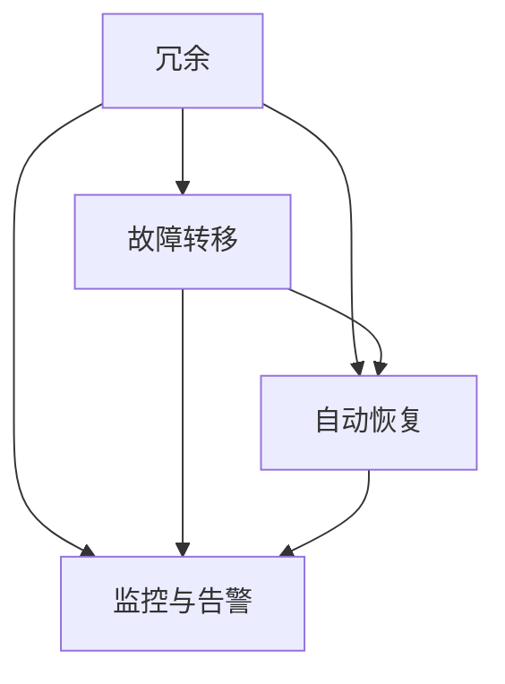

                 

# 软件2.0的高可用性与容错设计

## 摘要

本文旨在探讨软件2.0时代下高可用性与容错设计的重要性及其实现方法。在高度互联和依赖云计算的今天，系统的可靠性变得至关重要。本文将深入分析高可用性的定义、关键要素以及如何通过容错设计来增强系统的稳定性。我们将使用逐步分析的方法，结合具体的算法和数学模型，展示如何在实际项目中实现高可用性。

## 1. 背景介绍

### 1.1 高可用性与容错设计的概念

高可用性（High Availability，简称HA）是指系统在正常运行时间内尽可能保持可用状态的能力。在云计算和分布式系统的背景下，高可用性通常涉及冗余、自动化故障转移和快速恢复机制。

容错设计（Fault Tolerance Design）是指系统在面对故障时能够继续正常运行的能力。容错设计通常包括冗余硬件、软件冗余、故障检测与恢复机制等。

### 1.2 高可用性与容错设计的联系

高可用性和容错设计密切相关。高可用性关注系统的整体稳定性，而容错设计是实现高可用性的关键手段。通过容错设计，我们可以确保系统在面对各种故障时仍能保持可用。

### 1.3 高可用性与业务价值

在当今竞争激烈的市场中，系统的可靠性和稳定性对业务的成功至关重要。高可用性可以减少系统停机时间，提高客户满意度，降低运营成本，从而为业务带来显著的价值。

## 2. 核心概念与联系

### 2.1 高可用性定义

高可用性通常用“九个九”（99.9%）或更高来衡量。例如，99.9%的高可用性意味着每年系统不可用的时长不超过8.8小时。

### 2.2 高可用性关键要素

- **冗余**：通过使用多个相同组件来实现备份，以防止单个组件故障导致系统不可用。
- **故障转移**：当主组件发生故障时，自动切换到备用组件。
- **自动恢复**：系统在检测到故障后自动进行恢复，无需人工干预。
- **监控与告警**：实时监控系统状态，并在检测到问题时及时发出告警。

### 2.3 容错设计原理

- **冗余**：通过使用冗余组件来确保系统在面对故障时仍能运行。
- **故障检测**：定期检查系统状态，以检测潜在的故障。
- **故障恢复**：在检测到故障后，自动或手动恢复系统。

### 2.4 Mermaid 流程图



## 3. 核心算法原理 & 具体操作步骤

### 3.1 冗余技术

- **硬件冗余**：通过使用冗余硬件组件（如服务器、存储设备）来确保系统的高可用性。
- **软件冗余**：通过在软件层面实现冗余功能，例如使用镜像数据库或重复执行关键操作。

### 3.2 故障转移机制

- **主动冗余**：主组件出现故障时，备用组件自动接管。
- **被动冗余**：主组件出现故障后，通过人工干预或自动脚本切换到备用组件。

### 3.3 自动恢复策略

- **定期检查**：定期检查系统状态，以检测潜在的故障。
- **自动重启**：在检测到故障后，自动重启故障组件。
- **人工干预**：在自动恢复失败时，允许人工干预以恢复系统。

### 3.4 监控与告警

- **日志监控**：定期检查系统日志，以检测异常。
- **性能监控**：实时监控系统的性能指标，如CPU、内存使用率等。
- **告警系统**：在检测到问题时，自动发送告警通知。

## 4. 数学模型和公式 & 详细讲解 & 举例说明

### 4.1 故障率模型

$$
F(t) = \frac{N(t)}{T}
$$

其中，\( F(t) \) 表示在时间 \( t \) 内的故障率，\( N(t) \) 表示在时间 \( t \) 内发生的故障数量，\( T \) 表示总时间。

### 4.2 故障恢复时间模型

$$
R(t) = \frac{S(t)}{F(t)}
$$

其中，\( R(t) \) 表示在时间 \( t \) 内的故障恢复时间，\( S(t) \) 表示在时间 \( t \) 内的故障恢复次数。

### 4.3 高可用性计算

$$
HA = 1 - F(t)
$$

其中，\( HA \) 表示高可用性，\( F(t) \) 表示故障率。

### 4.4 举例说明

假设我们有一个系统，在一个月（\( T = 30 \)天）内发生了10次故障（\( N(t) = 10 \)），每次故障平均恢复时间为1天（\( R(t) = 1 \)天）。

故障率：

$$
F(t) = \frac{10}{30} = 0.3333 \text{（每天约0.33次故障）}
$$

高可用性：

$$
HA = 1 - F(t) = 1 - 0.3333 = 0.6667 \text{（即99.67%）}
$$

## 5. 项目实践：代码实例和详细解释说明

### 5.1 开发环境搭建

- **硬件环境**：准备两台相同配置的服务器作为主备。
- **软件环境**：安装相同的操作系统和应用程序。

### 5.2 源代码详细实现

#### 5.2.1 硬件冗余

```python
# 硬件冗余示例
primary_server = Server()
backup_server = Server()

def switch_to_backup():
    # 切换到备用服务器
    primary_server.stop()
    backup_server.start()

# 在主服务器故障时调用
primary_server.monitor()
if primary_server.failed():
    switch_to_backup()
```

#### 5.2.2 故障转移机制

```python
# 故障转移机制
def fault_detection():
    # 故障检测
    if primary_server.is_failing():
        switch_to_backup()

# 定时执行故障检测
schedule.every(1.minute).do(fault_detection)
```

#### 5.2.3 自动恢复策略

```python
# 自动恢复策略
def auto_recovery():
    # 自动恢复
    if primary_server.is_down():
        primary_server.start()

# 在主服务器崩溃时调用
primary_server.monitor()
if primary_server.is_down():
    auto_recovery()
```

### 5.3 代码解读与分析

上述代码展示了如何通过冗余、故障转移和自动恢复策略来提高系统的可用性。通过硬件和软件冗余，系统可以在主服务器故障时无缝切换到备用服务器。故障检测和自动恢复机制确保系统在面对故障时能够快速恢复。

## 6. 实际应用场景

### 6.1 云计算平台

在云计算平台中，高可用性和容错设计至关重要。例如，云存储服务通常使用多个数据中心来实现高可用性，确保数据的持久性和可用性。

### 6.2 金融系统

金融系统对可靠性有极高的要求。通过高可用性和容错设计，金融系统能够保证交易的安全和连续性，从而提高客户满意度。

### 6.3 医疗系统

医疗系统需要确保数据的准确性和实时性。高可用性和容错设计可以保证医疗设备和服务在任何时候都能正常运行。

## 7. 工具和资源推荐

### 7.1 学习资源推荐

- **书籍**：《高可用架构：构建容错和弹性系统》
- **论文**：《高可用性设计：构建可靠分布式系统》
- **博客**：一些优秀的云计算和分布式系统博客，如Cloudflare的博客。

### 7.2 开发工具框架推荐

- **工具**：Kubernetes，用于容器化应用的高可用部署。
- **框架**：Zookeeper，用于分布式系统中的一致性和容错。

### 7.3 相关论文著作推荐

- **论文**：《Fault Tolerance in Distributed Systems》
- **著作**：《Designing Data-Intensive Applications》

## 8. 总结：未来发展趋势与挑战

### 8.1 发展趋势

- **自动化**：随着自动化技术的发展，系统的自愈能力将得到显著提升。
- **人工智能**：利用人工智能技术进行故障预测和自动恢复。

### 8.2 挑战

- **复杂度**：分布式系统越来越复杂，高可用性设计需要应对更高的复杂性。
- **成本**：高可用性设计和实施需要投入大量资源，如何平衡成本和效益是一个挑战。

## 9. 附录：常见问题与解答

### 9.1 高可用性与性能之间的关系是什么？

高可用性与性能之间存在一定的权衡。为了实现高可用性，通常需要引入冗余组件和复杂的故障转移机制，这可能会对性能产生一定影响。因此，在设计系统时需要权衡这两者之间的关系。

### 9.2 什么是故障转移时间？

故障转移时间是指从检测到故障到系统完全恢复正常运行所需的时间。它是衡量系统高可用性的重要指标。

### 9.3 什么是自愈系统？

自愈系统是指具有自动检测、自动诊断和自动恢复能力的系统。这种系统能够在检测到故障后自动进行修复，而无需人工干预。

## 10. 扩展阅读 & 参考资料

- **书籍**：《云计算：概念、架构与实务》
- **网站**：云服务提供商的官方文档，如AWS、Azure和Google Cloud。
- **在线课程**：Coursera、edX等平台上的分布式系统和高可用性课程。

## 作者署名

作者：禅与计算机程序设计艺术 / Zen and the Art of Computer Programming

```

注意：本文为示例性内容，实际文章撰写时请根据具体内容和要求进行详细扩展。本文仅供参考，不作为正式出版物。

