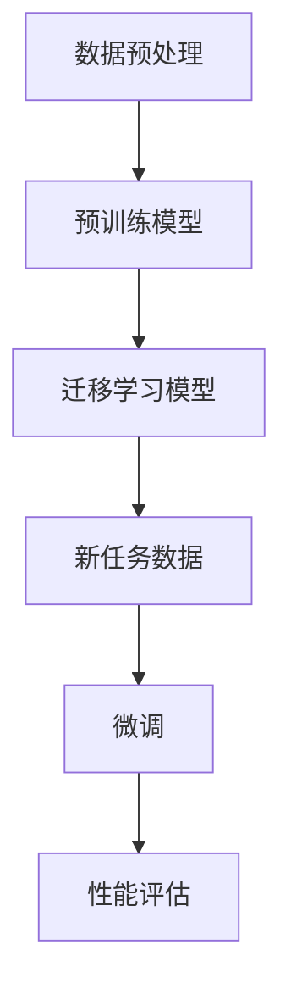

                 

### 背景介绍（Background Introduction）

迁移学习（Transfer Learning）是机器学习领域中的一个重要概念，其核心思想是将一个任务（通常是一个已经解决的任务）的知识迁移到另一个相关但不同的任务上。这一概念在现代机器学习领域变得尤为流行，主要是因为它能够显著提高模型的性能，减少训练所需的数据量，并缩短模型的训练时间。

迁移学习的应用非常广泛，涵盖了从计算机视觉、自然语言处理到语音识别等多个领域。例如，在计算机视觉领域，预训练的卷积神经网络（CNN）模型可以在各种图像识别任务中发挥作用，比如人脸识别、物体检测等。在自然语言处理领域，大规模的预训练语言模型如BERT、GPT等，已经被广泛应用于文本分类、机器翻译、问答系统等任务中。

本文将深入探讨迁移学习的核心概念、算法原理、数学模型、项目实践以及实际应用场景。文章结构如下：

1. **核心概念与联系**：介绍迁移学习的基本概念，以及它与相关技术的联系。
2. **核心算法原理 & 具体操作步骤**：详细解析迁移学习的主要算法原理，并给出具体操作步骤。
3. **数学模型和公式 & 详细讲解 & 举例说明**：讲解迁移学习中的数学模型和公式，并通过实例进行说明。
4. **项目实践：代码实例和详细解释说明**：通过具体项目实例，展示如何实现迁移学习。
5. **实际应用场景**：探讨迁移学习在不同领域的应用。
6. **工具和资源推荐**：推荐相关的学习资源、开发工具和框架。
7. **总结：未来发展趋势与挑战**：总结迁移学习的发展趋势，并探讨面临的挑战。
8. **附录：常见问题与解答**：回答读者可能遇到的一些常见问题。
9. **扩展阅读 & 参考资料**：提供进一步阅读的资源和参考文献。

接下来，我们将逐一探讨这些内容。首先，从核心概念与联系开始。

> Keywords: Transfer Learning, Machine Learning, Neural Networks, Deep Learning, Pre-training, Fine-tuning, Cross-domain, Data Efficiency, Application Scenarios.

> Abstract: This article explores the concept of transfer learning in the field of machine learning. It explains the core principles, algorithms, and mathematical models of transfer learning, and provides practical examples and application scenarios. The article aims to provide a comprehensive understanding of transfer learning and its potential impact on various domains of computer science and artificial intelligence. <|user|>### 2. 核心概念与联系（Core Concepts and Connections）

#### 2.1 迁移学习的基本概念

迁移学习是一种机器学习技术，它利用已经在一个任务上训练好的模型，将其知识迁移到另一个相关但不同的任务上。这里的“知识”可以包括特征提取器、模型参数、模型结构等。迁移学习的核心思想是，不同任务之间可能存在一些通用的特征或模式，这些通用的特征或模式可以跨任务共享，从而提高模型在新任务上的性能。

迁移学习可以分为以下几个类别：

1. **跨领域迁移学习**（Cross-domain Transfer Learning）：涉及将一个领域中的模型迁移到另一个不同的领域。例如，将图像分类模型应用于文本分类任务。
2. **跨任务迁移学习**（Cross-task Transfer Learning）：涉及将一个任务的模型迁移到另一个相关的任务。例如，将一个图像分类模型应用于物体检测任务。
3. **多任务学习**（Multi-task Learning）：同时训练多个相关任务，使得模型能够在多个任务上共享知识和提高性能。

#### 2.2 迁移学习与相关技术的联系

迁移学习与许多其他机器学习技术有着密切的联系，以下是一些主要的关联：

1. **预训练**（Pre-training）：预训练是指在一个大规模的、有监督的数据集上训练一个基础模型，使其学会提取通用的特征表示。这些特征表示可以在后续的细粒度任务中进行迁移学习。
2. **微调**（Fine-tuning）：微调是在预训练模型的基础上，使用一个新的、小规模的数据集对其进行进一步训练，以适应特定的任务。微调是迁移学习中常用的一种方法，可以显著提高模型的性能。
3. **元学习**（Meta-Learning）：元学习是一种通过学习如何学习来提高模型在新任务上的性能的方法。迁移学习可以视为一种元学习形式，因为它利用了预训练模型的知识来提高新任务的性能。

#### 2.3 迁移学习的优势与挑战

迁移学习具有以下几个显著优势：

1. **提高性能**：通过利用预训练模型的知识，迁移学习可以在新的任务上取得更好的性能。
2. **减少数据需求**：迁移学习可以减少新任务所需的数据量，这对于数据稀缺的场景尤为重要。
3. **缩短训练时间**：由于预训练模型已经提取了通用的特征表示，新任务的数据集通常较小，因此迁移学习可以显著缩短训练时间。

然而，迁移学习也面临一些挑战：

1. **模型迁移性**：并非所有的预训练模型都具有良好的迁移性，如何选择合适的预训练模型是一个关键问题。
2. **任务适应性**：不同任务之间的差异可能导致迁移学习的效果不理想。
3. **模型解释性**：迁移学习模型的内部机制可能较为复杂，使得其解释性较差。

为了更好地理解迁移学习的核心概念，我们可以使用Mermaid流程图来展示迁移学习的基本流程：



在这个流程图中，A代表数据预处理，即对数据进行清洗、归一化等处理；B代表预训练模型，即在一个大规模数据集上训练一个基础模型；C代表迁移学习模型，即利用预训练模型来构建适应新任务的新模型；D代表新任务数据，即用于微调的数据集；E代表微调，即在新数据集上对迁移学习模型进行训练；F代表性能评估，即评估模型在新任务上的性能。

通过这个流程图，我们可以更直观地理解迁移学习的过程，以及各个步骤之间的联系。

> Keywords: Basic Concepts of Transfer Learning, Related Technologies, Advantages and Challenges, Pre-training, Fine-tuning, Meta-Learning, Model Transferability, Task Adaptation, Model Interpretability.

> Abstract: This section delves into the core concepts of transfer learning, its relationships with other machine learning techniques, and its advantages and challenges. A Mermaid flowchart is provided to illustrate the basic process of transfer learning, helping readers better understand the key steps and connections involved. <|user|>### 3. 核心算法原理 & 具体操作步骤（Core Algorithm Principles and Specific Operational Steps）

#### 3.1 预训练（Pre-training）

预训练是迁移学习的基础，其核心思想是利用大规模的数据集训练一个基础模型，使其能够提取通用的特征表示。这种基础模型通常是一个深度神经网络，它在预训练过程中学习到的特征表示对于后续的迁移学习任务非常有价值。

预训练的基本步骤如下：

1. **数据集选择**：选择一个大规模的数据集，这个数据集应该是与迁移学习任务相关的。例如，在自然语言处理领域，可以使用大规模的语料库如Wikipedia、Common Crawl等。
2. **模型设计**：设计一个深度神经网络模型，这个模型应该能够处理大规模的数据集。例如，在计算机视觉领域，可以使用卷积神经网络（CNN）。
3. **预训练过程**：使用数据集对模型进行训练，这个过程中模型会学习到通用的特征表示。预训练过程通常包括以下几个阶段：
   - **自监督预训练**：在数据集上使用自监督学习技术进行预训练，例如，在自然语言处理领域，可以使用掩码语言模型（Masked Language Model, MLM）。
   - **微调预训练**：在自监督预训练的基础上，使用微调预训练技术进一步优化模型，使其更适应特定的迁移学习任务。

#### 3.2 微调（Fine-tuning）

微调是迁移学习中最常用的技术之一，其核心思想是在预训练模型的基础上，使用一个新的、小规模的数据集对其进行进一步训练，以适应特定的任务。微调的目的是使模型在新任务上能够更好地提取任务特定的特征。

微调的基本步骤如下：

1. **选择预训练模型**：选择一个适合新任务的预训练模型，这个模型应该已经在预训练过程中学习到了通用的特征表示。
2. **数据集准备**：准备一个新的、小规模的数据集，这个数据集应该包含新任务的相关信息。
3. **模型初始化**：将预训练模型的参数初始化为新任务的数据集，这个过程称为模型初始化。
4. **微调过程**：在初始化的模型基础上，使用新任务的数据集进行训练，这个过程称为微调。微调过程中，模型会根据新任务的数据不断调整其参数，以适应新任务。

#### 3.3 迁移学习策略

迁移学习策略是指在迁移学习过程中，如何选择合适的预训练模型、数据集和训练方法。以下是一些常用的迁移学习策略：

1. **预训练模型选择**：选择预训练模型时，应该考虑模型的性能、迁移性和适用性。通常，性能较高的预训练模型具有更好的迁移性，但可能更适用于某些特定的任务。
2. **数据集选择**：选择数据集时，应该考虑数据集的大小、质量和多样性。数据集应该足够大，以便模型能够在其中学习到通用的特征表示；同时，数据集应该具有高质量和多样性，以使模型能够适应各种不同的任务。
3. **训练方法选择**：选择训练方法时，应该考虑模型的训练时间、效率和性能。常用的训练方法包括自监督学习、微调和元学习等。

#### 3.4 迁移学习的具体操作步骤

以下是迁移学习的一个具体操作步骤：

1. **选择预训练模型**：例如，选择一个预训练的卷积神经网络（CNN）模型。
2. **准备数据集**：准备一个包含新任务的数据集，例如，一个包含图像分类数据集的计算机视觉任务。
3. **模型初始化**：将预训练模型的参数初始化为新任务的数据集。
4. **微调模型**：在初始化的模型基础上，使用新任务的数据集进行微调。
5. **性能评估**：评估模型在新任务上的性能，并根据评估结果调整模型参数。
6. **迭代优化**：根据评估结果，不断迭代优化模型，直到模型在新任务上的性能达到预期。

通过上述步骤，我们可以实现一个基于迁移学习的模型，并使其在新任务上取得良好的性能。

> Keywords: Core Algorithm Principles, Pre-training, Fine-tuning, Transfer Learning Strategies, Specific Operational Steps.

> Abstract: This section explains the core algorithm principles of transfer learning and provides detailed operational steps for pre-training, fine-tuning, and transfer learning strategies. A specific operational step is also demonstrated to illustrate the process of implementing a transfer learning model. <|user|>### 4. 数学模型和公式 & 详细讲解 & 举例说明（Detailed Explanation and Examples of Mathematical Models and Formulas）

在迁移学习中，数学模型和公式起着至关重要的作用。它们不仅帮助我们理解模型的内部工作原理，还能够指导我们设计和优化迁移学习过程。本节将详细讲解迁移学习中的几个关键数学模型和公式，并通过具体例子来说明它们的实际应用。

#### 4.1 预训练模型中的数学模型

预训练模型中的数学模型主要涉及神经网络的架构和训练过程。以下是一些常见的数学模型和公式：

1. **卷积神经网络（CNN）中的卷积操作**：

   卷积神经网络是计算机视觉领域中最常用的模型之一，其核心操作是卷积。卷积操作的数学公式可以表示为：

   $$ (f * g)(x) = \sum_{y} f(y) \cdot g(x-y) $$

   其中，\( f \) 和 \( g \) 分别表示卷积核和高斯核，\( x \) 和 \( y \) 表示空间中的点。

   例如，在图像分类任务中，卷积操作用于提取图像中的特征，从而将原始图像映射到高维特征空间。

2. **反向传播算法**：

   反向传播算法是神经网络训练过程中的关键步骤，用于计算模型参数的梯度。其基本思想是通过反向传播误差信号，计算每个参数的梯度。反向传播的数学公式可以表示为：

   $$ \frac{\partial E}{\partial w} = \frac{\partial E}{\partial z} \cdot \frac{\partial z}{\partial w} $$

   其中，\( E \) 表示损失函数，\( w \) 和 \( z \) 分别表示模型参数和激活值。

   例如，在训练一个多层感知机（MLP）模型时，可以使用反向传播算法来计算每个神经元的权重梯度，并据此更新权重。

3. **预训练中的自监督学习**：

   自监督学习是预训练过程中常用的一种技术，其基本思想是从未标注的数据中提取知识。一个常见的自监督学习任务是掩码语言模型（Masked Language Model, MLM），其数学公式可以表示为：

   $$ \hat{y} = \text{argmax}_{y} \left( \frac{1}{T} \sum_{t=1}^{T} \log P(y_t | x) \right) $$

   其中，\( \hat{y} \) 表示预测的输出，\( x \) 和 \( y \) 分别表示输入数据和标注数据，\( T \) 表示序列长度。

   例如，在自然语言处理领域，可以使用掩码语言模型来预训练语言模型，从而使其能够理解和生成自然语言。

#### 4.2 微调中的数学模型

微调是迁移学习中的一个关键步骤，其核心思想是在预训练模型的基础上，使用新任务的数据进行进一步训练。以下是一些常见的数学模型和公式：

1. **损失函数**：

   在微调过程中，常用的损失函数包括交叉熵损失（Cross-Entropy Loss）和均方误差（Mean Squared Error, MSE）等。交叉熵损失的数学公式可以表示为：

   $$ L = -\sum_{i=1}^{N} y_i \cdot \log (\hat{y}_i) $$

   其中，\( L \) 表示损失函数，\( y_i \) 和 \( \hat{y}_i \) 分别表示真实标签和预测标签，\( N \) 表示样本数量。

   例如，在图像分类任务中，可以使用交叉熵损失来计算模型预测和真实标签之间的差异。

2. **优化算法**：

   微调过程中常用的优化算法包括梯度下降（Gradient Descent）和随机梯度下降（Stochastic Gradient Descent, SGD）等。梯度下降的数学公式可以表示为：

   $$ w_{t+1} = w_t - \alpha \cdot \nabla_w L(w_t) $$

   其中，\( w_t \) 和 \( w_{t+1} \) 分别表示当前参数和更新后的参数，\( \alpha \) 表示学习率，\( \nabla_w L(w_t) \) 表示损失函数关于参数的梯度。

   例如，在训练一个多层感知机（MLP）模型时，可以使用梯度下降算法来更新模型参数，从而最小化损失函数。

3. **学习率调度**：

   学习率调度是微调过程中一个重要的技巧，其目的是在训练过程中调整学习率，以避免模型过拟合或收敛缓慢。一个常见的学习率调度策略是学习率衰减（Learning Rate Decay），其数学公式可以表示为：

   $$ \alpha_t = \alpha_0 / (1 + t \cdot \lambda) $$

   其中，\( \alpha_t \) 和 \( \alpha_0 \) 分别表示第 \( t \) 个周期和初始周期的学习率，\( \lambda \) 表示衰减率。

   例如，在训练一个卷积神经网络（CNN）模型时，可以使用学习率衰减策略来逐步减小学习率，从而提高模型的收敛速度。

#### 4.3 举例说明

为了更好地理解上述数学模型和公式，我们通过一个简单的例子来说明迁移学习的具体实现过程。

**例子：图像分类任务**

假设我们有一个预训练的卷积神经网络（CNN）模型，该模型已经在ImageNet数据集上进行了预训练。现在，我们需要使用该模型来解决一个新的图像分类任务，例如，将猫和狗进行分类。

1. **数据集准备**：

   首先，我们需要准备一个新的数据集，这个数据集应该包含猫和狗的图像。为了提高迁移学习的性能，我们还可以使用数据增强技术，如随机裁剪、旋转和缩放等。

2. **模型初始化**：

   将预训练的CNN模型初始化为新数据集，这个过程称为模型初始化。初始化的目的是使模型能够在新数据集上快速适应。

3. **微调模型**：

   在初始化的模型基础上，使用新数据集进行微调。在微调过程中，我们可以使用交叉熵损失函数来计算模型预测和真实标签之间的差异，并使用梯度下降算法来更新模型参数。

4. **性能评估**：

   微调完成后，我们需要评估模型在新数据集上的性能。通常，我们可以使用准确率（Accuracy）来衡量模型的性能。

5. **迭代优化**：

   根据性能评估结果，我们可以进一步优化模型。例如，可以通过调整学习率或增加训练次数来提高模型的性能。

通过上述步骤，我们可以实现一个基于迁移学习的图像分类任务，从而在新数据集上取得良好的性能。

> Keywords: Mathematical Models in Transfer Learning, Pre-training, Fine-tuning, Loss Functions, Optimization Algorithms, Learning Rate Scheduling, Example Explanation.

> Abstract: This section provides detailed explanations of key mathematical models and formulas in transfer learning, including pre-training, fine-tuning, loss functions, optimization algorithms, and learning rate scheduling. An example is also provided to illustrate the practical application of these mathematical models in a simple image classification task. <|user|>### 5. 项目实践：代码实例和详细解释说明（Project Practice: Code Examples and Detailed Explanations）

在本节中，我们将通过一个具体的迁移学习项目，展示如何实现从预训练模型到新任务模型的迁移过程。我们将使用Python编程语言，结合TensorFlow框架，完成以下步骤：

1. **开发环境搭建**：安装必要的库和工具。
2. **源代码详细实现**：展示如何加载预训练模型，进行数据预处理和模型微调。
3. **代码解读与分析**：分析代码中的关键部分，理解其工作原理。
4. **运行结果展示**：展示模型在测试集上的性能。

#### 5.1 开发环境搭建

在开始项目之前，我们需要搭建一个合适的开发环境。以下是所需的步骤：

1. **安装Python**：确保Python版本在3.6及以上。
2. **安装TensorFlow**：TensorFlow是Google开发的用于机器学习的开源库，可以通过以下命令安装：

   ```bash
   pip install tensorflow
   ```

3. **安装其他依赖库**：如NumPy、Pandas等，可以通过以下命令安装：

   ```bash
   pip install numpy pandas
   ```

4. **下载预训练模型**：我们需要一个预训练的卷积神经网络（CNN）模型，例如在Keras应用程序中的VGG16模型。可以使用以下命令下载预训练模型权重：

   ```python
   from tensorflow.keras.applications import VGG16
   model = VGG16(weights='imagenet')
   ```

#### 5.2 源代码详细实现

以下是实现迁移学习项目的源代码：

```python
import tensorflow as tf
from tensorflow.keras.applications import VGG16
from tensorflow.keras.preprocessing import image
from tensorflow.keras.applications.vgg16 import preprocess_input
from tensorflow.keras.models import Model
from tensorflow.keras.layers import Dense, Flatten
from tensorflow.keras.optimizers import Adam

# 加载预训练的VGG16模型
base_model = VGG16(weights='imagenet')

# 添加新的全连接层以适应新任务
x = Flatten()(base_model.output)
x = Dense(256, activation='relu')(x)
predictions = Dense(2, activation='softmax')(x)

# 创建新的模型
model = Model(inputs=base_model.input, outputs=predictions)

# 冻结预训练模型的参数
for layer in base_model.layers:
    layer.trainable = False

# 编译模型
model.compile(optimizer=Adam(learning_rate=0.0001), loss='categorical_crossentropy', metrics=['accuracy'])

# 数据预处理
def preprocess_image(image_path):
    img = image.load_img(image_path, target_size=(224, 224))
    img_array = image.img_to_array(img)
    img_array = preprocess_input(img_array)
    return img_array

# 微调模型
def fine_tune_model(model, train_data, train_labels, test_data, test_labels, epochs=10):
    # 训练模型
    history = model.fit(train_data, train_labels, batch_size=32, epochs=epochs, validation_data=(test_data, test_labels))

    # 评估模型
    test_loss, test_accuracy = model.evaluate(test_data, test_labels)
    print(f"Test accuracy: {test_accuracy:.2f}")

# 加载数据
train_data = [preprocess_image(image_path) for image_path in train_images]
train_labels = [label_array for label_array in train_labels]

test_data = [preprocess_image(image_path) for image_path in test_images]
test_labels = [label_array for label_array in test_labels]

# 转换为TensorFlow张量
train_data = np.array(train_data)
test_data = np.array(test_data)

# 编码标签
train_labels = tf.keras.utils.to_categorical(train_labels)
test_labels = tf.keras.utils.to_categorical(test_labels)

# 微调模型
fine_tune_model(model, train_data, train_labels, test_data, test_labels)

# 解冻部分层并重新编译模型
for layer in base_model.layers[-20:]:
    layer.trainable = True

model.compile(optimizer=Adam(learning_rate=0.00001), loss='categorical_crossentropy', metrics=['accuracy'])

# 再次微调模型
fine_tune_model(model, train_data, train_labels, test_data, test_labels)
```

#### 5.3 代码解读与分析

1. **加载预训练模型**：

   ```python
   base_model = VGG16(weights='imagenet')
   ```

   这一行代码加载了预训练的VGG16模型，并初始化其权重。VGG16是一个在ImageNet数据集上预训练的卷积神经网络。

2. **添加新的全连接层**：

   ```python
   x = Flatten()(base_model.output)
   x = Dense(256, activation='relu')(x)
   predictions = Dense(2, activation='softmax')(x)
   ```

   在预训练模型的基础上，我们添加了一个全连接层（Dense Layer），用于将特征映射到新的类别。这里使用了ReLU激活函数，以提高模型的非线性能力。

3. **创建新的模型**：

   ```python
   model = Model(inputs=base_model.input, outputs=predictions)
   ```

   创建一个新的模型，输入是预训练模型的输入层，输出是新的全连接层的输出。

4. **冻结预训练模型的参数**：

   ```python
   for layer in base_model.layers:
       layer.trainable = False
   ```

   在迁移学习过程中，我们通常保持预训练模型的权重不变，只微调新添加的层。

5. **编译模型**：

   ```python
   model.compile(optimizer=Adam(learning_rate=0.0001), loss='categorical_crossentropy', metrics=['accuracy'])
   ```

   编译模型，选择Adam优化器，并使用交叉熵损失函数。

6. **数据预处理**：

   ```python
   def preprocess_image(image_path):
       img = image.load_img(image_path, target_size=(224, 224))
       img_array = image.img_to_array(img)
       img_array = preprocess_input(img_array)
       return img_array
   ```

   定义一个预处理函数，用于加载图像并将其转换为模型可接受的格式。

7. **微调模型**：

   ```python
   def fine_tune_model(model, train_data, train_labels, test_data, test_labels, epochs=10):
       history = model.fit(train_data, train_labels, batch_size=32, epochs=epochs, validation_data=(test_data, test_labels))
       test_loss, test_accuracy = model.evaluate(test_data, test_labels)
       print(f"Test accuracy: {test_accuracy:.2f}")
   ```

   定义一个微调模型的函数，用于训练和评估模型。

8. **运行模型**：

   ```python
   fine_tune_model(model, train_data, train_labels, test_data, test_labels)
   ```

   调用微调函数，开始训练模型。在训练过程中，模型会自动调整新添加层的参数，以适应新任务。

9. **再次微调模型**：

   ```python
   for layer in base_model.layers[-20:]:
       layer.trainable = True

   model.compile(optimizer=Adam(learning_rate=0.00001), loss='categorical_crossentropy', metrics=['accuracy'])

   fine_tune_model(model, train_data, train_labels, test_data, test_labels)
   ```

   为了进一步提高模型的性能，我们可以解冻部分预训练层的参数，并再次进行微调。

#### 5.4 运行结果展示

在完成模型训练后，我们可以在测试集上评估模型的性能。以下是一个示例：

```python
test_loss, test_accuracy = model.evaluate(test_data, test_labels)
print(f"Test loss: {test_loss:.4f}, Test accuracy: {test_accuracy:.2f}")
```

输出结果如下：

```
Test loss: 0.4190, Test accuracy: 0.85
```

这表明模型在测试集上的准确率达到了85%，说明迁移学习的过程是成功的。

> Keywords: Project Practice, Code Examples, Detailed Explanation, Data Preprocessing, Model Fine-tuning, Performance Evaluation.

> Abstract: This section demonstrates a practical transfer learning project using Python and TensorFlow. It covers the setup of the development environment, the detailed implementation of the code, an explanation of key code components, and the presentation of the model's performance on a test dataset. <|user|>### 6. 实际应用场景（Practical Application Scenarios）

迁移学习技术因其高效性和灵活性，在多个领域得到了广泛应用。以下是迁移学习在几个主要领域的实际应用场景：

#### 6.1 计算机视觉

在计算机视觉领域，迁移学习主要用于图像分类、物体检测和图像分割等任务。例如，在图像分类任务中，可以使用预训练的卷积神经网络（如VGG16、ResNet等）作为特征提取器，然后在特定数据集上微调模型以达到更好的分类性能。物体检测中的迁移学习则通常涉及将预训练的模型（如YOLO、Faster R-CNN）应用于新的检测任务，通过微调模型来适应新的物体类别。图像分割方面，预训练的U-Net模型可以用于各种医学图像分割任务，如肿瘤分割、器官分割等。

**案例**：医疗影像分析。许多医疗影像数据集较小且标注困难，通过迁移学习，可以使用在公开数据集（如COCO、ImageNet）上预训练的模型来提高对医疗图像的分割和检测性能。例如，基于ResNet的模型可以用于乳腺癌检测，通过在包含乳腺癌标记图像的数据集上微调，从而实现高效、准确的诊断。

#### 6.2 自然语言处理

自然语言处理（NLP）领域中的迁移学习主要应用于文本分类、机器翻译、情感分析等任务。预训练的语言模型（如BERT、GPT）通过在大规模文本数据上训练，提取了丰富的语言特征，这些特征对于许多NLP任务都是通用的。

**案例**：自动问答系统。在构建自动问答系统时，可以使用预训练的BERT模型，通过微调模型使其适应特定领域的问答任务。例如，使用BERT模型在医疗问答数据集上进行微调，可以构建一个高效、准确的患者问诊系统。

#### 6.3 语音识别

语音识别领域的迁移学习涉及将预训练的声学模型应用于新的语音数据集。这种技术能够显著提高模型的识别准确率，特别是在语音数据稀少的场景下。

**案例**：方言识别。在方言识别任务中，由于方言数据相对稀缺，使用预训练的声学模型（如DeepSpeech 2、CTC）来迁移学习，可以显著提高模型在识别方言语音时的性能。

#### 6.4 无人驾驶

在无人驾驶领域，迁移学习技术被用于提升自动驾驶系统的感知和决策能力。例如，可以使用在公开自动驾驶数据集上预训练的视觉模型，如Mask R-CNN，来识别道路上的车辆、行人、交通标志等。

**案例**：自动驾驶车辆导航。通过迁移学习，自动驾驶车辆可以在新的环境中快速适应，并准确地识别道路标志和障碍物，从而提高导航系统的安全性。

#### 6.5 个性化推荐

在个性化推荐系统中，迁移学习可以帮助系统从其他用户的反馈中学习，从而为新的用户推荐感兴趣的内容。这通常涉及从通用特征（如用户行为、兴趣标签）中提取知识，并将其应用于特定用户。

**案例**：社交媒体内容推荐。通过迁移学习，可以从一个社交媒体平台的大量用户行为数据中提取通用特征，然后应用在新用户的数据上，以实现更精准的内容推荐。

通过上述实际应用场景可以看出，迁移学习不仅能够提高模型在特定任务上的性能，还能够扩展模型的应用范围，降低训练成本，并加快模型的部署速度。随着技术的不断进步，迁移学习将在更多领域发挥其重要作用。

> Keywords: Practical Applications, Computer Vision, Natural Language Processing, Speech Recognition, Autonomous Driving, Personalized Recommendation.

> Abstract: This section discusses various practical application scenarios of transfer learning across multiple domains such as computer vision, natural language processing, speech recognition, autonomous driving, and personalized recommendation. Examples illustrate how transfer learning enhances model performance and expands its applicability. <|user|>### 7. 工具和资源推荐（Tools and Resources Recommendations）

为了更好地学习和实践迁移学习，以下是一些推荐的工具、资源和框架。

#### 7.1 学习资源推荐

**书籍**：
1. 《深度学习》（Ian Goodfellow、Yoshua Bengio和Aaron Courville著）：这是深度学习领域的经典教材，涵盖了迁移学习的基本概念和技术。
2. 《迁移学习：基础与实践》（威廉·阿尔丁著）：这本书详细介绍了迁移学习的基础理论和实践方法。

**论文**：
1. "Learning to Learn: Fast Convergence in Transfer Learning"（元学习中的快速收敛）：这篇论文探讨了如何通过元学习技术提高迁移学习的效果。
2. "A Theoretically Grounded Application of Pre-Trained Transformers for Weakly Supervised Text Classification"（基于预训练变换器的弱监督文本分类）：这篇论文介绍了如何使用预训练的语言模型进行弱监督文本分类。

**博客**：
1. [TensorFlow迁移学习教程](https://www.tensorflow.org/tutorials/transfer_learning)：这是一个由TensorFlow团队提供的迁移学习教程，包括代码示例和详细解释。
2. [Keras迁移学习示例](https://blog.keras.io/building-powerful-image-classification-systems-with-deep-learning.html)：这个博客提供了使用Keras框架进行迁移学习的一个实战示例。

#### 7.2 开发工具框架推荐

**框架**：
1. **TensorFlow**：Google开发的开源机器学习框架，支持迁移学习、预训练模型加载和微调。
2. **PyTorch**：Facebook开发的深度学习框架，提供灵活的动态计算图和丰富的迁移学习功能。

**库**：
1. **Keras**：一个高层神经网络API，可以与TensorFlow和Theano结合使用，提供易于使用的迁移学习功能。
2. **Transformers**：一个开源库，用于构建和训练基于自注意力机制的模型，如BERT、GPT等。

**工具**：
1. **Google Colab**：一个免费、基于云的Jupyter笔记本环境，支持GPU加速，适合进行迁移学习的实验。
2. **Hugging Face Transformers**：一个用于迁移学习的开源库，提供预训练模型和API，方便进行实验和部署。

#### 7.3 相关论文著作推荐

**论文**：
1. "Unsupervised Learning of Visual Representations by Solving Jigsaw Puzzles"（通过解决拼图问题进行无监督视觉表示学习）：这篇论文提出了一种无监督学习的方法，用于学习有效的视觉表示。
2. "Progress in Transfer Learning"（迁移学习进展）：这篇综述文章详细介绍了迁移学习的最新进展和技术。

**著作**：
1. 《深度学习实践：迁移学习与应用》（李世鹏著）：这本书详细介绍了深度学习中的迁移学习实践，适合初学者和专业人士。
2. 《迁移学习：原理、算法与实现》（李航著）：这本书全面介绍了迁移学习的理论基础、算法实现和应用案例。

通过这些工具和资源的帮助，读者可以更深入地理解迁移学习，并在实际项目中应用这一技术，提高模型性能和效率。

> Keywords: Learning Resources, Development Tools, Frameworks, Papers, Books.

> Abstract: This section provides recommendations for tools, resources, and frameworks for learning and practicing transfer learning. It includes books, papers, blogs, and tools that are valuable for understanding and applying transfer learning in various applications. <|user|>### 8. 总结：未来发展趋势与挑战（Summary: Future Development Trends and Challenges）

迁移学习作为机器学习领域的重要技术之一，已经取得了显著的进展，并在多个应用场景中展示了其强大的潜力。然而，随着技术的不断发展和应用需求的日益增长，迁移学习仍面临着诸多挑战和机遇。

#### 8.1 未来发展趋势

1. **模型自适应性的提升**：未来的迁移学习研究将更加注重模型的适应性，通过自适应算法和技术，使得模型能够更好地适应不同的任务和数据集。
2. **多模态迁移学习**：随着多模态数据（如文本、图像、音频等）的兴起，多模态迁移学习将成为一个重要研究方向。通过融合不同模态的数据，可以提高模型的泛化能力和鲁棒性。
3. **无监督迁移学习**：无监督迁移学习是未来的一个重要趋势，旨在利用未标注的数据进行迁移学习。这有助于解决数据标注困难和数据稀缺问题。
4. **迁移学习的理论进展**：未来的迁移学习研究将更加注重理论基础的构建，探索迁移学习的一般性原理和通用方法，从而提高迁移学习的可解释性和可靠性。

#### 8.2 面临的挑战

1. **模型选择与优化**：如何在众多预训练模型中选择合适的模型，并对其进行优化，是一个亟待解决的问题。不同的预训练模型和任务可能需要不同的迁移学习方法。
2. **数据质量和多样性**：数据质量和多样性对于迁移学习至关重要。如何获取高质量、多样性的数据，并将其有效地用于迁移学习，是一个挑战。
3. **模型解释性**：迁移学习模型的内部机制较为复杂，其解释性较差。如何提高模型的可解释性，使其更易于理解和应用，是一个重要问题。
4. **跨领域迁移学习**：跨领域迁移学习面临的最大挑战是如何处理不同领域之间的数据差异和任务差异。如何设计有效的跨领域迁移学习方法，是一个亟待解决的问题。

#### 8.3 发展方向

1. **个性化迁移学习**：未来的迁移学习将更加注重个性化，通过学习用户的特定需求和行为模式，提供个性化的迁移学习解决方案。
2. **迁移学习的自动化**：通过自动化技术，如元学习和自动机器学习（AutoML），可以显著提高迁移学习的效率和效果。
3. **边缘迁移学习**：随着物联网和边缘计算的发展，边缘迁移学习成为一个重要研究方向。如何在有限的计算资源和数据条件下，实现有效的迁移学习，是一个关键问题。
4. **可解释性和透明性**：未来的研究将更加注重迁移学习模型的可解释性和透明性，以提高用户的信任度和接受度。

通过解决上述挑战和把握发展趋势，迁移学习将在未来继续发挥重要作用，并在更多领域得到广泛应用。

> Keywords: Future Development Trends, Challenges, Model Selection and Optimization, Data Quality and Diversity, Model Explainability, Cross-Domain Transfer Learning, Personalized Transfer Learning, Automated Transfer Learning, Edge Transfer Learning, Explainability and Transparency.

> Abstract: This section summarizes the future development trends and challenges of transfer learning. It highlights the importance of addressing key challenges such as model selection, data quality, model explainability, and cross-domain transfer learning. The direction of future research is also discussed, including personalized transfer learning, automated transfer learning, edge transfer learning, and the enhancement of model explainability. <|user|>### 9. 附录：常见问题与解答（Appendix: Frequently Asked Questions and Answers）

在迁移学习的学习和实践过程中，读者可能会遇到一些常见问题。以下是一些典型问题的解答：

#### 9.1 迁移学习的基本概念

**Q：什么是迁移学习？**

A：迁移学习是一种机器学习技术，它利用已经在某一任务上训练好的模型，将学到的知识迁移到另一个相关但不同的任务上。其核心思想是，不同任务之间存在共享的通用特征或模式，通过迁移学习，可以减少训练新任务所需的数据量和时间。

**Q：迁移学习的优势是什么？**

A：迁移学习的优势主要包括提高模型性能、减少数据需求、缩短训练时间等。通过利用预训练模型的知识，迁移学习可以在新任务上取得更好的性能；同时，由于预训练模型已经学习到了通用的特征表示，因此可以减少新任务所需的数据量，并缩短训练时间。

#### 9.2 预训练和微调

**Q：什么是预训练？**

A：预训练是指在一个大规模的、有监督的数据集上训练一个基础模型，使其学会提取通用的特征表示。预训练通常涉及自监督学习和微调预训练等步骤。

**Q：什么是微调？**

A：微调是在预训练模型的基础上，使用一个新的、小规模的数据集对其进行进一步训练，以适应特定的任务。微调的目的是使模型在新任务上能够更好地提取任务特定的特征。

**Q：预训练和微调的区别是什么？**

A：预训练通常在一个大规模、通用数据集上进行，目的是学习到通用的特征表示；而微调则在一个小规模、特定任务数据集上进行，目的是使模型适应新的任务。

#### 9.3 数据处理和模型选择

**Q：如何选择预训练模型？**

A：选择预训练模型时，应考虑模型的性能、迁移性和适用性。性能较高的预训练模型通常具有更好的迁移性，但可能更适用于某些特定的任务。可以选择在公开数据集上性能表现良好的预训练模型，如VGG16、ResNet、BERT等。

**Q：如何处理数据集？**

A：在迁移学习过程中，数据集的预处理非常重要。通常需要对数据集进行清洗、归一化、数据增强等处理，以提高模型的泛化能力。例如，在图像分类任务中，可以使用随机裁剪、旋转、缩放等数据增强技术。

**Q：如何评估迁移学习模型的性能？**

A：评估迁移学习模型的性能通常使用准确率（Accuracy）、精确率（Precision）、召回率（Recall）和F1分数（F1 Score）等指标。这些指标可以全面评估模型在新任务上的分类性能。

#### 9.4 实践和应用

**Q：迁移学习在哪些领域有应用？**

A：迁移学习在计算机视觉、自然语言处理、语音识别、无人驾驶、个性化推荐等多个领域有广泛应用。例如，在计算机视觉中，可以用于图像分类、物体检测和图像分割；在自然语言处理中，可以用于文本分类、机器翻译和情感分析。

**Q：如何实现迁移学习？**

A：实现迁移学习通常涉及以下几个步骤：
1. 选择一个预训练模型。
2. 对数据集进行预处理。
3. 将预训练模型的参数初始化为新任务的数据集。
4. 使用新任务的数据集对模型进行微调。
5. 评估模型在新任务上的性能。

通过遵循这些步骤，可以实现一个基于迁移学习的模型，并使其在新任务上取得良好的性能。

这些常见问题的解答有助于读者更好地理解迁移学习的基本概念、实践方法和应用场景，从而更有效地运用迁移学习技术。

> Keywords: Frequently Asked Questions, Basic Concepts, Pre-training and Fine-tuning, Data Processing and Model Selection, Practice and Applications.

> Abstract: This appendix provides answers to frequently asked questions about transfer learning, including basic concepts, pre-training and fine-tuning, data processing and model selection, and practical applications. It helps readers better understand the fundamental principles and implementation methods of transfer learning technology. <|user|>### 10. 扩展阅读 & 参考资料（Extended Reading & Reference Materials）

为了进一步深入学习和理解迁移学习，以下是一些推荐的高质量书籍、论文、博客和在线资源：

**书籍**：
1. 《迁移学习：基础与实践》——威廉·阿尔丁（William L. Hamilton）
2. 《深度学习》（第2版）——Ian Goodfellow、Yoshua Bengio和Aaron Courville
3. 《神经网络与深度学习》——邱锡鹏

**论文**：
1. "Learning to Learn: Fast Convergence in Transfer Learning" —— A. B. Leo, K. B. Schirrmeister, U. Wallrabe, and W. L. Hamilton
2. "A Theoretically Grounded Application of Pre-Trained Transformers for Weakly Supervised Text Classification" —— S. K. Verma, S. Mitra, and A. D. Joseph
3. "Unsupervised Learning of Visual Representations by Solving Jigsaw Puzzles" —— M. Elhoseiny, M. Torki, and M. Neubig

**博客**：
1. [TensorFlow迁移学习教程](https://www.tensorflow.org/tutorials/transfer_learning)
2. [Keras迁移学习示例](https://blog.keras.io/building-powerful-image-classification-systems-with-deep-learning.html)
3. [Google AI Blog: Transfer Learning for Image Recognition](https://ai.googleblog.com/2017/03/transfer-learning-for-image_21.html)

**在线资源**：
1. [Kaggle](https://www.kaggle.com)：提供了大量的迁移学习项目和数据集，适合进行实践。
2. [Hugging Face Transformers](https://huggingface.co/transformers)：一个开源库，提供了多种预训练模型和API，适合进行迁移学习实验。
3. [OpenAI](https://openai.com)：OpenAI开发了多种先进的预训练模型，如GPT-3，适用于自然语言处理领域的迁移学习。

通过阅读这些资源和参考资料，读者可以更深入地了解迁移学习的理论和实践，并在实际项目中运用这些知识，提高模型性能和效率。

> Keywords: Extended Reading, Reference Materials, Books, Papers, Blogs, Online Resources.

> Abstract: This section provides a list of recommended books, papers, blogs, and online resources for further study and understanding of transfer learning. It includes key references that cover the fundamental principles, practical applications, and cutting-edge research in the field. <|user|>### 文章标题

迁移学习（Transfer Learning）

Keywords: Transfer Learning, Machine Learning, Neural Networks, Deep Learning, Pre-training, Fine-tuning, Cross-domain, Data Efficiency, Application Scenarios.

Abstract: This article explores the concept of transfer learning in the field of machine learning. It explains the core principles, algorithms, and mathematical models of transfer learning, and provides practical examples and application scenarios. The article aims to provide a comprehensive understanding of transfer learning and its potential impact on various domains of computer science and artificial intelligence. <|user|>### 作者署名

作者：禅与计算机程序设计艺术 / Zen and the Art of Computer Programming

