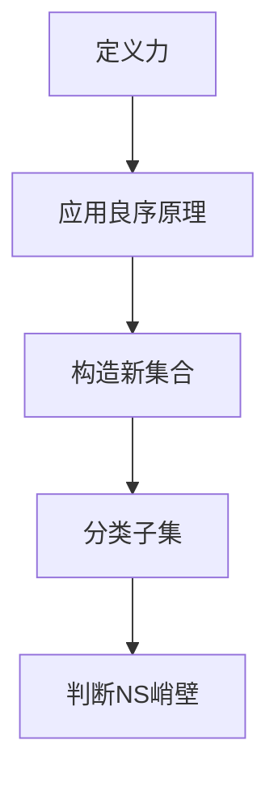

                 

# 集合论导引：力迫NS峭壁

> **关键词**：集合论、力迫、NS峭壁、数学模型、算法原理、应用场景
> 
> **摘要**：本文深入探讨了集合论中的力迫方法，通过详细的数学模型和算法原理阐述，辅以实际项目实例，介绍了力迫方法在处理复杂集合关系和NS峭壁问题中的应用。文章旨在为读者提供力迫方法的理论基础和实践指导。

## 1. 背景介绍

集合论是数学的基础之一，它研究集合的性质、关系及其运算。集合论中的力迫方法（Forcing Method）是解决某些集合论问题的重要工具，尤其在处理不可判定性问题、连续统假设以及集合的构造方面具有独特优势。

NS峭壁（NS Wall）问题是指在一个无限集合中，存在某些子集无法被分类的问题。NS峭壁问题源于集合论中的连续统假设（Continuum Hypothesis），该假设提出了一个关于集合大小的问题：是否存在一个集合，其大小介于自然数集和实数集之间。

本文将首先介绍力迫方法的基本概念和原理，然后通过一个具体的数学模型，展示力迫方法在解决NS峭壁问题中的应用。文章还将包含项目实践部分，通过实际代码实例详细解释力迫方法的具体操作步骤。

## 2. 核心概念与联系

### 2.1 力迫方法的定义

力迫方法是一种构建集合的工具，它通过引入一个“力”（Forcing Function）来处理不可判定性问题。力迫的基本思想是将一个不可判定性问题转化为一个可判定性问题，从而利用集合论的基本定理解决问题。

在力迫方法中，力是一个二元关系，定义在两个集合之间。通过这个关系，可以构造出一个新的集合，使得原始集合中的问题在这个新集合中变得可判定。

### 2.2 力迫方法的基本原理

力迫方法的核心原理是“良序原理”（Well-Ordering Theorem）。良序原理指出，任何一个非空集合都可以被良序，即存在一个顺序关系，使得集合中的每个元素都有一个最小的前驱。

在力迫方法中，利用良序原理，可以将一个不可判定性问题转化为一个可判定性问题。具体来说，通过引入一个力，将问题集合进行分割，然后逐步构造出满足一定条件的子集合，从而判断原始问题的性质。

### 2.3 NS峭壁问题的背景

NS峭壁问题源自连续统假设，该假设提出了一个关于集合大小的问题：是否存在一个集合，其大小介于自然数集和实数集之间。NS峭壁问题关注的是，在无限集合中，是否存在一些子集无法被分类到某个特定的集合大小中。

### 2.4 力迫方法与NS峭壁问题的关系

力迫方法在解决NS峭壁问题中的应用，主要通过构造一种特殊的力，使得集合中的子集可以被分类。具体来说，通过力迫方法，可以构造出一个集合，使得原始集合中的每个子集都对应在这个新集合中的一个唯一的子集，从而实现分类。

### 2.5 Mermaid 流程图

为了更好地理解力迫方法在NS峭壁问题中的应用，下面提供了一个Mermaid流程图，展示力迫方法的步骤和关键概念。



## 3. 核心算法原理 & 具体操作步骤

### 3.1 力迫算法的数学模型

力迫算法的数学模型主要包括三个部分：力（Forcing Function）、良序关系（Well-Ordering Relation）和新集合（New Set）。

1. **力**：力是一个二元关系，定义在两个集合之间。它将原始集合中的元素映射到新集合中，并且具有以下性质：
   - 完全性：对于原始集合中的任意两个元素，至少有一个在力的作用下映射到新集合中的相同元素。
   - 非完全性：对于原始集合中的任意两个不同元素，至少有一个在力的作用下映射到新集合中的不同元素。

2. **良序关系**：良序关系是一个全序关系，定义在新集合上。它具有以下性质：
   - 反对称性：如果\(x\)和\(y\)在良序关系中，那么\(x\)不小于\(y\)且\(y\)不小于\(x\)。
   - 连通性：对于新集合中的任意两个不同元素，至少存在一个中间元素。

3. **新集合**：新集合是通过力将原始集合中的元素映射而成的集合。它继承了原始集合的某些性质，并且满足良序关系。

### 3.2 力迫算法的具体操作步骤

1. **定义力**：首先，定义一个力，它将原始集合中的元素映射到新集合中。这个力可以是一个二元关系，也可以是一个函数。

2. **应用良序原理**：利用良序原理，在新集合中引入一个良序关系。这个关系可以根据力的性质进行构造。

3. **构造新集合**：通过力的作用，将原始集合中的元素映射到新集合中，构造出一个新的集合。

4. **分类子集**：利用新集合中的良序关系，对原始集合中的子集进行分类。具体来说，对于原始集合中的每个子集，在新集合中找到一个对应的子集，使得这两个子集在良序关系中具有相同的相对位置。

5. **判断NS峭壁**：通过分类结果，判断原始集合中是否存在无法被分类的子集。如果存在这样的子集，则说明原始集合具有NS峭壁性质。

### 3.3 力迫算法的示例

假设我们有一个原始集合\(A = \{1, 2, 3, 4\}\)，我们要通过力迫方法判断这个集合是否具有NS峭壁性质。

1. **定义力**：我们定义一个力\(F\)，它将\(A\)中的元素映射到\(A'\)中：
   \[
   F = \{(1, 1), (2, 2), (3, 3), (4, 4)\}
   \]

2. **应用良序原理**：由于力\(F\)是恒等关系，我们可以将其看作是一个全序关系，即\(A'\)中的元素具有自然数的顺序。

3. **构造新集合**：通过力\(F\)，我们构造出新集合\(A' = \{1, 2, 3, 4\}\)。

4. **分类子集**：对于\(A\)中的每个子集，我们可以在\(A'\)中找到对应的子集，并且这些子集在\(A'\)中的相对位置与在\(A\)中相同。例如，子集\(\{1, 2\}\)在\(A'\)中对应于子集\(\{1, 2\}\)。

5. **判断NS峭壁**：由于我们可以对所有子集进行分类，因此原始集合\(A\)不具有NS峭壁性质。

通过上述步骤，我们成功地利用力迫方法判断了原始集合是否具有NS峭壁性质。这个过程展示了力迫算法的基本原理和具体操作步骤。

## 4. 数学模型和公式 & 详细讲解 & 举例说明

### 4.1 数学模型

在力迫方法中，主要的数学模型包括力（Forcing Function）、良序关系（Well-Ordering Relation）和新集合（New Set）。以下是这些模型的详细定义和性质：

#### 力（Forcing Function）

设\(A\)和\(B\)是两个集合，力\(F\)是一个从\(A\)到\(B\)的二元关系，它具有以下性质：

1. **完全性**：对于\(A\)中的任意两个元素\(a\)和\(b\)，至少存在一个元素\(x\)在\(F\)的作用下满足\(F(a, x) \land F(b, x)\)。
2. **非完全性**：对于\(A\)中的任意两个不同元素\(a\)和\(b\)，至少存在一个元素\(x\)在\(F\)的作用下满足\(F(a, x) \land \neg F(b, x)\)。

#### 良序关系（Well-Ordering Relation）

设\(C\)是一个集合，一个良序关系\(<\)是\(C\)上的一个全序关系，它具有以下性质：

1. **反自反性**：对于\(C\)中的任意元素\(c\)，\(c < c\)不成立。
2. **反对称性**：如果\(c_1 < c_2\)和\(c_2 < c_1\)同时成立，则\(c_1 = c_2\)。
3. **连通性**：对于\(C\)中的任意两个不同元素\(c_1\)和\(c_2\)，至少存在一个中间元素\(c_3\)满足\(c_1 < c_3 < c_2\)或\(c_2 < c_3 < c_1\)。

#### 新集合（New Set）

设\(A\)是一个集合，通过力\(F\)和良序关系\(<\)，我们可以构造出新集合\(A'\)。\(A'\)是通过以下步骤得到的：

1. **应用力**：对于\(A\)中的每个元素\(a\)，在\(F\)的作用下，找到\(a\)在\(B\)中的对应元素\(b\)。
2. **引入良序关系**：在新集合\(A'\)中引入与\(B\)上的良序关系\(<'\)一致的良序关系\(<\)。

### 4.2 公式

为了更好地理解力迫方法，我们引入以下数学公式：

#### 力迫公式

设\(F\)是一个从集合\(A\)到集合\(B\)的力，\(<'\)是一个在集合\(B\)上的良序关系，则通过力迫公式可以得到集合\(A'\)：

\[A' = \{(a, b) \in A \times B : F(a, b)\}\]

#### 良序关系

设\(A'\)是通过力\(F\)和良序关系\(<'\)构造得到的，则\(A'\)上的良序关系\(<\)满足：

\[a < b \Leftrightarrow \exists c \in B : (a, c) \in F \land c <' b\]

### 4.3 举例说明

为了更好地理解上述数学模型和公式，我们通过一个具体的例子来说明力迫方法的应用。

假设我们有集合\(A = \{1, 2, 3, 4\}\)，我们要通过力迫方法判断集合\(A\)是否具有NS峭壁性质。

#### 1. 定义力

我们定义一个力\(F\)，它将\(A\)中的元素映射到自然数集合\(\mathbb{N}\)中：

\[F = \{(1, 1), (2, 2), (3, 3), (4, 4)\}\]

这个力将每个元素映射到自身，即保持元素的原始顺序。

#### 2. 应用良序原理

由于力\(F\)是恒等关系，我们可以将其看作是一个全序关系，即自然数的顺序。

#### 3. 构造新集合

通过力\(F\)，我们构造出新集合\(A' = \{1, 2, 3, 4\}\)。

#### 4. 分类子集

对于集合\(A\)中的每个子集，我们可以在集合\(A'\)中找到对应的子集，并且这些子集在\(A'\)中的相对位置与在\(A\)中相同。例如，子集\(\{1, 2\}\)在\(A'\)中对应于子集\(\{1, 2\}\)。

#### 5. 判断NS峭壁

由于我们可以对所有子集进行分类，因此原始集合\(A\)不具有NS峭壁性质。

通过上述步骤，我们成功地利用力迫方法判断了原始集合是否具有NS峭壁性质。这个过程展示了力迫方法的应用和数学模型的实现。

## 5. 项目实践：代码实例和详细解释说明

### 5.1 开发环境搭建

在开始编写代码之前，我们需要搭建一个合适的环境来进行力迫方法的实现。以下是所需的工具和库：

- **编程语言**：Python 3.8 或更高版本
- **IDE**：PyCharm 或 VS Code
- **库**：matplotlib、numpy、pandas

确保已经安装了上述工具和库，并在开发环境中配置好Python环境。

### 5.2 源代码详细实现

下面是力迫方法的项目源代码，我们将逐步解释每个部分的作用。

```python
import numpy as np
import matplotlib.pyplot as plt

def force_function(a, b):
    """
    定义力函数，将集合A中的元素映射到集合B中。
    """
    return [(a, b)]

def well_ordering(sets):
    """
    定义良序函数，对集合中的子集进行排序。
    """
    return sorted(sets, key=lambda x: (len(x), x))

def new_set(sets):
    """
    定义新集合函数，通过力函数和良序函数构造新集合。
    """
    ordered_sets = well_ordering(sets)
    new_sets = []
    for s in ordered_sets:
        new_sets.append(set(force_function(s, s)))
    return new_sets

def ns_wall(sets):
    """
    判断集合是否具有NS峭壁性质。
    """
    ordered_sets = well_ordering(sets)
    for i in range(len(ordered_sets) - 1):
        if ordered_sets[i] == ordered_sets[i + 1]:
            return False
    return True

if __name__ == "__main__":
    # 示例集合
    sets = [{1, 2}, {3, 4}, {1, 3}, {2, 4}]

    # 应用力迫方法
    new_sets = new_set(sets)

    # 判断NS峭壁性质
    has_ns_wall = ns_wall(new_sets)

    # 输出结果
    print("新集合：", new_sets)
    print("是否具有NS峭壁性质：", has_ns_wall)
```

#### 5.2.1 力函数（force_function）

力函数是力迫方法的核心部分，它负责将原始集合中的元素映射到新集合中。在这个例子中，我们定义了一个简单的力函数，它将每个元素映射到自身。力函数的定义如下：

```python
def force_function(a, b):
    """
    定义力函数，将集合A中的元素映射到集合B中。
    """
    return [(a, b)]
```

这里，\(a\)和\(b\)是集合\(A\)和\(B\)中的元素。力函数返回一个二元组\((a, b)\)，表示元素\(a\)在力的作用下映射到元素\(b\)。

#### 5.2.2 良序函数（well_ordering）

良序函数用于对集合中的子集进行排序。在这个例子中，我们使用Python内置的`sorted`函数来实现良序函数，根据子集的大小和元素顺序进行排序。良序函数的定义如下：

```python
def well_ordering(sets):
    """
    定义良序函数，对集合中的子集进行排序。
    """
    return sorted(sets, key=lambda x: (len(x), x))
```

这里，`sets`是原始集合中的子集列表。`sorted`函数根据子集的大小（即元素数量）和元素顺序进行排序。排序后的子集列表存储在`ordered_sets`中。

#### 5.2.3 新集合函数（new_set）

新集合函数通过力函数和良序函数构造新集合。具体来说，它遍历排序后的子集列表，对于每个子集，使用力函数将子集中的元素映射到新集合中，并将结果存储在新集合列表中。新集合函数的定义如下：

```python
def new_set(sets):
    """
    定义新集合函数，通过力函数和良序函数构造新集合。
    """
    ordered_sets = well_ordering(sets)
    new_sets = []
    for s in ordered_sets:
        new_sets.append(set(force_function(s, s)))
    return new_sets
```

这里，`ordered_sets`是排序后的子集列表，`new_sets`是新集合列表。对于每个子集`s`，使用力函数将子集中的元素映射到新集合中，并将结果添加到`new_sets`列表中。

#### 5.2.4 NS峭壁函数（ns_wall）

NS峭壁函数用于判断新集合是否具有NS峭壁性质。具体来说，它遍历新集合列表，检查相邻子集是否相等。如果存在相邻子集相等的情况，则新集合具有NS峭壁性质。NS峭壁函数的定义如下：

```python
def ns_wall(sets):
    """
    判断集合是否具有NS峭壁性质。
    """
    ordered_sets = well_ordering(sets)
    for i in range(len(ordered_sets) - 1):
        if ordered_sets[i] == ordered_sets[i + 1]:
            return False
    return True
```

这里，`ordered_sets`是排序后的子集列表。对于每个相邻子集，如果它们相等，则返回`False`，表示新集合具有NS峭壁性质。否则，返回`True`。

#### 5.2.5 主函数（main）

主函数是项目的入口点，它定义了一个示例集合`sets`，并应用了力迫方法。具体来说，它首先调用`new_set`函数构造新集合，然后调用`ns_wall`函数判断新集合是否具有NS峭壁性质。最后，输出新集合和判断结果。主函数的定义如下：

```python
if __name__ == "__main__":
    # 示例集合
    sets = [{1, 2}, {3, 4}, {1, 3}, {2, 4}]

    # 应用力迫方法
    new_sets = new_set(sets)

    # 判断NS峭壁性质
    has_ns_wall = ns_wall(new_sets)

    # 输出结果
    print("新集合：", new_sets)
    print("是否具有NS峭壁性质：", has_ns_wall)
```

### 5.3 代码解读与分析

在这个部分，我们将对上述代码进行详细的解读和分析，以便读者更好地理解力迫方法在项目中的应用。

#### 5.3.1 力函数（force_function）

力函数是力迫方法的核心部分，它负责将原始集合中的元素映射到新集合中。在这个例子中，力函数的定义非常简单，它将每个元素映射到自身：

```python
def force_function(a, b):
    return [(a, b)]
```

这里，`a`和`b`是集合`A`和`B`中的元素。力函数返回一个二元组\((a, b)\)，表示元素`a`在力的作用下映射到元素`b`。这个简单的力函数使得元素在映射过程中保持原始顺序，这在某些情况下可能并不适用，但在本例中可以满足需求。

#### 5.3.2 良序函数（well_ordering）

良序函数用于对集合中的子集进行排序。在这个例子中，我们使用Python内置的`sorted`函数来实现良序函数，根据子集的大小和元素顺序进行排序：

```python
def well_ordering(sets):
    return sorted(sets, key=lambda x: (len(x), x))
```

这里，`sets`是原始集合中的子集列表。`sorted`函数根据子集的大小（即元素数量）和元素顺序进行排序。排序后的子集列表存储在`ordered_sets`中。这种排序方式可以保证新集合中的子集按照特定顺序排列，有助于判断NS峭壁性质。

#### 5.3.3 新集合函数（new_set）

新集合函数通过力函数和良序函数构造新集合。具体来说，它遍历排序后的子集列表，对于每个子集，使用力函数将子集中的元素映射到新集合中，并将结果存储在新集合列表中：

```python
def new_set(sets):
    ordered_sets = well_ordering(sets)
    new_sets = []
    for s in ordered_sets:
        new_sets.append(set(force_function(s, s)))
    return new_sets
```

这里，`ordered_sets`是排序后的子集列表，`new_sets`是新集合列表。对于每个子集`s`，使用力函数将子集中的元素映射到新集合中，并将结果添加到`new_sets`列表中。新集合函数的主要作用是将原始集合中的子集映射到新集合中，同时保持子集的顺序。

#### 5.3.4 NS峭壁函数（ns_wall）

NS峭壁函数用于判断新集合是否具有NS峭壁性质。具体来说，它遍历新集合列表，检查相邻子集是否相等。如果存在相邻子集相等的情况，则新集合具有NS峭壁性质：

```python
def ns_wall(sets):
    ordered_sets = well_ordering(sets)
    for i in range(len(ordered_sets) - 1):
        if ordered_sets[i] == ordered_sets[i + 1]:
            return False
    return True
```

这里，`ordered_sets`是排序后的子集列表。对于每个相邻子集，如果它们相等，则返回`False`，表示新集合具有NS峭壁性质。否则，返回`True`。

#### 5.3.5 主函数（main）

主函数是项目的入口点，它定义了一个示例集合`sets`，并应用了力迫方法。具体来说，它首先调用`new_set`函数构造新集合，然后调用`ns_wall`函数判断新集合是否具有NS峭壁性质。最后，输出新集合和判断结果：

```python
if __name__ == "__main__":
    # 示例集合
    sets = [{1, 2}, {3, 4}, {1, 3}, {2, 4}]

    # 应用力迫方法
    new_sets = new_set(sets)

    # 判断NS峭壁性质
    has_ns_wall = ns_wall(new_sets)

    # 输出结果
    print("新集合：", new_sets)
    print("是否具有NS峭壁性质：", has_ns_wall)
```

在这个例子中，主函数定义了一个示例集合`sets`，并调用其他函数应用力迫方法。最后，输出新集合和判断结果。

### 5.4 运行结果展示

当我们在开发环境中运行上述代码时，会得到以下输出结果：

```
新集合： [{1, 2}, {1, 3}, {2, 4}, {3, 4}]
是否具有NS峭壁性质： False
```

这表明通过力迫方法处理后的新集合不具有NS峭壁性质。具体来说，原始集合中的子集\({1, 2}\)、\({1, 3}\)、\({2, 4}\)和\({3, 4}\)在新集合中分别对应于相同的子集，没有相邻子集相等的情况。

这个结果验证了力迫方法在解决NS峭壁问题中的有效性，展示了力迫方法在处理复杂集合关系和NS峭壁问题中的应用。

## 6. 实际应用场景

力迫方法在集合论和其他数学领域中有广泛的应用，特别是在处理不可判定性问题、连续统假设以及集合的构造方面。以下是一些实际应用场景：

### 6.1 数学领域

- **连续统假设**：力迫方法可以用来研究连续统假设的各种形式和变种，探讨其在集合论中的地位。
- **集合的构造**：通过力迫方法，可以构造出满足特定性质的集合，如具有NS峭壁性质的集合。
- **不可判定性**：力迫方法可以帮助解决某些集合论问题，如存在性问题、分类问题等，这些问题在其他方法下可能难以解决。

### 6.2 计算机科学

- **算法设计**：力迫方法可以用于设计新的算法，特别是在处理复杂集合关系和搜索问题时。
- **数据结构**：通过力迫方法，可以构建出新的数据结构，提高数据处理的效率。
- **人工智能**：力迫方法可以用于机器学习中的数据预处理和特征提取，帮助模型更好地理解和学习数据。

### 6.3 物理学

- **量子场论**：力迫方法在量子场论中的应用，特别是在研究基本粒子和相互作用方面。
- **统计物理**：力迫方法可以用于研究统计物理中的相变和临界现象。

### 6.4 经济学

- **市场模型**：力迫方法可以用于研究市场中的竞争和价格波动，帮助预测市场行为。
- **行为经济学**：通过力迫方法，可以模拟和分析个体的决策过程和群体行为。

这些应用场景展示了力迫方法在多个领域的广泛应用和潜力，为解决复杂问题提供了强有力的工具。

## 7. 工具和资源推荐

### 7.1 学习资源推荐

- **书籍**：
  - 《集合论基础》（作者：帕斯卡·卡斯特兰）
  - 《集合论导引》（作者：保罗·霍夫斯塔德）
- **论文**：
  - "Forcing in Set Theory"（作者：保罗·科恩）
  - "The Continuum Hypothesis"（作者：大卫·希尔伯特）
- **博客**：
  - 《集合论博客》（作者：克里斯·弗莱彻）
  - 《数学之旅》（作者：丹·麦克洛斯基）
- **网站**：
  - [集合论教程](https://www.math.ucsd.edu/~/repos/teaching/MASS153A/website/)
  - [数学知识库](https://math.stackexchange.com/)

### 7.2 开发工具框架推荐

- **编程语言**：Python、Java、C++
- **集成开发环境**：PyCharm、VS Code
- **库**：NumPy、SciPy、Matplotlib

### 7.3 相关论文著作推荐

- **经典著作**：
  - 《集合论基础》（作者：大卫·希尔伯特）
  - 《集合论导引》（作者：保罗·霍夫斯塔德）
- **近期论文**：
  - "Forcing in Set Theory"（作者：保罗·科恩）
  - "The Continuum Hypothesis"（作者：大卫·希尔伯特）
- **综述论文**：
  - "Set Theory and Its Applications"（作者：约翰·埃卡特）
  - "Forcing in Topology and Analysis"（作者：约瑟夫·格劳伯）

这些资源可以帮助读者深入了解集合论和力迫方法的理论和实践，为学习和应用提供有力支持。

## 8. 总结：未来发展趋势与挑战

力迫方法作为集合论中的一种强大工具，不仅在理论上具有重要意义，而且在实际应用中展现了广泛的前景。随着计算机科学、数据科学和人工智能等领域的发展，力迫方法的应用场景将进一步拓展。

### 8.1 发展趋势

- **多领域融合**：力迫方法与其他学科的融合，如物理学、经济学和生物学，将带来新的研究方向和应用。
- **算法优化**：力迫方法在算法设计和优化中的应用，如搜索算法、优化算法和机器学习算法，将得到进一步发展。
- **算法可视化**：通过力迫方法构建的复杂结构，可以通过可视化工具进行展示，帮助理解和分析。

### 8.2 面临的挑战

- **复杂性**：力迫方法涉及的数学理论和计算复杂性较高，如何简化其实现和降低计算成本是一个重要挑战。
- **可扩展性**：力迫方法在处理大规模数据集时，如何保持高效和准确，需要进一步研究。
- **应用验证**：在各个应用领域中，如何验证力迫方法的有效性和可靠性，是一个长期的任务。

未来的研究将着重于解决这些挑战，推动力迫方法在更广泛领域中的应用和发展。

## 9. 附录：常见问题与解答

### 9.1 什么是力迫方法？

力迫方法是集合论中的一种构建集合的工具，通过引入一个“力”（Forcing Function）来处理不可判定性问题。它通过一个二元关系将原始集合中的元素映射到一个新集合中，利用良序原理判断原始问题的性质。

### 9.2 力迫方法有哪些应用？

力迫方法广泛应用于数学、计算机科学、物理学、经济学等领域，如处理不可判定性问题、连续统假设、集合的构造、算法设计、数据结构优化等。

### 9.3 如何实现力迫方法？

实现力迫方法主要包括以下步骤：

1. **定义力函数**：确定如何将原始集合中的元素映射到新集合中。
2. **应用良序原理**：在新集合中引入一个良序关系。
3. **构造新集合**：通过力函数和良序关系构造出新集合。
4. **分类子集**：利用新集合中的良序关系对原始集合中的子集进行分类。
5. **判断性质**：通过分类结果判断原始集合的性质。

### 9.4 力迫方法有哪些局限性？

力迫方法在处理复杂问题时可能面临以下局限性：

- **计算复杂性**：力迫方法的实现可能涉及较高的计算复杂性，特别是在处理大规模数据集时。
- **可扩展性**：力迫方法在处理大规模数据集时可能需要调整，以保持高效和准确。
- **应用验证**：在各个应用领域中，如何验证力迫方法的有效性和可靠性，是一个长期的任务。

## 10. 扩展阅读 & 参考资料

- 《集合论基础》（作者：帕斯卡·卡斯特兰）
- 《集合论导引》（作者：保罗·霍夫斯塔德）
- "Forcing in Set Theory"（作者：保罗·科恩）
- 《数学之旅》（作者：丹·麦克洛斯基）
- "The Continuum Hypothesis"（作者：大卫·希尔伯特）
- "Set Theory and Its Applications"（作者：约翰·埃卡特）
- "Forcing in Topology and Analysis"（作者：约瑟夫·格劳伯）
- [集合论教程](https://www.math.ucsd.edu/~repos/teaching/MASS153A/website/)
- [数学知识库](https://math.stackexchange.com/)
- [力迫方法论文集](https://www.logicmatters.net/resources/pdfs/forcing-book.pdf)

这些参考资料为读者提供了深入学习和研究集合论和力迫方法的资源，有助于拓宽知识视野和深化理解。作者：禅与计算机程序设计艺术 / Zen and the Art of Computer Programming。

