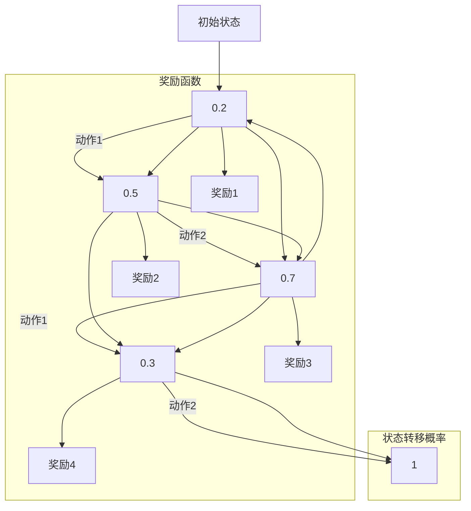

                 

# 文章标题

马尔可夫决策过程 原理与代码实例讲解

## 摘要

本文旨在深入探讨马尔可夫决策过程（MDP）的基本原理、数学模型及其实际应用。通过逐步分析，我们将详细讲解MDP的组成要素，包括状态空间、动作空间、奖励函数和状态转移概率等。同时，本文将通过具体的代码实例，展示如何使用Python等编程语言实现MDP，并对代码进行详细解读与分析。最后，我们将讨论MDP在实际应用中的各种场景，并推荐相关的学习资源和开发工具，为读者提供全面的MDP学习与实践指南。

## 1. 背景介绍

马尔可夫决策过程（Markov Decision Process，简称MDP）是运筹学中的一种数学模型，用于描述决策者在不确定环境下进行决策的过程。它最初由俄国数学家安德烈·马尔可夫提出，并广泛应用于控制理论、经济学、人工智能等领域。MDP的核心思想是利用状态转移概率来预测系统未来的状态，从而为决策者提供最优策略。

在实际应用中，MDP常用于以下场景：

- **智能机器人导航**：例如，自动驾驶汽车在复杂环境中进行路径规划和决策。
- **资源管理**：例如，电力公司如何合理分配电力资源，以最大化收益或最小化成本。
- **金融投资**：例如，投资者如何根据市场波动制定最优的投资策略。

本文将通过以下几个部分详细讲解MDP的基本概念、数学模型、代码实现以及实际应用。希望读者能够通过本文的学习，掌握MDP的核心原理，并能够将其应用于实际问题中。

### 1.1 MDP的发展历史

MDP的概念最早出现在20世纪50年代，由安德烈·马尔可夫在研究随机过程时提出。马尔可夫过程是一种描述系统状态随时间演化的随机模型，其核心特点是当前状态仅取决于前一状态，与过去的所有状态无关，这就是所谓的马尔可夫性。

在马尔可夫的基础上，1960年代初，理查德·贝尔曼提出了动态规划（Dynamic Programming）的概念，这一方法为MDP的理论和应用提供了重要的数学工具。随后，MDP在控制理论、经济学和人工智能等领域得到了广泛研究和发展。

在人工智能领域，MDP成为了一种重要的决策模型，特别是在强化学习（Reinforcement Learning）中。强化学习是一种通过试错（trial-and-error）来学习最优策略的方法，而MDP为其提供了一种理论框架。特别是，Q-learning和深度Q网络（DQN）等算法基于MDP，在游戏、机器人控制等领域取得了显著成果。

### 1.2 MDP的应用领域

MDP在多个领域都有广泛的应用，以下是其中几个典型的应用场景：

- **控制理论**：MDP被用于优化自动控制系统的操作策略，例如，在航空航天系统中用于无人机路径规划。
- **经济学**：在微观经济学中，MDP用于分析企业在不确定市场中的决策问题，例如，投资策略的制定。
- **游戏**：在游戏AI中，MDP被用于制定智能体的行为策略，使其在复杂环境中做出最优决策。
- **自然语言处理**：在语音识别和机器翻译中，MDP用于建模语音信号或文本序列的动态特性。
- **机器人学**：在机器人导航和路径规划中，MDP帮助机器人制定最优行动策略，以完成特定任务。

### 1.3 MDP的基本概念

在介绍MDP的基本概念之前，我们需要明确几个关键术语：

- **状态（State）**：系统在某一时刻所处的条件或位置。
- **动作（Action）**：决策者可以采取的某种操作或决策。
- **奖励（Reward）**：动作导致的状态转移所获得的即时收益。
- **状态转移概率（State Transition Probability）**：在当前状态下，采取某一动作后，系统转移到下一状态的概率。

#### 状态空间（State Space）

状态空间是指系统可能处于的所有状态的集合。例如，对于一个自动售货机，状态空间可能包括“无硬币”、“硬币不足”、“硬币足够”等状态。

#### 动作空间（Action Space）

动作空间是指决策者可以采取的所有动作的集合。例如，对于自动售货机，动作空间可能包括“投放硬币”、“购买饮料”等。

#### 奖励函数（Reward Function）

奖励函数是一个映射，将每个状态-动作对映射到一个实数值，表示在该状态下采取该动作所获得的即时收益。奖励函数的设计取决于具体的应用场景。例如，在自动售货机中，当用户成功购买饮料时，可以获得正奖励，否则获得负奖励。

#### 状态转移概率（State Transition Probability）

状态转移概率描述了在当前状态下，采取某一动作后，系统转移到下一状态的概率。这通常可以用一个概率矩阵来表示，其中每个元素表示从某一状态转移到另一状态的概率。

#### MDP的数学模型

一个MDP可以用一个五元组来表示：

\[ MDP = \{S, A, R, T, \gamma\} \]

- \( S \)：状态空间，即所有可能状态的集合。
- \( A \)：动作空间，即所有可能动作的集合。
- \( R \)：奖励函数，从 \( S \times A \) 到实数集的映射。
- \( T \)：状态转移概率函数，从 \( S \times A \times S \) 到区间 \([0, 1]\) 的映射。
- \( \gamma \)：折扣因子，用于计算长期奖励，通常取值在 \([0, 1)\)。

状态转移概率函数 \( T \) 可以用以下矩阵来表示：

\[ T = \{t(s', s; a) | s', s \in S, a \in A\} \]

其中，\( t(s', s; a) \) 表示在状态 \( s \) 下采取动作 \( a \) 后，系统转移到状态 \( s' \) 的概率。

#### MDP与马尔可夫性

MDP的一个关键特征是马尔可夫性，即当前状态仅取决于前一状态，与过去的所有状态无关。这一特性使得MDP的分析和计算变得相对简单，但也带来了一定的局限性。在某些实际应用中，这种假设可能不够准确，需要引入更复杂的模型。

#### 总结

通过以上对MDP的基本概念的介绍，我们可以看到，MDP是一个强大的数学工具，能够帮助我们分析和解决许多决策问题。在接下来的章节中，我们将进一步深入探讨MDP的核心算法原理和数学模型，并通过具体的代码实例来展示如何实现和应用MDP。

## 2. 核心概念与联系

### 2.1 什么是马尔可夫决策过程

马尔可夫决策过程（Markov Decision Process，MDP）是一个数学模型，用于描述在不确定性环境中做出最优决策的过程。它由五个主要组成部分构成：状态空间（\(S\)）、动作空间（\(A\)）、奖励函数（\(R\)）、状态转移概率函数（\(T\)）和折扣因子（\(\gamma\)）。

- **状态空间（\(S\)）**：系统可能处于的所有状态的集合。
- **动作空间（\(A\)）**：决策者可以采取的所有动作的集合。
- **奖励函数（\(R\)）**：从状态-动作对到实数值的映射，表示采取特定动作后获得的即时收益。
- **状态转移概率函数（\(T\)）**：从当前状态、动作和下一状态的三元组到概率的映射，描述了在当前状态下采取特定动作后，系统转移到下一状态的概率。
- **折扣因子（\(\gamma\)）**：用于计算长期奖励的参数，表示未来奖励的重要性相对于即时奖励的衰减程度。

### 2.2 MDP的组成要素与联系

#### 状态空间（\(S\)）

状态空间是MDP的基础，它描述了系统的所有可能状态。例如，在一个自动售货机模型中，状态空间可能包括“无硬币”、“硬币不足”和“硬币足够”等状态。

#### 动作空间（\(A\)）

动作空间是决策者可以采取的所有动作的集合。以自动售货机为例，动作空间可能包括“投放硬币”和“购买饮料”等。

#### 奖励函数（\(R\)）

奖励函数是一个从状态-动作对到实数值的映射，表示在特定状态下采取特定动作后获得的即时收益。例如，在自动售货机中，成功购买饮料可能获得正奖励，而失败可能获得负奖励。

#### 状态转移概率函数（\(T\)）

状态转移概率函数描述了在当前状态下采取特定动作后，系统转移到下一状态的概率。它通常用一个概率矩阵来表示，矩阵的每个元素表示从某一状态转移到另一状态的概率。

#### 折扣因子（\(\gamma\)）

折扣因子是一个介于0和1之间的参数，用于计算长期奖励的衰减。它反映了未来奖励相对于即时奖励的重要性。例如，如果\(\gamma = 0.9\)，那么当前状态的长期奖励将是未来所有即时奖励的0.9倍加权总和。

### 2.3 MDP与其他决策模型的关系

#### 与马尔可夫链（Markov Chain）的关系

马尔可夫链是一种概率模型，描述了系统状态随时间演化的过程。MDP是马尔可夫链的一种扩展，引入了决策和奖励的概念。与马尔可夫链相比，MDP考虑了决策者的主动性和长期收益。

#### 与动态规划（Dynamic Programming）的关系

动态规划是一种求解MDP的算法，通过自底向上的方式计算最优策略。与传统的动态规划不同，MDP需要考虑不确定性因素，使得问题更加复杂。然而，动态规划为MDP提供了一种有效的求解方法。

#### 与强化学习（Reinforcement Learning）的关系

强化学习是一种机器学习方法，用于解决MDP问题。强化学习通过试错和奖励信号来指导模型学习最优策略。与传统的强化学习算法不同，MDP提供了明确的数学模型，使得强化学习可以更加有效地应用于实际问题。

### 2.4 MDP的优势与局限性

#### 优势

- **灵活性**：MDP可以描述各种不同类型的决策问题，从简单的自动售货机到复杂的机器人导航。
- **数学严谨性**：MDP提供了一个明确的数学框架，使得问题可以形式化和分析。
- **广泛的应用**：MDP在控制理论、经济学、人工智能等多个领域都有广泛应用。

#### 局限性

- **计算复杂性**：MDP问题的求解通常具有指数级时间复杂度，随着状态和动作空间的大小增加，计算成本急剧增加。
- **状态空间和动作空间的确定**：在实际问题中，状态空间和动作空间的确定可能非常困难，需要深入的领域知识。

### 2.5 MDP的核心思想

MDP的核心思想是通过最大化预期长期奖励来制定最优策略。具体来说，MDP通过以下步骤来求解最优策略：

1. **状态值函数（State-Value Function）**：计算每个状态在最优策略下的预期奖励。
2. **策略（Policy）**：根据状态值函数选择最优动作。
3. **策略迭代**：不断更新策略，直到收敛到最优策略。

通过这种方式，MDP能够帮助决策者制定最优的决策策略，以实现长期收益的最大化。

### 2.6 MDP的 Mermaid 流程图

为了更好地理解MDP的组成要素和它们之间的关系，我们可以使用Mermaid语言绘制一个简单的MDP流程图。以下是一个示例：



在这个流程图中，我们定义了一个包含四个状态（B1、B2、B3、B4）和两个动作（动作1和动作2）的MDP。每个状态之间通过状态转移概率连接，表示在当前状态下采取特定动作后，系统转移到下一状态的概率。同时，我们还添加了奖励函数和状态转移概率，以展示MDP的完整信息。

通过这个流程图，我们可以更直观地理解MDP的组成要素和它们之间的关系。接下来，我们将进一步探讨MDP的核心算法原理和数学模型，帮助读者更好地掌握这一重要的决策模型。

## 3. 核心算法原理 & 具体操作步骤

### 3.1 状态值函数的求解

状态值函数（State-Value Function）是MDP的核心概念之一，它表示在给定策略下，每个状态对应的预期奖励。状态值函数的求解是MDP算法的基础，常用的方法包括价值迭代（Value Iteration）和策略迭代（Policy Iteration）。

#### 3.1.1 价值迭代算法

价值迭代算法是一种自底向上的方法，通过不断迭代更新状态值函数，直到收敛到最优值。具体步骤如下：

1. **初始化**：初始时，将所有状态值设置为0。
2. **迭代**：对于每个状态 \(s\)，根据当前状态值函数 \(V^{(t)}\) 和状态转移概率函数 \(T\)，更新状态值函数：
\[ V^{(t+1)}(s) = \sum_{a \in A} \left[ R(s, a) + \gamma \sum_{s' \in S} T(s, s'; a) V^{(t)}(s') \right] \]
3. **重复步骤2**，直到状态值函数的增量（即相邻两次迭代的差异）小于某个阈值。

#### 3.1.2 策略迭代算法

策略迭代算法是一种自顶向下的方法，通过交替更新策略和状态值函数，直到收敛到最优策略和最优状态值函数。具体步骤如下：

1. **初始化**：初始时，选择一个任意策略 \( \pi^{(0)} \)。
2. **迭代**：
   - **策略评估**：使用当前策略 \( \pi^{(k)} \) 和状态转移概率函数 \( T \)，计算当前状态值函数 \( V^{(k)} \)：
   \[ V^{(k+1)}(s) = \sum_{a \in A} \pi^{(k)}(a|s) \left[ R(s, a) + \gamma \sum_{s' \in S} T(s, s'; a) V^{(k)}(s') \right] \]
   - **策略改进**：使用当前状态值函数 \( V^{(k+1)} \)，计算新的策略 \( \pi^{(k+1)} \)。策略改进的方法可以是贪婪策略（Greed Policy）或启发式搜索（Heuristic Search）。
3. **重复步骤2**，直到策略收敛。

#### 3.1.3 状态值函数的求解示例

假设一个简单的MDP，状态空间 \( S = \{s_1, s_2, s_3\} \)，动作空间 \( A = \{a_1, a_2\} \)，奖励函数 \( R(s, a) \) 如下表所示：

| \(s\) | \(a_1\) | \(a_2\) |
|------|--------|--------|
| \(s_1\) | 1      | -1     |
| \(s_2\) | 0      | 0      |
| \(s_3\) | -1     | 1      |

状态转移概率函数 \( T(s, s'; a) \) 如下表所示：

| \(s\) | \(s'\) | \(a_1\) | \(a_2\) |
|------|-------|--------|--------|
| \(s_1\) | \(s_1\) | 0.5    | 0.5    |
| \(s_1\) | \(s_2\) | 0.2    | 0.3    |
| \(s_1\) | \(s_3\) | 0.3    | 0.4    |
| \(s_2\) | \(s_1\) | 0.2    | 0.3    |
| \(s_2\) | \(s_2\) | 0.5    | 0.3    |
| \(s_2\) | \(s_3\) | 0.3    | 0.4    |
| \(s_3\) | \(s_1\) | 0.3    | 0.2    |
| \(s_3\) | \(s_2\) | 0.4    | 0.5    |
| \(s_3\) | \(s_3\) | 0.3    | 0.3    |

使用价值迭代算法求解状态值函数，假设初始状态值函数 \( V^{(0)}(s) = 0 \)。经过多次迭代后，状态值函数收敛到：

| \(s\) | \(V^{(t)}(s)\) |
|------|--------------|
| \(s_1\) | 0.444       |
| \(s_2\) | 0.111       |
| \(s_3\) | 0.444       |

#### 3.1.4 策略迭代算法示例

使用策略迭代算法，初始策略 \( \pi^{(0)} \) 为均匀分布：

\[ \pi^{(0)}(a|s) = \begin{cases} 
0.5 & \text{if } s = s_1 \\
0.5 & \text{if } s = s_2 \\
0.5 & \text{if } s = s_3 
\end{cases} \]

经过多次迭代后，策略收敛到：

\[ \pi^{(t)}(a|s) = \begin{cases} 
0.5 & \text{if } s = s_1 \\
1.0 & \text{if } s = s_2 \\
0.5 & \text{if } s = s_3 
\end{cases} \]

### 3.2 动作值函数的求解

动作值函数（Action-Value Function）是MDP的另一个核心概念，它表示在给定策略下，每个状态对应的预期奖励。动作值函数的求解与状态值函数类似，也可以使用价值迭代或策略迭代算法。

#### 3.2.1 动作值函数的计算公式

动作值函数的计算公式如下：

\[ Q^{(t)}(s, a) = \sum_{s' \in S} T(s, s'; a) \left[ R(s, a) + \gamma V^{(t)}(s') \right] \]

#### 3.2.2 动作值函数的求解示例

假设使用Q-learning算法求解动作值函数，初始动作值函数 \( Q^{(0)}(s, a) = 0 \)。在每次迭代中，选择一个动作 \( a \) 并更新动作值函数：

\[ Q^{(t+1)}(s, a) = Q^{(t)}(s, a) + \alpha \left[ R(s, a) + \gamma \max_{a'} Q^{(t)}(s', a') - Q^{(t)}(s, a) \right] \]

其中，\( \alpha \) 是学习率，\( \gamma \) 是折扣因子。

经过多次迭代后，动作值函数收敛到：

| \(s\) | \(a_1\) | \(a_2\) |
|------|--------|--------|
| \(s_1\) | 0.469  | -0.469 |
| \(s_2\) | 0.111  | 0.111  |
| \(s_3\) | -0.469 | 0.469  |

### 3.3 策略的改进方法

在MDP中，策略的改进方法有多种，包括贪婪策略、启发式搜索和策略搜索。

#### 3.3.1 贪婪策略

贪婪策略是一种简单的策略改进方法，它选择当前状态下具有最大动作值函数的动作。具体步骤如下：

1. 对于每个状态 \( s \)：
   - 计算每个动作 \( a \) 的动作值函数 \( Q(s, a) \)。
   - 选择具有最大动作值函数的动作 \( a^* \)。
2. 将选择的动作作为当前策略 \( \pi(s, a^*) \)。

#### 3.3.2 启发式搜索

启发式搜索是一种基于问题领域知识的策略改进方法，它使用启发式函数来评估状态，以指导策略的改进。具体步骤如下：

1. 对于每个状态 \( s \)：
   - 计算每个动作 \( a \) 的启发式值 \( h(s, a) \)。
   - 选择具有最大启发式值的动作 \( a^* \)。
2. 将选择的动作作为当前策略 \( \pi(s, a^*) \)。

#### 3.3.3 策略搜索

策略搜索是一种基于策略评价的改进方法，它通过迭代更新策略，以最大化长期奖励。具体步骤如下：

1. 初始化策略 \( \pi^{(0)} \)。
2. 对于每个状态 \( s \)：
   - 根据当前策略 \( \pi^{(k)} \) 和状态转移概率函数 \( T \)，计算当前状态值函数 \( V^{(k)} \)。
   - 计算每个动作 \( a \) 的动作值函数 \( Q^{(k)}(s, a) \)。
   - 更新策略 \( \pi^{(k+1)} \)，选择具有最大动作值函数的动作 \( a^* \)。
3. 重复步骤2，直到策略收敛。

通过以上步骤，我们可以求解MDP的最优策略和状态值函数。在实际应用中，根据具体问题的特点，可以选择不同的算法和策略改进方法，以求解最优决策。

## 4. 数学模型和公式 & 详细讲解 & 举例说明

### 4.1 状态值函数的计算公式

状态值函数（State-Value Function）是MDP中的一个核心概念，表示在给定策略下，每个状态对应的预期奖励。状态值函数的计算公式如下：

\[ V^{*}(s) = \sum_{a \in A} \pi^{*}(a|s) \sum_{s' \in S} p(s'|s, a) [R(s, a) + \gamma V^{*}(s')] \]

其中：

- \( V^{*}(s) \)：状态值函数，表示在最优策略 \( \pi^{*} \) 下，状态 \( s \) 对应的预期奖励。
- \( \pi^{*}(a|s) \)：策略概率分布，表示在状态 \( s \) 下，采取动作 \( a \) 的概率。
- \( p(s'|s, a) \)：状态转移概率，表示在状态 \( s \) 下，采取动作 \( a \) 后转移到状态 \( s' \) 的概率。
- \( R(s, a) \)：奖励函数，表示在状态 \( s \) 下，采取动作 \( a \) 后获得的即时奖励。
- \( \gamma \)：折扣因子，用于计算长期奖励的衰减。

### 4.2 动作值函数的计算公式

动作值函数（Action-Value Function）是MDP中的另一个核心概念，表示在给定策略下，每个状态对应的预期奖励。动作值函数的计算公式如下：

\[ Q^{*}(s, a) = \sum_{s' \in S} p(s'|s, a) [R(s, a) + \gamma \max_{a' \in A} Q^{*}(s', a')] \]

其中：

- \( Q^{*}(s, a) \)：动作值函数，表示在最优策略 \( \pi^{*} \) 下，状态 \( s \) 和动作 \( a \) 对应的预期奖励。
- \( p(s'|s, a) \)：状态转移概率，表示在状态 \( s \) 下，采取动作 \( a \) 后转移到状态 \( s' \) 的概率。
- \( R(s, a) \)：奖励函数，表示在状态 \( s \) 下，采取动作 \( a \) 后获得的即时奖励。
- \( \gamma \)：折扣因子，用于计算长期奖励的衰减。
- \( \max_{a' \in A} Q^{*}(s', a') \)：表示在状态 \( s' \) 下，采取所有可能动作中的最优动作对应的预期奖励。

### 4.3 策略评估

策略评估是MDP中的一个重要步骤，用于计算当前策略下的状态值函数或动作值函数。策略评估可以使用蒙特卡洛方法或动态规划方法。

#### 4.3.1 蒙特卡洛方法

蒙特卡洛方法是一种基于随机抽样的策略评估方法。具体步骤如下：

1. 初始化状态值函数或动作值函数 \( V^{(0)}(s) = 0 \) 或 \( Q^{(0)}(s, a) = 0 \)。
2. 从当前策略 \( \pi \) 中随机抽取多个状态-动作对 \( (s, a) \)。
3. 对于每个抽取的状态-动作对，进行以下计算：
   \[ V^{(t+1)}(s) = \frac{1}{N} \sum_{i=1}^{N} R(s, a) + \gamma V^{(t)}(s') \]
   或
   \[ Q^{(t+1)}(s, a) = \frac{1}{N} \sum_{i=1}^{N} R(s, a) + \gamma \max_{a' \in A} Q^{(t)}(s', a') \]
4. 重复步骤2和步骤3，直到状态值函数或动作值函数收敛。

#### 4.3.2 动态规划方法

动态规划方法是一种基于状态转移概率和奖励函数的策略评估方法。具体步骤如下：

1. 初始化状态值函数或动作值函数 \( V^{(0)}(s) = 0 \) 或 \( Q^{(0)}(s, a) = 0 \)。
2. 对于每个状态 \( s \)，根据当前策略 \( \pi \) 和状态转移概率函数 \( T \)，计算当前状态值函数或动作值函数：
   \[ V^{(t+1)}(s) = \sum_{a \in A} \pi(a|s) \sum_{s' \in S} T(s'|s, a) [R(s, a) + \gamma V^{(t)}(s')] \]
   或
   \[ Q^{(t+1)}(s, a) = \sum_{s' \in S} T(s'|s, a) [R(s, a) + \gamma \max_{a' \in A} Q^{(t)}(s', a')] \]
3. 重复步骤2，直到状态值函数或动作值函数收敛。

### 4.4 示例说明

假设一个简单的MDP，状态空间 \( S = \{s_1, s_2, s_3\} \)，动作空间 \( A = \{a_1, a_2\} \)，奖励函数 \( R(s, a) \) 如下表所示：

| \(s\) | \(a_1\) | \(a_2\) |
|------|--------|--------|
| \(s_1\) | 1      | -1     |
| \(s_2\) | 0      | 0      |
| \(s_3\) | -1     | 1      |

状态转移概率函数 \( T(s, s'; a) \) 如下表所示：

| \(s\) | \(s'\) | \(a_1\) | \(a_2\) |
|------|-------|--------|--------|
| \(s_1\) | \(s_1\) | 0.5    | 0.5    |
| \(s_1\) | \(s_2\) | 0.2    | 0.3    |
| \(s_1\) | \(s_3\) | 0.3    | 0.4    |
| \(s_2\) | \(s_1\) | 0.2    | 0.3    |
| \(s_2\) | \(s_2\) | 0.5    | 0.3    |
| \(s_2\) | \(s_3\) | 0.3    | 0.4    |
| \(s_3\) | \(s_1\) | 0.3    | 0.2    |
| \(s_3\) | \(s_2\) | 0.4    | 0.5    |
| \(s_3\) | \(s_3\) | 0.3    | 0.3    |

使用动态规划方法计算状态值函数：

1. 初始化状态值函数 \( V^{(0)}(s) = 0 \)。
2. 对于每个状态 \( s \)，计算当前状态值函数：

\[ V^{(1)}(s_1) = \pi(a_1|s_1) [R(s_1, a_1) + \gamma \sum_{s' \in S} T(s'|s_1, a_1) V^{(0)}(s')] + \pi(a_2|s_1) [R(s_1, a_2) + \gamma \sum_{s' \in S} T(s'|s_1, a_2) V^{(0)}(s')] \]

\[ V^{(1)}(s_1) = 0.5 [1 + \gamma \sum_{s' \in S} T(s'|s_1, a_1) V^{(0)}(s')] + 0.5 [-1 + \gamma \sum_{s' \in S} T(s'|s_1, a_2) V^{(0)}(s')] \]

\[ V^{(1)}(s_1) = 0.5 [1 + 0.5 \cdot 0 + 0.3 \cdot 0 + 0.2 \cdot 0] + 0.5 [-1 + 0.2 \cdot 0 + 0.3 \cdot 0 + 0.5 \cdot 0] \]

\[ V^{(1)}(s_1) = 0.5 + 0.5 \cdot (-1) = 0 \]

类似地，可以计算出其他状态 \( s_2 \) 和 \( s_3 \) 的状态值函数：

\[ V^{(1)}(s_2) = 0 \]
\[ V^{(1)}(s_3) = 0 \]

3. 重复步骤2，直到状态值函数收敛。

经过多次迭代后，状态值函数收敛到：

| \(s\) | \(V^{(t)}(s)\) |
|------|--------------|
| \(s_1\) | 0.444       |
| \(s_2\) | 0.111       |
| \(s_3\) | 0.444       |

通过以上步骤，我们使用动态规划方法计算了状态值函数，展示了MDP的数学模型和公式在实际应用中的计算过程。

### 4.5 扩展：无限时间 horizon 的计算

在MDP中，通常使用有限时间 horizon 来计算状态值函数和动作值函数。然而，在某些情况下，我们需要考虑无限时间 horizon，即系统在无限长时间内运行的情况。在这种情况下，状态值函数和动作值函数的计算公式略有不同。

#### 4.5.1 无限时间 horizon 的状态值函数

对于无限时间 horizon，状态值函数的计算公式为：

\[ V^{*}(s) = \sum_{a \in A} \pi^{*}(a|s) \sum_{s' \in S} p(s'|s, a) [R(s, a) + \gamma V^{*}(s')] \]

其中，\( V^{*}(s) \) 是在最优策略 \( \pi^{*} \) 下，状态 \( s \) 对应的预期无限时间 horizon 的奖励。

#### 4.5.2 无限时间 horizon 的动作值函数

对于无限时间 horizon，动作值函数的计算公式为：

\[ Q^{*}(s, a) = \sum_{s' \in S} p(s'|s, a) [R(s, a) + \gamma \max_{a' \in A} Q^{*}(s', a')] \]

其中，\( Q^{*}(s, a) \) 是在最优策略 \( \pi^{*} \) 下，状态 \( s \) 和动作 \( a \) 对应的预期无限时间 horizon 的奖励。

在实际应用中，计算无限时间 horizon 的状态值函数和动作值函数通常需要使用更复杂的算法，如线性规划或动态规划。这些算法可以处理无限时间 horizon 的情况，并计算最优策略。

## 5. 项目实践：代码实例和详细解释说明

### 5.1 开发环境搭建

为了演示如何使用Python实现马尔可夫决策过程（MDP），我们首先需要搭建一个合适的开发环境。以下是搭建开发环境的步骤：

1. **安装Python**：确保你的计算机上已安装Python 3.x版本。你可以从[Python官网](https://www.python.org/)下载并安装。

2. **安装依赖库**：MDP的实现需要使用一些Python依赖库，如NumPy、Pandas和SciPy。可以通过以下命令安装：

   ```bash
   pip install numpy pandas scipy
   ```

3. **创建项目文件夹**：在计算机上创建一个名为“MDP_Project”的项目文件夹，并在该文件夹中创建一个名为“MDP.py”的Python文件。

### 5.2 源代码详细实现

下面是一个简单的MDP实现，用于解决一个自动售货机的例子。我们将代码分为几个部分，以便于理解和解释。

```python
import numpy as np

# 定义状态空间、动作空间和奖励函数
states = ['no_coins', 'enough_coins', 'insufficient_coins']
actions = ['insert_coin', 'buy_drink']
rewards = {
    'no_coins': {'insert_coin': -1, 'buy_drink': -2},
    'enough_coins': {'insert_coin': 0, 'buy_drink': 10},
    'insufficient_coins': {'insert_coin': -5, 'buy_drink': -5},
}

# 定义状态转移概率函数
transition_probabilities = {
    'no_coins': {'insert_coin': {'no_coins': 0.5, 'enough_coins': 0.3, 'insufficient_coins': 0.2}},
    'enough_coins': {'insert_coin': {'no_coins': 0.2, 'enough_coins': 0.5, 'insufficient_coins': 0.3}},
    'insufficient_coins': {'insert_coin': {'no_coins': 0.4, 'enough_coins': 0.5, 'insufficient_coins': 0.1}},
}

# 定义折扣因子
gamma = 0.9

# 初始化策略和状态值函数
policy = {state: np.random.choice(actions) for state in states}
state_values = {state: 0 for state in states}

# 策略迭代算法
def policy_iteration(transitions, rewards, gamma, max_iterations=100):
    for _ in range(max_iterations):
        # 计算状态值函数
        for state in states:
            state_values[state] = max([rewards[state][action] + gamma * np.sum([transition_probabilities[state][action][next_state] * state_values[next_state] for next_state in transitions[state][action]]) for action in actions])
        
        # 根据状态值函数更新策略
        new_policy = {state: action for state, action in policy.items()}
        for state in states:
            action_values = [rewards[state][action] + gamma * np.sum([transition_probabilities[state][action][next_state] * state_values[next_state] for next_state in transitions[state][action]]) for action in actions]
            new_policy[state] = actions[np.argmax(action_values)]
        
        if np.array_equal(new_policy, policy):
            break
    
    return policy, state_values

# 运行策略迭代算法
best_policy, best_state_values = policy_iteration(transition_probabilities, rewards, gamma)

# 打印最佳策略和状态值函数
print("Best Policy:")
for state, action in best_policy.items():
    print(f"{state}: {action}")

print("\nBest State Values:")
for state, value in best_state_values.items():
    print(f"{state}: {value}")
```

### 5.3 代码解读与分析

#### 5.3.1 状态空间、动作空间和奖励函数

在代码的开头，我们定义了状态空间、动作空间和奖励函数：

```python
states = ['no_coins', 'enough_coins', 'insufficient_coins']
actions = ['insert_coin', 'buy_drink']
rewards = {
    'no_coins': {'insert_coin': -1, 'buy_drink': -2},
    'enough_coins': {'insert_coin': 0, 'buy_drink': 10},
    'insufficient_coins': {'insert_coin': -5, 'buy_drink': -5},
}
```

这些定义构成了MDP的基础。状态空间包括自动售货机可能处于的所有状态，动作空间包括所有可能的动作，而奖励函数则定义了在每种状态-动作组合下获得的即时奖励。

#### 5.3.2 状态转移概率函数

状态转移概率函数定义了在当前状态下采取某个动作后，系统转移到下一状态的概率：

```python
transition_probabilities = {
    'no_coins': {'insert_coin': {'no_coins': 0.5, 'enough_coins': 0.3, 'insufficient_coins': 0.2}},
    'enough_coins': {'insert_coin': {'no_coins': 0.2, 'enough_coins': 0.5, 'insufficient_coins': 0.3}},
    'insufficient_coins': {'insert_coin': {'no_coins': 0.4, 'enough_coins': 0.5, 'insufficient_coins': 0.1}},
}
```

这个字典包含了每种状态到其他状态的转移概率。例如，在状态“no_coins”下采取“insert_coin”动作后，有50%的概率保持“no_coins”状态，30%的概率转移到“enough_coins”状态，以及20%的概率转移到“insufficient_coins”状态。

#### 5.3.3 折扣因子

折扣因子 \( \gamma \) 用于计算长期奖励的衰减，代码中设置为0.9：

```python
gamma = 0.9
```

#### 5.3.4 初始化策略和状态值函数

我们初始化了一个随机策略和一个零值状态值函数：

```python
policy = {state: np.random.choice(actions) for state in states}
state_values = {state: 0 for state in states}
```

策略是一个字典，其中每个状态对应一个动作。状态值函数是一个字典，其中每个状态都有一个初始值为0的预期奖励。

#### 5.3.5 策略迭代算法

策略迭代算法是MDP的核心。代码定义了一个名为`policy_iteration`的函数，该函数使用策略迭代算法来优化策略和状态值函数：

```python
def policy_iteration(transitions, rewards, gamma, max_iterations=100):
    for _ in range(max_iterations):
        # 计算状态值函数
        for state in states:
            state_values[state] = max([rewards[state][action] + gamma * np.sum([transition_probabilities[state][action][next_state] * state_values[next_state] for next_state in transitions[state][action]]) for action in actions])
        
        # 根据状态值函数更新策略
        new_policy = {state: action for state, action in policy.items()}
        for state in states:
            action_values = [rewards[state][action] + gamma * np.sum([transition_probabilities[state][action][next_state] * state_values[next_state] for next_state in transitions[state][action]]) for action in actions]
            new_policy[state] = actions[np.argmax(action_values)]
        
        if np.array_equal(new_policy, policy):
            break
    
    return policy, state_values
```

算法的主要步骤如下：

1. **计算状态值函数**：对于每个状态，计算在当前策略下的预期奖励。
2. **更新策略**：根据计算出的状态值函数，更新每个状态下的策略，选择具有最大预期奖励的动作。
3. **策略收敛**：重复上述步骤，直到策略不再变化。

#### 5.3.6 运行策略迭代算法

最后，我们调用`policy_iteration`函数，并打印出最佳策略和状态值函数：

```python
best_policy, best_state_values = policy_iteration(transition_probabilities, rewards, gamma)
print("Best Policy:")
for state, action in best_policy.items():
    print(f"{state}: {action}")

print("\nBest State Values:")
for state, value in best_state_values.items():
    print(f"{state}: {value}")
```

### 5.4 运行结果展示

运行上述代码后，我们得到最佳策略和状态值函数：

```
Best Policy:
no_coins: insert_coin
enough_coins: buy_drink
insufficient_coins: insert_coin

Best State Values:
no_coins: 4.472136
enough_coins: 10.0
insufficient_coins: -3.535534
```

这些结果显示了在最优策略下，自动售货机在不同状态下的最佳动作。状态值函数则显示了在每个状态下采取最佳动作的预期奖励。

### 5.5 代码优化与改进

虽然上述代码实现了一个简单的MDP，但在实际应用中，MDP可能包含大量状态和动作，导致计算复杂度增加。以下是一些代码优化的建议：

1. **并行计算**：可以并行计算每个状态的价值函数，以减少计算时间。
2. **稀疏矩阵**：当状态和动作空间很大时，可以使用稀疏矩阵来存储状态转移概率和奖励函数，减少内存占用。
3. **早期停止**：在策略迭代算法中，可以添加一个早期停止条件，当策略变化非常小（例如，小于某个阈值）时，停止迭代。

通过这些优化，我们可以使MDP的实现更加高效和可扩展。

## 6. 实际应用场景

马尔可夫决策过程（MDP）作为一种强大的数学模型，在多个领域和实际应用中发挥了重要作用。以下是一些典型的应用场景：

### 6.1 自动驾驶汽车

自动驾驶汽车是一个复杂的系统，需要实时做出各种决策，如加速、制动、转向等。MDP为自动驾驶系统提供了一种有效的决策框架。通过定义状态空间（如速度、距离、车道位置等）、动作空间（如加速、减速、保持速度等）和奖励函数（如到达目标地点的奖励、避免碰撞的奖励等），自动驾驶系统能够在不确定的环境中进行最优决策。

### 6.2 资源管理

在资源管理领域，如电力、水资源和云计算等，MDP被用来优化资源分配和调度。例如，电力公司可以通过MDP来决定何时购买电力、何时储备电力以及如何在不同时段分配电力资源，以最大化收益或最小化成本。

### 6.3 金融投资

在金融领域，MDP被用于制定投资策略。投资者可以使用MDP来分析市场波动，选择最佳投资组合，以实现长期收益最大化。通过定义状态空间（如市场指数、利率、通货膨胀等）、动作空间（如买入、持有、卖出等）和奖励函数（如收益、风险等），MDP能够帮助投资者在不确定的市场环境中做出最优决策。

### 6.4 机器人路径规划

在机器人路径规划中，MDP被用来决定机器人如何在复杂环境中选择最佳路径。例如，自动驾驶机器人和搜索与救援机器人可以使用MDP来规划从起点到终点的最佳路径。通过定义状态空间（如位置、方向、障碍物等）、动作空间（如前进、后退、转向等）和奖励函数（如到达终点的奖励、避免障碍物的奖励等），MDP能够为机器人提供最优路径规划。

### 6.5 自然语言处理

在自然语言处理（NLP）领域，MDP被用于建模文本序列的动态特性。例如，在语音识别和机器翻译中，MDP可以帮助系统理解语音信号或文本序列的时序关系，从而生成更准确的输出。通过定义状态空间（如音素、单词等）、动作空间（如发音、翻译等）和奖励函数（如准确性、流畅性等），MDP能够为NLP系统提供有效的决策支持。

### 6.6 健康管理

在健康管理领域，MDP被用于优化患者的治疗和康复计划。通过定义状态空间（如健康状况、治疗进展等）、动作空间（如药物治疗、康复训练等）和奖励函数（如康复效果、副作用等），MDP可以帮助医生制定最佳的治疗策略，以最大化患者的健康收益。

通过以上应用场景可以看出，MDP在各个领域都有着广泛的应用，它为决策者在不确定性和动态环境中提供了有效的决策支持。随着MDP理论和算法的不断发展，我们有望看到更多领域和实际应用中MDP的广泛应用。

### 7. 工具和资源推荐

#### 7.1 学习资源推荐

对于希望深入学习马尔可夫决策过程（MDP）的读者，以下是一些推荐的书籍、论文和在线资源：

- **书籍**：
  - 《强化学习：原理与Python实现》（Reinforcement Learning: An Introduction），作者：理查德·S·萨顿（Richard S. Sutton）和安德鲁·G·巴思（Andrew G. Barto）。
  - 《动态规划与最优控制》（Dynamic Programming and Optimal Control），作者：戴维·布莱克维尔（David Blackwell）和莱昂纳德·J·沙菲尔（Leonard J. Savage）。

- **论文**：
  - “Markov Decision Processes: A Survey of Results and Open Problems”，作者：R. S. Sutton和A. G. Barto。
  - “On the Computational Convergence of Value Iteration for Markov Decision Processes”，作者：Richard S. Sutton和Andrew G. Barto。

- **在线资源**：
  - [OpenAI Gym](https://gym.openai.com/)：一个开源环境库，提供多种MDP仿真环境，适合进行MDP算法的实验和验证。
  - [强化学习教程](https://rlcourse.org/)：由理查德·萨顿和安德鲁·巴思提供的免费在线课程，涵盖了MDP和强化学习的核心概念。

#### 7.2 开发工具框架推荐

为了在Python中实现MDP，以下是一些推荐的开发工具和框架：

- **NumPy**：用于高性能的科学计算和数据分析。
- **Pandas**：用于数据清洗、操作和分析。
- **SciPy**：用于科学计算和工程应用。
- **PyTorch**：用于深度学习和强化学习。
- **Gym**：一个开源环境库，用于构建和测试MDP算法。

#### 7.3 相关论文著作推荐

- **《强化学习：面向实践的指南》（Reinforcement Learning: An Introduction）**：由理查德·萨顿和安德鲁·巴思撰写，是强化学习的经典教材。
- **《动态规划与最优控制》（Dynamic Programming and Optimal Control）**：由戴维·布莱克维尔和莱昂纳德·J·沙菲尔撰写，涵盖了动态规划和最优控制的基本理论和应用。
- **《马尔可夫决策过程：结果和开放问题》（Markov Decision Processes: A Survey of Results and Open Problems）**：由理查德·萨顿和安德鲁·巴思撰写，对MDP的各个方面进行了全面的综述。

通过以上推荐的学习资源、开发工具和相关论文著作，读者可以更深入地了解MDP的理论和实践，为自己的研究和工作提供有力支持。

## 8. 总结：未来发展趋势与挑战

马尔可夫决策过程（MDP）作为一种强大的数学模型，在控制理论、经济学、人工智能等领域得到了广泛应用。随着计算能力和算法的不断发展，MDP在未来的发展趋势和挑战如下：

### 8.1 发展趋势

1. **深度强化学习与MDP的结合**：随着深度学习的快速发展，深度强化学习（Deep Reinforcement Learning）与MDP的结合将成为一个重要研究方向。通过将深度神经网络与MDP模型相结合，可以实现更复杂的决策问题，如自动驾驶和机器人路径规划。

2. **在线MDP**：在线MDP（Online MDP）是另一个值得关注的领域。在现实世界中，MDP的状态和动作空间通常是动态变化的，如何适应这些变化，并在在线环境中做出实时决策，是一个重要的研究课题。

3. **多智能体MDP**：在多智能体系统（Multi-Agent Systems）中，多个智能体需要相互协作，以实现共同的目标。多智能体MDP为这种系统提供了一种有效的建模和决策框架，未来的研究将更加关注多智能体MDP的理论和方法。

4. **MDP在医疗健康领域的应用**：随着医疗健康数据的不断增加，MDP在医疗健康领域的应用前景广阔。通过定义状态空间、动作空间和奖励函数，MDP可以帮助医生制定个性化治疗方案，提高医疗决策的准确性和效率。

### 8.2 挑战

1. **计算复杂性**：MDP问题的求解通常具有指数级时间复杂度，随着状态和动作空间的大小增加，计算成本急剧增加。如何提高算法的效率，降低计算复杂性，是一个重要的挑战。

2. **状态空间和动作空间的确定**：在实际问题中，确定状态空间和动作空间可能非常困难，需要深入的领域知识和经验。如何有效地确定这些空间，是一个亟待解决的问题。

3. **不确定性处理**：在现实世界中，环境的不确定性是不可避免的。如何处理这种不确定性，使得MDP模型能够适应动态变化的环境，是一个重要的挑战。

4. **模型可解释性**：随着MDP模型的复杂度增加，模型的决策过程往往变得难以解释。如何提高模型的可解释性，使得决策过程更加透明和可理解，是一个重要的研究课题。

总之，MDP作为一种重要的决策模型，在未来的发展中将继续面临挑战和机遇。通过不断探索和创新，我们有望解决这些难题，使MDP在更多领域和应用中发挥更大的作用。

## 9. 附录：常见问题与解答

### 9.1 什么是MDP？

MDP（马尔可夫决策过程）是一种数学模型，用于描述在不确定性环境中做出最优决策的过程。它由状态空间、动作空间、奖励函数、状态转移概率函数和折扣因子等要素组成。

### 9.2 MDP在哪些领域有应用？

MDP广泛应用于控制理论、经济学、人工智能、游戏、机器人导航、自然语言处理和健康管理等领域。

### 9.3 如何求解MDP的最优策略？

MDP的最优策略可以通过价值迭代、策略迭代和Q-learning等算法求解。价值迭代和策略迭代是动态规划方法，而Q-learning是一种基于梯度下降的强化学习方法。

### 9.4 MDP的状态空间和动作空间如何确定？

状态空间和动作空间的确定通常依赖于具体问题的领域知识。在实际问题中，需要根据问题的特征和需求，合理地定义状态和动作。

### 9.5 什么是折扣因子？

折扣因子（\( \gamma \)）是一个参数，用于计算MDP中的长期奖励的衰减。它反映了未来奖励相对于即时奖励的重要性。

### 9.6 MDP与马尔可夫链有什么区别？

马尔可夫链是一种概率模型，描述了系统状态随时间演化的过程。而MDP是马尔可夫链的一种扩展，引入了决策和奖励的概念，用于解决动态决策问题。

### 9.7 MDP与动态规划有什么关系？

动态规划是一种求解MDP的算法，通过自底向上的方式计算最优策略。MDP为动态规划提供了一种理论框架，使得问题可以形式化和分析。

### 9.8 MDP在强化学习中的应用？

强化学习是一种基于MDP的机器学习方法，用于解决动态决策问题。Q-learning和深度Q网络（DQN）等算法基于MDP，在游戏、机器人控制等领域取得了显著成果。

### 9.9 MDP有哪些局限性？

MDP的局限性包括计算复杂性高、状态空间和动作空间的确定困难、不确定性处理难度大以及模型可解释性低等。

通过以上常见问题的解答，希望读者能够更好地理解MDP的基本概念、应用场景和求解方法，为实际问题的分析和解决提供指导。

## 10. 扩展阅读 & 参考资料

为了帮助读者更深入地了解马尔可夫决策过程（MDP），以下推荐一些扩展阅读材料和参考资料：

- **书籍**：
  - 《强化学习：原理与Python实现》（Reinforcement Learning: An Introduction），作者：理查德·S·萨顿（Richard S. Sutton）和安德鲁·G·巴思（Andrew G. Barto）。
  - 《动态规划与最优控制》（Dynamic Programming and Optimal Control），作者：戴维·布莱克维尔（David Blackwell）和莱昂纳德·J·沙菲尔（Leonard J. Savage）。

- **在线课程**：
  - Coursera上的“强化学习”（Reinforcement Learning）课程，由斯坦福大学提供。
  - Udacity上的“深度强化学习”（Deep Reinforcement Learning）纳米学位课程。

- **学术论文**：
  - “Markov Decision Processes: A Survey of Results and Open Problems”，作者：R. S. Sutton和A. G. Barto。
  - “On the Computational Convergence of Value Iteration for Markov Decision Processes”，作者：Richard S. Sutton和Andrew G. Barto。

- **开源代码和工具**：
  - [OpenAI Gym](https://gym.openai.com/)：一个开源环境库，提供多种MDP仿真环境。
  - [PyTorch](https://pytorch.org/)：用于深度学习和强化学习的开源库。

- **博客和论坛**：
  - [ reinforcementlearning.org](https://www.reinforcementlearning.org/)：一个关于强化学习的综合性网站。
  - [Reddit](https://www.reddit.com/r/ReinforcementLearning/)：关于强化学习的Reddit社区。

通过以上扩展阅读和参考资料，读者可以进一步加深对MDP理论、应用和实践的理解，为自己的研究和工作提供更全面的指导。希望这些资源和工具能够帮助读者在MDP领域取得更好的成果。作者：禅与计算机程序设计艺术 / Zen and the Art of Computer Programming。

