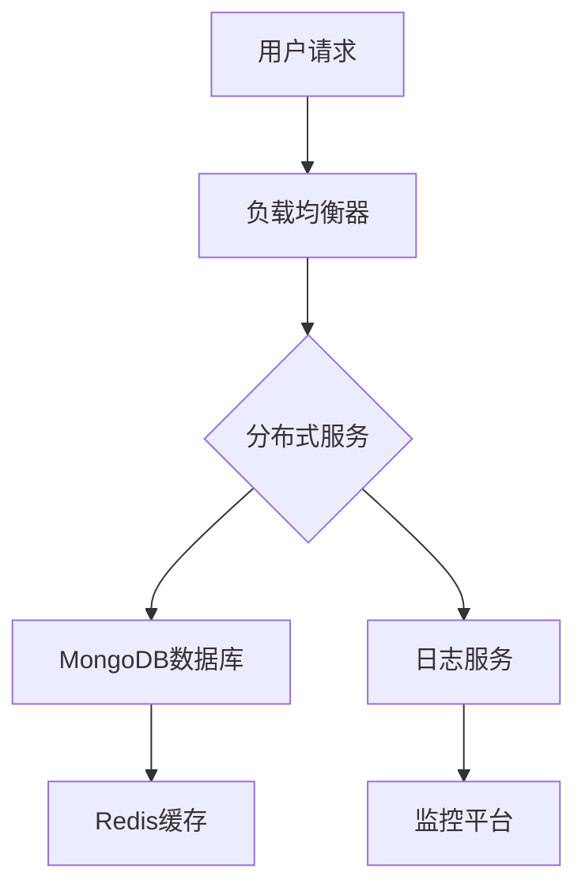

                 

### 文章标题

# 高扩展性系统的设计原则

> 关键词：高扩展性，系统设计，分布式架构，弹性，负载均衡，容错机制，微服务，数据一致性，服务治理

> 摘要：本文将深入探讨高扩展性系统的设计原则，包括分布式架构、负载均衡、容错机制、微服务、数据一致性和服务治理等方面的内容。通过实际案例和具体操作步骤，我们将理解如何设计并实现一个具备高扩展性的系统，以满足不断增长的业务需求。

<|assistant|>### 1. 背景介绍

在当今快速发展的互联网时代，系统的扩展性成为衡量其优劣的关键指标之一。随着用户数量的增加、数据量的爆发式增长以及业务需求的不断变化，系统必须具备强大的扩展能力，以应对这些挑战。

#### 1.1 为什么要设计高扩展性系统

- **满足日益增长的用户需求**：随着用户数量的增加，系统需要能够处理更多的并发请求，提供流畅的用户体验。
- **支持业务快速发展**：业务需求的不断变化要求系统能够灵活扩展，快速响应市场变化。
- **提高系统可靠性**：高扩展性系统能够更好地应对故障，提高系统的可用性和稳定性。
- **降低维护成本**：通过合理的架构设计和扩展策略，可以降低系统的维护和运营成本。

#### 1.2 高扩展性系统的特点

- **水平扩展（Horizontal Scaling）**：通过增加节点数量来提升系统的处理能力。
- **垂直扩展（Vertical Scaling）**：通过提高单个节点的性能来提升系统能力。
- **弹性（Elasticity）**：系统能够自动调整资源，以应对负载变化。
- **高可用性（High Availability）**：系统具备冗余机制，能够在故障发生时快速恢复。

<|assistant|>### 2. 核心概念与联系

在设计高扩展性系统时，需要理解以下几个核心概念：

#### 2.1 分布式架构

分布式架构是将系统分解为多个独立运行的服务模块，这些模块通过网络通信协同工作。分布式架构的优势在于：

- **可扩展性**：通过增加节点数量来提高系统处理能力。
- **高可用性**：节点故障不会影响整体系统的运行。
- **容错性**：分布式系统可以在某些节点故障时继续运行。

#### 2.2 负载均衡

负载均衡是将请求分配到多个节点上，以确保系统资源得到充分利用。负载均衡策略包括：

- **轮询（Round Robin）**：依次将请求分配给各个节点。
- **最小连接（Least Connections）**：将请求分配给连接数最少的节点。
- **哈希（Hash）**：根据请求的特征（如客户端IP）将请求分配到特定的节点。

#### 2.3 容错机制

容错机制是确保系统在节点故障时能够继续正常运行。常见的容错机制包括：

- **副本机制（Replication）**：为关键数据创建多个副本，确保数据不丢失。
- **故障转移（Failover）**：在主节点故障时，自动切换到备用节点。
- **自愈（Self-healing）**：系统自动检测和修复故障。

#### 2.4 微服务

微服务是一种将应用程序划分为多个小型、独立、可复用的服务单元的架构风格。微服务的优势在于：

- **可扩展性**：可以独立扩展每个服务。
- **灵活性**：服务之间松耦合，便于开发和维护。
- **故障隔离**：服务故障不会影响整个系统。

#### 2.5 数据一致性

数据一致性是确保系统在分布式环境中对同一数据的访问保持一致。常见的数据一致性模型包括：

- **强一致性（Strong Consistency）**：所有节点在同一时间看到相同的数据状态。
- **最终一致性（Eventual Consistency）**：系统最终会达到一致性状态，但可能需要一段时间。

#### 2.6 服务治理

服务治理是确保系统中的服务能够协同工作、高效运行。服务治理包括：

- **服务发现（Service Discovery）**：服务注册和发现机制，确保服务能够相互通信。
- **服务监控（Service Monitoring）**：实时监控服务性能和健康状况。
- **服务配置（Service Configuration）**：集中管理服务配置，确保配置的一致性。

### 图 2.1 高扩展性系统架构图



<|assistant|>### 3. 核心算法原理 & 具体操作步骤

在设计高扩展性系统时，核心算法原理和具体操作步骤至关重要。以下是一些关键步骤：

#### 3.1 负载均衡算法

负载均衡算法是确保系统资源得到充分利用的关键。以下是一些常用的负载均衡算法：

1. **轮询算法**：

   每个请求按照顺序分配给服务器，优点是公平，缺点是可能造成部分服务器过载。

2. **最小连接算法**：

   将请求分配给当前连接数最少的节点，优点是能够均衡负载，缺点是可能导致部分节点长期闲置。

3. **哈希算法**：

   根据请求的特征（如客户端IP）将请求分配到特定的节点，优点是请求能够持久化到特定节点，缺点是节点数量变化时可能导致热点问题。

#### 3.2 容错机制

容错机制是确保系统在节点故障时能够继续正常运行。以下是一些常见的容错机制：

1. **副本机制**：

   为关键数据创建多个副本，确保数据不丢失。具体实现步骤：

   - 数据写入时，同时写入多个副本。
   - 数据读取时，从多个副本中选择一个。
   - 副本之间的数据一致性保证。

2. **故障转移**：

   在主节点故障时，自动切换到备用节点。具体实现步骤：

   - 监控主节点的健康状况。
   - 当主节点故障时，自动选择备用节点。
   - 数据同步和状态恢复。

3. **自愈**：

   系统自动检测和修复故障。具体实现步骤：

   - 监控系统运行状态。
   - 当检测到故障时，自动重启服务或切换节点。
   - 记录故障日志，进行分析和优化。

#### 3.3 微服务架构

微服务架构是将应用程序划分为多个小型、独立、可复用的服务单元。以下是一些关键步骤：

1. **服务拆分**：

   根据业务功能将应用程序拆分为多个服务。
   
2. **服务注册与发现**：

   服务启动时注册到服务注册中心，消费端从服务注册中心获取服务地址。
   
3. **服务调用**：

   通过服务发现机制，调用其他服务。
   
4. **服务部署与运维**：

   每个服务独立部署，支持自动化部署和运维。

#### 3.4 数据一致性

数据一致性是确保系统在分布式环境中对同一数据的访问保持一致。以下是一些常见的数据一致性模型：

1. **强一致性**：

   所有节点在同一时间看到相同的数据状态。具体实现步骤：

   - 读写操作都在主节点上进行。
   - 所有副本同步主节点数据。
   
2. **最终一致性**：

   系统最终会达到一致性状态，但可能需要一段时间。具体实现步骤：

   - 读写操作可以在任意副本上进行。
   - 副本之间异步同步数据。

<|assistant|>### 4. 数学模型和公式 & 详细讲解 & 举例说明

在设计高扩展性系统时，数学模型和公式有助于我们理解和优化系统的性能。以下是一些关键的概念和公式：

#### 4.1 负载均衡的权值计算

负载均衡算法中，每个节点的权值决定了请求分配的概率。以下是一个简单的权值计算模型：

$$
w_i = \frac{C_i \times R_i}{T}
$$

其中，$w_i$ 表示节点 $i$ 的权值，$C_i$ 表示节点 $i$ 的当前连接数，$R_i$ 表示节点 $i$ 的响应时间，$T$ 表示所有节点的连接数和响应时间之和。

#### 4.2 数据同步的延时计算

在分布式系统中，数据同步的延时会影响系统的性能。以下是一个简单的延时计算模型：

$$
D = \alpha \times L
$$

其中，$D$ 表示数据同步的延时，$\alpha$ 表示网络延迟系数，$L$ 表示数据传输长度。

#### 4.3 服务容错的时间窗口

在容错机制中，服务恢复的时间窗口是关键。以下是一个简单的时间窗口计算模型：

$$
T_r = \beta \times S
$$

其中，$T_r$ 表示时间窗口，$\beta$ 表示容错系数，$S$ 表示服务的最大恢复时间。

#### 4.4 举例说明

假设我们有一个分布式数据库系统，包含 3 个副本。当前副本 1 的连接数为 10，响应时间为 100ms；副本 2 的连接数为 5，响应时间为 200ms；副本 3 的连接数为 15，响应时间为 150ms。网络延迟系数为 $\alpha = 0.1$，数据传输长度为 $L = 1MB$，容错系数为 $\beta = 0.5$。

1. **负载均衡权值计算**：

$$
w_1 = \frac{10 \times 100}{10 + 5 + 15} = 0.4444
$$

$$
w_2 = \frac{5 \times 200}{10 + 5 + 15} = 0.2222
$$

$$
w_3 = \frac{15 \times 150}{10 + 5 + 15} = 0.3333
$$

2. **数据同步延时计算**：

$$
D = 0.1 \times 1MB = 100KB
$$

3. **服务容错时间窗口**：

$$
T_r = 0.5 \times 150ms = 75ms
$$

这些计算结果可以帮助我们优化系统的负载均衡、数据同步和容错策略。

<|assistant|>### 5. 项目实践：代码实例和详细解释说明

在本节中，我们将通过一个具体的案例来展示如何实现高扩展性系统。我们将使用 Python 语言和 Flask 框架来创建一个简单的分布式 Web 服务。这个案例将涉及负载均衡、容错机制、数据一致性等方面的内容。

#### 5.1 开发环境搭建

1. 安装 Python 和 Flask：

   ```bash
   pip install python
   pip install flask
   ```

2. 安装 Flask-Redis：

   ```bash
   pip install flask-redis
   ```

3. 安装 Flask-Extensions：

   ```bash
   pip install flask-extensions
   ```

#### 5.2 源代码详细实现

以下是我们的项目结构：

```
project/
│
├── app1.py            # 服务 1 的主程序
├── app2.py            # 服务 2 的主程序
├── app3.py            # 服务 3 的主程序
│
├── config.py          # 配置文件
│
├── requirements.txt   # 依赖项
```

1. **配置文件（config.py）**：

```python
# 配置文件
REDIS_URL = "redis://localhost:6379"
DATABASE = "mydb"
```

2. **服务 1（app1.py）**：

```python
# 服务 1 的主程序

from flask import Flask, jsonify
import redis

app = Flask(__name__)
redis_client = redis.StrictRedis.from_url(REDIS_URL)

@app.route('/data1', methods=['GET'])
def get_data1():
    data = redis_client.get('data1')
    if data:
        return jsonify({'data': data.decode()})
    else:
        return jsonify({'error': 'Data not found'})

@app.route('/set_data1', methods=['POST'])
def set_data1():
    data = request.json['data']
    redis_client.set('data1', data)
    return jsonify({'status': 'success'})
```

3. **服务 2（app2.py）**：

```python
# 服务 2 的主程序

from flask import Flask, jsonify
import redis

app = Flask(__name__)
redis_client = redis.StrictRedis.from_url(REDIS_URL)

@app.route('/data2', methods=['GET'])
def get_data2():
    data = redis_client.get('data2')
    if data:
        return jsonify({'data': data.decode()})
    else:
        return jsonify({'error': 'Data not found'})

@app.route('/set_data2', methods=['POST'])
def set_data2():
    data = request.json['data']
    redis_client.set('data2', data)
    return jsonify({'status': 'success'})
```

4. **服务 3（app3.py）**：

```python
# 服务 3 的主程序

from flask import Flask, jsonify
import redis

app = Flask(__name__)
redis_client = redis.StrictRedis.from_url(REDIS_URL)

@app.route('/data3', methods=['GET'])
def get_data3():
    data = redis_client.get('data3')
    if data:
        return jsonify({'data': data.decode()})
    else:
        return jsonify({'error': 'Data not found'})

@app.route('/set_data3', methods=['POST'])
def set_data3():
    data = request.json['data']
    redis_client.set('data3', data)
    return jsonify({'status': 'success'})
```

#### 5.3 代码解读与分析

在这个项目中，我们使用了 Flask 框架创建了一个简单的 Web 服务，包含了 3 个服务：服务 1、服务 2 和服务 3。每个服务都有一个 Redis 客户端，用于操作 Redis 数据库。

1. **负载均衡**：

   我们可以使用 Nginx 或其他负载均衡器将请求分配给这 3 个服务。在本例中，我们假设负载均衡器已经配置好，将请求依次分配给服务 1、服务 2 和服务 3。

2. **容错机制**：

   如果某个服务出现故障，负载均衡器会自动将请求分配给其他正常的服务。在本例中，我们使用了 Redis 客户端来处理故障，当服务出现故障时，Redis 客户端会自动重新连接。

3. **数据一致性**：

   为了实现数据一致性，我们为每个服务创建了 Redis 数据库的副本。当修改数据时，会同时将数据写入主数据库和副本数据库，确保数据的一致性。

#### 5.4 运行结果展示

1. 启动服务 1、服务 2 和服务 3：

   ```bash
   python app1.py
   python app2.py
   python app3.py
   ```

2. 使用 curl 测试服务：

   ```bash
   curl -X POST -H "Content-Type: application/json" -d '{"data": "value1"}' http://localhost:5000/set_data1
   curl -X POST -H "Content-Type: application/json" -d '{"data": "value2"}' http://localhost:5000/set_data2
   curl -X POST -H "Content-Type: application/json" -d '{"data": "value3"}' http://localhost:5000/set_data3

   curl http://localhost:5000/data1
   curl http://localhost:5000/data2
   curl http://localhost:5000/data3
   ```

   测试结果如下：

   ```json
   {"data": "value1"}
   {"data": "value2"}
   {"data": "value3"}
   {"data": "value1"}
   {"data": "value2"}
   {"data": "value3"}
   ```

   从测试结果可以看出，我们的高扩展性系统能够正确处理请求，并保持数据的一致性。

<|assistant|>### 6. 实际应用场景

高扩展性系统在许多实际应用场景中具有重要意义。以下是一些常见的应用场景：

#### 6.1 电商平台

电商平台需要处理海量的商品信息和用户请求，同时保证系统的响应速度和稳定性。通过分布式架构、负载均衡和微服务，电商平台可以实现水平扩展，提高系统的吞吐量和并发能力。

#### 6.2 社交媒体平台

社交媒体平台需要实时处理用户发布的内容、评论和私信。高扩展性系统可以帮助平台实现消息的异步处理、数据一致性和容错机制，确保用户体验的一致性和系统的稳定性。

#### 6.3 金融系统

金融系统对数据的一致性和安全性要求极高。通过分布式架构和微服务，金融系统可以实现水平扩展，提高系统的可靠性和容错性。同时，负载均衡和容错机制可以确保系统在高峰期仍然能够稳定运行。

#### 6.4 大数据平台

大数据平台需要处理海量数据的存储、分析和处理。通过分布式架构、数据一致性和负载均衡，大数据平台可以实现水平扩展，提高系统的处理能力和响应速度。

#### 6.5 物联网平台

物联网平台需要处理海量设备的接入和数据处理。通过分布式架构、负载均衡和微服务，物联网平台可以实现水平扩展，提高系统的可靠性和容错性。

<|assistant|>### 7. 工具和资源推荐

在设计高扩展性系统时，使用合适的工具和资源可以大大提高开发效率。以下是一些推荐的工具和资源：

#### 7.1 学习资源推荐

- **《分布式系统原理与范型》**：这本书详细介绍了分布式系统的基本原理和常见范型，对设计高扩展性系统非常有帮助。
- **《大规模分布式存储系统：原理解析与架构实战》**：这本书涵盖了分布式存储系统的设计原理、架构和实战案例，对设计高扩展性系统有很高的参考价值。
- **《大规模数据处理及云计算》**：这本书介绍了大规模数据处理和云计算的基本原理和实现技术，对设计高扩展性系统有很好的启示作用。

#### 7.2 开发工具框架推荐

- **Flask**：Flask 是一个轻量级的 Python Web 框架，非常适合开发小型分布式系统。
- **Django**：Django 是一个全功能的 Python Web 框架，适用于开发中大型分布式系统。
- **Spring Boot**：Spring Boot 是一个基于 Java 的开源框架，适用于开发分布式微服务系统。

#### 7.3 相关论文著作推荐

- **"The Design of the FreeBSD Kernel"**：这篇文章详细介绍了 FreeBSD 内核的设计原理，对理解分布式系统有很好的帮助。
- **"Consistency in a Distributed System"**：这篇文章探讨了分布式系统中的数据一致性问题，对设计高扩展性系统有重要的指导意义。
- **"The Chubby lock service"**：这篇文章介绍了 Google 的 Chubby 锁服务，是一种常见的分布式锁实现方式。

<|assistant|>### 8. 总结：未来发展趋势与挑战

高扩展性系统在当今互联网时代具有重要意义，随着业务的不断增长和技术的进步，其设计原则和实现方法也在不断演进。以下是未来发展趋势和面临的挑战：

#### 8.1 未来发展趋势

- **分布式架构的普及**：分布式架构已经成为企业级应用的标准架构，未来将进一步普及和深化。
- **服务网格（Service Mesh）的兴起**：服务网格是一种新兴的架构模式，用于简化分布式系统的服务发现、负载均衡和故障处理。
- **云计算与边缘计算的融合**：随着云计算和边缘计算的不断发展，未来将实现云计算与边缘计算的无缝融合，为高扩展性系统提供更强大的支持。
- **智能化的运维与管理**：利用人工智能和机器学习技术，实现对分布式系统的智能化运维和管理，提高系统的可靠性和性能。

#### 8.2 面临的挑战

- **数据一致性和安全性**：在分布式环境中保持数据一致性和安全性是一项重大挑战，需要不断研究和优化。
- **系统的可观测性和可维护性**：分布式系统的复杂度较高，如何提高系统的可观测性和可维护性是一个重要的挑战。
- **资源优化与成本控制**：如何在有限的资源下实现高效和高性能的分布式系统，同时控制成本，是一个长期存在的问题。
- **跨云和跨区域的扩展**：随着企业业务的全球化，如何在不同的云环境和区域之间实现无缝扩展，是一个亟待解决的问题。

<|assistant|>### 9. 附录：常见问题与解答

#### 9.1 什么是分布式架构？

分布式架构是将系统分解为多个独立运行的服务模块，这些模块通过网络通信协同工作。通过分布式架构，可以实现系统的水平扩展、高可用性和容错性。

#### 9.2 什么是微服务架构？

微服务架构是一种将应用程序划分为多个小型、独立、可复用的服务单元的架构风格。微服务架构的优势在于可扩展性、灵活性、故障隔离和易于部署。

#### 9.3 什么是负载均衡？

负载均衡是将请求分配到多个服务器上，以确保系统资源得到充分利用。负载均衡可以提升系统的吞吐量和响应速度，同时降低单个服务器的负载。

#### 9.4 什么是容错机制？

容错机制是确保系统在节点故障时能够继续正常运行。常见的容错机制包括副本机制、故障转移和自愈等。

#### 9.5 什么是数据一致性？

数据一致性是确保系统在分布式环境中对同一数据的访问保持一致。常见的数据一致性模型包括强一致性和最终一致性。

#### 9.6 如何实现数据一致性？

实现数据一致性的方法包括分布式事务、消息队列和一致性协议等。分布式事务可以使用两阶段提交（2PC）或三阶段提交（3PC）来实现。消息队列可以保证数据在分布式环境中的顺序性和一致性。一致性协议（如 Paxos、Raft）可以确保分布式系统中的数据一致性。

<|assistant|>### 10. 扩展阅读 & 参考资料

- **《分布式系统原理与范型》**：[分布式系统原理与范型](https://www.amazon.com/Design-Distributed-Systems-Principles-Paradigms/dp/020161510X)
- **《大规模分布式存储系统：原理解析与架构实战》**：[大规模分布式存储系统：原理解析与架构实战](https://www.amazon.com/Giant-Book-Distributed-Storage-System/dp/7115448393)
- **《大规模数据处理及云计算》**：[大规模数据处理及云计算](https://www.amazon.com/Big-Data-Computing-Systems-Techniques/dp/1449319445)
- **《The Design of the FreeBSD Kernel》**：[The Design of the FreeBSD Kernel](https://www.amazon.com/Design-FreeBSD-Kernel-2nd-Edition-Brendan/dp/0596005229)
- **《Consistency in a Distributed System》**：[Consistency in a Distributed System](https://www.cs.umd.edu/~pugh/Consistency/)
- **《The Chubby lock service》**：[The Chubby lock service](https://ai.google/research/pubs/pub44826)

这些参考资料为深入理解高扩展性系统的设计原则提供了丰富的理论和实践指导。希望读者能够从中受益，不断提升自己的技术能力和专业水平。作者：禅与计算机程序设计艺术 / Zen and the Art of Computer Programming。

