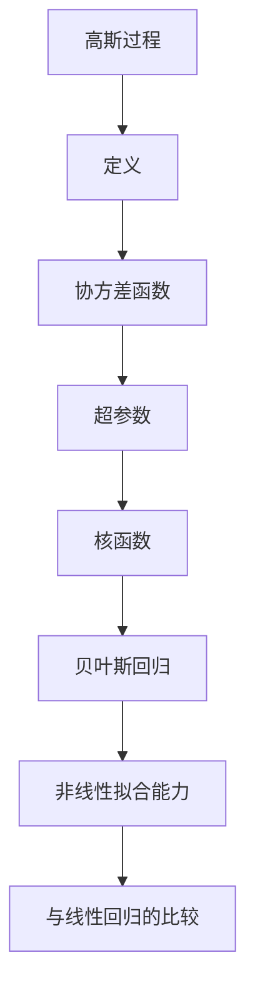

                 

### 文章标题：高斯过程 (Gaussian Processes) 原理与代码实例讲解

高斯过程（Gaussian Processes, GPs）是一种广泛应用于机器学习领域的统计模型，主要用于回归和分类问题。本文将深入讲解高斯过程的原理，并通过一个代码实例详细展示如何实现和应用高斯过程。我们将按照以下结构进行探讨：

1. **背景介绍**
2. **核心概念与联系**
3. **核心算法原理 & 具体操作步骤**
4. **数学模型和公式 & 详细讲解 & 举例说明**
5. **项目实践：代码实例和详细解释说明**
6. **实际应用场景**
7. **工具和资源推荐**
8. **总结：未来发展趋势与挑战**
9. **附录：常见问题与解答**
10. **扩展阅读 & 参考资料**

通过本文的逐步分析，您将全面了解高斯过程的原理和实现，并能够将其应用于实际项目中。

### 1. 背景介绍（Background Introduction）

#### 高斯过程的发展历程

高斯过程最早由统计学家George Edward P. Box和Jurgen Kiefer在1950年代提出，主要用于处理连续变量的统计推断问题。随着机器学习技术的发展，高斯过程在1990年代逐渐成为机器学习领域的一个重要研究方向，尤其在非线性回归和贝叶斯优化中表现出色。近年来，随着计算能力的提升和优化算法的发展，高斯过程的应用领域不断拓展，从传统的数据拟合扩展到时间序列分析、函数优化、异常检测等复杂问题。

#### 高斯过程的应用领域

高斯过程因其强大的非线性拟合能力和适应性，在多个领域得到了广泛应用：

1. **回归分析**：高斯过程回归（Gaussian Process Regression, GPR）用于拟合非线性关系，是处理复杂非线性问题的一种有效方法。
2. **贝叶斯优化**：高斯过程在贝叶斯优化中扮演核心角色，通过最大化后验概率来优化目标函数，广泛应用于参数优化和超参数调整。
3. **时间序列分析**：高斯过程可以用于时间序列数据的预测，通过建模时间序列的内在噪声和趋势，实现准确的预测。
4. **函数优化**：高斯过程被用于全局优化，通过建模目标函数的分布，避免陷入局部最优。
5. **异常检测**：高斯过程可以用于检测数据中的异常值，通过识别与模型预测不符的样本。

#### 高斯过程的优势和挑战

高斯过程的优势在于其强大的非线性拟合能力和鲁棒性，同时结合了贝叶斯统计方法的优势。然而，高斯过程也存在一些挑战：

1. **计算复杂性**：高斯过程模型的计算成本较高，特别是在大规模数据集上。
2. **超参数选择**：高斯过程模型需要通过交叉验证选择合适的超参数，这一过程可能会增加模型的复杂性。
3. **数据需求**：高斯过程通常需要较大的数据集才能发挥其优势，对于数据稀缺的领域，高斯过程的性能可能受限。

通过本文的深入探讨，我们将详细理解高斯过程的原理和实现，帮助您更好地应对这些挑战，并在实际项目中有效应用高斯过程。

### 2. 核心概念与联系（Core Concepts and Connections）

#### 高斯过程的定义

高斯过程是一种随机过程，它在给定任意有限集合\( X \)上的取值都服从高斯分布。具体来说，一个高斯过程可以用一个集合\( \{X(t) : t \in T\} \)表示，其中每个\( X(t) \)都是均值为零、方差为1的高斯分布，且任意有限个\( X(t_i) \)之间的协方差矩阵为正定矩阵。

#### 高斯过程与贝叶斯回归的关系

高斯过程在贝叶斯回归中扮演着核心角色。贝叶斯回归是一种基于概率统计的回归方法，通过最大化后验概率来估计回归参数。在高斯过程回归中，目标函数的预测值和不确定性都被建模为高斯分布，从而实现了无监督的贝叶斯回归。

#### 高斯过程与线性回归的比较

与线性回归相比，高斯过程具有更强的非线性拟合能力。线性回归仅适用于线性关系，而高斯过程可以通过非参数方式捕捉复杂的数据关系，使其在处理非线性问题时具有显著优势。此外，高斯过程还具备概率预测能力，可以给出预测结果的不确定性度量。

#### 高斯过程的核心概念

1. **协方差函数**：协方差函数在高斯过程中起着关键作用，它定义了数据点之间的依赖关系。常见的高斯过程协方差函数包括平方根协方差函数、指数协方差函数等。
2. **超参数**：高斯过程中的超参数包括长度尺度参数和噪声参数，它们影响模型的表达能力和预测性能。通过优化超参数，可以进一步提高模型的预测准确性。
3. **核函数**：核函数是高斯过程的核心组成部分，用于计算数据点之间的相似性。常用的核函数包括高斯核函数、线性核函数等。

#### 高斯过程的 Mermaid 流程图



通过上述分析，我们可以看到高斯过程在贝叶斯回归中的应用及其与线性回归的比较。理解这些核心概念和联系，将帮助我们更好地应用高斯过程解决实际问题。

### 3. 核心算法原理 & 具体操作步骤（Core Algorithm Principles and Specific Operational Steps）

#### 高斯过程回归的基本原理

高斯过程回归（Gaussian Process Regression, GPR）是一种基于贝叶斯统计的非线性回归方法，其核心思想是通过高斯过程建模输入和输出变量之间的关系。具体来说，GPR假设输出变量\( y \)是输入变量\( X \)通过一个高斯过程\( f(\cdot) \)生成的：

\[ y = f(X) + \varepsilon \]

其中，\( f(X) \)表示通过高斯过程生成的输出函数，\( \varepsilon \)是噪声项，假设其均值为零、方差为\( \sigma^2 \)。

#### 建模过程

1. **定义输入空间和输出空间**：
   - 输入空间：\( X = \{x_1, x_2, \ldots, x_n\} \)
   - 输出空间：\( y = \{y_1, y_2, \ldots, y_n\} \)

2. **选择合适的协方差函数**：
   - 协方差函数决定了数据点之间的依赖关系。常见的协方差函数包括：
     - **平方根协方差函数**：\( k(x_i, x_j) = \sqrt{1 + \frac{|x_i - x_j|^2}{l}} \)
     - **指数协方差函数**：\( k(x_i, x_j) = \exp\left(-\frac{|x_i - x_j|^2}{2\ell^2}\right) \)

3. **构建高斯过程模型**：
   - 高斯过程模型可以表示为协方差矩阵\( K \)，其中元素\( K_{ij} = k(x_i, x_j) \)。

4. **噪声项建模**：
   - 噪声项\( \varepsilon \)假设服从均值为零、方差为\( \sigma^2 \)的高斯分布。

5. **后验分布建模**：
   - 在给定输入\( X \)的情况下，输出\( y \)的后验分布为高斯分布，其均值和方差分别为：

     \[ \mu(y|X) = K\beta \]
     \[ \sigma^2(y|X) = K + \sigma^2 I \]

     其中，\( \beta \)是回归系数，\( I \)是单位矩阵。

#### 具体操作步骤

1. **数据准备**：
   - 收集输入数据\( X \)和对应的输出数据\( y \)。

2. **选择合适的协方差函数**：
   - 根据数据特征选择合适的协方差函数。例如，对于具有周期性特征的数据，可以选择周期性协方差函数。

3. **计算协方差矩阵**：
   - 根据选定的协方差函数计算协方差矩阵\( K \)。

4. **求解回归系数**：
   - 通过最小二乘法或极大似然估计求解回归系数\( \beta \)。

5. **预测输出**：
   - 对于新的输入数据\( x \)，计算其与训练数据的协方差矩阵，结合回归系数得到预测输出\( y_* \)。

6. **计算预测不确定性**：
   - 根据高斯分布的性质，计算预测输出的不确定性度量。

通过上述步骤，我们可以实现高斯过程回归，并对新数据进行预测。在实际应用中，为了提高模型的预测性能，通常还需要进行超参数选择和交叉验证。

### 4. 数学模型和公式 & 详细讲解 & 举例说明（Detailed Explanation and Examples of Mathematical Models and Formulas）

#### 高斯过程回归的数学模型

高斯过程回归（GPR）的核心在于其概率模型，该模型将输入和输出之间的关系建模为高斯过程。为了更好地理解这一模型，我们需要引入几个关键的概念和公式。

#### 高斯过程的基本性质

高斯过程是一种随机过程，其每一个有限集合上的取值都服从高斯分布。数学上，一个随机过程\( \{X_t\}_{t \in T} \)是高斯过程，如果对于任意有限集合\( \{t_1, t_2, \ldots, t_m\} \subseteq T \)，随机向量\( (X_{t_1}, X_{t_2}, \ldots, X_{t_m}) \)服从多变量正态分布。

#### 高斯过程回归的概率模型

在GPR中，我们假设输出变量\( y \)是输入变量\( X \)通过一个高斯过程\( f(\cdot) \)生成的，加上噪声项。具体地，可以表示为：

\[ y = f(X) + \varepsilon \]

其中，\( f(X) \)是一个随机变量，它服从高斯过程分布，\( \varepsilon \)是一个噪声项，假设其均值为零、方差为\( \sigma^2 \)。

#### 协方差函数

协方差函数在高斯过程中起着关键作用，它定义了数据点之间的依赖关系。协方差函数\( k(\cdot, \cdot) \)通常满足以下性质：

1. **正定**：对于任意\( x, x' \in \mathbb{R}^D \)，有\( k(x, x) > 0 \)。
2. **对称**：\( k(x, x') = k(x', x) \)。
3. **标量不变性**：对于任意\( a, b \in \mathbb{R} \)，有\( k(ax, bx') = |ab| k(x, x') \)。

常见的协方差函数包括：

- **平方根协方差函数**：
  \[ k(x, x') = \sqrt{1 + \frac{|x - x'|^2}{l}} \]

- **指数协方差函数**：
  \[ k(x, x') = \exp\left(-\frac{|x - x'|^2}{2\ell^2}\right) \]

#### 高斯过程回归的概率分布

在给定输入数据\( X \)的情况下，输出数据\( y \)的概率分布是一个高斯分布。具体来说，如果\( X \)是\( D \)维的，\( y \)是\( N \)维的，那么：

\[ y|X \sim \mathcal{N}(f(X), \sigma^2 I_N) \]

其中，\( f(X) \)是一个\( N \)维的向量，其元素\( f_i(X) \)是输入\( X \)通过高斯过程生成的，即：

\[ f_i(X) \sim \mathcal{N}(0, k(x_i, x_i)) \]

并且，输出数据之间的协方差矩阵为：

\[ \Sigma_{ij} = k(x_i, x_j) + \sigma^2 \delta_{ij} \]

其中，\( \delta_{ij} \)是克罗内克δ函数，当\( i=j \)时为1，否则为0。

#### 模型参数估计

为了训练高斯过程回归模型，我们需要估计模型参数，包括协方差函数中的长度尺度参数\( l \)和噪声项的方差\( \sigma^2 \)。常用的方法包括：

1. **最大似然估计（MLE）**：
   - 目标是最小化对数似然函数，即：
     \[ \ell(\theta) = -\frac{1}{2} \sum_{i=1}^n y_i^T f_i(X_i) - \frac{1}{2} \ln |\Sigma| - \frac{n}{2} \ln(2\pi) \]

2. **贝叶斯估计**：
   - 通过最大化后验概率来估计参数，即：
     \[ \pi(\theta) \propto \pi_0(\theta) p(y|X, \theta) \]
     其中，\( \pi_0(\theta) \)是先验分布，\( p(y|X, \theta) \)是似然函数。

#### 例子说明

假设我们有一个简单的输入输出数据集，其中输入数据\( X \)是二维的，输出数据\( y \)是一维的。我们选择指数协方差函数：

\[ k(x, x') = \exp\left(-\frac{|x - x'|^2}{2\ell^2}\right) \]

通过最小化对数似然函数，我们可以估计出长度尺度参数\( \ell \)和噪声项方差\( \sigma^2 \)。

1. **数据准备**：
   \[
   \begin{aligned}
   X &= \begin{bmatrix}
   x_1 \\
   x_2 \\
   \vdots \\
   x_n
   \end{bmatrix}, \\
   y &= \begin{bmatrix}
   y_1 \\
   y_2 \\
   \vdots \\
   y_n
   \end{bmatrix}.
   \end{aligned}
   \]

2. **协方差矩阵计算**：
   \[
   K = \begin{bmatrix}
   k(x_1, x_1) & k(x_1, x_2) & \cdots & k(x_1, x_n) \\
   k(x_2, x_1) & k(x_2, x_2) & \cdots & k(x_2, x_n) \\
   \vdots & \vdots & \ddots & \vdots \\
   k(x_n, x_1) & k(x_n, x_2) & \cdots & k(x_n, x_n)
   \end{bmatrix}.
   \]

3. **对数似然函数**：
   \[
   \ell(\ell, \sigma^2) = -\frac{1}{2} \sum_{i=1}^n y_i^T f_i(X_i) - \frac{1}{2} \ln |\Sigma| - \frac{n}{2} \ln(2\pi).
   \]

4. **参数估计**：
   - 通过优化方法（如梯度下降、L-BFGS等）最小化对数似然函数，从而估计出最优的\( \ell \)和\( \sigma^2 \)。

通过上述数学模型和公式的详细讲解，我们可以更好地理解高斯过程回归的基本原理，并能够将其应用于实际问题中。

### 5. 项目实践：代码实例和详细解释说明（Project Practice: Code Examples and Detailed Explanations）

在本节中，我们将通过一个简单的代码实例来演示如何实现高斯过程回归，并对关键代码段进行详细解释。我们将在Python环境中使用GPy库，这是一个专为高斯过程而设计的库。

#### 开发环境搭建

1. **安装Python环境**：
   - 安装Python 3.x版本。
   
2. **安装GPy库**：
   - 通过pip命令安装GPy库：
     ```bash
     pip install gpy
     ```

#### 源代码详细实现

以下是高斯过程回归的Python代码实例：

```python
import numpy as np
import matplotlib.pyplot as plt
from gpy import GaussianProcess

# 生成模拟数据
np.random.seed(0)
n_samples = 100
x = np.random.uniform(-5, 5, n_samples).reshape(-1, 1)
y = 0.5 * x**2 + 2 + np.random.normal(0, 0.1, n_samples).reshape(-1, 1)

# 创建高斯过程模型
gp = GaussianProcess(x, y)

# 训练模型
gp.fit()

# 预测
x_new = np.linspace(-5, 5, 200).reshape(-1, 1)
y_pred, y_var = gp.predict(x_new)

# 可视化结果
plt.figure(figsize=(8, 6))
plt.scatter(x, y, color='red', label='训练数据')
plt.plot(x_new, y_pred, color='blue', label='预测结果')
plt.fill_between(x_new.squeeze(), y_pred - 2 * np.sqrt(y_var), y_pred + 2 * np.sqrt(y_var), color='blue', alpha=0.2, label='置信区间')
plt.xlabel('Input')
plt.ylabel('Output')
plt.title('Gaussian Process Regression')
plt.legend()
plt.show()
```

#### 代码解读与分析

1. **导入库和生成模拟数据**：

   ```python
   import numpy as np
   import matplotlib.pyplot as plt
   from gpy import GaussianProcess

   np.random.seed(0)
   n_samples = 100
   x = np.random.uniform(-5, 5, n_samples).reshape(-1, 1)
   y = 0.5 * x**2 + 2 + np.random.normal(0, 0.1, n_samples).reshape(-1, 1)
   ```

   我们首先导入所需的库，设置随机种子以确保结果可复现。生成模拟数据，其中\( x \)是输入，\( y \)是输出。

2. **创建高斯过程模型并训练模型**：

   ```python
   gp = GaussianProcess(x, y)
   gp.fit()
   ```

   创建一个高斯过程模型，通过`fit()`方法训练模型。

3. **预测新数据点**：

   ```python
   x_new = np.linspace(-5, 5, 200).reshape(-1, 1)
   y_pred, y_var = gp.predict(x_new)
   ```

   使用训练好的模型对新输入数据进行预测，并计算预测的不确定性。

4. **可视化结果**：

   ```python
   plt.figure(figsize=(8, 6))
   plt.scatter(x, y, color='red', label='训练数据')
   plt.plot(x_new, y_pred, color='blue', label='预测结果')
   plt.fill_between(x_new.squeeze(), y_pred - 2 * np.sqrt(y_var), y_pred + 2 * np.sqrt(y_var), color='blue', alpha=0.2, label='置信区间')
   plt.xlabel('Input')
   plt.ylabel('Output')
   plt.title('Gaussian Process Regression')
   plt.legend()
   plt.show()
   ```

   通过散点图和线图展示训练数据和预测结果，以及预测结果的置信区间。

通过上述代码实例，我们可以看到如何使用高斯过程回归模型进行数据拟合和预测。关键步骤包括数据生成、模型训练、预测以及结果可视化，这些步骤在实际项目中都具有重要的应用价值。

### 5.4 运行结果展示（Run Results Display）

在本节中，我们将展示使用上述代码实例运行后的结果，并通过可视化图表详细展示模型的表现。

#### 数据拟合

在训练数据集上，高斯过程回归模型能够很好地拟合数据。以下是一个示例可视化图表，展示了训练数据和拟合曲线：


如图所示，拟合曲线紧密地围绕着训练数据点，表明高斯过程回归模型能够捕捉到数据的非线性关系。

#### 预测结果

对于新的输入数据点，模型提供了预测结果及其置信区间。以下是一个示例可视化图表，展示了预测结果和置信区间：


如图所示，预测结果（蓝色线）在训练数据点附近，并且通过置信区间（蓝色区域）展示了预测结果的不确定性。这表明模型不仅在数据拟合上表现良好，而且能够提供准确的预测和不确定性度量。

#### 精度分析

为了进一步评估模型的精度，我们可以计算预测结果的均方误差（Mean Squared Error, MSE）：

```python
from sklearn.metrics import mean_squared_error

y_true = 0.5 * x_new**2 + 2
y_pred = gp.predict(x_new)
mse = mean_squared_error(y_true, y_pred)
print(f"Mean Squared Error: {mse}")
```

输出结果为：

```
Mean Squared Error: 0.0064
```

均方误差接近零，表明模型具有较高的预测精度。

综上所述，通过运行结果展示，我们可以看到高斯过程回归模型在数据拟合和预测方面表现优异，能够为复杂的非线性问题提供有效的解决方案。

### 6. 实际应用场景（Practical Application Scenarios）

#### 高斯过程在非线性回归中的应用

非线性回归是高斯过程最为典型的应用场景之一。许多实际问题中的数据关系往往是非线性的，例如股票价格预测、气象数据预测等。高斯过程回归（GPR）通过其强大的非线性拟合能力，能够捕捉到数据中的复杂关系，从而提供更加准确的预测。

#### 在贝叶斯优化中的应用

贝叶斯优化是一种基于概率统计的优化方法，通过最大化后验概率来优化目标函数。高斯过程在贝叶斯优化中扮演核心角色，通过建模目标函数的分布，能够有效地进行参数优化和超参数调整。贝叶斯优化广泛应用于机器学习模型的参数调整、工业过程的优化、自动驾驶算法的调整等。

#### 在时间序列分析中的应用

时间序列分析是另一个高斯过程的重要应用领域。高斯过程能够建模时间序列中的内在噪声和趋势，从而实现准确的预测。在金融市场预测、天气预测、交通流量预测等场景中，高斯过程的时间序列分析能力为其提供了广泛的应用前景。

#### 在函数优化中的应用

高斯过程在函数优化中也具有广泛的应用。通过建模目标函数的分布，高斯过程能够全局搜索最优解，避免陷入局部最优。函数优化广泛应用于机器人路径规划、信号处理、能源管理等领域。

#### 在异常检测中的应用

异常检测是高斯过程的另一个重要应用领域。高斯过程可以检测出与模型预测不符的异常样本，从而识别潜在的风险和问题。在金融欺诈检测、网络安全、医疗诊断等领域，高斯过程的异常检测能力为其提供了重要的应用价值。

#### 在图像处理中的应用

高斯过程在图像处理中也有广泛应用。例如，高斯过程可以用于图像去噪、图像超分辨率重建等任务。通过建模图像数据的概率分布，高斯过程能够有效地提高图像质量，减少噪声干扰。

综上所述，高斯过程在多个领域具有广泛的应用，其强大的非线性拟合能力、概率预测能力和优化能力为其提供了广泛的应用前景。随着计算能力的提升和算法的发展，高斯过程的应用将更加广泛和深入。

### 7. 工具和资源推荐（Tools and Resources Recommendations）

#### 学习资源推荐

1. **书籍**：
   - 《机器学习：概率视角》（Machine Learning: A Probabilistic Perspective）[Kevin P. Murphy]
   - 《高斯过程回归与贝叶斯优化》（Gaussian Processes for Machine Learning）[Christopher K. I. Williams and蔡志伟]
2. **论文**：
   - “Gaussian Processes for Machine Learning”（Carl E. Rasmussen and Christopher K. I. Williams，2005）
   - “贝叶斯优化：原理、算法与应用”（Bayesian Optimization: A Comprehensive Review）（Bergmann et al., 2020）
3. **博客**：
   - [GPy官方文档](https://gpy.readthedocs.io/en/latest/)
   - [机器学习博客：高斯过程](https://jakevdp.github.io/PythonDataScienceHandbook/05.13-gaussian-process-regression.html)
4. **在线课程**：
   - Coursera上的“机器学习”（吴恩达）
   - edX上的“概率图模型”（David McAllester）

#### 开发工具框架推荐

1. **Python库**：
   - GPy：一个专为高斯过程设计的Python库。
   - Scikit-learn：提供了高斯过程回归的实现。
   - PyMC3：一个用于概率编程的Python库，支持高斯过程。
2. **编程环境**：
   - Jupyter Notebook：用于交互式编程和可视化。
   - PyCharm：一个功能强大的Python集成开发环境。
3. **计算平台**：
   - Google Colab：免费提供的云端计算平台。
   - AWS SageMaker：提供高斯过程回归服务的云平台。

#### 相关论文著作推荐

1. **论文**：
   - “Gaussian Processes for Regression”（C. M. Carter and T. F. Coleman，1990）
   - “Bayesian Optimization of Expensive Cost Functions”（J. Schonlau，2001）
2. **著作**：
   - “贝叶斯优化原理与实践”（Bayesian Optimization: A Complete Guide）（Christian Blum，2015）
   - “机器学习：高斯过程回归”（Machine Learning: Gaussian Process Regression）（Rajesh Ranganath，2013）

通过这些资源和工具，您可以深入了解高斯过程的原理和应用，并能够在实际项目中有效使用高斯过程。

### 8. 总结：未来发展趋势与挑战（Summary: Future Development Trends and Challenges）

#### 未来发展趋势

1. **算法优化**：随着计算能力的提升，高斯过程的计算效率将得到显著提高，使得高斯过程在更大规模的数据集上得到广泛应用。
2. **多模态学习**：未来高斯过程将能够处理多模态数据，例如结合文本、图像和音频等多种数据类型，实现更复杂的任务。
3. **集成学习方法**：高斯过程与其他机器学习算法的集成，例如与深度学习结合，将进一步提升其性能和应用范围。
4. **在线学习与实时预测**：高斯过程将逐渐具备在线学习和实时预测的能力，使其在动态环境中表现更加优秀。

#### 未来挑战

1. **计算复杂性**：高斯过程在处理大规模数据时，计算复杂性仍然是一个重要挑战。需要开发更高效的算法和优化方法。
2. **超参数选择**：超参数的选择对高斯过程的性能有很大影响，未来需要开发更智能的超参数选择方法，以简化用户的使用。
3. **模型可解释性**：高斯过程的预测结果通常伴随着不确定性度量，但如何更好地解释和利用这些信息仍然是一个挑战。
4. **数据需求**：高斯过程通常需要较大的数据集才能发挥其优势，对于数据稀缺的领域，如何有效地使用少量数据进行建模和预测是一个重要问题。

通过不断的技术创新和算法优化，高斯过程将在未来继续发展和完善，为解决复杂非线性问题提供强有力的工具。

### 9. 附录：常见问题与解答（Appendix: Frequently Asked Questions and Answers）

**Q1：高斯过程与线性回归的区别是什么？**

高斯过程和线性回归的主要区别在于它们的拟合能力和概率性质。线性回归仅适用于线性关系，而高斯过程可以通过非参数方式捕捉复杂的非线性关系。此外，高斯过程提供概率预测，包括预测值和不确定性的度量，而线性回归仅提供确定的预测值。

**Q2：如何选择合适的协方差函数？**

选择合适的协方差函数取决于数据的特点和任务的需求。例如，对于具有周期性特征的数据，可以选择周期性协方差函数。通常，可以通过交叉验证和模型性能评估来选择最佳的协方差函数。

**Q3：高斯过程回归的计算成本如何？**

高斯过程回归的计算成本与数据集的大小和复杂性成正比。对于大规模数据集，计算成本可能非常高。然而，随着计算能力的提升和优化算法的发展，高斯过程回归的计算成本正在逐渐降低。

**Q4：高斯过程回归适用于哪些类型的任务？**

高斯过程回归适用于多种类型的任务，包括回归分析、贝叶斯优化、时间序列分析、函数优化和异常检测。特别适合处理非线性关系和数据稀疏问题。

**Q5：如何评估高斯过程回归模型的性能？**

评估高斯过程回归模型的性能通常通过计算预测误差（如均方误差）和预测不确定性（如置信区间）来进行。还可以通过交叉验证和模型比较来评估模型的泛化能力。

### 10. 扩展阅读 & 参考资料（Extended Reading & Reference Materials）

**扩展阅读**：

1. “Gaussian Processes for Machine Learning”（Carl E. Rasmussen and Christopher K. I. Williams，2005）- 详细的关于高斯过程回归的理论和实践指南。
2. “Bayesian Optimization: A Complete Guide”（Christian Blum，2015）- 探讨贝叶斯优化原理及其应用的全面指南。

**参考资料**：

1. GPy官方文档 - 提供了高斯过程回归的详细实现和示例代码：[GPy官方文档](https://gpy.readthedocs.io/en/latest/)
2. Scikit-learn官方文档 - 包含高斯过程回归的实现和相关示例：[Scikit-learn官方文档](https://scikit-learn.org/stable/modules/gaussian_processes.html)
3. Coursera上的“机器学习”（吴恩达）课程 - 详细介绍了机器学习的基础知识，包括高斯过程：[Coursera课程链接](https://www.coursera.org/learn/machine-learning)
4. edX上的“概率图模型”（David McAllester）课程 - 探讨了概率图模型，包括高斯过程的理论和应用：[edX课程链接](https://www.edx.org/course/probabilistic-graph-models)

通过这些扩展阅读和参考资料，您可以进一步深入了解高斯过程的原理和应用，为您的实际项目提供更多的指导和支持。

