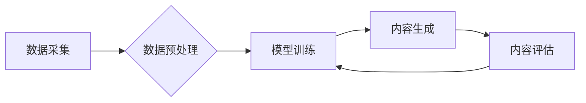

> AIGC, 生成式AI, 应用层, 金矿, 泡沫, 未来趋势, 价值创造

## 1. 背景介绍

近年来，人工智能（AI）技术突飞猛进，特别是生成式人工智能（AIGC）的兴起，引发了广泛的关注和热议。从ChatGPT的爆火到DALL-E 2的惊艳表现，AIGC展现出强大的内容创作能力，让人们对未来充满了期待。然而，也有人对AIGC的未来发展持谨慎态度，认为其可能只是昙花一现的泡沫。

AIGC技术的本质是利用深度学习算法，从海量数据中学习模式，并生成新的文本、图像、音频等内容。其核心优势在于能够自动完成内容创作任务，提高效率，降低成本，并激发新的创意。

## 2. 核心概念与联系

**2.1  AIGC概念解析**

AIGC是指利用人工智能技术，自动生成新内容的系统。它不同于传统的AI应用，例如图像识别或语音识别，这些应用主要在于理解和分析现有数据。AIGC则更侧重于创造新的内容，例如写文章、创作诗歌、生成图像、作曲等。

**2.2  AIGC技术架构**

AIGC系统通常由以下几个关键模块组成：

* **数据采集与预处理:** 收集海量文本、图像、音频等数据，并进行清洗、格式化等预处理工作。
* **模型训练:** 利用深度学习算法，例如Transformer、GAN等，训练生成模型。
* **内容生成:** 根据用户需求，输入相应的提示或参数，让模型生成新的内容。
* **内容评估与反馈:** 对生成的内容进行评估，并收集用户反馈，用于模型优化和改进。

**2.3  AIGC技术与其他技术的关联**

AIGC技术与其他人工智能技术密切相关，例如：

* **自然语言处理（NLP）:** AIGC系统需要理解和生成自然语言，因此NLP技术是其基础。
* **计算机视觉（CV）:** AIGC系统可以生成图像和视频，因此CV技术也是其重要组成部分。
* **机器学习（ML）:** AIGC系统依赖于机器学习算法进行训练和优化。

**Mermaid 流程图**



## 3. 核心算法原理 & 具体操作步骤

**3.1  算法原理概述**

AIGC的核心算法主要包括：

* **Transformer:** Transformer是一种基于注意力机制的深度学习模型，能够有效处理序列数据，例如文本。它在自然语言处理领域取得了突破性进展，为AIGC的发展奠定了基础。
* **Generative Adversarial Networks (GAN):** GAN由两个神经网络组成：生成器和鉴别器。生成器试图生成逼真的数据，而鉴别器试图区分真实数据和生成数据。通过相互竞争，生成器逐渐学习生成更逼真的数据。GAN在图像生成、文本生成等领域取得了显著成果。

**3.2  算法步骤详解**

以Transformer为例，其训练过程可以概括为以下步骤：

1. **输入编码:** 将输入文本序列转换为向量表示。
2. **自注意力机制:** 计算每个词与其他词之间的注意力权重，捕捉词语之间的语义关系。
3. **多头注意力:** 使用多个自注意力层，从不同的角度捕捉语义信息。
4. **前馈神经网络:** 对每个词的向量表示进行非线性变换。
5. **输出解码:** 将编码后的向量表示转换为输出文本序列。

**3.3  算法优缺点**

**Transformer:**

* **优点:** 能够有效处理长序列数据，捕捉长距离依赖关系，生成更流畅的文本。
* **缺点:** 计算量大，训练成本高。

**GAN:**

* **优点:** 可以生成逼真的数据，在图像生成、文本生成等领域取得了显著成果。
* **缺点:** 训练过程不稳定，容易出现模式崩溃等问题。

**3.4  算法应用领域**

AIGC算法广泛应用于以下领域：

* **文本生成:** 写作、翻译、摘要、对话系统等。
* **图像生成:** 生成图片、视频、动画等。
* **音频生成:** 生成音乐、语音合成等。
* **代码生成:** 自动生成代码片段。

## 4. 数学模型和公式 & 详细讲解 & 举例说明

**4.1  数学模型构建**

Transformer模型的核心是自注意力机制，其数学模型可以表示为：

$$
Attention(Q, K, V) = softmax(\frac{QK^T}{\sqrt{d_k}})V
$$

其中：

* $Q$：查询矩阵
* $K$：键矩阵
* $V$：值矩阵
* $d_k$：键向量的维度
* $softmax$：softmax函数

**4.2  公式推导过程**

自注意力机制的目的是计算每个词与其他词之间的注意力权重。

1. 计算查询矩阵 $Q$ 与键矩阵 $K$ 的点积，得到一个分数矩阵。
2. 对分数矩阵进行归一化，得到注意力权重矩阵。
3. 将注意力权重矩阵与值矩阵 $V$ 相乘，得到每个词的加权和，作为该词的最终表示。

**4.3  案例分析与讲解**

例如，在翻译句子“The cat sat on the mat”时，自注意力机制可以计算每个词与其他词之间的关系，例如“cat”与“sat”之间的关系，以及“mat”与“on”之间的关系。通过捕捉这些关系，Transformer模型可以更好地理解句子的语义，并生成更准确的翻译。

## 5. 项目实践：代码实例和详细解释说明

**5.1  开发环境搭建**

AIGC项目开发通常需要以下环境：

* **操作系统:** Linux、macOS 或 Windows
* **编程语言:** Python
* **深度学习框架:** TensorFlow、PyTorch
* **GPU:** 加速训练过程

**5.2  源代码详细实现**

以下是一个使用PyTorch实现文本生成器的简单代码示例：

```python
import torch
import torch.nn as nn

class TextGenerator(nn.Module):
    def __init__(self, vocab_size, embedding_dim, hidden_dim):
        super(TextGenerator, self).__init__()
        self.embedding = nn.Embedding(vocab_size, embedding_dim)
        self.lstm = nn.LSTM(embedding_dim, hidden_dim)
        self.fc = nn.Linear(hidden_dim, vocab_size)

    def forward(self, x):
        embedded = self.embedding(x)
        output, (hidden, cell) = self.lstm(embedded)
        output = self.fc(output[:, -1, :])
        return output

# ... (模型训练和使用代码)
```

**5.3  代码解读与分析**

该代码定义了一个简单的文本生成器模型，其结构包括：

* **Embedding层:** 将单词转换为向量表示。
* **LSTM层:** 处理文本序列，捕捉长距离依赖关系。
* **全连接层:** 将LSTM输出转换为预测下一个单词的概率分布。

**5.4  运行结果展示**

训练完成后，可以输入一个文本片段，让模型生成后续的文本。例如，输入“The quick brown fox”，模型可能会生成“jumps over the lazy dog”。

## 6. 实际应用场景

**6.1  内容创作**

AIGC可以帮助作家、记者、广告文案等创作各种内容，例如：

* **小说、诗歌、剧本:** AIGC可以根据用户提供的主题、风格等信息，生成原创的文学作品。
* **新闻报道、博客文章:** AIGC可以根据新闻事件或主题，自动生成新闻报道或博客文章。
* **广告文案、营销邮件:** AIGC可以根据产品特点和目标客户，生成吸引人的广告文案和营销邮件。

**6.2  教育培训**

AIGC可以用于教育培训领域，例如：

* **个性化学习:** AIGC可以根据学生的学习进度和能力，生成个性化的学习内容。
* **智能辅导:** AIGC可以回答学生的疑问，提供学习指导。
* **虚拟老师:** AIGC可以模拟老师的角色，与学生进行互动学习。

**6.3  娱乐休闲**

AIGC可以用于娱乐休闲领域，例如：

* **游戏开发:** AIGC可以生成游戏场景、人物、道具等。
* **音乐创作:** AIGC可以根据用户的喜好，生成个性化的音乐。
* **虚拟偶像:** AIGC可以创建虚拟偶像，与粉丝进行互动。

**6.4  未来应用展望**

AIGC技术的应用场景还在不断扩展，未来可能在以下领域发挥更大的作用：

* **科学研究:** AIGC可以帮助科学家分析数据、生成假设、加速科研进程。
* **医疗保健:** AIGC可以辅助医生诊断疾病、制定治疗方案。
* **金融服务:** AIGC可以帮助金融机构进行风险评估、客户服务等。

## 7. 工具和资源推荐

**7.1  学习资源推荐**

* **书籍:**
    * 《深度学习》
    * 《自然语言处理》
    * 《生成对抗网络》
* **在线课程:**
    * Coursera: 深度学习
    * Udacity: 自然语言处理
    * fast.ai: 深度学习

**7.2  开发工具推荐**

* **深度学习框架:** TensorFlow、PyTorch
* **文本处理工具:** NLTK、spaCy
* **图像处理工具:** OpenCV

**7.3  相关论文推荐**

* 《Attention Is All You Need》
* 《Generative Adversarial Networks》
* 《BERT: Pre-training of Deep Bidirectional Transformers for Language Understanding》

## 8. 总结：未来发展趋势与挑战

**8.1  研究成果总结**

近年来，AIGC技术取得了显著进展，在文本生成、图像生成、音频生成等领域取得了突破性成果。

**8.2  未来发展趋势**

* **模型规模和能力提升:** 未来AIGC模型将更加强大，能够生成更复杂、更逼真的内容。
* **多模态生成:** AIGC将能够生成多种模态的内容，例如文本、图像、音频、视频等。
* **个性化定制:** AIGC将能够根据用户的需求，生成个性化的内容。
* **伦理和安全问题:** AIGC技术的应用也面临着伦理和安全问题，例如内容虚假、版权侵权等。

**8.3  面临的挑战**

* **数据获取和标注:** AIGC模型需要海量数据进行训练，数据获取和标注成本高昂。
* **模型训练和优化:** AIGC模型训练复杂，需要大量的计算资源和时间。
* **伦理和安全问题:** AIGC技术的应用也面临着伦理和安全问题，例如内容虚假、版权侵权等。

**8.4  研究展望**

未来，AIGC技术将继续发展，并在更多领域发挥作用。研究者需要关注以下几个方面：

* **提高模型效率和鲁棒性:** 降低模型训练成本，提高模型的泛化能力。
* **解决伦理和安全问题:** 制定规范和标准，引导AIGC技术健康发展。
* **探索新的应用场景:** 将AIGC技术应用于更多领域，创造更多价值。

## 9. 附录：常见问题与解答

**9.1  AIGC与传统AI的区别是什么？**

传统AI主要在于理解和分析现有数据，而AIGC则侧重于创造新的内容。

**9.2  AIGC技术有哪些应用场景？**

AIGC技术广泛应用于内容创作、教育培训、娱乐休闲等领域。

**9.3  AIGC技术面临哪些挑战？**

AIGC