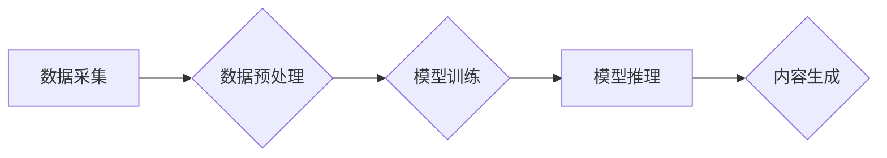

> 生成式AI, AIGC, 深度学习, 自然语言处理, 图像生成, 文本生成, 代码生成, 企业应用

## 1. 背景介绍

近年来，人工智能（AI）技术突飞猛进，特别是生成式人工智能（AIGC）的兴起，引发了全球范围内的热议和关注。AIGC是指能够根据输入的文本、图像、音频等数据，生成新的、原创的文本、图像、音频等内容的AI模型。

从ChatGPT的爆火到DALL-E 2的惊艳表现，AIGC已经不再是科幻小说中的幻想，而是触手可及的现实。它正在深刻地改变着我们生活和工作的方式，为各个行业带来了前所未有的机遇。

## 2. 核心概念与联系

**2.1  生成式AI的本质**

生成式AI的核心是学习数据中的模式和规律，并利用这些模式生成新的数据。它不同于传统的AI模型，例如分类或预测模型，它不仅能够识别数据中的信息，还能创造新的信息。

**2.2  AIGC的应用场景**

AIGC的应用场景非常广泛，包括：

* **文本生成:**  自动写作、文案创作、代码生成、聊天机器人等。
* **图像生成:**  图片合成、艺术创作、3D建模等。
* **音频生成:**  语音合成、音乐创作、音效制作等。
* **视频生成:**  视频剪辑、动画制作、虚拟主播等。

**2.3  AIGC的架构**

AIGC的架构通常包括以下几个部分：

* **数据采集和预处理:** 收集大量的数据，并进行清洗、格式化等预处理工作。
* **模型训练:** 使用深度学习算法训练模型，使其能够学习数据中的模式和规律。
* **模型推理:** 将训练好的模型应用于新的数据，生成新的内容。

**Mermaid 流程图**



## 3. 核心算法原理 & 具体操作步骤

**3.1  算法原理概述**

生成式AI的核心算法是**生成对抗网络（GAN）**。GAN由两个网络组成：生成器和鉴别器。

* **生成器:**  负责生成新的数据。
* **鉴别器:**  负责判断数据是真实数据还是生成数据。

生成器和鉴别器之间进行博弈，生成器试图生成越来越逼真的数据，而鉴别器试图识别越来越多的生成数据。

**3.2  算法步骤详解**

1. **初始化:** 生成器和鉴别器随机初始化参数。
2. **生成数据:** 生成器根据随机噪声生成新的数据。
3. **判别数据:** 鉴别器对生成的数据和真实数据进行判别，输出判断结果。
4. **更新参数:** 根据鉴别器的判别结果，更新生成器的参数，使其生成更逼真的数据。
5. **重复步骤2-4:** 重复上述步骤，直到生成器生成的數據能够欺骗鉴别器。

**3.3  算法优缺点**

* **优点:**  能够生成高质量、逼真的数据。
* **缺点:**  训练过程复杂，容易陷入局部最优解。

**3.4  算法应用领域**

* **图像生成:**  生成逼真的图像、合成图像、修复图像等。
* **文本生成:**  生成高质量的文本、自动写作、机器翻译等。
* **音频生成:**  生成逼真的语音、合成音乐等。

## 4. 数学模型和公式 & 详细讲解 & 举例说明

**4.1  数学模型构建**

GAN的数学模型主要包括两个部分：生成器G和鉴别器D。

* **生成器G:**  将随机噪声z映射到数据空间中，生成新的数据x。

$$
x = G(z)
$$

* **鉴别器D:**  判断数据x是真实数据还是生成数据，输出一个概率值。

$$
p(真实|x) = D(x)
$$

**4.2  公式推导过程**

GAN的训练目标是让生成器生成越来越逼真的数据，同时让鉴别器越来越难区分真实数据和生成数据。

* **生成器的损失函数:**  生成器希望生成的数据能够被鉴别器误判为真实数据。

$$
L_G = -log(D(G(z)))
$$

* **鉴别器的损失函数:**  鉴别器希望能够正确区分真实数据和生成数据。

$$
L_D = -log(D(x_真实)) - log(1 - D(G(z)))
$$

**4.3  案例分析与讲解**

例如，在图像生成领域，GAN可以用来生成逼真的图像。生成器会从随机噪声中生成图像，而鉴别器会判断生成的图像是否真实。通过不断训练，生成器能够生成越来越逼真的图像，最终能够生成与真实图像几乎 indistinguishable 的图像。

## 5. 项目实践：代码实例和详细解释说明

**5.1  开发环境搭建**

* Python 3.7+
* TensorFlow 或 PyTorch
* CUDA 和 cuDNN

**5.2  源代码详细实现**

```python
import tensorflow as tf

# 定义生成器模型
def generator_model():
    # ...

# 定义鉴别器模型
def discriminator_model():
    # ...

# 实例化生成器和鉴别器模型
generator = generator_model()
discriminator = discriminator_model()

# 定义损失函数和优化器
loss_fn = tf.keras.losses.BinaryCrossentropy()
optimizer_G = tf.keras.optimizers.Adam(learning_rate=0.0002, beta_1=0.5)
optimizer_D = tf.keras.optimizers.Adam(learning_rate=0.0002, beta_1=0.5)

# 训练循环
for epoch in range(num_epochs):
    for batch in dataset:
        # ...

# 保存生成模型
generator.save("generator_model.h5")
```

**5.3  代码解读与分析**

* 生成器模型和鉴别器模型的结构可以根据具体任务进行调整。
* 损失函数和优化器可以根据具体任务进行选择。
* 训练循环中，需要不断地生成数据，并进行判别和更新参数。

**5.4  运行结果展示**

训练完成后，可以使用生成器模型生成新的数据。

## 6. 实际应用场景

**6.1  文本生成**

* **自动写作:**  生成新闻报道、产品描述、广告文案等。
* **聊天机器人:**  构建更智能、更自然的聊天机器人。
* **机器翻译:**  提高机器翻译的准确性和流畅度。

**6.2  图像生成**

* **图片合成:**  将多个图像合成一张新的图像。
* **艺术创作:**  生成独特的艺术作品。
* **3D建模:**  自动生成3D模型。

**6.3  音频生成**

* **语音合成:**  生成逼真的语音，用于语音助手、播报系统等。
* **音乐创作:**  生成新的音乐作品。
* **音效制作:**  生成各种音效，用于游戏、影视等。

**6.4  未来应用展望**

AIGC的应用场景还在不断扩展，未来将应用于更多领域，例如：

* **教育:**  个性化学习、自动生成学习材料。
* **医疗:**  辅助诊断、生成医学图像。
* **金融:**  风险评估、欺诈检测。

## 7. 工具和资源推荐

**7.1  学习资源推荐**

* **书籍:**  《深度学习》、《生成对抗网络》
* **在线课程:**  Coursera、edX、Udacity

**7.2  开发工具推荐**

* **TensorFlow:**  开源深度学习框架。
* **PyTorch:**  开源深度学习框架。
* **Hugging Face:**  提供预训练模型和工具。

**7.3  相关论文推荐**

* **Generative Adversarial Networks**
* **Attention Is All You Need**
* **BERT: Pre-training of Deep Bidirectional Transformers for Language Understanding**

## 8. 总结：未来发展趋势与挑战

**8.1  研究成果总结**

近年来，AIGC取得了显著的进展，能够生成高质量、逼真的数据。

**8.2  未来发展趋势**

* **模型规模和能力的提升:**  未来将会有更大规模、更强大的AIGC模型。
* **多模态生成:**  能够生成多种模态的数据，例如文本、图像、音频、视频等。
* **个性化生成:**  能够根据用户的需求生成个性化的内容。

**8.3  面临的挑战**

* **数据安全和隐私:**  AIGC模型需要大量数据进行训练，如何保证数据安全和隐私是一个重要挑战。
* **伦理问题:**  AIGC生成的內容可能存在偏见、虚假信息等问题，需要解决伦理问题。
* **可解释性:**  AIGC模型的决策过程难以理解，需要提高模型的可解释性。

**8.4  研究展望**

未来，AIGC将继续发展，并应用于更多领域，为人类社会带来更多福祉。


## 9. 附录：常见问题与解答

**9.1  AIGC和传统AI有什么区别？**

传统AI主要用于分类、预测等任务，而AIGC能够生成新的数据。

**9.2  如何训练AIGC模型？**

需要使用大量数据进行训练，并使用生成对抗网络等算法。

**9.3  AIGC的应用场景有哪些？**

AIGC的应用场景非常广泛，包括文本生成、图像生成、音频生成等。

**9.4  AIGC有哪些伦理问题？**

AIGC生成的內容可能存在偏见、虚假信息等问题，需要解决伦理问题。


作者：禅与计算机程序设计艺术 / Zen and the Art of Computer Programming 
<end_of_turn>