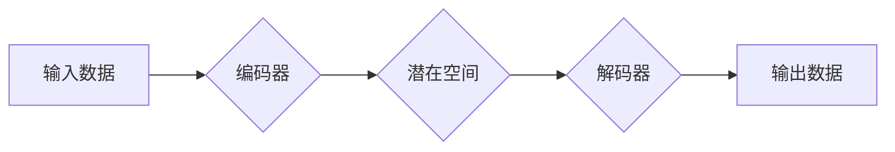

> 生成式人工智能、深度学习、生成对抗网络 (GAN)、变分自编码器 (VAE)、Transformer、文本生成、图像生成、语音合成、代码生成

## 1. 背景介绍

人工智能 (AI) 领域近年来取得了飞速发展，其中生成式人工智能 (Generative AI) 作为一门新兴技术，引起了广泛关注。与传统的监督学习和无监督学习不同，生成式人工智能专注于学习数据分布，并生成与训练数据相似的新的数据样本。

生成式人工智能的应用场景日益广泛，涵盖文本生成、图像生成、语音合成、代码生成等多个领域。例如，在文本生成领域，生成式人工智能可以用于自动撰写新闻报道、生成诗歌和小说，甚至进行机器翻译。在图像生成领域，生成式人工智能可以用于生成逼真的图像、合成人物肖像，甚至用于艺术创作。

## 2. 核心概念与联系

生成式人工智能的核心概念是学习数据分布。通过学习训练数据中的模式和结构，生成式人工智能模型能够生成新的数据样本，这些样本在统计上与训练数据相似。

**生成式人工智能的典型架构：**



**核心概念解释：**

* **输入数据:**  训练模型所使用的原始数据，例如文本、图像、音频等。
* **编码器:** 将输入数据映射到一个低维潜在空间，提取数据的关键特征。
* **潜在空间:**  一个抽象的空间，其中每个点代表一个数据样本的潜在表示。
* **解码器:** 将潜在空间中的点映射回原始数据空间，生成新的数据样本。
* **输出数据:** 由解码器生成的新的数据样本。

## 3. 核心算法原理 & 具体操作步骤

### 3.1  算法原理概述

生成式人工智能的算法主要分为两大类：

* **生成对抗网络 (GAN):** 由两个神经网络组成：生成器和判别器。生成器试图生成逼真的数据样本，而判别器试图区分真实数据和生成数据。两者在对抗博弈中相互学习，最终生成器能够生成与真实数据相似的样本。
* **变分自编码器 (VAE):**  通过编码器将数据映射到潜在空间，并通过解码器将潜在空间中的点映射回原始数据空间。VAE使用变分推断来学习潜在空间的分布，从而能够生成新的数据样本。

### 3.2  算法步骤详解

**3.2.1 生成对抗网络 (GAN)**

1. **初始化生成器和判别器:**  随机初始化生成器和判别器的参数。
2. **生成器训练:**  生成器根据随机噪声生成数据样本，并将其传递给判别器。
3. **判别器训练:**  判别器根据真实数据和生成数据样本进行分类，并更新其参数。
4. **重复步骤 2 和 3:**  不断重复生成器和判别器的训练过程，直到生成器能够生成逼真的数据样本。

**3.2.2 变分自编码器 (VAE)**

1. **编码器训练:**  编码器将数据映射到潜在空间，并学习潜在空间的分布。
2. **解码器训练:**  解码器根据潜在空间中的点生成新的数据样本。
3. **优化目标函数:**  优化目标函数，使生成的数据样本与真实数据尽可能相似。

### 3.3  算法优缺点

**3.3.1 生成对抗网络 (GAN)**

* **优点:**  能够生成逼真的数据样本，在图像生成、文本生成等领域表现出色。
* **缺点:**  训练过程比较复杂，容易出现模式崩溃等问题。

**3.3.2 变分自编码器 (VAE)**

* **优点:**  训练过程相对稳定，能够学习潜在空间的分布，生成的数据样本具有较好的多样性。
* **缺点:**  生成的样本质量可能不如 GAN 高。

### 3.4  算法应用领域

* **图像生成:**  生成逼真的图像、合成人物肖像、图像修复等。
* **文本生成:**  自动撰写新闻报道、生成诗歌和小说、机器翻译等。
* **语音合成:**  生成逼真的语音，用于语音助手、语音播报等。
* **代码生成:**  自动生成代码，提高开发效率。

## 4. 数学模型和公式 & 详细讲解 & 举例说明

### 4.1  数学模型构建

**4.1.1 生成对抗网络 (GAN)**

GAN 由两个神经网络组成：生成器 (G) 和判别器 (D)。

* **生成器 (G):**  将随机噪声作为输入，生成数据样本。
* **判别器 (D):**  根据输入数据样本判断其是否为真实数据。

**4.1.2 变分自编码器 (VAE)**

VAE 由三个部分组成：编码器 (Encoder)、解码器 (Decoder) 和潜在空间 (Latent Space)。

* **编码器 (Encoder):** 将输入数据映射到潜在空间。
* **解码器 (Decoder):** 将潜在空间中的点映射回原始数据空间。
* **潜在空间 (Latent Space):**  一个低维空间，用于表示数据的抽象特征。

### 4.2  公式推导过程

**4.2.1 生成对抗网络 (GAN)**

GAN 的训练目标是使生成器生成与真实数据相似的样本，同时使判别器能够准确区分真实数据和生成数据。

* **判别器损失函数:**

$$
L_D(D, G) = E_{x \sim p_{data}(x)}[log(D(x))] + E_{z \sim p_z(z)}[log(1 - D(G(z)))]
$$

* **生成器损失函数:**

$$
L_G(G, D) = E_{z \sim p_z(z)}[log(D(G(z)))]
$$

**4.2.2 变分自编码器 (VAE)**

VAE 的训练目标是使编码器能够学习潜在空间的分布，并使解码器能够从潜在空间中生成与真实数据相似的样本。

* **重建损失函数:**

$$
L_{recon}(x, \hat{x}) = ||x - \hat{x}||^2
$$

* **KL 散度损失函数:**

$$
L_{KL}(q(z|x), p(z)) = KL[q(z|x) || p(z)]
$$

* **总损失函数:**

$$
L(x, \hat{x}, z) = L_{recon}(x, \hat{x}) + \lambda L_{KL}(q(z|x), p(z))
$$

### 4.3  案例分析与讲解

**4.3.1 生成对抗网络 (GAN) 应用案例:**

* **图像生成:**  使用 GAN 生成逼真的图像，例如人脸图像、风景图像等。
* **文本生成:**  使用 GAN 生成逼真的文本，例如新闻报道、诗歌、小说等。

**4.3.2 变分自编码器 (VAE) 应用案例:**

* **图像压缩:**  使用 VAE 将图像压缩到较小的尺寸，同时保持图像质量。
* **图像修复:**  使用 VAE 修复损坏的图像，例如去除噪声、修复缺失的部分等。

## 5. 项目实践：代码实例和详细解释说明

### 5.1  开发环境搭建

* **操作系统:**  Windows、macOS 或 Linux
* **编程语言:**  Python
* **深度学习框架:**  TensorFlow 或 PyTorch
* **其他依赖库:**  NumPy、Matplotlib 等

### 5.2  源代码详细实现

以下是一个使用 TensorFlow 实现简单 GAN 的代码示例：

```python
import tensorflow as tf

# 定义生成器网络
def generator(z):
  # ...

# 定义判别器网络
def discriminator(x):
  # ...

# 定义损失函数和优化器
optimizer_G = tf.keras.optimizers.Adam(learning_rate=0.0002, beta_1=0.5)
optimizer_D = tf.keras.optimizers.Adam(learning_rate=0.0002, beta_1=0.5)
loss_fn = tf.keras.losses.BinaryCrossentropy()

# 训练循环
for epoch in range(num_epochs):
  for batch in dataset:
    # 训练判别器
    with tf.GradientTape() as tape_D:
      real_output = discriminator(batch)
      fake_output = discriminator(generator(tf.random.normal([batch_size, latent_dim])))
      d_loss_real = loss_fn(tf.ones_like(real_output), real_output)
      d_loss_fake = loss_fn(tf.zeros_like(fake_output), fake_output)
      d_loss = d_loss_real + d_loss_fake
    gradients_D = tape_D.gradient(d_loss, discriminator.trainable_variables)
    optimizer_D.apply_gradients(zip(gradients_D, discriminator.trainable_variables))

    # 训练生成器
    with tf.GradientTape() as tape_G:
      fake_output = discriminator(generator(tf.random.normal([batch_size, latent_dim])))
      g_loss = loss_fn(tf.ones_like(fake_output), fake_output)
    gradients_G = tape_G.gradient(g_loss, generator.trainable_variables)
    optimizer_G.apply_gradients(zip(gradients_G, generator.trainable_variables))

  print(f"Epoch {epoch+1}/{num_epochs}, D loss: {d_loss.numpy()}, G loss: {g_loss.numpy()}")

```

### 5.3  代码解读与分析

* **生成器网络:**  负责生成新的数据样本。
* **判别器网络:**  负责判断数据样本是否为真实数据。
* **损失函数:**  用于衡量生成器和判别器的性能。
* **优化器:**  用于更新生成器和判别器的参数。
* **训练循环:**  重复训练生成器和判别器，直到生成器能够生成与真实数据相似的样本。

### 5.4  运行结果展示

训练完成后，可以将生成器生成的样本与真实数据进行比较，观察生成器生成的样本的质量。

## 6. 实际应用场景

### 6.1  文本生成

* **自动撰写新闻报道:**  根据新闻事件的数据，自动生成新闻报道。
* **生成诗歌和小说:**  根据一定的主题和风格，自动生成诗歌和小说。
* **机器翻译:**  将文本从一种语言翻译成另一种语言。

### 6.2  图像生成

* **生成逼真的图像:**  例如人脸图像、风景图像、物体图像等。
* **合成人物肖像:**  根据文字描述生成人物肖像。
* **图像修复:**  修复损坏的图像，例如去除噪声、修复缺失的部分等。

### 6.3  语音合成

* **生成逼真的语音:**  用于语音助手、语音播报等。
* **语音转换:**  将文本转换为语音，并可以改变语音的性别、语调等。

### 6.4  代码生成

* **自动生成代码:**  根据需求描述自动生成代码，提高开发效率。
* **代码补全:**  根据上下文自动补全代码，减少代码编写时间。

## 7. 工具和资源推荐

### 7.1  学习资源推荐

* **书籍:**
    * 《Deep Learning》 by Ian Goodfellow, Yoshua Bengio, and Aaron Courville
    * 《Generative Deep Learning》 by David Foster
* **在线课程:**
    * Coursera: Deep Learning Specialization
    * Udacity: Deep Learning Nanodegree
* **博客和网站:**
    * Distill.pub
    * Towards Data Science

### 7.2  开发工具推荐

*