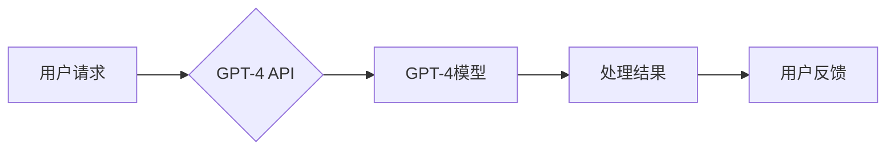

> GPT-4, API, 自然语言处理, 大模型, 循环神经网络, 应用程序开发

## 1. 背景介绍

近年来，人工智能（AI）技术取得了飞速发展，特别是深度学习领域取得了突破性进展。其中，大型语言模型（LLM）作为AI领域的重要分支，凭借其强大的文本生成、理解和翻译能力，在自然语言处理（NLP）领域展现出巨大的潜力。GPT-4，作为OpenAI最新推出的第四代生成式预训练转换器模型，在参数规模、性能和应用场景上都取得了显著提升。

GPT-4的强大能力源于其基于Transformer架构的深度学习模型，并通过海量文本数据进行预训练。它能够理解复杂的语言结构，生成流畅自然的文本，并具备多种NLP任务的能力，例如文本分类、问答系统、机器翻译、代码生成等。

然而，直接使用GPT-4模型的训练权重对于普通开发者来说存在一定的门槛，需要强大的计算资源和专业知识。为了让更多开发者能够便捷地利用GPT-4的强大能力，OpenAI推出了GPT-4 API，提供了一种简单易用的接口，让开发者可以轻松地调用GPT-4模型进行各种NLP任务。

## 2. 核心概念与联系

GPT-4 API的核心概念是将GPT-4模型的计算能力封装成一个可调用的接口，开发者可以通过API发送文本请求，获取GPT-4模型的处理结果。

**GPT-4 API架构**



**核心概念解释:**

* **用户请求:** 开发者通过API发送文本请求，例如输入一段文本进行翻译或生成一段代码。
* **GPT-4 API:**  OpenAI提供的接口，负责接收用户请求，调用GPT-4模型进行处理，并返回处理结果。
* **GPT-4模型:**  OpenAI训练的强大语言模型，负责对用户请求进行理解和处理。
* **处理结果:** GPT-4模型对用户请求的处理结果，例如翻译后的文本或生成的代码。
* **用户反馈:** 开发者根据处理结果进行反馈，例如修改请求或使用结果进行后续操作。

## 3. 核心算法原理 & 具体操作步骤

### 3.1  算法原理概述

GPT-4模型基于Transformer架构，是一种深度学习模型，其核心是利用注意力机制来捕捉文本序列中的长距离依赖关系。

Transformer模型由编码器和解码器两部分组成。编码器负责将输入文本序列编码成一个固定长度的向量表示，解码器则根据编码后的向量表示生成输出文本序列。

注意力机制是Transformer模型的关键创新点，它允许模型关注输入序列中与当前生成词语相关的部分，从而更好地捕捉文本的语义关系。

### 3.2  算法步骤详解

1. **输入文本预处理:** 将输入文本进行分词、词嵌入等预处理操作，将文本转换为模型可以理解的数字表示。
2. **编码器处理:** 将预处理后的文本输入到编码器中，编码器通过多层Transformer模块进行处理，将文本序列编码成一个固定长度的向量表示。
3. **解码器处理:** 将编码后的向量表示输入到解码器中，解码器通过多层Transformer模块和注意力机制生成输出文本序列。
4. **输出文本后处理:** 将生成的输出文本序列进行解码，例如去除特殊符号、重新组合词语等操作，得到最终的输出文本。

### 3.3  算法优缺点

**优点:**

* 能够捕捉长距离依赖关系，处理长文本序列。
* 训练效率高，可以利用并行计算加速训练过程。
* 性能优异，在各种NLP任务上取得了state-of-the-art的结果。

**缺点:**

* 模型参数量大，需要大量的计算资源进行训练和推理。
* 训练数据对模型性能有很大影响，需要高质量的训练数据。
* 对输入文本格式和长度有一定的要求。

### 3.4  算法应用领域

GPT-4模型及其API在以下领域具有广泛的应用前景:

* **自然语言理解:** 文本分类、情感分析、问答系统、文本摘要等。
* **自然语言生成:** 文本生成、机器翻译、对话系统、代码生成等。
* **其他领域:** 搜索引擎优化、内容创作、教育培训、客户服务等。

## 4. 数学模型和公式 & 详细讲解 & 举例说明

### 4.1  数学模型构建

GPT-4模型的数学模型构建基于Transformer架构，其核心是利用注意力机制来捕捉文本序列中的长距离依赖关系。

**注意力机制公式:**

$$
Attention(Q, K, V) = softmax(\frac{QK^T}{\sqrt{d_k}})V
$$

其中:

* $Q$：查询矩阵
* $K$：键矩阵
* $V$：值矩阵
* $d_k$：键向量的维度
* $softmax$：softmax函数

**Transformer模块公式:**

Transformer模块由多头注意力机制、前馈神经网络和残差连接组成。

### 4.2  公式推导过程

注意力机制的公式推导过程可以参考相关文献，例如Vaswani et al. (2017)的论文《Attention Is All You Need》。

### 4.3  案例分析与讲解

**举例说明:**

假设我们有一个文本序列“我爱学习编程”，我们想要计算每个词语对“学习”的注意力权重。

1. 将文本序列编码成词向量表示。
2. 计算每个词语的查询向量、键向量和值向量。
3. 计算每个词语对“学习”的注意力权重，使用注意力机制公式。
4. 将注意力权重加权平均，得到“学习”词语的上下文表示。

## 5. 项目实践：代码实例和详细解释说明

### 5.1  开发环境搭建

* Python 3.7+
* OpenAI API密钥
* pip install openai

### 5.2  源代码详细实现

```python
import openai

# 设置OpenAI API密钥
openai.api_key = "YOUR_API_KEY"

# 定义一个函数，用于调用GPT-4 API进行文本生成
def generate_text(prompt):
    response = openai.Completion.create(
        engine="gpt-4",
        prompt=prompt,
        max_tokens=100,
        temperature=0.7,
    )
    return response.choices[0].text

# 示例使用
prompt = "写一段关于人工智能的短文。"
generated_text = generate_text(prompt)
print(generated_text)
```

### 5.3  代码解读与分析

* 代码首先导入openai库，并设置OpenAI API密钥。
* 定义一个函数`generate_text`，用于调用GPT-4 API进行文本生成。
* 函数参数包括`prompt`（文本提示）、`max_tokens`（最大生成词数）、`temperature`（温度参数，控制文本的随机性）。
* 调用`openai.Completion.create`函数发送API请求，获取GPT-4模型的处理结果。
* 返回结果中包含生成的文本内容。
* 示例代码演示了如何使用`generate_text`函数生成一段关于人工智能的短文。

### 5.4  运行结果展示

运行代码后，将输出一段由GPT-4模型生成的关于人工智能的短文。

## 6. 实际应用场景

### 6.1  聊天机器人

GPT-4 API可以用于构建更智能、更自然的聊天机器人，能够理解用户的意图，并提供更精准、更人性化的回复。

### 6.2  内容创作

GPT-4 API可以帮助内容创作者生成各种类型的文本内容，例如文章、故事、诗歌、剧本等，提高创作效率，激发创意灵感。

### 6.3  代码生成

GPT-4 API可以根据用户的描述生成代码，例如Python、Java、C++等语言的代码，帮助开发者提高开发效率，减少代码编写工作量。

### 6.4  未来应用展望

GPT-4 API的应用场景还在不断扩展，未来将应用于更多领域，例如教育、医疗、金融等，为人们的生活带来更多便利和价值。

## 7. 工具和资源推荐

### 7.1  学习资源推荐

* OpenAI官方文档：https://platform.openai.com/docs/api-reference
* Transformer论文：https://arxiv.org/abs/1706.03762

### 7.2  开发工具推荐

* Python编程语言
* Jupyter Notebook

### 7.3  相关论文推荐

* Attention Is All You Need
* GPT-3: Language Models are Few-Shot Learners

## 8. 总结：未来发展趋势与挑战

### 8.1  研究成果总结

GPT-4模型及其API的推出标志着人工智能技术取得了新的突破，为NLP领域的发展带来了新的机遇。

### 8.2  未来发展趋势

* 模型规模和性能将继续提升，模型参数量将进一步增加，模型性能将更加强大。
* 多模态模型将成为未来发展趋势，能够处理文本、图像、音频等多种数据类型。
* 模型解释性和可解释性将得到加强，帮助人们更好地理解模型的决策过程。

### 8.3  面临的挑战

* 模型训练成本高，需要大量的计算资源和数据。
* 模型安全性问题需要得到重视，防止模型被用于恶意目的。
* 模型的公平性和偏见问题需要得到解决，确保模型的输出结果公平公正。

### 8.4  研究展望

未来研究将集中在以下几个方面:

* 开发更高效、更节能的训练算法。
* 研究更强大的多模态模型。
* 提升模型的解释性和可解释性。
* 解决模型的安全性、公平性和偏见问题。

## 9. 附录：常见问题与解答

* **如何获取OpenAI API密钥？**

  访问OpenAI官网，注册账号并申请API密钥。

* **GPT-4 API的收费标准是什么？**

  OpenAI提供不同的API套餐，收费标准根据使用量和功能不同而有所差异。

* **GPT-4 API支持哪些编程语言？**

  GPT-4 API主要支持Python语言。

* **GPT-4 API的性能如何？**

  GPT-4模型在各种NLP任务上都取得了state-of-the-art的结果，其性能非常强大。


作者：禅与计算机程序设计艺术 / Zen and the Art of Computer Programming 
<end_of_turn>