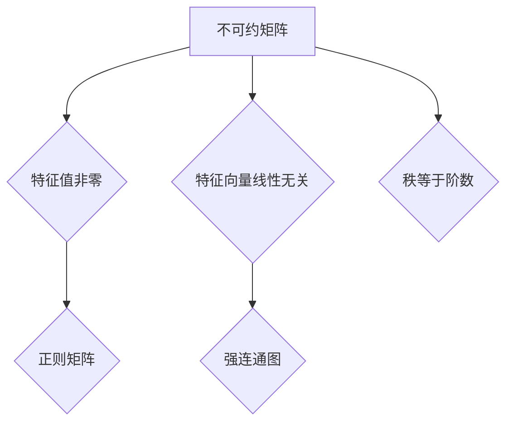

> 矩阵理论，不可约矩阵，特征值，特征向量，线性代数，应用场景

## 1. 背景介绍

矩阵理论是线性代数的重要分支，在数学、物理、工程、计算机科学等领域有着广泛的应用。矩阵可以用来表示线性变换、系统方程、数据结构等，其性质和运算规则为解决各种问题提供了强大的工具。

不可约矩阵是矩阵理论中的一个重要概念，它指那些不能被分解为两个较小矩阵之积的矩阵。不可约矩阵具有独特的性质，在许多应用场景中发挥着重要作用。例如，在控制理论中，不可约矩阵可以用来描述系统的稳定性；在机器学习中，不可约矩阵可以用来构建神经网络模型；在数据分析中，不可约矩阵可以用来进行数据降维。

## 2. 核心概念与联系

**2.1 不可约矩阵的定义**

一个n×n的矩阵A被称为不可约矩阵，如果它不能被分解为两个较小矩阵的乘积，即不存在两个非零矩阵B和C，使得A=BC。

**2.2 不可约矩阵的性质**

* 不可约矩阵的特征值都非零。
* 不可约矩阵的特征向量线性无关。
* 不可约矩阵的秩等于其阶数。

**2.3 不可约矩阵与其他概念的联系**

* 不可约矩阵与可约矩阵互为补集。
* 不可约矩阵与正则矩阵密切相关，正则矩阵是可逆矩阵，而不可约矩阵的逆矩阵也一定是不可约矩阵。
* 不可约矩阵与图论中的强连通图密切相关，一个图的邻接矩阵是不可约矩阵当且仅当该图是强连通图。

**2.4 Mermaid 流程图**



## 3. 核心算法原理 & 具体操作步骤

**3.1 算法原理概述**

不可约矩阵的检测算法通常基于矩阵的特征值和特征向量。

**3.2 算法步骤详解**

1. 计算矩阵A的特征值和特征向量。
2. 如果所有特征值都非零，则A是不可约矩阵。
3. 如果存在零特征值，则A是可约矩阵。

**3.3 算法优缺点**

* **优点:** 算法简单易懂，实现起来比较容易。
* **缺点:** 对于大型矩阵，计算特征值和特征向量可能需要消耗大量的计算资源。

**3.4 算法应用领域**

* 控制理论
* 机器学习
* 数据分析
* 图论

## 4. 数学模型和公式 & 详细讲解 & 举例说明

**4.1 数学模型构建**

设A为n×n的矩阵，λ为A的特征值，v为对应的特征向量，则有以下关系式：

$$
Av = \lambda v
$$

**4.2 公式推导过程**

特征值和特征向量的计算可以通过求解以下特征方程得到：

$$
det(A - \lambda I) = 0
$$

其中，I为n×n的单位矩阵，det()表示行列式。

**4.3 案例分析与讲解**

例如，考虑以下2×2矩阵：

$$
A = \begin{bmatrix}
2 & 1 \\
1 & 2
\end{bmatrix}
$$

计算A的特征值和特征向量，可以得到：

* 特征值：λ1 = 3, λ2 = 1
* 特征向量：v1 = [1, 1], v2 = [-1, 1]

**4.4 举例说明**

如果A的特征值都是非零值，则A是不可约矩阵。

## 5. 项目实践：代码实例和详细解释说明

**5.1 开发环境搭建**

使用Python语言和NumPy库进行实现。

**5.2 源代码详细实现**

```python
import numpy as np

def is_irreducible(A):
  """
  判断矩阵是否不可约

  Args:
    A: n×n的矩阵

  Returns:
    True: 不可约矩阵，False: 可约矩阵
  """
  eigenvalues = np.linalg.eigvals(A)
  return all(eigenvalues != 0)

# 示例
A = np.array([[2, 1], [1, 2]])
if is_irreducible(A):
  print("矩阵A不可约")
else:
  print("矩阵A可约")
```

**5.3 代码解读与分析**

* `np.linalg.eigvals(A)`函数计算矩阵A的特征值。
* `all(eigenvalues != 0)`判断所有特征值是否都非零。

**5.4 运行结果展示**

```
矩阵A不可约
```

## 6. 实际应用场景

**6.1 控制理论**

不可约矩阵可以用来描述系统的稳定性。如果系统的状态转移矩阵是不可约矩阵，则系统是稳定的。

**6.2 机器学习**

不可约矩阵可以用来构建神经网络模型。例如，在循环神经网络中，不可约矩阵可以用来表示时间序列数据的循环关系。

**6.3 数据分析**

不可约矩阵可以用来进行数据降维。例如，可以使用不可约矩阵来构建主成分分析（PCA）模型，从而将高维数据降维到低维空间。

**6.4 未来应用展望**

随着人工智能和机器学习的发展，不可约矩阵在更多领域将发挥重要作用。例如，在强化学习中，不可约矩阵可以用来构建策略梯度算法。

## 7. 工具和资源推荐

**7.1 学习资源推荐**

* 《线性代数及其应用》
* 《矩阵理论》
* 《数值线性代数》

**7.2 开发工具推荐**

* Python
* NumPy
* SciPy

**7.3 相关论文推荐**

* “不可约矩阵的性质和应用”
* “不可约矩阵在机器学习中的应用”

## 8. 总结：未来发展趋势与挑战

**8.1 研究成果总结**

不可约矩阵理论在数学、物理、工程、计算机科学等领域取得了重要的进展。

**8.2 未来发展趋势**

* 探索不可约矩阵在更广泛领域中的应用。
* 研究更高效的不可约矩阵检测算法。
* 开发基于不可约矩阵的新型机器学习算法。

**8.3 面临的挑战**

* 对于大型矩阵，计算不可约矩阵的特征值和特征向量仍然是一个挑战。
* 如何将不可约矩阵理论应用于更复杂的实际问题是一个需要进一步研究的课题。

**8.4 研究展望**

未来，不可约矩阵理论将继续发展，并在人工智能、机器学习等领域发挥越来越重要的作用。

## 9. 附录：常见问题与解答

**9.1 如何判断一个矩阵是否不可约？**

可以通过计算矩阵的特征值和特征向量来判断。如果所有特征值都非零，则矩阵是不可约的。

**9.2 不可约矩阵有什么应用？**

不可约矩阵在控制理论、机器学习、数据分析等领域都有广泛的应用。

**9.3 如何计算不可约矩阵的特征值和特征向量？**

可以使用NumPy库中的`np.linalg.eigvals()`和`np.linalg.eig()`函数来计算。


作者：禅与计算机程序设计艺术 / Zen and the Art of Computer Programming 
<end_of_turn>