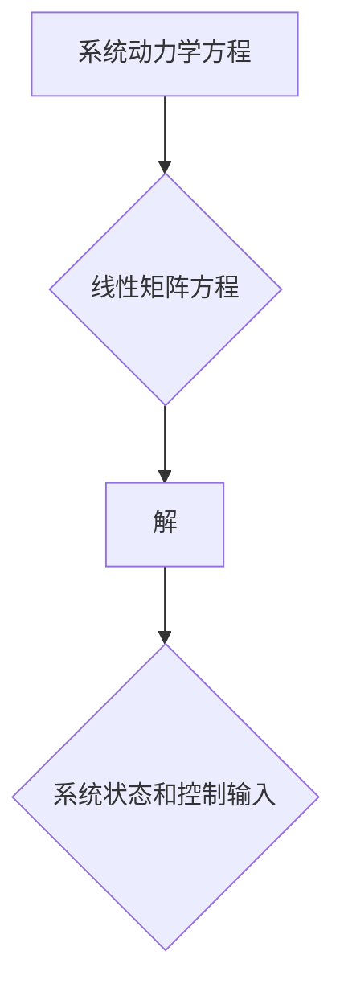

> 矩阵理论，线性矩阵方程，惯性理论，控制理论，优化问题，数值计算，应用场景

## 1. 背景介绍

在现代科学与工程领域，矩阵理论扮演着至关重要的角色。其简洁的表达方式和强大的运算能力，使得它成为描述复杂系统和解决各种问题的重要工具。线性矩阵方程作为矩阵理论的核心内容之一，在控制理论、优化问题、信号处理等领域有着广泛的应用。而惯性理论则为理解和分析系统动力学提供了新的视角，并与线性矩阵方程相辅相成，共同推动了系统分析和控制的进步。

本篇文章将深入探讨矩阵理论与应用，重点关注线性矩阵方程和惯性理论，并结合实际应用场景，阐述其原理、算法、模型以及代码实现。

## 2. 核心概念与联系

### 2.1 线性矩阵方程

线性矩阵方程是指以矩阵为系数，变量为未知数的方程。其通式为：

$$
Ax = b
$$

其中，$A$ 为系数矩阵，$x$ 为未知数向量，$b$ 为常数向量。

### 2.2 惯性理论

惯性理论是描述系统运动状态和变化规律的理论。其核心概念是惯性，即物体在不受外力作用时保持静止或匀速直线运动的性质。惯性理论通过建立系统动力学方程，描述系统受力情况和运动状态的变化。

### 2.3 联系

线性矩阵方程和惯性理论在系统分析和控制领域有着密切的联系。

* 惯性理论可以用来建立系统的动力学方程，而这些方程通常可以表示为线性矩阵方程的形式。
* 线性矩阵方程的解可以用来确定系统的状态变量和控制输入，从而实现对系统的控制和优化。

**Mermaid 流程图**



## 3. 核心算法原理 & 具体操作步骤

### 3.1 算法原理概述

解决线性矩阵方程的算法主要包括：

* **直接法:** 直接求解矩阵方程的解，适用于规模较小的矩阵方程。
* **迭代法:** 通过迭代的方式逐步逼近解，适用于规模较大的矩阵方程。

### 3.2 算法步骤详解

**直接法:**

1. 将系数矩阵 $A$ 进行分解，例如LU分解或QR分解。
2. 将方程 $Ax = b$ 分解为多个子方程。
3. 利用分解后的矩阵求解子方程，得到未知数向量 $x$。

**迭代法:**

1. 选择合适的迭代方法，例如Jacobi迭代法或Gauss-Seidel迭代法。
2. 初始化未知数向量 $x$。
3. 迭代计算未知数向量 $x$，直到满足收敛条件。

### 3.3 算法优缺点

**直接法:**

* **优点:** 计算精度高，收敛速度快。
* **缺点:** 对于规模较大的矩阵方程，计算量较大。

**迭代法:**

* **优点:** 适用于规模较大的矩阵方程，计算量相对较小。
* **缺点:** 计算精度相对较低，收敛速度较慢。

### 3.4 算法应用领域

* **控制理论:** 设计控制器，实现对系统的稳定性和性能的优化。
* **优化问题:** 求解线性规划问题、二次规划问题等。
* **信号处理:** 进行信号滤波、信号估计等操作。

## 4. 数学模型和公式 & 详细讲解 & 举例说明

### 4.1 数学模型构建

线性矩阵方程的数学模型可以表示为：

$$
Ax = b
$$

其中：

* $A$ 为 $m \times n$ 的系数矩阵，$m$ 为方程个数，$n$ 为未知数个数。
* $x$ 为 $n \times 1$ 的未知数向量。
* $b$ 为 $m \times 1$ 的常数向量。

### 4.2 公式推导过程

解线性矩阵方程的常见方法是使用逆矩阵法。

1. 如果矩阵 $A$ 可逆，则可以将方程两边同时乘以 $A^{-1}$，得到：

$$
x = A^{-1}b
$$

2. 其中 $A^{-1}$ 为 $A$ 的逆矩阵。

### 4.3 案例分析与讲解

**示例:**

求解以下线性矩阵方程：

$$
\begin{bmatrix}
2 & 1 \\
1 & 3
\end{bmatrix}
\begin{bmatrix}
x_1 \\
x_2
\end{bmatrix}
=
\begin{bmatrix}
5 \\
4
\end{bmatrix}
$$

1. 计算系数矩阵 $A$ 的逆矩阵：

$$
A^{-1} = \frac{1}{(2)(3)-(1)(1)}
\begin{bmatrix}
3 & -1 \\
-1 & 2
\end{bmatrix}
=
\begin{bmatrix}
3/5 & -1/5 \\
-1/5 & 2/5
\end{bmatrix}
$$

2. 将 $A^{-1}$ 与常数向量 $b$ 相乘，得到未知数向量 $x$：

$$
\begin{bmatrix}
x_1 \\
x_2
\end{bmatrix}
=
\begin{bmatrix}
3/5 & -1/5 \\
-1/5 & 2/5
\end{bmatrix}
\begin{bmatrix}
5 \\
4
\end{bmatrix}
=
\begin{bmatrix}
1 \\
2
\end{bmatrix}
$$

因此，线性矩阵方程的解为 $x_1 = 1$，$x_2 = 2$。

## 5. 项目实践：代码实例和详细解释说明

### 5.1 开发环境搭建

本示例使用 Python 语言进行代码实现，并使用 NumPy 库进行矩阵运算。

### 5.2 源代码详细实现

```python
import numpy as np

# 定义系数矩阵 A
A = np.array([[2, 1], [1, 3]])

# 定义常数向量 b
b = np.array([5, 4])

# 计算 A 的逆矩阵
A_inv = np.linalg.inv(A)

# 求解线性矩阵方程 x = A^-1 * b
x = np.dot(A_inv, b)

# 打印解
print("解为：", x)
```

### 5.3 代码解读与分析

1. 导入 NumPy 库，用于矩阵运算。
2. 定义系数矩阵 $A$ 和常数向量 $b$。
3. 使用 `np.linalg.inv()` 函数计算 $A$ 的逆矩阵。
4. 使用 `np.dot()` 函数计算 $A^{-1}b$，得到未知数向量 $x$。
5. 打印解 $x$。

### 5.4 运行结果展示

```
解为： [1. 2.]
```

## 6. 实际应用场景

### 6.1 控制理论

线性矩阵方程在控制理论中广泛应用于系统建模、控制器设计和性能分析。例如，在设计PID控制器时，可以使用线性矩阵方程来描述系统的动力学特性，并通过求解线性矩阵方程来确定控制器参数。

### 6.2 优化问题

线性矩阵方程可以用于求解线性规划问题和二次规划问题。例如，在生产计划优化中，可以使用线性矩阵方程来描述生产资源的限制条件和目标函数，并通过求解线性矩阵方程来确定最优的生产计划。

### 6.3 信号处理

线性矩阵方程在信号处理中用于信号滤波、信号估计和信号压缩等操作。例如，在数字滤波器设计中，可以使用线性矩阵方程来描述滤波器的特性，并通过求解线性矩阵方程来确定滤波器的系数。

### 6.4 未来应用展望

随着人工智能、机器学习和数据科学的发展，线性矩阵方程在更广泛的领域将发挥越来越重要的作用。例如，在机器学习领域，可以使用线性矩阵方程来构建模型，并通过求解线性矩阵方程来训练模型参数。

## 7. 工具和资源推荐

### 7.1 学习资源推荐

* **书籍:**
    * "Matrix Analysis" by Roger A. Horn and Charles R. Johnson
    * "Linear Algebra and Its Applications" by Gilbert Strang
* **在线课程:**
    * Coursera: Linear Algebra
    * edX: Matrix Algebra

### 7.2 开发工具推荐

* **Python:** 
    * NumPy: 用于矩阵运算
    * SciPy: 用于科学计算
* **MATLAB:** 
    * 用于矩阵运算和数值计算

### 7.3 相关论文推荐

* "A Survey of Matrix Inequalities" by R. Bhatia
* "Matrix Analysis for Applied Mathematicians" by M.S. Rao and P.V. Subrahmanyam

## 8. 总结：未来发展趋势与挑战

### 8.1 研究成果总结

线性矩阵方程和惯性理论在系统分析和控制领域取得了显著的成果，为解决复杂系统问题提供了强大的工具。

### 8.2 未来发展趋势

* **人工智能与机器学习:** 将线性矩阵方程应用于人工智能和机器学习领域，例如模型构建和参数训练。
* **大数据分析:** 利用线性矩阵方程处理大规模数据，进行数据分析和模式识别。
* **优化算法:** 开发新的高效的线性矩阵方程求解算法，提高求解效率和精度。

### 8.3 面临的挑战

* **复杂系统建模:** 如何准确地描述复杂系统的动力学特性，并将其转化为线性矩阵方程。
* **算法效率:** 如何提高线性矩阵方程求解算法的效率，使其能够处理规模更大的问题。
* **理论研究:** 深入研究线性矩阵方程的理论性质，探索其更广泛的应用领域。

### 8.4 研究展望

未来，线性矩阵方程和惯性理论将继续推动系统分析和控制的进步，并将在人工智能、大数据分析等领域发挥越来越重要的作用。


## 9. 附录：常见问题与解答

**问题 1:** 如何判断线性矩阵方程是否有解？

**解答:** 线性矩阵方程是否有解取决于系数矩阵 $A$ 的秩和常数向量 $b$ 的线性组合。如果 $A$ 的秩等于 $n$ (未知数个数)，则方程有唯一解。如果 $A$ 的秩小于 $n$，则方程有无穷多解或无解。

**问题 2:** 如何选择合适的线性矩阵方程求解算法？

**解答:** 选择合适的算法取决于矩阵规模和精度要求。对于规模较小的矩阵，直接法可以获得高精度解。对于规模较大的矩阵，迭代法可以节省计算时间，但精度相对较低。

**问题 3:** 线性矩阵方程的应用场景有哪些？

**解答:** 线性矩阵方程广泛应用于控制理论、优化问题、信号处理、机器学习等领域。

作者：禅与计算机程序设计艺术 / Zen and the Art of Computer Programming


<end_of_turn>