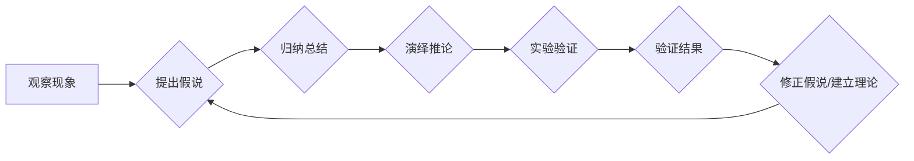

> 科学发现, 假说, 理论, 归纳, 演绎, 实验验证, 模型, 计算机科学, 算法, 数据分析

## 1. 背景介绍

科学发现是人类认知世界、理解自然规律和推动社会进步的基石。从古希腊哲学家对宇宙的探索到现代科学技术的飞速发展，科学发现始终是人类文明进步的动力源泉。而科学发现的过程并非偶然，它遵循着严谨的逻辑和方法论，从最初的猜想到最终的理论构建，经历着不断的验证和完善。

在计算机科学领域，科学发现同样至关重要。算法、数据结构、编程语言等都是计算机科学领域的重要发现，它们为我们提供了解决复杂问题的工具和方法。而这些发现的背后，也蕴含着科学发现的本质规律。

## 2. 核心概念与联系

科学发现的核心概念包括假说、理论、归纳、演绎、实验验证等。

**假说**是基于观察和思考提出的关于自然现象的初步解释，它是一种尚未得到证实或证伪的假设。

**理论**是经过反复验证和检验，能够解释大量现象并预测未来趋势的科学解释体系。

**归纳**是指从具体的个案中总结出普遍规律的过程。

**演绎**是指从已知的普遍规律推导出具体的结论的过程。

**实验验证**是检验假说或理论是否成立的关键步骤。

这些概念相互联系，共同构成了科学发现的逻辑框架。

**Mermaid 流程图**



## 3. 核心算法原理 & 具体操作步骤

### 3.1  算法原理概述

算法是一种解决特定问题的指令序列，它描述了如何使用有限的步骤和资源，将输入数据转换为输出结果。

算法的本质是逻辑和步骤的清晰定义，它需要满足以下几个特点：

* **明确性:** 每个步骤都必须明确定义，避免歧义。
* **有限性:** 算法必须在有限的步骤内完成，不能无限循环。
* **有效性:** 算法的每个步骤都必须能够执行，并且能够在有限的时间内完成。
* **输入输出:** 算法必须有明确的输入和输出，以便能够处理数据并产生结果。

### 3.2  算法步骤详解

算法的具体步骤通常包括以下几个方面：

* **输入:** 获取算法所需的输入数据。
* **处理:** 对输入数据进行一系列操作，例如计算、比较、排序等。
* **输出:** 将处理后的结果输出到指定位置。

### 3.3  算法优缺点

不同的算法具有不同的优缺点，选择合适的算法取决于具体问题的需求。

* **时间复杂度:** 指算法执行所需的时间与输入数据大小的关系。
* **空间复杂度:** 指算法执行所需内存空间与输入数据大小的关系。
* **易读性:** 指算法的代码是否易于理解和维护。

### 3.4  算法应用领域

算法广泛应用于各个领域，例如：

* **计算机科学:** 算法是计算机科学的基础，用于实现各种软件功能，例如搜索、排序、加密等。
* **数据科学:** 算法用于数据分析、机器学习、人工智能等领域。
* **生物信息学:** 算法用于基因组测序、蛋白质结构预测等领域。
* **金融领域:** 算法用于风险管理、投资策略等领域。

## 4. 数学模型和公式 & 详细讲解 & 举例说明

### 4.1  数学模型构建

数学模型是利用数学语言和符号来描述客观现象的抽象表示。

在科学发现中，数学模型可以帮助我们理解和预测自然现象，并为实验设计提供依据。

### 4.2  公式推导过程

公式推导是利用数学逻辑和法则，从已知条件出发，推导出未知结论的过程。

公式推导需要严谨的逻辑推理和数学知识，是科学发现的重要步骤。

### 4.3  案例分析与讲解

例如，牛顿的万有引力定律可以用以下公式表示：

$$F = G \frac{m_1 m_2}{r^2}$$

其中：

* $F$ 是引力大小
* $G$ 是万有引力常数
* $m_1$ 和 $m_2$ 分别是两个物体的质量
* $r$ 是两个物体之间的距离

通过这个公式，我们可以计算出任何两个物体的引力大小，并预测它们的运动轨迹。

## 5. 项目实践：代码实例和详细解释说明

### 5.1  开发环境搭建

为了实现算法的实际应用，我们需要搭建相应的开发环境。

例如，如果我们要使用Python语言实现一个排序算法，我们需要安装Python解释器和相关的库。

### 5.2  源代码详细实现

```python
def bubble_sort(arr):
    n = len(arr)
    for i in range(n):
        for j in range(0, n-i-1):
            if arr[j] > arr[j+1]:
                arr[j], arr[j+1] = arr[j+1], arr[j]
    return arr

# 测试代码
arr = [64, 34, 25, 12, 22, 11, 90]
sorted_arr = bubble_sort(arr)
print("排序后的数组:", sorted_arr)
```

### 5.3  代码解读与分析

这段代码实现了冒泡排序算法。

冒泡排序算法的基本思想是：

* 比较相邻的两个元素，如果顺序错误，则交换它们的位置。
* 重复上述步骤，直到整个数组有序。

### 5.4  运行结果展示

运行这段代码，输出结果为：

```
排序后的数组: [11, 12, 22, 25, 34, 64, 90]
```

## 6. 实际应用场景

### 6.1  搜索引擎

搜索引擎使用算法对海量网页进行索引和排序，以便用户能够快速找到所需的信息。

### 6.2  推荐系统

推荐系统使用算法分析用户的行为数据，并推荐用户可能感兴趣的内容。

### 6.3  图像识别

图像识别算法可以识别图像中的物体、场景和人脸等信息。

### 6.4  未来应用展望

随着人工智能技术的不断发展，算法将在更多领域得到应用，例如：

* **医疗诊断:** 算法可以辅助医生诊断疾病，提高诊断准确率。
* **自动驾驶:** 算法可以帮助车辆感知周围环境，并做出安全驾驶决策。
* **个性化教育:** 算法可以根据学生的学习情况，提供个性化的学习内容和辅导。

## 7. 工具和资源推荐

### 7.1  学习资源推荐

* **书籍:** 《算法导论》、《数据结构与算法分析》
* **在线课程:** Coursera、edX、Udacity 等平台提供丰富的算法和数据结构课程。
* **网站:** GeeksforGeeks、LeetCode 等网站提供算法练习题和学习资源。

### 7.2  开发工具推荐

* **Python:** 广泛应用于数据科学和人工智能领域，拥有丰富的算法库和工具。
* **Java:** 性能强大，适合开发大型应用程序。
* **C++:** 性能优异，适合开发高性能算法。

### 7.3  相关论文推荐

* **《算法导论》:** Cormen, T. H., Leiserson, C. E., Rivest, R. L., & Stein, C. (2009). Introduction to algorithms. MIT press.
* **《数据结构与算法分析》:** Weiss, M. A. (2013). Data structures and algorithm analysis in C++. Pearson Education.

## 8. 总结：未来发展趋势与挑战

### 8.1  研究成果总结

科学发现是人类文明进步的动力源泉，算法是计算机科学的基础，它们共同推动着科技发展。

### 8.2  未来发展趋势

未来，科学发现和算法将朝着以下方向发展：

* **更深入的理解:** 通过更先进的实验方法和理论模型，更深入地理解自然现象和算法的本质。
* **更广泛的应用:** 将科学发现和算法应用于更多领域，解决更复杂的问题。
* **更智能的系统:** 开发更智能的算法和系统，能够自主学习、适应和决策。

### 8.3  面临的挑战

未来科学发现和算法发展也面临着一些挑战：

* **数据爆炸:** 海量数据的处理和分析需要更强大的算法和计算能力。
* **伦理问题:** 人工智能的快速发展引发了伦理问题，需要制定相应的规范和制度。
* **跨学科合作:** 科学发现和算法的突破需要跨学科合作，促进不同领域的交流和融合。

### 8.4  研究展望

未来，我们将继续探索科学发现和算法的奥秘，为人类文明进步做出贡献。

## 9. 附录：常见问题与解答

### 9.1  什么是算法？

算法是一种解决特定问题的指令序列，它描述了如何使用有限的步骤和资源，将输入数据转换为输出结果。

### 9.2  算法的优缺点是什么？

算法的优缺点取决于具体算法的特性，例如时间复杂度、空间复杂度、易读性等。

### 9.3  算法的应用领域有哪些？

算法广泛应用于各个领域，例如计算机科学、数据科学、生物信息学、金融领域等。

作者：禅与计算机程序设计艺术 / Zen and the Art of Computer Programming


<end_of_turn>