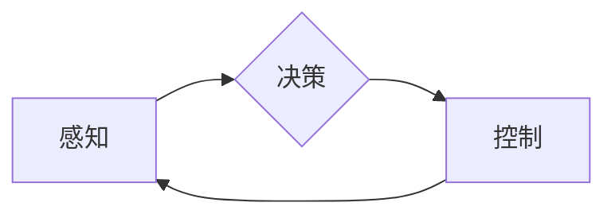

> 自动驾驶, 深度学习, 计算机视觉, 预测模型, 决策控制, 全栈开发, 挑战

## 1. 背景介绍

自动驾驶技术作为未来交通运输的重要发展方向，近年来取得了显著进展。从早期基于规则的控制系统到如今的深度学习驱动的智能驾驶，自动驾驶技术经历了从感知到决策、控制的逐步完善。然而，实现真正意义上的“端到端”自动驾驶，仍然面临着诸多挑战。

端到端自动驾驶是指从感知环境到控制车辆，整个驾驶过程都由算法自动完成，无需人工干预。这种全自动驾驶模式具有更高的安全性、效率和舒适性，但也更加复杂，需要解决感知、决策、控制等多个关键环节的技术难题。

## 2. 核心概念与联系

端到端自动驾驶的核心概念包括：

* **感知:** 通过传感器获取车辆周围环境信息，包括道路、车道、交通信号灯、行人等。
* **决策:** 根据感知到的环境信息，制定驾驶策略，例如加速、减速、转向等。
* **控制:** 将决策转化为实际的车辆控制指令，例如油门、刹车、方向盘等。

这些核心概念相互关联，构成一个闭环系统。

**Mermaid 流程图:**



## 3. 核心算法原理 & 具体操作步骤

### 3.1  算法原理概述

端到端自动驾驶的核心算法主要包括：

* **深度学习:** 用于感知、决策和控制等环节，通过训练大量的样本数据，学习驾驶规则和环境特征。
* **强化学习:** 用于训练决策模块，通过奖励机制，引导算法学习最优的驾驶策略。
* **路径规划:** 用于规划车辆行驶路线，避免碰撞和障碍物。

### 3.2  算法步骤详解

**感知模块:**

1. **数据采集:** 利用摄像头、雷达、激光雷达等传感器获取车辆周围环境信息。
2. **数据预处理:** 对采集到的数据进行滤波、去噪等处理，提取有效信息。
3. **特征提取:** 使用深度学习模型，从预处理后的数据中提取特征，例如道路边界、车道线、行人等。

**决策模块:**

1. **状态估计:** 根据感知到的环境信息，估计车辆当前的状态，例如位置、速度、方向等。
2. **预测模型:** 使用深度学习模型，预测未来环境的变化，例如车辆运动轨迹、行人行为等。
3. **决策策略:** 根据状态估计和预测结果，制定驾驶策略，例如加速、减速、转向等。

**控制模块:**

1. **控制指令生成:** 将决策策略转化为实际的车辆控制指令，例如油门、刹车、方向盘等。
2. **控制执行:** 将控制指令发送到车辆的控制系统，执行驾驶动作。

### 3.3  算法优缺点

**优点:**

* **高精度:** 深度学习算法能够学习复杂的驾驶规则和环境特征，实现高精度的感知和决策。
* **鲁棒性:** 强化学习算法能够学习应对各种复杂场景的驾驶策略，提高系统的鲁棒性。
* **自动化:** 端到端自动驾驶能够实现车辆的完全自动化驾驶，解放驾驶员。

**缺点:**

* **数据依赖:** 深度学习算法需要大量的训练数据，数据质量和数量直接影响算法性能。
* **计算复杂度:** 训练和运行深度学习模型需要大量的计算资源。
* **安全风险:** 自动驾驶系统仍然存在安全风险，需要不断完善算法和测试，确保安全可靠。

### 3.4  算法应用领域

端到端自动驾驶算法的应用领域广泛，包括：

* **自动驾驶汽车:** 实现车辆的自动驾驶功能。
* **无人机:** 实现无人机的自动飞行功能。
* **机器人:** 实现机器人的自主导航功能。

## 4. 数学模型和公式 & 详细讲解 & 举例说明

### 4.1  数学模型构建

端到端自动驾驶的数学模型主要包括：

* **状态空间模型:** 描述车辆的运动状态，例如位置、速度、方向等。
* **预测模型:** 用于预测未来环境的变化，例如车辆运动轨迹、行人行为等。
* **决策模型:** 用于制定驾驶策略，例如加速、减速、转向等。

### 4.2  公式推导过程

**状态空间模型:**

车辆的运动状态可以用以下状态空间模型表示：

$$
\dot{x} = f(x, u)
$$

其中：

* $x$ 是车辆的状态向量，包括位置、速度、方向等。
* $u$ 是控制输入，例如油门、刹车、方向盘等。
* $f$ 是状态转移函数，描述车辆运动状态随时间变化的规律。

**预测模型:**

可以使用深度学习模型，例如卷积神经网络 (CNN) 或循环神经网络 (RNN)，构建预测模型。预测模型的输入是感知到的环境信息，输出是未来环境的变化预测。

### 4.3  案例分析与讲解

**举例说明:**

假设车辆当前位置为 $(x_t, y_t)$，速度为 $v_t$，方向为 $\theta_t$。根据状态空间模型，可以推导车辆未来位置的预测公式：

$$
x_{t+1} = x_t + v_t \cos(\theta_t) \Delta t
$$

$$
y_{t+1} = y_t + v_t \sin(\theta_t) \Delta t
$$

其中 $\Delta t$ 是时间步长。

## 5. 项目实践：代码实例和详细解释说明

### 5.1  开发环境搭建

* 操作系统: Ubuntu 20.04
* 编程语言: Python 3.8
* 深度学习框架: TensorFlow 2.x
* 其他依赖库: OpenCV, NumPy, Matplotlib

### 5.2  源代码详细实现

```python
# 导入必要的库
import tensorflow as tf
from tensorflow.keras.models import Sequential
from tensorflow.keras.layers import Conv2D, MaxPooling2D, Flatten, Dense

# 定义感知模型
model = Sequential()
model.add(Conv2D(32, (3, 3), activation='relu', input_shape=(64, 64, 3)))
model.add(MaxPooling2D((2, 2)))
model.add(Conv2D(64, (3, 3), activation='relu'))
model.add(MaxPooling2D((2, 2)))
model.add(Flatten())
model.add(Dense(10, activation='softmax'))

# 编译模型
model.compile(optimizer='adam', loss='categorical_crossentropy', metrics=['accuracy'])

# 训练模型
model.fit(x_train, y_train, epochs=10)

# 预测模型输出
predictions = model.predict(x_test)
```

### 5.3  代码解读与分析

* **感知模型:** 使用卷积神经网络 (CNN) 作为感知模型，提取图像特征。
* **模型编译:** 使用 Adam 优化器、交叉熵损失函数和准确率作为评估指标。
* **模型训练:** 使用训练数据训练模型，迭代次数为 10 次。
* **模型预测:** 使用测试数据预测模型输出。

### 5.4  运行结果展示

训练完成后，可以评估模型的性能，例如准确率、召回率等。

## 6. 实际应用场景

端到端自动驾驶技术在以下场景中具有广泛的应用前景：

* **城市道路:** 实现自动驾驶汽车在城市道路上的行驶。
* **高速公路:** 实现自动驾驶汽车在高速公路上的行驶。
* **物流运输:** 实现无人驾驶卡车和货车运输货物。
* **公共交通:** 实现无人驾驶公交车和出租车。

### 6.4  未来应用展望

未来，端到端自动驾驶技术将更加成熟，应用场景更加广泛，例如：

* **个性化驾驶体验:** 根据用户的驾驶习惯和偏好，提供个性化的驾驶体验。
* **智能交通管理:** 与交通信号灯、道路设施等进行协同控制，提高交通效率和安全性。
* **自动驾驶共享:** 实现自动驾驶汽车的共享服务，降低出行成本。

## 7. 工具和资源推荐

### 7.1  学习资源推荐

* **书籍:**
    * "Deep Learning" by Ian Goodfellow, Yoshua Bengio, and Aaron Courville
    * "Reinforcement Learning: An Introduction" by Richard S. Sutton and Andrew G. Barto
* **在线课程:**
    * Coursera: Deep Learning Specialization
    * Udacity: Self-Driving Car Engineer Nanodegree

### 7.2  开发工具推荐

* **ROS (Robot Operating System):** 用于机器人开发的开源平台。
* **Gazebo:** 用于机器人仿真和测试的开源软件。
* **Autoware:** 用于自动驾驶开发的开源平台。

### 7.3  相关论文推荐

* "End to End Learning for Self-Driving Cars" by Bojarski et al.
* "Learning to Drive with Deep Reinforcement Learning" by Schulman et al.

## 8. 总结：未来发展趋势与挑战

### 8.1  研究成果总结

端到端自动驾驶技术取得了显著进展，但仍然面临着诸多挑战。

### 8.2  未来发展趋势

* **模型更深、更广:** 探索更深层次、更广范围的深度学习模型，提高感知和决策能力。
* **数据更丰富、更真实:** 收集更多真实世界的驾驶数据，提高模型的泛化能力。
* **安全性和可靠性:** 加强安全性和可靠性测试，确保自动驾驶系统的安全可靠。

### 8.3  面临的挑战

* **数据安全:** 自动驾驶系统需要处理大量敏感数据，数据安全是一个重要挑战。
* **伦理问题:** 自动驾驶系统在遇到紧急情况时，如何做出道德决策是一个伦理难题。
* **法律法规:** 自动驾驶技术的法律法规体系尚不完善，需要进一步完善。

### 8.4  研究展望

未来，端到端自动驾驶技术将继续发展，并与其他人工智能技术融合，例如自然语言处理、计算机视觉等，实现更加智能、安全、便捷的自动驾驶体验。

## 9. 附录：常见问题与解答

* **Q1: 端到端自动驾驶和传统自动驾驶有什么区别？**

* **A1:** 端到端自动驾驶是指整个驾驶过程都由算法自动完成，而传统自动驾驶通常是基于规则和专家知识的，需要人工干预。

* **Q2: 端到端自动驾驶技术有哪些应用场景？**

* **A2:** 端到端自动驾驶技术可以应用于自动驾驶汽车、无人机、机器人等领域。

* **Q3: 端到端自动驾驶技术面临哪些挑战？**

* **A3:** 端到端自动驾驶技术面临数据安全、伦理问题、法律法规等挑战。


作者：禅与计算机程序设计艺术 / Zen and the Art of Computer Programming 
<end_of_turn>