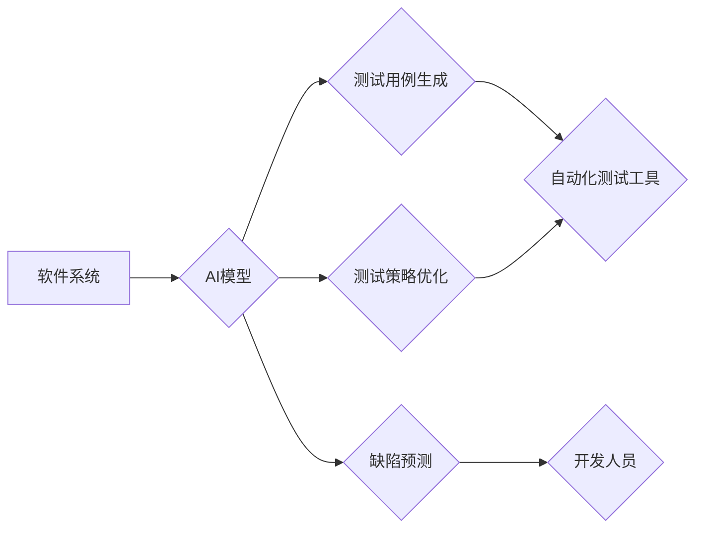

> 自动化测试，人工智能，机器学习，深度学习，测试用例生成，缺陷预测，测试优化

## 1. 背景介绍

在软件开发领域，自动化测试已成为不可或缺的一部分，它可以提高测试效率、降低测试成本，并确保软件质量。然而，传统的自动化测试方法往往依赖于人工编写的测试用例，这不仅耗时费力，而且难以应对复杂软件系统的测试需求。

近年来，人工智能（AI）技术取得了长足发展，特别是机器学习（ML）和深度学习（DL）的兴起，为自动化测试带来了新的机遇。AI技术能够学习和理解软件系统的行为模式，从而自动生成测试用例、预测缺陷、优化测试策略，大幅提升自动化测试的效率和准确性。

## 2. 核心概念与联系

**2.1 自动化测试**

自动化测试是指利用软件工具自动执行测试用例，并根据测试结果进行分析和报告的过程。它可以涵盖多种测试类型，例如单元测试、集成测试、系统测试和验收测试。

**2.2 人工智能**

人工智能是指模拟人类智能行为的计算机系统。它包括多个子领域，例如机器学习、深度学习、自然语言处理和计算机视觉。

**2.3 AI与自动化测试的结合**

将AI技术应用于自动化测试，可以实现以下目标：

* **自动生成测试用例：** AI算法可以分析软件系统的代码、文档和行为模式，自动生成测试用例，减少人工编写的测试用例量。
* **预测缺陷：** AI算法可以学习软件系统的历史缺陷数据，预测潜在的缺陷，帮助开发人员提前修复问题。
* **优化测试策略：** AI算法可以根据软件系统的特性和测试历史数据，优化测试策略，提高测试效率和覆盖率。

**2.4 架构图**



## 3. 核心算法原理 & 具体操作步骤

**3.1 算法原理概述**

AI技术在自动化测试中的应用主要依赖于机器学习算法。常见的机器学习算法包括：

* **监督学习：** 利用标记数据训练模型，例如使用历史缺陷数据训练缺陷预测模型。
* **无监督学习：** 从未标记数据中发现模式，例如使用代码分析数据发现潜在的代码缺陷。
* **强化学习：** 通过试错学习，优化测试策略，例如通过测试结果反馈，调整测试用例的执行顺序。

**3.2 算法步骤详解**

以自动生成测试用例为例，其算法步骤如下：

1. **数据收集：** 收集软件系统的代码、文档、测试用例等数据。
2. **数据预处理：** 对数据进行清洗、转换和特征提取，例如将代码转换为语法树，提取代码结构和语义信息。
3. **模型训练：** 利用机器学习算法训练模型，例如使用深度神经网络学习代码和测试用例之间的关系。
4. **测试用例生成：** 将训练好的模型应用于新的代码，生成新的测试用例。
5. **测试用例评估：** 对生成的测试用例进行评估，例如计算其覆盖率和缺陷检测率。

**3.3 算法优缺点**

**优点：**

* 自动化程度高，提高测试效率。
* 能够发现传统测试方法难以发现的缺陷。
* 可以根据软件系统的变化自动生成新的测试用例。

**缺点：**

* 需要大量的训练数据。
* 模型的训练和评估需要一定的时间和资源。
* 生成的测试用例可能并非最优的。

**3.4 算法应用领域**

AI技术在自动化测试领域的应用非常广泛，例如：

* **Web应用程序测试：** 自动生成测试用例，测试用户界面、功能和性能。
* **移动应用程序测试：** 自动测试应用程序的兼容性、性能和安全性。
* **嵌入式系统测试：** 自动测试硬件和软件的交互行为。
* **大数据测试：** 自动测试大数据处理系统的性能和可靠性。

## 4. 数学模型和公式 & 详细讲解 & 举例说明

**4.1 数学模型构建**

在AI驱动的自动化测试中，常用的数学模型包括：

* **回归模型：** 用于预测连续值，例如预测软件缺陷的严重程度。
* **分类模型：** 用于分类数据，例如分类软件缺陷的类型。
* **聚类模型：** 用于将数据分组，例如将测试用例分组到不同的测试套件中。

**4.2 公式推导过程**

例如，使用线性回归模型预测软件缺陷的严重程度，其数学公式如下：

$$
y = \beta_0 + \beta_1 x_1 + \beta_2 x_2 + ... + \beta_n x_n + \epsilon
$$

其中：

* $y$ 是缺陷的严重程度。
* $\beta_0, \beta_1, ..., \beta_n$ 是模型参数。
* $x_1, x_2, ..., x_n$ 是缺陷的特征变量。
* $\epsilon$ 是误差项。

模型参数可以通过最小二乘法等方法进行估计。

**4.3 案例分析与讲解**

假设我们想要预测软件缺陷的严重程度，并收集了以下数据：

* 缺陷代码行数
* 缺陷修复时间
* 缺陷影响范围

我们可以使用线性回归模型训练一个预测模型，并根据新的缺陷数据预测其严重程度。

## 5. 项目实践：代码实例和详细解释说明

**5.1 开发环境搭建**

* Python 3.x
* TensorFlow 或 PyTorch
* Jupyter Notebook

**5.2 源代码详细实现**

```python
import tensorflow as tf

# 定义模型结构
model = tf.keras.models.Sequential([
    tf.keras.layers.Dense(64, activation='relu', input_shape=(3,)),
    tf.keras.layers.Dense(32, activation='relu'),
    tf.keras.layers.Dense(1)
])

# 编译模型
model.compile(optimizer='adam', loss='mse')

# 训练模型
model.fit(X_train, y_train, epochs=10)

# 预测缺陷严重程度
y_pred = model.predict(X_test)
```

**5.3 代码解读与分析**

* 代码首先定义了一个简单的深度神经网络模型，包含三个全连接层。
* 模型使用 Adam 优化器和均方误差损失函数进行训练。
* 训练数据为 X_train 和 y_train，测试数据为 X_test。
* 训练完成后，可以使用模型预测新的缺陷数据。

**5.4 运行结果展示**

训练完成后，可以评估模型的性能，例如使用均方根误差 (RMSE) 来衡量预测结果的准确性。

## 6. 实际应用场景

**6.1 软件开发流程中的应用**

AI技术可以集成到软件开发流程中，例如：

* **代码审查：** AI算法可以分析代码，识别潜在的缺陷和安全漏洞。
* **测试用例设计：** AI算法可以自动生成测试用例，覆盖软件系统的关键功能和路径。
* **缺陷修复：** AI算法可以分析缺陷报告，推荐可能的修复方案。

**6.2 特定行业应用**

* **金融行业：** AI技术可以用于检测金融欺诈、评估风险和优化投资策略。
* **医疗行业：** AI技术可以用于辅助诊断、预测疾病和个性化治疗。
* **制造业：** AI技术可以用于预测设备故障、优化生产流程和提高产品质量。

**6.4 未来应用展望**

随着AI技术的不断发展，其在自动化测试领域的应用将更加广泛和深入，例如：

* **更智能的测试用例生成：** AI算法将能够生成更精确、更覆盖的测试用例。
* **更精准的缺陷预测：** AI算法将能够更准确地预测软件缺陷，并提供更详细的缺陷分析报告。
* **更自动化的测试流程：** AI技术将能够自动化更多的测试流程，例如测试环境搭建、测试结果分析和测试报告生成。

## 7. 工具和资源推荐

**7.1 学习资源推荐**

* **书籍：**
    * 《人工智能：一种现代方法》
    * 《深度学习》
* **在线课程：**
    * Coursera 上的机器学习课程
    * edX 上的深度学习课程

**7.2 开发工具推荐**

* **TensorFlow：** 开源深度学习框架
* **PyTorch：** 开源深度学习框架
* **Scikit-learn：** 机器学习库

**7.3 相关论文推荐**

* **Automated Test Case Generation Using Machine Learning**
* **Defect Prediction Using Machine Learning Techniques**
* **AI-Powered Test Automation: A Survey**

## 8. 总结：未来发展趋势与挑战

**8.1 研究成果总结**

AI技术在自动化测试领域取得了显著进展，能够有效提高测试效率、准确性和覆盖率。

**8.2 未来发展趋势**

未来，AI技术在自动化测试领域的应用将更加智能、自动化和深入，例如：

* **更强大的AI模型：** 随着算法和计算能力的提升，AI模型将能够更好地理解软件系统，生成更精确的测试用例和预测更准确的缺陷。
* **更广泛的应用场景：** AI技术将应用于更多类型的软件测试，例如性能测试、安全测试和用户体验测试。
* **更紧密的与开发流程的集成：** AI技术将更加紧密地集成到软件开发流程中，例如自动生成测试用例、自动修复缺陷和自动优化测试策略。

**8.3 面临的挑战**

* **数据获取和质量：** AI模型需要大量的训练数据，而获取高质量的测试数据仍然是一个挑战。
* **模型解释性和可信度：** AI模型的决策过程往往难以解释，这可能会影响用户的信任度。
* **伦理和安全问题：** AI技术在自动化测试中的应用也可能带来一些伦理和安全问题，例如算法偏见和数据隐私。

**8.4 研究展望**

未来研究方向包括：

* **开发更有效的AI模型：** 研究更强大的AI算法，例如迁移学习和联邦学习，以提高模型的性能和泛化能力。
* **提高模型解释性和可信度：** 研究可解释AI技术，使AI模型的决策过程更加透明和可理解。
* **解决伦理和安全问题：** 研究AI技术在自动化测试中的伦理和安全问题，并制定相应的规范和标准。

## 9. 附录：常见问题与解答

**9.1 如何选择合适的AI模型？**

选择合适的AI模型取决于具体的应用场景和数据特点。例如，对于预测连续值的问题，可以使用回归模型；对于分类问题，可以使用分类模型。

**9.2 如何评估AI模型的性能？**

常用的评估指标包括准确率、召回率、F1-score、AUC等。

**9.3 如何解决AI模型的过拟合问题？**

可以使用正则化技术、交叉验证和数据增强等方法来解决AI模型的过拟合问题。


作者：禅与计算机程序设计艺术 / Zen and the Art of Computer Programming 
<end_of_turn>