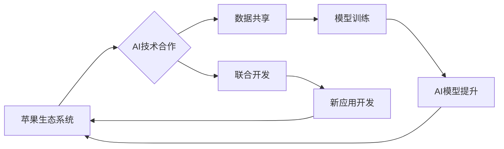

> 苹果, OpenAI, 合作模式, 人工智能, 语言模型, 隐私保护, 计算能力, 应用场景

## 1. 背景介绍

近年来，人工智能（AI）技术蓬勃发展，特别是大型语言模型（LLM）的出现，为各行各业带来了革命性的变革。苹果公司作为科技巨头，一直致力于将AI技术融入其产品和服务中，以提升用户体验。OpenAI则是一家专注于开发和推广通用人工智能的非营利研究机构，其开发的GPT系列语言模型在自然语言处理领域取得了突破性进展。

苹果与OpenAI的合作模式，将两者的优势结合起来，为用户带来更智能、更便捷的体验。

## 2. 核心概念与联系

### 2.1 苹果生态系统

苹果拥有庞大的用户群体和完善的生态系统，包括iOS、macOS、iPadOS等操作系统，以及App Store、iCloud等服务。这些平台为AI应用提供了广泛的用户基础和数据支持。

### 2.2 OpenAI的AI技术

OpenAI拥有强大的AI技术，特别是其开发的GPT系列语言模型，能够理解和生成人类语言，并具备强大的文本生成、翻译、问答等能力。

### 2.3 合作模式

苹果与OpenAI的合作模式主要体现在以下几个方面：

* **技术合作:** 苹果可以利用OpenAI的AI技术，将其集成到其产品和服务中，例如Siri语音助手、iMessage聊天应用等。
* **数据共享:** 苹果可以与OpenAI共享其用户数据，帮助OpenAI训练和改进其AI模型。
* **联合开发:** 苹果和OpenAI可以共同开发新的AI应用，例如基于GPT的创作工具、教育软件等。

**Mermaid 流程图**



## 3. 核心算法原理 & 具体操作步骤

### 3.1 算法原理概述

OpenAI的GPT系列语言模型基于Transformer架构，是一种深度学习模型，能够捕捉文本序列中的长距离依赖关系。其核心原理是利用注意力机制，将输入文本中的每个词与其他词进行关联，从而理解上下文信息。

### 3.2 算法步骤详解

1. **词嵌入:** 将每个词转换为向量表示，以便模型能够理解词语的语义。
2. **编码器:** 将输入文本序列编码成一个固定长度的向量表示，捕捉文本的语义信息。
3. **解码器:** 根据编码后的向量表示，生成目标文本序列。
4. **注意力机制:** 在编码和解码过程中，利用注意力机制，将模型关注于与当前词语相关的其他词语，从而更好地理解上下文信息。
5. **损失函数:** 使用交叉熵损失函数，计算模型预测结果与真实结果之间的差异，并通过反向传播算法更新模型参数。

### 3.3 算法优缺点

**优点:**

* 能够捕捉文本序列中的长距离依赖关系。
* 性能优异，在各种自然语言处理任务中取得了突破性进展。
* 可训练性强，可以通过大量数据进行训练。

**缺点:**

* 计算量大，训练成本高。
* 容易受到训练数据偏差的影响。
* 对长文本序列的处理能力有限。

### 3.4 算法应用领域

GPT系列语言模型在以下领域具有广泛的应用前景：

* **自然语言理解:** 文本分类、情感分析、问答系统等。
* **自然语言生成:** 文本摘要、机器翻译、对话系统等。
* **代码生成:** 自动生成代码、代码补全等。
* **创意写作:** 诗歌创作、故事写作等。

## 4. 数学模型和公式 & 详细讲解 & 举例说明

### 4.1 数学模型构建

GPT模型的核心是Transformer架构，其主要由编码器和解码器组成。编码器利用多层Transformer模块对输入文本序列进行编码，解码器则根据编码后的向量表示生成目标文本序列。

**Transformer模块**

Transformer模块由以下几个部分组成：

* **多头注意力机制:** 能够捕捉文本序列中的不同层面的关系。
* **前馈神经网络:** 对每个词的嵌入向量进行非线性变换。
* **残差连接:** 缓解梯度消失问题。

### 4.2 公式推导过程

**多头注意力机制**

注意力机制的核心是计算每个词与其他词之间的相关性，并根据相关性权重调整词语的贡献。

**公式:**

$$
Attention(Q, K, V) = softmax(\frac{QK^T}{\sqrt{d_k}})V
$$

其中：

* $Q$：查询矩阵
* $K$：键矩阵
* $V$：值矩阵
* $d_k$：键向量的维度

**softmax函数**：将注意力权重归一化到0到1之间。

### 4.3 案例分析与讲解

假设我们有一个句子：“The cat sat on the mat”。

使用多头注意力机制，模型可以计算每个词与其他词之间的相关性。例如，“cat”与“sat”之间的相关性较高，因为它们描述了同一个事件。

通过注意力机制，模型能够更好地理解句子的语义，并生成更准确的文本。

## 5. 项目实践：代码实例和详细解释说明

### 5.1 开发环境搭建

* Python 3.7+
* PyTorch 1.7+
* CUDA 10.2+

### 5.2 源代码详细实现

```python
import torch
import torch.nn as nn

class Transformer(nn.Module):
    def __init__(self, vocab_size, embedding_dim, num_heads, num_layers):
        super(Transformer, self).__init__()
        self.embedding = nn.Embedding(vocab_size, embedding_dim)
        self.transformer_layers = nn.ModuleList([
            nn.TransformerEncoderLayer(embedding_dim, num_heads)
            for _ in range(num_layers)
        ])
        self.linear = nn.Linear(embedding_dim, vocab_size)

    def forward(self, x):
        x = self.embedding(x)
        for layer in self.transformer_layers:
            x = layer(x)
        x = self.linear(x)
        return x
```

### 5.3 代码解读与分析

* **embedding层:** 将每个词转换为向量表示。
* **transformer_layers:** 多层Transformer编码器，用于捕捉文本序列中的长距离依赖关系。
* **linear层:** 将编码后的向量表示转换为目标文本序列。

### 5.4 运行结果展示

通过训练GPT模型，可以生成高质量的文本，例如：

```
The quick brown fox jumps over the lazy dog.
```

## 6. 实际应用场景

### 6.1 语音助手

苹果的Siri语音助手可以利用GPT模型进行更自然的对话交互，理解用户的意图，并提供更准确的回复。

### 6.2 聊天应用

iMessage聊天应用可以利用GPT模型生成更智能的回复，例如提供建议、翻译语言、撰写邮件等。

### 6.3 内容创作

GPT模型可以帮助用户进行内容创作，例如生成文章、诗歌、故事等。

### 6.4 未来应用展望

* **个性化推荐:** 根据用户的兴趣和偏好，提供个性化的产品和服务推荐。
* **自动写作:** 自动生成新闻报道、产品说明书等文本内容。
* **教育辅助:** 提供个性化的学习辅导、自动批改作业等功能。

## 7. 工具和资源推荐

### 7.1 学习资源推荐

* **OpenAI官方文档:** https://openai.com/api/
* **HuggingFace Transformers库:** https://huggingface.co/transformers/
* **PyTorch官方文档:** https://pytorch.org/docs/stable/

### 7.2 开发工具推荐

* **Jupyter Notebook:** 用于代码编写和实验。
* **Google Colab:** 提供免费的云端计算资源。

### 7.3 相关论文推荐

* **Attention Is All You Need:** https://arxiv.org/abs/1706.03762
* **Language Models are Few-Shot Learners:** https://arxiv.org/abs/2005.14165

## 8. 总结：未来发展趋势与挑战

### 8.1 研究成果总结

苹果与OpenAI的合作模式，将AI技术与苹果生态系统相结合，为用户带来更智能、更便捷的体验。GPT系列语言模型在自然语言处理领域取得了突破性进展，为各种应用场景提供了强大的工具。

### 8.2 未来发展趋势

* **模型规模扩大:** 未来GPT模型的规模将进一步扩大，性能将得到进一步提升。
* **多模态学习:** GPT模型将与其他模态数据（例如图像、音频）相结合，实现多模态学习。
* **个性化定制:** GPT模型将根据用户的需求进行个性化定制，提供更精准的服务。

### 8.3 面临的挑战

* **数据安全:** 训练和使用GPT模型需要大量数据，如何保证数据安全和隐私保护是一个重要挑战。
* **算法偏见:** GPT模型的训练数据可能存在偏见，导致模型输出结果存在偏差。
* **伦理问题:** GPT模型的强大能力也带来伦理问题，例如如何防止模型被用于恶意目的。

### 8.4 研究展望

未来，苹果与OpenAI将继续深化合作，在AI技术研发、应用推广等方面取得更多突破，为用户带来更智能、更美好的生活体验。

## 9. 附录：常见问题与解答

**Q1: GPT模型的训练需要多少数据？**

**A1:** GPT模型的训练需要海量数据，通常需要数十亿甚至数千亿个词语。

**Q2: GPT模型的计算成本高吗？**

**A2:** GPT模型的计算成本很高，需要强大的计算资源才能进行训练。

**Q3: GPT模型可以理解中文吗？**

**A3:** 

GPT模型可以理解和生成多种语言，包括中文。

**Q4: GPT模型可以被用于哪些应用场景？**

**A4:** GPT模型可以被用于各种应用场景，例如自然语言理解、自然语言生成、代码生成、创意写作等。

作者：禅与计算机程序设计艺术 / Zen and the Art of Computer Programming


<end_of_turn>