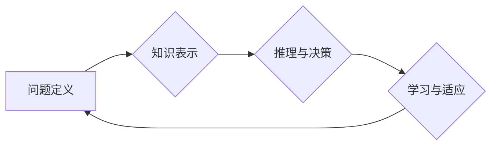

>  人工智能 (AI)、问题解决、创新、算法、机器学习、深度学习、数据分析、应用场景

## 1. 背景介绍

人工智能 (AI) 正在迅速发展，并深刻地改变着我们生活的方方面面。从自动驾驶汽车到个性化医疗，AI 的应用场景日益广泛。然而，AI 的发展并非一帆风顺，其核心挑战之一便是如何提升 AI 系统的解决问题的能力。

传统的 AI 系统往往依赖于大量的标注数据和预先定义的规则，这限制了其在面对复杂、未知问题时的适应性和创新能力。因此，如何赋予 AI 系统更强的解决问题的能力，使其能够像人类一样灵活地思考、分析和解决问题，成为 AI 领域亟待解决的关键问题。

## 2. 核心概念与联系

解决问题的能力是 AI 创新发展的基石。它涉及到多个核心概念的相互关联，包括：

* **问题定义:** 明确问题本质，识别关键信息和目标。
* **知识表示:** 将问题相关知识以机器可理解的形式进行表示，例如符号逻辑、知识图谱等。
* **推理与决策:** 基于已有的知识和推理能力，从多个候选方案中选择最佳解决方案。
* **学习与适应:** 从经验中学习，不断改进解决问题的能力，并适应不断变化的环境。

**Mermaid 流程图:**



## 3. 核心算法原理 & 具体操作步骤

### 3.1  算法原理概述

解决问题的能力的提升离不开算法的创新。近年来，一些新的算法和框架在 AI 领域取得了显著的成果，例如：

* **强化学习 (Reinforcement Learning):** 通过奖励机制，训练 AI 系统在特定环境中学习最优策略，解决复杂决策问题。
* **图神经网络 (Graph Neural Networks):** 能够处理复杂关系和结构化数据，用于解决社交网络分析、推荐系统等问题。
* **生成对抗网络 (Generative Adversarial Networks):** 通过对抗机制，训练生成模型生成逼真的数据，用于图像生成、文本生成等应用。

### 3.2  算法步骤详解

以强化学习为例，其核心步骤包括：

1. **环境建模:** 建立一个模拟真实世界的环境，定义状态、动作、奖励等要素。
2. **策略学习:** 使用强化学习算法，例如 Q 学习或深度 Q 网络，训练一个策略函数，该函数能够根据当前状态选择最优动作。
3. **奖励反馈:** 根据采取的动作和环境的变化，获得奖励信号，反馈给策略函数，引导其学习最优策略。
4. **策略更新:** 根据奖励信号，更新策略函数的参数，使其能够在未来做出更优的决策。

### 3.3  算法优缺点

每个算法都有其自身的优缺点，需要根据具体问题选择合适的算法。例如，强化学习能够解决复杂决策问题，但需要大量的训练数据和计算资源。图神经网络擅长处理关系数据，但对数据结构的假设较为严格。

### 3.4  算法应用领域

解决问题的能力在 AI 领域有着广泛的应用，例如：

* **自动驾驶:** 利用强化学习训练车辆在复杂路况下做出安全决策。
* **医疗诊断:** 利用机器学习分析患者数据，辅助医生进行诊断和治疗方案制定。
* **金融风险管理:** 利用机器学习识别潜在的金融风险，并采取相应的措施进行风险控制。

## 4. 数学模型和公式 & 详细讲解 & 举例说明

### 4.1  数学模型构建

解决问题的能力可以抽象为一个数学模型，其中包括：

* **状态空间:** 所有可能的状态集合。
* **动作空间:** 所有可能的行动集合。
* **转移函数:** 描述从一个状态到另一个状态的概率分布。
* **奖励函数:** 描述在特定状态采取特定行动的奖励。

### 4.2  公式推导过程

强化学习中的 Bellman 方程是描述价值函数更新的公式，其表达式为：

$$
V(s) = \max_{\alpha} \sum_{s' \in S} P(s' | s, \alpha) [R(s, \alpha, s') + \gamma V(s')]
$$

其中：

* $V(s)$ 是状态 $s$ 的价值函数。
* $\alpha$ 是策略。
* $P(s' | s, \alpha)$ 是从状态 $s$ 采取行动 $\alpha$ 进入状态 $s'$ 的概率。
* $R(s, \alpha, s')$ 是在状态 $s$ 采取行动 $\alpha$ 进入状态 $s'$ 的奖励。
* $\gamma$ 是折扣因子，控制未来奖励的权重。

### 4.3  案例分析与讲解

例如，在玩游戏时，强化学习算法可以学习最优策略，以获得最高的得分。游戏环境的状态空间包括游戏中的所有场景和玩家的属性，动作空间包括玩家可以采取的所有行动，例如移动、攻击、使用道具等。奖励函数则定义了在特定状态采取特定行动获得的奖励，例如获得积分、击杀敌人等。通过不断地学习和更新策略，强化学习算法可以帮助玩家找到最优的策略，从而获得更高的得分。

## 5. 项目实践：代码实例和详细解释说明

### 5.1  开发环境搭建

为了实现 AI 解决问题的能力，需要搭建一个合适的开发环境。常用的开发环境包括：

* **Python:** 作为 AI 开发的常用语言，拥有丰富的 AI 库和框架，例如 TensorFlow、PyTorch、Scikit-learn 等。
* **云计算平台:** 例如 AWS、Azure、Google Cloud 等，提供强大的计算资源和 AI 服务，方便 AI 模型的训练和部署。

### 5.2  源代码详细实现

以下是一个简单的强化学习代码示例，使用 Python 和 TensorFlow 库实现一个简单的游戏代理：

```python
import tensorflow as tf

# 定义状态空间和动作空间
state_size = 4
action_size = 2

# 定义神经网络模型
model = tf.keras.models.Sequential([
    tf.keras.layers.Dense(128, activation='relu', input_shape=(state_size,)),
    tf.keras.layers.Dense(action_size)
])

# 定义损失函数和优化器
loss_fn = tf.keras.losses.SparseCategoricalCrossentropy()
optimizer = tf.keras.optimizers.Adam()

# 训练模型
for episode in range(100):
    # ... (游戏环境交互逻辑)
    # ... (计算损失并更新模型参数)
```

### 5.3  代码解读与分析

该代码示例定义了一个简单的强化学习模型，用于控制一个游戏代理。模型接收游戏状态作为输入，输出两个动作的概率分布。通过训练，模型可以学习到最优策略，以获得更高的游戏得分。

### 5.4  运行结果展示

训练完成后，可以将模型部署到游戏环境中，观察代理的行为。如果模型训练成功，代理应该能够在游戏中表现出合理的策略，例如避开障碍物、收集资源、击败敌人等。

## 6. 实际应用场景

解决问题的能力在 AI 领域有着广泛的应用场景，例如：

### 6.1  自动驾驶

自动驾驶系统需要能够感知周围环境、预测其他车辆和行人的行为，并做出最优的驾驶决策。强化学习算法可以训练自动驾驶系统在复杂路况下做出安全决策，例如避开障碍物、变道、停车等。

### 6.2  医疗诊断

医疗诊断需要分析大量的患者数据，例如病历、检查结果、影像资料等，并识别潜在的疾病。机器学习算法可以帮助医生分析患者数据，辅助诊断和制定治疗方案。

### 6.3  金融风险管理

金融风险管理需要识别潜在的金融风险，并采取相应的措施进行风险控制。机器学习算法可以分析金融市场数据，识别潜在的风险信号，例如股票价格波动、信用风险等。

### 6.4  未来应用展望

随着 AI 技术的不断发展，解决问题的能力将成为 AI 创新发展的关键驱动力。未来，AI 系统将能够更加灵活地应对复杂问题，并为人类社会带来更多福祉。

## 7. 工具和资源推荐

### 7.1  学习资源推荐

* **在线课程:** Coursera、edX、Udacity 等平台提供丰富的 AI 课程，涵盖强化学习、机器学习、深度学习等领域。
* **书籍:** 《深度学习》、《机器学习实战》、《强化学习：原理、算法和应用》等书籍是学习 AI 的经典教材。
* **开源项目:** TensorFlow、PyTorch、OpenAI Gym 等开源项目提供了丰富的 AI 工具和资源，方便开发者进行学习和实践。

### 7.2  开发工具推荐

* **Python:** 作为 AI 开发的常用语言，拥有丰富的 AI 库和框架，例如 TensorFlow、PyTorch、Scikit-learn 等。
* **Jupyter Notebook:** 用于编写和执行 Python 代码，方便进行 AI 模型的开发和调试。
* **云计算平台:** 例如 AWS、Azure、Google Cloud 等，提供强大的计算资源和 AI 服务，方便 AI 模型的训练和部署。

### 7.3  相关论文推荐

* **Deep Reinforcement Learning: An Overview**
* **Generative Adversarial Networks**
* **Graph Neural Networks**

## 8. 总结：未来发展趋势与挑战

### 8.1  研究成果总结

近年来，在解决问题的能力方面取得了显著的进展，例如强化学习、图神经网络、生成对抗网络等算法取得了突破性进展。这些算法能够解决复杂决策问题、处理关系数据、生成逼真的数据等，为 AI 创新发展提供了强大的工具。

### 8.2  未来发展趋势

未来，解决问题的能力将继续是 AI 领域的重要研究方向，主要发展趋势包括：

* **更强大的算法:** 开发更强大、更灵活的算法，能够解决更复杂、更未知的问题。
* **更丰富的知识表示:** 探索更丰富的知识表示形式，例如符号逻辑、知识图谱、语义网络等，为 AI 系统提供更全面的知识。
* **更强的泛化能力:** 提升 AI 系统的泛化能力，使其能够适应不同的环境和任务。

### 8.3  面临的挑战

解决问题的能力的提升也面临着一些挑战，例如：

* **数据获取和标注:** 训练 AI 系统需要大量的标注数据，获取和标注数据成本高昂。
* **算法复杂度:** 一些 AI 算法非常复杂，难以理解和调试。
* **伦理问题:** AI 系统的决策可能会带来伦理问题，例如偏见、透明度等。

### 8.4  研究展望

未来，需要加强对解决问题能力的研究，探索更有效的算法、更丰富的知识表示、更强的泛化能力，并解决相关伦理问题，推动 AI 技术的健康发展。

## 9. 附录：常见问题与解答

### 9.1  常见问题

* 如何评估 AI 系统的解决问题能力？
* 如何提高 AI 系统的泛化能力？
* 如何解决 AI 系统的伦理问题？

### 9.2  解答

* 评估 AI 系统的解决问题能力可以通过多种指标，例如准确率、召回率、F1-score 等。
* 提高 AI 系统的泛化能力可以通过数据增强、正则化、迁移学习等技术。
* 解决 AI 系统的伦理问题需要从算法设计、数据标注、应用场景等多个方面进行考虑，并制定相应的伦理规范和监管机制。


作者：禅与计算机程序设计艺术 / Zen and the Art of Computer Programming 
<end_of_turn>