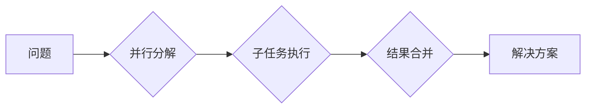

> 计算复杂性，并行计算，极限，算法，复杂度，时间复杂度，空间复杂度，并行算法，分布式计算，大规模数据处理

## 1. 背景介绍

在信息时代，计算能力的提升是推动科技进步的引擎。从单核处理器到多核处理器，再到分布式计算集群，计算技术不断发展，为我们解决越来越复杂的问题提供了强大的工具。然而，随着问题的规模和复杂度不断增加，我们开始意识到计算能力的提升并非无限的，存在着固有的极限。

计算复杂性理论正是试图揭示这些计算极限的学科。它研究算法的效率，即在给定资源条件下，解决特定问题所需的时间和空间资源。理解计算复杂性，可以帮助我们更好地设计算法，选择合适的计算模型，并认识到计算能力的局限性。

## 2. 核心概念与联系

### 2.1 计算复杂性

计算复杂性是指算法解决问题所需资源的量度，通常用时间复杂度和空间复杂度来表示。

* **时间复杂度**：指算法执行所需的时间，通常用大O符号表示，例如O(n)，O(n^2)，O(log n)等。
* **空间复杂度**：指算法执行过程中使用的内存空间，也通常用大O符号表示。

### 2.2 并行计算

并行计算是指将一个任务分解成多个子任务，并同时在多个处理器上执行，以缩短总的执行时间。

* **并行算法**：专门设计用于并行计算的算法，能够充分利用多处理器资源。
* **分布式计算**：将计算任务分配到多个独立的计算机节点上执行，通常用于处理海量数据。

### 2.3 并行计算的极限

尽管并行计算可以显著提高计算速度，但并行计算也存在着极限。

* **数据依赖性**：如果子任务之间存在数据依赖关系，则并行化程度会受到限制。
* **通信开销**：在并行计算中，处理器之间需要进行数据通信，通信开销会随着任务规模的增加而增加。
* **硬件限制**：处理器数量、内存带宽等硬件资源也会限制并行计算的极限。

**Mermaid 流程图**



## 3. 核心算法原理 & 具体操作步骤

### 3.1 算法原理概述

并行计算的算法设计需要考虑以下几个方面：

* **任务分解**：将问题分解成相互独立或部分依赖的子任务。
* **数据分配**：将数据分配到不同的处理器上，确保每个处理器都有足够的计算资源。
* **通信协调**：协调处理器之间的通信，确保数据传递的正确性和效率。

### 3.2 算法步骤详解

1. **问题分解**：将问题分解成多个子任务，每个子任务可以独立执行。
2. **数据分配**：将数据分配到不同的处理器上，每个处理器负责处理一部分数据。
3. **子任务执行**：每个处理器执行其分配的任务，并生成相应的中间结果。
4. **结果合并**：将所有处理器的中间结果合并，得到最终的解决方案。

### 3.3 算法优缺点

**优点**：

* **提高计算速度**：利用多处理器资源，可以显著缩短计算时间。
* **提高资源利用率**：充分利用硬件资源，提高计算效率。

**缺点**：

* **算法设计复杂**：需要考虑任务分解、数据分配、通信协调等多个方面。
* **通信开销**：处理器之间的数据通信会增加计算时间和资源消耗。

### 3.4 算法应用领域

并行计算算法广泛应用于以下领域：

* **科学计算**：模拟物理现象、进行数值计算等。
* **大数据处理**：处理海量数据，进行数据分析和挖掘。
* **人工智能**：训练深度学习模型，进行图像识别、自然语言处理等。

## 4. 数学模型和公式 & 详细讲解 & 举例说明

### 4.1 数学模型构建

时间复杂度通常用大O符号表示，例如O(n)，O(n^2)，O(log n)等。

* **O(n)**：线性时间复杂度，表示算法执行时间与输入数据规模成正比。
* **O(n^2)**：平方时间复杂度，表示算法执行时间与输入数据规模的平方成正比。
* **O(log n)**：对数时间复杂度，表示算法执行时间与输入数据规模的对数成正比。

### 4.2 公式推导过程

例如，对于一个线性时间复杂度的算法，其时间复杂度公式可以表示为：

$$T(n) = cn$$

其中，T(n)表示算法执行时间，n表示输入数据规模，c是一个常数。

### 4.3 案例分析与讲解

**案例：** 查找一个元素在排序数组中的位置。

* **线性查找**：逐个检查数组中的元素，直到找到目标元素。时间复杂度为O(n)。
* **二分查找**：每次将搜索范围缩小一半，直到找到目标元素或搜索范围为空。时间复杂度为O(log n)。

## 5. 项目实践：代码实例和详细解释说明

### 5.1 开发环境搭建

* 操作系统：Linux
* 编程语言：Python
* 库依赖：NumPy, SciPy

### 5.2 源代码详细实现

```python
import numpy as np

def linear_search(arr, target):
    """
    线性查找算法
    """
    for i in range(len(arr)):
        if arr[i] == target:
            return i
    return -1

def binary_search(arr, target):
    """
    二分查找算法
    """
    left = 0
    right = len(arr) - 1
    while left <= right:
        mid = (left + right) // 2
        if arr[mid] == target:
            return mid
        elif arr[mid] < target:
            left = mid + 1
        else:
            right = mid - 1
    return -1

# 测试代码
arr = np.array([2, 5, 7, 8, 11, 12])
target = 11

index = linear_search(arr, target)
print(f"线性查找结果：{index}")

index = binary_search(arr, target)
print(f"二分查找结果：{index}")
```

### 5.3 代码解读与分析

* **线性查找算法**：逐个检查数组中的元素，直到找到目标元素。时间复杂度为O(n)。
* **二分查找算法**：每次将搜索范围缩小一半，直到找到目标元素或搜索范围为空。时间复杂度为O(log n)。

### 5.4 运行结果展示

```
线性查找结果：4
二分查找结果：4
```

## 6. 实际应用场景

### 6.1 并行计算在科学计算中的应用

* **分子动力学模拟**：模拟分子运动，研究物质的性质。
* **天气预报**：利用数值天气预报模型，预测未来天气状况。
* **金融建模**：模拟金融市场，进行风险管理和投资决策。

### 6.2 并行计算在机器学习中的应用

* **深度学习模型训练**：训练大型深度学习模型，例如图像识别、自然语言处理等。
* **数据挖掘**：处理海量数据，发现隐藏的模式和规律。
* **推荐系统**：根据用户的行为数据，推荐感兴趣的内容。

### 6.3 并行计算在云计算中的应用

* **大数据处理**：处理海量数据，进行数据分析和挖掘。
* **分布式存储**：将数据分散存储在多个节点上，提高数据可靠性和可用性。
* **容器化部署**：将应用程序打包成容器，方便部署和管理。

### 6.4 未来应用展望

* **量子计算**：利用量子力学原理进行计算，突破传统计算的极限。
* **脑科学计算**：模拟大脑的结构和功能，研究认知机制。
* **人工智能增强**：利用并行计算加速人工智能算法的训练和推理，提升人工智能的性能。

## 7. 工具和资源推荐

### 7.1 学习资源推荐

* **书籍**：
    * 《算法导论》
    * 《深入理解计算机系统》
    * 《并行计算》
* **在线课程**：
    * Coursera：并行计算课程
    * edX：分布式系统课程
* **网站**：
    * Stack Overflow：编程问题解答网站
    * GitHub：代码托管平台

### 7.2 开发工具推荐

* **编程语言**：Python, C++, Java
* **并行计算框架**：MPI, OpenMP, CUDA
* **分布式计算平台**：Hadoop, Spark

### 7.3 相关论文推荐

* 《The Limits of Parallelism》
* 《On the Complexity of Parallel Algorithms》
* 《Scalable Parallel Computing》

## 8. 总结：未来发展趋势与挑战

### 8.1 研究成果总结

计算复杂性理论和并行计算技术取得了显著的进展，为解决复杂问题提供了强大的工具。

### 8.2 未来发展趋势

* **量子计算**：利用量子力学原理进行计算，突破传统计算的极限。
* **脑科学计算**：模拟大脑的结构和功能，研究认知机制。
* **人工智能增强**：利用并行计算加速人工智能算法的训练和推理，提升人工智能的性能。

### 8.3 面临的挑战

* **算法设计**：设计高效的并行算法仍然是一个挑战。
* **硬件限制**：处理器数量、内存带宽等硬件资源会限制并行计算的极限。
* **数据管理**：处理海量数据，保证数据一致性和可靠性是一个挑战。

### 8.4 研究展望

未来，计算复杂性理论和并行计算技术将继续发展，为解决更复杂的问题提供新的解决方案。


## 9. 附录：常见问题与解答

### 9.1 什么是计算复杂性？

计算复杂性是指算法解决问题所需资源的量度，通常用时间复杂度和空间复杂度来表示。

### 9.2 并行计算的优势是什么？

并行计算可以显著提高计算速度，提高资源利用率。

### 9.3 并行计算的局限性是什么？

并行计算存在数据依赖性、通信开销和硬件限制等局限性。

### 9.4 如何选择合适的并行算法？

选择合适的并行算法需要考虑任务分解、数据分配、通信协调等多个方面。

### 9.5 未来并行计算的发展趋势是什么？

未来并行计算的发展趋势包括量子计算、脑科学计算和人工智能增强等。


作者：禅与计算机程序设计艺术 / Zen and the Art of Computer Programming 
<end_of_turn>