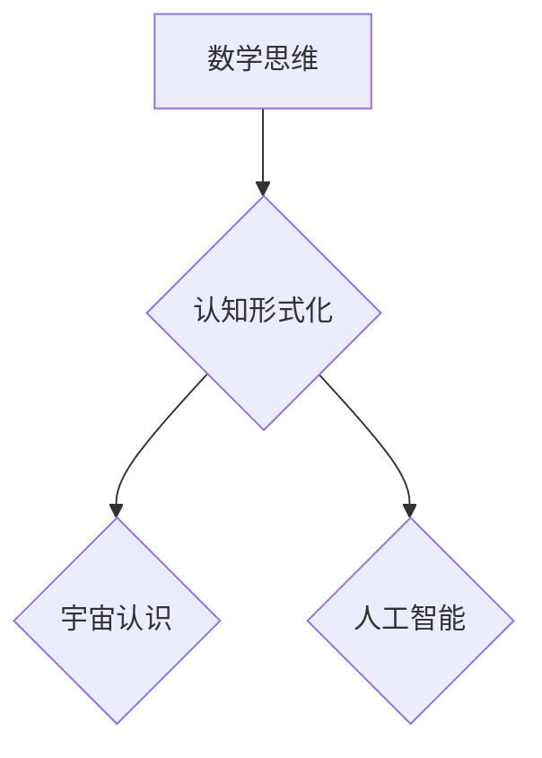

> 数学思维，认知形式化，宇宙认识，逻辑推理，算法设计，编程语言，计算机科学，人工智能

## 1. 背景介绍

人类自古以来就对宇宙的起源、演化和本质抱有强烈的求知欲。从神话传说到科学理论，我们不断地探索和理解这个世界。而数学思维，作为一种独特的认知方式，在认识宇宙的过程中扮演着至关重要的角色。

数学思维的核心在于逻辑推理和抽象建模。它以符号和公式为工具，构建严谨的逻辑体系，并通过推理和推导来揭示事物之间的内在联系和规律。这种形式化的思维方式，能够帮助我们从纷繁复杂的现象中抽取本质，建立对宇宙的深刻理解。

## 2. 核心概念与联系

**2.1 数学思维与认知形式化**

认知形式化是指将人类的思维过程和知识表示为一种形式化的语言或符号系统。数学思维正是认知形式化的典范。它通过符号、逻辑规则和推理方法，将抽象的概念和关系转化为可操作的模型，从而实现对复杂问题的分析和解决。

**2.2 数学思维与宇宙认识**

数学思维为我们认识宇宙提供了强大的工具。

* **描述宇宙规律:**  物理学、天文学等学科都依赖于数学模型来描述宇宙的运行规律。例如，牛顿的万有引力定律、爱因斯坦的相对论等，都是用数学公式表达的宇宙基本规律。
* **预测宇宙演化:** 通过数学模型和计算机模拟，我们可以预测宇宙的未来演化趋势，例如大爆炸理论、宇宙膨胀等。
* **探索宇宙奥秘:** 数学思维帮助我们探索宇宙的深层奥秘，例如黑洞、暗物质、暗能量等。

**2.3 数学思维与人工智能**

人工智能的发展离不开数学思维。

* **算法设计:**  人工智能算法的核心是数学模型和逻辑推理。例如，深度学习算法依赖于神经网络的数学结构和权重调整。
* **知识表示:**  人工智能系统需要用数学形式来表示知识和推理规则。例如，知识图谱利用数学关系来描述实体之间的连接。
* **智能决策:**  人工智能系统通过数学模型和逻辑推理来进行智能决策。例如，推荐系统利用用户行为数据和数学模型来预测用户喜好。

**Mermaid 流程图**



## 3. 核心算法原理 & 具体操作步骤

**3.1 算法原理概述**

在认知形式化和宇宙认识领域，许多核心算法都基于数学原理。例如，逻辑推理算法、图论算法、概率统计算法等，都能够帮助我们从数据中提取信息、建立知识模型、进行预测和决策。

**3.2 算法步骤详解**

以逻辑推理算法为例，其基本步骤如下：

1. **知识表示:** 将知识表示为逻辑公式或知识图谱。
2. **推理规则:** 定义逻辑推理规则，例如蕴涵、归结、联想等。
3. **推理过程:** 根据推理规则，从已知知识出发，推导出新的结论。
4. **结果验证:** 验证推理结果的正确性和一致性。

**3.3 算法优缺点**

逻辑推理算法具有以下优点：

* **严谨性:** 基于逻辑规则，推理过程严格可控。
* **可解释性:** 推理过程透明，易于理解和解释。
* **可扩展性:** 可以扩展到处理更复杂的问题。

但也存在一些缺点：

* **知识表达的复杂性:** 将复杂知识表示为逻辑公式可能很困难。
* **推理效率:** 对于大型知识库，推理过程可能很耗时。
* **缺乏对不确定性的处理:** 逻辑推理算法难以处理不确定性信息。

**3.4 算法应用领域**

逻辑推理算法广泛应用于以下领域：

* **人工智能:** 知识推理、智能问答、自然语言理解等。
* **数据库:** 查询优化、数据挖掘等。
* **软件工程:** 代码分析、软件验证等。

## 4. 数学模型和公式 & 详细讲解 & 举例说明

**4.1 数学模型构建**

在认识宇宙的过程中，数学模型扮演着至关重要的角色。数学模型是一种抽象的描述，它将现实世界中的复杂现象简化为数学公式和关系。

例如，牛顿的万有引力定律可以用以下公式表示：

$$F = G \frac{m_1 m_2}{r^2}$$

其中：

* $F$ 是引力大小
* $G$ 是万有引力常数
* $m_1$ 和 $m_2$ 是两个物体的质量
* $r$ 是两个物体之间的距离

这个公式描述了两个物体之间相互吸引的力的大小，以及与距离和质量的关系。

**4.2 公式推导过程**

数学模型的构建需要通过一系列的推导和验证。例如，爱因斯坦的相对论是基于牛顿力学和光速不变原理推导出来的。

相对论的核心思想是：

* **时间和空间是相对的:** 不同的观察者在不同的参考系下，会对时间和空间的测量结果有所不同。
* **光速是绝对的:** 无论观察者以何种速度运动，光速都是恒定的。

这些思想导致了时间膨胀、长度收缩等现象。

**4.3 案例分析与讲解**

数学模型可以用来预测和解释宇宙的各种现象。例如，大爆炸理论通过数学模型和计算机模拟，解释了宇宙的起源和演化。

根据大爆炸理论，宇宙起源于一个极其高温、高密度的状态，并经历了漫长的膨胀和冷却过程。通过数学模型，我们可以预测宇宙的年龄、膨胀速度、元素组成等。

## 5. 项目实践：代码实例和详细解释说明

**5.1 开发环境搭建**

为了演示数学思维在实际应用中的效果，我们可以使用Python语言编写一个简单的逻辑推理程序。

需要安装Python语言环境和一些相关的库，例如SymPy库用于进行符号计算。

**5.2 源代码详细实现**

```python
from sympy import symbols, Eq, solve

# 定义符号变量
x, y = symbols('x y')

# 定义逻辑公式\nequation = Eq(x + y, 5)

# 求解公式
solution = solve(equation, x)

# 打印结果
print(f"当 x + y = 5 时，x 的解为：{solution}")
```

**5.3 代码解读与分析**

这段代码首先定义了两个符号变量x和y，然后定义了一个逻辑公式x+y=5。

使用SymPy库的solve函数，我们可以求解这个公式，得到x的解。

**5.4 运行结果展示**

运行这段代码，输出结果为：

```
当 x + y = 5 时，x 的解为：[5 - y]
```

这表明，当x+y=5时，x的值取决于y的值。

## 6. 实际应用场景

**6.1 宇宙学研究**

数学模型和算法在宇宙学研究中发挥着至关重要的作用。例如，通过模拟宇宙的演化过程，我们可以预测宇宙的未来命运，探索暗物质和暗能量等宇宙奥秘。

**6.2 天文学观测**

天文学家利用数学模型和算法来分析观测数据，例如恒星的运动轨迹、星系的结构等，从而揭示宇宙的演化历史和规律。

**6.3 人工智能发展**

人工智能的发展离不开数学思维。例如，深度学习算法依赖于神经网络的数学结构和权重调整，自然语言处理算法利用统计模型和逻辑推理来理解和生成语言。

**6.4 未来应用展望**

随着计算机科学和人工智能技术的不断发展，数学思维在认识宇宙和解决人类问题的应用将更加广泛。例如，我们可以利用数学模型和算法来预测和应对气候变化、开发新的能源技术、探索宇宙的奥秘等。

## 7. 工具和资源推荐

**7.1 学习资源推荐**

* **书籍:**
    * 《数学思维》 -  马丁·加德纳
    * 《Gödel, Escher, Bach: An Eternal Golden Braid》 -  Douglas Hofstadter
    * 《The Emperor's New Mind: Concerning Computers, Minds, and the Laws of Physics》 -  Roger Penrose
* **在线课程:**
    * Coursera: Mathematics for Machine Learning
    * edX: Introduction to Logic and Proofs
    * MIT OpenCourseWare: Mathematics for Computer Science

**7.2 开发工具推荐**

* **Python:**  Python是一种广泛使用的编程语言，拥有丰富的数学库和工具，例如NumPy、SciPy、SymPy等。
* **MATLAB:** MATLAB是一种专门用于数学计算和图形分析的软件。
* **Wolfram Mathematica:** Wolfram Mathematica是一种功能强大的数学软件，可以进行符号计算、数值计算、图形可视化等。

**7.3 相关论文推荐**

* **The Mathematical Universe Hypothesis** - Max Tegmark
* **A Brief History of Time** - Stephen Hawking
* **The Fabric of the Cosmos** - Brian Greene

## 8. 总结：未来发展趋势与挑战

**8.1 研究成果总结**

数学思维为我们认识宇宙提供了强大的工具，帮助我们理解宇宙的规律、预测宇宙的演化、探索宇宙的奥秘。

**8.2 未来发展趋势**

未来，数学思维在认识宇宙和解决人类问题的应用将更加广泛。例如，我们可以利用更复杂的数学模型和算法来模拟宇宙的演化过程，探索更深层的宇宙奥秘。

**8.3 面临的挑战**

在认识宇宙的过程中，我们仍然面临着许多挑战。例如，我们对宇宙的起源、演化和最终命运仍然有很多未知。

**8.4 研究展望**

未来，我们需要继续探索新的数学工具和方法，以更好地理解宇宙的奥秘。


## 9. 附录：常见问题与解答

**9.1 如何将数学思维应用到实际问题中？**

将数学思维应用到实际问题中，需要将问题抽象为数学模型，并利用数学工具和算法进行分析和解决。

**9.2 数学思维与直觉思维有什么区别？**

数学思维是一种形式化的思维方式，它依赖于逻辑推理和抽象建模。而直觉思维是一种基于经验和直感的思维方式，它更依赖于情感和直觉。

**9.3 数学思维对人工智能的发展有什么影响？**

数学思维是人工智能发展的基础。人工智能算法的核心是数学模型和逻辑推理。


作者：禅与计算机程序设计艺术 / Zen and the Art of Computer Programming 
<end_of_turn>