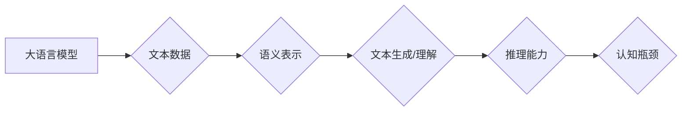

> 大语言模型，推理能力，认知瓶颈，知识表示，逻辑推理，常识推理

## 1. 背景介绍

近年来，大语言模型（LLM）在自然语言处理领域取得了令人瞩目的成就。从文本生成、翻译到问答和代码编写，LLM展现出强大的能力，甚至被认为是人工智能领域的一项重大突破。然而，尽管LLM在许多任务上表现出色，但它们在推理能力方面仍然存在着显著的局限性。

传统的AI系统通常依赖于明确的规则和逻辑推理来解决问题。而LLM则通过学习海量文本数据，建立起复杂的语义表示，并利用这些表示进行预测和生成。这种基于统计学习的模式虽然在文本理解和生成方面取得了成功，但它并不具备人类一样的逻辑推理能力。

## 2. 核心概念与联系

**2.1  大语言模型 (LLM)**

大语言模型是指在海量文本数据上训练的深度学习模型，能够理解和生成人类语言。它们通常基于Transformer架构，拥有大量的参数，能够捕捉语言的复杂结构和语义关系。

**2.2  推理能力**

推理能力是指根据已知信息推导出新的知识或结论的能力。它包括逻辑推理、常识推理、因果推理等多种类型。

**2.3  认知瓶颈**

认知瓶颈是指人工智能系统在模拟人类认知能力方面面临的挑战。例如，LLM虽然能够生成流畅的文本，但它们难以理解文本背后的深层含义，也难以进行复杂的逻辑推理和常识推理。

**2.4  知识表示**

知识表示是指将知识以机器可理解的形式进行存储和组织。有效的知识表示能够帮助AI系统更好地理解和推理。

**2.5  逻辑推理**

逻辑推理是指根据逻辑规则和已知事实推导出新的结论。

**2.6  常识推理**

常识推理是指基于人类的常识知识进行推理。

**Mermaid 流程图**



## 3. 核心算法原理 & 具体操作步骤

### 3.1  算法原理概述

目前，LLM的推理能力主要依赖于以下几种算法：

* **基于模板的推理:** 将推理问题映射到预定义的模板，并根据模板规则进行推理。
* **基于规则的推理:** 使用人工定义的规则进行推理，例如逻辑规则、常识规则等。
* **基于图的推理:** 将知识表示为图结构，并使用图神经网络进行推理。
* **强化学习:** 使用强化学习算法训练模型，使其能够在推理任务中获得奖励。

### 3.2  算法步骤详解

以基于模板的推理为例，其具体步骤如下：

1. **问题分析:** 将推理问题分解成多个子问题，并识别出需要推理的实体和关系。
2. **模板匹配:** 将子问题与预定义的模板进行匹配，找到合适的推理模板。
3. **参数填充:** 将推理问题中的实体和关系填充到模板中。
4. **规则应用:** 根据模板规则进行推理，生成新的结论。
5. **结果整合:** 将多个子问题的结论整合在一起，得到最终的推理结果。

### 3.3  算法优缺点

**优点:**

* 能够处理一些结构化的推理问题。
* 规则易于理解和维护。

**缺点:**

* 难以处理复杂、非结构化的推理问题。
* 模板需要人工设计，且难以覆盖所有可能的推理场景。

### 3.4  算法应用领域

* **问答系统:** 回答用户提出的问题。
* **对话系统:** 与用户进行自然语言对话。
* **文本摘要:** 生成文本的简要概述。
* **机器翻译:** 将文本从一种语言翻译成另一种语言。

## 4. 数学模型和公式 & 详细讲解 & 举例说明

### 4.1  数学模型构建

在LLM中，文本通常表示为一个序列的单词或词嵌入。每个单词或词嵌入是一个向量，其维度代表单词的语义特征。

**4.1.1 词嵌入**

词嵌入是一种将单词映射到向量空间的技术。常用的词嵌入方法包括Word2Vec、GloVe和FastText。

**4.1.2 Transformer架构**

Transformer是一种基于注意力机制的深度学习模型，能够捕捉文本序列中的长距离依赖关系。

**4.1.3 注意力机制**

注意力机制是一种允许模型关注输入序列中特定部分的机制。它通过计算每个单词与其他单词之间的相关性，并根据相关性赋予每个单词不同的权重。

### 4.2  公式推导过程

Transformer架构的核心是多头注意力机制和前馈神经网络。

**4.2.1 多头注意力机制**

多头注意力机制可以并行计算多个注意力头，并通过拼接和线性变换将它们组合起来。

$$
Attention(Q, K, V) = softmax(\frac{QK^T}{\sqrt{d_k}})V
$$

其中：

* $Q$：查询矩阵
* $K$：键矩阵
* $V$：值矩阵
* $d_k$：键向量的维度

**4.2.2 前馈神经网络**

前馈神经网络是一个多层感知机，用于对注意力机制输出进行进一步的处理。

$$
FFN(x) = \sigma(W_1x + b_1)
$$

其中：

* $x$：注意力机制输出
* $W_1$：权重矩阵
* $b_1$：偏置项
* $\sigma$：激活函数

### 4.3  案例分析与讲解

例如，在机器翻译任务中，Transformer模型可以将源语言文本序列映射到目标语言文本序列。

**4.3.1 源语言编码**

Transformer模型首先将源语言文本序列编码成一个隐藏状态向量。

**4.3.2 目标语言解码**

然后，模型使用目标语言词汇表和隐藏状态向量解码生成目标语言文本序列。

**4.3.3 注意力机制**

注意力机制允许模型关注源语言文本序列中与目标语言词汇相关的部分，从而提高翻译质量。

## 5. 项目实践：代码实例和详细解释说明

### 5.1  开发环境搭建

* Python 3.7+
* PyTorch 1.7+
* CUDA 10.2+

### 5.2  源代码详细实现

```python
import torch
import torch.nn as nn

class Transformer(nn.Module):
    def __init__(self, vocab_size, embedding_dim, num_heads, num_layers):
        super(Transformer, self).__init__()
        self.embedding = nn.Embedding(vocab_size, embedding_dim)
        self.transformer_layers = nn.ModuleList([
            nn.TransformerEncoderLayer(embedding_dim, num_heads)
            for _ in range(num_layers)
        ])
        self.linear = nn.Linear(embedding_dim, vocab_size)

    def forward(self, x):
        x = self.embedding(x)
        for layer in self.transformer_layers:
            x = layer(x)
        x = self.linear(x)
        return x
```

### 5.3  代码解读与分析

* `__init__` 方法初始化模型参数，包括词嵌入层、Transformer编码器层和线性输出层。
* `forward` 方法定义模型的正向传播过程，将输入序列映射到输出序列。

### 5.4  运行结果展示

训练好的Transformer模型可以用于各种自然语言处理任务，例如机器翻译、文本摘要和问答系统。

## 6. 实际应用场景

### 6.1  聊天机器人

LLM可以用于构建更智能的聊天机器人，能够理解用户的意图并进行自然流畅的对话。

### 6.2  文本生成

LLM可以用于生成各种类型的文本，例如文章、故事、诗歌和代码。

### 6.3  问答系统

LLM可以用于构建问答系统，能够回答用户提出的问题，并提供相关信息。

### 6.4  未来应用展望

LLM在未来将有更广泛的应用场景，例如：

* **个性化教育:** 根据学生的学习情况提供个性化的学习内容和辅导。
* **医疗诊断:** 辅助医生进行疾病诊断和治疗方案制定。
* **法律服务:** 帮助律师进行法律研究和案件分析。

## 7. 工具和资源推荐

### 7.1  学习资源推荐

* **课程:**
    * Stanford CS224N: Natural Language Processing with Deep Learning
    * MIT 6.S191: Introduction to Deep Learning
* **书籍:**
    * Deep Learning by Ian Goodfellow, Yoshua Bengio, and Aaron Courville
    * Speech and Language Processing by Daniel Jurafsky and James H. Martin
* **博客:**
    * The Gradient
    * OpenAI Blog

### 7.2  开发工具推荐

* **PyTorch:** 深度学习框架
* **TensorFlow:** 深度学习框架
* **Hugging Face Transformers:** 预训练模型库

### 7.3  相关论文推荐

* **Attention Is All You Need** (Vaswani et al., 2017)
* **BERT: Pre-training of Deep Bidirectional Transformers for Language Understanding** (Devlin et al., 2018)
* **GPT-3: Language Models are Few-Shot Learners** (Brown et al., 2020)

## 8. 总结：未来发展趋势与挑战

### 8.1  研究成果总结

近年来，LLM取得了显著的进展，在许多自然语言处理任务上取得了突破性成果。

### 8.2  未来发展趋势

* **更强大的模型:** 训练更大规模、更复杂的LLM模型。
* **更有效的训练方法:** 开发更有效的训练方法，例如自监督学习和强化学习。
* **更好的知识表示:** 研究更有效的知识表示方法，帮助LLM更好地理解和推理。
* **更广泛的应用场景:** 将LLM应用于更多领域，例如医疗、教育和法律。

### 8.3  面临的挑战

* **数据偏见:** LLM模型容易受到训练数据中的偏见影响。
* **可解释性:** LLM模型的决策过程难以解释，这使得它们难以被信任。
* **安全性和隐私:** LLM模型可能被用于恶意目的，例如生成虚假信息和进行身份盗窃。

### 8.4  研究展望

未来，LLM研究将继续朝着更强大、更安全、更可解释的方向发展。

## 9. 附录：常见问题与解答

**Q1: LLM模型的训练需要多少数据？**

A1: LLM模型的训练需要海量文本数据，通常需要数十亿甚至数千亿个单词。

**Q2: LLM模型的推理速度如何？**

A2: LLM模型的推理速度取决于模型的大小和硬件配置。大型LLM模型的推理速度相对较慢。

**Q3: 如何解决LLM模型的数据偏见问题？**

A3: 可以通过使用更均衡的数据集、进行数据清洗和去噪、以及使用对抗训练等方法来解决LLM模型的数据偏见问题。


作者：禅与计算机程序设计艺术 / Zen and the Art of Computer Programming 
<end_of_turn>