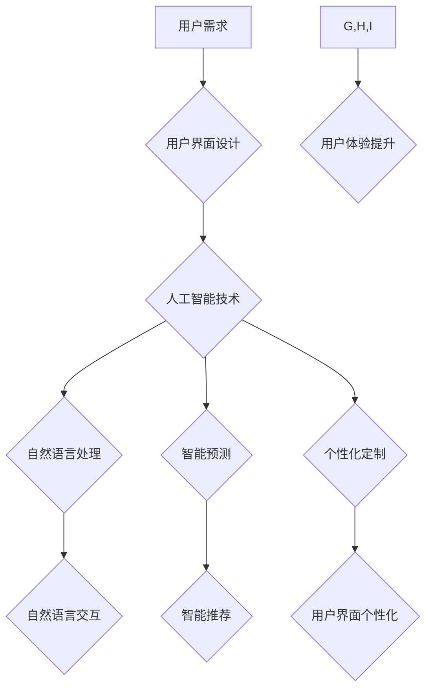

> 软件2.0, 用户界面设计, 人机交互, 自然语言处理, 认知科学, 增强现实, 虚拟现实, 跨平台, 智能化

## 1. 背景介绍

随着人工智能、大数据、云计算等技术的飞速发展，软件行业正经历一场深刻的变革。传统的软件开发模式和用户界面设计理念已经难以满足日益增长的用户需求。软件2.0应运而生，它以用户体验为核心，融合了人工智能、认知科学、增强现实等前沿技术，旨在打造更加智能、人性化、沉浸式的用户界面。

传统的软件界面设计往往以功能性为主，界面结构复杂，操作流程繁琐，用户体验较差。而软件2.0的用户界面设计则更加注重用户体验，强调直观、易用、个性化。它将人工智能技术融入到用户界面设计中，例如：

* **自然语言交互:** 用户可以使用自然语言与软件进行交互，无需学习复杂的命令或操作流程。
* **智能预测:** 软件可以根据用户的行为模式和历史数据，智能预测用户的需求，并提前提供相关信息或服务。
* **个性化定制:** 用户可以根据自己的喜好和需求，定制软件的界面风格、功能布局等。

## 2. 核心概念与联系

软件2.0的用户界面设计的核心概念包括：

* **用户中心设计:** 将用户需求放在首位，以用户体验为导向，设计出更加人性化的界面。
* **智能化交互:** 利用人工智能技术，实现更加自然、智能的交互方式，例如自然语言处理、语音识别、图像识别等。
* **沉浸式体验:** 通过增强现实、虚拟现实等技术，打造更加沉浸式的用户体验，让用户仿佛身临其境。
* **跨平台兼容:** 软件界面能够在不同平台（例如移动设备、桌面电脑、智能家居等）上保持一致性，提供统一的用户体验。

**Mermaid 流程图:**



## 3. 核心算法原理 & 具体操作步骤

### 3.1  算法原理概述

软件2.0的用户界面设计涉及到多种算法，例如自然语言处理算法、机器学习算法、深度学习算法等。这些算法共同作用，实现智能化交互、个性化定制、沉浸式体验等功能。

### 3.2  算法步骤详解

以自然语言处理算法为例，其具体操作步骤如下：

1. **文本预处理:** 对用户输入的文本进行清洗、分词、词性标注等处理，去除停用词、标点符号等，将文本转换为机器可理解的格式。
2. **语义分析:** 利用词向量、句法分析等技术，分析文本的语义结构，识别出关键信息和用户意图。
3. **意图识别:** 根据语义分析结果，识别出用户的意图，例如查询信息、执行操作、表达情感等。
4. **对话管理:** 根据用户的意图，选择合适的回复方式，并进行对话管理，引导用户完成任务或满足需求。

### 3.3  算法优缺点

**优点:**

* **自然流畅:** 用户可以使用自然语言与软件进行交互，更加方便、直观。
* **智能化:** 算法可以理解用户的意图，提供更加精准、个性化的服务。
* **扩展性强:** 可以扩展到多种场景和应用领域。

**缺点:**

* **理解复杂性:** 自然语言的表达方式复杂多样，算法需要处理大量的语义信息，难度较高。
* **数据依赖:** 自然语言处理算法需要大量的训练数据，才能达到较高的准确率。
* **伦理问题:** 自然语言交互可能会带来一些伦理问题，例如隐私泄露、信息误导等。

### 3.4  算法应用领域

自然语言处理算法在软件2.0的用户界面设计中有着广泛的应用，例如：

* **智能客服:** 自动回复用户咨询，提供24小时在线服务。
* **语音助手:** 通过语音识别和自然语言理解，帮助用户完成各种任务，例如设置闹钟、播放音乐、查询天气等。
* **智能搜索:** 理解用户的搜索意图，提供更加精准的搜索结果。
* **个性化推荐:** 根据用户的行为数据和偏好，推荐个性化的内容和服务。

## 4. 数学模型和公式 & 详细讲解 & 举例说明

### 4.1  数学模型构建

在软件2.0的用户界面设计中，可以使用数学模型来描述用户行为、界面交互等复杂现象。例如，可以使用马尔科夫模型来预测用户的下一个操作，可以使用贝叶斯网络来分析用户行为之间的关系。

### 4.2  公式推导过程

以马尔科夫模型为例，其核心公式如下：

$$P(s_t|s_{t-1}) = \frac{P(s_t, s_{t-1})}{P(s_{t-1})}$$

其中：

* $P(s_t|s_{t-1})$ 表示在状态 $s_{t-1}$ 下，下一个状态为 $s_t$ 的概率。
* $P(s_t, s_{t-1})$ 表示状态 $s_t$ 和 $s_{t-1}$ 同时出现的概率。
* $P(s_{t-1})$ 表示状态 $s_{t-1}$ 出现的概率。

### 4.3  案例分析与讲解

假设用户在浏览网页时，会经历以下几种状态：

* $s_1$: 阅读标题
* $s_2$: 阅读正文
* $s_3$: 点击链接
* $s_4$: 返回上一页

我们可以根据用户的浏览历史数据，训练马尔科夫模型，预测用户下一个操作的状态。例如，如果用户当前状态为 $s_1$，那么根据模型预测，用户下一个操作可能是 $s_2$ 或 $s_3$。

## 5. 项目实践：代码实例和详细解释说明

### 5.1  开发环境搭建

为了实现软件2.0的用户界面设计，需要搭建相应的开发环境。常用的开发工具包括：

* **编程语言:** Python、Java、C++ 等
* **人工智能框架:** TensorFlow、PyTorch、Keras 等
* **界面开发工具:** React、Angular、Vue.js 等

### 5.2  源代码详细实现

以下是一个简单的自然语言处理代码实例，使用 Python 和 NLTK 库实现文本分词功能：

```python
import nltk

# 下载 NLTK 数据包
nltk.download('punkt')

# 文本分词
text = "今天天气很好，适合出去散步。"
tokens = nltk.word_tokenize(text)

# 打印分词结果
print(tokens)
```

### 5.3  代码解读与分析

这段代码首先使用 `nltk.download('punkt')` 下载 NLTK 的分词数据包。然后使用 `nltk.word_tokenize(text)` 函数对文本进行分词，将文本分割成单词或短语。最后打印分词结果。

### 5.4  运行结果展示

运行这段代码后，输出结果为：

```
['今天', '天气', '很好', ',', '适合', '出去', '散步', '.']
```

## 6. 实际应用场景

软件2.0的用户界面设计已经开始在各个领域得到应用，例如：

### 6.1  智能家居

智能家居系统可以使用自然语言交互，用户可以通过语音控制灯光、空调、电视等设备。

### 6.2  医疗保健

医疗保健领域可以使用软件2.0的用户界面设计，帮助医生诊断疾病、制定治疗方案，并提供患者个性化的健康管理服务。

### 6.3  教育培训

教育培训领域可以使用软件2.0的用户界面设计，打造更加生动、互动、个性化的学习体验。

### 6.4  未来应用展望

随着人工智能、虚拟现实等技术的不断发展，软件2.0的用户界面设计将更加智能、人性化、沉浸式。未来，软件2.0的用户界面将能够：

* 更深入地理解用户的需求和意图，提供更加精准、个性化的服务。
* 创造更加沉浸式的体验，例如虚拟现实培训、增强现实游戏等。
* 与其他设备和系统更加紧密地集成，形成更加智能的生态系统。

## 7. 工具和资源推荐

### 7.1  学习资源推荐

* **书籍:**
    * 《深度学习》
    * 《自然语言处理》
    * 《人机交互》
* **在线课程:**
    * Coursera
    * edX
    * Udacity

### 7.2  开发工具推荐

* **人工智能框架:** TensorFlow、PyTorch、Keras
* **界面开发工具:** React、Angular、Vue.js
* **自然语言处理库:** NLTK、spaCy、Gensim

### 7.3  相关论文推荐

* **ACL (Association for Computational Linguistics) 会议论文:** https://www.aclweb.org/
* **EMNLP (Empirical Methods in Natural Language Processing) 会议论文:** https://www.emnlp.org/

## 8. 总结：未来发展趋势与挑战

### 8.1  研究成果总结

软件2.0的用户界面设计取得了显著的进展，人工智能、认知科学、增强现实等技术的融合，为用户体验带来了革命性的改变。

### 8.2  未来发展趋势

未来，软件2.0的用户界面设计将更加智能、人性化、沉浸式，并与其他技术融合，例如：

* **边缘计算:** 将人工智能算法部署到边缘设备，实现更加实时、高效的交互。
* **区块链技术:** 保证用户数据安全和隐私。
* **量子计算:** 加速人工智能算法的训练和推理速度。

### 8.3  面临的挑战

软件2.0的用户界面设计也面临着一些挑战，例如：

* **算法复杂性:** 自然语言处理、机器学习等算法的复杂性，需要不断进行研究和优化。
* **数据安全:** 用户数据安全和隐私保护是一个重要的挑战。
* **伦理问题:** 人工智能技术的应用可能会带来一些伦理问题，需要进行深入探讨和解决。

### 8.4  研究展望

未来，我们需要继续加强对软件2.0用户界面设计的研究，探索更加智能、人性化、安全的交互方式，为用户带来更加美好的数字体验。

## 9. 附录：常见问题与解答

### 9.1  常见问题

* **软件2.0与软件1.0有什么区别？**
* **如何实现软件2.0的用户界面设计？**
* **软件2.0的用户界面设计有哪些应用场景？**

### 9.2  解答

* **软件2.0与软件1.0的区别:** 软件1.0以功能性为主，界面结构复杂，操作流程繁琐。软件2.0以用户体验为核心，强调直观、易用、个性化，并融合了人工智能、认知科学等前沿技术。
* **实现软件2.0的用户界面设计:** 需要使用人工智能框架、界面开发工具、自然语言处理库等技术，并进行算法训练和界面设计。
* **软件2.0的用户界面设计应用场景:** 智能家居、医疗保健、教育培训等各个领域。


作者：禅与计算机程序设计艺术 / Zen and the Art of Computer Programming 
<end_of_turn>