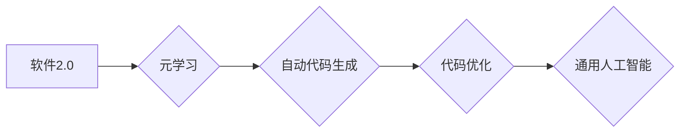

> 通用人工智能，软件2.0，深度学习，神经网络，元学习，可解释性，安全可靠性

## 1. 背景介绍

通用人工智能 (Artificial General Intelligence, AGI) 始终是人工智能领域最具挑战性和吸引力的目标。AGI 旨在创造能够像人类一样学习、理解和解决各种复杂问题的智能系统。然而，现有的人工智能技术主要局限于特定领域，缺乏人类般的泛化能力和适应性。

软件2.0 作为一种新兴的软件开发范式，强调代码的可解释性、可维护性和可扩展性。它通过引入元学习、自动代码生成和代码优化等技术，旨在提升软件开发效率和质量。

近年来，随着深度学习和神经网络的快速发展，人工智能取得了显著进展。然而，深度学习模型的复杂性和黑盒属性仍然是其应用的瓶颈。

我们认为，将软件2.0 的理念应用于人工智能领域，有可能推动通用人工智能的实现。

## 2. 核心概念与联系

**软件2.0** 是一种基于元学习、自动代码生成和代码优化等技术的软件开发范式。它旨在构建更智能、更可解释、更可维护的软件系统。

**通用人工智能 (AGI)** 旨在创造能够像人类一样学习、理解和解决各种复杂问题的智能系统。

**核心概念联系：**

* 软件2.0 的元学习能力可以用于训练更强大的人工智能模型，使其具备更强的泛化能力和学习能力。
* 软件2.0 的自动代码生成技术可以帮助构建更复杂的 AI 系统，并提高开发效率。
* 软件2.0 的代码优化技术可以提高 AI 系统的运行效率和性能。

**Mermaid 流程图：**



## 3. 核心算法原理 & 具体操作步骤

### 3.1  算法原理概述

软件2.0 中的核心算法原理包括：

* **元学习:** 元学习是一种学习如何学习的学习方法。它通过学习多个任务的学习策略，从而能够更有效地学习新的任务。
* **自动代码生成:** 自动代码生成技术利用机器学习算法，从自然语言描述或代码示例中自动生成代码。
* **代码优化:** 代码优化技术利用静态分析和动态分析等方法，对代码进行优化，提高代码的运行效率和性能。

### 3.2  算法步骤详解

**元学习算法步骤:**

1. 收集多个任务的数据集。
2. 训练一个元学习模型，该模型能够学习多个任务的学习策略。
3. 使用训练好的元学习模型，对新的任务进行学习。

**自动代码生成算法步骤:**

1. 收集代码示例数据集。
2. 训练一个代码生成模型，该模型能够从自然语言描述或代码示例中生成代码。
3. 使用训练好的代码生成模型，根据自然语言描述或代码示例生成代码。

**代码优化算法步骤:**

1. 对代码进行静态分析，识别代码中的潜在问题。
2. 对代码进行动态分析，收集代码运行时的性能数据。
3. 根据静态分析和动态分析的结果，对代码进行优化。

### 3.3  算法优缺点

**元学习算法:**

* **优点:** 能够学习多个任务的学习策略，提高学习效率和泛化能力。
* **缺点:** 需要大量的训练数据和计算资源。

**自动代码生成算法:**

* **优点:** 可以提高代码开发效率，减少代码编写错误。
* **缺点:** 生成的代码可能不够完善，需要人工进行修改和完善。

**代码优化算法:**

* **优点:** 可以提高代码运行效率和性能。
* **缺点:** 可能会增加代码复杂度，需要专业的知识进行操作。

### 3.4  算法应用领域

* **元学习算法:** 机器学习、自然语言处理、计算机视觉等领域。
* **自动代码生成算法:** 软件开发、代码维护、代码测试等领域。
* **代码优化算法:** 游戏开发、高性能计算、嵌入式系统开发等领域。

## 4. 数学模型和公式 & 详细讲解 & 举例说明

### 4.1  数学模型构建

元学习算法通常使用强化学习的框架进行构建。

**状态空间:** 包含任务的当前状态信息。

**动作空间:** 包含可以执行的动作集合。

**奖励函数:** 根据任务的完成情况给予奖励。

**策略网络:** 学习将状态映射到动作的策略。

### 4.2  公式推导过程

强化学习的目标是最大化累积奖励。

**Bellman 方程:**

$$
V(s) = \max_a \left[ R(s, a) + \gamma \sum_{s'} P(s' | s, a) V(s') \right]
$$

其中:

* $V(s)$ 是状态 $s$ 的价值函数。
* $R(s, a)$ 是在状态 $s$ 执行动作 $a$ 得到的奖励。
* $\gamma$ 是折扣因子，控制未来奖励的权重。
* $P(s' | s, a)$ 是从状态 $s$ 执行动作 $a$ 到状态 $s'$ 的转移概率。

### 4.3  案例分析与讲解

**Meta-Learning for Few-Shot Learning:**

Meta-Learning for Few-Shot Learning 算法利用元学习技术，在少量样本的情况下学习新的任务。

该算法通过训练一个元学习模型，该模型能够学习多个任务的学习策略。然后，在新的任务上，使用训练好的元学习模型进行快速适应。

## 5. 项目实践：代码实例和详细解释说明

### 5.1  开发环境搭建

* Python 3.7+
* TensorFlow 2.0+
* PyTorch 1.0+

### 5.2  源代码详细实现

```python
# 元学习算法示例代码

import tensorflow as tf

# 定义元学习模型
class MetaLearner(tf.keras.Model):
    def __init__(self, input_shape, num_classes):
        super(MetaLearner, self).__init__()
        self.layers = tf.keras.Sequential([
            tf.keras.layers.Flatten(input_shape=input_shape),
            tf.keras.layers.Dense(128, activation='relu'),
            tf.keras.layers.Dense(num_classes, activation='softmax')
        ])

    def call(self, inputs):
        return self.layers(inputs)

# 定义训练函数
def train_meta_learner(model, train_data, epochs):
    optimizer = tf.keras.optimizers.Adam(learning_rate=0.001)
    for epoch in range(epochs):
        for batch in train_data:
            # 训练模型
            with tf.GradientTape() as tape:
                loss = model(batch['inputs'], batch['labels'])
            gradients = tape.gradient(loss, model.trainable_variables)
            optimizer.apply_gradients(zip(gradients, model.trainable_variables))
        print(f'Epoch {epoch+1}/{epochs}, Loss: {loss.numpy()}')

# 训练元学习模型
model = MetaLearner(input_shape=(28, 28), num_classes=10)
train_data = ... # 训练数据
train_meta_learner(model, train_data, epochs=10)
```

### 5.3  代码解读与分析

* **MetaLearner 类:** 定义了元学习模型的结构，包括输入层、隐藏层和输出层。
* **train_meta_learner 函数:** 定义了元学习模型的训练过程，使用 Adam 优化器进行训练。
* **训练数据:** 需要准备包含多个任务的数据集，每个任务包含输入数据和标签数据。

### 5.4  运行结果展示

训练完成后，可以将训练好的元学习模型应用于新的任务中。

## 6. 实际应用场景

* **自动代码生成:** 可以根据自然语言描述自动生成代码，提高软件开发效率。
* **代码优化:** 可以自动优化代码，提高代码运行效率和性能。
* **人工智能模型训练:** 可以利用元学习技术，在少量样本的情况下训练人工智能模型。

### 6.4  未来应用展望

* **更智能的软件系统:** 软件2.0 的理念将推动软件系统朝着更智能、更可解释、更可维护的方向发展。
* **更强大的人工智能:** 将软件2.0 的理念应用于人工智能领域，有可能推动通用人工智能的实现。
* **新的应用场景:** 软件2.0 的技术将应用于更多新的领域，例如医疗、教育、金融等。

## 7. 工具和资源推荐

### 7.1  学习资源推荐

* **书籍:**
    * 《软件2.0》
    * 《深度学习》
* **在线课程:**
    * Coursera: 深度学习
    * Udacity: 自动机器学习

### 7.2  开发工具推荐

* **Python:** 
* **TensorFlow:** 深度学习框架
* **PyTorch:** 深度学习框架

### 7.3  相关论文推荐

* **Meta-Learning with Differentiable Convex Optimization**
* **Few-Shot Learning with Meta-Learning**

## 8. 总结：未来发展趋势与挑战

### 8.1  研究成果总结

软件2.0 和通用人工智能是人工智能领域的两大重要方向。将这两者结合起来，有可能推动人工智能的发展迈向新的阶段。

### 8.2  未来发展趋势

* **更强大的元学习算法:** 研究更强大的元学习算法，使其能够学习更复杂的学习策略。
* **更智能的代码生成技术:** 研究更智能的代码生成技术，使其能够生成更完善、更符合人类思维的代码。
* **更可解释的 AI 系统:** 研究更可解释的 AI 系统，使其能够更好地被人类理解和信任。

### 8.3  面临的挑战

* **数据获取和标注:** 元学习算法需要大量的训练数据，而获取和标注这些数据非常困难。
* **模型复杂度:** 元学习模型非常复杂，训练和部署这些模型需要大量的计算资源。
* **可解释性:** AI 系统的决策过程往往难以被人类理解，这可能会导致信任问题。

### 8.4  研究展望

未来，我们将继续致力于研究软件2.0 和通用人工智能的结合，并努力克服面临的挑战，推动人工智能技术的发展。

## 9. 附录：常见问题与解答

* **什么是软件2.0？**

软件2.0 是一种基于元学习、自动代码生成和代码优化等技术的软件开发范式。

* **软件2.0 和通用人工智能有什么关系？**

将软件2.0 的理念应用于人工智能领域，有可能推动通用人工智能的实现。

* **软件2.0 的应用场景有哪些？**

软件2.0 的应用场景包括自动代码生成、代码优化、人工智能模型训练等。

作者：禅与计算机程序设计艺术 / Zen and the Art of Computer Programming


<end_of_turn>