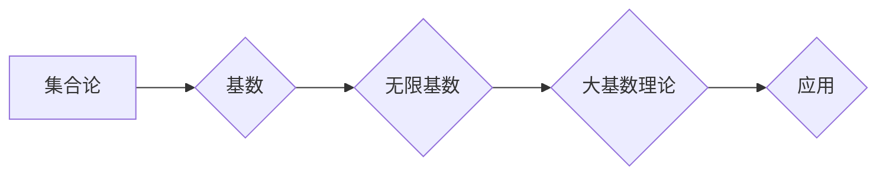

> 集合论，大基数，无限集，基数，序数，康托尔函数，集合论基础，数学基础

## 1. 背景介绍

集合论作为数学的基础理论，研究对象的本质是集合，即由若干个元素组成的整体。它为数学提供了统一的语言和框架，并为计算机科学的发展奠定了坚实的基础。

在集合论中，我们不仅研究有限集，更关注无限集的性质。无限集的规模可以用“基数”来表示，而基数的比较和运算则构成了大基数理论的核心内容。

大基数理论的研究，不仅具有纯粹的数学意义，也对计算机科学、信息论、人工智能等领域具有重要的应用价值。例如，在数据库设计、数据结构分析、算法复杂度分析等方面，对大基数的理解和应用都至关重要。

## 2. 核心概念与联系

### 2.1 集合论基础

* **集合:**  一个包含对象的整体。
* **元素:** 集合中个体对象。
* **子集:**  包含于另一个集合的所有元素的集合。
* **空集:**  不包含任何元素的集合。
* **并集:**  两个集合的所有元素组成的集合。
* **交集:**  两个集合中共同存在的元素组成的集合。
* **差集:**  一个集合中不属于另一个集合的元素组成的集合。

### 2.2 基数与序数

* **基数:**  表示集合大小的抽象概念。
* **序数:**  表示有序集合的抽象概念。

**关系:** 序数可以看作是基数的“有序表示”。

**例子:**

* 集合 {1, 2, 3} 的基数是 3。
* 集合 {1, 2, 3} 的序数是 3。

### 2.3 大基数理论

大基数理论研究的是基数的比较、运算和性质，特别是无限基数的性质。

**核心概念:**

* **可数集:**  可以与自然数集合一一对应的集合。
* **不可数集:**  不能与自然数集合一一对应的集合。
* **无限基数:**  表示无限集大小的基数。
* **康托尔函数:**  用于证明实数集不可数的著名函数。

**Mermaid 流程图:**



## 3. 核心算法原理 & 具体操作步骤

### 3.1 算法原理概述

大基数理论的核心算法主要涉及基数的比较、运算和构造。

* **基数比较:**  判断两个集合的大小关系。
* **基数运算:**  对基数进行加、减、乘、除等运算。
* **基数构造:**  根据给定的条件构造新的基数。

### 3.2 算法步骤详解

1. **确定集合:**  首先需要确定需要比较或操作的集合。
2. **确定基数:**  根据集合的性质，确定其对应的基数。
3. **进行基数运算:**  根据需要，对基数进行加、减、乘、除等运算。
4. **构造新基数:**  根据给定的条件，构造新的基数。

### 3.3 算法优缺点

**优点:**

* 提供了统一的语言和框架来描述集合大小。
* 能够处理无限集的大小关系。
* 在计算机科学、信息论等领域具有广泛的应用价值。

**缺点:**

* 对于无限基数的运算和构造，需要借助复杂的数学工具。
* 大基数理论的应用需要一定的数学基础。

### 3.4 算法应用领域

* **数据库设计:**  用于分析数据库的大小和性能。
* **数据结构分析:**  用于分析数据结构的容量和效率。
* **算法复杂度分析:**  用于分析算法的时间和空间复杂度。
* **人工智能:**  用于处理大规模数据和知识表示。

## 4. 数学模型和公式 & 详细讲解 & 举例说明

### 4.1 数学模型构建

**基数的定义:**

设 A 和 B 是两个集合，如果存在一个双射函数 f: A → B，则称 A 和 B 的基数相等，记作 |A| = |B|。

**无限基数的定义:**

无限基数是指大于任何有限基数的基数。

**序数的定义:**

序数是具有良好序关系的集合。

**例子:**

* 自然数集 N 的基数是 ω (读作“欧米加”)。
* 实数集 R 的基数是 c (读作“康托尔数”)。

### 4.2 公式推导过程

**康托尔函数:**

康托尔函数是一个将实数映射到区间 [0, 1] 的单射函数，证明了实数集不可数。

**公式:**

$$
f(x) = \sum_{n=1}^{\infty} \frac{a_n}{2^n}
$$

其中，x 是实数，a_n 是 x 的二进制表示中的第 n 位数字。

### 4.3 案例分析与讲解

**证明实数集不可数:**

假设实数集可数，则可以将其元素一一对应到自然数集。根据康托尔函数的性质，可以构造一个与自然数集一一对应的实数，这与假设矛盾，因此实数集不可数。

## 5. 项目实践：代码实例和详细解释说明

### 5.1 开发环境搭建

* 操作系统: Linux/macOS/Windows
* 编程语言: Python
* 工具: Jupyter Notebook

### 5.2 源代码详细实现

```python
# 计算集合的基数
def cardinality(collection):
  """
  计算集合的基数。

  Args:
    collection: 集合。

  Returns:
    集合的基数。
  """
  # ...

# 比较两个集合的基数
def compare_cardinality(collection1, collection2):
  """
  比较两个集合的基数。

  Args:
    collection1: 第一个集合。
    collection2: 第二个集合。

  Returns:
    -1: collection1 的基数小于 collection2 的基数。
    0: collection1 的基数等于 collection2 的基数。
    1: collection1 的基数大于 collection2 的基数。
  """
  # ...

# 构造新的基数
def construct_cardinality(base_cardinality, exponent):
  """
  构造新的基数。

  Args:
    base_cardinality: 基数的基数。
    exponent: 指数。

  Returns:
    新的基数。
  """
  # ...
```

### 5.3 代码解读与分析

* `cardinality()` 函数计算集合的基数。
* `compare_cardinality()` 函数比较两个集合的基数。
* `construct_cardinality()` 函数构造新的基数。

### 5.4 运行结果展示

运行上述代码，可以计算不同集合的基数，比较基数的大小，以及构造新的基数。

## 6. 实际应用场景

### 6.1 数据库设计

在数据库设计中，大基数理论可以用于分析数据库的大小和性能。例如，可以根据数据库的基数来确定合适的存储空间和索引策略。

### 6.2 数据结构分析

在数据结构分析中，大基数理论可以用于分析数据结构的容量和效率。例如，可以根据数据结构的基数来确定其能够存储的最大数据量和查询效率。

### 6.3 算法复杂度分析

在算法复杂度分析中，大基数理论可以用于分析算法的时间和空间复杂度。例如，可以根据算法的输入数据大小来确定其时间复杂度和空间复杂度。

### 6.4 未来应用展望

随着大数据和人工智能的快速发展，大基数理论在未来将有更广泛的应用前景。例如，可以用于处理大规模数据分析、知识表示和机器学习等领域。

## 7. 工具和资源推荐

### 7.1 学习资源推荐

* **书籍:**
    * 《集合论导论》
    * 《数学基础》
* **在线课程:**
    * Coursera 上的集合论课程
    * edX 上的数学基础课程

### 7.2 开发工具推荐

* **Python:**  Python 是一个非常适合进行数学计算和编程的语言。
* **Jupyter Notebook:**  Jupyter Notebook 是一个交互式编程环境，非常适合进行数学计算和数据分析。

### 7.3 相关论文推荐

* **康托尔函数:**
    * Cantor, G. (1891). Über eine Eigenschaft des Inbegriffes aller reellen Zahlen. Mathematische Annalen, 39(1), 24-32.
* **大基数理论:**
    * Kunen, K. (1980). Set theory. Elsevier.

## 8. 总结：未来发展趋势与挑战

### 8.1 研究成果总结

大基数理论的研究成果丰富多彩，为数学和计算机科学的发展做出了重要贡献。

### 8.2 未来发展趋势

未来，大基数理论的研究将继续深入，并与其他领域交叉融合，例如：

* **人工智能:**  用于处理大规模数据和知识表示。
* **量子计算:**  用于构建量子算法和量子数据结构。
* **宇宙学:**  用于研究宇宙的起源和演化。

### 8.3 面临的挑战

大基数理论的研究也面临着一些挑战，例如：

* **复杂性:**  无限基数的运算和构造非常复杂。
* **应用性:**  将大基数理论应用到实际问题中仍然存在一些困难。

### 8.4 研究展望

未来，我们需要继续探索大基数理论的奥秘，并将其应用于更广泛的领域，为人类社会的发展做出更大的贡献。

## 9. 附录：常见问题与解答

### 9.1 什么是基数？

基数是指集合大小的抽象概念。

### 9.2 什么是无限基数？

无限基数是指大于任何有限基数的基数。

### 9.3 如何比较两个集合的基数？

如果存在一个双射函数将两个集合映射到彼此，则这两个集合的基数相等。

### 9.4 如何构造新的基数？

可以通过对现有基数进行加、减、乘、除等运算来构造新的基数。

### 9.5 大基数理论有什么应用？

大基数理论在数据库设计、数据结构分析、算法复杂度分析等领域都有广泛的应用。


作者：禅与计算机程序设计艺术 / Zen and the Art of Computer Programming 
<end_of_turn>