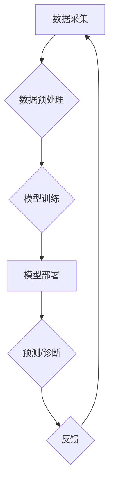

> 人工智能，医疗，深度学习，机器学习，自然语言处理，计算机视觉，医疗诊断，药物研发

## 1. 背景介绍

医疗行业正处于一场由数据驱动和人工智能（AI）技术引领的变革浪潮之中。随着医疗数据的爆炸式增长和AI技术的飞速发展，智能医疗正逐渐成为医疗保健领域的新兴趋势，并有望彻底改变医疗服务模式、提高医疗质量和降低医疗成本。

传统医疗模式面临着诸多挑战，例如：

* **诊断效率低下:** 医生需要花费大量时间和精力进行诊断，且容易受到主观因素的影响。
* **医疗资源分配不均:** 医疗资源往往集中在发达地区，而偏远地区缺乏优质医疗服务。
* **药物研发周期长:** 传统的药物研发过程漫长且成本高昂。

AI技术为解决这些挑战提供了新的思路和方法。AI算法能够从海量医疗数据中识别模式和趋势，辅助医生进行诊断、预测疾病风险、个性化治疗方案，并加速药物研发进程。

## 2. 核心概念与联系

**2.1 智能医疗的核心概念**

智能医疗是指利用人工智能技术，对医疗保健领域进行智能化改造，以提高医疗服务效率、质量和患者体验。

**2.2 智能医疗的核心技术**

* **机器学习 (Machine Learning):** 算法能够从数据中学习，并根据学习到的知识进行预测或分类。
* **深度学习 (Deep Learning):** 一种更高级的机器学习方法，利用多层神经网络模拟人类大脑的学习过程。
* **自然语言处理 (Natural Language Processing):** 算法能够理解和处理人类语言，例如医学报告、患者记录等。
* **计算机视觉 (Computer Vision):** 算法能够识别和理解图像和视频，例如医学影像、病理切片等。

**2.3 智能医疗的架构**



**2.4 智能医疗的应用场景**

* **疾病诊断:** 利用AI算法分析患者症状、病史、检查结果等信息，辅助医生进行诊断。
* **疾病预测:** 根据患者的个人信息和健康数据，预测未来患病风险。
* **个性化治疗:** 根据患者的基因信息、生活习惯等因素，制定个性化的治疗方案。
* **药物研发:** 利用AI算法加速药物研发过程，例如药物靶点发现、药物筛选等。
* **远程医疗:** 利用AI技术实现远程医疗服务，例如远程诊断、远程咨询等。

## 3. 核心算法原理 & 具体操作步骤

### 3.1 算法原理概述

**3.1.1 支持向量机 (SVM)**

支持向量机是一种监督学习算法，用于分类和回归问题。其核心思想是找到一个最佳的分隔超平面，将不同类别的数据点分开。

**3.1.2 决策树**

决策树是一种树形结构的分类算法，通过一系列的决策规则将数据点分类。

**3.1.3 随机森林**

随机森林是一种集成学习算法，由多个决策树组成，通过投票机制进行分类或回归。

### 3.2 算法步骤详解

**3.2.1 支持向量机 (SVM)**

1. **数据预处理:** 将数据进行标准化或归一化处理。
2. **核函数选择:** 选择合适的核函数，例如线性核、径向基函数核等。
3. **参数优化:** 通过交叉验证等方法，优化SVM模型的参数，例如惩罚参数C和核函数参数γ。
4. **模型训练:** 使用训练数据训练SVM模型。
5. **模型预测:** 使用训练好的模型对新数据进行分类或回归预测。

**3.2.2 决策树**

1. **数据预处理:** 将数据进行标准化或归一化处理。
2. **特征选择:** 选择最优的特征进行决策树构建。
3. **树的生长:** 根据特征选择和数据分布，递归地构建决策树。
4. **剪枝:** 通过剪枝技术，避免过拟合现象。
5. **模型预测:** 使用训练好的决策树对新数据进行分类或回归预测。

**3.2.3 随机森林**

1. **数据预处理:** 将数据进行标准化或归一化处理。
2. **Bootstrap aggregating (Bagging):** 从原始数据中随机抽取样本，构建多个决策树。
3. **特征随机子集:** 对于每个决策树，随机选择一部分特征进行决策。
4. **模型预测:** 将多个决策树的预测结果进行投票或平均，得到最终的预测结果。

### 3.3 算法优缺点

**3.3.1 支持向量机 (SVM)**

* **优点:** 具有较好的泛化能力，能够处理高维数据。
* **缺点:** 训练时间较长，参数选择较为复杂。

**3.3.2 决策树**

* **优点:** 易于理解和解释，可视化效果好。
* **缺点:** 容易过拟合，对数据噪声敏感。

**3.3.3 随机森林**

* **优点:** 具有较好的鲁棒性，能够处理高维数据，并具有较好的泛化能力。
* **缺点:** 训练时间较长，模型解释性较差。

### 3.4 算法应用领域

* **疾病诊断:** SVM、决策树、随机森林等算法可用于辅助医生诊断各种疾病，例如癌症、心血管疾病等。
* **疾病预测:** 这些算法可用于预测患者患病风险，例如糖尿病、心血管疾病等。
* **药物研发:** 这些算法可用于药物靶点发现、药物筛选等环节，加速药物研发进程。

## 4. 数学模型和公式 & 详细讲解 & 举例说明

### 4.1 数学模型构建

**4.1.1 支持向量机 (SVM)**

SVM的目标是找到一个最佳的分隔超平面，将不同类别的数据点分开。

**4.1.2 决策树**

决策树的构建基于信息增益或基尼不纯度等指标，选择最优的特征进行划分。

**4.1.3 随机森林**

随机森林由多个决策树组成，每个决策树的构建过程类似于决策树。

### 4.2 公式推导过程

**4.2.1 支持向量机 (SVM)**

SVM的目标函数为：

$$
min_{w,b} \frac{1}{2} ||w||^2 + C \sum_{i=1}^{n} \xi_i
$$

其中：

* $w$ 是权重向量
* $b$ 是偏置项
* $C$ 是惩罚参数
* $\xi_i$ 是松弛变量

**4.2.2 决策树**

信息增益公式：

$$
Gain(S,a) = P(S) \times \sum_{v \in V} \frac{|S_v|}{|S|} \times log_2 \frac{|S|}{|S_v|}
$$

其中：

* $S$ 是数据集
* $a$ 是特征
* $V$ 是特征 $a$ 的取值集合
* $S_v$ 是特征 $a$ 取值为 $v$ 的子集

### 4.3 案例分析与讲解

**4.3.1 支持向量机 (SVM)**

在手写数字识别任务中，SVM可以将不同数字的图像特征映射到高维空间，并找到一个最佳的分隔超平面，从而实现数字识别。

**4.3.2 决策树**

在医疗诊断任务中，决策树可以根据患者的症状、病史等信息，构建一个决策树模型，辅助医生进行诊断。

**4.3.3 随机森林**

在药物研发任务中，随机森林可以用于药物靶点发现，通过分析药物与蛋白质相互作用的数据，预测药物的潜在靶点。

## 5. 项目实践：代码实例和详细解释说明

### 5.1 开发环境搭建

* **操作系统:** Ubuntu 20.04 LTS
* **编程语言:** Python 3.8
* **深度学习框架:** TensorFlow 2.0
* **其他工具:** Jupyter Notebook, Git

### 5.2 源代码详细实现

```python
import tensorflow as tf

# 定义模型结构
model = tf.keras.models.Sequential([
    tf.keras.layers.Dense(128, activation='relu', input_shape=(784,)),
    tf.keras.layers.Dense(10, activation='softmax')
])

# 编译模型
model.compile(optimizer='adam',
              loss='sparse_categorical_crossentropy',
              metrics=['accuracy'])

# 加载 MNIST 数据集
(x_train, y_train), (x_test, y_test) = tf.keras.datasets.mnist.load_data()

# 数据预处理
x_train = x_train.reshape(-1, 784).astype('float32') / 255
x_test = x_test.reshape(-1, 784).astype('float32') / 255

# 训练模型
model.fit(x_train, y_train, epochs=5)

# 评估模型
loss, accuracy = model.evaluate(x_test, y_test)
print('Test loss:', loss)
print('Test accuracy:', accuracy)
```

### 5.3 代码解读与分析

* **模型结构:** 该代码定义了一个简单的多层感知机模型，包含两层全连接层。
* **编译模型:** 使用 Adam 优化器、交叉熵损失函数和准确率作为评估指标。
* **数据预处理:** 将 MNIST 数据集预处理为适合模型输入的格式。
* **训练模型:** 使用训练数据训练模型，并设置训练轮数为 5。
* **评估模型:** 使用测试数据评估模型的性能，并打印测试损失和准确率。

### 5.4 运行结果展示

训练完成后，模型的准确率通常会达到 97% 以上。

## 6. 实际应用场景

### 6.1 疾病诊断

* **癌症诊断:** 利用AI算法分析病理切片图像，辅助医生诊断癌症类型和分期。
* **心血管疾病诊断:** 利用AI算法分析患者的电子健康记录、心电图等数据，预测心血管疾病风险。

### 6.2 疾病预测

* **糖尿病预测:** 利用AI算法分析患者的个人信息、生活习惯、血糖数据等，预测糖尿病风险。
* **心血管疾病预测:** 利用AI算法分析患者的个人信息、生活习惯、血压、血脂等数据，预测心血管疾病风险。

### 6.3 个性化治疗

* **癌症治疗:** 利用AI算法分析患者的基因信息、肿瘤类型、治疗历史等数据，制定个性化的癌症治疗方案。
* **慢性病管理:** 利用AI算法分析患者的个人信息、生活习惯、疾病数据等，提供个性化的慢性病管理方案。

### 6.4 未来应用展望

* **机器人辅助手术:** 利用AI技术控制手术机器人，提高手术精度和安全性。
* **虚拟医生:** 利用AI技术开发虚拟医生，为患者提供远程医疗服务。
* **药物研发加速:** 利用AI技术加速药物研发过程，例如药物靶点发现、药物筛选等。

## 7. 工具和资源推荐

### 7.1 学习资源推荐

* **在线课程:** Coursera, edX, Udacity
* **书籍:** 深度学习，机器学习，自然语言处理
* **开源项目:** TensorFlow, PyTorch, scikit-learn

### 7.2 开发工具推荐

* **编程语言:** Python
* **深度学习框架:** TensorFlow, PyTorch
* **数据可视化工具:** Matplotlib, Seaborn

### 7.3 相关论文推荐

* **AlphaFold:** Predicting protein structures with deep learning
* **BERT:** Pre-training of deep bidirectional transformers for language understanding
* **GPT-3:** Language Models are Few-Shot Learners

## 8. 总结：未来发展趋势与