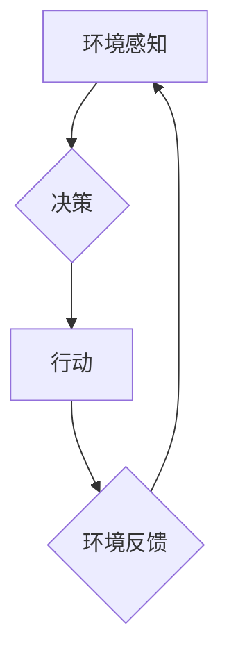

> AI Agent, 具身认知, 深度学习, 强化学习, 认知机器人, 人机交互, 仿生学

## 1. 背景介绍

人工智能（AI）已经取得了令人瞩目的进展，从语音识别到图像生成，AI技术在各个领域展现出强大的潜力。然而，当前的AI模型大多基于文本或图像数据，缺乏对物理世界的感知和交互能力。这限制了AI的应用范围，使其难以真正融入人类社会。

具身认知理论认为，认知能力是通过与物理世界交互而发展起来的。人类的认知能力不仅依赖于大脑的处理能力，也依赖于身体的感知和行动能力。因此，构建能够感知、理解和交互物理世界的AI代理（AI Agent）是AI发展的重要方向。

## 2. 核心概念与联系

**2.1 AI Agent**

AI Agent是指能够感知环境、做出决策并采取行动的智能体。它可以是软件程序、机器人或其他形式的智能系统。

**2.2 具身认知**

具身认知理论认为，认知能力是通过与物理世界交互而发展起来的。身体的感知和行动能力对认知能力的形成至关重要。

**2.3 联系**

AI Agent的具身认知能力是其与人类更紧密交互的关键。通过感知物理世界，AI Agent可以更好地理解人类的需求和意图，并做出更符合人类期望的决策。

**2.4 Mermaid 流程图**



## 3. 核心算法原理 & 具体操作步骤

**3.1 算法原理概述**

具身认知AI Agent的算法原理主要包括以下几个方面：

* **环境感知:** 利用传感器收集环境信息，例如视觉、听觉、触觉等。
* **知识表示:** 将感知到的环境信息转化为可理解的知识表示，例如符号、图谱等。
* **决策推理:** 基于知识表示和目标，进行决策推理，选择最优行动方案。
* **动作执行:** 将决策转化为具体的动作，并通过执行器与物理世界交互。

**3.2 算法步骤详解**

1. **环境感知:** AI Agent使用传感器收集环境信息，例如摄像头获取图像、麦克风获取音频等。
2. **数据预处理:** 对收集到的环境信息进行预处理，例如图像处理、音频分析等，提取有用的特征信息。
3. **知识表示:** 将预处理后的特征信息转化为可理解的知识表示，例如使用符号逻辑、知识图谱等。
4. **决策推理:** 基于知识表示和目标，使用决策推理算法，例如搜索算法、强化学习等，选择最优行动方案。
5. **动作执行:** 将决策转化为具体的动作，例如移动机器人、控制机械臂等，并通过执行器与物理世界交互。
6. **环境反馈:** AI Agent根据执行动作后的环境反馈，更新知识表示和目标，并进入下一个循环。

**3.3 算法优缺点**

* **优点:**

    * 能够感知和交互物理世界，更接近人类的认知能力。
    * 能够学习和适应环境变化，具有更强的泛化能力。
    * 能够解决传统AI模型难以解决的实际问题。

* **缺点:**

    * 算法复杂度高，需要大量的计算资源和数据。
    * 构建物理交互环境成本高，需要专业的硬件设备。
    * 算法训练时间长，需要大量的实验和迭代。

**3.4 算法应用领域**

* **机器人:** 构建能够自主导航、避障、抓取物体的机器人。
* **医疗:** 辅助医生进行手术、诊断疾病、提供个性化治疗方案。
* **制造业:** 自动化生产线、智能维护、质量检测。
* **教育:** 提供个性化学习体验、智能辅导、虚拟实验平台。

## 4. 数学模型和公式 & 详细讲解 & 举例说明

**4.1 数学模型构建**

具身认知AI Agent的数学模型可以基于以下几个方面构建：

* **状态空间:** 描述AI Agent感知到的环境状态，例如机器人位置、目标物位置等。
* **动作空间:** 描述AI Agent可以执行的动作，例如移动、旋转、抓取等。
* **奖励函数:** 描述AI Agent执行动作后的奖励，例如到达目标、抓取物体等。

**4.2 公式推导过程**

强化学习算法可以用来训练具身认知AI Agent。强化学习的目标是找到一个策略，使得AI Agent在环境中获得最大的累积奖励。

强化学习的核心公式是Bellman方程：

$$
V(s) = \max_a \left[ R(s, a) + \gamma \sum_{s'} P(s' | s, a) V(s') \right]
$$

其中：

* $V(s)$ 是状态 $s$ 的价值函数。
* $R(s, a)$ 是执行动作 $a$ 在状态 $s$ 后获得的奖励。
* $\gamma$ 是折扣因子，控制未来奖励的权重。
* $P(s' | s, a)$ 是执行动作 $a$ 在状态 $s$ 后转移到状态 $s'$ 的概率。

**4.3 案例分析与讲解**

例如，训练一个机器人导航到目标位置的AI Agent，可以将状态空间定义为机器人位置，动作空间定义为移动方向，奖励函数定义为到达目标位置获得最大奖励。通过强化学习算法，机器人可以学习到最优的导航策略。

## 5. 项目实践：代码实例和详细解释说明

**5.1 开发环境搭建**

* 操作系统: Ubuntu 20.04
* Python 版本: 3.8
* 库依赖: TensorFlow, PyTorch, ROS

**5.2 源代码详细实现**

```python
import tensorflow as tf

# 定义神经网络模型
model = tf.keras.models.Sequential([
    tf.keras.layers.Dense(128, activation='relu', input_shape=(input_dim,)),
    tf.keras.layers.Dense(64, activation='relu'),
    tf.keras.layers.Dense(num_actions)
])

# 定义损失函数和优化器
loss_fn = tf.keras.losses.CategoricalCrossentropy()
optimizer = tf.keras.optimizers.Adam()

# 训练模型
for epoch in range(num_epochs):
    for batch in dataset:
        with tf.GradientTape() as tape:
            predictions = model(batch['state'])
            loss = loss_fn(batch['action'], predictions)
        gradients = tape.gradient(loss, model.trainable_variables)
        optimizer.apply_gradients(zip(gradients, model.trainable_variables))

# 保存模型
model.save('agent_model.h5')
```

**5.3 代码解读与分析**

* 代码定义了一个简单的深度神经网络模型，用于预测AI Agent在不同状态下执行的动作。
* 使用强化学习算法训练模型，目标是最大化累积奖励。
* 训练完成后，将模型保存为文件，以便后续使用。

**5.4 运行结果展示**

训练好的AI Agent可以被部署到机器人或其他物理环境中，执行任务并与环境交互。

## 6. 实际应用场景

**6.1 智能机器人**

具身认知AI Agent可以赋予机器人更强的感知和交互能力，使其能够自主导航、避障、抓取物体等。

**6.2 医疗辅助**

AI Agent可以辅助医生进行手术、诊断疾病、提供个性化治疗方案，提高医疗效率和准确性。

**6.3 教育辅助**

AI Agent可以提供个性化学习体验、智能辅导、虚拟实验平台，帮助学生更好地理解知识。

**6.4 未来应用展望**

随着人工智能技术的发展，具身认知AI Agent将在更多领域得到应用，例如：

* **自动驾驶:** 构建能够感知道路环境、做出安全驾驶决策的自动驾驶系统。
* **工业自动化:** 自动化生产线、智能维护、质量检测等。
* **服务机器人:** 提供陪伴、家政、医疗等服务。

## 7. 工具和资源推荐

**7.1 学习资源推荐**

* **书籍:**

    * 《Reinforcement Learning: An Introduction》 by Richard S. Sutton and Andrew G. Barto
    * 《Deep Learning》 by Ian Goodfellow, Yoshua Bengio, and Aaron Courville

* **在线课程:**

    * Coursera: Reinforcement Learning Specialization
    * Udacity: Deep Learning Nanodegree

**7.2 开发工具推荐**

* **ROS (Robot Operating System):** 用于机器人开发的开源平台。
* **Gazebo:** 用于机器人仿真和测试的开源软件。
* **TensorFlow/PyTorch:** 用于深度学习模型开发的开源框架。

**7.3 相关论文推荐**

* **《Learning to Walk with Deep Reinforcement Learning》**
* **《DeepMind's AlphaGo: Mastering the Game of Go》**
* **《Human-Level Control Through Deep Reinforcement Learning》**

## 8. 总结：未来发展趋势与挑战

**8.1 研究成果总结**

近年来，具身认知AI Agent的研究取得了显著进展，例如AlphaGo、AlphaStar等AI系统展现出强大的学习和决策能力。

**8.2 未来发展趋势**

* **更强大的计算能力:** 随着计算能力的提升，AI Agent能够处理更复杂的环境和任务。
* **更丰富的传感器:** 更先进的传感器能够提供更丰富、更准确的环境信息。
* **更有效的算法:** 新的算法能够提高AI Agent的学习效率和决策准确性。

**8.3 面临的挑战**

* **数据获取和标注:** 构建具身认知AI Agent需要大量的真实世界数据，数据获取和标注成本高。
* **安全性和可靠性:** AI Agent在物理世界中的行为需要保证安全性和可靠性，避免造成意外伤害。
* **伦理问题:** AI Agent的决策可能会受到偏见的影响，需要解决伦理问题。

**8.4 研究展望**

未来，具身认知AI Agent将朝着更智能、更安全、更可靠的方向发展，并在更多领域发挥重要作用。


## 9. 附录：常见问题与解答

**9.1 如何构建具身认知AI Agent的知识表示？**

可以使用符号逻辑、知识图谱、神经网络等方法构建知识表示。

**9.2 如何训练具身认知AI Agent？**

可以使用强化学习算法训练具身认知AI Agent，目标是最大化累积奖励。

**9.3 具身认知AI Agent有哪些应用场景？**

具身认知AI Agent可以应用于智能机器人、医疗辅助、教育辅助等领域。


作者：禅与计算机程序设计艺术 / Zen and the Art of Computer Programming 
<end_of_turn>