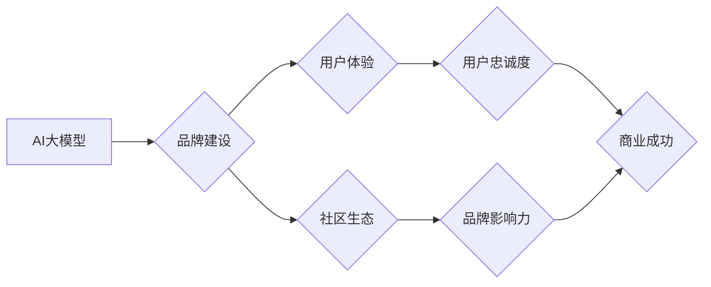

> AI大模型，品牌优势，创业，商业化，市场营销，技术创新，用户体验

## 1. 背景介绍

近年来，人工智能（AI）技术蓬勃发展，特别是大模型的涌现，为各行各业带来了革命性的变革。从自然语言处理到计算机视觉，从药物研发到金融预测，AI大模型正在深刻地改变着我们的生活和工作方式。

与此同时，越来越多的创业者看到了AI大模型的巨大商业潜力，纷纷涌入这个领域。然而，仅仅拥有先进的技术并不能保证创业项目的成功。在激烈的市场竞争中，品牌优势成为了一项至关重要的竞争力。

## 2. 核心概念与联系

**2.1 AI大模型**

AI大模型是指在海量数据上训练的深度学习模型，拥有强大的泛化能力和学习能力。它们能够处理复杂的任务，例如文本生成、图像识别、语音合成等。

**2.2 品牌优势**

品牌优势是指企业在市场上建立起来的独特价值和声誉，能够为企业带来持续的竞争优势。品牌优势的形成需要长期积累和经营，包括品牌认知度、品牌忠诚度、品牌溢价等方面。

**2.3 联系**

AI大模型创业者可以通过以下方式利用品牌优势：

* **打造独特的品牌形象:** 

   通过明确的品牌定位、独特的品牌故事和视觉识别系统，建立一个与众不同的品牌形象。

* **提供优质的用户体验:** 

   利用AI大模型的强大能力，为用户提供个性化、智能化的服务体验，提升用户满意度和忠诚度。

* **建立强大的社区生态:** 

   通过线上线下活动、论坛社区等方式，构建一个活跃的品牌社区，增强用户粘性和品牌影响力。

**2.4  Mermaid 流程图**



## 3. 核心算法原理 & 具体操作步骤

**3.1 算法原理概述**

AI大模型的训练主要基于深度学习算法，例如Transformer、BERT等。这些算法通过多层神经网络结构，学习数据中的复杂模式和关系，从而实现对数据的理解和预测。

**3.2 算法步骤详解**

1. **数据预处理:** 收集和清洗数据，将其转换为模型可理解的格式。
2. **模型构建:** 根据任务需求选择合适的深度学习模型架构，并设置模型参数。
3. **模型训练:** 使用训练数据训练模型，调整模型参数以最小化预测误差。
4. **模型评估:** 使用测试数据评估模型的性能，并进行必要的调整。
5. **模型部署:** 将训练好的模型部署到实际应用场景中。

**3.3 算法优缺点**

**优点:**

* 强大的泛化能力，能够处理复杂的任务。
* 学习能力强，能够从海量数据中提取有价值的信息。

**缺点:**

* 训练成本高，需要大量的计算资源和数据。
* 模型解释性差，难以理解模型的决策过程。

**3.4 算法应用领域**

* 自然语言处理：文本生成、机器翻译、问答系统等。
* 计算机视觉：图像识别、物体检测、图像生成等。
* 金融预测：股票预测、风险评估、欺诈检测等。
* 医疗诊断：疾病诊断、药物研发、医疗影像分析等。

## 4. 数学模型和公式 & 详细讲解 & 举例说明

**4.1 数学模型构建**

AI大模型的训练过程可以看作是一个优化问题，目标是找到一个模型参数向量，使得模型在训练数据上的预测误差最小。

**4.2 公式推导过程**

常用的损失函数包括均方误差（MSE）、交叉熵损失（Cross-Entropy Loss）等。

**均方误差（MSE）:**

$$MSE = \frac{1}{N} \sum_{i=1}^{N} (y_i - \hat{y}_i)^2$$

其中：

* $N$ 是样本数量。
* $y_i$ 是真实值。
* $\hat{y}_i$ 是模型预测值。

**交叉熵损失（Cross-Entropy Loss）:**

$$Cross-Entropy Loss = -\sum_{i=1}^{N} y_i \log(\hat{y}_i)$$

其中：

* $y_i$ 是真实值（one-hot编码）。
* $\hat{y}_i$ 是模型预测值（概率分布）。

**4.3 案例分析与讲解**

假设我们训练一个图像分类模型，目标是将图像分类为猫或狗。我们可以使用交叉熵损失函数来衡量模型的性能。

如果模型预测图像为猫的概率为0.8，而真实标签为猫，则损失值为：

$$Cross-Entropy Loss = -0.8 \log(0.8) \approx 0.22$$

## 5. 项目实践：代码实例和详细解释说明

**5.1 开发环境搭建**

* Python 3.x
* TensorFlow 或 PyTorch
* CUDA 和 cuDNN（可选，用于GPU加速）

**5.2 源代码详细实现**

```python
import tensorflow as tf

# 定义模型架构
model = tf.keras.models.Sequential([
    tf.keras.layers.Conv2D(32, (3, 3), activation='relu', input_shape=(28, 28, 1)),
    tf.keras.layers.MaxPooling2D((2, 2)),
    tf.keras.layers.Conv2D(64, (3, 3), activation='relu'),
    tf.keras.layers.MaxPooling2D((2, 2)),
    tf.keras.layers.Flatten(),
    tf.keras.layers.Dense(10, activation='softmax')
])

# 编译模型
model.compile(optimizer='adam',
              loss='sparse_categorical_crossentropy',
              metrics=['accuracy'])

# 训练模型
model.fit(x_train, y_train, epochs=10)

# 评估模型
loss, accuracy = model.evaluate(x_test, y_test)
print('Test loss:', loss)
print('Test accuracy:', accuracy)
```

**5.3 代码解读与分析**

这段代码定义了一个简单的卷积神经网络模型，用于手写数字识别任务。

* `tf.keras.models.Sequential` 创建了一个顺序模型，层级结构清晰。
* `tf.keras.layers.Conv2D` 定义卷积层，用于提取图像特征。
* `tf.keras.layers.MaxPooling2D` 定义最大池化层，用于降维和提高模型鲁棒性。
* `tf.keras.layers.Flatten` 将多维特征转换为一维向量。
* `tf.keras.layers.Dense` 定义全连接层，用于分类。
* `model.compile` 编译模型，设置优化器、损失函数和评价指标。
* `model.fit` 训练模型，使用训练数据进行迭代训练。
* `model.evaluate` 评估模型，使用测试数据计算损失和准确率。

**5.4 运行结果展示**

训练完成后，模型的准确率通常会达到较高的水平，例如98%以上。

## 6. 实际应用场景

**6.1 自然语言处理**

* **聊天机器人:** 利用AI大模型构建智能聊天机器人，提供个性化、自然流畅的对话体验。
* **文本生成:** 生成高质量的文本内容，例如新闻报道、广告文案、诗歌等。
* **机器翻译:** 实现准确、流畅的机器翻译，打破语言障碍。

**6.2 计算机视觉**

* **图像识别:** 自动识别图像中的物体、场景和人物，应用于安防监控、医疗诊断等领域。
* **图像生成:** 生成逼真的图像，应用于艺术创作、游戏开发等领域。
* **视频分析:** 分析视频内容，提取关键信息，应用于监控、体育赛事分析等领域。

**6.3 其他领域**

* **金融预测:** 利用AI大模型预测股票价格、风险评估、欺诈检测等。
* **医疗诊断:** 辅助医生进行疾病诊断、药物研发、医疗影像分析等。
* **教育领域:** 个性化学习推荐、智能答疑系统等。

**6.4 未来应用展望**

AI大模型的应用场景还在不断扩展，未来将更加深入地融入到我们的生活和工作中。例如：

* **个性化推荐:** 基于用户的行为数据和偏好，提供更加精准的商品、服务和内容推荐。
* **智能客服:** 利用AI大模型构建智能客服系统，提供24小时不间断的客户服务。
* **自动驾驶:** 利用AI大模型实现自动驾驶功能，提高交通安全和效率。

## 7. 工具和资源推荐

**7.1 学习资源推荐**

* **书籍:**
    * 《深度学习》
    * 《动手学深度学习》
    * 《AI 算法》

* **在线课程:**
    * Coursera
    * edX
    * Udacity

**7.2 开发工具推荐**

* **TensorFlow:** 开源深度学习框架，支持多种硬件平台。
* **PyTorch:** 开源深度学习框架，以其灵活性和易用性而闻名。
* **Jupyter Notebook:** 用于深度学习开发和可视化的交互式笔记本环境。

**7.3 相关论文推荐**

* **Attention Is All You Need:** https://arxiv.org/abs/1706.03762
* **BERT: Pre-training of Deep Bidirectional Transformers for Language Understanding:** https://arxiv.org/abs/1810.04805

## 8. 总结：未来发展趋势与挑战

**8.1 研究成果总结**

近年来，AI大模型取得了显著的进展，在自然语言处理、计算机视觉等领域取得了突破性成果。

**8.2 未来发展趋势**

* **模型规模的进一步扩大:** 随着计算资源的不断提升，AI大模型的规模将继续扩大，模型能力将进一步增强。
* **多模态学习:** AI大模型将能够处理多种数据类型，例如文本、图像、音频等，实现跨模态的理解和生成。
* **可解释性研究:** 如何提高AI大模型的解释性，使其决策过程更加透明，是未来研究的重要方向。

**8.3 面临的挑战**

* **数据获取和隐私保护:** AI大模型的训练需要海量数据，如何获取高质量数据并保护用户隐私是一个挑战。
* **计算资源需求:** 训练大型AI模型需要大量的计算资源，成本较高。
* **伦理问题:** AI大模型的应用可能带来一些伦理问题，例如算法偏见、信息安全等，需要引起重视和解决。

**8.4 研究展望**

未来，AI大模型将继续朝着更强大、更智能、更安全的方向发展，为人类社会带来更多福祉。


## 9. 附录：常见问题与解答

**9.1 如何选择合适的AI大模型？**

选择合适的AI大模型需要根据具体的应用场景和需求进行考虑。例如，对于文本生成任务，可以选择GPT-3等文本生成模型；对于图像识别任务，可以选择ResNet、EfficientNet等图像识别模型。

**9.2 如何训练自己的AI大模型？**

训练自己的AI大模型需要一定的技术基础和资源支持。可以参考开源框架的文档和教程，并根据自己的需求进行模型定制和训练。

**9.3 AI大模型的安全性如何保障？**

AI大模型的安全性需要从多个方面进行保障，例如数据安全、模型安全、部署安全等。需要采用相应的技术措施和安全策略，防止模型被恶意攻击或滥用。


作者：禅与计算机程序设计艺术 / Zen and the Art of Computer Programming 
<end_of_turn>