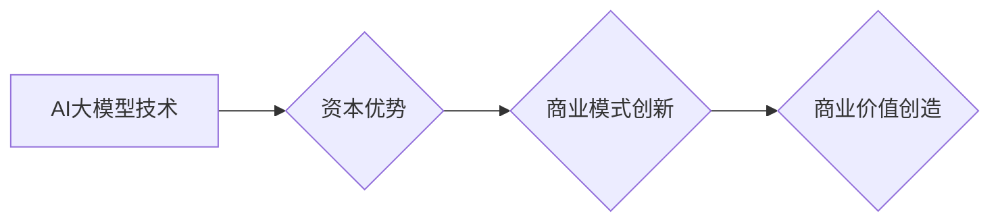

> AI大模型，创业，资本优势，商业模式，技术落地，风险控制，投资策略

## 1. 背景介绍

近年来，人工智能（AI）技术突飞猛进，特别是大模型的出现，为各行各业带来了革命性的变革。大模型，是指参数规模庞大、训练数据海量的人工智能模型，具备强大的泛化能力和学习能力，能够在自然语言处理、计算机视觉、语音识别等领域取得突破性进展。

随着大模型技术的成熟，越来越多的创业者看到了其中的商机，涌入AI大模型领域。然而，创业之路并非一帆风顺，如何利用资本优势，将大模型技术转化为商业价值，成为众多创业者面临的挑战。

## 2. 核心概念与联系

**2.1 AI大模型的本质**

AI大模型的核心在于其庞大的参数规模和海量训练数据。通过学习海量数据，大模型能够建立起复杂的知识表示和模式识别能力，从而实现对各种复杂任务的处理。

**2.2 资本优势的意义**

对于AI大模型创业公司来说，资本优势至关重要。充足的资金可以用于以下方面：

* **数据采集和标注:** 大模型的训练需要海量高质量的数据，数据采集和标注是前期投入的重要环节。
* **算力租赁:** 训练大模型需要强大的算力支持，租赁高性能计算集群是必要的投入。
* **人才招聘:** 吸引和留住顶尖的AI人才，是推动技术创新和产品开发的关键。
* **市场推广和销售:** 推广产品和服务，拓展市场份额，需要投入大量的营销和销售资源。

**2.3 资本优势与商业模式的结合**

资本优势可以帮助AI大模型创业公司构建可持续的商业模式。常见的商业模式包括：

* **SaaS模式:** 提供大模型API和平台服务，用户按需付费使用。
* **解决方案模式:** 为特定行业提供定制化的AI解决方案，例如医疗诊断、金融风险控制等。
* **数据服务模式:** 收集和分析海量数据，为企业提供数据洞察和决策支持。

**2.4 Mermaid 流程图**



## 3. 核心算法原理 & 具体操作步骤

**3.1 算法原理概述**

大模型的训练主要基于深度学习算法，其中Transformer模型是目前最主流的架构。Transformer模型通过自注意力机制，能够捕捉文本序列中的长距离依赖关系，从而实现更精准的理解和生成。

**3.2 算法步骤详解**

1. **数据预处理:** 将原始数据进行清洗、格式化和编码，例如分词、词向量化等。
2. **模型构建:** 根据Transformer模型架构，搭建模型结构，包括编码器、解码器和注意力机制等。
3. **模型训练:** 使用训练数据，通过反向传播算法，调整模型参数，使模型输出与真实标签尽可能接近。
4. **模型评估:** 使用测试数据，评估模型的性能，例如准确率、召回率等。
5. **模型部署:** 将训练好的模型部署到生产环境，用于实际应用。

**3.3 算法优缺点**

**优点:**

* 强大的泛化能力，能够处理各种复杂的任务。
* 能够捕捉文本序列中的长距离依赖关系。
* 训练数据量越大，模型性能越优越。

**缺点:**

* 训练成本高，需要大量的算力和时间。
* 模型参数规模庞大，部署和推理效率较低。
* 对训练数据的质量要求较高，数据偏差会影响模型性能。

**3.4 算法应用领域**

* 自然语言处理: 文本分类、情感分析、机器翻译、文本摘要等。
* 计算机视觉: 图像识别、目标检测、图像分割等。
* 语音识别: 语音转文本、语音合成等。
* 其他领域: 金融风险控制、医疗诊断、智能客服等。

## 4. 数学模型和公式 & 详细讲解 & 举例说明

**4.1 数学模型构建**

Transformer模型的核心是自注意力机制，其数学模型可以表示为：

$$
Attention(Q, K, V) = softmax(\frac{QK^T}{\sqrt{d_k}})V
$$

其中：

* $Q$：查询矩阵
* $K$：键矩阵
* $V$：值矩阵
* $d_k$：键向量的维度
* $softmax$：softmax函数

**4.2 公式推导过程**

自注意力机制通过计算查询向量与键向量的相似度，来确定每个值向量的权重，从而实现对文本序列的加权求和。

**4.3 案例分析与讲解**

假设我们有一个句子 "The cat sat on the mat"，将其转换为词向量表示，则 $Q$、$K$ 和 $V$ 矩阵分别为：

$$
Q = \begin{bmatrix}
q_1 & q_2 & q_3 & q_4 & q_5 & q_6
\end{bmatrix}
$$

$$
K = \begin{bmatrix}
k_1 & k_2 & k_3 & k_4 & k_5 & k_6
\end{bmatrix}
$$

$$
V = \begin{bmatrix}
v_1 & v_2 & v_3 & v_4 & v_5 & v_6
\end{bmatrix}
$$

其中 $q_i$、$k_i$ 和 $v_i$ 分别表示每个词的查询向量、键向量和值向量。

通过计算 $QK^T$，得到每个词对其他词的相似度得分，然后使用 softmax 函数归一化，得到每个词的权重。最后，将权重与值向量相乘，得到每个词的加权和，即为该词在句子中的表示。

## 5. 项目实践：代码实例和详细解释说明

**5.1 开发环境搭建**

* 操作系统: Ubuntu 20.04
* Python 版本: 3.8
* 框架: PyTorch 1.8

**5.2 源代码详细实现**

```python
import torch
import torch.nn as nn

class Transformer(nn.Module):
    def __init__(self, vocab_size, embedding_dim, num_heads, num_layers):
        super(Transformer, self).__init__()
        self.embedding = nn.Embedding(vocab_size, embedding_dim)
        self.transformer_layers = nn.ModuleList([
            nn.TransformerEncoderLayer(embedding_dim, num_heads)
            for _ in range(num_layers)
        ])
        self.linear = nn.Linear(embedding_dim, vocab_size)

    def forward(self, x):
        x = self.embedding(x)
        for layer in self.transformer_layers:
            x = layer(x)
        x = self.linear(x)
        return x
```

**5.3 代码解读与分析**

* `__init__` 方法: 初始化模型参数，包括词嵌入层、Transformer编码器层和输出层。
* `forward` 方法: 定义模型的正向传播过程，将输入序列经过词嵌入层、Transformer编码器层和输出层，最终得到输出序列。

**5.4 运行结果展示**

训练好的模型可以用于各种自然语言处理任务，例如文本分类、机器翻译等。

## 6. 实际应用场景

**6.1 文本分类**

大模型可以用于自动分类文本，例如新闻文章、社交媒体帖子等，根据其主题、情感等进行分类。

**6.2 机器翻译**

大模型可以实现机器翻译，将一种语言的文本翻译成另一种语言。

**6.3 智能客服**

大模型可以用于构建智能客服系统，自动回复用户的问题，提供24小时在线服务。

**6.4 未来应用展望**

随着大模型技术的不断发展，其应用场景将更加广泛，例如：

* 个性化教育: 根据学生的学习情况，提供个性化的学习方案。
* 医疗诊断: 辅助医生进行疾病诊断，提高诊断准确率。
* 科学研究: 加速科学研究的进程，发现新的知识。

## 7. 工具和资源推荐

**7.1 学习资源推荐**

* **书籍:**
    * 《深度学习》
    * 《自然语言处理》
* **在线课程:**
    * Coursera: 深度学习
    * Udacity: 自然语言处理
* **开源项目:**
    * HuggingFace Transformers

**7.2 开发工具推荐**

* **Python:** 
* **PyTorch:** 深度学习框架
* **TensorFlow:** 深度学习框架

**7.3 相关论文推荐**

* 《Attention Is All You Need》
* 《BERT: Pre-training of Deep Bidirectional Transformers for Language Understanding》

## 8. 总结：未来发展趋势与挑战

**8.1 研究成果总结**

近年来，AI大模型取得了显著的进展，在自然语言处理、计算机视觉等领域取得了突破性成果。

**8.2 未来发展趋势**

* 模型规模的进一步扩大
* 训练效率的提升
* 多模态大模型的开发
* 伦理和安全问题的研究

**8.3 面临的挑战**

* 训练成本高
* 数据偏差问题
* 伦理和安全问题

**8.4 研究展望**

未来，AI大模型将继续朝着更强大、更安全、更可解释的方向发展，为人类社会带来更多福祉。

## 9. 附录：常见问题与解答

**9.1 如何选择合适的AI大模型？**

选择合适的AI大模型需要根据具体的应用场景和需求进行考虑，例如模型规模、训练数据、性能指标等。

**9.2 如何解决数据偏差问题？**

数据偏差问题可以通过数据收集、数据清洗、数据增强等方法进行解决。

**9.3 如何保证AI大模型的安全性？**

AI大模型的安全性需要从模型设计、数据安全、部署环境等多个方面进行保障。


作者：禅与计算机程序设计艺术 / Zen and the Art of Computer Programming 
<end_of_turn>